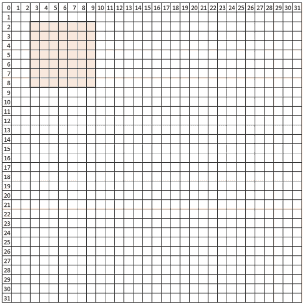
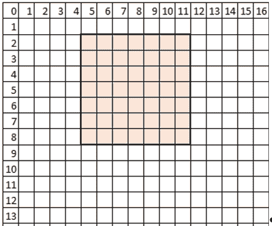
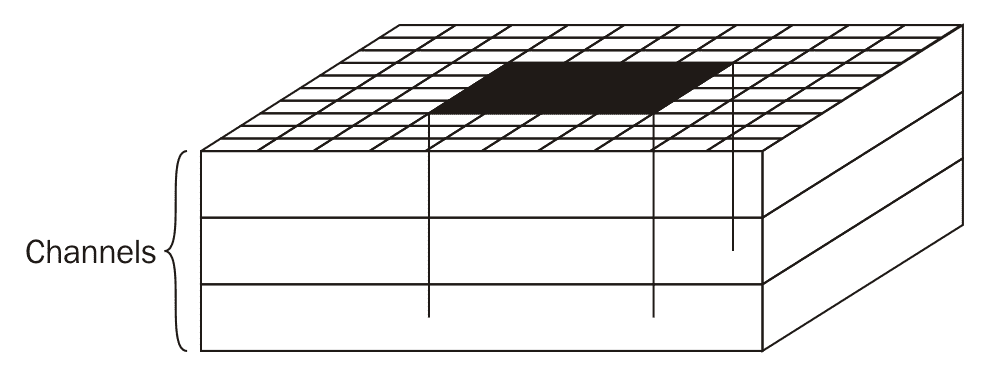
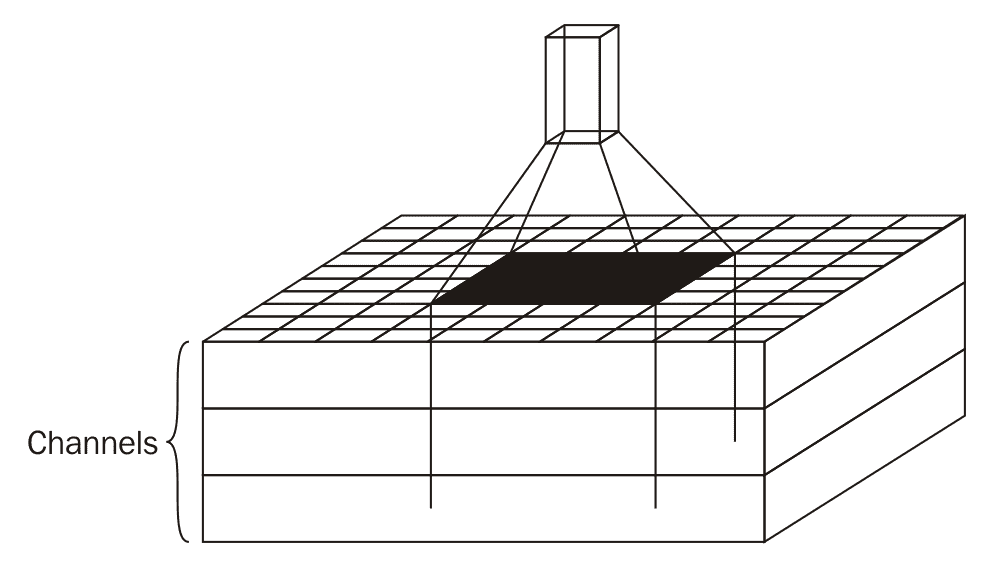
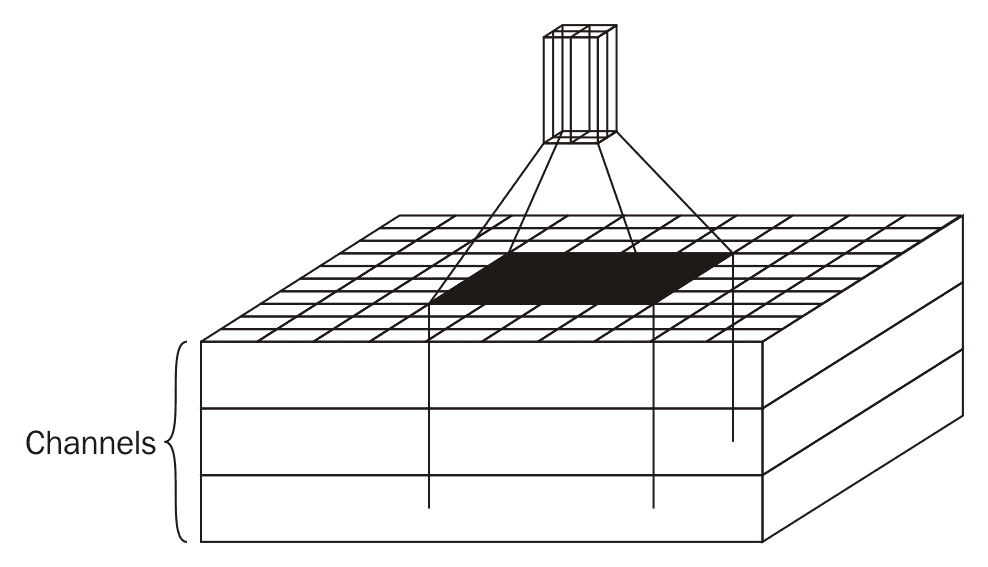
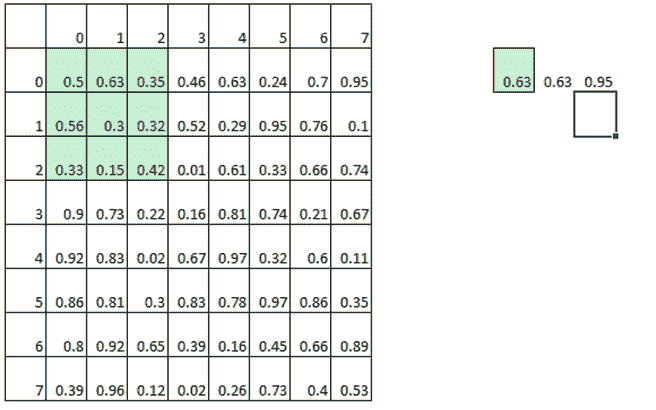
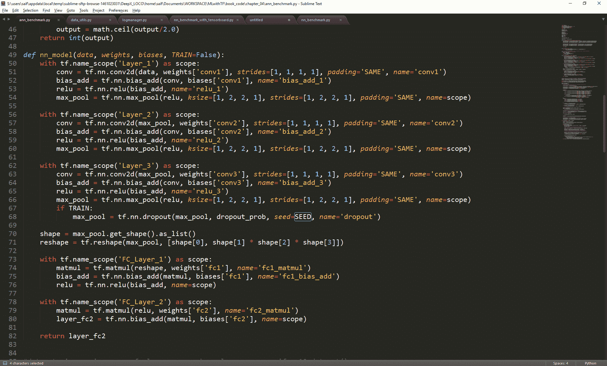
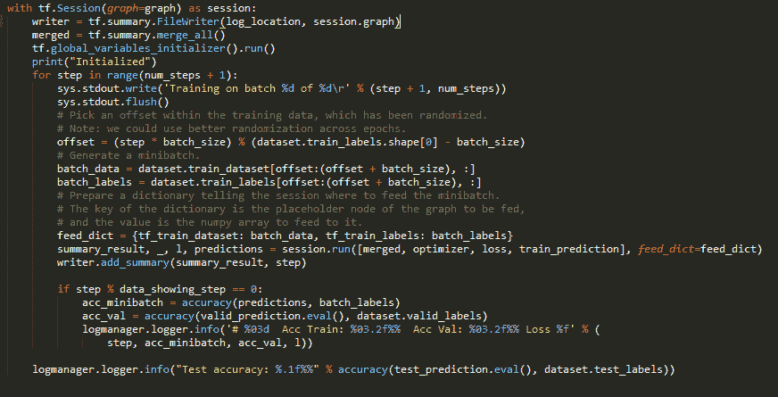
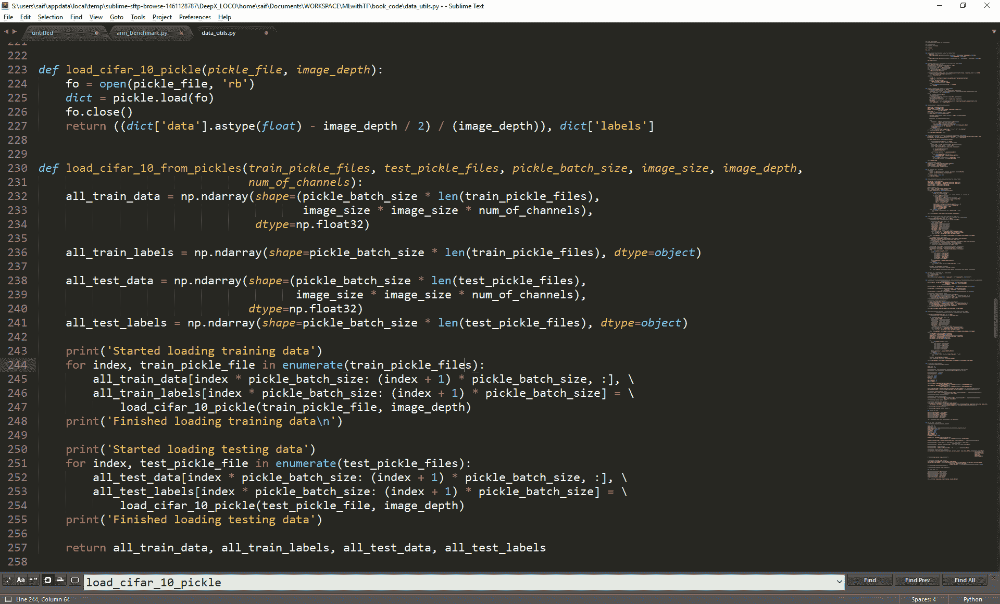
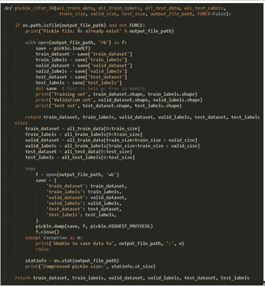

# 四、价值低的股票

回到[第二章](0197f632-3ce2-4032-9abd-83b3720c7127.xhtml) ，*你的第一个分类器*，我们为我们的字符识别工作构建了一个简单的神经网络。我们以 80%的正确率结束了这一章。良好的开端，但我们可以做得更好！

在这一章中，我们将用更强大的网络架构来改进我们早期的分类器。然后，我们将深入研究一个更加困难的问题——处理来自 CIFAR-10 数据集的彩色图像。图像将变得更加困难(猫、狗、飞机等等)，因此我们将带来更强大的工具——特别是卷积神经网络。我们开始吧。


# 重温 notMNIST

让我们通过尝试对我们在[第 2 章](0197f632-3ce2-4032-9abd-83b3720c7127.xhtml)、*您的第一个分类器*中使用的`notMNIST`数据集进行技术更改来开始我们的努力。您可以在阅读本章的过程中编写代码，也可以在该书的知识库中工作，网址为:

[https://github . com/mlwithtf/mlwithtf/blob/master/chapter _ 02/training . py](https://github.com/mlwithtf/mlwithtf/blob/master/chapter_02/training.py)。

我们将从以下导入开始:

```py
    import sys, os 
    import tensorflow as tf 
    sys.path.append(os.path.realpath('../..')) 
    from data_utils import * 
    from logmanager import * 
    import math
```

这里没有太多实质性的变化。真正的马力已经和`tensorflow`套装一起进口了。你会注意到我们重用了以前的`data_utils`作品。然而，我们需要一些改变。

与之前唯一不同的是`math`包，我们将用它来实现辅助`math`功能，比如`ceiling`。


# 程序配置

现在，让我们看看我们的旧程序配置，如下所示:

```py
    batch_size = 128 
    num_steps = 10000 
    learning_rate = 0.3 
    data_showing_step = 500 
```

这次我们需要更多的配置。下面是我们现在要用的:

```py
 batch_size = 32 
 num_steps = 30000 
 learning_rate = 0.1 
 data_showing_step = 500 
 model_saving_step = 2000 
 log_location = '/tmp/alex_nn_log' 

 SEED = 11215 

 patch_size = 5 
 depth_inc = 4 
 num_hidden_inc = 32 
 dropout_prob = 0.8 
 conv_layers = 3 
 stddev = 0.1 
```

前四种配置很常见:

*   我们仍然会训练一定数量的步数(`num_steps`)，就像我们之前做的那样。但是，你会注意到步数增加了。它们会变得更高，因为我们的数据集会更复杂，需要更多的训练。
*   稍后，我们将重新审视学习率(`learning_rate`)的微妙之处，但首先，您已经对它很熟悉了。
*   我们将每 500 步检查一次结果，这由`data_showing_step`变量控制。
*   最后，`log_location`控制我们的 TensorBoard 日志被倾倒在哪里。这一点我们从[第 3 章](a6bb2a79-d492-4620-a28b-72ec62523593.xhtml)、*tensor flow 工具箱*中已经相当熟悉了。我们将在本章中再次使用它，但这次没有解释。

下一个配置——随机种子变量**(`SEED`)会有所帮助。这可以不设置，TensorFlow 将在每次运行时随机化数字。然而，设置一个`seed`变量，并在运行中保持不变，将允许我们在调试系统时保持运行的一致性。如果你真的使用它，你可以把它设置成任何你想要的数字:你的生日，周年纪念日，第一个电话号码，或者幸运数字。我用我喜欢的街区的邮政编码。享受小事情。**

最后，我们将遇到七个新变量— `batch_size`、`patch_size`、`depth_inc`、`num_hidden_inc`、`conv_layers`、`stddev`和`dropout_prob`。这些是我们更新、更先进的**卷积神经网络**(**CNN**)如何工作的核心，并将在我们探索我们正在使用的网络时在上下文中介绍。


# 了解卷积网络

CNN 是更高级的神经网络，专门用于图像的机器学习。与我们之前使用的隐藏层不同，CNN 有一些层没有完全连接。这些卷积层除了宽度和高度之外，还有深度。一般原理是逐块分析图像。我们可以看到图像中的 7x7 补丁程序，如下所示:



这反映了一个 32x32 灰度图像，一个 7x7 补丁。从左向右滑动补片的示例如下:



如果这是一个彩色图像，我们将同时在三个相同的层上滑动我们的补丁。

你可能已经注意到我们把补丁移动了一个像素。这也是一种配置；我们可以滑动更多，也许每次滑动两个甚至三个像素。这是步幅配置。正如您所猜测的，步幅越大，我们最终覆盖的面片就越少，因此输出层就越小。

矩阵数学(我们不会在这里深入讨论)的执行是为了将面片(由通道数量驱动的完整深度)减少到输出深度列中。输出只是一个单一的高度和宽度，但许多像素深。当我们将补丁反复滑动时，深度列的序列形成具有新的长度、宽度和高度的块。

这里还有另一种配置——图像边缘的填充。可以想象，填充越多，补丁滑动和偏离图像边缘的空间就越大。这允许更大的步幅，因此输出体积具有更大的长度和宽度。您将在后面的代码中看到这一点，称为`padding='SAME'`或`padding='VALID'`。

让我们看看这些是怎么加起来的。我们将首先选择一个补丁:


然而，补丁不仅仅是正方形，而是整个深度(对于彩色图像):



然后，我们将卷积成一个 1x1 的体积，但有深度，如下图所示。最终体积的深度是可配置的，我们将在程序中使用`inct_depth`进行配置:



最后，当我们在原始映像中一遍又一遍地滑动修补程序时，我们将生成许多这样的 1x1xN 卷，这本身就创建了一个卷:



然后我们将它卷积成一个 1x1 的体积。

最后，我们将使用一个`POOL`操作来挤压生成的体积的每一层。有许多类型，但简单的**最大池**是典型的:



与我们之前使用的滑动补丁非常相似，将有一个补丁(除了这次，我们将使用最大数量的补丁)和一个步幅(这次，我们将需要更大的步幅来挤压图像)。我们实质上是在缩小规模。这里，我们将使用步幅为 2 的 3x3 面片。


# 重新审视配置

现在我们已经介绍了卷积神经网络，让我们重温一下我们之前遇到的配置:`batch_size`、`patch_size`、`depth_inc`、`num_hidden_inc`、`conv_layers`、`stddev`和`dropout_prob`:

*   批量大小(`batch_size`)
*   补丁大小(`patch_size`)
*   深度增量(`depth_inc`)
*   数字隐藏增量(`num_hidden_inc`)
*   卷积层(`conv_layers`)
*   标准偏差(`stddev`)
*   退出概率(`dropout_prob`


# 构建卷积网络

我们将跳过对两个效用函数的解释，重新格式化和精确度，因为我们已经在第二章、*你的第一个分类器*中遇到过。相反，我们将直接跳到神经网络配置。为了比较，下图显示了我们的模型来自[第 2 章](0197f632-3ce2-4032-9abd-83b3720c7127.xhtml)、*您的第一个分类器*，下图显示了我们的新模型。我们将在相同的`notMNIST`数据集上运行新模型，以查看我们将获得的准确性提升(提示:好消息！):


下图是我们的新模型:



首先，我们将遇到一个`helper`函数，如下所示:

```py
    def fc_first_layer_dimen(image_size, layers): 
       output = image_size 
       for x in range(layers): 
        output = math.ceil(output/2.0) 
       return int(output) 
```

然后，我们稍后将调用它，如下所示:

```py
    fc_first_layer_dimen(image_size, conv_layers) 
```

`fc_first_layer_dimen`功能计算第一个完全连接层的尺寸。回想一下 CNN 通常是如何使用一系列的层，一层又一层的小窗口。这里，我们决定将我们使用的每个卷积层的维度减少一半。这也说明了为什么输入图像可以被 2 的幂高度整除，从而使事情变得美好而干净。

现在让我们来解析实际的网络。这是使用`nn_model`方法生成的，稍后在训练模型时调用，并在针对验证和测试集进行测试时再次调用。

回想一下 CNN 通常由以下几层组成:

*   卷积层
*   校正的线性单位层
*   池层
*   完全连接的层

卷积层通常与 RELU 层成对出现并重复。这就是我们所做的——我们有三个几乎相同的 **CONV-RELU** 层堆叠在彼此之上。

每个成对的层显示如下:

```py
    with tf.name_scope('Layer_1') as scope: 
        conv = tf.nn.conv2d(data, weights['conv1'], strides=[1, 1, 
         1, 1], padding='SAME', name='conv1')        
        bias_add = tf.nn.bias_add(conv, biases['conv1'], 
         name='bias_add_1') 
        relu = tf.nn.relu(bias_add, name='relu_1') 
        max_pool = tf.nn.max_pool(relu, ksize=[1, 2, 2, 1], 
         strides=[1, 2, 2, 1], padding='SAME', name=scope)
```

三个几乎相同的层(`Layer_1`、`Layer_2`和`Layer_3`)之间的主要区别在于一个层的输出如何提供给系列中的下一个层。因此，第一层从接收数据(图像数据)开始，但第二层从接收第一层输出的池层开始，如下所示:

```py
    conv = tf.nn.conv2d(max_pool, weights['conv2'], strides=[1, 1, 1, 
     1], padding='SAME', name='conv2')
```

类似地，第三层从第二层的池层输出开始，如下所示:

```py
    conv = tf.nn.conv2d(max_pool, weights['conv3'], strides=[1, 1, 1, 
     1], padding='SAME', name='conv3')
```

三个`CONV` - `RELU`层之间还有另一个主要区别，即各层受到挤压。在使用如下几个`print`语句声明每个层之后，查看一下`conv`变量可能会有所帮助:

```py
    print "Layer 1 CONV", conv.get_shape() 
    print "Layer 2 CONV", conv.get_shape() 
    print "Layer 3 CONV", conv.get_shape() 
```

这将揭示以下结构:

```py
Layer 1 CONV (32, 28, 28, 4) 
Layer 2 CONV (32, 14, 14, 4) 
Layer 3 CONV (32, 7, 7, 4) 
Layer 1 CONV (10000, 28, 28, 4) 
Layer 2 CONV (10000, 14, 14, 4) 
Layer 3 CONV (10000, 7, 7, 4) 
Layer 1 CONV (10000, 28, 28, 4) 
Layer 2 CONV (10000, 14, 14, 4) 
Layer 3 CONV (10000, 7, 7, 4) 
```

我们用`notMNIST`数据集运行这个，所以我们会看到 28x28 的原始输入大小，这并不奇怪。更有趣的是连续层的大小——14x 14 和 7x7。注意连续卷积层的滤波器是如何被压缩的。

让我们让事情变得更有趣，检查整个堆栈。添加以下`print`语句来查看`CONV`、`RELU`和`POOL`层:

```py
 print "Layer 1 CONV", conv.get_shape() 
 print "Layer 1 RELU", relu.get_shape() 
 print "Layer 1 POOL", max_pool.get_shape() 
```

在另外两个`CONV` - `RELU` - `POOL`堆栈后添加类似的语句，您会发现以下输出:

```py
Layer 1 CONV (32, 28, 28, 4) 
Layer 1 RELU (32, 28, 28, 4) 
Layer 1 POOL (32, 14, 14, 4) 
Layer 2 CONV (32, 14, 14, 4) 
Layer 2 RELU (32, 14, 14, 4) 
Layer 2 POOL (32, 7, 7, 4) 
Layer 3 CONV (32, 7, 7, 4) 
Layer 3 RELU (32, 7, 7, 4) 
Layer 3 POOL (32, 4, 4, 4) 
... 
```

我们将忽略来自验证和测试实例的输出(它们是相同的，除了高度为 10000 而不是`32`，因为我们处理的是验证和测试集而不是小批量)。

我们将从输出中看到尺寸如何在`POOL`层(`28`到`14`)被挤压，以及该挤压如何被带到下一个`CONV`层。在第三层也是最后一层`POOL`，我们将以 4x4 的尺寸结束。

在最终的`CONV`堆栈上还有另一个特性——我们将在训练时使用的`dropout`层，如下所示:

```py
 max_pool = tf.nn.dropout(max_pool, dropout_prob, seed=SEED, 
  name='dropout')
```

这一层利用了我们之前设置的`dropout_prob = 0.8`配置。它随机丢弃该层上的神经元，通过禁止节点与具有丢弃的相邻节点协同适应来防止过拟合；它们永远不会依赖于某个特定节点的存在。

让我们继续通过我们的网络。我们将找到一个完全连接的层，后跟一个`RELU`:

```py
    with tf.name_scope('FC_Layer_1') as scope: 
        matmul = tf.matmul(reshape, weights['fc1'], 
         name='fc1_matmul')       
         bias_add = tf.nn.bias_add(matmul, biases['fc1'], 
         name='fc1_bias_add') 
        relu = tf.nn.relu(bias_add, name=scope) 
```

最后，我们将以完全连接的层结束，如下所示:

```py
    with tf.name_scope('FC_Layer_2') as scope: 
        matmul = tf.matmul(relu, weights['fc2'], 
         name='fc2_matmul')       
        layer_fc2 = tf.nn.bias_add(matmul, biases['fc2'], 
         name=scope)
```

这是典型的卷积网络。通常，我们将最终得到一个完全连接的层，最后是一个保存每个类分数的完全连接的层。

我们跳过了一些细节。我们的大多数层都是用另外三个值初始化的— `weights`、`biases`和`strides`:


`weights`和`biases`本身由其他变量初始化。我没说这很容易。

这里最重要的变量是`patch_size`，它表示我们在图像上滑动的过滤器的大小。回想一下，我们之前将其设置为 5，因此我们将使用 5x5 的补丁。我们还将再次介绍我们之前设置的`stddev`和`depth_inc`配置。


# 实现

现在，您可能有很多疑问——为什么是三层卷积层而不是两层或四层？为什么一步一个？为什么补丁大小为 5？为什么以完全连接的层结束而不是从它们开始？

这里有一些疯狂的方法。核心上，CNN 是围绕图像处理建立的，补丁是围绕所寻找的特征建立的。为什么有些配置工作得很好，而有些却不太好，这还不完全清楚，尽管一般规则确实遵循直觉。确切的网络架构是通过成千上万次的试验和许多错误发现、磨练和逐渐完善的。这仍然是一项研究级的任务。

从业者的一般方法通常是找到一个运行良好的现有架构(例如，AlexNet、GoogLeNet、ResNet ),并调整它们以用于特定的数据集。这就是我们所做的；我们从 AlexNet 开始，并对其进行了调整。也许，这并不令人满意，但这是有效的，并保持了 2016 年的实践状态。


# 训练日

然而，更令人满意的是看到我们的训练在进行，以及我们将如何改进我们之前所做的。

我们将准备如下的训练数据集和标签:

```py
    tf_train_dataset = tf.placeholder(tf.float32, 
    shape=(batch_size, image_size, image_size,   
    num_channels), 
    name='TRAIN_DATASET')    
    tf_train_labels = tf.placeholder(tf.float32, 
    shape=(batch_size, num_of_classes), 
    name='TRAIN_LABEL') 
    tf_valid_dataset = tf.constant(dataset.valid_dataset,   
    name='VALID_DATASET') 
    tf_test_dataset = tf.constant(dataset.test_dataset,  
    name='TEST_DATASET') 
```

然后，我们将运行训练器，如下所示:

```py
    # Training computation. 
    logits = nn_model(tf_train_dataset, weights, biases,  
    True) 
    loss = tf.reduce_mean( 
        tf.nn.softmax_cross_entropy_with_logits(logits, 
         tf_train_labels)) 
    # L2 regularization for the fully connected  
    parameters. 
    regularizers = (tf.nn.l2_loss(weights['fc1']) + 
     tf.nn.l2_loss(biases['fc1']) + 
     tf.nn.l2_loss(weights['fc2']) + 

    tf.nn.l2_loss(biases['fc2'])) 
    # Add the regularization term to the loss. 
    loss += 5e-4 * regularizers 
    tf.summary.scalar("loss", loss) 
```

这与我们在[第二章](0197f632-3ce2-4032-9abd-83b3720c7127.xhtml)、*你的第一个分类器*中所做的非常相似。我们实例化了网络，传入了一组初始的权重和偏差，并使用训练标签定义了一个`loss`函数。然后，我们的优化器被定义为最小化该`loss`，如下所示:

```py
    optimizer = tf.train.GradientDescentOptimizer
     (learning_rate).minimize(loss)
```

然后，我们将使用`weights`和`biases`来预测验证标签，并最终预测训练集标签:

```py
    train_prediction = tf.nn.softmax(nn_model(tf_train_dataset,  
    weights, biases, TRAIN=False)) 
    valid_prediction = tf.nn.softmax(nn_model(tf_valid_dataset, 
     weights, biases))    test_prediction =  
     tf.nn.softmax(nn_model(tf_test_dataset, 
     weights, biases))
```

培训会话的完整代码如下:



最后，我们将运行会话。我们将使用之前设置的`num_steps`变量，并分块运行训练数据(`batch_size`)。)我们将加载小块的训练数据和相关联的标签，并如下运行会话:

```py
    batch_data = dataset.train_dataset[offset:(offset + 
     batch_size), :]   
    batch_labels = dataset.train_labels[offset: 
     (offset + 
     batch_size), :]
```

我们将得到迷你批次的预测，我们将与实际标签进行比较，以获得迷你批次的准确性。

我们将使用之前声明的以下`valid_prediction`:

```py
    valid_prediction =   
    tf.nn.softmax(nn_model(tf_valid_dataset, 
     weights, biases))
```

然后，我们将根据已知的实际标签评估验证集预测，如下所示:

```py
    accuracy(valid_prediction.eval(), 
    dataset.valid_labels) 
```

在我们完成所有步骤后，我们将在测试集中做同样的事情:

```py
    accuracy(test_prediction.eval(), dataset.test_labels)
```

正如您所看到的，培训、验证和测试的实际执行与以前没有什么不同。和以前不一样的是精度。请注意，在测试集准确性方面，我们已经从 80 年代突破到 90 年代:


# 真正的猫和狗

我们已经在`notMNIST`数据集上展示了我们的新工具，这很有帮助，因为它提供了与我们早期更简单的网络设置的比较。现在，让我们进展到一个更困难的问题——真正的猫和狗。

我们将利用 CIFAR-10 数据集。不仅仅是猫和狗，还有 10 个种类——飞机、汽车、鸟、猫、鹿、狗、青蛙、马、船和卡车。与`notMNIST`集合不同，有两个主要的复杂性，如下所示:

*   照片中有更多的异质性，包括背景场景
*   这些照片是彩色的

我们以前没有处理过彩色数据集。幸运的是，它与通常的黑白数据集没有太大的不同——我们只是增加了一个维度。回想一下，我们之前的 28x28 图像是平面矩阵。现在，我们将有 32×32×3 矩阵——额外的维度代表每个红色、绿色和蓝色通道的一层。这确实增加了可视化数据集的难度，因为叠加图像会进入第四维空间。因此，我们的训练/验证/测试集的维度现在将是 32x32x3xSET_SIZE。我们只需要习惯拥有在我们熟悉的 3D 空间中无法可视化的矩阵。

但是颜色维度的机制是相同的。就像我们之前用浮点数表示灰色阴影一样，我们现在用浮点数表示红色、绿色和蓝色阴影。

回想一下我们是如何加载`notMNIST`数据集的:

```py
    dataset, image_size, num_of_classes, num_channels = 
     prepare_not_mnist_dataset() 
```

`num_channels`变量规定了颜色通道。直到现在只有一个。

我们将以类似的方式加载 CIFAR-10 集合，只是这次我们将返回三个通道，如下所示:

```py
    dataset, image_size, num_of_classes, num_channels = 
     prepare_cifar_10_dataset()
```

不是重新发明轮子。

还记得我们如何在[第 2 章](0197f632-3ce2-4032-9abd-83b3720c7127.xhtml)、*您的第一个分类器*中自动抓取、提取和准备我们的`notMNIST`数据集吗？我们将这些管道函数放入`data_utils.py`文件中，以将我们的管道代码与我们实际的机器学习代码分开。有了这种清晰的分离并保持清晰、通用的功能，我们可以在当前的项目中重用这些功能。

特别是，我们将重用其中的九个函数，如下所示:

*   `download_hook_function`
*   `download_file`
*   `extract_file`
*   `load_class`
*   `make_pickles`
*   `randomize`
*   `make_arrays`
*   `merge_datasets`
*   `pickle_whole`

回想一下我们如何在一个支配性的函数`prepare_not_mnist_dataset`中使用这些函数，它为我们运行整个管道。我们只是在前面重用了这个函数，为自己节省了相当多的时间。

让我们为 CIFAR-10 集合创建一个类似的函数。一般来说，您应该保存自己的管道函数，尝试将其一般化，将它们隔离到单个模块中，并在项目间重用它们。当你做自己的项目时，这将帮助你专注于关键的机器学习工作，而不是花时间重建管道。

注意`data_utils.py`的修订版；我们有一个名为`prepare_cifar_10_dataset`的总体函数，它为这个新数据集隔离数据集细节和管道，如下所示:

```py
  def prepare_cifar_10_dataset(): 
    print('Started preparing CIFAR-10 dataset') 
    image_size = 32 
    image_depth = 255 
    cifar_dataset_url = 'https://www.cs.toronto.edu/~kriz/cifar-
     10-python.tar.gz' 
    dataset_size = 170498071 
    train_size = 45000 
    valid_size = 5000 
    test_size = 10000 
    num_of_classes = 10 
    num_of_channels = 3 
    pickle_batch_size = 10000 
```

下面是对前面代码的快速概述:

*   我们将使用`cifar_dataset_url = 'https://www.cs.toronto.edu/~kriz/cifar-10-python.tar.gz'`从多伦多大学的 Alex Krizhevsky 的站点获取数据集
*   我们将使用`dataset_size = 170498071`来验证我们是否已经成功接收到文件，而不是一些被截断的半下载
*   我们还将根据我们对数据集的了解来声明一些细节
*   我们将把我们的 60，000 幅图像分割成分别为`45000`、`5000`和`10000`图像的训练、验证和测试集
*   有十类图像，所以我们有`num_of_classes = 10`
*   这些是带有红色、绿色和蓝色通道的彩色图像，所以我们有`num_of_channels = 3`
*   我们知道图像是 32x32 像素，所以我们有`image_size = 32`用于宽度和高度
*   最后，我们将知道每个通道上的图像是 8 位的，所以我们有`image_depth = 255`
*   数据将在`/datasets/CIFAR-10/`结束

就像我们对`notMNIST`数据集所做的一样，只有当我们还没有数据集时，我们才会下载它。我们将对数据集进行解归档，进行必要的转换，并使用`pickle_cifar_10`将预处理后的矩阵保存为 pickles。如果我们找到了`pickle`文件，我们可以使用`load_cifar_10_from_pickles`方法重新加载中间数据。

下面是三个助手方法，我们将使用它们来保持主方法的复杂性易于管理:

*   `pickle_cifar_10`
*   `load_cifar_10_from_pickles`
*   `load_cifar_10_pickle`

这些功能定义如下:



`load_cifar_10_pickle`方法分配 numpy 数组来训练和测试数据和标签，并将现有的 pickle 文件加载到这些数组中。因为我们需要将所有事情做两次，所以我们将隔离`load_cifar_10_pickle`方法，它实际上加载数据并对其进行归零:



就像前面一样，我们将检查`pickle`文件是否已经存在，如果存在，加载它们。只有当它们不存在时(`else`子句)，我们实际上用我们准备好的数据保存`pickle`文件。


# 保存模型以供持续使用

要保存 TensorFlow 会话中的变量以备将来使用，您可以使用`Saver()`功能。让我们从在`writer`变量之后创建一个`saver`变量开始:

```py
    writer = tf.summary.FileWriter(log_location, session.graph)
    saver = tf.train.Saver(max_to_keep=5)
```

然后，在训练循环中，我们将在每个`model_saving_step`之后添加以下代码来保存模型:

```py
 if step % model_saving_step == 0 or step == num_steps + 1: 
   path = saver.save(session, os.path.join(log_location,  
 "model.ckpt"), global_step=step) 
   logmanager.logger.info('Model saved in file: %s' % path) 
```

此后，每当我们想要使用`saved`模型恢复模型时，我们可以很容易地创建一个新的`Saver()`实例并使用`restore`函数，如下所示:

```py
 checkpoint_path = tf.train.latest_checkpoint(log_location) 
 restorer = tf.train.Saver() 
 with tf.Session() as sess: 
    sess.run(tf.global_variables_initializer()) 
    restorer.restore(sess, checkpoint_path) 
```

在前面的代码中，我们使用了`tf.train.latest_checkpoint`，以便 TensorFlow 将自动选择最新的模型检查点。然后，我们创建一个名为 restore 的新`Saver`实例。最后，我们可以使用`restore`函数将`saved`模型加载到会话图中:

```py
    restorer.restore(sess, checkpoint_path) 
```

您应该注意到，我们必须在运行`tf.global_variables_initializer`之后进行恢复。否则，加载的变量将被初始化器覆盖。


# 使用分类器

既然我们已经增强了分类器来加载随机图像，我们将从选择这些与我们的训练/测试图像的大小和形状完全相同的随机图像开始。我们需要为这些用户提供的图像添加占位符，因此我们将在适当的位置添加以下行:

```py
 tf_random_dataset = tf.placeholder(tf.float32, shape=(1, 
  image_size, image_size, num_channels),  
 name='RANDOM_DATA')random_prediction =  
 tf.nn.softmax(nn_model(tf_random_dataset, 
  weights, biases))
```

接下来，我们将通过以下命令行参数获取用户提供的图像，并在图像上运行我们的会话:


我们将遵循几乎与前面完全相同的顺序。使用`-e`开关通过脚本运行`test`文件将产生额外的输出，如下所示:

```py
    The prediction is: 2 
```

瞧啊。我们刚刚分类了一张任意的图片。


# 学到的技能

您应该已经在本章中学到了这些技能:

*   准备更高级的色彩训练和测试数据
*   建立卷积神经网络图
*   与 CNN 相关的参数和配置
*   创建一个完整的系统，包括用于 TensorBoard 的挂钩
*   真实世界数据的管道


# 摘要

太棒了。我们刚刚构建了一个更高级的分类器，交换了进出模型，甚至开始将我们的分类器应用于任意模型。名副其实，我们也训练我们的系统来区分猫和狗。

在下一章，我们将开始使用序列到序列模型，并用 TensorFlow 编写一个英语到法语的翻译器。