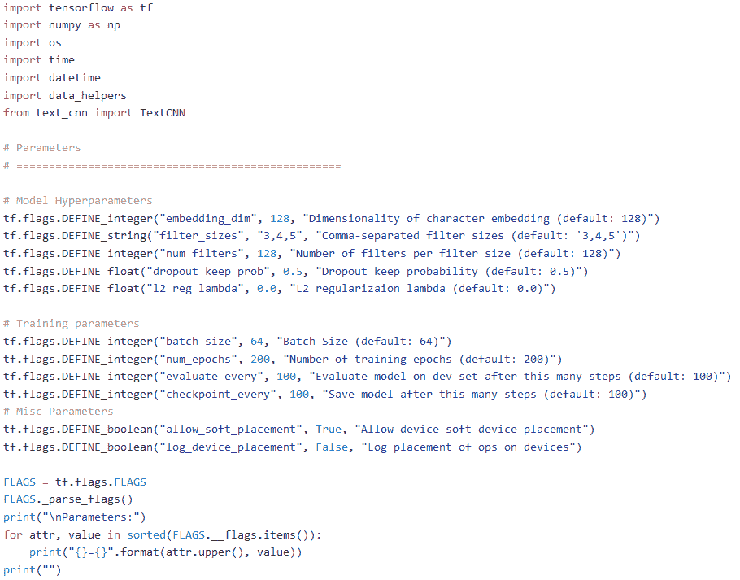
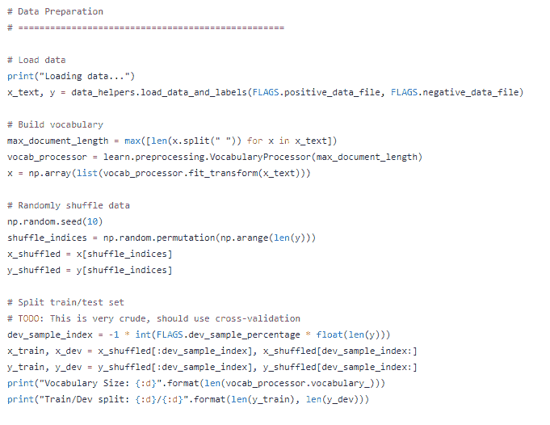
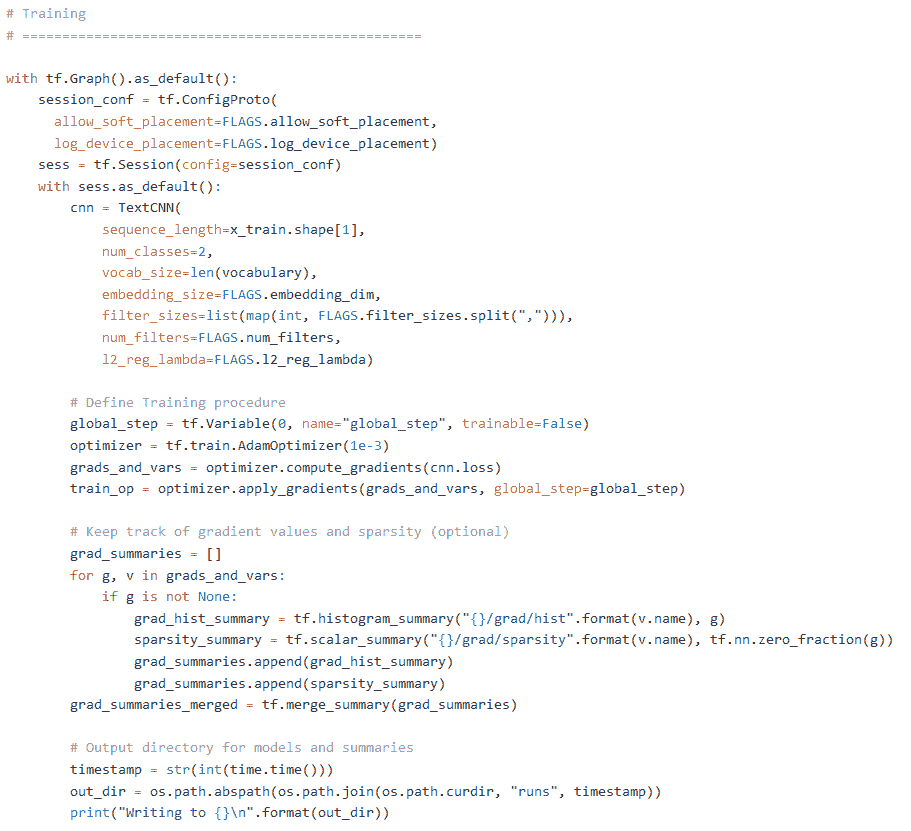
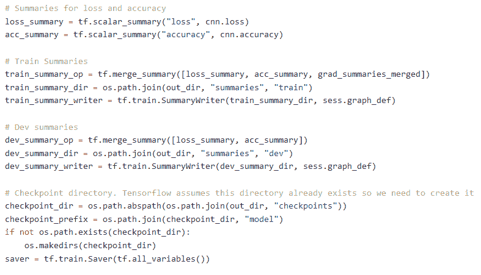
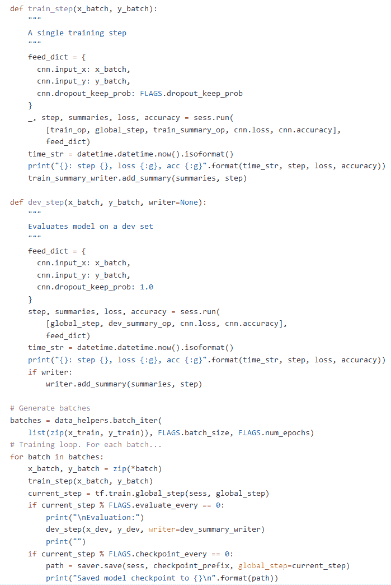
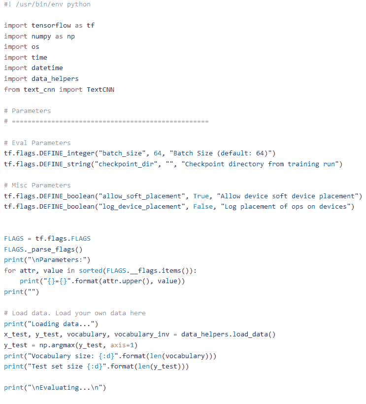
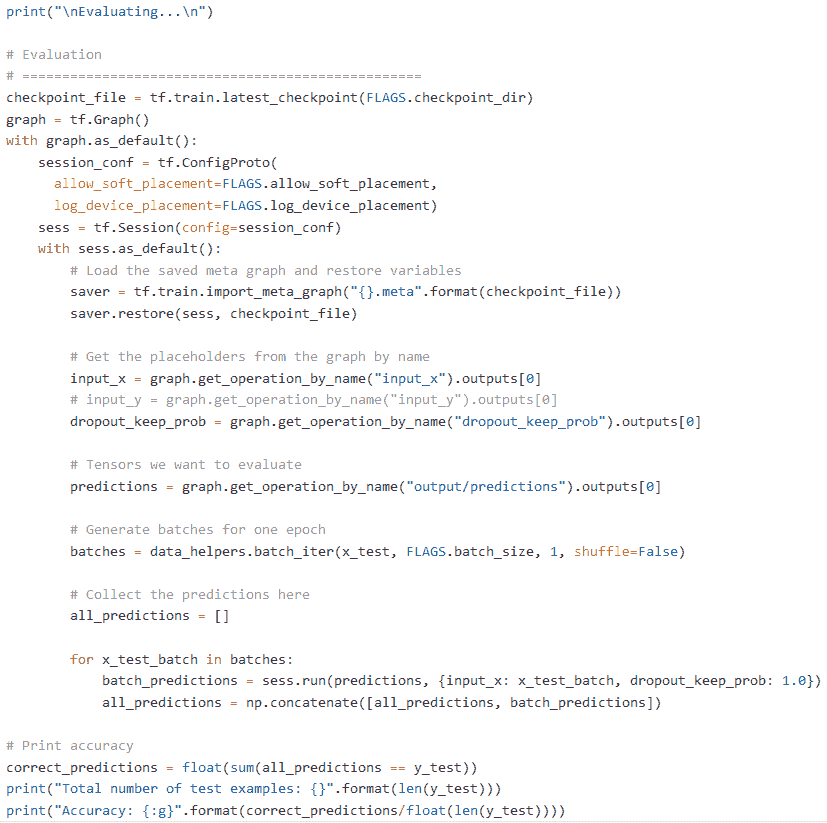

# 寻找意义

到目前为止，我们主要将 TensorFlow 用于图像处理，在较小程度上用于文本序列处理。在这一章中，我们将重温书面文字，以寻找文本中的意义。这是通常被称为自然语言处理领域的一部分。这一领域的一些活动包括:

*   **情感分析**—从文本中提取一般情感类别，而不提取句子的主题或动作
*   **实体提取**—从一段文本中提取主题，例如，人、地点和事件
*   **关键词提取**—从一段文本中提取关键术语
*   **单词关系提取**——这不仅提取实体，还提取每个实体的相关动作和词性

这只是对自然语言处理的皮毛——还有其他技术，以及每种技术的复杂程度。最初，这似乎有点学术，但是考虑一下这四种技术可以实现什么。一些例子包括如下:

*   阅读新闻并理解新闻的主题(个人、公司、地点等等)
*   获取之前的新闻并理解情绪(高兴、悲伤、愤怒等等)
*   解析产品评论，理解用户对产品的情感(满意、失望等等)
*   编写一个机器人来响应用户用自然语言给出的聊天框命令

就像我们之前探索的机器学习一样，相当多的努力都花在了设置上。在这种情况下，我们将花一些时间编写脚本，从感兴趣的来源中获取文本。


# 附加设置

需要额外的设置来包括文本处理所需的库。看看以下几点:

1.  首先是**巴泽尔**。在 Ubuntu 上，你需要按照这个链接上的官方教程来安装 Bazel。[https://docs . bazel . build/versions/master/install-Ubuntu . html](https://docs.bazel.build/versions/master/install-ubuntu.html)。在 macOS 上，你可以使用 HomeBrew 来`install bazel`如下:

```
      $ brew install bazel
```

2.  然后，我们将安装`swig`，它将允许我们包装 C/C++函数以允许 Python 中的调用。在 Ubuntu 上，您可以使用以下命令安装它:

```
 $ sudo apt-get install swig
```

在 Mac OS 上，我们也将使用`brew`安装它，如下所示:

```
      $ brew install swig
```

3.  接下来，我们将安装协议缓冲支持，这将允许我们以比 XML 更有效的方式存储和检索序列化数据。我们特别需要版本`3.3.0`来安装它，如下所示:

```
      $ pip install -U protobuf==3.3.0
```

4.  我们的文本分类将被表示为树，所以我们需要一个库来在命令行上显示树。我们将按如下方式安装它:

```
      $ pip install asciitree
```

5.  最后，我们需要一个科学计算库。如果你学过图像分类的章节，你应该已经熟悉了。否则，安装**数字**如下:

```
      $ pip install numpy autograd 
```

有了这些，我们现在将安装 **SyntaxNet** ，它为我们的 NLP 做了繁重的工作。SyntaxNet 是 tensor flow([https://www.tensorflow.org/](https://www.tensorflow.org/))的开源框架，提供基础功能。Google 用英语训练了一个 SyntaxNet 模型，并将其命名为 **Parsey McParseface** ，它将包含在我们的安装中。我们可以用英语训练我们自己更好或更具体的模型，也可以用其他语言训练。

训练数据将一如既往地构成挑战，因此我们将从使用预训练的英语模型 Parsey McParseface 开始。

因此，让我们获取软件包并对其进行配置，如以下命令行所示:

```
$ git clone --recursive https://github.com/tensorflow/models.git
$ cd models/research/syntaxnet/tensorflow
$ ./configure
```

最后，让我们按如下方式测试系统:

```
$ cd ..
$ bazel test ...
```

这需要一段时间。要有耐心。如果你严格按照所有的说明去做，所有的测试都会通过。我们的电脑可能会出现如下错误:

*   如果您发现`bazel`无法下载一个包，您可以尝试使用下面的命令并再次运行测试命令:

```
      $ bazel clean --expunge
```

*   如果您遇到一些失败的测试，我们建议您将下面一行添加到您的`home`目录中的`.bazelrc`,以便接收更多的错误信息进行调试:

```
 test --test_output=errors
```

*   如果遇到错误`Tensor already registered`，需要按照 Github 问题上的解决方案:[https://github.com/tensorflow/models/issues/2355](https://github.com/tensorflow/models/issues/2355)。

现在，让我们执行一个更一般的测试。让我们提供一个英语句子，看看它是如何被解析的:

```
$ echo 'Faaris likes to feed the kittens.' | bash  
./syntaxnet/demo.sh
```

我们通过 echo 语句输入一个句子，并将其传送到接受控制台标准输入的`syntaxnet`演示脚本中。注意，为了让示例更有趣，我将使用一个不常见的名称，例如`Faaris`。运行这个命令将产生大量的调试信息，如下所示。我用省略号(`...`)截取堆栈跟踪:

```
    I syntaxnet/term_frequency_map.cc:101] Loaded 46 terms from 
 syntaxnet/models/parsey_mcparseface/label-map.
    I syntaxnet/embedding_feature_extractor.cc:35] Features: input.digit 
 input.hyphen; input.prefix(length="2") input(1).prefix(length="2") 
 input(2).prefix(length="2") input(3).prefix(length="2") input(-
 1).prefix(length="2")...
    I syntaxnet/embedding_feature_extractor.cc:36] Embedding names: 
 other;prefix2;prefix3;suffix2;suffix3;words
    I syntaxnet/embedding_feature_extractor.cc:37] Embedding dims: 
 8;16;16;16;16;64
    I syntaxnet/term_frequency_map.cc:101] Loaded 46 terms from 
 syntaxnet/models/parsey_mcparseface/label-map.
    I syntaxnet/embedding_feature_extractor.cc:35] Features: 
 stack.child(1).label stack.child(1).sibling(-1).label stack.child(-
 1)....
    I syntaxnet/embedding_feature_extractor.cc:36] Embedding names: 
 labels;tags;words
    I syntaxnet/embedding_feature_extractor.cc:37] Embedding dims: 
 32;32;64
    I syntaxnet/term_frequency_map.cc:101] Loaded 49 terms from 
 syntaxnet/models/parsey_mcparseface/tag-map.
    I syntaxnet/term_frequency_map.cc:101] Loaded 64036 terms from 
 syntaxnet/models/parsey_mcparseface/word-map.
    I syntaxnet/term_frequency_map.cc:101] Loaded 64036 terms from 
 syntaxnet/models/parsey_mcparseface/word-map.
    I syntaxnet/term_frequency_map.cc:101] Loaded 49 terms from 
 syntaxnet/models/parsey_mcparseface/tag-map.
    INFO:tensorflow:Building training network with parameters: 
 feature_sizes: [12 20 20] domain_sizes: [   49    51 64038]
    INFO:tensorflow:Building training network with parameters: 
 feature_sizes: [2 8 8 8 8 8] domain_sizes: [    5 10665 10665  8970  
 8970 64038]
    I syntaxnet/term_frequency_map.cc:101] Loaded 46 terms from 
 syntaxnet/models/parsey_mcparseface/label-map.
    I syntaxnet/embedding_feature_extractor.cc:35] Features: 
 stack.child(1).label stack.child(1).sibling(-1).label stack.child(-
 1)....
    I syntaxnet/embedding_feature_extractor.cc:36] Embedding names: 
 labels;tags;words
    I syntaxnet/embedding_feature_extractor.cc:37] Embedding dims: 
 32;32;64
    I syntaxnet/term_frequency_map.cc:101] Loaded 49 terms from 
 syntaxnet/models/parsey_mcparseface/tag-map.
    I syntaxnet/term_frequency_map.cc:101] Loaded 64036 terms from 
 syntaxnet/models/parsey_mcparseface/word-map.
    I syntaxnet/term_frequency_map.cc:101] Loaded 49 terms from 
 syntaxnet/models/parsey_mcparseface/tag-map.
    I syntaxnet/term_frequency_map.cc:101] Loaded 46 terms from 
 syntaxnet/models/parsey_mcparseface/label-map.
    I syntaxnet/embedding_feature_extractor.cc:35] Features: input.digit 
 input.hyphen; input.prefix(length="2") input(1).prefix(length="2") 
 input(2).prefix(length="2") input(3).prefix(length="2") input(-
 1).prefix(length="2")...
    I syntaxnet/embedding_feature_extractor.cc:36] Embedding names: 
 other;prefix2;prefix3;suffix2;suffix3;words
    I syntaxnet/embedding_feature_extractor.cc:37] Embedding dims: 
 8;16;16;16;16;64
    I syntaxnet/term_frequency_map.cc:101] Loaded 64036 terms from 
 syntaxnet/models/parsey_mcparseface/word-map.
    INFO:tensorflow:Processed 1 documents
    INFO:tensorflow:Total processed documents: 1
    INFO:tensorflow:num correct tokens: 0
    INFO:tensorflow:total tokens: 7
    INFO:tensorflow:Seconds elapsed in evaluation: 0.12, eval metric: 
 0.00%
    INFO:tensorflow:Processed 1 documents
    INFO:tensorflow:Total processed documents: 1
    INFO:tensorflow:num correct tokens: 1
    INFO:tensorflow:total tokens: 6
    INFO:tensorflow:Seconds elapsed in evaluation: 0.47, eval metric: 
 16.67%
    INFO:tensorflow:Read 1 documents
    Input: Faaris likes to feed the kittens .
    Parse:
    likes VBZ ROOT
     +-- Faaris NNP nsubj
     +-- feed VB xcomp
     |   +-- to TO aux
     |   +-- kittens NNS dobj
     |       +-- the DT det
     +-- . . punct
```

从`Input:`开始的最后一节是最有趣的部分，也是我们以编程方式使用这个基础时将消耗的输出。注意这个句子是如何被分成词类和实体-动作-对象对的？我们看到的一些单词名称是— `nsubj`、`xcomp`、`aux`、`dobj`、`det`和`punct`。这些名称中有些是显而易见的，而有些则不明显。如果你想深入研究，我们建议你仔细阅读 https://nlp-ml.io/jg/software/pac/standep.html 大学的斯坦福依赖等级体系。

在我们继续之前，让我们试试另一个句子:

```
Input: Stop speaking so loudly and be quiet !
Parse:
Stop VB ROOT
+-- speaking VBG xcomp
|   +-- loudly RB advmod
|       +-- so RB advmod
|       +-- and CC cc
|       +-- quiet JJ conj
|           +-- be VB cop
+-- ! . punct
```

同样，在这里，我们会发现模型在剖析短语方面表现得相当好。试试你自己的。

接下来，我们实际训练一个模型。训练 SyntaxNet 相当简单，因为它是一个编译系统。到目前为止，我们已经通过标准输入(STDIO)管道输入了数据，但是我们也可以通过管道输入文本集。还记得我们安装的协议缓冲库吗？我们现在将使用它来编辑源文件— `syntaxnet/models/parsey_mcparseface/context.pbtxt`。

此外，我们会将源更改为其他培训源，或者我们自己的培训源，如以下代码所示:

```
 input { 
  name: 'wsj-data' 
  record_format: 'conll-sentence' 
  Part { 
    file_pattern: './wsj.conll' 
   } 
 } 
 input { 
  name: 'wsj-data-tagged' 
  record_format: 'conll-sentence' 
  Part { 
    file_pattern: './wsj-tagged.conll' 
   } 
 } 
```

这就是我们训练器械组的方法。然而，要做得比本地训练的模型 Parsey McParseface 更好，将是相当具有挑战性的。所以让我们在一个有趣的数据集上进行训练，使用一个新的模型——一个**卷积神经网络** ( **CNN** )来处理文本。

我有点偏向母校，所以我们就用康奈尔大学计算机系整理的影评数据。该数据集位于

http://www.cs.cornell.edu/people/pabo/movie-review-data/。

我们将首先下载并处理电影评论数据集，然后在其上进行训练，最后基于它进行评估。

我们所有的代码都可以在—[https://github.com/dennybritz/cnn-text-classification-tf](https://github.com/dennybritz/cnn-text-classification-tf)获得

该代码的灵感来自 Yoon Kim 关于这一主题的论文，句子分类的 CNN，由谷歌的 Denny Britz 实施和维护。现在，我们将浏览代码，看看 Danny Britz 是如何实现网络的

我们从图 1 开始，从常用的助手开始。这里唯一的新成员是下载和准备这个特定数据集的数据助手，如下图所示:



我们开始定义参数。训练参数现在应该非常熟悉了——这些参数定义了每次扫描处理的批量大小，以及我们将进行多少个时期或完整运行。我们还将定义我们评估进展的频率(这里是 100 步)以及我们为模型保存检查点的频率(以允许评估和重新继续)。).接下来，我们有代码来加载和准备图 2 中的数据集，如下所示:



然后，我们将看看代码的培训部分:



图 3 显示了我们用前面定义的一些参数实例化 CNN——一种自然语言 CNN。我们还设置了代码来实现 TensorBoard 可视化。

图 4 显示了我们为 TensorBoard 捕获的更多项目—损失、训练的准确性和评估集:



接下来，在图 5 中，我们将定义训练和评估方法，这与我们用于图像处理的方法非常相似。我们将接收一组训练数据和标签，并将它们存储在字典中。然后，我们将在数据字典上运行 TensorFlow 会话，捕获返回的性能指标。

我们将在顶部设置方法，然后分批循环训练数据，将训练和评估方法应用于每批数据。

在选定的时间间隔，我们还将保存检查点以供可选评估:



在一台纯 CPU 机器上经过一个小时的训练后，我们可以运行这个程序，最终得到一个经过训练的模型。经过训练的模型将被存储为一个检查点文件，然后可以输入到图 6 所示的评估程序中:



评估程序只是一个使用示例，但让我们来看一下。我们将从典型的导入和参数设置开始。这里，我们也将把检查点目录作为输入，我们将加载一些测试数据；但是，您应该使用自己的数据。

接下来，让我们检查下图:



我们将从检查点文件开始，只需加载它并从中重新创建一个 TensorFlow 会话。这使我们能够根据我们刚刚训练的模型进行评估，并一遍又一遍地重用它。

接下来，我们将批量运行测试数据。在常规使用中，我们不会使用循环或批处理，但我们有一个相当大的测试数据集，所以我们将它作为一个循环来做。

我们将简单地针对每组测试数据运行会话，并保留返回的预测(负对正。)以下是一些正面评论数据示例:

```
 insomnia loses points when it surrenders to a formulaic bang-bang , 
 shoot-em-up scene at the conclusion . but the performances of pacino 
 , williams , and swank keep the viewer wide-awake all the way through 
 .
    what might have been readily dismissed as the tiresome rant of an 
 aging filmmaker still thumbing his nose at convention takes a 
 surprising , subtle turn at the midway point .
    at a time when commercialism has squeezed the life out of whatever 
 idealism american moviemaking ever had , godfrey reggio's career 
 shines like a lonely beacon .
    an inuit masterpiece that will give you goosebumps as its uncanny 
 tale of love , communal discord , and justice unfolds .
    this is popcorn movie fun with equal doses of action , cheese , ham 
 and cheek ( as well as a serious debt to the road warrior ) , but it 
 feels like unrealized potential
    it's a testament to de niro and director michael caton-jones that by 
 movie's end , we accept the characters and the film , flaws and all .
    performances are potent , and the women's stories are ably intercut 
 and involving .
    an enormously entertaining movie , like nothing we've ever seen 
 before , and yet completely familiar .
    lan yu is a genuine love story , full of traditional layers of 
 awakening and ripening and separation and recovery .
    your children will be occupied for 72 minutes .
    pull[s] off the rare trick of recreating not only the look of a 
 certain era , but also the feel .
    twohy's a good yarn-spinner , and ultimately the story compels .
    'tobey maguire is a poster boy for the geek generation . '
     . . . a sweetly affecting story about four sisters who are coping , 
 in one way or another , with life's endgame .
    passion , melodrama , sorrow , laugther , and tears cascade over the 
 screen effortlessly . . .
    road to perdition does display greatness , and it's worth seeing . 
 but it also comes with the laziness and arrogance of a thing that 
 already knows it's won .
```

同样，我们也有负面数据。它们都在`data`文件夹中，分别是`rt-polarity.pos`和`rt-polarity.neg`。

下面是我们使用的网络架构:


它非常类似于我们用于图像的架构。事实上，整个努力看起来非常相似，确实如此。这些技术的美妙之处在于它的普遍性。

让我们先检查一下培训的输出，如下所示:

```
$ ./train.py
...
2017-06-15T04:42:08.793884: step 30101, loss 0, acc 1
2017-06-15T04:42:08.934489: step 30102, loss 1.54599e-07, acc 1
2017-06-15T04:42:09.082239: step 30103, loss 3.53902e-08, acc 1
2017-06-15T04:42:09.225435: step 30104, loss 0, acc 1
2017-06-15T04:42:09.369348: step 30105, loss 2.04891e-08, acc 1
2017-06-15T04:42:09.520073: step 30106, loss 0.0386909, acc 
0.984375
2017-06-15T04:42:09.676975: step 30107, loss 8.00917e-07, acc 1
2017-06-15T04:42:09.821703: step 30108, loss 7.83049e-06, acc 1
...
2017-06-15T04:42:23.220202: step 30199, loss 1.49012e-08, acc 1
2017-06-15T04:42:23.366740: step 30200, loss 5.67226e-05, acc 1

Evaluation:
2017-06-15T04:42:23.781196: step 30200, loss 9.74802, acc 0.721
...
Saved model checkpoint to /Users/saif/Documents/BOOK/cnn-text-
classification-tf/runs/1465950150/checkpoints/model-30200
```

现在让我们看看评估步骤:

```
$ ./eval.py –eval_train --checkpoint_dir==./runs/1465950150/checkpoints/

Parameters:
ALLOW_SOFT_PLACEMENT=True
BATCH_SIZE=64
CHECKPOINT_DIR=/Users/saif/Documents/BOOK/cnn-text-classification-
tf/runs/1465950150/checkpoints/
LOG_DEVICE_PLACEMENT=False

Loading data...
Vocabulary size: 18765
Test set size 10662
Evaluating...
Total number of test examples: 10662
Accuracy: 0.973832 
```

在我们现有的数据集上，这是相当好的精确度。下一步将是将训练好的模型应用于常规使用。一些有趣的实验可能是从另一个来源获得电影评论数据，可能是 IMDB 或 Amazon。由于数据不一定会被标记，我们可以使用%正值作为跨站点的一般协议的度量。

然后，我们可以在现场使用该模型。假设你是一个产品制造商。你可以实时跟踪各种来源的所有评论，只过滤负面评价。然后，您的现场代表可以尝试解决这些问题。可能性是无穷无尽的，所以我们结合我们所学的两个项目，提出一个你可以承担的有趣项目。

编写一个 twitter 流阅读器，获取每条推文并提取推文的主题。对于一组特定的主题，比如公司，评估推文是正面的还是负面的。创建正百分比和负百分比的运行指标，在不同的时间尺度上评估主题。


# 学到的技能

在本章中，您应该已经学会了以下技能:

*   设置更高级的 TensorFlow 库，包括那些需要 Bazel 驱动编译的库
*   使用文本数据
*   将 RNNs 和 CNN 应用于文本而不是图像
*   根据保存的模型评估文本
*   使用预建库提取句子结构细节
*   基于正面和负面情绪将文本分类到桶中


# 摘要

太棒了。我们只是将我们的神经网络知识应用于文本来理解语言。这是一个壮举，因为完全自动化导致巨大的规模。即使特定的评估是不正确的，从统计学上来说，我们手里还是有一个强大的工具，同样是用同样的积木搭建的。