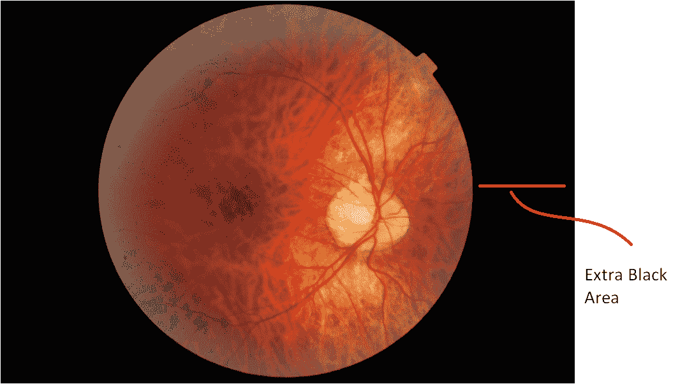
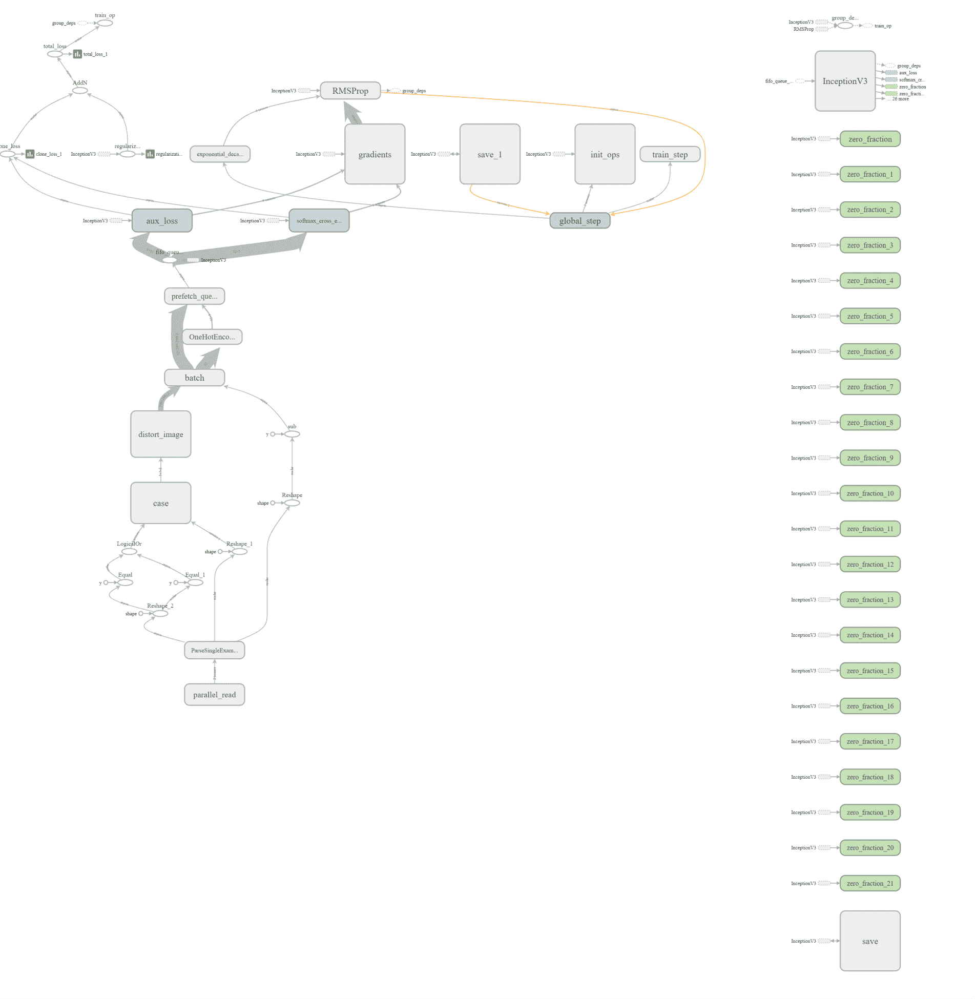
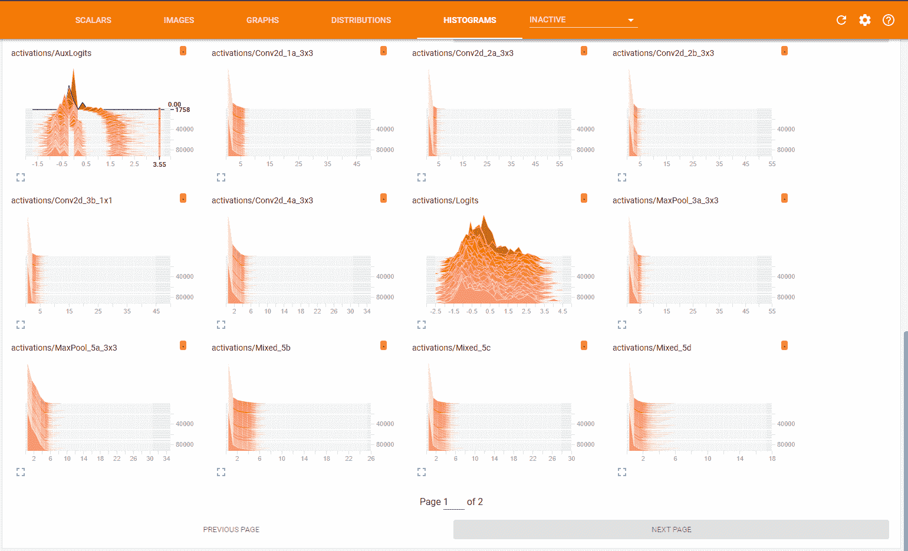
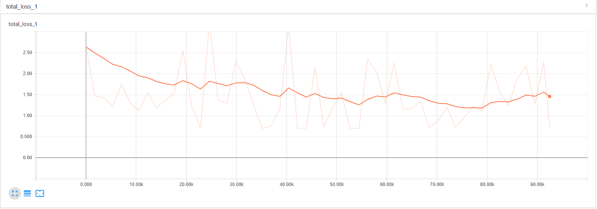
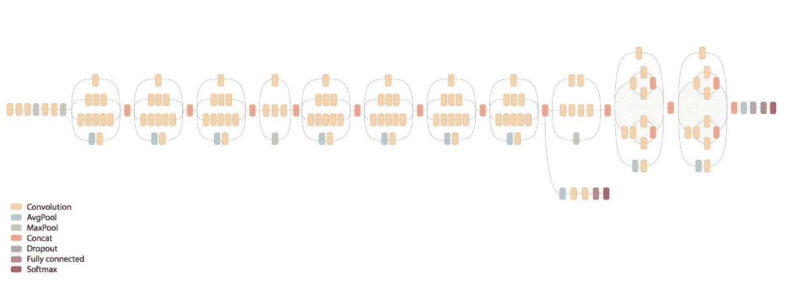
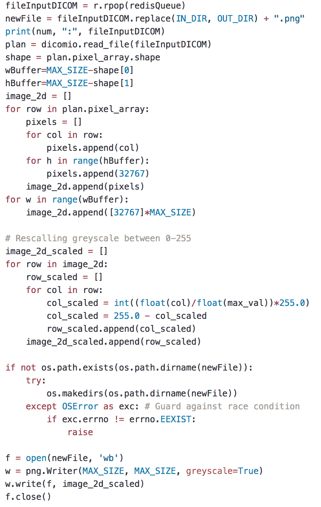

# 医生现在可以见你了

到目前为止，我们已经将深度网络用于图像、文本和时间序列处理。虽然我们的大多数例子都很有趣且相关，但它们都不是企业级的。现在，我们将解决一个企业级问题—医疗诊断。我们之所以指定企业级，是因为医疗数据具有通常不会在大型企业之外处理的属性，即专有数据格式、较大的本机大小、不方便的类数据和非典型特征。

在本章中，我们将讨论以下主题:

*   医学影像文件及其特点
*   处理大型图像文件
*   从典型医疗文件中提取类别数据
*   使用非医疗数据“预先训练”的网络
*   缩放培训，以适应通常带有医疗数据的秤

获取医疗数据本身就是一个挑战，所以我们将借助一个所有读者都应该熟悉的热门网站——ka ggle。虽然有很多免费的医疗数据集，但大多数都需要一个复杂的注册过程才能访问。许多仅在医学图像处理领域的特定子社区中公开，并且大多数具有定制的提交程序。Kaggle 可能是一个重要的医学成像数据集以及您可以尝试的非医学数据集的最规范化的来源。我们将特别关注 Kaggle 的糖尿病视网膜病变检测挑战。

*   可以在这里查看数据集:[https://www . ka ggle . com/c/diabetic-retinopathy-detection/data](https://www.kaggle.com/c/diabetic-retinopathy-detection/data)

数据集有一个训练集和一个盲测集。当然，训练集用于训练我们的网络，测试集用于在 Kaggle 网站上提交我们的结果。

由于数据量相当大(训练集 32 GB，测试集 49 GB)，所以两者都被分成多个大约 8 GB 的 ZIP 文件。

这里的测试集是盲的—我们不知道它们的标签。这是为了从我们训练有素的网络中公平地提交测试集结果。

就训练集而言，它的标签存在于`trainLabels.csv`文件中。


# 挑战

在我们深入研究代码之前，请记住大多数机器学习工作都涉及两个简单目标之一——分类或排名。在许多情况下，分类本身就是一个排名，因为我们最终选择了排名最高的分类(通常是一个概率)。我们进军医学成像领域也不例外，我们将把图像分为以下两类:

*   疾病状态/阳性
*   正常状态/负

或者，我们会把他们分成多个类或者进行排名。在糖尿病视网膜病变的情况下，我们将它们排列如下:

*   0 级:无糖尿病视网膜病变
*   1 级:轻度
*   第二类:中度
*   3 级:严重
*   第 4 类:广泛的糖尿病视网膜病变

通常，这被称为得分。Kaggle 友好地向参与者提供了超过 32 GB 的训练数据，其中包括超过 35，000 张图像。测试数据甚至更大—49 GB。目标是使用已知分数在 35，000+幅图像上进行训练，并为测试集提出分数。培训标签如下所示:

| **图像** | **级别** |
| `10_left` | 0 |
| `10_right` | 0 |
| `13_left` | 0 |
| `13_right` | 0 |
| `15_left` | 一 |
| `15_right` | 2 |
| `16_left` | 四 |
| `16_right` | 四 |
| `17_left` | 0 |
| `17_right` | 一 |

这里有一些背景——糖尿病视网膜病变是一种眼睛内部的视网膜疾病，所以我们有左眼和右眼的分数。我们可以将它们视为独立的训练数据，或者我们可以稍后发挥创造力，在单个患者的更大背景下考虑它们。让我们从简单开始迭代。

到目前为止，您可能已经熟悉了获取一组数据并将其分割出来用于训练、验证和测试。这对于我们使用的一些标准数据集来说效果很好，但是这个数据集是竞赛的一部分，并且是公开审核的，所以我们不知道答案！这很好地反映了现实生活。有一个小问题——大多数 Kaggle 比赛让你提出一个答案，并告诉你你的总分，这有助于学习和方向的设定。这也有助于他们和社区了解哪些用户做得很好。

由于测试标签是盲的，我们需要改变我们以前做过的两件事:

*   我们将需要一个用于内部开发和迭代的过程(我们可能会将我们的训练集分成一个训练、验证和测试集)。我们将需要另一个过程来进行外部测试(我们可能会选定一个运行良好的有希望的设置，然后我们可能会在盲测试集上运行它，或者我们可能会首先在整个训练集上重新训练)。
*   我们将需要以非常具体的格式提出一份正式提案，提交给独立审计师(在本例中是 Kaggle)，并相应地评估进展。下面是一个示例提交可能的样子:

| **图像** | **级别** |
| `44342_left` | 0 |
| `44342_right` | 一 |
| `44344_left` | 2 |
| `44344_right` | 2 |
| `44345_left` | 0 |
| `44345_right` | 0 |
| `44346_left` | 四 |
| `44346_right` | 3 |
| `44350_left` | 一 |
| `44350_right` | 一 |
| `44351_left` | 四 |
| `44351_right` | 四 |

毫不奇怪，它看起来非常像训练标签文件。您可以在此提交您的意见:

[https://www . ka ggle . com/c/diabetic-retinopathy-detection/submit https://www . ka ggle . com/c/diabetic-retinopathy-detection/submit](https://www.kaggle.com/c/diabetic-retinopathy-detection/submit%20%20)

您需要登录才能打开前面的链接。


# 数据

让我们开始偷看数据。打开一些样本文件，准备好大吃一惊吧——它们既不是 28x28 的手写字体，也不是 64x64 的猫脸图标。这是来自真实世界的真实数据集。事实上，不同图像的大小也不一致。欢迎来到现实世界。

您会发现尺寸从每边 2000 像素到几乎 5000 像素不等！这将我们带到第一个现实任务——创建一个培训管道。管道将是一组步骤，抽象出生活中丑陋的现实，并产生一组干净一致的数据。


# 管道

我们会明智地处理这件事。Google 在他们的`TensorFlow`库中使用不同的网络制作了很多管道模型结构。我们在这里要做的是采用其中一个模型结构和网络，并根据我们的需要修改代码。

这很好，因为我们不会浪费时间从零开始建立管道，也不必担心合并 TensorBoard 可视化的东西，因为它已经存在于 Google 管道模型中。

我们将从这里开始使用管道模型:

[https://github.com/tensorflow/models/](https://github.com/tensorflow/models/)

如你所见，在这个资源库中有很多用 TensorFlow 制作的不同模型。您可以更深入地研究一些与自然语言处理(NLP)、循环神经网络和其他主题相关的模型。如果你想理解复杂的模型，这是一个很好的起点。

本章我们将使用 **Tensorflow-Slim 图像分类模型库**。你可以在这里找到图书馆:

[https://github . com/tensor flow/models/tree/master/research/slim](https://github.com/tensorflow/models/tree/master/research/slim)

网站上已经有很多解释如何使用这个库的细节。他们还告诉您如何在分布式环境中使用这个库，以及如何利用多个 GPU 来获得更快的培训时间，甚至部署到生产环境中。

使用这种方法的最大好处是，它们为您提供了预先训练的模型快照，您可以使用它来大大减少网络的训练时间。所以，即使你的 GPU 很慢，你也不需要花几个星期的时间来训练你的网络达到一个合理的训练水平。

这称为模型的微调，在这种情况下，您只需提供一个不同的数据集，并告诉网络重新初始化网络的最终图层，以便对它们进行重新训练。此外，您还要告诉它您的数据集中有多少个输出标注类。在我们的案例中，有五个独特的类别来识别不同水平的**糖尿病视网膜病变** ( **DR** )。

预训练快照可在此处找到:

[https://github . com/tensor flow/models/tree/master/research/slim # pre trained](https://github.com/tensorflow/models/tree/master/research/slim#Pretrained)

正如您在前面的链接中看到的，他们提供了许多我们可以利用的预训练模型。他们使用了`ImageNet`数据集来训练这些模型。`ImageNet`是一个包含 1，000 个类的标准数据集，数据集大小接近 500 GB。您可以在此找到更多相关信息:

【http://image-net.org/ 


# 了解管道

让我们从将`models`库克隆到您的计算机开始:

```
git clone https://github.com/tensorflow/models/
```

现在，让我们深入到从 Google 的模型库中获得的管道中。

如果您在存储库中查看这个路径前缀(`models/research/slim`)的文件夹，您会看到名为`datasets`、`deployment`、`nets`、`preprocessing`和`scripts`的文件夹；一堆与生成模型相关的文件，加上与训练`ImageNet`数据集相关的训练和测试管道和文件，以及一个名为`flowers` **的数据集。**

我们将使用`download_and_convert_data.py`来构建我们的灾难恢复数据集。这个`image classification model`库是基于`slim`库构建的。在本章中，我们将对`nets/inception_v3.py`中定义的初始网络进行微调(我们将在本章的后面详细讨论网络规范及其概念)，这包括损失函数的计算、添加不同的 op、构建网络等等。最后，`train_image_classifier.py`和`eval_image_classifier.py`文件包含了为我们的网络建立一个训练和测试管道的通用程序。

对于这一章，由于网络的复杂性，我们使用基于 GPU 的管道来训练网络。如果您想了解如何在您的机器上安装 TensorFlow for GPU，请参考本书中的[附录 A](8022db02-d24f-4620-9da7-ae53df279306.xhtml) 、*高级安装*。另外，你的机器内部应该有大约 120 GB 的空间来运行这段代码。你可以在本书代码文件的`Chapter 8`文件夹中找到最终的代码文件。


# 准备数据集

现在，让我们开始准备我们网络的数据集。

对于这个初始网络，我们将使用`TFRecord`类来管理我们的数据集。预处理后的输出数据集文件将是 protofiles，`TFRecord`可以读取，它只是我们为了更快的读取速度而以序列化格式存储的数据。每个原型文件中都存储了一些信息，比如图像大小和格式。

我们这样做的原因是数据集的大小太大，我们无法将整个数据集加载到内存(RAM)中，因为这将占用大量空间。因此，为了管理有效的 RAM 使用，我们必须批量加载图像，并删除以前加载的现在没有使用的图像。

网络将接受的输入大小是 299x299。因此，我们将找到一种方法，首先将图像大小减少到 299x299，以获得一致的图像数据集。

减少图像后，我们将制作原型文件，稍后我们可以将这些文件输入到我们的网络中，这些文件将在我们的数据集上进行训练。

您需要首先从这里下载五个培训 ZIP 文件和标签文件:

[https://www . ka ggle . com/c/diabetic-retinopathy-detection/data](https://www.kaggle.com/c/diabetic-retinopathy-detection/data)

不幸的是，Kaggle 只允许您通过一个帐户下载训练 ZIP 文件，所以这个下载数据集文件的过程(如前几章)不能自动完成。

现在，让我们假设您已经下载了所有五个培训 ZIP 文件和标签文件，并将它们存储在一个名为`diabetic`的文件夹中。`diabetic`文件夹的结构将如下所示:

*   `diabetic`
    *   `train.zip.001`
    *   `train.zip.002`
    *   `train.zip.003`
    *   `train.zip.004`
    *   `train.zip.005`
    *   `trainLabels.csv.zip`

为了简化项目，我们将使用压缩软件手动提取。提取完成后，`diabetic`文件夹的结构将如下所示:

*   `diabetic`
    *   `train`
    *   `10_left.jpeg`
    *   `10_right.jpeg`
    *   ...
    *   `trainLabels.csv`
    *   `train.zip.001`
    *   `train.zip.002`
    *   `train.zip.003`
    *   `train.zip.004`
    *   `train.zip.005`
    *   `trainLabels.csv.zip`

在这种情况下，`train`文件夹包含中的所有图像。zip 文件，而`trainLabels.csv`包含每个图像的基本事实标签。

模型库的作者提供了一些示例代码来处理一些流行的影像分类数据集。我们的糖尿病问题可以用同样的方法解决。因此，我们可以遵循适用于其他数据集(如`flower`或`MNIST`数据集)的代码。我们已经在 https://github.com/mlwithtf/mlwithtf/的这本书的知识库中提供了与糖尿病患者一起工作的修改。

您需要克隆存储库并导航到`chapter_08`文件夹。您可以如下运行`download_and_convert_data.py`文件:

```
python download_and_convert_data.py --dataset_name diabetic --dataset_dir D:\\datasets\\diabetic
```

在这种情况下，我们将使用`dataset_name`作为`diabetic`并且`dataset_dir`是包含`trainLabels.csv`和`train`文件夹的文件夹。

它应该没有任何问题地运行，开始将我们的数据集预处理成合适的(299x299)格式，并在一个新创建的名为`tfrecords`的文件夹中创建一些`TFRecord`文件。下图显示了`tfrecords`文件夹的内容:


# 解释数据准备

现在让我们进入数据预处理的编码部分。从现在开始，我们将向您展示我们对最初的`tensorflow/models`库所做的更改。基本上，我们将流程`flowers`数据集的代码作为起点，并修改它们以适应我们的需求。

在`download_and_convert_data.py`文件中，我们在文件的开头添加了新的一行:

```
from datasets import download_and_convert_diabetic 
and a new else-if clause to process the dataset_name "diabetic" at line 69: 
  elif FLAGS.dataset_name == 'diabetic': 
      download_and_convert_diabetic.run(FLAGS.dataset_dir)
```

有了这段代码，我们可以调用`datasets`文件夹中的`download_and_convert_diabetic.py`中的 run 方法。这是一种分离多个数据集的预处理代码的非常简单的方法，但是我们仍然可以利用`image classification`库的其他部分。

`download_and_convert_diabetic.py`文件是`download_and_convert_flowers.py`文件的副本，做了一些修改以准备我们的糖尿病数据集。

在`download_and_convert_diabetic.py`文件的运行方法中，我们做了如下修改:

```
  def run(dataset_dir): 
    """Runs the download and conversion operation. 

    Args: 
      dataset_dir: The dataset directory where the dataset is stored. 
    """ 
    if not tf.gfile.Exists(dataset_dir): 
        tf.gfile.MakeDirs(dataset_dir) 

    if _dataset_exists(dataset_dir): 
        print('Dataset files already exist. Exiting without re-creating   
        them.') 
        return 

    # Pre-processing the images. 
    data_utils.prepare_dr_dataset(dataset_dir) 
    training_filenames, validation_filenames, class_names =   
    _get_filenames_and_classes(dataset_dir) 
    class_names_to_ids = dict(zip(class_names,    
    range(len(class_names)))) 

    # Convert the training and validation sets. 
    _convert_dataset('train', training_filenames, class_names_to_ids,   
    dataset_dir) 
    _convert_dataset('validation', validation_filenames,    
    class_names_to_ids, dataset_dir) 

    # Finally, write the labels file: 
    labels_to_class_names = dict(zip(range(len(class_names)),    
    class_names)) 
    dataset_utils.write_label_file(labels_to_class_names, dataset_dir) 

    print('\nFinished converting the Diabetic dataset!')
```

在这段代码中，我们使用了来自`data_utils`包的`prepare_dr_dataset`,这个包是在这个图书仓库的根目录中准备的。我们稍后将研究这种方法。然后，我们更改了`_get_filenames_and_classes`方法来返回`training`和`validation`文件名。最后几行与`flowers`数据集示例相同:

```
  def _get_filenames_and_classes(dataset_dir): 
    train_root = os.path.join(dataset_dir, 'processed_images', 'train') 
    validation_root = os.path.join(dataset_dir, 'processed_images',   
    'validation') 
    class_names = [] 
    for filename in os.listdir(train_root): 
        path = os.path.join(train_root, filename) 
        if os.path.isdir(path): 
            class_names.append(filename) 

    train_filenames = [] 
    directories = [os.path.join(train_root, name) for name in    
    class_names] 
    for directory in directories: 
        for filename in os.listdir(directory): 
            path = os.path.join(directory, filename) 
            train_filenames.append(path) 

    validation_filenames = [] 
    directories = [os.path.join(validation_root, name) for name in    
    class_names] 
    for directory in directories: 
        for filename in os.listdir(directory): 
            path = os.path.join(directory, filename) 
            validation_filenames.append(path) 
    return train_filenames, validation_filenames, sorted(class_names) 
```

在前面的方法中，我们在`processed_images/train`和`processed/validation`文件夹中找到所有文件名，其中包含在`data_utils.prepare_dr_dataset`方法中预处理过的图像。

在`data_utils.py`文件中，我们编写了`prepare_dr_dataset(dataset_dir)`函数，负责数据的整个预处理。

让我们从定义链接到数据的必要变量开始:

```
num_of_processing_threads = 16 
dr_dataset_base_path = os.path.realpath(dataset_dir) 
unique_labels_file_path = os.path.join(dr_dataset_base_path, "unique_labels_file.txt") 
processed_images_folder = os.path.join(dr_dataset_base_path, "processed_images") 
num_of_processed_images = 35126 
train_processed_images_folder = os.path.join(processed_images_folder, "train") 
validation_processed_images_folder = os.path.join(processed_images_folder, "validation") 
num_of_training_images = 30000 
raw_images_folder = os.path.join(dr_dataset_base_path, "train") 
train_labels_csv_path = os.path.join(dr_dataset_base_path, "trainLabels.csv")
```

正如您可能已经猜到的，变量`num_of_processing_threads`用于指定预处理数据集时我们想要使用的线程数量。我们将使用多线程环境来更快地预处理我们的数据。稍后，我们指定了一些目录路径，以便在预处理时将数据包含在不同的文件夹中。

我们将提取原始形式的图像，然后对其进行预处理，使其具有合适的一致格式和大小，然后我们将使用`download_and_convert_diabetic.py`文件中的`_convert_dataset`方法从处理后的图像中生成`tfrecords`文件。之后，我们会将这些`tfrecords`文件输入到训练和测试网络中。

正如我们在上一节中所说的，我们已经提取了`dataset`文件和标签文件。现在，我们已经将所有的数据提取出来并呈现在我们的机器中，我们将处理这些图像。灾难恢复数据集的典型图像如下所示:



我们想要的是删除这个额外的黑色空间，因为它对我们的网络来说是不必要的。这将减少图像中不必要的信息。在这之后，我们将这个图像缩放成 299x299 的 JPG 图像文件。

我们将对所有训练数据集重复这一过程。

裁剪黑色图像边框的功能如下:

```
  def crop_black_borders(image, threshold=0):
     """Crops any edges below or equal to threshold

     Crops blank image to 1x1.

     Returns cropped image.

     """
     if len(image.shape) == 3:
         flatImage = np.max(image, 2)
     else:
         flatImage = image
     assert len(flatImage.shape) == 2

     rows = np.where(np.max(flatImage, 0) > threshold)[0]
     if rows.size:
         cols = np.where(np.max(flatImage, 1) > threshold)[0]
         image = image[cols[0]: cols[-1] + 1, rows[0]: rows[-1] + 1]
     else:
         image = image[:1, :1]

     return image 
```

这个函数获取图像和一个灰度阈值，低于这个阈值，它将移除图像周围的黑色边框。

因为我们在多线程环境中进行所有这些处理，所以我们将成批处理图像。为了处理图像批次，我们将使用以下函数:

```
  def process_images_batch(thread_index, files, labels, subset):

     num_of_files = len(files)

     for index, file_and_label in enumerate(zip(files, labels)):
         file = file_and_label[0] + '.jpeg'
         label = file_and_label[1]

         input_file = os.path.join(raw_images_folder, file)
         output_file = os.path.join(processed_images_folder, subset,   
         str(label), file)

         image = ndimage.imread(input_file)
         cropped_image = crop_black_borders(image, 10)
         resized_cropped_image = imresize(cropped_image, (299, 299, 3),   
         interp="bicubic")
         imsave(output_file, resized_cropped_image)

         if index % 10 == 0:
             print("(Thread {}): Files processed {} out of  
             {}".format(thread_index, index, num_of_files)) 
```

`thread_index` 告诉我们函数被调用的线程的 ID。围绕图像批处理的线程环境在以下函数中定义:

```
   def process_images(files, labels, subset):

     # Break all images into batches with a [ranges[i][0], ranges[i] 
     [1]].
     spacing = np.linspace(0, len(files), num_of_processing_threads +  
     1).astype(np.int)
     ranges = []
     for i in xrange(len(spacing) - 1):
         ranges.append([spacing[i], spacing[i + 1]])

     # Create a mechanism for monitoring when all threads are finished.
     coord = tf.train.Coordinator()

     threads = []
     for thread_index in xrange(len(ranges)):
         args = (thread_index, files[ranges[thread_index] 
         [0]:ranges[thread_index][1]],
                 labels[ranges[thread_index][0]:ranges[thread_index] 
                 [1]],
                 subset)
         t = threading.Thread(target=process_images_batch, args=args)
         t.start()
         threads.append(t)

     # Wait for all the threads to terminate.
     coord.join(threads) 
```

为了从所有线程中获得最终结果，我们使用了一个`TensorFlow`类`tf.train.Coordinator()`，它的`join`函数负责处理所有线程的最终接近点。

对于线程，我们使用`threading.Thread`，其中`target`参数指定要调用的函数，`args`参数指定目标函数参数。

现在，我们将处理训练图像。训练数据集分为训练集(30，000 幅图像)和验证集(5，126 幅图像)。

总的预处理过程如下:

```
def process_training_and_validation_images():
     train_files = []
     train_labels = []

     validation_files = []
     validation_labels = []

     with open(train_labels_csv_path) as csvfile:
         reader = csv.DictReader(csvfile)
         for index, row in enumerate(reader):
             if index < num_of_training_images:
                 train_files.extend([row['image'].strip()])
                 train_labels.extend([int(row['level'].strip())])
             else:
                 validation_files.extend([row['image'].strip()])

   validation_labels.extend([int(row['level'].strip())])

     if not os.path.isdir(processed_images_folder):
         os.mkdir(processed_images_folder)

     if not os.path.isdir(train_processed_images_folder):
         os.mkdir(train_processed_images_folder)

     if not os.path.isdir(validation_processed_images_folder):
         os.mkdir(validation_processed_images_folder)

     for directory_index in range(5):
         train_directory_path =   
    os.path.join(train_processed_images_folder,   
    str(directory_index))
         valid_directory_path =   
   os.path.join(validation_processed_images_folder,  
   str(directory_index))

         if not os.path.isdir(train_directory_path):
             os.mkdir(train_directory_path)

         if not os.path.isdir(valid_directory_path):
             os.mkdir(valid_directory_path)

     print("Processing training files...")
     process_images(train_files, train_labels, "train")
     print("Done!")

     print("Processing validation files...")
     process_images(validation_files, validation_labels,  
     "validation")
     print("Done!")

     print("Making unique labels file...")
     with open(unique_labels_file_path, 'w') as unique_labels_file:
         unique_labels = ""
         for index in range(5):
             unique_labels += "{}\n".format(index)
         unique_labels_file.write(unique_labels)

     status = check_folder_status(processed_images_folder, 
     num_of_processed_images,
     "All processed images are present in place",
     "Couldn't complete the image processing of training and  
     validation files.")

     return status 
```

现在，我们将看看准备数据集的最后一个方法，在`download_and_convert_diabetic.py`文件中调用的`_convert_dataset`方法:

```
def _get_dataset_filename(dataset_dir, split_name, shard_id): 
    output_filename = 'diabetic_%s_%05d-of-%05d.tfrecord' % ( 
        split_name, shard_id, _NUM_SHARDS) 
    return os.path.join(dataset_dir, output_filename) 
def _convert_dataset(split_name, filenames, class_names_to_ids, dataset_dir): 
    """Converts the given filenames to a TFRecord dataset. 

    Args: 
      split_name: The name of the dataset, either 'train' or  
     'validation'. 
      filenames: A list of absolute paths to png or jpg images. 
      class_names_to_ids: A dictionary from class names (strings) to  
      ids 
        (integers). 
      dataset_dir: The directory where the converted datasets are  
     stored. 
    """ 
    assert split_name in ['train', 'validation'] 

    num_per_shard = int(math.ceil(len(filenames) /  
    float(_NUM_SHARDS))) 

    with tf.Graph().as_default(): 
        image_reader = ImageReader() 

        with tf.Session('') as sess: 

            for shard_id in range(_NUM_SHARDS): 
                output_filename = _get_dataset_filename( 
                    dataset_dir, split_name, shard_id) 

                with tf.python_io.TFRecordWriter(output_filename)
                as   
                tfrecord_writer: 
                    start_ndx = shard_id * num_per_shard 
                    end_ndx = min((shard_id + 1) * num_per_shard,  
                    len(filenames)) 
                    for i in range(start_ndx, end_ndx): 
                        sys.stdout.write('\r>> Converting image  
                         %d/%d shard %d' % ( 
                            i + 1, len(filenames), shard_id)) 
                        sys.stdout.flush() 

                        # Read the filename: 
                        image_data =  
                    tf.gfile.FastGFile(filenames[i], 'rb').read() 
                        height, width =          
                    image_reader.read_image_dims(sess, image_data) 

                        class_name =  
                     os.path.basename(os.path.dirname(filenames[i])) 
                        class_id = class_names_to_ids[class_name] 

                        example = dataset_utils.image_to_tfexample( 
                            image_data, b'jpg', height, width,   
                             class_id) 

                 tfrecord_writer.write(example.SerializeToString()) 

                  sys.stdout.write('\n') 
                  sys.stdout.flush() 
```

在前面的函数中，我们将获取图像文件名，然后将它们存储在`tfrecord`文件中。我们还将把`train`和`validation`文件分割成多个`tfrecord`文件，而不是每个分割集只使用一个文件。

现在，由于数据处理已经完成，我们将把数据集形式化为`slim.dataset`的一个实例。来自`Tensorflow Slim`的数据集。在`datasets/diabetic.py`文件中，您会看到一个名为`get_split`的方法，如下所示:

```
_FILE_PATTERN = 'diabetic_%s_*.tfrecord' 
SPLITS_TO_SIZES = {'train': 30000, 'validation': 5126} 
_NUM_CLASSES = 5 
_ITEMS_TO_DESCRIPTIONS = { 
    'image': 'A color image of varying size.', 
    'label': 'A single integer between 0 and 4', 
} 
def get_split(split_name, dataset_dir, file_pattern=None, reader=None): 
  """Gets a dataset tuple with instructions for reading flowers. 
  Args: 
    split_name: A train/validation split name. 
    dataset_dir: The base directory of the dataset sources. 
    file_pattern: The file pattern to use when matching the dataset sources. 
      It is assumed that the pattern contains a '%s' string so that the split 
      name can be inserted. 
    reader: The TensorFlow reader type. 
  Returns: 
    A `Dataset` namedtuple. 
  Raises: 
    ValueError: if `split_name` is not a valid train/validation split. 
  """ 
  if split_name not in SPLITS_TO_SIZES: 
    raise ValueError('split name %s was not recognized.' % split_name) 

  if not file_pattern: 
    file_pattern = _FILE_PATTERN 
  file_pattern = os.path.join(dataset_dir, file_pattern % split_name) 

  # Allowing None in the signature so that dataset_factory can use the default. 
  if reader is None: 
    reader = tf.TFRecordReader 

  keys_to_features = { 
      'image/encoded': tf.FixedLenFeature((), tf.string, default_value=''), 
      'image/format': tf.FixedLenFeature((), tf.string, default_value='png'), 
      'image/class/label': tf.FixedLenFeature( 
          [], tf.int64, default_value=tf.zeros([], dtype=tf.int64)), 
  } 
  items_to_handlers = { 
      'image': slim.tfexample_decoder.Image(), 
      'label': slim.tfexample_decoder.Tensor('image/class/label'), 
  } 
  decoder = slim.tfexample_decoder.TFExampleDecoder( 
      keys_to_features, items_to_handlers) 

  labels_to_names = None 
  if dataset_utils.has_labels(dataset_dir): 
    labels_to_names = dataset_utils.read_label_file(dataset_dir) 

  return slim.dataset.Dataset( 
      data_sources=file_pattern, 
      reader=reader, 
      decoder=decoder, 
      num_samples=SPLITS_TO_SIZES[split_name], 
      items_to_descriptions=_ITEMS_TO_DESCRIPTIONS, 
      num_classes=_NUM_CLASSES, 
      labels_to_names=labels_to_names) 
```

前面的方法将在训练和评估例程中调用。我们将使用关于我们的`tfrecord`文件的信息创建一个`slim.dataset`的实例，这样它可以自动执行解析二进制文件的工作。而且我们还可以在 Tensorflow Slim 的`DatasetDataProvider`支持下使用`slim.dataset.Dataset`并行读取数据集，这样可以增加训练和评估的例程。

在我们开始训练之前，我们需要从`Tensorflow Slim image classification`库中下载预训练的 Inception V3 模型，这样我们就可以利用 Inception V3 的性能，而无需从头开始训练。

预训练快照可在此处找到:

[https://github . com/tensor flow/models/tree/master/research/slim # pre trained](https://github.com/tensorflow/models/tree/master/research/slim#Pretrained)

在这一章中，我们将使用 Inception V3，所以我们需要下载`inception_v3_2016_08_28.tar.gz`文件，并将其解压缩，使检查点文件命名为`inception_v3.ckpt`。


# 训练日程

现在让我们转向训练和评估我们的模型。

培训脚本存在于`train_image_classifer.py`中。因为我们已经遵循了库的工作流，所以我们可以保持该文件不变，并使用以下命令运行我们的训练例程:

```
python train_image_classifier.py --train_dir=D:\datasets\diabetic\checkpoints --dataset_name=diabetic --dataset_split_name=train --dataset_dir=D:\datasets\diabetic\tfrecords --model_name=inception_v3 --checkpoint_path=D:\datasets\diabetic\checkpoints\inception_v3\inception_v3.ckpt --checkpoint_exclude_scopes=InceptionV3/Logits,InceptionV3/AuxLogits --trainable_scopes=InceptionV3/Logits,InceptionV3/AuxLogits --learning_rate=0.000001 --learning_rate_decay_type=exponential 
```

在我们的设置中，我们整夜都在运行培训过程。现在，我们将通过验证过程运行训练好的模型，以了解它是如何工作的。


# 验证程序

您可以使用以下命令运行验证例程:

```
python eval_image_classifier.py --alsologtostderr --checkpoint_path=D:\datasets\diabetic\checkpoints\model.ckpt-92462 --dataset_name=diabetic --dataset_split_name=validation --dataset_dir=D:\datasets\diabetic\tfrecords --model_name=inception_v3

```


如你所见，目前的准确率约为 75%。在*下一步*部分，我们将为您提供一些提高精确度的方法。

现在，我们将看看 TensorBoard 来形象化训练过程。


# 使用 TensorBoard 可视化输出

现在，我们将使用 TensorBoard 可视化训练结果。

首先，您需要将`command-line`目录更改为包含检查点的文件夹。在我们的例子中，它是前面命令`D:\datasets\diabetic\checkpoints`中的`train_dir`参数。然后，您应该运行以下命令:

```
tensorboard -logdir .
```

以下是我们为网络运行 TensorBoard 时的一些输出:



上图显示了包含用于训练网络的 RMS prop 优化器的节点，以及它包含的用于 DR 分类输出的一些逻辑。下一个截图显示了作为输入的图像，以及它们的预处理和修改:


在此屏幕截图中，您可以看到显示训练期间网络输出的图表:



该屏幕截图描述了培训期间网络的总原始损耗:



# 初始网络

初始网络背后的主要概念是在一个层中组合不同的回旋。通过组合 7x7、5x5、3x3 和 1x1 卷积来完成组合，以给出下一层。通过这样，网络可以提取网络的更多特征，从而给出更好的准确度。下图显示了 Google inception V3 网络。您可以尝试在`chapter_08/nets/inception_v3.py`访问代码。



图片摘自[https://github . com/tensor flow/models/blob/master/research/inception/g3doc/inception _ v3 _ architecture . png](https://github.com/tensorflow/models/blob/master/research/inception/g3doc/inception_v3_architecture.png)


# 更进一步

我们运行这个网络得到的结果在验证集上有 75%的准确率。由于网络使用的重要性，这不是很好。在医学上，没有多少出错的余地，因为一个人的医疗状况岌岌可危。

为了提高精确度，我们需要定义一个不同的评估标准。你可以在这里了解更多信息:

[https://en.wikipedia.org/wiki/Confusion_matrix](https://en.wikipedia.org/wiki/Confusion_matrix)

此外，您可以平衡数据集。我们现在拥有的是一个不平衡的数据集，其中患病患者的数量远远低于正常患者的数量。因此，网络变得对正常患者的特征更敏感，而对患病患者的特征不太敏感。

为了解决这个问题，我们可以 SMOTE 我们的数据集。SMOTing 基本上是复制不太频繁的类的数据(水平或垂直翻转图像，改变饱和度，等等)来创建平衡的数据集。SMOTE 代表**合成少数过采样技术**。

这里有一篇关于这个话题的好文章:

[https://www.jair.org/media/953/live-953-2037-jair.pdf](https://www.jair.org/media/953/live-953-2037-jair.pdf)


# 其他医疗数据挑战

可以理解的是，医疗数据不像其他数据集那样容易发布，所以公共领域的数据集要少得多。这正在慢慢改变，但与此同时，这里有一些数据集和相关的挑战，你可以尝试一下。请注意，许多挑战已经被克服，但幸运的是，他们继续发布数据集。


# ISBI 大挑战

ISBI 是生物医学成像国际研讨会，这是推进你在本章看到的工作类型的一个受欢迎的场所。他们的年度会议通常以学术界面临的多重挑战为特色。他们在 2016 年提出了几个挑战。

一个流行的挑战是 AIDA-E:分析图像以检测内窥镜检查中的异常。挑战网站是[http://isbi-aida.grand-challenge.org/](http://isbi-aida.grand-challenge.org/)。

另一个普遍的挑战是淋巴结中的癌症转移检测，其特征是病理学数据。挑战网站是[http://camelyon16.grand-challenge.org/](http://camelyon16.grand-challenge.org/)。

在放射学方面，2016 年的一项热门挑战是关于心脏病诊断的数据科学碗挑战。名为*改变我们诊断心脏病的方式*的挑战寻求分割部分心脏磁共振成像数据，以测量泵血容量，然后将其用作心脏健康的替代指标。挑战网站和数据集为[http://www . datasciencebowl . com/competitions/transforming-how-we-diagnose-heart-disease/](http://www.datasciencebowl.com/competitions/transforming-how-we-diagnose-heart-disease/)。

另一个流行的放射学数据集是肺图像数据库联盟的**计算机断层摄影** ( **CT** )数据，位于 LIDC-IDRI 图像集合中。这是一个诊断和肺癌筛查胸部 CT 扫描数据集。有趣的是，这个数据集标注的是病变的实际位置，而不是图像级别的类别。

这两个放射学竞赛之所以有趣，还有两个原因:

*   它们以三维**体积**数据为特征，这实质上是形成实际空间的二维图像的有序堆叠。
*   它们的特点是**分割**任务，在这些任务中，您需要将图像或体积的各个部分划分到特定的类别中。这是一个熟悉的分类挑战，除了我们还试图在图像上定位特征。在一种情况下，我们试图定位特征并指向它(而不是对整个图像进行分类)，在另一种情况下，我们试图对一个部分进行分类，作为测量区域大小的一种方式。

我们稍后将更多地讨论如何处理体数据，但是现在，您已经有了一些真正有趣的和各种各样的数据集要处理。


# 读取医疗数据

尽管面临挑战，糖尿病视网膜病变的挑战并不复杂。实际的图像是以 JPEG 格式提供的，但大多数医疗数据不是 JPEG 格式。它们通常包含在容器格式中，如 DICOM。DICOM 代表**医学数字成像和通信**，有许多版本和变体。它包含医学图像，但也包含标题数据。标题数据通常包括一般的人口统计和研究数据，但它可以包含许多其他自定义字段。如果你幸运的话，它还会包含一个诊断，你可以用它作为一个标签。

DICOM 数据为我们之前讨论的管道增加了另一个步骤，因为我们现在需要读取 DICOM 文件，提取文件头(希望还有类/标签数据)，并提取底层图像。DICOM 不像 JPEG 或 PNG 那样容易处理，但也不太难。它将需要一些额外的包裹。

因为我们几乎所有的东西都是用 Python 写的，所以让我们使用一个`Python`库来进行 DICOM 处理。最受欢迎的是 **pydicom** ，在[https://github.com/darcymason/pydicom](https://github.com/darcymason/pydicom)有售。

该文档可在[https://pydicom . readthedocs . io/en/stable/getting _ started . html](https://pydicom.readthedocs.io/en/stable/getting_started.html)上获得。

需要注意的是,`pip`安装目前已经中断，因此必须从源存储库克隆它，并通过安装脚本安装，然后才能使用它。

文档的快速摘录将有助于理解如何使用`DICOM`文件:

```
>>> import dicom 
>>> plan = dicom.read_file("rtplan.dcm") 
>>> plan.PatientName 
'Last^First^mid^pre' 
>>> plan.dir("setup")    # get a list of tags with "setup" somewhere in the name 
['PatientSetupSequence'] 
>>> plan.PatientSetupSequence[0] 
(0018, 5100) Patient Position                    CS: 'HFS' 
(300a, 0182) Patient Setup Number                IS: '1' 
(300a, 01b2) Setup Technique Description         ST: '' 
```

这可能看起来有点混乱，但这是您在处理医疗数据时应该期待的交互类型。更糟糕的是，每个供应商经常将相同的数据，甚至是基本数据，放入稍微不同的标签中。典型的行业做法就是简单的四处看看！我们通过如下方式转储整个标签集来实现这一点:

```
>>> ds 
(0008, 0012) Instance Creation Date              DA: '20030903' 
(0008, 0013) Instance Creation Time              TM: '150031' 
(0008, 0016) SOP Class UID                       UI: RT Plan Storage 
(0008, 0018) Diagnosis                        UI: Positive  
(0008, 0020) Study Date                          DA: '20030716' 
(0008, 0030) Study Time                          TM: '153557' 
(0008, 0050) Accession Number                    SH: '' 
(0008, 0060) Modality                            CS: 'RTPLAN'
```

假设我们在寻求诊断。我们将浏览几个标签文件，并尝试查看诊断是否一致地出现在标签`(0008, 0018) Diagnosis`下，如果是，我们将通过从我们的大部分训练集中抽出这个字段来测试我们的假设，以查看它是否确实被一致地填充。如果是的话，我们准备好下一步了。如果没有，我们需要重新开始，看看其他领域。理论上，数据提供者、经纪人或供应商可以提供这些信息，但是，实际上，事情很少这么简单。

下一步是看值域。这非常重要，因为我们想看看我们的类是什么样子的。理想情况下，我们会有一组很好的干净的值，比如{ `Negative`，`Positive` }，但是，在现实中，我们经常会得到一长串不干净的值。因此，典型的方法是遍历每一个图像，并对遇到的每个唯一域值进行计数，如下所示:

```
>>> import dicom, glob, os 
>>> os.chdir("/some/medical/data/dir") 
>>> domains={} 
>>> for file in glob.glob("*.dcm"): 
>>>    aMedFile = dicom.read_file(file) 
>>>    theVal=aMedFile.ds[0x10,0x10].value 
>>>    if domains[theVal]>0: 
>>>       domains[theVal]= domains[theVal]+1 
>>>    else: 
>>>       domains[theVal]=1 
```

在这一点上，一个非常常见的发现是 99%的域值存在于少数几个域值中(如*正*和*负*，还有 1%的长尾域值是脏的(如*正，但正在审查中*、 *@#Q#$%@#$%* ，或*已发送用于重新读取*)。最简单的方法是扔掉长尾理论——只保留好的数据。如果有大量的训练数据，这尤其容易。

好了，我们已经提取了类信息，但是我们仍然需要提取实际的图像。我们可以这样做:

```
>>> import dicom 
>>> ds=dicom.read_file("MR_small.dcm") 
>>> ds.pixel_array 
array([[ 905, 1019, 1227, ...,  302,  304,  328], 
       [ 628,  770,  907, ...,  298,  331,  355], 
       [ 498,  566,  706, ...,  280,  285,  320], 
       ..., 
       [ 334,  400,  431, ..., 1094, 1068, 1083], 
       [ 339,  377,  413, ..., 1318, 1346, 1336], 
       [ 378,  374,  422, ..., 1369, 1129,  862]], dtype=int16) 
>>> ds.pixel_array.shape 
(64, 64)
```

不幸的是，这只能给我们一个像素值的原始矩阵。我们仍然需要将它转换成可读的格式(理想情况下，JPEG 或 PNG)。)我们将实现下一步，如下所示:


接下来，我们将把图像缩放到我们想要的位长度，并使用另一个适合以我们的目标格式写入数据的库将矩阵写入文件。在我们的例子中，我们将使用 PNG 输出格式，并使用`png`库编写它。这意味着一些额外的进口:

```
import os 
from pydicom import dicomio 
import png 
import errno 
import fnmatch
```

我们将像这样导出:



# 学到的技能

您应该已经在本章中学到了这些技能:

*   处理神秘和专有的医学成像格式
*   处理大型图像文件，这是常见的医学图像特征
*   从医疗文件中提取类别数据
*   扩展我们现有的管道来处理异构数据输入
*   应用用非医学数据预先训练的网络
*   扩展培训以适应新数据集。


# 摘要

在这一章中，我们针对企业级问题医疗诊断中的图像分类问题创建了一个深度神经网络。此外，我们还指导您阅读 DICOM 数字医学图像数据，以便进一步研究。在下一章中，我们将构建一个可以通过学习用户反馈来自我改进的生产系统。