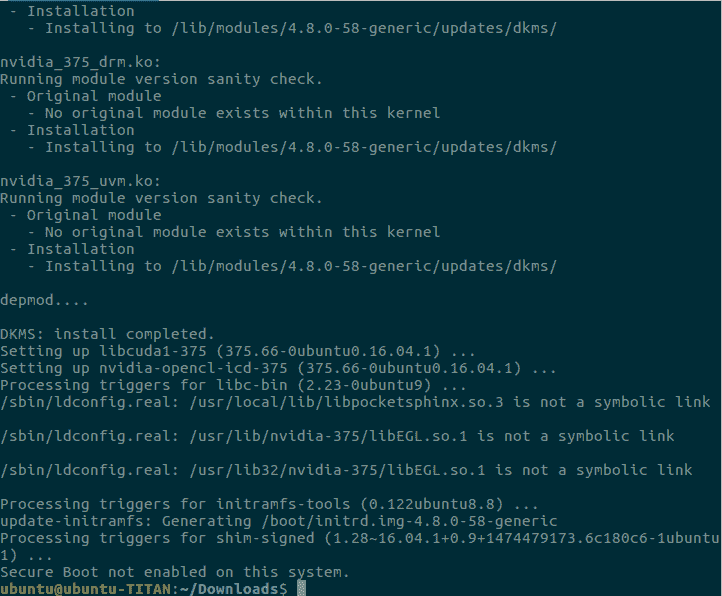
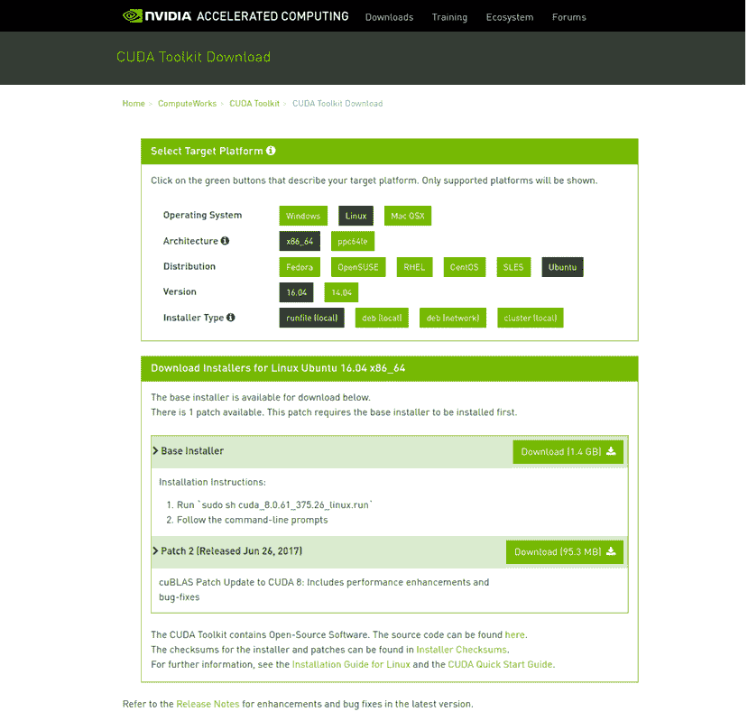
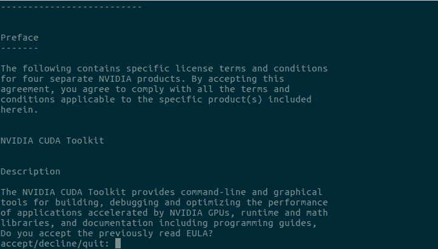
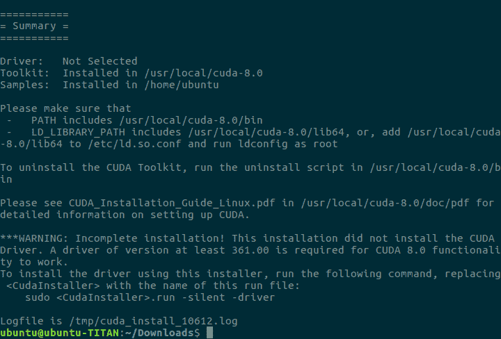
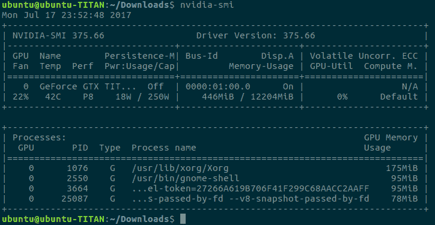
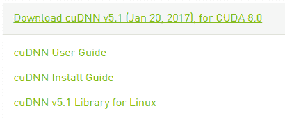
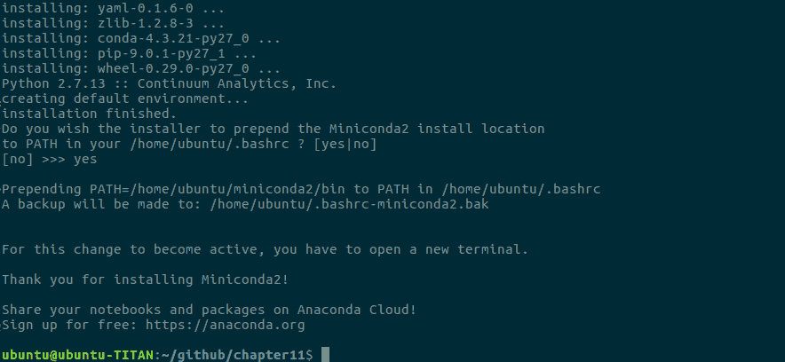
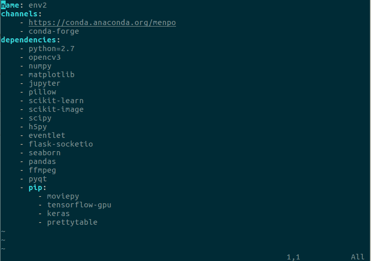
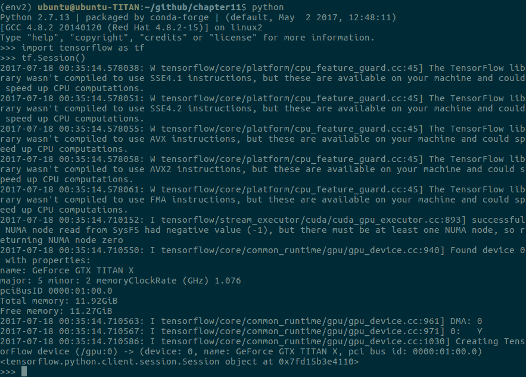
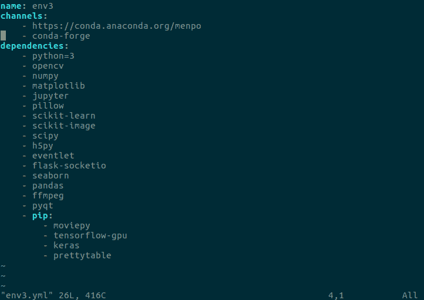

# 高级安装

深度学习涉及到海量的矩阵乘法，**图形处理单元**(**GPU**)是一个人开始学习深度学习时非常重要的方面。如果没有 GPU，实验过程可能需要一天或更长时间。有了一个好的 GPU，我们可以快速迭代深度学习网络和大型训练数据集，并在短时间内运行多个实验。使用 TensorFlow，我们可以轻松地在单个 GPU 甚至多个 GPU 上工作。然而，一旦 GPU 参与进来，大多数机器学习平台的安装都非常复杂。

在本章中，我们将讨论 GPU，并重点介绍一步一步的 CUDA 设置和基于 GPU 的 TensorFlow 安装。我们将从安装 Nvidia 驱动程序、CUDA 工具包和 cuDNN 库开始。然后，我们用`pip`安装支持 GPU 的 TensorFlow。最后，我们展示了如何使用 Anaconda 来进一步简化安装过程。


# 装置

在本章中，我们将在一台配备 Nvidia Titan X GPU 的 Ubuntu 16.06 计算机上工作。

我们建议您使用 Ubuntu 14.04 或 16.06 来避免进一步的问题。

GPU 的选择不在本章讨论范围之内。然而，你必须选择一个高内存容量的 Nvidia 设备，以便充分利用 GPU 与 CPU 相比的优势。目前，AMD GPUs 没有得到 TensorFlow 和大多数其他深度学习框架的官方支持。在编写时，Windows 可以在 Python 3.5 或 Python 3.6 上使用 Tensorflow 配合 GPU。但是 Tensorflow 从 Tensorflow 1.2 就把 macOS 上对 GPU 的支持给掉了。如果您使用的是 Windows，我们建议您通过以下链接阅读 Windows 官方教程:[https://www.tensorflow.org/install/install_windows](https://www.tensorflow.org/install/install_windows)。


# 安装 Nvidia 驱动程序

在 Ubuntu 中安装 Nvidia 驱动有很多方法。在本节中，我们将向您展示使用专有 GPU 驱动程序 PPA 的最简单方法，它提供稳定的专有 Nvidia 图形驱动程序更新。

首先，打开您的终端并运行以下命令将`PPA`添加到 Ubuntu:

```
sudo add-apt-repository ppa:graphics-drivers/ppa
sudo apt update  
```

现在，我们需要选择一个版本的 Nvidia 驱动程序来安装。运行以下命令查看您的计算机的最新版本:

```
sudo apt-cache search nvidia
```

上述命令的结果可能如下所示:


大家可以看到，我的机器上最新的驱动是 375.66，和文本 NVIDIA 二进制驱动是一条线上的。现在，我们可以使用以下命令安装 Nvidia 驱动程序版本 375.66:

```
sudo apt-get install nvidia-375 
```

前面命令的结果可能是这样的:


安装完成后，您应该会看到以下屏幕:



现在，我们将安装 Nvidia 的 CUDA 工具包。


# 安装 CUDA 工具包

首先，我们需要打开 Nvidia 网站下载 CUDA 工具包。导航到[https://developer.nvidia.com/cuda-downloads](https://developer.nvidia.com/cuda-downloads)。您将看到以下屏幕:


然后，选择 Linux | x86 _ 64 | Ubuntu | 16.04 | run file(本地)，如以下截图所示:



接下来，单击下载(1.4 GB)按钮下载安装程序。安装程序大小为 1.4 GB，完成下载需要一段时间。然后，打开您的终端，将目录切换到包含安装程序的文件夹，并运行以下命令:

```
sudo sh cuda_8.0.61_375.26_linux.run
```

在命令行提示中，您将看到最终用户许可协议:


您可以使用箭头键浏览协议。否则，您可以按下`:q`并看到以下屏幕:



现在，您可以键入`accept`来接受协议。之后，您需要回答一些问题，如以下屏幕所示:


您可能会注意到，我们不会在此提示中安装 Nvidia 驱动程序，因为我们已经在前一部分安装了最新的驱动程序。安装完成后，您将看到如下屏幕:



现在，打开您的`~/.bashrc`文件，并在文件末尾添加下面一行:

```
    export LD_LIBRARY_PATH=$LD_LIBRARY_PATH:/usr/local/cuda/lib64/ 
```

我们已经成功地将 CUDA 工具包安装到机器中。您可以尝试以下命令来查看您的显卡信息:

```
nvidia-smi
```

我们机器上的结果如下所示:



# 安装 cuDNN

为了在 GPU 支持下使用 TensorFlow，您需要安装 Nvidia 的另一个名为 cuDNN 的库。首先，你需要浏览英伟达网站并从 https://developer.nvidia.com/cudnn 下载 cuDNN 库。

您可能需要注册一个新的 Nvidia 帐户。登录 Nvidia 网站并打开 cuDNN 链接后，您将看到以下屏幕:


如你所见，cuDNN 有几个版本，我们将 cuDNN v5.1 用于 CUDA 8.0，这是 TensorFlow 要求的 cuDNN 版本。现在，您可以通过单击 cuDNN v5.1 Library for Linux 链接下载该库:



您可以继续使用您的终端，并使用以下命令在您的机器上安装 cuDNN:

```
tar -xf cudnn-8.0-linux-x64-v5.1.tgz 
cd cuda
sudo cp -P include/cudnn.h /usr/include/
sudo cp -P lib64/libcudnn* /usr/lib/x86_64-linux-gnu/
sudo chmod a+r /usr/lib/x86_64-linux-gnu/libcudnn*
```


# 安装 TensorFlow

设置好一切后，我们可以使用`pip`工具轻松安装支持 GPU 的 TensorFlow，如下所示:

```
sudo pip install tensorflow-gpu
```

该命令的结果应该如下所示:


# 使用 GPU 支持验证TensorFlow

现在，您可以在命令行上键入`python`并键入以下 Python 命令，以查看 TensorFlow 是否可以看到您的 GPU:

```
    import tensorflow as tf 
    tf.Session()
```

结果应该如下图所示:


恭喜你！TensorFlow 现在可以和你的 GPU 一起工作了。我们的 GPU 被公认为 GeForce GTX 泰坦 X，内存为 11.92 GB。在下一节中，我们将向您展示使用 TensorFlow 和 OpenCV 等库的多个版本的推荐方法。


# 对 Anaconda 使用 TensorFlow

在工作过程中，你会遇到在同一台机器上需要多个版本 TensorFlow 的情况，比如 TensorFlow 1.0 或者 TensorFlow 1.2。我们可能需要在 Python 2.7 或 3.0 中使用 TensorFlow。通过前面的安装，我们已经在系统 Python 中成功安装了 TensorFlow。现在，我们将向您展示如何使用 Anaconda 在同一台机器上拥有多个工作环境。有了 Anaconda，我们甚至可以使用其他流行库的不同版本，比如`OpenCV`、`NumPy`和`scikit-learn`。

首先，我们需要从 https://conda.io/miniconda.html[下载并安装 miniconda。在我们的例子中，我们选择 Python 2.7 64 位 bash 安装程序，因为我们希望使用 Python 2.7 作为默认的 Python。然而，我们以后可以用 Python 2.7 或 Python 3 创建环境。我们需要运行以下命令来运行安装程序:](https://conda.io/miniconda.html)

```
bash Miniconda3-latest-Linux-x86_64.sh
```

我们需要接受最终用户许可协议:


之后，我们可以继续安装。结果应该是这样的:



最后，我们需要找到`.bashrc`文件来启动和运行 Anaconda:

```
source ~/.bashrc
```

在本章的源代码中，我们已经提供了一些环境配置，您可以使用它们来创建您想要的环境。

这里是一个使用 Python 2.7、OpenCV 3 和 TensorFlow 1.2.1 并有 GPU 支持的环境。该配置被命名为`env2.yml`:



你可以很容易地把`python=2.7`改成`python=3`和`opencv3`改成`opencv`分别拥有 Python 3 和 OpenCV 2.4。

现在，让我们运行以下命令来创建环境:

```
conda env create -f env2.yml
```

结果应该如下所示:


接下来，您可以键入`source activate env2`来激活环境。

最后，我们需要像以前一样验证TensorFlow:



您可能会注意到上图左上角的(env2)。显示当前环境的名称。第二行的 Python 版本是 2.7.13，由 conda-forge 打包。

现在，您可以创建几个不同的环境在您的工作流程中使用。下面是一个使用 Python 3 和 OpenCV 2.4 的名为 env3 的环境示例:



# 摘要

在本章中，我们讨论了在机器学习工作流中使用 GPU 的优势，尤其是在深度学习中。然后，我们展示了一步一步安装 Nvidia 驱动程序、CUDA 工具包、cuDNN 和带 GPU 支持的 TensorFlow。我们还介绍了使用 TensorFlow 和其他库的多个版本的推荐工作流。