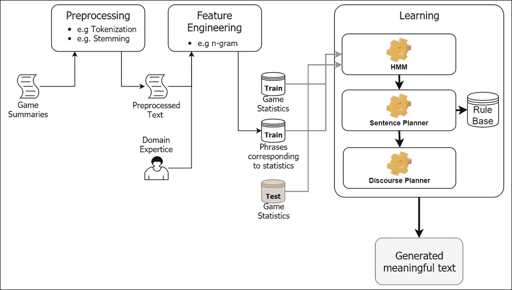
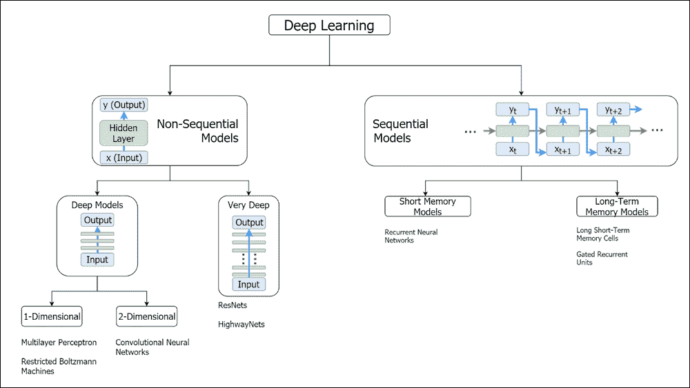

# 一、自然语言处理导论

**自然语言处理** ( **NLP** )是理解和处理当今世界海量非结构化数据的重要工具。最近，深度学习已被广泛用于许多 NLP 任务，因为深度学习算法在大量具有挑战性的任务中表现出了卓越的性能，如图像分类、语音识别和逼真的文本生成。反过来，TensorFlow 是目前存在的最直观、最高效的深度学习框架之一。这本书将使有抱负的深度学习开发者能够使用 NLP 和 TensorFlow 处理海量数据。

在这一章中，我们将介绍 NLP 和本书的其余部分。我们将回答这个问题，“什么是自然语言处理？”此外，我们将看看它的一些最重要的用途。我们还将考虑传统方法和最近基于深度学习的 NLP 方法，包括**全连接神经网络** ( **FCNN** )。最后，我们将以本书其余部分的概述和我们将使用的技术工具来结束。

# 什么是自然语言处理？

根据 IBM 的，2017 年每天产生 2.5 艾字节(1 艾字节= 1，000，000，000 千兆字节)的数据，并且随着本书的编写，这一数字还在增长。客观地说，如果世界上所有的人都要处理这些数据，我们每个人每天大约要处理 300 MB。在所有这些数据中，很大一部分是非结构化文本和语音，因为每天都有数百万封电子邮件和社交媒体内容被创建，还有电话被拨打。

这些统计数据为我们定义什么是 NLP 提供了良好的基础。简而言之，自然语言处理的目标是让机器理解我们的口头和书面语言。此外，自然语言处理无处不在，已经成为人类生活的一大部分。**虚拟助理** ( **VAs** ),如谷歌助理、Cortana 和苹果 Siri，大部分都是 NLP 系统。当一个人问一位退伍军人，“你能给我看看附近一家好的意大利餐馆吗？”。首先，VA 需要将话语转换为文本(即语音到文本)。接下来，它必须理解请求的语义(例如，用户正在寻找一家有意大利料理的好餐馆)并制定一个结构化的请求(例如，料理=意大利，等级= 3-5，距离< 10 公里)。然后，退伍军人事务部必须搜索按位置和菜肴过滤的餐馆，然后根据收到的评分对餐馆进行排序。为了计算餐馆的总体评级，一个好的自然语言处理系统可以查看每个用户提供的评级和文本描述。最后，一旦用户到达餐厅，VA 可能会通过将各种菜单项从意大利语翻译成英语来帮助用户。这个例子表明，自然语言处理已经成为人类生活不可分割的一部分。

应当理解，自然语言处理(NLP)是一个极具挑战性的研究领域，因为单词和语义具有高度复杂的非线性关系，并且更难将这种信息捕获为可靠的数字表示。更糟糕的是，每种语言都有自己的语法、句法和词汇。因此，处理文本数据涉及各种复杂的任务，如文本解析(例如，标记化和词干化)、形态分析、词义消歧以及理解语言的基本语法结构。比如，在这两句*我去了银行*和*我沿着河岸*走，银行*这个词有两个完全不同的意思。为了区分或消除单词 *bank* 的歧义，我们需要理解该单词使用的上下文。机器学习已经成为自然语言处理的关键推动者，帮助通过机器完成上述任务。*


# 自然语言处理任务

NLP 有多种现实世界的应用。一个好的自然语言处理系统是执行许多自然语言处理任务的系统。当您在谷歌上搜索今天的天气或使用*谷歌翻译*来查找如何说“你好吗？”在法语中，您依赖于 NLP 中此类任务的子集。我们将在此列出一些最常见的任务，本书涵盖了其中大多数任务:

*   **标记化**:标记化是将文本语料库分割成原子单位(例如单词)的任务。虽然看起来微不足道，但标记化是一项重要的任务。例如，在日语中，单词既不是由空格分隔，也不是由标点符号分隔。
*   **词义消歧(WSD)** :词义消歧是识别单词正确含义的任务。例如，在句子中，*狗对着邮递员*吠叫，*树皮有时被用作药物*，单词*树皮*有两种不同的意思。WSD 对于诸如问题回答之类的任务是至关重要的。
*   **命名实体识别(NER)** : NER 试图从给定的文本主体或文本语料库中提取实体(例如，人、位置和组织)。以为例，这句话，*约翰星期一在学校给了玛丽两个苹果*将转化为*【约翰】* *[姓名]* *给了【玛丽】* *[姓名]* *【两个】* *[编号]* *苹果在【学校】* *[组织]】* *[时间]* 。NER 是信息检索和知识表示等领域的一个重要课题。
*   **词性标注**:词性标注的任务是将单词分配到它们各自的词性。它可以是基本标记，如名词、动词、形容词、副词和介词，也可以是粒度标记，如专有名词、普通名词、短语动词、动词等。
*   **句子/概要分类**:句子或概要(例如，电影评论)分类有许多用例，例如垃圾邮件检测、新闻文章分类(例如，政治、技术和体育)以及产品评论评级(即，正面或负面)。这是通过用带标签的数据(即由人类标注的评论，带有正面或负面标签)训练分类模型来实现的。
*   **语言生成**:在语言生成中，学习模型(例如，神经网络)用文本语料库(大量文本文档的集合)来训练，该语料库预测随后的新文本。例如，语言生成可以通过使用现有的科幻故事进行训练来输出全新的科幻故事。
*   **问答(QA)** :问答技术具有很高的商业价值，这类技术存在于聊天机器人和虚拟设备(如谷歌助手和苹果 Siri)的基础上。聊天机器人已经被许多公司用于客户支持。聊天机器人可以用来回答和解决直接的客户问题(例如，更改客户的每月移动计划)，这些问题可以在没有人工干预的情况下解决。问答涉及到自然语言处理的许多其他方面，如信息检索和知识表示。因此，所有这些使得开发一个 QA 系统非常困难。
*   **机器翻译(MT)** : MT 是将一个句子/短语从源语言(例如德语)转换成目标语言(例如英语)的任务。这是一项非常具有挑战性的任务，因为不同的语言具有高度不同的形态结构，这意味着这不是一对一的转换。此外，语言之间的词对词关系可以是一对多、一对一、多对一或多对多。这在 MT 文献中被称为**单词对齐问题**。

最后，要开发一个可以在日常任务中帮助人类的系统(例如，虚拟设备或聊天机器人)，许多这些任务需要一起执行。正如我们在前面的例子中看到的，用户问，“你能告诉我附近有一家好的意大利餐馆吗？”需要完成几个不同的 NLP 任务，例如语音到文本的转换、语义和情感分析、问题回答和机器翻译。在*图 1.1* 中，我们提供了不同 NLP 任务的层次分类法，这些任务被分为几种不同的类型。我们首先有两大类:分析(分析现有文本)和生成(生成新文本)任务。然后我们将分析分为三个不同的类别:句法(基于语言结构的任务)、语义(基于意义的任务)、语用(难以解决的开放性问题):


图 1.1:根据更广泛的类别对 NLP 的热门任务进行分类

理解了 NLP 中的各种任务之后，现在让我们继续理解如何在机器的帮助下解决这些任务。


# 自然语言处理的传统方法

解决 NLP 的传统方法是几个关键步骤的连续流程，是一种统计方法。当我们仔细研究传统的 NLP 学习模型时，我们将能够看到一系列不同的任务正在发生，例如通过删除不需要的数据来预处理数据，通过特征工程来获得文本数据的良好数字表示，在训练数据的帮助下学习使用机器学习算法，以及预测新的陌生数据的输出。其中，特征工程是在给定的自然语言处理任务中获得良好性能的最耗时和最关键的步骤。

## 了解传统方法

解决 NLP 任务的传统方法包括一系列不同的子任务。首先，需要对文本语料库进行预处理，重点是减少词汇量和*干扰*。通过*干扰*，我指的是那些干扰算法(例如，标点符号和停用词删除)捕捉任务所需的重要语言信息的事情。

接下来，是几个特征工程步骤。特征工程的主要目标是使算法的学习更容易。这些功能通常是手工设计的，偏向于人类对语言的理解。特征工程对于经典的 NLP 算法来说是非常重要的，因此，性能最好的系统通常具有最好的工程特征。例如，对于情感分类任务，您可以用解析树表示一个句子，并为树中的每个节点/子树分配肯定、否定或中性标签，以将该句子分类为肯定或否定。此外，功能工程阶段可以使用外部资源，如 WordNet(一个词汇数据库)来开发更好的功能。我们很快会看到一个简单的特征工程技术，称为*单词袋*。

接下来，学习算法使用获得的特征和可选的外部资源来学习在给定任务中表现良好。例如，对于文本摘要任务，包含单词同义词的同义词库是一个很好的外部资源。最后，预测发生了。预测很简单，您将输入一个新的输入，并通过学习模型转发输入来获得预测的标签。传统方法的整个过程在*图 1.2* 中描述:


图 1.2:传统自然语言处理的一般方法

### 示例–生成足球比赛摘要

为了深入理解 NLP 的传统方法，让我们考虑一个从一场足球比赛的统计数据中自动生成文本的任务。我们有几组比赛统计数据(例如，得分、点球和黄牌)以及一名记者为该比赛生成的相应文章，作为训练数据。让我们也假设对于一个给定的游戏，我们有一个从每个统计参数到那个参数的摘要的最相关短语的映射。我们在这里的任务是，给定一个新游戏，我们需要生成一个自然的游戏摘要。当然，这可以简单到从训练数据中为新游戏找到最匹配的统计数据，并检索相应的摘要。然而，还有更复杂、更优雅的生成文本的方式。

如果我们要结合机器学习来生成自然语言，可能会执行一系列操作，如预处理文本、标记化、特征工程、学习和预测。

**预处理**文本涉及到操作，比如词干化(比如把*听*转换成*听*)和删除标点符号(比如！和；)，以减少词汇量(也就是特性)，从而降低内存需求。理解词干并不是一个简单的操作是很重要的。看起来，词干提取是一个简单的操作，依赖于一组简单的规则，比如从一个动词中删除 *ed* (例如， *listened* 的词干结果是*listen*)；然而，开发一个好的词干算法需要的不仅仅是一个简单的规则库，因为词干化某些单词可能很棘手(例如，*argured*的词干化结果是*argure*)。此外，对于其他语言来说，正确的词干提取所需的工作在复杂性上可能有所不同。

**标记化**是另一个可能需要执行的预处理步骤。标记化是将语料库分成小实体(例如，单词)的过程。对于像英语这样的语言来说，这可能显得微不足道，因为单词是孤立的；但是，对于某些语言(如泰语、日语和汉语)来说，情况并非如此，因为这些语言的分隔符并不一致。

**特征工程**用于将原始文本数据转换为吸引人的数字格式，以便可以根据该数据训练模型，例如，将文本转换为单词袋表示或使用我们稍后将讨论的 n-gram 表示。但是，请记住，最新的经典模型依赖于更加复杂的特征工程技术。

以下是一些特征工程技术:

**单词袋**:这种是一种基于单词出现频率创建特征表示的特征工程技术。例如，让我们考虑下面的句子:

*   鲍勃去市场买了些花
*   鲍勃买了花要送给玛丽

这两个句子的词汇是:

["鲍勃"、"去了"、"去了"、"市场"、"买了"、"一些"、"花了"、"买了"、"给了"、"玛丽"]

接下来，我们将为每个句子创建一个大小为 *V* (词汇大小)的特征向量，显示词汇中的每个单词在句子中出现的次数。在这个例子中，句子的特征向量分别如下:

[1, 1, 2, 1, 1, 1, 1, 1, 0, 0, 0]

[1, 0, 2, 1, 0, 0, 0, 1, 1, 1, 1]

单词袋方法的一个关键限制是，由于单词的顺序不再保留，它丢失了上下文信息。

**n-gram** :这是另一种特征工程技术，将文本分解成由 *n* 个字母(或单词)组成的更小的组成部分。例如，2-gram 会将文本分成两个字母(或两个单词)的实体。例如，考虑这个句子:

鲍勃去市场买了些花

这个句子的字母级 n-gram 分解如下:

【“博”、“ob”、“b”、“w”、“我们”、“en”，...、"我"、" e "、" f "、" fl "、" lo "、" ow "、"我们"、" er "、" rs"]

基于单词的 n 元语法分解是这样的:

【“鲍勃去了”，“去了”，“去了”，“市场”，...、“去买”、“买一些”、“一些花”]

这种表示(字母、级别)的优点是，与我们使用单词作为大型语料库的特征相比，词汇量将显著减少。

接下来，我们需要来构建我们的数据，以便能够将其输入到学习模型中。例如，我们将具有如下形式的数据元组:*(统计，解释统计的短语)*:

总进球数= 4，“上半场结束时，比赛双方各进 2 球”

球队 1 =曼联，“比赛在曼联和巴塞罗那之间进行”

球队 1 个进球= 5 个，“曼联设法取得 5 个进球”

**学习****可以包括三个子模块:一个**隐马尔可夫模型** ( **HMM** )、一个句子规划器和一个话语规划器。在我们的例子中，HMM 可以通过分析相关短语的语料库来学习语言的形态结构和语法属性。更具体地说，我们将把数据集中的每个短语连接起来形成一个序列，其中第一个元素是统计数据，后面跟着解释它的短语。然后，在给定当前序列的情况下，我们将通过要求 HMM 预测下一个单词来训练它。具体地说，我们将首先把统计量输入到 HMM 中，然后得到由 HMM 做出的预测；然后，我们将最后一个预测连接到当前序列，并要求 HMM 给出另一个预测，以此类推。这将使 HMM 能够输出有意义的短语，给出统计数据。**

**接下来，我们可以有一个句子规划器来纠正我们在短语中可能出现的任何语言错误(例如，词法或语法)。例如，一个句子规划器输出短语，*我回家*为*我回家*；它可以使用一个规则数据库，其中包含传达含义的正确方式(例如，动词和单词 *house* 之间需要一个介词)。**

**现在，我们可以使用 HMM 为一组给定的统计数据生成一组短语。然后，我们需要以这样一种方式聚集这些短语，使得从短语集合中产生的文章是人类可读的并且正确地流动。比如考虑三个短语，*巴萨队的 10 号球员下半场进了一球*，*巴萨对阵曼联*，*曼联队的 3 号球员上半场吃到了黄牌*；这些句子按这个顺序排列没有多大意义。我们喜欢他们这样的顺序:*巴萨对阵曼联*，曼联的*3 号球员上半场吃到黄牌*，巴萨队的*10 号球员下半场打进一球*。为了做到这一点，我们使用一个话语计划器；话语计划者可以安排和组织一系列需要传达的信息。**

**现在我们可以获得一组任意的测试统计数据，并按照前面的工作流程获得一篇解释统计数据的文章，如图*图 1.3* 所示:**

**

图 1.3:解决语言建模任务的经典方法示例的一个步骤** 

**这里，需要注意的是，这是一个非常高层次的解释，只涵盖了最有可能包含在传统 NLP 方式中的主要通用组件。细节可以根据我们想要解决的特定应用而有很大的不同。例如，某些任务可能需要额外的特定于应用程序的关键组件(机器翻译中的规则库和对齐模型)。然而，在本书中，我们不强调这些细节，因为这里的主要目标是讨论自然语言处理的更现代的方法。**

## **传统方法的缺点**

**让我们列出传统方法的几个主要缺点，因为这将为讨论深度学习的动机奠定良好的基础:**

*   **传统 NLP 中使用的预处理步骤迫使对文本中嵌入的潜在有用信息(例如，标点符号和时态信息)进行权衡，以便通过减少词汇量来使学习变得可行。虽然预处理仍然在现代基于深度学习的解决方案中使用，但由于深度网络的巨大表示能力，它不像传统的 NLP 工作流那样重要。**
*   **特征工程需要手动执行。为了设计一个可靠的系统，需要设计好的特性。这个过程可能非常乏味，因为需要广泛探索不同的特征空间。此外，为了有效地探索健壮的特性，需要领域专业知识，这对于某些 NLP 任务来说可能是稀缺的。**
*   **它的良好表现需要各种外部资源，可自由获取的并不多。这种外部资源通常由存储在大型数据库中的手动创建的信息组成。根据任务的严重性，为特定任务创建一个规则库可能需要几年时间(例如，机器翻译规则库)。**

**

# 自然语言处理的深度学习方法

我认为可以肯定的是，深度学习彻底改变了机器学习，特别是在计算机视觉、语音识别，当然还有 NLP 等领域。深度模型在机器学习的许多领域创造了一波范式转变，因为深度模型从原始数据中学习丰富的功能，而不是使用有限的人类工程功能。这必然导致讨厌而昂贵的特征工程过时。这样，深度模型使传统的工作流更加有效，因为深度模型同时执行特征学习和任务学习。此外，由于深度模型中的大量参数(即权重)，它可以包含比人类设计的更多的功能。然而，由于模型的可解释性差，深度模型被认为是黑盒。例如，理解深度模型针对给定问题学习的“如何”和“什么”特征仍然是一个开放的问题。

深度模型本质上是一个人工神经网络，它有一个输入层，中间有许多相互连接的隐藏层，最后还有一个输出层(例如，分类器或回归器)。如您所见，这形成了从原始数据到预测的端到端模型。中间的这些隐藏层为深度模型提供了力量，因为它们负责从原始数据中学习*好的*特征，最终成功完成手头的任务。

## 深度学习的历史

让我们简单地讨论一下深度学习的根源，以及该领域是如何发展成为一种非常有前途的机器学习技术的。1960 年，Hubel 和 Weisel 进行了一项有趣的实验，发现猫的视觉皮层由简单和复杂的细胞组成，这些细胞以层次形式组织起来。此外，这些细胞对不同的刺激有不同的反应。例如，简单的细胞被不同方向的边缘激活，而复杂的细胞对空间变化不敏感(例如，边缘的方向)。这激发了在机器中复制类似行为的动机，从而产生了深度学习的概念。

在接下来的几年里，神经网络获得了许多研究人员的关注。1965 年，Ivakhnenko 和其他人介绍了一种神经网络，该网络通过一种称为数据处理**分组方法( **GMDH** )的方法进行训练，并基于 Rosenblatt 著名的*感知器*。后来，在 1979 年，福岛引入了 *Neocognitron* ，为深度模型最著名的变体之一——卷积神经网络奠定了基础。与总是接受 1D 输入的感知机不同，新认知机能够使用卷积运算处理 2D 输入。**

人工神经网络用于反向传播误差信号，通过计算从一层到前一层的雅可比矩阵来优化网络参数。此外，消失梯度的问题严格限制了神经网络的潜在层数(深度)。更靠近输入的层的梯度非常小，被称为**消失梯度现象**。这是由于应用链规则来计算较低层权重的梯度(雅可比矩阵)而发生的。这反过来限制了经典神经网络的最大深度。

然后在 2006 年，发现*通过最小化*重构误差*(通过尝试将输入压缩到更低的维度，然后将其重构回原始维度而获得)来预训练*深度神经网络，为神经网络的权重提供了良好的初始起点；这允许从输出层到输入层的渐变流保持一致。这实质上允许神经网络模型有更多的层，而没有消失梯度的不良影响。此外，这些更深入的模型能够在许多任务中超越传统的机器学习模型，主要是在计算机视觉方面(例如，测试 MNIST 手写数字数据集的准确性)。凭借这一突破，深度学习成为了机器学习社区的流行语。

当 2012 年，AlexNet(由亚历克斯·克里热夫斯基([http://www.cs.toronto.edu/~kriz/](http://www.cs.toronto.edu/~kriz/))、伊利亚·苏茨基弗([http://www.cs.toronto.edu/~ilya/](http://www.cs.toronto.edu/~ilya/))和杰夫·辛顿创建的深度卷积神经网络)赢得了**2012 年大规模视觉识别挑战赛** ( **LSVRC** )时，误差比之前的最好成绩减少了 10%。在这次中，语音识别取得了进步，其中使用深度神经网络报告了最先进的语音识别准确度。此外，人们开始意识到**图形处理单元**(**GPU**)支持更多的并行性，与**中央处理单元**(**CPU**)相比，这允许更快地训练更大更深的网络。

深度模型通过更好的模型初始化技术(例如 Xavier 初始化)得到进一步改进，使得耗时的预训练变得多余。此外，引入了更好的非线性激活函数，如**整流线性单元** ( **雷鲁斯**)，减轻了消失梯度在更深模型中的不良影响。更好的优化(或学习)技术，如 Adam，自动调整神经网络模型中数百万个参数中每个参数的个体学习率，这改写了机器学习许多不同领域的最先进性能，如对象分类和语音识别。这些进步也允许神经网络模型有大量的隐藏层。与其他机器学习模型相比，增加隐藏层数量(即，使神经网络更深)的能力是神经网络模型性能明显更好的主要因素之一。此外，更好的中间正则化器，如批处理规范化层，提高了许多任务的深网性能。

后来又推出了更深层次的模型，如 ResNets、公路网、阶梯网等，这些模型有几百层，几十亿个参数。在各种经验和理论启发的技术的帮助下，有可能有如此巨大数量的层。例如，ResNets 使用快捷连接来连接相距很远的层，如前所述，这可以最大限度地减少层与层之间的渐变。

## 深度学习和 NLP 的现状

自 2000 年初问世以来，许多不同的深度模型已经出现。尽管它们有相似之处，例如它们都使用输入和参数的非线性变换，但细节可能会有很大差异。例如，**卷积神经网络** ( **CNN** )可以从二维数据(例如 RGB 图像)中原样学习，而多层感知器模型需要将输入展开为一维向量，导致重要的空间信息丢失。

在处理文本时，由于对文本最直观的解释之一是将其视为一个字符序列，学习模型应该能够进行时间序列建模，因此需要对过去的*记忆*。为了理解这一点，考虑一个语言建模任务；单词*猫*的下一个单词应该不同于单词*爬*的下一个单词。包含这种能力的一个流行的模型被称为**循环神经网络** ( **RNN** )。我们将在[第 6 章](ch06.html "Chapter 6. Recurrent Neural Networks")、*循环神经网络*中看到 RNNs 如何通过交互练习实现这一点。

应该注意的是*记忆*不是学习模型固有的琐碎操作。相反，保存记忆的方法应该仔细设计。此外，术语*内存*不应与仅查看当前输入的非顺序深度网络的学习权重相混淆，其中顺序模型(例如，RNN)将查看学习权重和序列的前一元素，以预测下一个输出。

RNNs 的一个突出缺点是它们只能记住几个(大约 7 个)时间步，因此缺乏长期记忆。**长短期记忆** ( **LSTM** )网络是封装长期记忆的 RNNs 的延伸。因此，如今 LSTMs 通常比标准 rnn 更受青睐。我们将在第七章、*长短期记忆网络*中一窥究竟，以便更好地理解它们。

总之，我们主要可以将深层网络分为两类:一类是非序列模型，每次只处理单个输入进行训练和预测(例如，图像分类)，另一类是序列模型，处理任意长度的输入序列(例如，文本生成，其中单个单词是单个输入)。然后，我们可以将非顺序(也称为前馈)模型分为深层(大约少于 20 层)和非常深层的网络(可以超过数百层)。顺序模型分为短时记忆模型(例如 RNNs)和长时记忆模型，前者只能记忆短时模式，后者可以记忆较长的模式。在*图 1.4* 中，我们概述了所讨论的分类法。不期望您在此时完全理解这些不同的深度学习模型，但它仅说明了深度学习模型的多样性:



图 1.4:最常用的深度学习方法的一般分类，分为几类

## 理解一个简单的深度模型——一个全连接的神经网络

现在让我们更仔细地看看一个深度神经网络，以便更好地理解。尽管深度模型有许多不同的变体，但让我们来看看最早的模型之一(可以追溯到 1950 年至 1960 年)，被称为**全连接神经网络** ( **FCNN** )，或有时被称为多层感知器。*图 1.5* 描绘了一个标准的三层 FCNN。

FCNN 的目标是将输入(例如，图像或句子)映射到某个标签或注释(例如，图像的对象类别)。这是通过使用输入 *x* 来计算*h*—*x*的隐藏表示——使用诸如 *h = sigma (W * x + b)* 的变换来实现的；这里， *W* 和 *b* 分别是 FCNN 的权重和偏差， *sigma* 是 sigmoid 激活函数。接下来，将一个分类器(例如，softmax 分类器)放置在 FCNN 的顶部，该分类器能够利用隐藏层中的学习特征来对输入进行分类。量词，本质上是 FCNN 的一部分，又是另一个带有某种权重的隐藏层， *W* *[s]* 和 a bias， *b* *[s]* 。同样，我们可以将 FCNN 的最终输出计算为，*output = soft max(W**[s]*** h+b**[s]**)*。例如，softmax 分类器提供分类器层输出的分数的归一化表示；该标签被认为是具有最高 softmax 值的输出节点。然后，通过这一点，我们可以定义一个分类损失，计算为预测输出标签和实际输出标签之间的差异。这种损失函数的一个例子是均方损失。如果你不理解损失函数的实际复杂性，你不必担心。我们将在后面的章节中讨论其中的一些。接下来，使用标准随机优化器(例如，随机梯度下降)来优化神经网络参数 *W* 、 *b* 、 *W* 、 [s] 、 *b* 、*、 [s] 、*，以减少所有输入的分类损失。*图 1.5* 描述了本段中针对三层 FCNN 解释的过程。我们将在[第 3 章](ch03.html "Chapter 3. Word2vec – Learning Word Embeddings")、*Word 2 vec–学习词嵌入*中一步一步地详细介绍如何使用这样的模型来完成 NLP 任务。


图 1.5:一个全连接神经网络的例子(FCNN)

让我们看一个如何使用神经网络进行情感分析的例子。假设我们有一个数据集，其中的输入是一个表达对一部电影的正面或负面意见的句子，以及一个相应的标签，说明该句子实际上是正面的(1)还是负面的(0)。然后，给我们一个测试数据集，其中有单句电影评论，我们的任务是将这些新句子分类为正面或负面。

通过遵循以下工作流程，可以使用神经网络(可深可浅，取决于任务的难度)来完成该任务:

1.  用词来修饰句子
2.  如果必要的话，用一个特殊的符号填充句子，使所有的句子长度固定
3.  将句子转换成数字表示法(例如，单词袋表示法)
4.  将数字输入输入到神经网络，并预测输出(正或负)
5.  使用期望的损失函数优化神经网络


# 路线图–超越本章

这一节描述了本书其余部分的细节；它很简短，但是包含了关于这本书每一章内容的详细信息。在这本书里，我们将会看到 NLP 的许多令人兴奋的领域，从不用任何注释数据就能找到单词相似性的算法，到可以自己写故事的算法。

从下一章开始，我们将深入了解几个流行且有趣的 NLP 任务的细节。为了获得深入的知识并使学习互动，还提供了各种练习。我们将在所有实现中使用 Python 和 TensorFlow，这是一个用于分布式数值计算的开源库。TensorFlow 封装了先进的技术，例如使用**计算统一设备架构** ( **CUDA** )为 GPU 优化您的代码，这可能具有挑战性。此外，TensorFlow 提供了用于实现深度学习算法的内置函数，例如，激活、随机优化方法和卷积，使每个人的生活变得更容易。

我们将开始一段旅程，涵盖 NLP 的许多热门话题以及它们如何执行，同时使用 TensorFlow 来查看最先进的算法。这就是我们将在本书中探讨的内容:

*   [第 2 章](ch02.html "Chapter 2. Understanding TensorFlow")，*了解 TensorFlow* ，为您提供了一个声音指南，帮助您了解如何编写客户端程序并在 TensorFlow 中运行它们。这一点非常重要，尤其是如果您是 TensorFlow 的新手，因为 TensorFlow 的行为与 Python 等传统编码语言不同。本章将首先深入解释 TensorFlow 如何执行客户端。这将有助于您理解 TensorFlow 执行工作流程，并对 TensorFlow 术语感到舒适。接下来，本章将向您介绍 TensorFlow 客户端的各种元素，如定义变量、定义操作/函数、向算法输入数据以及获取结果。我们最后将讨论如何使用 TensorFlow 的所有知识来实现一个中等复杂的神经网络，以对手写图像进行分类。
*   [第三章](ch03.html "Chapter 3. Word2vec – Learning Word Embeddings")，*Word 2 vec——学习词嵌入*。本章的目的是介绍 word 2 vec——一种学习反映单词语义的数字表示的方法。但是在直接进入 Word2vec 技术之前，我们将首先讨论一些用于表示单词语义的经典方法。早期的方法之一是依赖 WordNet——一个大型词汇数据库。WordNet 可以用来衡量不同单词之间的语义相似度。然而，维护如此大的词汇数据库是昂贵的。因此，存在其他更简单的表示技术，例如一个热编码的表示，以及术语频率逆文档频率方法，它们不依赖于外部资源。接下来，我们将进入学习单词向量的现代方法，称为 Word2vec，在这里我们使用神经网络来学习单词表示。我们将讨论两种流行的 Word2vec 技术:skip-gram 和连续词袋(CBOW)模型。
*   [第四章](ch04.html "Chapter 4. Advanced Word2vec")，*高级 Word2vec* 。我们将从几个比较开始这一章，包括 skip-gram 和 CBOW 算法之间的比较，看看是否有一个明显的赢家。然后我们将讨论在过去几年中引入到原始 Word2vec 技术中的几个扩展。例如，忽略文本中的常见单词，如“the”和“a ”,有很高的概率，可以提高 Word2vec 模型的性能。另一方面，Word2vec 模型只考虑了一个词的局部上下文，忽略了整个语料库的全局统计。因此，将讨论一种称为 GloVe 的词嵌入学习技术，该技术在寻找单词向量时结合了全局和局部统计。
*   [第五章](ch05.html "Chapter 5. Sentence Classification with Convolutional Neural Networks")、*用卷积神经网络进行句子分类*，向您介绍卷积神经网络(CNN)。卷积网络是一个强大的深度模型家族，可以利用输入的空间结构从数据中学习。换句话说，CNN 可以处理二维形式的图像，而多层感知器需要将图像展开为一维向量。我们将首先详细讨论细胞神经网络中的各种运算，如卷积和汇集运算。然后我们将看到一个例子，我们将学习用 CNN 对手写数字图像进行分类。然后我们将过渡到 CNN 在 NLP 中的应用。确切地说，我们将研究如何应用 CNN 来对句子进行分类，其中的任务是对一个句子是否是关于人、地点、物体等等进行分类。
*   [第 6 章](ch06.html "Chapter 6. Recurrent Neural Networks")，*循环神经网络*，重点介绍循环神经网络(RNNs)以及使用 RNNs 进行语言生成。rnn 不同于前馈神经网络(例如，CNN ),因为 rnn 具有记忆。存储器存储为持续更新的系统状态。我们将从前馈神经网络的表示开始，并修改该表示以从数据序列而不是单个数据点中学习。这个过程将把前馈网络转换成 RNN。接下来是关于在 RNN 内用于计算的精确方程的技术描述。接下来，我们将讨论用于更新 RNN 权重的 RNNs 的优化过程。此后，我们将遍历不同类型的 rnn，例如一对一 rnn 和一对多 rnn。然后，我们将演练一个令人兴奋的 RNNs 应用程序，其中 RNN 将通过从现有故事的语料库中学习来讲述新故事。我们通过训练 RNN 在给定故事中前面的单词序列的情况下预测下一个单词来实现这一点。最后，我们将讨论标准 RNNs 的一个变体，我们称之为 RNN-CF(具有上下文特征的 RNN)，并将它与标准 RNN 进行比较，看哪一个性能更好。
*   [第 7 章](ch07.html "Chapter 7. Long Short-Term Memory Networks")，*，*长短期记忆网络，通过最初提供这些模型如何工作的坚实直觉，并逐步深入到足以自己实现它们的技术细节，来讨论 LSTMs。标准的 rnn 受到无法保持长期记忆的严重限制。然而，已经提出了高级 RNN 模型(例如，长短期记忆细胞(LSTMs)和门控循环单位(GRUs))，其可以记住大量时间步骤的序列。我们也将检验 LSTMs 是如何缓解持续长期记忆的问题的(这就是所谓的消失梯度问题)。然后，我们将讨论几种可以用来进一步改进 LSTM 模型的改进，例如一次性预测几个时间步长，以及向前和向后读取序列。最后，我们将讨论 LSTM 模型的几个变种，如 GRUs 和带窥视孔连接的 lstm。
*   [第 8 章](ch08.html "Chapter 8. Applications of LSTM – Generating Text")、*LSTM 的应用——生成文本*，解释了如何用[第 7 章](ch07.html "Chapter 7. Long Short-Term Memory Networks")、*长短期记忆网络*中讨论的窥视孔连接实现 LSTM、GRUs 和 lstm。此外，我们将定性和定量地比较这些扩展的性能。我们还将讨论如何实现在第 7 章、*长短期记忆网络*中检查的一些扩展，例如提前预测几个时间步长(称为波束搜索)和使用单词向量作为输入，而不是一个热编码表示。最后，我们将讨论如何使用 RNN API，它是 TensorFlow 的一个子库，简化了递归模型的实现。
*   [第 9 章](ch09.html "Chapter 9. Applications of LSTM – Image Caption Generation")，*LSTM 的应用——图像标题生成*，着眼于另一个令人兴奋的应用，其中模型学习如何使用 LSTM 和 CNN 为图像生成标题(即描述)。这个应用程序很有趣，因为它向我们展示了如何组合两种不同类型的模型，以及如何学习多模态数据(例如，图像和文本)。实现这一点的具体方式是首先用 CNN 学习图像表示(类似于单词向量),并通过馈送该图像向量，然后馈送图像描述的单词作为序列来训练 LSTM。我们将首先讨论如何使用预训练的 CNN 来获得图像表示。然后我们将讨论如何学习词嵌入。接下来，我们将讨论如何将图像向量与词嵌入一起用于训练 LSTM。接下来是对用于评估图像字幕系统的不同评估标准的描述。之后，我们将从定性和定量两个方面评估由我们的模型生成的字幕。我们将以如何使用 TensorFlow RNN API 实现相同系统的指南来结束本章。
*   [第十章](ch10.html "Chapter 10. Sequence-to-Sequence Learning – Neural Machine Translation")，*序列到序列学习——神经机器翻译*。由于自动化翻译的必要性和任务的内在难度，机器翻译已经获得了很多关注。我们将以一段简短的历史回顾开始这一章，回顾机器翻译在早期是如何实现的。这个讨论以对神经机器翻译(NMT)系统的介绍结束。我们将看到当前的 NMT 系统与旧系统(如统计机器翻译系统)相比表现如何，这将激励我们了解 NMT 系统。之后，我们将讨论 NMT 系统设计背后的直觉，并继续讨论技术细节。然后，我们将讨论用于评估系统的评估指标。接下来，我们将研究如何从头开始实现一个德语到英语的翻译器。接下来，我们将了解改进 NMT 系统的方法。我们将详细研究其中的一个扩展，叫做注意力机制。注意力机制已经成为解决学习问题的一个重要因素。最后，我们将比较注意力机制所获得的绩效改善，并分析绩效改善背后的原因。本章的最后一节讲述了如何将 NMT 系统的相同概念扩展到聊天机器人。聊天机器人是可以与人类交流的系统，用于满足各种客户要求。
*   [第十一章](ch11.html "Chapter 11. Current Trends and the Future of Natural Language Processing")、*自然语言处理的当前趋势和未来*。自然语言处理已经扩展到各种不同的任务。在这里，我们将讨论一些当前的趋势和未来的发展，我们可以期待在未来的 NLP。我们将首先讨论最近出现的各种词嵌入扩展。我们还将研究一种这样的嵌入学习技术的实现，称为电视嵌入。接下来，我们将考察神经机器翻译领域的各种发展趋势。然后，我们将看看 NLP 如何与其他领域(如计算机视觉和强化学习)相结合，以解决一些有趣的问题，如通过设计自己的语言来教计算机代理进行通信。目前另一个蓬勃发展的领域是人工通用智能，它是关于开发可以用一个系统完成多项任务(分类图像、翻译文本、字幕图像等)的系统。我们将研究几个这样的系统。之后再讲 NLP 引入挖掘社交媒体。我们将以一些新出现的任务(例如，语言基础——开发常识 NLP 系统)和新模型(例如，分阶段 LSTMs)来结束本章。
*   [附录](apa.html "Appendix A. Mathematical Foundations and Advanced TensorFlow")、*数学基础和高级 TensorFlow*，将向读者介绍各种数学数据结构(例如矩阵)和运算(例如矩阵求逆)。我们还将讨论概率中的几个重要概念。然后我们将介绍 Keras——一个在底层使用 TensorFlow 的高级库。Keras 通过隐藏 TensorFlow 中的一些细节，简化了神经网络的实现，有些人可能会觉得这很有挑战性。具体来说，我们将看到如何用 Keras 实现 CNN，并对如何使用 Keras 有所了解。接下来，我们将讨论如何使用 TensorFlow 中的 seq2seq 库来实现一个神经机器翻译系统，使用的代码比我们在[第 11 章](ch11.html "Chapter 11. Current Trends and the Future of Natural Language Processing")、*当前趋势和自然语言处理的未来*中使用的代码少得多。最后，我们将带您浏览一个旨在教您使用张量板来可视化词嵌入的指南。TensorBoard 是 TensorFlow 附带的一个方便的可视化工具。这可用于可视化和监控 TensorFlow 客户端中的各种变量。


# 技术工具介绍

在此部分，您将了解到在以下章节的练习中会用到的技术工具。首先，我们将简要介绍所提供的主要工具。接下来，我们将介绍如何安装每个工具的粗略指南，以及官方网站提供的详细指南的超链接。此外，我们将分享如何确保工具安装正确的技巧。

## 工具的描述

我们将使用 Python 作为编码/脚本语言。Python 是一种非常通用的易于设置的编码语言，被科学界广泛使用。此外，围绕 Python 有许多科学库，迎合了从深度学习到概率推理到数据可视化的各种领域。TensorFlow 就是这样一个库，它在深度学习社区中非常有名，提供了许多对深度学习有用的基本和高级操作。接下来，我们将在所有练习中使用 Jupyter 笔记本，因为与使用 IDE 相比，它为编码提供了一个更具交互性的环境。我们还将使用 scikit-learn——另一个流行的 Python 机器学习工具包——用于各种各样的目的，比如数据预处理。我们将用于各种文本相关操作的另一个库是 NLTK——Python 自然语言工具包。最后，我们将使用 matplotlib 进行数据可视化。

## 安装 Python 和 scikit-学习

Python 可以毫不费力地安装在任何常用的操作系统中，如 Windows、macOS 或 Linux。我们将使用 Anaconda 来设置 Python，因为它完成了设置 Python 和基本库的所有繁重工作。

要安装 Anaconda，请遵循以下步骤:

1.  从 https://www.continuum.io/downloads[下载蟒蛇](https://www.continuum.io/downloads)
2.  选择合适的操作系统并下载 Python 3.5
3.  按照[https://docs.continuum.io/anaconda/install/](https://docs.continuum.io/anaconda/install/)的说明安装 Anaconda

要检查 Anaconda 是否正确安装，请遵循以下步骤:

1.  打开终端窗口(Windows 中的命令提示符)
2.  现在，运行下面的命令:

    ```py
     conda --version 
    ```

如果安装正确，当前 Anaconda 发行版的版本应该显示在终端[http://scikit-learn.org/stable/install.html](http://scikit-learn.org/stable/install.html)的指令，https://www.nltk.org/install.html[的 NLTK](https://www.nltk.org/install.html)和 https://matplotlib.org/users/installing.html[的 Matplotlib】中。](https://matplotlib.org/users/installing.html)

## 安装 Jupyter 笔记本

您可以在[http://jupyter.readthedocs.io/en/latest/install.html](http://jupyter.readthedocs.io/en/latest/install.html)按照说明安装 Jupyter 笔记本。

要检查【Jupyter 笔记本是否正确安装，请遵循以下步骤:

1.  打开终端窗口
2.  Run this command:

    ```py
    jupyter notebook

    ```

    您应该会看到一个新的浏览器窗口，看起来像*图 1.6* :

    

    图 1.6。Jupyter 笔记本安装成功

## 安装 TensorFlow

按照*安装 Anaconda* 小节下[https://www.tensorflow.org/install/](https://www.tensorflow.org/install/)给出的说明安装 TensorFlow。我们将在所有练习中使用 TensorFlow 1.8.x。

当按照说明中的要求提供 tfBinaryURL 时，请确保您提供的是 TensorFlow 1.8.x 版本。我们之所以强调这一点，是因为与之前的 TensorFlow 版本相比，API 经历了许多变化。

要检查 TensorFlow 是否安装正确，请遵循以下步骤:

1.  在 Windows 中打开命令提示符，或者在 Linux 或 macOS 中打开终端。
2.  键入`python`进入 Python 环境。现在，您应该可以在下面看到 Python 版本。确保您使用的是 Python 3。
3.  接下来，输入以下命令:

    ```py
    import tensorflow as tf print(tf.__version__)
    ```

如果一切顺利，您应该不会有任何错误(如果您的计算机没有专用的 GPU，可能会有警告，但您可以忽略它们)，TensorFlow 版本 1.8.x 应该会显示出来。

### 注

还提供了许多基于云的计算平台，您可以在其中设置自己的机器，进行各种定制(操作系统、GPU 卡类型、GPU 卡数量等等)。由于以下优势，许多人正在迁移到这种基于云的服务:

*   更多定制选项
*   维护工作量减少
*   没有基础设施需求

几种流行的基于云的计算平台如下:

*   【https://cloud.google.com/】谷歌云平台 ( **GCP** ): [谷歌云平台](https://cloud.google.com/)
*   **亚马逊网络服务**(**AWS**):[https://aws.amazon.com/](https://aws.amazon.com/)
*   **TensorFlow 研究云**(**https://www.tensorflow.org/tfrc/**):


# 总结

在这一章中，我们广泛地探讨了 NLP，以便对构建一个好的基于 NLP 的系统所涉及的任务有一个初步的印象。首先，我们解释了为什么我们需要 NLP，然后讨论了 NLP 的各种任务，以大致了解每个任务的目标以及成功完成这些任务的难度。

接下来，我们查看了解决 NLP 的经典方法，并使用一个为足球比赛生成体育摘要的示例来深入了解工作流的细节。我们看到，传统的方法通常涉及繁琐和乏味的特征工程。例如，为了检查生成短语的正确性，我们可能需要为该短语生成一个解析树。接下来，我们讨论了深度学习带来的范式转变，并看到了深度学习如何使特征工程步骤变得过时。我们从一点时间旅行开始，回到深度学习和人工神经网络的最初阶段，并努力发展到具有数百个隐藏层的大型现代网络。之后，我们通过一个简单的例子演示了一个深度模型——一个多层感知器模型——来理解在这样一个模型中发生的数学奇迹(当然是在表面上！).

有了接近自然语言处理的传统和现代方法的良好基础，我们接着讨论了理解我们将在本书中涉及的主题的路线图，从学习词嵌入到强大的 LSTMs，为图像生成字幕到神经机器翻译器！最后，我们通过安装 Python、scikit-learn、Jupyter Notebook 和 TensorFlow 来设置我们的环境。

在下一章，你将学习 TensorFlow 的基础知识。在本章结束时，你应该能够熟练地编写一个简单的算法，它可以接受一些输入，通过一个定义的函数转换输入，并输出结果。**