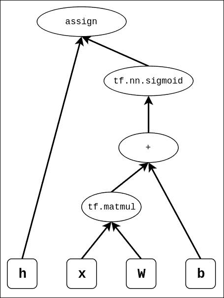
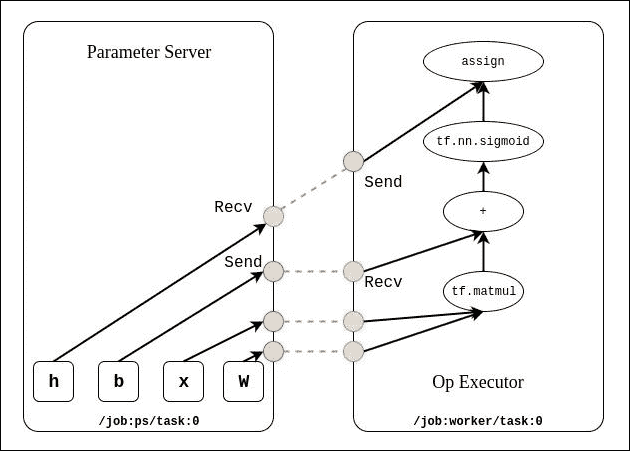
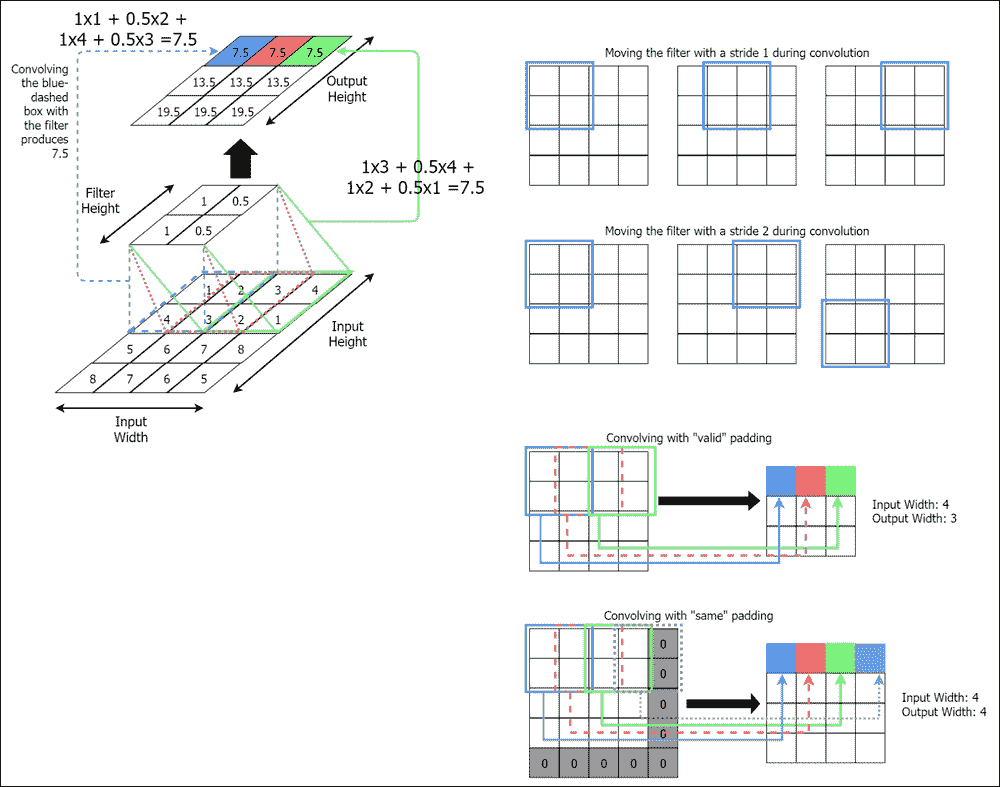

# 第二章。理解张量流

在本章中，您将对 TensorFlow 有一个深入的了解。这是一个开源的分布式数值计算框架，它将是我们实现所有练习的主要平台。

我们将通过定义一个简单的计算并尝试使用 TensorFlow 计算来开始 TensorFlow。在我们成功完成这个之后，我们将研究 TensorFlow 如何执行这个计算。这将帮助我们理解框架如何创建一个计算图来计算输出，并通过一个叫做**会话**的东西来执行这个图。然后，我们将通过讲述 TensorFlow 如何执行事情，并借助一个类似于餐厅如何运营的例子，获得 TensorFlow 架构的实践经验。

对 TensorFlow 如何运行有了很好的概念和技术理解后，我们将看看该框架提供的一些重要的计算操作。首先，我们将看看如何在 TensorFlow 中定义各种数据结构，比如变量、占位符和张量，我们还将看看如何读取输入。然后，我们将学习一些与神经网络相关的操作(例如，卷积操作、定义损失和优化)。接下来，我们将学习如何使用作用域来重用和有效管理张量流变量。最后，我们将在一个令人兴奋的练习中应用这些知识，在这个练习中，我们将实现一个可以识别手写数字图像的神经网络。

# 什么是 TensorFlow？

在[第一章](ch01.html "Chapter 1. Introduction to Natural Language Processing")、*自然语言处理介绍*中，我们简单讨论了什么是张量流。现在让我们更仔细地看看它。TensorFlow 是 Google 发布的一个开源分布式数值计算框架，主要用于减轻实现神经网络的痛苦细节(例如，计算神经网络权重的导数)。TensorFlow 更进一步，使用 NVIDIA 推出的并行计算平台**Compute Unified Device Architecture**(**CUDA**)提供此类数值计算的高效实施。TensorFlow 在[https://www.tensorflow.org/api_docs/python/](https://www.tensorflow.org/api_docs/python/)的**应用编程接口** ( **API** ) 显示 TensorFlow 提供了数千种操作，让我们的生活变得更简单。

TensorFlow 不是一夜之间发展起来的。这是那些有才华、有爱心的人坚持不懈的结果，他们希望通过将深度学习带给更广泛的受众而有所作为。如果你有兴趣，可以在[https://github.com/tensorflow/tensorflow](https://github.com/tensorflow/tensorflow)看一下 TensorFlow 代码。目前，TensorFlow 有大约 1000 名贡献者，它位于超过 25000 个提交之上，每天都在变得越来越好。

## tensor flow 入门

现在，让我们通过一个代码示例来了解 TensorFlow 框架中的几个基本组件。让我们编写一个示例来执行以下计算，这对于神经网络来说非常常见:

```
h = sigmoid(W * x + b)
```

这里`W`和`x`是矩阵，`b`是向量。那么，*表示点积。`sigmoid`以下等式:


我们将逐步讨论如何通过 TensorFlow 进行这种计算。

首先，我们需要导入 TensorFlow 和 NumPy。在运行任何类型的与 TensorFlow 或 NumPy 相关的操作之前，导入它们是非常重要的，在 Python 中:

```
import tensorflow as tf
import numpy as np
```

接下来，我们将定义一个 graph 对象，稍后我们将用操作和变量填充它:

```
graph = tf.Graph() # Creates a graph
session = tf.InteractiveSession(graph=graph) # Creates a session
```

`graph`对象包含连接我们在程序中定义的各种输入和输出的计算图，以获得最终所需的输出(也就是说，它定义了如何连接`W`、`x`和`b`以产生图形式的`h`)。例如，如果你认为输出是一块*蛋糕*，那么*图*将是使用*配料*(即输入)制作蛋糕的配方。此外，我们将定义一个`session`对象，它将已定义的图形作为输入，执行该图形。我们将在下一节详细讨论这些元素。

### 注

要创建一个新的`graph`对象，您可以使用下面的方法，就像我们在前面的例子中所做的那样:

```
graph = tf.Graph()
```

或者，您可以使用以下方法获得 TensorFlow 默认计算图:

```
graph = tf.get_default_graph()
```

我们用这两种方法展示练习。

现在我们将定义几个张量，即`x`、`W`、`b`和`h`。张量本质上是 TensorFlow 中的一个 *n* 维数组。比如一维向量或者二维矩阵叫做**张量**。在 TensorFlow 中有几种不同的方法可以定义张量。在这里，我们将研究三种不同的方法:

1.  首先，`x`是一个占位符。占位符，顾名思义，不是用某个值初始化的。相反，我们将在图形执行时即时提供值。
2.  接下来，我们有变量`W`和`b`。变量是可变的，这意味着它们的值会随着时间而变化。
3.  最后我们有`h`，它是通过对`x`、`W`和`b` :

    ```
    x = tf.placeholder(shape=[1,10],dtype=tf.float32,name='x') W = tf.Variable(tf.random_uniform(shape=[10,5], minval=-0.1, maxval=0.1, dtype=tf.float32),name='W') b = tf.Variable(tf.zeros(shape=[5],dtype=tf.float32),name='b') h = tf.nn.sigmoid(tf.matmul(x,W) + b)
    ```

    进行一些运算产生的不可变张量

另外，请注意，对于`W`和`b`，我们提供了一些重要的参数，如下所示:

```
tf.random_uniform(shape=[10,5], minval=-0.1, maxval=0.1, dtype=tf.float32)
tf.zeros(shape=[5],dtype=tf.float32)
```

这些被称为变量初始化器，是最初将被分配给`W`和`b`变量的张量。如果没有初始值作为占位符，变量就不能浮动，需要一直给它们赋值。这里，`tf.random_uniform`是指我们在`minval` ( `-0.1`)和`maxval` ( `0.1`)之间均匀采样值，给张量赋值，`tf.zeros`用零初始化张量。在定义张量的时候，定义张量的形状也是非常重要的。属性定义了张量每个维度的大小。例如，如果`shape`是`[10, 5]`，这意味着它将是一个二维结构，并且将在轴 0 上有`10`元素，在轴 1 上有`5`元素。

接下来，我们将运行初始化操作，初始化图中的变量`W`和`b`:

```
tf.global_variables_initializer().run()
```

现在，我们将执行该图以获得我们需要的最终输出，`h`。这是通过运行`session.run(...)`来完成的，在这里我们将值作为`session.run()`命令的参数提供给占位符:

```
h_eval = session.run(h,feed_dict={x: np.random.rand(1,10)})
```

最后，我们关闭会话，释放由`session`对象持有的任何资源。

```
session.close()
```

下面是这个 TensorFlow 示例的完整代码。本章中的所有代码示例都可以在`ch2`文件夹中的`tensorflow_introduction.ipynb`文件中找到:

```
import tensorflow as tf
import numpy as np

# Defining the graph and session
graph = tf.Graph() # Creates a graph
session = tf.InteractiveSession(graph=graph) # Creates a session

# Building the graph
# A placeholder is an symbolic input
x = tf.placeholder(shape=[1,10],dtype=tf.float32,name='x') W = tf.Variable(tf.random_uniform(shape=[10,5], minval=-0.1, maxval=0.1, dtype=tf.float32),name='W') # Variable
# Variable
b = tf.Variable(tf.zeros(shape=[5],dtype=tf.float32),name='b') 
h = tf.nn.sigmoid(tf.matmul(x,W) + b) # Operation to be performed

# Executing operations and evaluating nodes in the graph
tf.global_variables_initializer().run() # Initialize the variables

# Run the operation by providing a value to the symbolic input x
h_eval = session.run(h,feed_dict={x: np.random.rand(1,10)})
# Closes the session to free any held resources by the session
session.close()
```

运行此代码时，您可能会遇到警告，如下所示:

```
... tensorflow/core/platform/cpu_feature_guard.cc:137] Your CPU supports instructions that this TensorFlow binary was not compiled to use: ...
```

这个不用担心。这是一个警告，说明您使用了现成的 TensorFlow 预编译版本，而没有在您的计算机上编译它。这完全没问题。只是如果你在你的计算机上编译它，你会得到一个稍微好一点的性能，因为 TensorFlow 会针对那个特定的硬件进行优化。

在接下来的部分中，我们将解释 TensorFlow 如何执行这些代码来产生最终的输出。还要注意，接下来的两个部分有些复杂和技术性。然而，如果你没有完全理解所有的事情，你也不必担心，因为在这之后，我们将通过一个很好的、彻底的真实世界的例子，在这个例子中，同样的执行被解释为如何在一家餐馆，我们自己的 *Café Le TensorFlow* 中履行订单。

## 详细 TensorFlow 客户端

前面的示例程序称为 TensorFlow 客户端。在你用 TensorFlow 编写的任何客户端程序中，都会有两种主要类型的对象:*操作*和*张量*。在前面的例子中，`tf.nn.sigmoid`是一个操作，`h`是一个张量。

然后我们有一个`graph`对象，它是存储我们程序数据流的计算图。当我们在代码中添加定义`x`、`W`、`b`和`h`的后续行时，TensorFlow 会自动将这些张量和任何操作(例如，`tf.matmul()`)作为节点添加到图中。该图将存储重要的信息，如张量依赖性和在哪里执行哪个操作。在我们的例子中，图形将知道要计算`h`，需要张量`x`、`W`和`b`。因此，如果您在运行时没有正确初始化其中一个，TensorFlow 可以为您指出需要修复的确切初始化错误。

接下来，会话扮演执行图的角色，它将图分成子图，然后再分成更小的块，这些块将被分配给执行所分配任务的工人。这是通过`session.run(...)`功能完成的。我们很快会谈到这一点。为了将来参考，让我们称我们的例子*为乙状结肠例子*。

## TensorFlow 架构——执行客户端时会发生什么？

我们知道 TensorFlow 擅长创建一个包含所有依赖关系和操作的漂亮的计算图，因此它确切地知道数据如何、何时以及流向何处。但是，要让 TensorFlow 变得伟大，还需要一个元素:有效执行已定义的计算图。这就是会话的用武之地。现在，让我们看看会话的内部，以了解该图是如何执行的。

首先，TensorFlow 客户端持有一个图和会话。当您创建一个会话时，它将计算图作为一个`tf.GraphDef`协议缓冲区发送给分布式主机。`tf.GraphDef`是图形的标准化表示。分布式主机看到图中的所有计算，并将计算分配给不同的设备(例如，不同的 GPU 和 CPU)。在我们的 sigmoid 示例中，图表看起来像图 2.1 。图中的单个元素称为**节点**:



图 2.1:客户端的计算图

接下来，分布式主机将计算图分成子图，并进一步分成更小的块。虽然在我们的例子中分解计算图显得太琐碎，但是在有许多隐藏层的现实世界解决方案中，计算图可以指数增长。此外，为了并行执行任务(例如，多个设备)，将计算图分成多个部分变得很重要。执行这个图(或者一个子图，如果该图被分成子图)被称为单个*任务*，其中一个任务被分配给单个 TensorFlow 服务器。

然而，在现实中，每个任务将被分解成两个部分来执行，其中每个部分由一个工人执行:

*   一个工作器使用参数的当前值执行张量流操作(操作执行器)
*   另一个工作器存储参数并用执行操作后获得的新值更新它们(参数服务器)

TensorFlow 客户端的一般工作流程如*图 2.2* 所示:


图 2.2:tensor flow 客户端的一般执行

*图 2.3* 说明了图形的分解。除了分解图之外，TensorFlow 还插入了发送和接收节点，以帮助参数服务器和操作执行器之间的通信。您可以将发送节点理解为在数据可用时发送数据，其中接收节点在相应的发送节点发送数据时保持侦听和捕获数据:



图 2.3:张量流图的分解

最后，一旦计算完成，会话将更新的数据从参数服务器带回客户机。TensorFlow 的架构如图*图 2.4* 所示。这个解释基于https://www.tensorflow.org/extend/architecture[的官方 TensorFlow 文档。](https://www.tensorflow.org/extend/architecture)


图 2.4: TensorFlow 框架架构([https://www.tensorflow.org/extend/architecture](https://www.tensorflow.org/extend/architecture))

## 咖啡厅 Le TensorFlow–用类比理解 tensor flow

如果您被技术解释中包含的信息弄得不知所措，我们将尝试从不同的角度来理解这个概念。比方说，一家新咖啡馆刚刚开张，你迫不及待地想去尝尝。所以你去那里找了一个靠窗的座位。

接下来，服务员过来帮你点菜，你点了一个*鸡肉汉堡，多加奶酪，不加西红柿*。把你自己想象成客户，把你的订单想象成定义图表。图表定义了您需要什么以及您如何需要它。服务员类似于会话，他的职责是将订单送到厨房，这样就可以下订单了。在接受订单时，服务员使用某种格式来传达您的订单，例如，桌号、菜单项 ID、数量和特殊要求。把这个写在服务员笔记本上的格式化订单想成`GraphDef`。然后服务员把订单拿到厨房，交给厨房经理。从这一点来说，厨房经理承担了完成订单的责任。在这里，厨房经理代表分布式主。厨房经理做出决定，例如需要多少厨师来做这道菜，哪些厨师是这项工作的最佳人选。我们还假设每个厨师都有一个厨师，他的职责是为厨师提供合适的原料、设备等等。因此，厨房经理将订单交给一名厨师和一名厨师(准备一个汉堡并不难)，并要求他们准备菜肴。在我们的例子中，厨师是操作执行者，厨师是参数服务器。

厨师看着订单，告诉厨师需要什么。因此，厨师首先找到需要的东西(例如，小圆面包、肉饼和洋葱)，并把它们放在附近，以尽快满足厨师的要求。此外，厨师可能还会要求暂时保留这道菜的中间结果(例如切菜)，直到厨师再次需要它。

当订单准备好时，厨房经理从厨师和厨师那里收到汉堡，并通知服务员。这时，服务员从厨房经理手里接过汉堡，给你端上来。你终于可以享受按照你的规格制作的美味汉堡了。该过程如图*图 2.5* 所示:


图 2.5:举例说明的餐馆类比


# 输入、变量、输出和操作

现在有了对底层架构的理解，让我们继续讨论组成 TensorFlow 客户端的最常见元素。如果你阅读互联网上数百万 TensorFlow 客户端中的任何一个，它们(与 TensorFlow 相关的代码)都属于这些类别之一:

*   **输入**:用于训练和测试我们算法的数据
*   **变量**:可变张量，主要是定义我们算法的参数
*   **输出**:存储终端和中间输出的不可变张量
*   **操作**:对输入进行各种变换，以产生所需的输出

在我们之前的例子中，在 sigmoid 例子中，我们可以找到所有这些类别的实例。我们在*表 2.1* 中列出了这些要素:

| 

张量流元素

 | 

来自示例客户端的值

 |
| --- | --- |
| 输入 | `x` |
| 变量 | `W`和`b` |
| 输出 | `h` |
| 操作 | `tf.matmul(...)`，`tf.nn.sigmoid(...)` |

以下小节将更详细地解释这些张量流元素。

## 在张量流中定义输入

客户端主要可以通过三种不同的方式接收数据:

*   用 Python 代码在算法的每一步输入数据
*   将数据预加载并存储为张量流张量
*   构建输入管道

让我们来看看这些方式。

### 用 Python 代码馈送数据

在第一种方法中，可以使用传统的 Python 代码将数据提供给 TensorFlow 客户端。在我们前面的例子中，`x`就是这种方法的一个例子。为了将数据从外部数据结构(例如，`numpy.ndarray`)输入客户端，TensorFlow 库提供了一个优雅的符号数据结构，称为**占位符**，定义为`tf.placeholder(...)`。顾名思义，占位符在图表构建阶段不需要实际数据。相反，通过将外部数据以 Python 字典的形式传递给`feed_dict`参数，只为用`session.run(...,feed_dict={placeholder: value})`调用的图形执行提供数据，其中关键字是`tf.placeholder`变量，对应的值是实际数据(例如，`numpy.ndarray`)。占位符定义采用以下形式:

```
tf.placeholder(dtype, shape=None, name=None)
```

论据如下:

*   `dtype`:这是输入占位符的数据的数据类型
*   `shape`:这是占位符的形状，作为 1D 向量给出
*   `name`:这是占位符的名字，对调试很重要

### 将数据预加载并存储为张量

第二种方法类似于第一种方法，但是少了一件要担心的事情。在图形执行过程中，我们不必输入数据，因为数据是预先加载的。为了看到这一点，让我们修改我们的 sigmoid 例子。记得我们将`x`定义为一个占位符:

```
x = tf.placeholder(shape=[1,10],dtype=tf.float32,name='x')
```

相反，让我们将其定义为包含特定值的张量:

```
x = tf.constant(value=[[0.1,0.2,0.3,0.4,0.5,0.6,0.7,0.8,0.9,1.0]],dtype=tf.float32,name='x')
```

此外，完整的代码将如下所示:

```
import tensorflow as tf
# Defining the graph and session
graph = tf.Graph() # Creates a graph
session = tf.InteractiveSession(graph=graph) # Creates a session

# Building the graph

# x - A pre-loaded input
x = tf.constant(value=[[0.1,0.2,0.3,0.4,0.5,0.6,0.7,0.8,0.9,1.0]],dtype=tf.float32,name='x')

W = tf.Variable(tf.random_uniform(shape=[10,5], minval=-0.1, maxval=0.1, dtype=tf.float32),name='W') # Variable
# Variable
b = tf.Variable(tf.zeros(shape=[5],dtype=tf.float32),name='b') 
h = tf.nn.sigmoid(tf.matmul(x,W) + b) # Operation to be performed

# Executing operations and evaluating nodes in the graph
tf.global_variables_initializer().run() # Initialize the variables

# Run the operation without feed_dict
h_eval = session.run(h)
print(h_eval)
session.close()
```

你会注意到与我们最初的乙状结肠例子有两个主要的不同。我们以不同的方式定义了`x`。现在，我们不再使用占位符对象并在图形执行时输入实际值，而是直接分配一个特定值，并将`x`定义为张量。此外，正如所示，我们在`session.run(...)`没有输入任何额外的参数。然而，不利的一面是，现在您无法在`session.run(...)`向`x`提供不同的值，也无法看到输出如何变化。

### 构建输入管道

输入管道是为需要快速处理大量数据的重型客户端设计的。这实际上是创建了一个队列来保存数据，直到需要它的时候。TensorFlow 还提供了各种预处理步骤(例如，用于调整图像对比度/亮度或标准化)，这些步骤可以在将数据输入算法之前执行。为了提高效率，可以让多个线程并行读取和处理数据。

典型的管道由以下部件组成:

*   文件名列表
*   为输入(记录)阅读器产生文件名的文件名队列
*   用于读取输入(记录)的记录读取器
*   解码器，用于解码读取的记录(例如，JPEG 图像解码)
*   预处理步骤(可选)
*   一个示例(即解码输入)队列

让我们使用 TensorFlow 编写一个简单的输入管道示例。在这个例子中，我们有三个 CSV 格式的文本文件(`text1.txt`、`text2.txt`和`text3.txt`)，每个文件有五行，每行有 10 个用逗号分隔的数字(示例行:`0.1,0.2,0.3,0.4,0.5,0.6,0.7,0.8,0.9,1.0`)。我们需要通过形成一个从文件一直到表示文件中这些输入的张量的输入管道来成批读取这些数据(多行数据向量)。我们将一步一步来看看发生了什么。

### 注意

更多信息，请参考在[https://www.tensorflow.org/programmers_guide/reading_data](https://www.tensorflow.org/programmers_guide/reading_data)导入 *数据*的*官方 TensorFlow 页面。*

首先，让我们像以前一样导入几个重要的库:

```
import tensorflow as tf
import numpy as np
```

接下来，我们将定义`graph`和`session`对象:

```
graph = tf.Graph() # Creates a graph
session = tf.InteractiveSession(graph=graph) # Creates a session
```

然后我们将定义一个文件名队列，一个包含文件名的队列数据结构。这将作为一个参数传递给读者(即将定义)。队列将根据阅读器的请求生成文件名，因此阅读器可以用这些文件名获取文件以读取数据:

```
filenames = ['test%d.txt'%i for i in range(1,4)]
filename_queue = tf.train.string_input_producer(filenames, capacity=3, shuffle=True, name='string_input_producer')
```

这里，`capacity`是在给定时间队列中保存的数据量，`shuffle`告诉队列数据在吐出之前是否应该被打乱。

TensorFlow 有几种不同类型的阅读器(可用阅读器列表可在[https://www.tensorflow.org/api_guides/python/io_ops#Readers](https://www.tensorflow.org/api_guides/python/io_ops#Readers)获得)。由于我们有几个单独的文本文件，其中一行代表一个数据点，`TextLineReader`最适合我们:

```
reader = tf.TextLineReader()
```

定义了阅读器之后，我们可以使用`read()`函数从文件中读取数据。它输出*(键，值)*对。密钥标识文件和文件中被读取的记录(即文本行)。我们可以省略这个。该值返回读取器读取的行的实际值:

```
key, value = reader.read(filename_queue, name='text_read_op')
```

接下来，我们将定义`record_defaults`，如果发现任何错误记录，它将被输出:

```
record_defaults = [[-1.0], [-1.0], [-1.0], [-1.0], [-1.0], [-1.0], [-1.0], [-1.0], [-1.0], [-1.0]]
```

现在我们将读取的文本行解码成数字列(因为我们有 CSV 文件)。为此我们使用了`decode_csv()`方法。如果您用文本编辑器打开一个文件(例如，`test1.txt`)，您会看到我们在一行中有 10 列:

```
col1, col2, col3, col4, col5, col6, col7, col8, col9, col10 = tf.decode_csv(value, record_defaults=record_defaults)
```

然后我们将这些列连接起来，形成一个单一的张量(我们称之为特征)，它将被传递给另一个方法，`tf.train.shuffle_batch()`。`tf.train.shuffle_batch()`方法采用先前定义的张量(特征)，并通过随机混合张量输出给定批量的一批:

```
features = tf.stack([col1, col2, col3, col4, col5, col6, col7, col8, col9, col10])

x = tf.train.shuffle_batch([features], batch_size=3, capacity=5,name='data_batch', min_after_dequeue=1, num_threads=1)
```

`batch_size`参数是我们将在给定步骤采样的数据批次的大小，`capacity`是数据队列的容量(大队列需要更多的内存)，而`min_after_dequeue`表示出队后留在队列中的最小元素数。最后，`num_threads`定义了使用多少线程来产生一批数据。如果管道中有大量预处理，可以增加这个数字。此外，如果你需要不混排地读取数据(如使用`tf.train.shuffle_batch`，你可以使用`tf.train.batch`操作。然后，我们将通过调用以下内容来启动此管道:

```
coord = tf.train.Coordinator()
threads = tf.train.start_queue_runners(coord=coord, sess=session)
```

`tf.train.Coordinator()`类可以看作是一个线程管理器。它实现了各种管理线程的机制(例如，一旦任务完成，就启动线程并将线程加入主线程)。之所以需要`tf.train.Coordinator()`类，是因为输入管道产生了许多用于填充(即入队)队列、出队队列和许多其他任务的线程。接下来，我们将使用之前创建的线程管理器执行`tf.train.start_queue_runners(...)`。`QueueRunner()`保存队列的入队操作，它们是在输入管道定义期间自动创建的。因此，为了填充已定义的队列，我们需要用`tf.train.start_queue_runners`函数启动这些队列管理器。

接下来，在我们感兴趣的任务完成后，我们明确地需要停止线程并将它们加入主线程，否则程序将无限期地挂起。这是通过`coord.request_stop()`和`coord.join(threads)`实现的。这个输入管道与我们的 sigmoid 示例结合起来，直接从文件中读取数据，如下所示:

```
import tensorflow as tf
import numpy as np
import os

# Defining the graph and session
graph = tf.Graph() # Creates a graph
session = tf.InteractiveSession(graph=graph) # Creates a session

### Building the Input Pipeline ###
# The filename queue
filenames = ['test%d.txt'%i for i in range(1,4)]
filename_queue = tf.train.string_input_producer(filenames, capacity=3, shuffle=True,name='string_input_producer')

# check if all files are there
for f in filenames:
    if not tf.gfile.Exists(f):
        raise ValueError('Failed to find file: ' + f)
    else:
        print('File %s found.'%f)

# Reader which takes a filename queue and # read() which outputs data one by one
reader = tf.TextLineReader()

# ready the data of the file and output as key,value pairs# We're discarding the key
key, value = reader.read(filename_queue, name='text_read_op')

# if any problems encountered with reading file # this is the value returned
record_defaults = [[-1.0], [-1.0], [-1.0], [-1.0], [-1.0], [-1.0], [-1.0], [-1.0], [-1.0], [-1.0]]
# decoding the read value to columns
col1, col2, col3, col4, col5, col6, col7, col8, col9, col10 = tf.decode_csv(value, record_defaults=record_defaults)
# Now we stack the columns together to form a single tensor containing # all the columns
features = tf.stack([col1, col2, col3, col4, col5, col6, col7, col8, col9, col10])

# output x is randomly assigned a batch of data of batch_size 
# where the data is read from the .txt files
x = tf.train.shuffle_batch([features], batch_size=3,
                           capacity=5, name='data_batch', 
                           min_after_dequeue=1,num_threads=1)

# QueueRunner retrieve data from queues and we need to explicitly start them
# Coordinator coordinates multiple QueueRunners
# Coordinator coordinates multiple QueueRunners
coord = tf.train.Coordinator()
threads = tf.train.start_queue_runners(coord=coord, sess=session)

# Building the graph by defining the variables and calculations
W = tf.Variable(tf.random_uniform(shape=[10,5], minval=-0.1, maxval=0.1, dtype=tf.float32),name='W') # Variable
# Variable
b = tf.Variable(tf.zeros(shape=[5],dtype=tf.float32),name='b') 
h = tf.nn.sigmoid(tf.matmul(x,W) + b) # Operation to be performed

# Executing operations and evaluating nodes in the graph
tf.global_variables_initializer().run() # Initialize the variables

# Calculate h with x and print the results for 5 steps
for step in range(5):
    x_eval, h_eval = session.run([x,h]) 
    print('========== Step %d =========='%step)
    print('Evaluated data (x)')
    print(x_eval)
    print('Evaluated data (h)')
    print(h_eval)
    print('')

# We also need to explicitly stop the coordinator 
# otherwise the process will hang indefinitely
coord.request_stop()
coord.join(threads)
session.close()
```

## 在张量流中定义变量

变量在张量流中起着重要的作用。变量本质上是一个具有特定形状的张量，定义了变量将有多少个维度以及每个维度的大小。然而，与常规张量不同，变量是可变的。这意味着变量的值在定义后可以改变。这是必须实现学习模型的参数(例如，神经网络权重)的理想属性，其中权重在学习的每一步之后都会略有变化。例如，如果您用`x = tf.Variable(0,dtype=tf.int32)`定义了一个变量，那么您可以使用一个 TensorFlow 操作比如`tf.assign(x,x+1)`来改变这个变量的值。然而，如果你定义了一个张量，比如`x = tf.constant(0,dtype=tf.int32)`，你不能改变张量的值，就像变量一样。它应该停留在`0`直到程序执行结束。

变量的创建非常简单。在我们的例子中，我们已经创建了两个变量，`W`和`b`。创建变量时，有几件事非常重要。我们在这里列出它们，并在下面的段落中详细讨论每一个:

*   可变形状
*   数据类型
*   基础资料
*   名称(可选)

可变形状是一个`[x,y,z,...]`格式的 1D 矢量。列表中的每个值表示相应的尺寸或轴有多大。例如，如果你需要一个 50 行 10 列的 2D 张量作为变量，形状将等于`[50,10]`。

变量的维数(即`shape`向量的长度)被认为是 TensorFlow 中张量的秩。不要将这与矩阵的秩混淆。

### 注意

张量流中的张量秩表示张量的维数；对于二维矩阵， *rank = 2* 。

数据类型在确定变量的大小时起着重要的作用。有许多不同的数据类型，包括常用的`tf.bool`、`tf.uint8`、`tf.float32`和`tf.int32`。每种数据类型都有表示该类型的单个值所需的位数。例如，`tf.uint8`需要 8 位，而`tf.float32`需要 32 位。通常的做法是使用相同的数据类型进行计算，否则会导致数据类型不匹配。因此，如果需要转换两个张量的两种不同数据类型，必须使用`tf.cast(...)`操作将一个张量显式转换为另一个张量的类型。`tf.cast(...)`操作旨在应对这种情况。例如，如果您有一个类型为`tf.int32`的`x`变量，需要将其转换为`tf.float32`，则使用`tf.cast(x,dtype=tf.float32)`将`x`转换为`tf.float32`。

接下来，一个变量需要一个初始*值来初始化。为了方便起见，TensorFlow 提供了几种不同的初始化器，包括常量初始化器和正态分布初始化器。这里有几个流行的 TensorFlow 初始化器，可以用来初始化变量:*

*   `tf.zeros`
*   `tf.constant_initializer`
*   `tf.random_uniform`
*   `tf.truncated_normal`

最后，变量的*名称*将被用作标识图中该变量的 ID。因此，如果您曾经可视化计算图形，变量将通过传递给`name`关键字的参数出现。如果不指定名称，TensorFlow 将使用默认命名方案。

### 注

请注意，Python 变量`tf.Variable`被赋值给，不为计算图形所知，也不是 TensorFlow 变量命名的一部分。考虑此示例，其中您按如下方式指定一个张量流变量:

```
a = tf.Variable(tf.zeros([5]),name='b')
```

这里，张量流图将知道这个变量的名字`b`，而不是`a`。

## 定义张量流输出

张量流输出通常是张量和输入或变量或两者的转换结果。在我们的例子中，`h`是一个输出，其中`h = tf.nn.sigmoid(tf.matmul(x,W) + b)`。也可以将这样的输出提供给其他操作，形成一组连锁的操作。此外，不一定必须是张量流运算。您还可以将标准 Python 算法用于 TensorFlow。这里有一个例子:

```
x = tf.matmul(w,A)
y = x + B
z = tf.add(y,C)
```

## 定义张量流运算

如果你在[https://www.tensorflow.org/api_docs/python/](https://www.tensorflow.org/api_docs/python/)看一下 TensorFlow API，你会看到 TensorFlow 有大量可用的操作集合。在这里，我们将研究无数张量流运算中的一些精选运算。

### 比较操作

比较操作对于比较两个张量很有用。下面的代码示例包括一些有用的比较操作。您可以在[https://www . tensor flow . org/API _ guides/python/control _ flow _ ops](https://www.tensorflow.org/api_guides/python/control_flow_ops)的*比较运算符*部分找到比较运算符的完整列表。此外，为了理解这些操作的工作方式，让我们考虑两个示例张量`x`和`y`:

```
# Let's assume the following values for x and y
# x (2-D tensor) => [[1,2],[3,4]]
# y (2-D tensor) => [[4,3],[3,2]]
x = tf.constant([[1,2],[3,4]], dtype=tf.int32)
y = tf.constant([[4,3],[3,2]], dtype=tf.int32)

# Checks if two tensors are equal element-wise and returns a boolean tensor
# x_equal_y => [[False,False],[True,False]]
x_equal_y = tf.equal(x, y, name=None) 

# Checks if x is less than y element-wise and returns a boolean tensor
# x_less_y => [[True,True],[False,False]]
x_less_y = tf.less(x, y, name=None) 

# Checks if x is greater or equal than y element-wise and returns a boolean tensor
# x_great_equal_y => [[False,False],[True,True]]
x_great_equal_y = tf.greater_equal(x, y, name=None) 

# Selects elements from x and y depending on whether,
# the condition is satisfied (select elements from x)
# or the condition failed (select elements from y)
condition = tf.constant([[True,False],[True,False]],dtype=tf.bool)
# x_cond_y => [[1,3],[3,2]]
x_cond_y = tf.where(condition, x, y, name=None) 
```

### 数学运算

TensorFlow 允许您对从简单到复杂的张量执行数学运算。我们将讨论一些在 TensorFlow 中可用的数学运算。整套操作可在[https://www.tensorflow.org/api_guides/python/math_ops](https://www.tensorflow.org/api_guides/python/math_ops)获得。

```
# Let's assume the following values for x and y
# x (2-D tensor) => [[1,2],[3,4]]
# y (2-D tensor) => [[4,3],[3,2]]
x = tf.constant([[1,2],[3,4]], dtype=tf.float32)
y = tf.constant([[4,3],[3,2]], dtype=tf.float32)

# Add two tensors x and y in an element-wise fashion
# x_add_y => [[5,5],[6,6]]
x_add_y = tf.add(x, y) 

# Performs matrix multiplication (not element-wise)
# x_mul_y => [[10,7],[24,17]]
x_mul_y = tf.matmul(x, y) 

# Compute natural logarithm of x element-wise
# equivalent to computing ln(x)
# log_x => [[0,0.6931],[1.0986,1.3863]]
log_x = tf.log(x) 

# Performs reduction operation across the specified axis
# x_sum_1 => [3,7]
x_sum_1 = tf.reduce_sum(x, axis=[1], keepdims=False)

# x_sum_2 => [[4],[6]]
x_sum_2 = tf.reduce_sum(x, axis=[0], keepdims=True)
# Segments the tensor according to segment_ids (items with same id in
# the same segment) and computes a segmented sum of the data

data = tf.constant([1,2,3,4,5,6,7,8,9,10], dtype=tf.float32)
segment_ids = tf.constant([0,0,0,1,1,2,2,2,2,2 ], dtype=tf.int32)
# x_seg_sum => [6,9,40]
x_seg_sum = tf.segment_sum(data, segment_ids)
```

### 分散和聚集操作

分散和聚集操作在矩阵操作任务中起着至关重要的作用，因为这两种变体是在 TensorFlow 中索引张量的唯一方式(直到最近)。换句话说，你不能像在 NumPy 中那样访问 TensorFlow 中的张量元素(例如，`x[1,0]`，其中`x`是一个 2D `numpy.ndarray`)。一个**分散**操作允许你给一个给定张量的特定指数赋值，而**聚集**操作允许你提取一个给定张量的切片(或单个元素)。以下代码显示了分散和聚集操作的一些变体:

```
# 1-D scatter operation
ref = tf.Variable(tf.constant([1,9,3,10,5],dtype=tf.float32),name='scatter_update')
indices = [1,3]
updates = tf.constant([2,4],dtype=tf.float32)
tf_scatter_update = tf.scatter_update(ref, indices, updates, use_locking=None, name=None) 

# n-D scatter operation
indices = [[1],[3]]
updates = tf.constant([[1,1,1],[2,2,2]])
shape = [4,3]
tf_scatter_nd_1 = tf.scatter_nd(indices, updates, shape, name=None)

# n-D scatter operation
indices = [[1,0],[3,1]] # 2 x 2
updates = tf.constant([1,2]) # 2 x 1
shape = [4,3] # 2
tf_scatter_nd_2 = tf.scatter_nd(indices, updates, shape, name=None)

# 1-D gather operation
params = tf.constant([1,2,3,4,5],dtype=tf.float32)
indices = [1,4]
tf_gather = tf.gather(params, indices, validate_indices=True, name=None) #=> [2,5]

# n-D gather operation
params = tf.constant([[0,0,0],[1,1,1],[2,2,2],[3,3,3]],dtype=tf.float32)
indices = [[0],[2]]
tf_gather_nd = tf.gather_nd(params, indices, name=None) #=> [[0,0,0],[2,2,2]]

params = tf.constant([[0,0,0],[1,1,1],[2,2,2],[3,3,3]],dtype=tf.float32)
indices = [[0,1],[2,2]]
tf_gather_nd_2 = tf.gather_nd(params, indices, name=None) #=> [[0,0,0],[2,2,2]]
```

### 神经网络相关操作

现在让我们看看几个有用的神经网络相关操作，我们将在下面的章节中大量使用。我们将在这里讨论的操作从简单的元素转换(即激活)到计算一组参数相对于另一个值的偏导数。我们还将实现一个简单的神经网络作为练习。

#### 神经网络使用的非线性激活

非线性激活使神经网络能够很好地执行许多任务。典型地，在一个神经网络中的每一层输出(除了最后一层)之后都有一个非线性激活变换(即激活层)。非线性转换有助于神经网络学习数据中存在的各种非线性模式。这对于复杂的现实世界问题非常有用，与线性模式相比，数据通常具有更复杂的非线性模式。如果没有层间的非线性激活，深度神经网络将是一堆相互堆叠的线性层。此外，一组线性图层基本上可以压缩为一个更大的线性图层。总之，如果不是因为非线性激活，我们不能创建一个超过一层的神经网络。

### 注意

我们通过一个例子来观察非线性激活的重要性。首先，回忆一下我们在*中看到的神经网络的计算，sigmoid 示例*。如果我们忽略`b`，它将是这样的:

```
h = sigmoid(W*x)
```

假设一个三层神经网络(具有`W1`、`W2`和`W3`作为层权重)，其中每一层进行前面的计算；我们可以将全部计算总结如下:

```
h = sigmoid(W3*sigmoid(W2*sigmoid(W1*x)))
```

然而，如果我们去掉非线性激活(即`sigmoid`，我们得到这样的结果:

```
h = (W3 * (W2 * (W1 *x))) = (W3*W2*W1)*x
```

因此，在没有非线性激活的情况下，这三层可以简化为一个线性层。

现在我们将列出神经网络中两个常用的非线性激活，以及它们如何在 TensorFlow 中实现:

```
# Sigmoid activation of x is given by 1 / (1 + exp(-x))
tf.nn.sigmoid(x,name=None)
# ReLU activation of x is given by max(0,x)
tf.nn.relu(x, name=None)
```

#### 卷积运算

卷积运算是一种广泛使用的信号处理技术。对于图像，卷积用于产生图像的不同效果。使用卷积的边缘检测示例如图*图 2.6* 所示。这是通过在图像顶部移动卷积滤波器来实现的，以在每个位置产生不同的输出(见本节后面的*图 2.7* )。具体来说，在每个位置，我们将卷积滤波器中的元素与和卷积滤波器重叠的图像补片(与卷积滤波器大小相同)按元素相乘，并取乘积的和:


图 2.6:在图像中使用卷积运算进行边缘检测(来源:https://en . Wikipedia . org/wiki/Kernel _(image _ processing))

下面是卷积运算的实现:

```
x = tf.constant(
    [[
        [[1],[2],[3],[4]],
        [[4],[3],[2],[1]],
        [[5],[6],[7],[8]],
        [[8],[7],[6],[5]]
    ]],
    dtype=tf.float32)

x_filter = tf.constant(
    [
        [
            [[0.5]],[[1]]
        ],
        [
            [[0.5]],[[1]]
        ]
    ],
    dtype=tf.float32)

x_stride = [1,1,1,1]
x_padding = 'VALID'

x_conv = tf.nn.conv2d(
    input=x, filter=x_filter,
    strides=x_stride, padding=x_padding
)
```

这里，使用的方括号数量明显过多，这可能会使您认为去掉这些多余的方括号可以使这个示例更容易理解。不幸的是，情况并非如此。对于`tf.conv2d(...)`操作，TensorFlow 要求`input`、`filter`和`stride`具有精确的格式。我们现在将更详细地讨论`tf.conv2d(input, filter, strides, padding)`中的每个论点:

*   **输入**:这是一个典型的 4D 张量，其维数应按照`[batch_size, height, width, channels]`排序。

    *   **【batch _ size】**:这是单批数据中的数据量(例如图像、文字等输入)。我们通常批量处理数据，因为大型数据集经常用于学习。在给定的训练步骤中，我们随机抽取一小批数据，这些数据大致代表了整个数据集。通过对许多步骤进行这样的操作，我们可以很好地近似整个数据集。这个`batch_size`参数与我们在 TensorFlow 输入管道示例中讨论的参数相同。
    *   **高度和宽度**:这是输入的高度和宽度。
    *   **通道**:这是一个输入的深度(例如，对于一个 RGB 图像，通道将是`3`——每种颜色一个通道)。

*   **滤波器**:这是一个 4D 张量，代表卷积运算的卷积窗口。滤镜尺寸应为`[height, width, in_channels, out_channels]` :

    *   **【高度】和【宽度】**:这是滤镜的高度和宽度(通常小于输入)
    *   **in_channels** :这是输入到图层
    *   **out_channels** 的通道数:这是图层

    的输出中要产生的通道数
*   **大步数**:这是一个有四个元素的列表，其中元素是`[batch_stride, height_stride, width_stride, channels_stride]`。`strides`参数表示在输入卷积窗口的一次移动中要跳过多少个元素。如果您不完全理解什么是`strides`，您可以使用默认值`1`。
*   **填充**:可以是`['SAME', 'VALID']`之一。它决定如何处理输入边界附近的卷积运算。`VALID`操作执行卷积而不填充。如果我们将长度为 *n* 的输入与大小为 *h* 的卷积窗口进行卷积，这将产生大小为 *(n-h+1 < n)* 的输出。输出大小的减小会严重限制神经网络的深度。`SAME`将零填充到边界，这样输出将与输入具有相同的高度和宽度。

为了更好地理解什么是过滤器尺寸、步幅和填充，请参考*图 2.7* :



图 2.7:卷积运算

#### 汇集操作

汇集运算的行为类似于卷积运算，但最终输出不同。我们现在取该位置的图像补片的最大元素，而不是输出滤波器和图像补片的逐元素乘积之和(见*图 2.8* ):

```
x = tf.constant(
    [[
        [[1],[2],[3],[4]],
        [[4],[3],[2],[1]],
        [[5],[6],[7],[8]],
        [[8],[7],[6],[5]]
    ]],
    dtype=tf.float32)

x_ksize = [1,2,2,1]
x_stride = [1,2,2,1]
x_padding = 'VALID'

x_pool = tf.nn.max_pool(
    value=x, ksize=x_ksize,
    strides=x_stride, padding=x_padding
)
# Returns (out) =>
[[[[ 4.]
   [ 4.]],
  [[ 8.]
   [ 8.]]]]
```


图 2.8:最大池操作

#### 定义损失

我们知道，为了让神经网络学习有用的东西，需要定义损失。TensorFlow 中有几个用于自动计算损耗的函数，其中两个如下面的代码所示。`tf.nn.l2_loss`函数是均方误差损失，`tf.nn.softmax_cross_entropy_with_logits_v2`是另一种损失，它实际上在分类任务中给出了更好的性能。而这里的 logits，我们指的是神经网络的非规格化输出(即神经网络最后一层的线性输出):

```
# Returns half of L2 norm of t given by sum(t**2)/2
x = tf.constant([[2,4],[6,8]],dtype=tf.float32)
x_hat = tf.constant([[1,2],[3,4]],dtype=tf.float32)
# MSE = (1**2 + 2**2 + 3**2 + 4**2)/2 = 15
MSE = tf.nn.l2_loss(x-x_hat)

# A common loss function used in neural networks to optimize the network
# Calculating the cross_entropy with logits (unnormalized outputs of the last layer)
# instead of outputs leads to better numerical stabilities

y = tf.constant([[1,0],[0,1]],dtype=tf.float32)
y_hat = tf.constant([[3,1],[2,5]],dtype=tf.float32)
# This function alone doesnt average the cross entropy losses of all data points,
# You need to do that manually using reduce_mean function
CE = tf.reduce_mean(tf.nn.softmax_cross_entropy_with_logits_v2(logits=y_hat,labels=y))
```

#### 神经网络的优化

在定义了一个神经网络的损失之后，我们的目标是随着时间的推移最小化该损失。优化是用于此的程序。换句话说，优化器的目标是找到使所有输入损失最小的神经网络参数(即权重和偏差值)。同样，我们心爱的 TensorFlow 为我们提供了几种不同的优化器，所以我们不必担心从头实现它们。

*图 2.9* 展示了一个简单的优化问题，并展示了优化是如何随着时间的推移而发生的。曲线可以想象为*损失曲线*(对于高维，我们称*损失面*，其中 *x* 可以认为是神经网络的参数(在这种情况下是具有单一权重的神经网络)，而 *y* 可以认为是损失。我们初步猜测 *x=2* 。从这一点出发，我们使用优化器达到最小值 *y* (也就是损耗)，这个值是在 *x=0* 时得到的。更具体地说，我们在给定点沿着与梯度相反的方向迈出小步，并以这种方式继续几个步骤。然而，在现实世界的问题中，损失表面不会像图中那样好，但会更复杂:


图 2.9:优化过程

在这个例子中，我们使用`GradientDescentOptimizer`。`learning_rate`参数表示您在最小化方向采取的步长(两个红点之间的距离):

```
# Optimizers play the role of tuning neural network parameters so that # their task error is minimal
# For example task error can be the cross_entropy error # for a classification task
tf_x = tf.Variable(tf.constant(2.0,dtype=tf.float32),name='x') 
tf_y = tf_x**2
minimize_op = tf.train.GradientDescentOptimizer(learning_rate=0.1).minimize(tf_y)
```

每次使用`session.run(minimize_op`执行损失最小化操作时，您将接近给出最小值`tf_y`的`tf_x`值。

#### 控制流程操作

控制流操作，顾名思义，控制图中的执行顺序。例如，假设我们需要按以下顺序执行以下计算:

*x = x+5*

*z = x*2*

准确的说，如果 *x = 2* ，我们应该得到 *z = 14* 。让我们首先尝试用最简单的方法实现这一点:

```
session = tf.InteractiveSession()

x = tf.Variable(tf.constant(2.0), name='x')
x_assign_op = tf.assign(x, x+5)
z = x*2

tf.global_variables_initializer().run()
print('z=',session.run(z))
print('x=',session.run(x))
session.close()
```

理想情况下，我们希望 *x = 7* 和 *z = 14* ，相反，TensorFlow 产生了 *x=2* 和 *z=4* 。这不是你期待的答案。这是因为 TensorFlow 不关心事情的执行顺序，除非你明确指定。控制流操作使您能够准确地做到这一点。为了修复前面的代码，我们执行以下操作:

```
session = tf.InteractiveSession()

x = tf.Variable(tf.constant(2.0), name='x')
with tf.control_dependencies([tf.assign(x, x+5)]):
  z = x*2

tf.global_variables_initializer().run()
print('z=',session.run(z))
print('x=',session.run(x))
session.close()
```

现在这应该给我们 *x=7* 和 *z=14* 。`tf.control_dependencies(...)`操作确保作为参数传递给它的操作将在执行嵌套操作之前执行。


# 通过作用域重用变量

到目前为止，我们已经了解了 TensorFlow 的架构以及实现基本 TensorFlow 客户端所需的要素。然而，TensorFlow 远不止这些。正如我们已经看到的，TensorFlow 的行为与典型的 Python 脚本非常不同。例如，您无法实时调试 TensorFlow 代码(就像您使用 Python IDE 执行简单的 Python 脚本一样)，因为在 TensorFlow 中计算不会实时发生(除非您使用的是最近才在 TensorFlow 1.7 中出现的 Eager Execution 方法:[https://research . Google blog . com/2017/10/Eager-Execution-important-define-by . html](https://research.googleblog.com/2017/10/eager-execution-imperative-define-by.html))。换句话说，TensorFlow 首先定义完整的计算图，在设备上进行所有计算，最后获取结果。因此，调试 TensorFlow 客户端可能会非常乏味和痛苦。这强调了在实现 TensorFlow 客户端时*关注细节*的重要性。因此，建议遵循为 TensorFlow 引入的正确编码惯例。一种这样的实践被称为**作用域**，它允许更容易的变量重用。

重用 TensorFlow 变量是 TensorFlow 客户端中经常出现的常见场景。要理解一个答案的价值，首先要理解问题。此外，还有什么比错误代码更好的方式来理解这个问题。假设我们想要一个执行特定计算的函数；给定`w`，我们需要计算`x*w + y**2`。让我们编写一个 TensorFlow 客户端，它有一个执行此操作的函数:

```
import tensorflow as tf
session = tf.InteractiveSession()
def very_simple_computation(w):
  x = tf.Variable(tf.constant(5.0, shape=None, dtype=tf.float32),
  name='x')
  y = tf.Variable(tf.constant(2.0, shape=None, dtype=tf.float32),
  name='y')
  z = x*w + y**2
  return z
```

假设你想计算一个单步。然后，你就可以调用`session.run(very_simple_computation(2))`(当然是调用`tf.global_variables_initializer().run()`之后)，你就有答案了，并且对编写实际工作的代码感觉良好。但是，不要太高兴，因为如果您想多次运行这个函数，就会出现问题。每次调用这个方法，都会创建两个 TensorFlow 变量。还记得我们讨论过 TensorFlow 不同于 Python 吗？这就是一个这样的例子。当你多次调用这个方法时，图中的`x`和`y`变量不会被替换。相反，旧的变量将被保留，新的变量将在图中被创建，直到内存耗尽。但是当然，答案会是正确的。为了看到这一点，在一个`for`循环中运行`session.run(very_simple_computation(2))`，如果你打印图表中的变量名称，你将看到不止两个变量。这是运行 10 次后的输出:

```
'x:0', 'y:0', 'x_1:0', 'y_1:0', 'x_2:0', 'y_2:0', 'x_3:0', 'y_3:0', 'x_4:0', 'y_4:0', 'x_5:0', 'y_5:0', 'x_6:0', 'y_6:0', 'x_7:0', 'y_7:0', 'x_8:0', 'y_8:0', 'x_9:0', 'y_9:0', 'x_10:0', 'y_10:0'
```

每次运行该函数时，都会创建一对变量。让我们明确一下:如果您运行这个函数 100 次，那么您的图中将有 198 个过时的变量(99 个`x`变量和 99 个`y`变量)。

这就是*范围*来救援的地方。作用域允许你重用变量，而不是每次调用一个函数就创建一个。现在，为了给我们的小示例增加可重用性，我们将把代码更改如下:

```
def not_so_simple_computation(w):
  x = tf.get_variable('x', initializer=tf.constant (5.0, shape=None, dtype=tf.float32))
  y = tf.get_variable('y', initializer=tf.constant(2.0, shape=None, dtype=tf.float32)) 
  z = x*w + y**2
  return z

def another_not_so_simple_computation(w):
  x = tf.get_variable('x', initializer=tf.constant(5.0, shape=None, dtype=tf.float32))
  y = tf.get_variable('y', initializer=tf.constant(2.0, shape=None, dtype=tf.float32)) 
  z = w*x*y
  return z

# Since this is the first call, the variables will # be created with following names
# x => scopeA/x, y => scopeA/y
with tf.variable_scope('scopeA'):
  z1 = not_so_simple_computation(tf.constant(1.0,dtype=tf.float32))
# scopeA/x and scopeA/y alread created we reuse them
with tf.variable_scope('scopeA',reuse=True):
  z2 = another_not_so_simple_computation(z1)

# Since this is the first call, the variables will be created with # be created with
# following names x => scopeB/x, y => scopeB/y
with tf.variable_scope('scopeB'):
  a1 = not_so_simple_computation(tf.constant(1.0,dtype=tf.float32))
# scopeB/x and scopeB/y alread created we reuse them
with tf.variable_scope('scopeB',reuse=True):
  a2 = another_not_so_simple_computation(a1)

# Say we want to reuse the "scopeA" again, since variables are already
# created we should set "reuse" argument to True when invoking the scope
with tf.variable_scope('scopeA',reuse=True):
  zz1 = not_so_simple_computation(tf.constant(1.0,dtype=tf.float32))
  zz2 = another_not_so_simple_computation(z1)
```

本例中，如果做`session.run([z1,z2,a1,a2,zz1,zz2])`，应该会看到`z1`、`z2`、`a1`、`a2`、`zz1`、`zz2`依次有`9.0`、`90.0`、`9.0`、`90.0`、`9.0`、`90.0`的值。现在如果你打印变量，你应该只看到四个不同的变量:`scopeA/x`、`scopeA/y`、`scopeB/x`和`scopeB/y`。我们现在可以在一个循环中任意多次运行它，而不用担心创建冗余变量和耗尽内存。

现在你可能想知道为什么不能在代码的开头创建四个变量并在方法中使用它们。然而，这破坏了代码的*封装*，因为现在你明确地依赖于代码之外的东西。

最后，在保留代码封装的同时，作用域支持可重用性。此外，作用域使代码流更加直观，并减少了出错的机会，因为我们通过作用域和名称显式地获取变量，而不是使用 TensorFlow 变量被赋给的 Python 变量。


# 实现我们的第一个神经网络

太好了！既然您已经学习了 TensorFlow 的架构、基础和作用域机制，现在是我们继续前进并实现一些适度复杂的东西的时候了。让我们实现一个神经网络。确切地说，我们将实现一个完全连接的神经网络模型，我们在[第 1 章](ch01.html "Chapter 1. Introduction to Natural Language Processing")、*自然语言处理简介*中讨论过这个模型。

引入神经网络的踏脚石之一是实现能够对数字进行分类的神经网络。对于这个任务，我们将使用在 http://yann.lecun.com/exdb/mnist/著名的 MNIST 数据集。你可能会对我们使用计算机视觉任务而不是 NLP 任务感到有点怀疑。然而，视觉任务可以通过较少的预处理来实现，并且易于理解。

由于这是我们第一次接触神经网络，我们将遍历该示例的主要部分。但是，请注意，我将只介绍练习的关键部分。要运行示例 end to end，您可以在`ch2`文件夹中的`tensorflow_introduction.ipynb`文件中找到完整的练习。

## 准备数据

首先，我们需要用`maybe_download(...)`函数下载数据集，并用`read_mnist(...)`函数对其进行预处理。这两个函数在练习文件中定义。`read_mnist(...)`功能执行两个主要步骤:

*   读取数据集的字节流，并将其形成适当的`numpy.ndarray`对象
*   标准化图像，使为零均值和单位方差(也称为**白化**

下面的代码显示了`read_mnist(...)`函数。`read_mnist(...)`函数将包含图像的文件的文件名和包含标签的文件的文件名作为输入。然后`read_mnist(...)`函数产生两个包含所有图像及其相应标签的 NumPy 矩阵:

```
def read_mnist(fname_img, fname_lbl):
  print('\nReading files %s and %s'%(fname_img, fname_lbl))

  with gzip.open(fname_img) as fimg:
    magic, num, rows, cols = struct.unpack(">IIII", fimg.read(16))
    print(num,rows,cols)
    img = (np.frombuffer(fimg.read(num*rows*cols), dtype=np.uint8).reshape(num, rows * cols)).astype(np.float32)
    print('(Images) Returned a tensor of shape ',img.shape)
    # Standardizing the images
    img = (img - np.mean(img))/np.std(img)

  with gzip.open(fname_lbl) as flbl:
    # flbl.read(8) reads upto 8 bytes
    magic, num = struct.unpack(">II", flbl.read(8))
    lbl = np.frombuffer(flbl.read(num), dtype=np.int8)
    print('(Labels) Returned a tensor of shape: %s'%lbl.shape)
    print('Sample labels: ',lbl[:10])

  return img, lbl
```

## 定义张量流图

为了定义张量流图，我们将首先为输入图像(`tf_inputs`)和相应的标签(`tf_labels`)定义占位符:

```
# Defining inputs and outputs
tf_inputs = tf.placeholder(shape=[batch_size, input_size], dtype=tf.float32, name = 'inputs')
tf_labels = tf.placeholder(shape=[batch_size, num_labels], dtype=tf.float32, name = 'labels')
```

接下来，我们将编写一个首次创建变量的 Python 函数。请注意，我们使用作用域来确保可重用性，并确保我们的变量命名正确:

```
# Defining the TensorFlow variables
def define_net_parameters():
  with tf.variable_scope('layer1'):
    tf.get_variable(WEIGHTS_STRING,shape=[input_size,500], initializer=tf.random_normal_initializer(0,0.02))
    tf.get_variable(BIAS_STRING, shape=[500],
    initializer=tf.random_uniform_initializer(0,0.01))

  with tf.variable_scope('layer2'):
    tf.get_variable(WEIGHTS_STRING,shape=[500,250],
    initializer=tf.random_normal_initializer(0,0.02))
    tf.get_variable(BIAS_STRING, shape=[250],
    initializer=tf.random_uniform_initializer(0,0.01))

  with tf.variable_scope('output'):
    tf.get_variable(WEIGHTS_STRING,shape=[250,10], initializer=tf.random_normal_initializer(0,0.02))
    tf.get_variable(BIAS_STRING, shape=[10], initializer=tf.random_uniform_initializer(0,0.01))
```

接下来，我们将定义神经网络的推理过程。请注意，与使用没有作用域的变量相比，作用域为函数中的代码提供了非常直观的流程。因此，在这个网络中，我们有三层:

*   具有 ReLU 激活的全连接层(`layer1`)
*   具有 ReLU 激活的全连接层(`layer2`
*   全连接的 softmax 层(`output`

通过范围界定，我们将每层的变量(权重和偏差)命名为、`layer1/weights`、`layer1/bias`、`layer2/weights`、`layer2/bias`、`output/weights`和`output/bias`。请注意，在代码中，它们都有相同的名称，但是范围不同:

```
# Defining calcutations in the neural network 
# starting from inputs to logits
# logits are the values before applying softmax to the final output

def inference(x):
  # calculations for layer 1
  with tf.variable_scope('layer1',reuse=True):
    w,b = tf.get_variable(WEIGHTS_STRING), tf.get_variable(BIAS_STRING)
    tf_h1 = tf.nn.relu(tf.matmul(x,w) + b, name = 'hidden1')

  # calculations for layer 2
  with tf.variable_scope('layer2',reuse=True):
    w,b = tf.get_variable(WEIGHTS_STRING), tf.get_variable(BIAS_STRING)
    tf_h2 = tf.nn.relu(tf.matmul(tf_h1,w) + b, name = 'hidden1')

  # calculations for output layer
  with tf.variable_scope('output',reuse=True):
    w,b = tf.get_variable(WEIGHTS_STRING), tf.get_variable(BIAS_STRING)
    tf_logits = tf.nn.bias_add(tf.matmul(tf_h2,w), b, name = 'logits')

  return tf_logits
```

现在我们将定义一个损失函数，然后定义一个损失最小化操作。损耗最小化操作通过在最小化损耗的方向上微调网络参数来最小化损耗。TensorFlow 中提供了各种各样的优化器。这里，我们将使用`MomentumOptimizer`，它比`GradientDescentOptimizer`提供更好的最终精度和收敛性:

```
# defining the loss
tf_loss = tf.reduce_mean(tf.nn.softmax_cross_entropy_with_logits_v2(logits=inference(tf_inputs), labels=tf_labels))
# defining the optimize function
tf_loss_minimize = tf.train.MomentumOptimizer(momentum=0.9,learning_rate=0.01).minimize(tf_loss)
```

最后，我们将定义一个操作来检索给定输入批的预测 softmax 概率。这反过来将用于计算你的神经网络的准确性:

```
# defining predictions
tf_predictions = tf.nn.softmax(inference(tf_inputs))
```

## 运行神经网络

现在我们有了运行神经网络所需的所有必要的操作，并检查它是否能够学习成功地对数字进行分类:

```
for epoch in range(NUM_EPOCHS):
  train_loss = []

  # Training Phase
  for step in range(train_inputs.shape[0]//batch_size):
    # Creating one-hot encoded labels with labels
    # One-hot encoding digit 3 for 10-class MNIST dataset 
	# will result in
    # [0,0,0,1,0,0,0,0,0,0]
    labels_one_hot = np.zeros((batch_size, num_labels),dtype=np.float32)
    labels_one_hot[np.arange(batch_size),train_labels[step*batch_size:(step+1)*batch_size]] = 1.0

    # Running the optimization process
    loss, _ = session.run([tf_loss,tf_loss_minimize],feed_dict={
    tf_inputs: train_inputs[step*batch_size: (step+1)*batch_size,:], tf_labels: labels_one_hot})
    train_loss.append(loss) # Used to average the loss for a single epoch

    test_accuracy = []
    # Testing Phase
    for step in range(test_inputs.shape[0]//batch_size):
      test_predictions = session.run(tf_predictions,feed_dict={tf_inputs: test_inputs[step*batch_size: (step+1)*batch_size,:]})
      batch_test_accuracy = accuracy(test_predictions,test_labels[step*batch_size: (step+1)*batch_size])
      test_accuracy.append(batch_test_accuracy)

   print('Average train loss for the %d epoch: %.3f\n'%(epoch+1,np.mean(train_loss)))
   print('\tAverage test accuracy for the %d epoch: %.2f\n'%(epoch+1,np.mean(test_accuracy)*100.0))
```

在这段代码中，`accuracy(test_predictions,test_labels)`是一个函数，它将一些预测和标签作为输入，并提供准确性(有多少预测与实际标签相匹配)。它是在练习文件中定义的。

如果成功，您应该能够看到类似于*图 2.10* 所示的行为。50 个周期后，测试精度应达到约 98%:


图 2.10:MNIST 数字分类任务的训练损失和测试准确度


# 总结

在这一章中，通过理解我们将在其上实现算法的主要底层平台(TensorFlow ),你迈出了解决 NLP 任务的第一步。首先，我们讨论了 TensorFlow 架构的底层细节。接下来，我们讨论了有意义的 TensorFlow 客户端的基本要素。然后，我们讨论了 TensorFlow 中广泛使用的一种通用编码实践，称为作用域。后来，我们将所有这些元素结合在一起，实现了一个神经网络来对 MNIST 数据集进行分类。

具体来说，我们讨论了 TensorFlow 架构，并用一个示例 TensorFlow 客户端进行了解释。在 TensorFlow 客户端中，我们定义了 TensorFlow 图。然后，当我们创建一个会话时，它查看图形，创建一个代表图形的`GraphDef`对象，并将其发送给分布式主机。分布式主机查看该图，决定哪些组件用于相关计算，并将其分成几个子图以使计算更快。最后，工人执行子图并通过会话返回结果。

接下来，我们讨论了组成典型 TensorFlow 客户端的各种元素:输入、变量、输出和操作。输入是我们提供给算法用于训练和测试目的的数据。我们讨论了三种不同的输入方式:使用占位符、预加载数据并将数据存储为 TensorFlow 张量，以及使用输入管道。然后我们讨论了张量流变量，它们与其他张量有何不同，以及如何创建和初始化它们。接下来，我们讨论了如何使用变量来创建中间和终端输出。最后，我们讨论了几种可用的张量流运算，如数学运算、矩阵运算、神经网络相关运算和控制流运算，它们将在本书的后面使用。

然后，我们讨论了在实现 TensorFlow 客户端时，如何使用范围来避免某些陷阱。作用域允许轻松使用变量，同时保持代码的封装性。

最后，我们使用所有以前学习过的概念实现了一个神经网络。我们使用一个三层神经网络来分类 MNIST 数字数据集。

在下一章中，我们将看到如何使用我们在本章中实现的全连接神经网络来学习单词的语义数字单词表示。