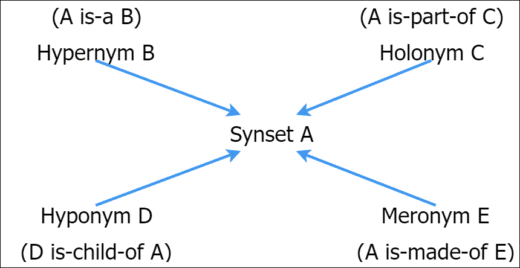
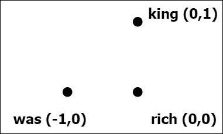
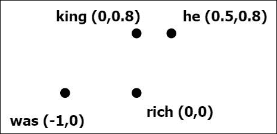
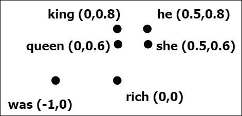
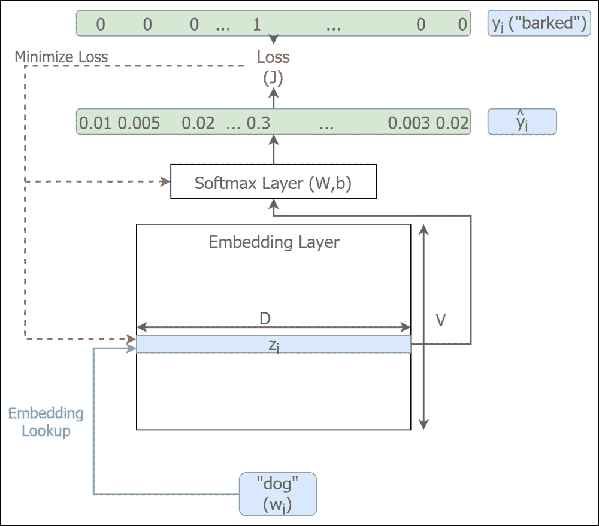
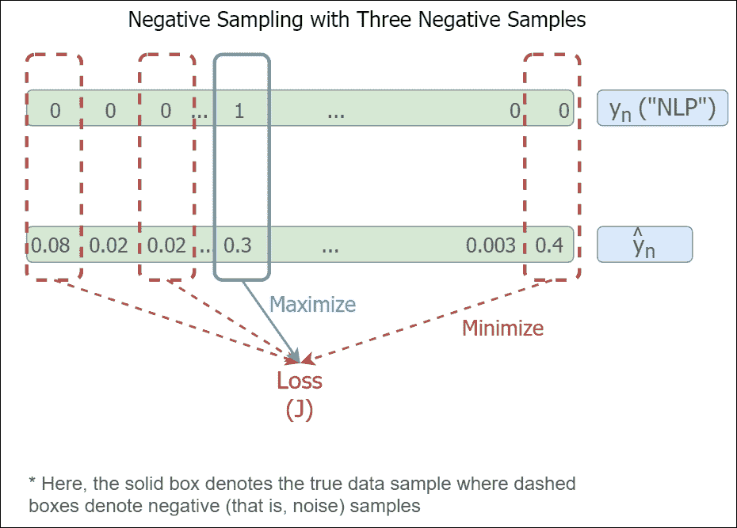
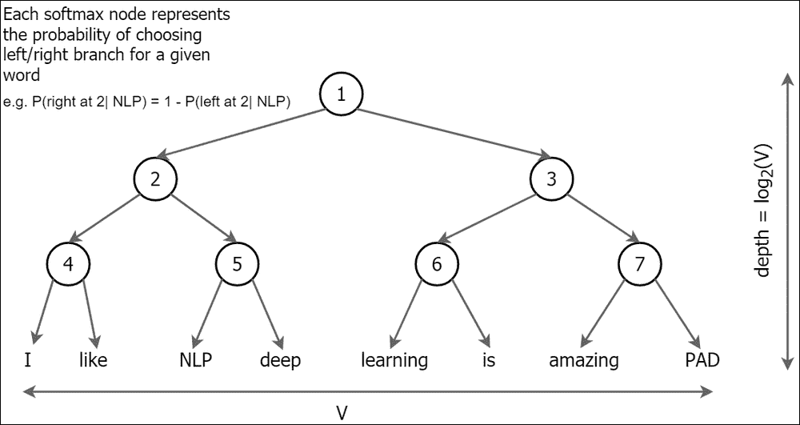
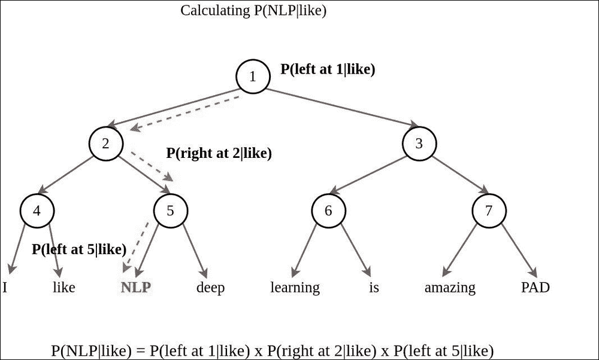
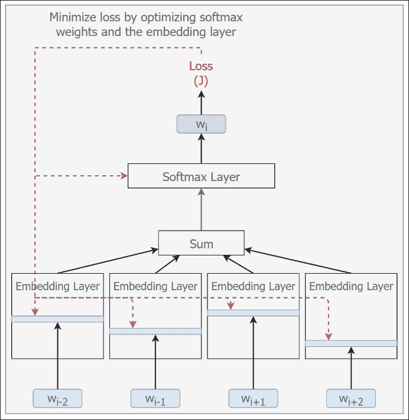

# 三、Word2vec——学习词嵌入

在这一章中，我们将讨论 NLP 中最重要的一个主题——word 2 vec，这是一种学习词嵌入或单词的分布式数字特征表示(即向量)的技术。学习单词表示是许多 NLP 任务的基础，因为许多 NLP 任务依赖于单词的良好特征表示，这些特征表示保留了它们的语义以及它们在语言中的上下文。例如，单词*森林*的特征表示应该与*烤箱*非常不同，因为这些单词很少在类似的上下文中使用，而*森林*和*丛林*的表示应该非常相似。

### 注意

Word2vec 被称为*分布式表示*，因为单词的语义是由完整表示向量的激活模式捕获的，而不是表示向量的单个元素(例如，将向量中的单个元素设置为 1，将单个单词的 rest 设置为 0)。

我们将一步一步地从解决这个问题的经典方法到基于现代神经网络的方法，这些方法在寻找好的单词表示方面提供了最先进的性能。在图 3.1 中，我们(使用 t-SNE，一种用于高维数据的可视化技术)可视化了 2D 画布上一组单词的这种学习到的词嵌入。如果你仔细观察，你会发现相似的东西被放置得彼此靠近(例如，中间的簇中的数字):


图 3.1:使用 t-SNE 的习得词嵌入的可视化示例

### 注意

**t 分布随机邻居嵌入(t-SNE)**

这是一种将高维数据投影到二维空间的降维技术。这使我们能够想象高维数据是如何在空间中分布的，这是非常有用的，因为我们无法轻松地将三维以外的数据可视化。你将在下一章更详细地了解 SNE 霸王龙。

# 什么是词的表征或意义？

*这个词表示*是什么意思？这与其说是一个技术问题，不如说是一个哲学问题。所以，我们不会试图辨别这个问题最合适的答案，而是接受一个更谦虚的答案，那就是，*意为*是一个词所传达的思想或表示。因为自然语言处理的主要目标是在语言任务中实现类似人类的表现，所以探索为机器表示单词的原则方法是明智的。为了实现这一点，我们将使用能够分析给定文本语料库并得出单词的良好数字表示(即词嵌入)的算法，这样，与不相关的单词(例如 *cat* 和 *volcano* )相比，属于相似上下文的单词(例如 *one* 和 *two* 、 *I* 和 *we* )将具有相似的数字表示。

首先，我们将讨论实现这一目标的一些经典方法，然后继续了解使用神经网络来学习这种特征表示并提供最先进性能的更复杂的最新方法。


# 学习单词表征的经典方法

在这一部分，我们将讨论一些用数字表示单词的经典方法。这些方法主要可以分为两类:使用外部资源来表示单词的方法和不使用外部资源的方法。首先，我们将讨论 WordNet——最流行的基于外部资源的单词表示方法之一。然后我们再进行更多的本地化方法(即不依赖外部资源的方法)，比如 **one-hot 编码**和**词频-逆文档频** ( **TF-IDF** )。

## WordNet——使用外部词汇知识库学习单词表达

WordNet 是处理单词表示的最流行的经典方法或统计 NLP 之一。它依赖于一个外部的词汇知识库，该知识库对给定单词的定义、同义词、祖先、后代等信息进行编码。WordNet 允许用户推断给定单词的各种信息，例如前面句子中讨论的单词的各个方面以及两个单词之间的相似性。

### WordNet 之旅

如前所述，WordNet 是一个词汇数据库，编码单词之间的词性标记关系，包括名词、动词、形容词和副词。WordNet 由美国普林斯顿大学心理学系首创，目前由普林斯顿大学计算机科学系托管。WordNet 考虑单词之间的同义词来评估单词之间的关系。英语 WordNet 目前拥有超过 150，000 个单词和超过 100，000 个同义词组(即同义词集)。另外，WordNet 不仅仅局限于英语。自成立以来，大量不同的 wordnets 已经建立，可以在 http://globalwordnet.org/wordnets-in-the-world/的[查看。](http://globalwordnet.org/wordnets-in-the-world/)

为了理解如何利用 WordNet，为 WordNet 中使用的术语打下坚实的基础是很重要的。首先，WordNet 使用术语 **synset** 来表示一组或一组同义词。接下来，每个 synset 都有一个**定义**，解释 synset 代表什么。synset 中包含的同义词称为**引理**。

在 WordNet 中，单词表示是分层建模的，这在给定的同义词集和与另一个同义词集的关联之间形成了一个复杂的图形。这些关联可以属于两个不同的类别:一个*是一个*关系或者一个*是由*构成的关系。首先，我们将讨论*是一个*协会。

对于一个给定的同素集，存在两类关系:上义词和下义词。**同素集的上位词**是承载所考虑的同素集的一般(高级)含义的同素集。例如，*车*是同系列*车*的上位词。接下来，**下位词**是比对应的同义词集更具体的同义词集。比如*丰田车*是 synset *车*的下称。

现在让我们讨论一个 synset 的*是由*组成的关系。**同素集的全名**是一组同素集，代表所考虑的同素集的整个实体。例如，*轮胎*的全称是*汽车* synset。**部分名**是一个 *is-made-of* 范畴，代表全名的反义词，其中部分名是组成相应同义词集的部分或物质同义词集。我们可以在*图 3.2* 中看到这一点:



图 3.2:存在于一个同义词集中的各种关联

NLTK 库是一个 Python 自然语言处理库，可以用来理解 WordNet 及其机制。位于`ch3`文件夹中的`ch3_wordnet.ipynb`文件中提供了完整的示例作为练习。

### 注意

**安装 NLTK 库**

要将 NLTK 库安装到 Python 中，可以使用下面的 Python `pip`命令:

```
pip install nltk

```

或者，可以使用一个 IDE(比如 PyCharm)通过**图形用户界面** ( **GUI** )来安装这个库。你可以在[http://www.nltk.org/install.html](http://www.nltk.org/install.html)找到更详细的说明。

要将 NLTK 导入 Python 并下载 WordNet 语料库，首先导入`nltk`库:

```
import nltk
```

然后，您可以通过运行以下命令下载 WordNet 语料库:

```
nltk.download('wordnet')
```

在安装并导入了`nltk`库之后，我们需要用这个命令导入 WordNet 语料库:

```
from nltk.corpus import wordnet as wn
```

然后我们可以如下查询 WordNet 语料库:

```
# retrieves all the available synsets
word = 'car'
car_syns = wn.synsets(word)

# The definition of each synset of car synsets
syns_defs = [car_syns[i].definition() for i in range(len(car_syns))]

# Get the lemmas for the first Synset
car_lemmas = car_syns[0].lemmas()[:3]

# Let's get hypernyms for a Synset (general superclass)
syn = car_syns[0]
print('\t',syn.hypernyms()[0].name(),'\n')

# Let's get hyponyms for a Synset (specific subclass)
syn = car_syns[0]
print('\t',[hypo.name() for hypo in syn.hyponyms()[:3]],'\n')

# Let's get part-holonyms for the third "car"
# Synset (specific subclass)
syn = car_syns[2]
print('\t',[holo.name() for holo in syn.part_holonyms()],'\n')

# Let's get meronyms for a Synset (specific subclass)
syn = car_syns[0]
print('\t',[mero.name() for mero in syn.part_meronyms()[:3]],'\n')
```

运行示例后，结果将如下所示:

```
All the available Synsets for car
[Synset('car.n.01'), Synset('car.n.02'), Synset('car.n.03'), Synset('car.n.04'), Synset('cable_car.n.01')]

Example definitions of available synsets:
car.n.01 :  a motor vehicle with four wheels; usually propelled by an internal combustion engine
car.n.02 :  a wheeled vehicle adapted to the rails of railroad
car.n.03 :  the compartment that is suspended from an airship and that carries personnel and the cargo and the power plant

Example lemmas for the Synset  car.n.03
['car', 'auto', 'automobile']

Hypernyms of the Synset  car.n.01
motor_vehicle.n.01
Hyponyms of the Synset  car.n.01
['ambulance.n.01', 'beach_wagon.n.01', 'bus.n.04']

Holonyms (Part) of the Synset  car.n.03
['airship.n.01']

Meronyms (Part) of the Synset  car.n.01
['accelerator.n.01', 'air_bag.n.01', 'auto_accessory.n.01']
```

我们也可以用下面的方法得到两个同素集之间的相似性。NLTK 中实现了几个不同的相似性度量，你可以在官方网站上看到它们的运行([www.nltk.org/howto/wordnet.html](http://www.nltk.org/howto/wordnet.html))。这里，我们使用 Wu-Palmer 相似性，它基于两个同义词集在同义词集层次结构中的深度来度量它们之间的相似性:

```
sim = wn.wup_similarity(w1_syns[0], w2_syns[0])
```

### WordNet 的问题

尽管 WordNet 是一个令人惊奇的资源，任何人都可以用它来学习自然语言处理任务中单词的意思，但是在这方面使用 WordNet 有很多缺点。它们如下:

*   遗漏细微差别是 WordNet 的一个关键问题。这对于 WordNet 来说是不可行的，这既有理论上的原因，也有实践上的原因。从理论的角度来看，对两个实体之间的细微差异的定义进行建模是不适定的或不直接的。实事求是地说，定义细微差别是主观的。比如*想要*和*需要*这两个词意思差不多，但其中一个(*需要*)更有主见。这被认为是一个细微的差别。
*   其次，WordNet 本身是主观的，因为 WordNet 是由一个相对较小的社区设计的。因此，根据你要解决的问题，WordNet 可能是合适的，或者你可以用一个宽松的单词定义来做得更好。
*   还存在维护 WordNet 的问题，这是劳动密集型的。维护和添加新的 synsets、定义、引理等可能会非常昂贵。这对 WordNet 的可伸缩性产生了不利影响，因为要让 WordNet 保持最新状态，人力是必不可少的。
*   为其他语言开发 WordNet 的成本很高。此外，还有一些为其他语言构建的 WordNet，以及将它与英语 WordNet 链接为 T2(MWN T4)多字网(T1)的努力，但这些努力尚未完成。

接下来，我们将讨论几种不依赖外部资源的单词表示技术。

## 一热编码表示

表示单词的一种更简单的方式是使用热门的编码表示。这意味着，如果我们拥有一个 *V* 大小的词汇，对于每个*I^(th)单词*w[I]*，我们将代表*w[I]T21【用一个 *V* 长向量*0，0，0，0，…，0，1，0，…，0，0，0]* 其中举个例子，想想这句话:**

*鲍勃和玛丽是好朋友。*

每个单词的热门编码表示可能如下所示:

*Bob: [1，0，0，0，0，0]*

*和:[0，1，0，0，0，0]*

*Mary: [0，0，1，0，0，0]*

*为:【0，0，0，1，0，0】*

*好:[0，0，0，0，1，0]*

*朋友:[0，0，0，0，0，1]*

但是，正如您可能已经发现的那样，这种表示有许多缺点。

这种表示方式不会以任何方式对单词之间的相似性进行编码，并且完全忽略了单词使用的上下文。让我们将单词向量之间的点积视为相似性度量。两个向量越相似，这两个向量的点积越高。例如，单词 *car* 和*car*的表示将具有相似距离 0，其中 *car* 和*铅笔*也将具有相同的值。

这种方法对于大型词汇会变得非常无效。此外，对于典型的自然语言处理任务，词汇量很容易超过 50，000 个单词。因此，对于 50，000 个单词的单词表示矩阵将产生非常稀疏的 50，000 × 50，000 矩阵。

然而，即使在最先进的词嵌入学习算法中，一键编码也起着重要的作用。我们使用一键编码来用数字表示单词，并将其输入神经网络，以便神经网络可以更好地学习单词的更小的数字特征表示。

### 注意

一键编码也称为局部化表示(与分布式表示相反)，因为特征表示由向量中的单个元素的激活决定。

## TF-IDF 法

TF-IDF 是一种基于频率的方法，它考虑了一个单词在语料库中出现的频率。这是一个单词表示，它表示给定文档中特定单词的重要性。直觉上，这个词出现的频率越高，它在文档中就越重要。例如，在一个关于猫的文档中，*猫*这个词会出现得更多。然而，仅仅计算频率是行不通的，因为像 *this* 和 *is* 这样的单词出现的频率很高，但是并没有携带那么多信息。TF-IDF 考虑到了这一点，对这样的常用词给了 0 值。

同样， *TF* 代表术语频率， *IDF* 代表逆文档频率:

*TF(w**[I]**)= w**I**出现次数/总字数*

*IDF(w**[I]**)= log(文档总数/其中有 w**[I]**的文档数)*

*TF-IDF(w**[I]**)= TF(w**[I]**)x IDF(w**I**)*

我们来做一个快速练习。考虑两个文档:

*   文档 1: *这是关于猫的。猫是很好的伙伴。*
*   文档二:*这是关于狗的。狗很忠诚。*

现在让我们来处理一些数字:

*TF-IDF (cats，doc1) = (2/8) * log(2/1) = 0.075*

*TF-IDF (this，doc2) = (1/8) * log(2/2) = 0.0*

因此，单词 *cats* 是信息性的，而*这个*不是。这是我们在衡量单词重要性时需要的预期行为。

## 共生矩阵

同现矩阵不同于一热编码表示，它对单词的上下文信息进行编码，但需要维护一个 V × V 矩阵。为了理解共现矩阵，我们来看两个例句:

*   *杰瑞和玛丽是朋友。*
*   *杰瑞给玛丽买花。*

共生矩阵看起来像下面的矩阵。因为矩阵是对称的，所以我们仅示出了矩阵的一个三角形:

|   | 

尿壶

 | 

和

 | 

玛丽

 | 

是

 | 

朋友

 | 

购买

 | 

花

 | 

为

 |
| --- | --- | --- | --- | --- | --- | --- | --- | --- |
| 杰瑞 | 0 | 一 | 0 | 0 | 0 | 一 | 0 | 0 |
| **和** |   | 0 | 一 | 0 | 0 | 0 | 0 | 0 |
| **玛丽** |   |   | 0 | 一 | 0 | 0 | 0 | 一 |
| **是** |   |   |   | 0 | 一 | 0 | 0 | 0 |
| **朋友** |   |   |   |   | 0 | 0 | 0 | 0 |
| **购买** |   |   |   |   |   | 0 | 一 | 0 |
| **鲜花** |   |   |   |   |   |   | 0 | 一 |
| **为** |   |   |   |   |   |   |   | 0 |

然而，不难看出，维护这样的共现矩阵是有代价的，因为矩阵的大小随着词汇表的大小而多项式增长。此外，合并大于 1 的上下文窗口大小并不简单。一种选择是具有加权计数，其中上下文中的单词的权重随着与感兴趣的单词的距离而恶化。

所有这些缺点促使我们去研究更有原则、更健壮、更可扩展的学习和推断单词含义(即表示)的方法。

Word2vec 是一种最近推出的分布式单词表示学习技术，目前被用作许多 NLP 任务的特征工程技术(例如，机器翻译、聊天机器人和图像字幕生成器)。本质上，Word2vec 通过查看使用单词的周围单词(即上下文)来学习单词表示。更具体地说，我们试图通过神经网络预测给定一些单词的上下文(反之亦然)，这导致神经网络被迫学习良好的词嵌入。我们将在下一节详细讨论这种方法。Word2vec 方法与前面描述的方法相比有许多优点。它们如下:

*   Word2vec 方法不像基于 WordNet 的方法那样受人类语言知识的影响。
*   Word2vec 表示向量大小与词汇大小无关，这不同于 one-hot 编码表示或单词共现矩阵。
*   Word2vec 是一种分布式表示。与表示依赖于表示向量的单个元素的激活(例如，一键编码)的局部化表示不同，分布式表示依赖于向量中所有元素的激活模式。这为 Word2vec 提供了比 one-hot 编码表示更强的表达能力。

在接下来的部分中，我们将首先通过一个例子来开发一些关于学习词嵌入的直观感受。然后我们将定义一个损失函数，这样我们就可以使用机器学习来学习词嵌入。此外，我们将讨论两种 Word2vec 算法，即**跳格**和**连续词包** ( **CBOW** )算法。


# word 2 vec——一种基于神经网络的单词表示学习方法

> "从一个人交的朋友，你就可以知道这个人说的话."
> 
> –*j . r . Firth*

J.R. Firth 在 1957 年提出的这句话是 Word2vec 的基础，因为 Word2vec 技术使用给定单词的上下文来学习其语义。Word2vec 是一种突破性的方法，允许在没有任何人工干预的情况下学习单词的含义。此外，Word2vec 通过查看给定单词周围的单词来学习单词的数字表示。

我们可以通过想象一个真实世界的场景来测试前面引述的正确性。想象一下，你正在参加一场考试，你在第一个问题中发现了这句话:“玛丽是个非常固执的孩子。她的淫荡本性总是给她带来麻烦。”现在，除非你非常聪明，否则你可能不知道*淫荡*是什么意思。在这种情况下，你会不由自主地被迫看感兴趣的单词周围的短语。在我们的例子中，*淫荡的*被*顽固的*、*天性的*和*麻烦的*所包围。看这三个字就足以确定 pervicacious 其实就是固执的一种状态。我认为这足以证明语境对于词义的重要性。

现在我们来讨论 Word2vec 的基础知识。如前所述，Word2vec 通过查看上下文并用数字表示来学习给定单词的意思。通过*上下文*，我们指的是感兴趣的单词前面和后面的固定数量的单词。我们拿一个有 *N* 个单词的假设语料来说。从数学上来说，这可以用一系列单词来表示，分别用 *w* *[0]* ， *w* *[1]* ，…， *w [i]* ，*w**N*表示，其中 *w [i]* 是

接下来，如果我们想找到一个能够学习单词含义的好算法，给定一个单词，我们的算法应该能够正确预测上下文单词。这意味着，对于任何给定的单词*w[I]，下面的概率应该是高的:*


为了到达等式的右边，我们需要假设给定目标单词(*w[I]T7)，上下文单词彼此独立(例如， *w* *[i-2]* 和*w**[I-1]*是独立的)。虽然不完全正确，但是这种近似使得学习问题变得实际，并且在实践中运行良好。*

## 练习:皇后=国王——他+她吗？

在继续之前，让我们做一个小练习来理解最大化前面提到的概率是如何导致找到单词的好的含义(或表示)的。考虑以下非常小的语料库:

有一个非常富有的国王。他有一个美丽的王后。她非常善良。

现在，让我们做一些手动预处理，删除标点符号和无信息的单词:

富有的国王有美丽的王后，她很善良

现在让我们按照格式(*目标词→上下文词 1，上下文词 2* )为每个词及其上下文词组成一组元组。我们将假设任一侧的上下文窗口大小为 1:

*曾→富*

**有钱→有势，称王**

**国王→富人，他**

*何→王，有了*

*有了→他，漂亮了*

*漂亮→有了，女王*

**女王→美丽的她**

**她→皇后，是**

*被→她，种*

*善良→被*

请记住，我们的目标是能够预测右边的单词，前提是给定左边的单词。要做到这一点，对于给定的单词，右侧上下文中的单词应该与左侧上下文中的单词具有高度的数字或几何相似性。换句话说，感兴趣的词应该由周围的词来传达。现在让我们假设实际的数字向量来理解这是如何工作的。为了简单起见，我们只考虑粗体突出显示的元组。让我们从假设单词 *rich* 如下开始:

*富→【0，0】*

为了能够正确预测*是*和*王*来自*富*，*是*和*王*应该与*富*这个词有很高的相似度。让我们假设向量之间的欧几里德距离为相似性乘积。

让我们为单词 *king* 和 *rich* 尝试以下值:

*国王→ [0，1]*

*是→ [-1，0]*

结果如下所示:

*Dist(rich，king) = 1.0*

*Dist(rich，mm2)= 1.0*

这里， *Dist* 是两个词之间的欧几里德距离。如图 3.3 所示:



图 3.3:单词“rich”、“was”和“king”的单词向量的位置

现在让我们考虑下面的元组:

*国王→富人，他*

我们已经建立了*国王*和*富人*之间的关系。然而，这还没有完成；我们越看一段关系，这两个词应该越接近。所以，我们先调整一下*王*的向量，让它更接近*富*:

*王者→【0，0.8】*

接下来，我们将需要添加单词*他*到图片中。*何*这个词应该更接近*王*。这就是我们现在所知道的关于“他”这个词的所有信息:

*何→【0.5，0.8】*

这时，带有文字的图形看起来像*图 3.4* :



图 3.4:单词“rich”、“was”、“king”和“he”的单词向量的位置

现在我们来进行下一个二元组:*女王→美丽的她*和*她→女王，曾是*。请注意，我已经交换了元组的顺序，因为这使我们更容易理解这个示例:

*她→女王，是*

现在，我们将不得不使用我们先前关于英语的知识继续前进。放置单词 *she* 是一个合理的决定，它与 *he* 距离单词 *was* 的距离相同，因为它们在单词 *was* 的上下文中的用法是等同的。因此，让我们用这个:

*她→【0.5，0.6】*

接下来，我们将用*女王*这个词接近*她*这个词:

*皇后→ [0.0，0.6]*

这在*图 3.5* 中说明:



图 3.5:单词“富有”、“曾经”、“国王”、“他”、“她”和“女王”的单词向量的位置

接下来，我们只有以下元组:

*女王→美丽的她*

在这里，*美丽的*这个词被发现了。它与*女王*和*她*这两个词的距离应该大致相同。让我们用下面的例子:

*漂亮→【0.25，0】*

现在我们有了下面这个描绘单词之间关系的图表。当我们观察*图 3.6* 时，它似乎是词语含义的非常直观的表示:


图 3.6:单词“富有”、“曾经”、“国王”、“他”、“她”、“女王”和“美丽”的单词向量的位置

现在，让我们来看看这个从这个练习开始就一直潜伏在我们脑海中的问题。这个等式中的量是否等价:*皇后=国王–他+她*？好吧，我们已经得到了解开这个谜团所需的所有资源。让我们先试试等式的右边:

*=国王-他+她*

*= [0，0.8]–[0.5，0.8] + [0.5，0.6]*

*= [0，0.6]*

最后一切都解决了。如果你看看我们为单词*女王*获得的单词向量，你会发现这与我们之前推导出的答案完全相似。

请注意，这是一个显示如何学习词嵌入的粗略工作，如果使用算法学习，这可能与词嵌入的确切位置不同。

然而，请记住，这是一个不切实际的缩小现实世界语料库的练习。所以，你不能仅仅通过计算十几个数字就用手算出这些值。这就是像神经网络这样复杂的函数逼近器为我们工作的地方。但是，要使用神经网络，我们需要用一种数学上自信的方式来表述我们的问题。然而，这是一个很好的练习，实际上展示了单词向量的力量。

## 设计用于学习词嵌入的损失函数

即使是一个简单的现实世界任务的词汇量也能轻易超过 10，000 个单词。因此，我们不能为大型文本语料库手动开发单词向量，而需要设计一种方法来使用一些机器学习算法(例如，神经网络)自动找到好的词嵌入，以有效地执行这项费力的任务。此外，为了对任何类型的任务使用任何类型的机器学习算法，我们需要定义一个损失，因此完成任务就变成了最小化损失。让我们定义寻找好的词嵌入向量的损失。

首先，让我们回忆一下我们在本节开始时讨论的等式:


记住这个等式，我们可以定义神经网络的成本函数:


记住，是损失(即成本)，不是回报。还有，我们要最大化*P(w[j]**| w[I]**)*。因此，我们需要在表达式前面加一个减号，将它转换成一个成本函数。

现在，我们不使用产品操作符，而是将它转换成日志空间。将方程转换到对数空间将引入一致性和数值稳定性。这给了我们以下等式:


这个成本函数的公式被称为**负对数似然**。

现在，由于我们有一个公式化的成本函数，可以使用神经网络来优化这个成本函数。这样做将迫使单词向量或词嵌入根据它们的意思很好地组织它们自己。现在，是时候了解使用这个成本函数来找到好的词嵌入的现有算法了。


# 跳格算法

我们将要讨论的第一个算法被称为**跳格算法**。Mikolov 等人在 2013 年推出的 skip-gram 算法是一种利用书面文本的单词上下文来学习良好词嵌入的算法。让我们一步一步来理解 skip-gram 算法。

首先，我们将讨论数据准备过程，然后介绍理解算法所需的符号。最后，我们将讨论算法本身。

正如我们在许多地方讨论的那样，这个词的意思可以从这个特定词周围的上下文中得到。然而，开发一个利用这一特性来学习词义的模型并不完全简单。

## 从原始文本到结构化数据

首先，我们需要设计一个机制来提取一个数据集，这个数据集可以提供给我们的学习模型。这样的数据集应该是一组格式为*(输入，输出)*的元组。此外，这需要以无人监管的方式创建。也就是说，人类不应该有来手动设计数据的标签。总之，数据准备过程应做到以下几点:

*   捕捉给定单词的周围单词
*   以无人监督的方式表演

skip-gram 模型使用以下方法来设计这样的数据集:

1.  对于给定的单词*w[I]，假设一个上下文窗口大小 *m* 。通过*上下文窗口大小*，我们指的是单侧被认为是上下文的单词的数量。因此，对于 *w [i]* ，上下文窗口(包括目标单词 *w [i]* )的大小将为 *2m+1* ，并且将如下所示:*【w**[I-m]**，…，w**I-1**，w**
2.  *Next, input-output tuples are formed as *[…, (w**[i]**, w**[i-m]**), …,(w**[i]**,w**[i-1]**), (w**[i]**,w**[i+1]**), …, (w**[i]**,w**[i+m]**), …]*; here,  and *N* is the number of words in the text to get a practical insight. Let's assume the following sentence and context window size (*m*) of 1: *The dog barked at the mailman.*

    对于此示例，数据集如下所示:

    *[(狗，那个)，(狗，吠叫)，(吠叫，狗)，(吠叫，在)，…，(那个，在)，(邮递员)]** 

## *用神经网络学习词嵌入*

*一旦数据处于*(输入，输出)*格式，我们就可以使用神经网络来学习单词 embeddings。首先，让我们确定学习词嵌入所需的变量。为了存储词嵌入，我们需要一个 V × D 矩阵，其中 *V* 是词汇量，而 *D* 是词嵌入的维度(即表示单个单词的向量中的元素数量)。 *D* 是用户定义的超参数。D*D*越高，学习到的词嵌入就越有表现力。该矩阵将被称为*嵌入空间*或*嵌入层*。接下来，我们有一个 softmax 层，权重大小为 D × V，偏移大小为 *V* 。*

*每个单词将被表示为大小为 *V* 的独热编码向量，其中一个元素为 1，所有其他元素为 0。因此，输入字和相应的输出字的大小都是 *V* 。我们先把 *i* ^(th) 输入称为 *x* *[i]* 对应的嵌入为*x**[I]*z**I*，对应的输出为*y***

**至此，我们已经定义了必要的变量。接下来，对于每个输入*x**I，我们将从对应于该输入的嵌入层中查找嵌入向量。这个操作为我们提供了 *z* *[i]* ，这是一个 *D* 大小的向量(也就是一个 *D* -long 嵌入向量)。随后，我们使用以下变换计算 *x* *[i]* 的预测输出:***

**logit(x**[I]**)= z**[I]**W+b**

**ŷ**[I]**= softmax(logit(x**[I]**)**

*这里，*logit(x**[I]**)*表示未规格化的分数(即 logits)， *ŷ* *[i]* 是 *V* 大小的预测输出(表示输出是来自 *V* 大小的词汇的一个词的概率)， *W 【T 我们将可视化 skip-gram 模型的概念视图(*图 3.7* )和实现视图(*图 3.8* )。这里有一个符号的摘要:**

*   **V* :这是词汇量的大小*
*   **D* :这是嵌入层的维度*
*   **x**
*   **z* *[i]* :这是第 *i* 个输入字对应的嵌入(即表示)向量*
*   **y**[I]*:这是对应于*x**[I]*的一位热编码输出字*
*   **ŷ**[I]*:这是*x**[I]*的预测输出*
*   **logit(x**[I]**)*:这是输入*x**[I]*的非标准化分数*
*   *:这是单词*w*j 的一个热编码表示*
*   **W* :这是 softmax 权重矩阵*
*   **b* :这是 softmax

    的偏差图 3.7:概念跳过图模型* 

*

图 3.8:跳格模型的实现* 

*使用现有的和派生的实体，我们现在可以使用负对数似然损失函数来计算给定数据点*(x**[I]**，y**[I]**)*的损失。如果你想知道什么是*P(w**[j]**| w**[I]**)*的话，可以从已经定义好的实体中派生出来。接下来，让我们讨论如何从**[| w]**[I]**)*ŷ*[I]*中计算出*p(w**[j]**j】j***| w*I*并推导出正式定义。****

### **注意**

****原话嵌入纸为什么要用两个嵌入层？****

**原始论文(Mikolov 等人，2013 年)使用两个不同的 V × D 嵌入空间来表示目标空间中的单词(用作目标时的单词)和上下文空间中的单词(用作上下文单词的单词)。这样做的一个动机是，同一个单词在其本身的上下文中不经常出现。所以，我们要把这种事情发生的概率降到最低。例如，对于目标词*狗*，极不可能在其上下文( *P(狗|狗)~ 0* )中也找到*狗*这个词。直观地说，如果我们把(*x**[I]**= dog*和*y**[I]**= dog*)数据点馈送给神经网络，如果神经网络预测 *dog* 为 *dog* 的上下文词，我们就是在要求神经网络给出更高的损失。换句话说，我们要求单词*狗*的词嵌入与单词*狗*的词嵌入有非常高的距离。这产生了强烈的矛盾，因为同一单词的嵌入之间的距离将是 0。因此，如果我们只有一个单一的嵌入空间，我们无法实现这一点。然而，具有用于目标单词和上下文单词的两个单独的嵌入空间允许我们具有这个属性，因为这样我们对于相同的单词具有两个单独的嵌入向量。然而，在实践中，只要避免输入-输出元组，拥有相同的单词作为输入和输出允许我们使用单个嵌入空间，并消除对两个不同嵌入层的需要。**

### **制定一个实用的损失函数**

**让我们更仔细地检查我们的损失函数。我们得出的损失应该如下:**

****

**然而，从我们目前手头的实体中计算这个特定的损失并不完全简单。**

**先来了解一下*P(w**[j]**| w**[I]**)*实体代表什么。为此，我们将从单个单词符号转移到单个数据点符号。也就是我们会说*P(w**[j]**，w**[I]**)*是由*n**^(th)*数据点给出的，该数据点有 *w [i]* 的一键编码向量作为输入(*这由以下等式给出:***

****

***logit(x* 然后，我们相对于与整个词汇表中的所有单词相对应的所有 logit 值，对索引*w[j]处的 logit 值进行归一化。这种特殊类型的归一化被称为 softmax 激活(或归一化)。现在，通过将其转换为对数空间，我们得到以下等式:***

****

**为了有效地计算 *logit* 函数，我们可以摆弄变量，得出以下符号:**

****

**这里，是 *w [ j ]* 的一键编码向量。现在 *logit* 运算已经简化为求和与乘积运算。因为只有一个非零的元素对应于单词*w[j]，所以在计算中只使用向量的索引。这比通过扫描词汇表大小的向量来查找 logit 向量中与非零元素的索引相对应的值在计算上更有效。***

**现在，通过分配我们获得的 logit 计算，对于损失，我们得到以下结果:**

****

**让我们考虑一个例子来理解这个计算:**

***我喜欢 NLP***

**我们可以如下创建输入-输出元组:**

***(喜欢，我)***

***(喜欢，NLP)***

**现在让我们假设前面的单词有以下一个热编码表示:**

***喜欢–1，0，0***

***I–0，1，0***

***NLP–0，0，1***

**接下来我们来考虑输入输出元组 *(like，I)* 。当我们通过 skip-gram 学习模型传播类似于的输入*时，让我们假设我们依次获得了类似于*、 *I* 和 *NLP* 的单词*的以下逻辑:***

**2,10,5**

**现在，词汇表中每个单词的 softmax 输出如下:**

***P(like | like)= exp(2)/(exp(2)+exp(10)+exp(5))= 0.118***

***P(I | like)= exp(10)/(exp(2)+exp(10)+exp(5))= 0.588***

***P(NLP | like)= exp(5)/(exp(2)+exp(10)+exp(5))= 0.294***

**前面的损失函数说我们需要最大化 *P(I|like)* 来最小化损失。现在让我们将我们的例子应用于这个损失函数:**

***=- ( [0，1，0] * ([2，10，5]) - log(exp([1，0，0]*[2，10，5]) + exp([0，1，0]*[2，10，5]))+exp([0，0，1]*[2，10，5])***

***=-(10-log(exp(2)+exp(10)+exp(5)))= 0.007***

**有了这个损失函数，对于负号前的项，对应单词 *I* 的 *y* 向量中只有一个非零元素。因此，我们将只考虑概率 *P(I|like)* ，这正是我们想要的。**

**然而，这并不是我们想要的理想解决方案。这个损失函数的目的从实用的角度来看，我们希望在给定一个词的情况下最大化预测上下文词的概率，同时最小化给定一个词的“所有”非上下文词的概率。我们很快就会看到，在实践中，定义明确的损失函数并不能有效地解决我们的问题。我们将需要设计一个更巧妙的近似损失函数来在可行的持续时间内学习好的词嵌入。**

### **有效地逼近损失函数**

**我们很幸运拥有一个在数学上和直觉上都很可靠的损失函数。然而，努力并没有就此结束。如果我们试图像前面讨论的那样计算封闭形式的损失函数，我们将不可避免地面临算法极其缓慢的问题。**

**这种缓慢是由于大量的词汇导致了性能瓶颈。让我们看看我们的成本函数:**

****

**您将看到，计算单个示例的损失需要计算词汇表中所有单词的 logits。与计算机视觉问题不同，在计算机视觉问题中，数百个输出类足以解决大多数现存的现实世界问题，skip-gram 并不具备这些特性。因此，我们需要将注意力转向损失的有效近似值，而不丧失我们模型的有效性。**

**我们将讨论近似法的两种流行选择:**

*   **负采样**
*   **分级 softmax**

#### **soft max 层的负采样**

**在这里，我们将讨论我们的第一种方法:负采样软最大层。负采样是**噪声对比估计** ( **NCE** )方法的近似。NCE 说，一个好的模型应该通过逻辑回归来区分数据和噪音。**

**考虑到这一点，让我们重新表述我们学习词嵌入的目标。我们不需要一个全概率模型，该模型对于一个给定的单词具有词汇表中所有单词的精确概率。我们需要的是高质量的词向量。因此，我们可以将我们的问题简化为区分实际数据(即输入输出对)和噪声(即 K-多虚噪声输入输出对)。通过*噪声*，我们指的是使用不属于给定单词上下文的单词创建的错误输入-输出对。我们还将去掉 softmax 激活，代之以 sigmoid 激活(也称为逻辑函数)。这允许我们在保持输出在[0，1]之间的同时，消除成本函数对全部词汇的依赖性。我们可以在*图 3.9* 中可视化负样本过程。**

**准确地说，我们的原始损失函数由以下等式给出:**

****

**前面的公式变成了这样:**

****

**这里σ表示 sigmoid 激活，其中 *σ(x)=1/(1+exp(-x))* 。注意，为了清晰起见，我在原来的损失函数中用一个代替了*logit(x**n**)**wj*。可以看到新的损失函数只依赖于词汇表中与 *k* 项相关的计算。**

**经过一些简化后，我们得出以下等式:**

****

**让我们花点时间来理解这个等式的含义。为了简化，让我们假设 k=1。这给了我们以下等式:**

****

**这里，*w[j]表示*w[I]的上下文词， *w* *[q]* 表示 *w [i]* 的非上下文词。这个等式本质上说的是，为了最小化 *J(θ)* ，我们应该使，这意味着需要是一个大的正值。那么，意味着需要是一个大的负值。换句话说，对于表示真实目标词和上下文词的真实数据点，应该得到大的正值，而表示目标词和噪声的虚假数据点应该得到大的负值。这与 softmax 函数的行为相同，但计算效率更高。****



图 3.9:负采样过程

这里，是乙状结肠激活。直观上，我们在损失函数计算中执行以下两个步骤:

*   计算*w[j]非零列的损耗(推向正)*
*   计算 K 个噪声样本的损失(趋向负值)

#### 分级 softmax

分级 softmax 比负采样略复杂，但与负采样的目的相同；即，近似 softmax，而不必计算所有训练样本的词汇表中所有单词的激活。但是，与负采样不同，分层 softmax 只使用实际数据，不需要噪声样本。我们可以在*图 3.10* 中可视化层次化的 softmax 模型。

为了理解分层 softmax，让我们考虑一个例子:

我喜欢自然语言处理。深度学习很神奇。

这方面的词汇如下:

*我，喜欢，NLP，深度，学习，是，惊艳*

有了这个词汇表，我们将构建一个二叉树，词汇表中的所有单词都以叶节点的形式出现。我们还将添加一个特殊的令牌 **PAD** 来确保所有的树叶都有两个成员:



图 3.10:分层 softmax

然后，我们的最后一个隐藏层将完全连接到层次结构中的所有节点(见*图 3.11* )。注意，与经典的 softmax 层相比，该模型具有相似的总重量；但是，对于给定的计算，它只使用其中的一个子集:


图 3.11:分级 softmax 如何连接到嵌入层

假设我们需要推断 *P(NLP|like)* 的概率，其中 *like* 为输入词。那么我们只需要权重的子集来计算概率，如图*图 3.12* 所示:



图 3.12:用分级 softmax 计算概率

具体来说，这里的是如何计算概率的:


既然现在我们知道了如何计算*P(w**[j]**| w**[I]**)*，我们就可以使用原来的损失函数。注意，该方法仅使用连接到路径中的节点的权重进行计算，导致高计算效率。

#### 学习层次结构

虽然分层的 softmax 是有效的，但一个重要的问题仍然没有答案。我们如何确定树的分解？更准确地说，哪个单词将跟随哪个分支？有几个选项可以实现这一点:

*   **随机初始化层次**:这种方法确实有一些性能下降，因为随机布局不能保证在单词之间有最好的可能分支。
*   **使用 WordNet 确定层级** : WordNet 可用于确定单词在树中的合适顺序。这种方法比随机初始化表现得好得多。

#### 优化学习模式

因为我们有一个公式化的损失函数，所以优化就是从 TensorFlow 库中调用正确的函数。将使用的优化流程是一个随机优化流程，这意味着我们不会一次提供完整的数据集，而是针对许多步骤随机提供一批数据。

## 用 TensorFlow 实现 skip-gram

我们现在将浏览一个使用 TensorFlow 库的 skip-gram 算法的实现。在这里，我们将只讨论定义所需的TensorFlow操作的基本部分，以学习嵌入，而不是运行操作。完整练习可在`ch3`练习目录的`ch3_word2vec.ipynb`中找到。

首先让我们定义模型的超参数。您可以随意更改这些超参数，以查看它们如何影响最终性能(例如，`batch_size = 16`或`batch_size = 256`)。然而，由于与更复杂的真实世界问题相比，这是一个简单的问题，所以您可能看不到任何显著的差异(除非您将它们变得极端，例如，`batch_size = 1`或`num_sampled = 1`):

```
batch_size = 128
embedding_size = 128 # Dimension of the embedding vector.
window_size = 4 # How many words to consider left and right.
valid_size = 16 # Random set of words to evaluate similarity on.
# Only pick dev samples in the head of the distribution.
valid_window = 100 
valid_examples = get_common_and_rare_word_ids(valid_size//2,valid_size//2)
num_sampled = 32 # Number of negative examples to sample.
```

接下来，为训练输入、标签和有效输入定义TensorFlow占位符:

```
train_dataset = tf.placeholder(tf.int32, shape=[batch_size])
train_labels = tf.placeholder(tf.int32, shape=[batch_size, 1])
valid_dataset = tf.constant(valid_examples, dtype=tf.int32)
```

然后，为嵌入层和 softmax 权重和偏差定义TensorFlow变量:

```
embeddings = tf.Variable(
  tf.random_uniform([vocabulary_size, embedding_size], -1.0, 1.0))
softmax_weights = tf.Variable(
  tf.truncated_normal([vocabulary_size, embedding_size],
stddev=0.5 / math.sqrt(embedding_size)))
softmax_biases =
  tf.Variable(tf.random_uniform([vocabulary_size],0.0,0.01))
```

接下来，我们将定义一个嵌入查找操作，该操作收集一批给定训练输入的相应嵌入:

```
embed = tf.nn.embedding_lookup(embeddings, train_dataset)
```

之后，我们将使用负采样来定义 softmax 损失:

```
loss = tf.reduce_mean(
  tf.nn.sampled_softmax_loss(weights=softmax_weights,
  biases=softmax_biases, inputs=embed,
  labels=train_labels, num_sampled=num_sampled,
  num_classes=vocabulary_size))
```

这里我们定义了一个优化器来优化(最小化)前面定义的`loss`函数。随意尝试 https://www.tensorflow.org/api_guides/python/train 列出的其他优化器:

```
optimizer = tf.train.AdagradOptimizer(1.0).minimize(loss)
```

计算验证输入示例和所有嵌入之间的相似性。使用余弦距离:

```
norm = tf.sqrt(tf.reduce_sum(tf.square(embeddings), 1, keepdims=True))
normalized_embeddings = embeddings / norm
valid_embeddings = tf.nn.embedding_lookup(
  normalized_embeddings, valid_dataset)
similarity = tf.matmul(valid_embeddings,
  tf.transpose(normalized_embeddings))
```

定义了所有的TensorFlow变量和操作之后，我们现在可以继续执行操作来获得一些结果。这里我们将概述执行这些操作的基本过程。您可以参考练习文件以获得执行的完整视图。

*   首先用`tf.global_variables_initializer().run()`初始化TensorFlow变量
*   对于每个步骤(对于预定义的总步骤数)，执行以下操作:

    *   使用数据生成器
    *   生成一批数据(`batch_data`–输入，`batch_labels`–输出)创建一个名为`feed_dict`的字典，将列车输入/输出占位符映射到由数据生成器生成的数据:

        ```
        feed_dict = {train_dataset : batch_data, train_labels : batch_labels}
        ```

    *   执行一个优化步骤并获得损失值如下:

        ```
        _, l = session.run([optimizer, loss], feed_dict=feed_dict)
        ```

我们现在将讨论另一种流行的 Word2vec 算法，称为**连续词袋** ( **CBOW** )模型。


# 连续词袋算法

CBOW 模型的工作方式类似于 skip-gram 算法，但在问题表述方面有一个重大变化。在跳格模型中，我们从目标词预测上下文词。然而，在 CBOW 模型中，我们将从上下文单词中预测目标。让我们通过前面的例句来比较 skip-gram 和 CBOW 的数据:

狗对着邮差吠叫。

对于 skip-gram，数据元组— *(输入字，输出字)*—可能如下所示:

*(狗叫)*、*(狗叫)*、*(狗叫)*等等。

对于 CBOW，数据元组如下所示:

*(【狗吠】、狗吠)*、*(【狗吠】、狗吠)*等等。

因此，CBOW 的输入具有 2 × m × D 的维度，其中 *m* 是上下文窗口大小， *D* 是嵌入的维度。CBOW 的概念模型如图*图 3.13* 所示:



图 3.13:CBOW 模型

我们不会详细讨论 CBOW 的复杂性，因为它们与 skip-gram 非常相似。然而，我们将讨论算法实现(虽然不深入，因为它与 skip-gram 有许多相似之处)，以清楚地了解如何正确实现 CBOW。CBOW 的完整实现可在`ch3`练习文件夹中的`ch3_word2vec.ipynb`处获得。

## 在 TensorFlow 中实现 CBOW

首先，我们定义变量；这与跳格模型的情况相同:

```
embeddings = tf.Variable(tf.random_uniform([vocabulary_size,
  embedding_size], -1.0, 1.0, dtype=tf.float32))
softmax_weights = tf.Variable(
  tf.truncated_normal([vocabulary_size, embedding_size],
  stddev=1.0 / math.sqrt(embedding_size),
  dtype=tf.float32))
softmax_biases =
  tf.Variable(tf.zeros([vocabulary_size],dtype=tf.float32))
```

这里，我们正在创建一组堆叠的嵌入，代表上下文的每个位置。所以我们将有一个大小为*【批量大小，嵌入大小，2 *上下文窗口大小】*的矩阵。然后，我们将使用归约运算符，通过对最后一个轴上的堆叠嵌入求平均，将堆叠的矩阵归约为大小为*【batch _ size，embedding size】*的:

```
stacked_embedings = None
for i in range(2*window_size):
  embedding_i = tf.nn.embedding_lookup(embeddings,
  train_dataset[:,i])
  x_size,y_size = embedding_i.get_shape().as_list()
  if stacked_embedings is None:
    stacked_embedings = tf.reshape(embedding_i,[x_size,y_size,1])
  else:
    stacked_embedings =
    tf.concat(axis=2,
      values=[stacked_embedings,
      tf.reshape(embedding_i,[x_size,y_size,1])]
    )

assert stacked_embedings.get_shape().as_list()[2]==2*window_size
mean_embeddings = tf.reduce_mean(stacked_embedings,2,keepdims=False)
```

此后，`loss`和`optimizer`被定义为在跳格模型中:

```
loss = tf.reduce_mean(
    tf.nn.sampled_softmax_loss(weights=softmax_weights,
        biases=softmax_biases,
        inputs=mean_embeddings,
        labels=train_labels, 
        num_sampled=num_sampled, 
        num_classes=vocabulary_size))
optimizer = tf.train.AdagradOptimizer(1.0).minimize(loss)
```


# 总结

词嵌入已经成为许多 NLP 任务的组成部分，并且广泛用于诸如机器翻译、聊天机器人、图像字幕生成和语言建模的任务。词嵌入不仅起到了降维技术的作用(与一键编码相比),而且还提供了比其他现有技术更丰富的特征表示。在本章中，我们讨论了两种流行的基于神经网络的单词表示学习方法，即 skip-gram 模型和 CBOW 模型。

首先，我们讨论了经典的方法来理解单词表征在过去是如何习得的。我们讨论了各种方法，例如使用 WordNet、构建单词的共现矩阵以及计算 TF-IDF。稍后，我们讨论了这些方法的局限性。

这促使我们探索基于神经网络的单词表征学习方法。首先，我们手工设计了一个例子来理解如何计算词嵌入或单词向量，以及一个单词向量的用例来学习使用单词向量可以做的有趣的事情。

接下来，我们讨论了第一个词嵌入学习算法——跳格模型。然后，我们学习了如何准备用于学习的数据。后来，我们研究了如何设计一个损失函数，允许我们使用给定单词的上下文单词来使用词嵌入。之后，我们讨论了我们开发的闭合形式损失函数的一个关键限制。损失函数对于大型词汇表是不可伸缩的。随后，我们分析了两种常见的闭合损失近似值，这两种近似值使我们能够高效且有效地计算损失——负采样和分层 softmax。最后，我们讨论了如何使用 TensorFlow 实现 skip-gram 算法。

然后我们回顾了学习词嵌入的下一个选择 CBOW 模型。我们还讨论了 CBOW 与跳格模型的不同之处。最后，我们还讨论了 CBOW 的 TensorFlow 实现。

在下一章中，我们将分析我们所学的 Word2vec 技术的性能，并学习几个显著提高其性能的扩展。此外，我们将学习另一种词嵌入学习技术，称为全局向量或手套。