<title>Neural Network and Artificial Intelligence Concepts</title>  

# 神经网络和人工智能概念

根据几个世纪以来进行的科学和哲学研究，已经确定了作为人类智力基础的特殊机制。从他们的操作中获得灵感，就有可能创造出模仿这些机制的机器。问题是他们还没有成功地模仿和整合所有这些，所以我们拥有的**人工智能** ( **AI** )系统在很大程度上是不完整的。

这种机器改进的决定性一步来自于所谓的**人工神经网络** ( **ANNs** )的使用，它从调节自然神经网络的机制出发，计划模拟人类的思维。软件现在可以模仿赢得国际象棋比赛所需的机制，或者根据语法规则将文本翻译成不同的语言。

本章介绍了人工神经网络和人工智能的基本理论概念。希望对以下内容有基本的了解:

*   基础高中数学；微积分和函数等 *sigmoid*
*   R 编程和 R 库的使用

我们将学习神经网络的基础知识，并使用 r 测试一个模型。本章是神经网络和所有后续章节的基础。

我们将在本章中讨论以下主题:

*   人工神经网络概念
*   神经元、感知器和多层神经网络
*   偏差、权重、激活函数和隐藏层
*   正向和反向传播方法
*   **图形处理单元** ( **GPU** )概述

在本章的最后，你将能够认识到 R 提供的不同的神经网络算法和工具来处理它们。

<title>Introduction</title>  

# 介绍

大脑是人体最重要的器官。它是我们执行所有功能的中央处理器。它只有 1.5 公斤重，却有大约 860 亿个神经元。神经元被定义为传递神经脉冲或电化学信号的细胞。大脑是一个复杂的神经元网络，通过几个相互连接的神经元系统来处理信息。理解大脑的功能一直是一个挑战；然而，由于计算技术的进步，我们现在可以人工编程神经网络。

人工神经网络学科起源于模仿试图解决问题的人类大脑的功能的想法。传统方法及其连续应用的缺点已经在明确定义的技术环境中得到克服。

人工智能或机器智能是一个研究领域，旨在赋予计算机认知能力，以编程方式让它们学习和解决问题。它的目标是模拟具有人类智能的计算机。AI 无法完全模仿人类智能；计算机只能被编程来做人脑的某些方面。

机器学习是人工智能的一个分支，它帮助计算机根据输入数据进行自我编程。机器学习赋予了 AI 基于数据解决问题的能力。人工神经网络是机器学习算法的一个例子。

**深度学习** ( **DL** )是一组复杂的神经网络，具有更多的处理层，可以开发高级别的抽象。它们通常用于复杂的任务，例如图像识别、图像分类和手写识别。

大部分观众认为神经网络很难学习，把它当成了黑箱。这本书旨在打开黑匣子，帮助人们学习 r 中实现的内部原理。有了这些工作知识，我们可以看到许多神经网络非常有用的用例，如下图所示:

**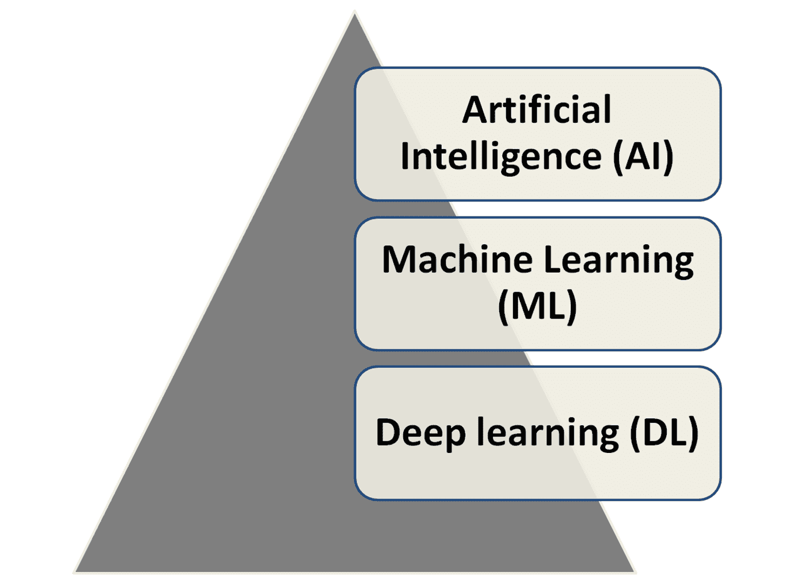**<title>Inspiration for neural networks</title>  

# 神经网络的灵感

神经网络受到人脑工作方式的启发。人脑可以利用人类感官(尤其是视觉)发送的数据处理大量信息。处理是由神经元完成的，神经元对通过它们的电信号进行处理，并应用触发器逻辑，如打开和关闭信号传输通过的门。下图显示了神经元的结构:

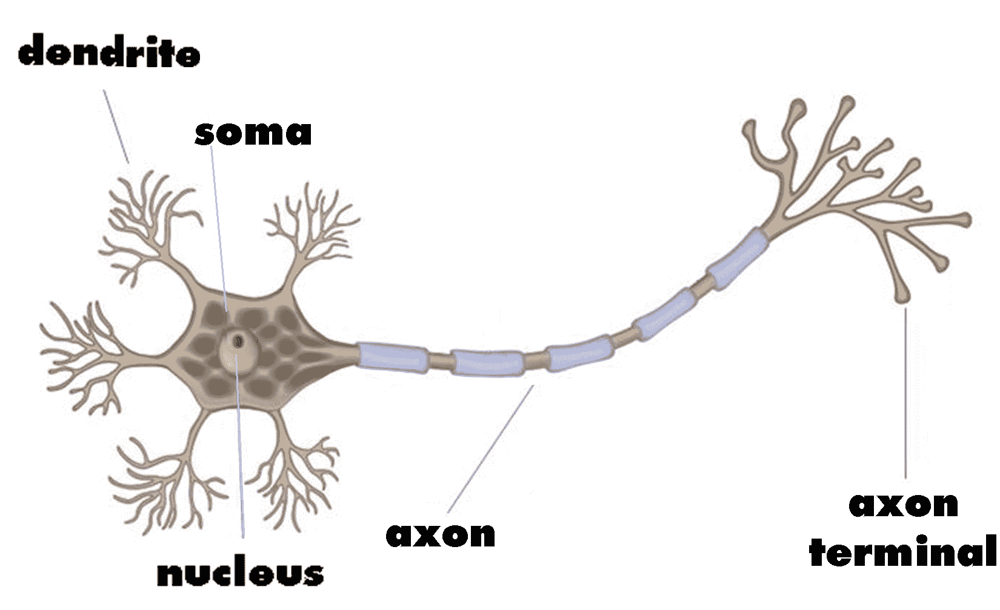

每个神经元的主要组成部分是:

*   **树突**:每个神经元中的进入点，以电脉冲的形式从网络中的其他神经元获取输入
*   细胞体:它从树突输入中产生推论，并决定采取什么行动
*   **轴突终末**:以电脉冲的形式向下一个神经元传递输出

只有当信号超过某个阈值时，每个神经元才会处理信号。神经元要么发射，要么不发射；不是 *0* 就是 *1* 。

人工智能一直是科幻电影和小说的领地。人工智能中的人工神经网络自 20 世纪 50 年代以来就已经存在，但由于计算架构和性能的进步，我们在过去 10 年里使它们更加占主导地位。计算机处理取得了重大进步，导致:

*   大规模并行
*   分布式表示和计算
*   学习和概括能力
*   容错
*   低能耗

在数值计算和符号操作领域，在集中式架构之上解决问题，现代计算机已经在更大程度上超越了人类。他们实际上落后于这种组织结构的地方是在模式识别、降噪和优化领域。一个蹒跚学步的孩子可以在一大群人中认出他/她的妈妈，但是一台具有集中架构的计算机却做不到这一点。

这是大脑的生物神经网络优于机器的地方，因此有灵感开发一种替代的松散、分散的架构来模仿大脑。

人工神经网络是大规模并行计算系统，由大量简单的处理器和许多互连组成。

全球领先的新闻机构之一《卫报》通过上传他们拥有的所有档案的快照，使用大数据将档案数字化。然而，对于用户来说，复制内容并在其他地方使用它是有限制的。为了克服这一点，可以使用人工神经网络进行文本模式识别，将图像转换为文本文件，然后根据最终用户的需要转换为任何格式。

<title>How do neural networks work?</title>  

# 神经网络是如何工作的？

与生物神经元结构类似，人工神经网络将神经元定义为中央处理单元，它执行数学运算，从一组输入中生成一个输出。神经元的输出是输入加上偏差的加权和的函数。每个神经元执行一个非常简单的操作，如果接收到的信号总量超过激活阈值，就会激活，如下图所示:

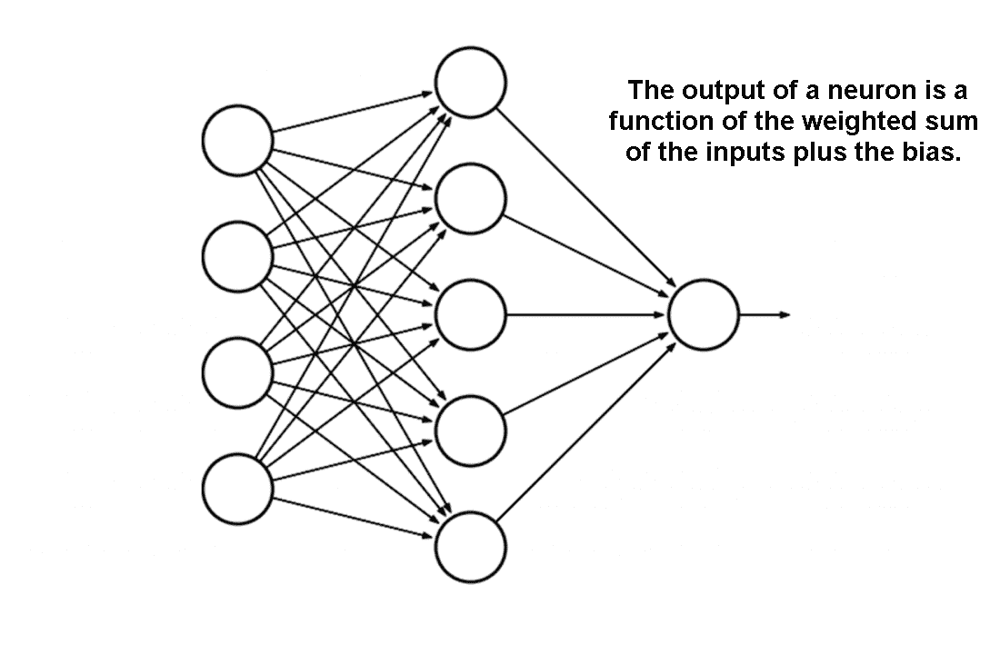

整个神经网络的功能仅仅是计算所有神经元的输出，这是完全确定性的计算。本质上，人工神经网络是一组数学函数的近似值。我们现在将介绍与人工神经网络相关的新术语:

*   输入层
*   隐蔽层
*   输出层
*   砝码
*   偏见
*   激活功能

<title>Layered approach</title>  

# 分层方法

任何处理框架的神经网络都具有以下架构:


有一组输入、一个处理器和一组输出。在神经网络中也遵循这种分层方法。输入形成**输入层**，执行处理的**中间层**被称为**隐藏层**，而**输出**形成输出层。

我们的神经网络架构也是基于同样的原理。隐藏层具有将输入转换为所需输出的魔力。对隐藏层的理解需要权重、偏差和激活函数的知识，这是我们下一个讨论的主题。

<title>Weights and biases</title>  

# 权重和偏差

人工神经网络中的权重是转换输入以影响输出的最重要因素。这类似于线性回归中的斜率，其中权重乘以输入，相加形成输出。权重是决定每个神经元对另一个神经元影响程度的数值参数。

对于一个典型的神经元，如果输入是*x[1]T3、*x[2]T7、 *x [3]* ，那么应用于它们的突触权重表示为 *w [1]* 、 *w [2]* 和 *w [3]* 。**

输出是


其中 *i* 是 *1* 的输入数。

简单地说，这是一个矩阵乘法，以达到加权和。

偏差就像线性方程中增加的截距。它是一个附加参数，用于调整输出以及神经元输入的加权和。

因此，神经元完成的处理表示为:


一个功能应用于该输出，称为**激活功能**。下一层的输入是上一层神经元的输出，如下图所示:

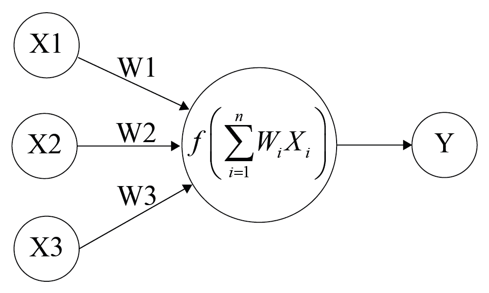<title>Training neural networks</title>  

# 训练神经网络

训练是向网络提供一些样本数据并修改权重以更好地逼近所需函数的行为。

有两种主要类型的训练:监督学习和非监督学习。

<title>Supervised learning</title>  

# 监督学习

我们向神经网络提供输入和期望的输出。测量网络对输入的响应。修改权重以减小实际输出和期望输出之间的差异。

<title>Unsupervised learning</title>  

# 无监督学习

我们只提供投入。神经网络调整自己的权重，以便相似的输入产生相似的输出。该网络在没有任何外部帮助的情况下识别输入中的模式和差异。

<title>Epoch</title>  

# 世

向网络提供输入并更新网络权重的过程的一次迭代或通过被称为**时期**。这是用于更新权重的前馈和反向传播的完整运行。这也是对整个数据集的一次完整通读。

典型地，需要许多个时期，有时数量级为数万个，来有效地训练神经网络。我们将在接下来的章节中看到更多关于时代的内容。

<title>Activation functions</title>  

# 激活功能

神经网络处理的抽象主要通过激活函数来实现。激活函数是将输入转换为输出的数学函数，并增加了神经网络处理的魔力。如果没有激活函数，神经网络的工作将像线性函数一样。线性函数是指输出与输入成正比的函数，例如:


线性函数是一次多项式。简单来说就是一条没有任何曲线的直线。

然而，神经网络试图解决的大多数问题本质上都是非线性和复杂的。为了实现非线性，使用了激活函数。非线性函数是高次多项式函数，例如:


非线性函数的图形是弯曲的，增加了复杂性因素。

激活函数赋予神经网络非线性特性，使其成为真正的通用函数逼近器。

<title>Different activation functions</title>  

# 不同的激活功能

有许多激活函数可供神经网络使用。我们将在这里看到他们中的一些人。

<title>Linear function</title>  

# 线性函数

最简单的激活函数，通常用于神经网络问题中的输出层激活函数，是由以下公式表示的线性激活函数:


输出与输入相同，函数定义在范围(*-无穷大，+无穷大*)内。下图显示了一个线性激活函数:

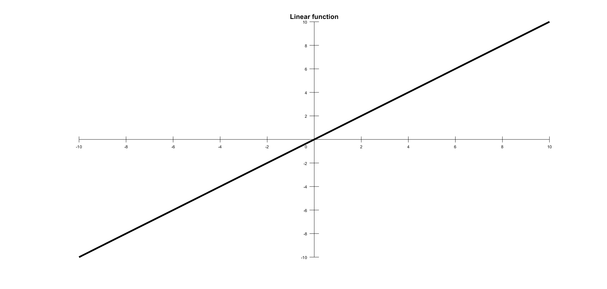<title>Unit step activation function</title>  

# 单位阶跃激活函数

单位阶跃激活函数是神经网络中常用的特征。输出假定值 *0* 为负自变量，值 *1* 为正自变量。该功能如下所示:

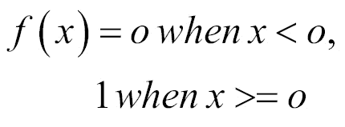

范围在 *(0，1)* 之间，输出本质上是二进制的。这些类型的激活函数对于二元方案是有用的。当我们想把一个输入模型分为两类时，我们可以使用一个带有单位阶跃激活功能的二进制编译器。下图显示了单位阶跃激活功能:

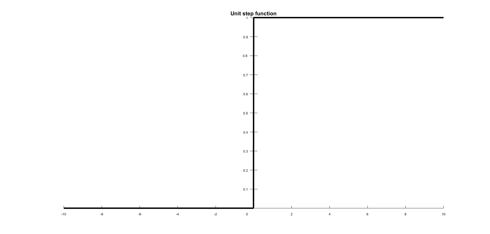<title>Sigmoid</title>  

# 乙状结肠的

*s 形函数*是一个产生 s 形曲线的数学函数；其 *S* 形状的特征曲线。这是最早也是最常用的激活函数。这将输入压缩为 *0* 和 *1* 之间的任何值，并使模型在本质上是逻辑的。该函数是指由以下公式定义的逻辑函数的特殊情况:


下图显示了一条带有 *S* 形状的 S 形曲线:

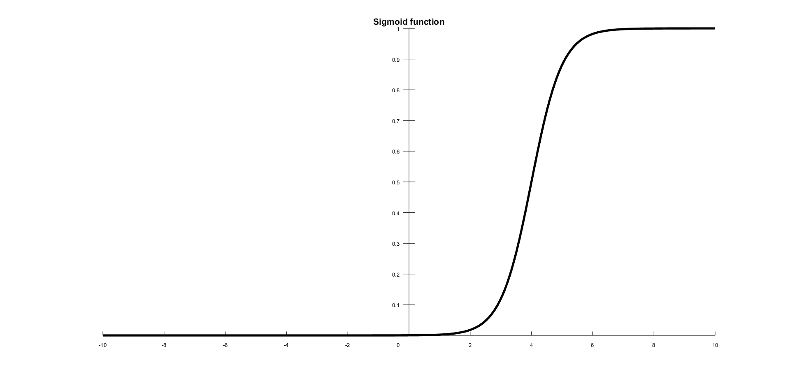<title>Hyperbolic tangent</title>  

# 双曲正切

另一个非常流行和广泛使用的激活特性是 *tanh* 函数。如果你看下面的图，你会注意到它看起来很像*乙状结肠*；事实上，它是一个缩放的 *sigmoid* 函数。这是一个非线性函数，定义在值 *(-1，1)* 的范围内，所以你不必担心激活爆炸。需要澄清的一点是，tanh 的梯度比 sigmoid 的梯度更强(导数更陡)。在*s 形*和 *tanh* 之间做出决定将取决于你的梯度强度要求。与*乙状结肠*一样， *tanh* 也有缺坡问题。该函数由以下公式定义:


下图显示了一个混合切线激活函数:


这看起来很像*乙状结肠*；其实就是一个缩放后的 *sigmoid* 函数。

<title>Rectified Linear Unit</title>  

# 整流线性单元

**整流线性单元** ( **ReLU** )是 2015 年以来使用最多的激活功能。这是一个简单的条件，比其他函数有优势。该函数由以下公式定义:

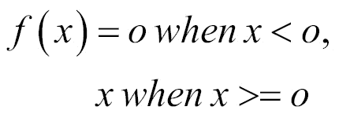

下图显示了 ReLU 激活功能:

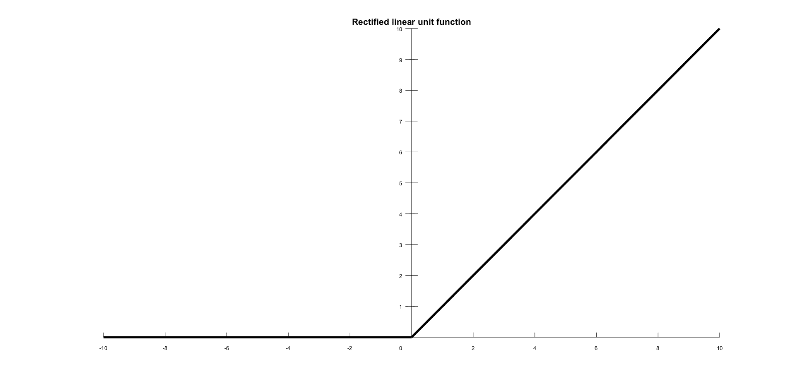

输出范围在 *0* 和无穷大之间。ReLU 使用深度神经网络在计算机视觉和语音识别中找到应用。还有各种其他的激活功能，但是我们已经在这里讨论了最重要的一些。

<title>Which activation functions to use?</title>  

# 使用哪些激活功能？

假设神经网络要支持非线性和更大的复杂性，要使用的激活函数必须足够健壮，以具有以下特性:

*   应该是有差别的；我们将会看到为什么我们在反向传播中需要微分。它不应该导致渐变消失。
*   处理起来应该简单快捷。
*   它不应该以零为中心。

*s 形*是最常用的激活功能，但它有以下缺点:

*   由于它使用逻辑模型，计算耗时且复杂
*   它导致梯度消失，在某个时间点没有信号通过神经元
*   它收敛很慢
*   它不是以零为中心

这些弊端由 ReLU 解决。ReLU 很简单，处理起来更快。它没有消失梯度的问题，并且与 *sigmoid* 和 *tanh* 函数相比有很大的改进。ReLU 是神经网络和 DL 问题的最优选的激活函数。

ReLU 用于隐藏层，而输出层可以对逻辑问题使用`softmax`函数，对回归问题使用线性函数。

<title>Perceptron and multilayer architectures</title>  

# 感知器和多层架构

感知器是一个单一的神经元，它将一组输入分为两类(通常是 *1* 或 *-1* )。如果输入是网格的形式，感知器可以用来识别形状的视觉图像。感知器通常使用阶跃函数，如果输入的加权和超过阈值，则返回 *1* ，否则返回 *0* 。

当感知器的层被组合在一起时，它们形成多层架构，这给出了神经网络处理所需的复杂性。**多层感知器** ( **MLPs** )是最广泛使用的神经网络架构。

<title>Forward and backpropagation</title>  

# 正向和反向传播

从输入层到隐藏层再到输出层的过程称为**正向传播**。在每一层应用*和(输入*权重)+偏差*，然后将激活函数值传播到下一层。下一层可以是另一个隐藏层或输出层。神经网络的构造使用大量的隐含层，产生了**深度神经网络** ( **DNN** )。

一旦达到输出，在最后一层(输出层)，我们计算误差(预测输出减去原始输出)。需要该误差来校正前向传播中使用的权重和偏差。这里是使用导数函数的地方。需要改变的重量由**梯度下降**决定。

反向传播过程使用每个神经元的激活函数的偏导数来识别每个传入权重方向上的斜率(或梯度)。梯度表明了权重变化时误差的减小或增大程度。反向传播不断改变权重，直到误差最大程度地减少，减少量称为**学习速率**。

学习率是一个标量参数，类似于数值积分中的步长，用于设置调整率以更快地减少误差。学习率用于权重和偏差调整期间的反向传播。

学习率越高，算法减少错误的速度越快，训练过程也越快:

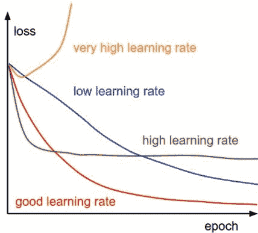<title>Step-by-step illustration of a neuralnet and an activation function</title>  

# 神经网络和激活功能的分步图解

我们将采取一步一步的方法来理解单个隐藏层的正向和反向传递。输入层有一个神经元，输出将解决二元分类问题(预测 0 或 1)。下图显示了带有单个隐藏层的正向和反向刀路:


接下来，让我们一步一步详细分析一下，网络培训要做的所有操作:

1.  把输入当作一个矩阵。
2.  用随机值初始化权重和偏差。这是一次，我们将继续更新这些错误传播过程。
3.  对每个训练模式(以随机顺序显示)重复步骤 4 到 9，直到误差最小。
4.  将输入应用于网络。
5.  计算从输入层通过隐藏层到输出层的每个神经元的输出。
6.  计算输出端的误差:实际值减去预测值。

7.  使用输出误差来计算先前层的误差信号。激活函数的偏导数用于计算误差信号。
8.  使用误差信号来计算重量调整。
9.  应用权重调整。

步骤 4 和 5 是正向传播，步骤 6 到 9 是反向传播。

学习率是由配置参数控制的权重更新量。

这个完整的来回被称为一个**训练周期**或**时期**。更新的权重和偏差用于下一个周期。我们不断递归训练，直到误差非常小。

在这本书里，我们将会更详细地讨论正向和反向传播。

<title>Feed-forward and feedback networks</title>  

# 前馈和反馈网络

神经网络中的信号流可以是单向的，也可以是循环的。第一种情况，我们称之为神经网络架构前馈，由于输入信号被馈入输入层，然后，经过处理后，被转发到下一层，如下图所示。MLPs 和径向基函数也是前馈网络的好例子。下图显示了一个 MLPs 架构:


当神经网络具有某种内部递归时，这意味着信号被反馈到已经接收并处理该信号的神经元或层，该网络属于反馈类型，如下图所示:


在网络中添加递归的特殊原因是动态行为的产生，特别是当网络处理涉及时间序列或模式识别的问题时，需要内存来加强学习过程。然而，这种网络特别难以训练，最终无法学习。大多数反馈网络都是单层的，如**埃尔曼**和**霍普菲尔德**网络，但也有可能建立一个递归多层网络，如回声和递归 MLP 网络。

<title>Gradient descent</title>  

# 梯度下降

梯度下降是在任何学习模型中用于误差校正的迭代方法。对于反向传播期间的神经网络，用激活函数的误差时间导数迭代更新权重和偏差的过程是梯度下降方法。最陡下降步长由前一步的相似步长代替。梯度基本上被定义为曲线的斜率，并且是激活函数的导数:

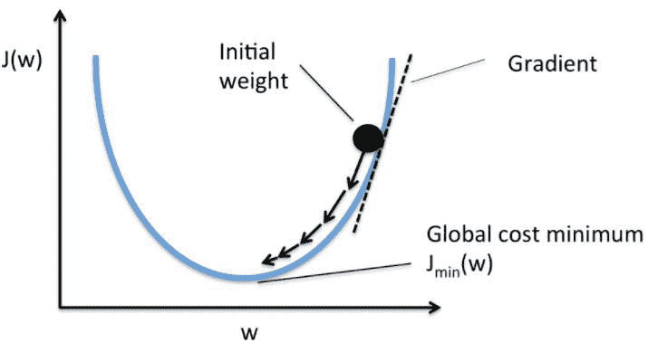

在每一步推导梯度下降的目的是找到误差最低的全局成本最小值。这是模型与数据吻合度较好、预测更准确的地方。

梯度下降可针对整批或随机进行。在全批次梯度下降中，为全训练数据集计算梯度，而**随机梯度下降** ( **SGD** )采用单个样本并执行梯度计算。它也可以采取小批量和执行计算。SGD 的一个优点是计算梯度更快。

<title>Taxonomy of neural networks</title>  

# 神经网络分类

人工神经网络的基本基础是相同的，但是在其发展过程中已经设计了各种神经网络模型。以下是一些人工神经网络模型:

*   **自适应线性元件** ( **ADALINE** )，是一个简单的感知器，只能解决线性问题。每个神经元获取输入的加权线性和，并将其传递给双极函数，该函数根据和产生 *+1* 或 *-1* 。该函数检查通过的输入的总和，如果网络为 *> = 0* ，则为 *+1* ，否则为 *-1* 。
*   **多重 ADALINE**(**MADALINE**)，是 ADALINE 单元的多层网络。
*   感知器是单层神经网络(单个神经元或单元)，其中输入是多维的(向量)，输出是输入的加权和的函数。
*   径向基函数网络是一种人工神经网络，其中径向基函数用作激活函数。网络输出是输入的径向基函数和一些神经元参数的线性组合。
*   前馈是神经网络的最简单形式。数据被跨层处理，没有任何循环。我们将在本书中研究以下前馈网络:
    *   自动编码器
    *   盖然论的
    *   时延
    *   协变的
*   **递归神经网络** ( **RNNs** )与前馈网络不同，它从后面的处理阶段向前面的阶段向前和向后传播数据。以下是 rnn 的类型；我们将研究他们在我们后面的章节:
    *   Hopfield 网络
    *   玻尔兹曼机器
    *   **自组织地图** ( **SOMs** )
    *   **双向联想记忆** ( **BAM** )
    *   **长短期记忆** ( **LSTM** )

下图描绘了 **(a)递归神经网络**和 **(b)前向神经网络**:

<title>Simple example using R neural net library - neuralnet()</title>  

# 使用 R 神经网络库的简单例子

考虑一个简单的数字平方数据集，它将用于训练 R 中的一个`neuralnet`函数，然后测试构建的神经网络的准确性:

| **输入** | **输出** |
| `0` | `0` |
| `1` | `1` |
| `2` | `4` |
| `3` | `9` |
| `4` | `16` |
| `5` | `25` |
| `6` | `36` |
| `7` | `49` |
| `8` | `64` |
| `9` | `81` |
| `10` | `100` |

我们的目标是设置权重和偏差，以便模型可以做这里正在做的事情。输出需要根据输入的函数来建模，并且该函数可以在将来用于基于输入来确定输出:

```
######################################################################### 
###Chapter 1 - Introduction to Neural Networks - using R ################ 
###Simple R program to build, train and test neural Networks############# 
######################################################################### 
 #Choose the libraries to use
library("neuralnet")

#Set working directory for the training data
setwd("C:/R")
getwd()

#Read the input file
mydata=read.csv('Squares.csv',sep=",",header=TRUE)
mydata
attach(mydata)
names(mydata)

#Train the model based on output from input
model=neuralnet(formula = Output~Input, 
 data = mydata, 
 hidden=10, 
 threshold=0.01 )
print(model)

#Lets plot and see the layers
plot(model)

#Check the data - actual and predicted
final_output=cbind (Input, Output, 
 as.data.frame(model$net.result) )
colnames(final_output) = c("Input", "Expected Output", 
 "Neural Net Output" )
print(final_output)
#########################################################################
```

<title>Let us go through the code line-by-line</title>  

# 让我们一行一行地检查代码

为了理解刚才提出的代码中的所有步骤，我们将详细查看它们。如果此时有几个步骤看起来不清楚，不要担心，您可以在下面的示例中查看。首先，将显示代码片段，解释如下:

```
library("neuralnet")
```

R 中的行包括我们程序中的库`neuralnet()`。`neuralnet()`是**综合 R 档案网** ( **CRAN** )的一部分，其中包含了众多用于各种应用的 R 库。

```
mydata=read.csv('Squares.csv',sep=",",header=TRUE)
mydata
attach(mydata)
names(mydata)
```

这会读取带有分隔符`,`(逗号)的 CSV 文件，header 是文件的第一行。`names()`会显示文件的标题。

```
model=neuralnet(formula = Output~Input, 
 data = mydata, 
 hidden=10, 
 threshold=0.01 )
```

相对于输入的输出训练发生在这里。向`neuralnet()`库传递输出和输入列名(`ouput~input`)、要使用的数据集、隐藏层中神经元的数量以及停止标准(`threshold`)。

从官方文件中摘录的`neuralnet`包的简要描述如下表所示:

| **神经网络包**: |
| **描述**: |
| 使用反向传播、带(里德米勒，1994 年)或不带权重反向传播(里德米勒，1993 年)的弹性反向传播，或阿纳斯塔夏迪斯等人(2005 年)的修改的全局收敛版本来训练神经网络。该软件包允许通过自定义选择错误和激活功能进行灵活设置。此外，实现了广义权重的计算(Intrator O & Intrator N，1993)。 |
| **详情**: |
| 包装:`neuralnet`类型:包装版本:1.33日期:2016-08-05许可证:GPL (>=2) |
| **作者**: |
| 斯蒂芬·弗里奇，弗劳克·根特(电子邮件:`guenther@leibniz-bips.de`)维护者:Frauke Guenther(电子邮件:`guenther@leibniz-bips.de`) |
| **用法**: |
| `neuralnet(formula, data, hidden = 1, threshold = 0.01, stepmax = 1e+05, rep = 1, startweights = NULL, learningrate.limit = NULL, learningrate.factor = list(minus = 0.5, plus = 1.2), learningrate=NULL, lifesign = "none", lifesign.step = 1000, algorithm = "rprop+", err.fct = "sse", act.fct = "logistic", linear.output = TRUE, exclude = NULL,`
`constant.weights = NULL, likelihood = FALSE)` |
| **论据的含义**: |
| `formula`:待拟合模型的符号描述。`data`:包含公式中指定变量的数据帧。`hidden`:整数向量，指定每层中隐藏神经元(顶点)的数量。`threshold`:指定误差函数偏导数阈值作为停止标准的数值。`stepmax`:神经网络训练的最大步骤。达到这个最大值会导致神经网络的训练过程停止。`rep`:神经网络训练的重复次数。`startweights`:包含权重起始值的向量。权重不会被随机初始化。`learningrate.limit`:包含学习率最低和最高限制的向量或列表。仅用于`RPROP`和`GRPROP`。`learningrate.factor`:包含上下学习率的乘法因子的向量或列表，仅用于`RPROP`和`GRPROP`。`learningrate`:指定传统反向传播使用的学习率的数值。仅用于传统的反向传播。`lifesign`:指定在神经网络- `'none'`、`'minimal'`或`'full'`的计算过程中函数将打印多少的字符串。`lifesign.step`:整数，指定在全寿命模式下打印最小阈值的步长。`algorithm`:包含计算神经网络的算法类型的字符串。`err.fct`:用于计算误差的可微分函数。`act.fct`:用于平滑协变量或神经元与权重的叉积结果的可微分函数。`linear.output`:逻辑。如果`act.fct`不应用于输出神经元，则将线性输出设置为`TRUE`，否则设置为`FALSE`。`exclude`:指定从计算中排除的权重的向量或矩阵。`constant.weights`:指定从训练过程中排除并被视为固定的权重值的向量。`likelihood`:符合逻辑。如果误差函数等于负对数似然函数，将计算信息标准 AIC 和 BIC。此外，信心的使用。间隔有意义。 |

在简要浏览了包文档之后，让我们回顾一下建议的代码示例的剩余部分:

```
 print(model)
```

该命令打印刚刚生成的模型，如下所示:

```
$result.matrix
 1
error                          0.001094100442
reached.threshold              0.009942937680
steps                      34563.000000000000
Intercept.to.1layhid1         12.859227998180
Input.to.1layhid1             -1.267870997079
Intercept.to.1layhid2         11.352189417430
Input.to.1layhid2             -2.185293148851
Intercept.to.1layhid3          9.108325110066
Input.to.1layhid3             -2.242001064132
Intercept.to.1layhid4        -12.895335140784
Input.to.1layhid4              1.334791491801
Intercept.to.1layhid5         -2.764125889399
Input.to.1layhid5              1.037696638808
Intercept.to.1layhid6         -7.891447011323
Input.to.1layhid6              1.168603081208
Intercept.to.1layhid7         -9.305272978434
Input.to.1layhid7              1.183154841948
Intercept.to.1layhid8         -5.056059256828
Input.to.1layhid8              0.939818815422
Intercept.to.1layhid9         -0.716095585596
Input.to.1layhid9             -0.199246231047
Intercept.to.1layhid10        10.041789457410
Input.to.1layhid10            -0.971900813630
Intercept.to.Output           15.279512257145
1layhid.1.to.Output          -10.701406269616
1layhid.2.to.Output           -3.225793088326
1layhid.3.to.Output           -2.935972228783
1layhid.4.to.Output           35.957437333162
1layhid.5.to.Output           16.897986621510
1layhid.6.to.Output           19.159646982676
1layhid.7.to.Output           20.437748965610
1layhid.8.to.Output           16.049490298968
1layhid.9.to.Output           16.328504039013
1layhid.10.to.Output          -4.900353775268
```

让我们回到代码分析:

```
plot(model)
```

前面的命令为我们绘制了神经网络，如下所示:

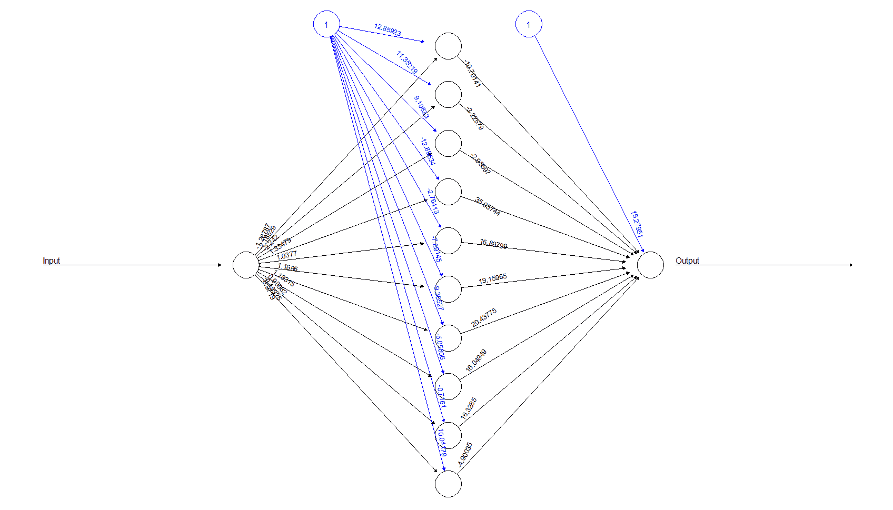

```
final_output=cbind (Input, Output, 
 as.data.frame(model$net.result) )
colnames(final_output) = c("Input", "Expected Output", 
 "Neural Net Output" )
print(final_output)
```

上面的代码打印出最终输出，将预测输出和实际输出进行比较，如下所示:

```
> print(final_output)
 Input Expected Output Neural Net Output
1    0               0     -0.0108685813
2    1               1      1.0277796553
3    2               4      3.9699671691
4    3               9      9.0173879001
5    4              16     15.9950295615
6    5              25     25.0033272826
7    6              36     35.9947137155
8    7              49     49.0046689369
9    8              64     63.9972090104
10   9              81     81.0008391011
11  10             100     99.9997950184    
```

<title>Implementation using nnet() library</title>  

# 使用 nnet()库实现

为了改进我们对`nnet`库的实践，我们看另一个例子。这一次，我们将使用通过客户访谈在餐厅收集的数据。顾客被要求对以下几个方面打分:服务、环境和食物。他们还被问及是否会根据这些分数给小费。在这种情况下，输入的数量是`2`，输出是一个分类值(`Tip=1`和`No-tip=0`)。

要使用的输入文件如下表所示:

| **否** | **客户提示** | **服务** | **氛围** | **食物** | **蒂波尔诺** |
| `1` | `1` | `4` | `4` | `5` | `Tip` |
| `2` | `1` | `6` | `4` | `4` | `Tip` |
| `3` | `1` | `5` | `2` | `4` | `Tip` |
| `4` | `1` | `6` | `5` | `5` | `Tip` |
| `5` | `1` | `6` | `3` | `4` | `Tip` |
| `6` | `1` | `3` | `4` | `5` | `Tip` |
| `7` | `1` | `5` | `5` | `5` | `Tip` |
| `8` | `1` | `5` | `4` | `4` | `Tip` |
| `9` | `1` | `7` | `6` | `4` | `Tip` |
| `10` | `1` | `7` | `6` | `4` | `Tip` |
| `11` | `1` | `6` | `7` | `2` | `Tip` |
| `12` | `1` | `5` | `6` | `4` | `Tip` |
| `13` | `1` | `7` | `3` | `3` | `Tip` |
| `14` | `1` | `5` | `1` | `4` | `Tip` |
| `15` | `1` | `7` | `5` | `5` | `Tip` |
| `16` | `0` | `3` | `1` | `3` | `No-tip` |
| `17` | `0` | `4` | `6` | `2` | `No-tip` |
| `18` | `0` | `2` | `5` | `2` | `No-tip` |
| `19` | `0` | `5` | `2` | `4` | `No-tip` |
| `20` | `0` | `4` | `1` | `3` | `No-tip` |
| `21` | `0` | `3` | `3` | `4` | `No-tip` |
| `22` | `0` | `3` | `4` | `5` | `No-tip` |
| `23` | `0` | `3` | `6` | `3` | `No-tip` |
| `24` | `0` | `4` | `4` | `2` | `No-tip` |
| `25` | `0` | `6` | `3` | `6` | `No-tip` |
| `26` | `0` | `3` | `6` | `3` | `No-tip` |
| `27` | `0` | `4` | `3` | `2` | `No-tip` |
| `28` | `0` | `3` | `5` | `2` | `No-tip` |
| `29` | `0` | `5` | `5` | `3` | `No-tip` |
| `30` | `0` | `1` | `3` | `2` | `No-tip` |

这是一个有三个输入和一个分类输出的分类问题。我们将用下面的代码解决这个问题:

```
######################################################################## 
##Chapter 1 - Introduction to Neural Networks - using R ################ 
###Simple R program to build, train and test neural networks ########### 
### Classification based on 3 inputs and 1 categorical output ########## 
######################################################################## 

###Choose the libraries to use
library(NeuralNetTools)
library(nnet)

###Set working directory for the training data
setwd("C:/R")
getwd()

###Read the input file
mydata=read.csv('RestaurantTips.csv',sep=",",header=TRUE)
mydata
attach(mydata)
names(mydata)

##Train the model based on output from input
model=nnet(CustomerWillTip~Service+Ambience+Food, 
 data=mydata, 
 size =5, 
 rang=0.1, 
 decay=5e-2, 
 maxit=5000)
print(model)
plotnet(model)
garson(model)

########################################################################
```

<title>Let us go through the code line-by-line</title>  

# 让我们一行一行地检查代码

为了理解刚才提出的代码中的所有步骤，我们将详细查看它们。首先，将显示代码片段，然后是解释。

```
library(NeuralNetTools)
library(nnet)
```

这包括我们程序的库`NeuralNetTools`和`nnet()`。

```
###Set working directory for the training data
setwd("C:/R")
getwd()
###Read the input file
mydata=read.csv('RestaurantTips.csv',sep=",",header=TRUE)
mydata
attach(mydata)
names(mydata)
```

这将设置工作目录并读取输入 CSV 文件。

```
##Train the model based on output from input
model=nnet(CustomerWillTip~Service+Ambience+Food, 
 data=mydata, 
 size =5, 
 rang=0.1, 
 decay=5e-2, 
 maxit=5000)
print(model)
```

这将调用`nnet()`函数并传递参数。输出如下。`nnet()`处理正向和反向传播，直到收敛:

```
> model=nnet(CustomerWillTip~Service+Ambience+Food,data=mydata, size =5, rang=0.1, decay=5e-2, maxit=5000)
# weights:  26
initial  value 7.571002 
iter  10 value 5.927044
iter  20 value 5.267425
iter  30 value 5.238099
iter  40 value 5.217199
iter  50 value 5.216688
final  value 5.216665 
converged
```

从官方文件中摘录的`nnet`包的简要描述如下表所示:

| **nnet-package** :前馈神经网络和多项式对数线性模型 |
| **描述**: |
| 用于具有单个隐藏层的前馈神经网络和多项式对数线性模型的软件。 |
| **详情**: |
| 包:`nnet`
类型:包
版本:7.3-12
日期:2016-02-02
许可证:GPL-2 &#124; GPL-3 |
| **作者**: |
| *布莱恩·里普利*
*威廉·维纳布尔斯* |
| **用法**: |
| `nnet(formula, data, weights,subset, na.action, contrasts = NULL)` |
| **论据的含义**: |
| `Formula`:表单类 *~ x1 + x2 +的公式...*
`data`:优先取公式中指定变量的数据帧
`weights` : (Case)每个例子的权重；如果缺少，则默认为 *1*
`subset`:指定要在训练样本
`na.action`中使用的案例的索引向量:指定在发现 NAs 时要采取的动作的函数
`contrasts:`用于在模型公式中作为变量出现的一些或所有因素的对比列表 |

简单浏览了一下包文档后，让我们回顾一下以下代码示例中建议的其余行:

```
print(model) 
```

该命令打印`net()`的详细信息如下:

```
> print(model)
a 3-5-1 network with 26 weights
inputs: Service Ambience Food 
output(s): CustomerWillTip 
options were - decay=0.05
```

要绘制`model`，使用以下命令:

```
plotnet(model)
```

`model`的情节如下；单个隐藏层中有五个节点:

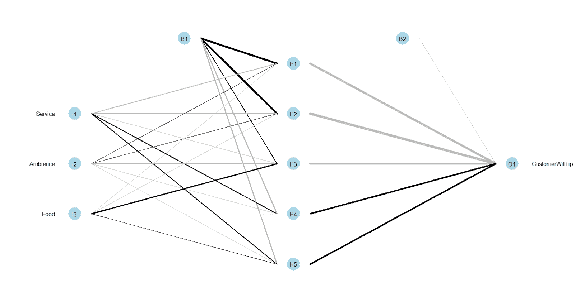

使用`NeuralNetTools`，可以使用`garson`算法获得神经网络中输入变量的相对重要性:

```
garson(model)
```

该命令打印各种输入参数及其对输出预测的重要性，如下图所示:

****

从应用 Garson 算法获得的图表中，可以注意到，在决定给小费时，顾客所接受的服务具有更大的影响。

我们已经在 R 中看到了两个神经网络库，并在简单的例子中使用了它们。我们将在本书中深入探讨几个实际的用例。

<title>Deep learning</title>  

# 深度学习

DL 形成了具有许多隐藏层的高级神经网络。DL 是一个庞大的主题，是构建 AI 的一个重要概念。它用于各种应用，例如:

*   图像识别
*   计算机视觉
*   笔迹检测
*   文本分类
*   多类分类
*   回归问题等等

在以后的章节中，我们会看到更多关于 DL 和 R 的内容。

<title>Pros and cons of neural networks</title>  

# 神经网络的利与弊

神经网络构成了数字逻辑的基础，数字逻辑的应用非常广泛，从声音识别到癌症检测。本节描述了神经网络的优点和缺点。利大于弊，让神经网络成为数据科学、机器学习和预测的首选建模技术。

<title>Pros</title>  

# 赞成的意见

以下是神经网络的一些优势:

*   神经网络是灵活的，可用于回归和分类问题。由于神经网络是一个具有近似函数的数学模型，任何可以被数值化的数据都可以用于该模型。
*   神经网络适合用具有大量输入的非线性数据建模；比如图像。它在涉及许多特征的任务方法中是可靠的。它的工作原理是将分类问题分解成一个由更简单的元素组成的分层网络。
*   一旦经过训练，预测速度非常快。
*   神经网络可以用任意数量的输入和层数来训练。
*   神经网络在处理更多数据点时效果最佳。

<title>Cons</title>  

# 骗局

让我们来看看神经网络的一些缺点:

*   神经网络是黑箱，这意味着我们无法知道每个自变量对因变量的影响程度。
*   用传统的 CPU 进行训练在计算上非常昂贵和耗时。
*   神经网络很大程度上依赖于训练数据。这就导致了过拟合和泛化的问题。该模式更依赖于训练数据，并且可以根据该数据进行调整。

<title>Best practices in neural network implementations</title>  

# 神经网络实现的最佳实践

以下是一些有助于实现神经网络的最佳实践:

*   当有好的训练数据时，最好实现神经网络
*   MLP 中的隐藏图层越多，模型的预测精度就越高
*   隐藏层中最好有五个节点
*   ReLU 和**误差平方和** ( **SSE** )分别是激活函数和误差扣除的最佳技术

<title>Quick note on GPU processing</title>  

# GPU 处理快速说明

处理能力的提高极大地推动了神经网络在日常问题中的应用。GPU 是一种专用处理器，旨在执行图形操作(例如，游戏、3D 动画等)。它们执行数学密集型任务，是 CPU 的补充。CPU 执行计算机的操作任务，而 GPU 用于执行繁重的工作负载处理。

神经网络架构需要强大的数学计算能力，GPU 是这里的首选。每个神经元的权重和输入之间的矢量化点矩阵积可以通过 GPU 并行运行。GPU 的进步正在普及神经网络。DL 在图像处理、计算机视觉、生物信息学和天气建模方面的应用正受益于 GPU。

<title>Summary</title>  

# 摘要

在这一章中，我们看到了人工神经网络的概述。神经网络的实现很简单，但是内部结构相当复杂。我们可以把神经网络概括为一种通用的数学函数逼近。任何产生输出的输入集合都可以通过神经网络变成一个黑箱数学函数，近年来应用非常广泛。

我们在本章中看到了以下内容:

*   神经网络是一种机器学习技术，由数据驱动
*   人工智能、机器学习和神经网络是让机器像人类一样工作的不同范例
*   神经网络可用于监督和非监督机器学习
*   权重、偏差和激活函数是神经网络中的重要概念
*   神经网络是非线性和非参数的
*   与其他机器学习模型相比，神经网络的预测速度非常快，而且最准确
*   任何神经网络结构中都有输入层、隐藏层和输出层
*   神经网络是建立在 MLP 的基础上的，我们了解了神经网络的基础:权重、偏差、激活函数、前馈和反向传播处理
*   前向和反向传播是获得神经网络模型的技术

神经网络可以通过许多编程语言来实现，即 Python、R、MATLAB、C 和 Java 等。这本书的重点将是使用 R. DNN 构建应用程序，人工智能系统是在神经网络的基础上发展起来的。在接下来的章节中，我们将演练不同类型的神经网络及其各种应用。