<title>Learning Process in Neural Networks</title>  

# 神经网络中的学习过程

正如人类有许多不同类型的学习和学习方法一样，我们也可以说机器也是如此。为了确保机器能够从经验中学习，根据具体的工作要求定义最佳的可用方法是很重要的。这通常意味着选择适合当前情况的技术，并不时地对它们进行评估，以确定我们是否需要尝试新的东西。

我们已经在[第 1 章](b283a577-2201-43eb-877c-f281677370bf.xhtml)、*神经网络和人工智能概念*中看到了神经网络的基础知识，以及两个使用 r 的简单实现。在本章中，我们将处理学习过程，即如何训练、测试和部署神经网络机器学习模型。训练阶段用于学习，以拟合神经网络的参数。测试阶段用于评估完全训练的神经网络的性能。最后，在部署阶段，通过模型传递实际数据来获得预测。

以下是本章涵盖的概念列表:

*   学习过程
*   监督学习
*   无监督学习
*   培训、测试和部署模型
*   评估度量--误差测量和微调:测量模型的精确度
*   使用神经网络的监督学习模型
*   使用神经网络的无监督学习模型
*   反向传播

在本章结束时，我们将理解学习过程的基本概念以及如何在 R 环境中实现它。我们将发现不同类型的算法来实现神经网络。我们将学习如何训练、测试和部署模型。我们将知道如何执行正确的估价程序。

<title>What is machine learning?</title>  

# 什么是机器学习？

我们所说的机器学习是什么意思？定义是相当困难的，为此，我们正在请大领域的科学家来帮忙。我们可以提一句人工智能先驱的名言:

*"Field of study that gives computers the ability to learn without being explicitly programmed."* 

亚瑟·塞缪尔

机器学习是用数据训练模型或算法，然后使用模型预测任何新数据。例如，教一个蹒跚学步的孩子如何从爬行阶段开始走路。最初，幼儿的父母握着幼儿的手帮助他站起来，并通过给定的数据教他。在这些程序的基础上，如果在蹒跚学步的孩子的道路上出现障碍，或者如果在某个地方有转弯，在训练后，蹒跚学步的孩子能够自己导航。用于培训的数据是培训数据，即使在正式培训之后，接受者也继续学习。

机器也可以像初学走路的孩子一样，通过训练完成任务。首先，我们输入足够的数据来告诉机器在什么情况下需要做什么。训练后，机器可以自动执行，也可以学习自我微调。这种训练机器的方式叫做**机器学习**。

机器学习和编程的主要区别在于，机器学习中不涉及编码/编程，而编程是给机器一组指令去执行。在机器学习中，数据是唯一提供的输入，模型基于我们决定使用的算法。

要使用的算法基于数据的各种因素:特征(或自变量)、因变量的类型、模型的准确性以及模型的训练和预测速度。

基于机器学习数据的独立变量，有三种不同的方法来训练模型:

*   监督学习
*   无监督学习
*   强化学习

下图显示了训练机器学习模型的不同算法:

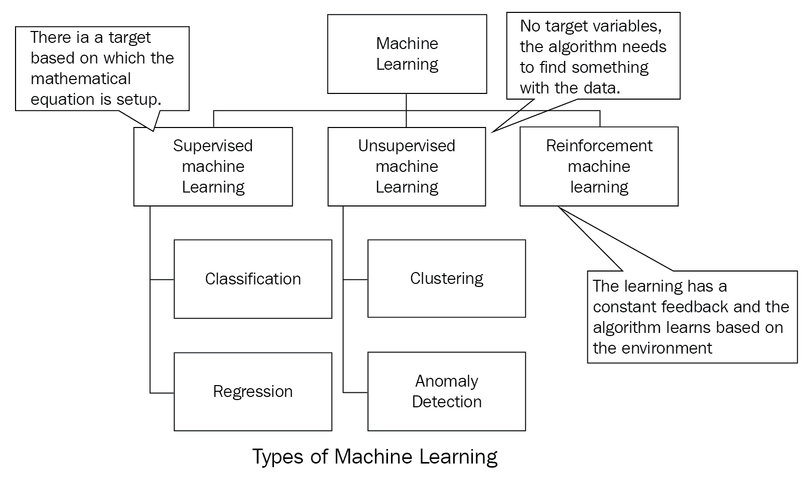

在接下来的章节中，我们将逐一介绍它们。

<title>Supervised learning</title>  

# 监督学习

**监督学习**是一种学习方法，其中有一部分训练数据充当算法的老师来确定模型。机器被教导从目标数据中学习什么。目标数据，或因变量或响应变量，是自变量集体作用的结果。网络训练是用目标数据完成的，其行为是用输入数据的模式完成的。目标标签是预先已知的，并且数据被馈送给算法以导出模型。

大多数神经网络的使用都是通过监督学习来完成的。基于输出值调整权重和偏差。输出可以是分类的(如真/假或 0/1/2)或连续的(如 1、2、3 等)。该模型依赖于输出变量的类型，在神经网络的情况下，输出层建立在目标变量的类型上。

对于神经网络，所有的自变量和因变量都需要是数字，因为神经网络是基于数学模型的。由数据科学家将数据转换成数字并输入到模型中。

下图描述了监督学习:

<title>Unsupervised learning</title>  

# 无监督学习

在无监督学习(或自组织)中，输出层被训练成将输入数据组织成另一组数据，而不需要目标变量。如下图所示，对输入数据进行分析，并从中找到模式以导出输出。由于没有老师(或目标变量)，这种类型的学习被称为**无监督学习**。

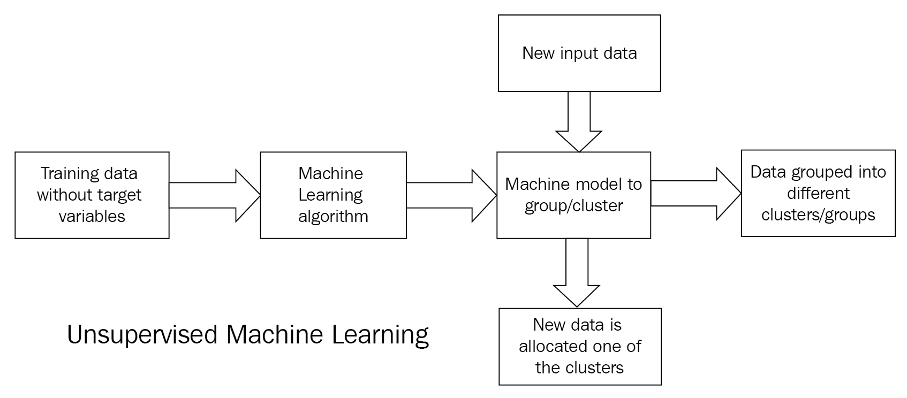

可用于无监督学习的不同技术如下:

*   聚类(K 均值，分层)
*   联想技术
*   降维
*   **自组织映射** ( **SOM** )/ Kohonen 网络

总而言之，下图描述了两种主要类型的机器学习:

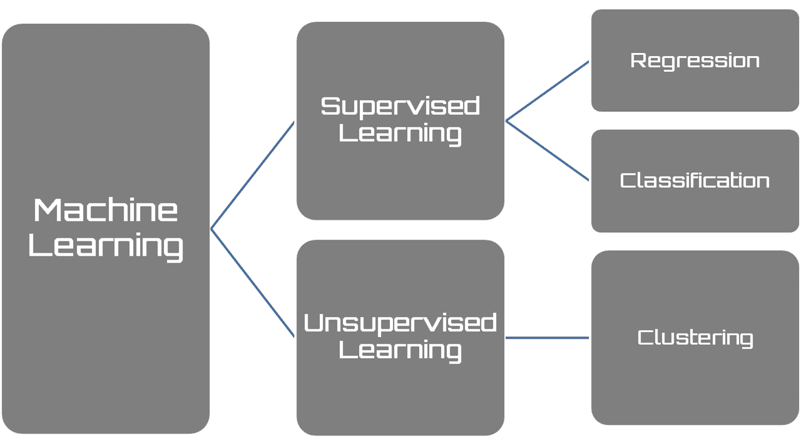

对于神经网络，我们有两种可用的类型，使用 r。

<title>Reinforcement learning</title>  

# 强化学习

强化学习是一种机器学习，其中不断向模型提供反馈以适应环境。每一步都有一个性能评估来改进模型。对于神经网络，有一种特殊类型叫做 **Q-learning** ，结合神经元在反向传播反馈机制中实现强化学习。细节超出了本书的范围。

以下是我们到目前为止学到的三种类型的知识:

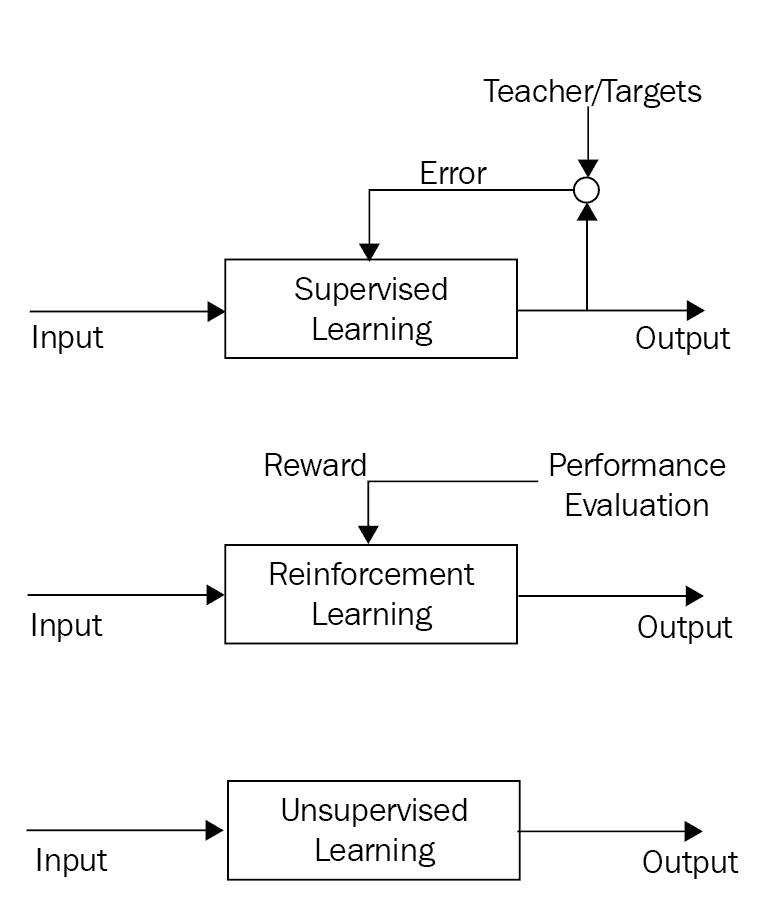<title>Training and testing the model</title>  

# 训练和测试模型

训练和测试该模型形成了在预测分析中进一步使用该模型进行预测的基础。给定一个由 *100* 行数据组成的数据集，其中包括预测变量和响应变量，我们将数据集分成一个合适的比例(比如说 *70:30* )，并分配 *70* 行用于训练，分配 *30* 行用于测试。随机选择行以减少偏差。

一旦训练数据可用，数据就被馈送到神经网络，以获得大规模的通用功能。训练数据确定用于从输入获得输出的权重、偏差和激活函数。直到最近，我们还不能说权重对目标变量有积极或消极的影响。但是现在我们已经能够揭示黑匣子内部的一些情况。例如，通过绘制经过训练的神经网络，我们可以发现经过训练的突触权重和关于训练过程的基本信息。

一旦达到足够的收敛，就将模型存储在内存中，下一步是测试模型。我们通过 *30* 行数据来检查实际输出是否与模型的预测输出相匹配。评估用于获得可以验证模型的各种度量。如果精确度过于谨慎，则必须根据传递给神经网络函数的训练数据和其他参数的变化来重新构建模型。我们将在本章的后面讨论更多的评估指标。

在训练和测试之后，模型被部署，实际数据通过模型得到预测。例如，用例可能是基于各种输入参数确定欺诈交易或房屋贷款资格检查。

下图显示了培训、测试和部署:

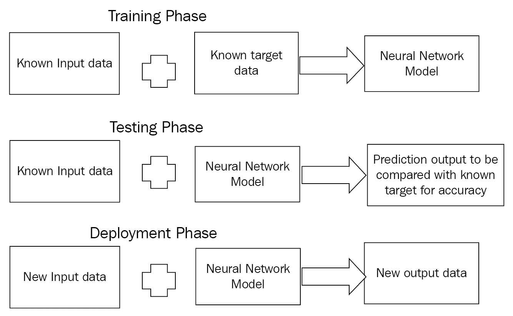

到目前为止，我们已经关注了各种可用的算法；现在是时候将我们自己奉献给代表每个分析的基本元素的数据了。

<title>The data cycle</title>  

# 数据周期

这些数据构成了模型构建和学习过程的关键组成部分。数据需要被收集、清理、转换，然后馈送给模型进行学习。总体数据生命周期如下所示:


建模的一个关键要求是拥有良好且平衡的数据。这有助于更高精度的模型和可用算法的更好使用。数据科学家的时间主要花在构建模型之前清理数据上。

我们已经看到了模型部署前的培训和测试。对于测试，结果被捕获为评估度量，这有助于我们决定是否应该使用特定的模型或者改变它。

接下来我们将看到评估指标。

<title>Evaluation metrics</title>  

# 评估指标

评估模型包括在测试阶段检查预测值是否等于实际值。有各种各样的度量标准可以用来检查模型，它们依赖于目标变量的状态。

对于二元分类问题，预测目标变量和实际目标变量可以处于以下四种状态中的任何一种:

| **预测的** | **实际** |
| *预测=真实* | *实际=真* |
| *预测=真实* | *实际=假* |
| *预测=假* | *实际=真* |
| *预测=假* | *实际=假* |

当预测值和实际值相同时，我们被认为是准确的。如果所有的预测值和实际值都相同(或者所有的*为真*或者所有的*为假*)，则该模型是 100%准确的。但是，从来都不是这样。

因为神经网络是近似模型，所以总有一点误差是可能的。上表中提到的所有四种状态都是可能的。

我们为模型定义了以下术语和指标:

*   **真阳性** ( **TP** ): 预测和实际都为*真*(准确性好)的所有情况。
*   **真否定** ( **TN** ):所有情况预测时为*假*，实际也为*假*(准确性好)。
*   **假阳性** ( **FP** ): 这是我们预测某事为阳性(*真*)，但实际为阴性的情况。这就像一个假警报或 FP 错误。一个例子是当通过妊娠测试试剂盒预测男性怀孕时。所有情况当预测为*真*，而实际为*假*。这也被称为**类型 1 错误**。
*   **假阴性** ( **FN** ): 当我们预测某事为*假*，而实际上却是*真*时，那么这个案例就叫 FN。例如，当妊娠测试试剂盒预测怀孕女性没有怀孕时，这就是 FN 病例。所有情况下，当预测*为假*且实际*为真*时。这也被称为**类型 2 错误**。

<title>Confusion matrix</title>  

# 混淆矩阵

当分类值被绘制在 *nxn* 矩阵中时(在二进制分类的情况下 *2x2* ，该矩阵被称为**混淆矩阵**。所有评估指标都可以从混淆矩阵本身导出:

|  | **预测值** | **预测值** |
| *实际值* | *真* | *假* |
| *真* | *TP* | *FN* |
| *假* | *FP* | *TN* |

现在，让我们详细看看一些评估指标。

<title>True Positive Rate</title>  

# 真实阳性率

**真阳性率** ( **TPR** )或敏感度或召回率或命中率是对所有已识别阳性中识别出多少真阳性的衡量:


理想情况下，如果这个模型更接近 1，它会更好。

<title>True Negative Rate</title>  

# 真实负利率

**真阴性率** ( **TNR** )或特异性是真阴性与我们预测的阴性总数之比:


如果这个比率越接近零，模型就越准确。

<title>Accuracy</title>  

# 准确(性)

准确性是衡量我们的模型有多好的标准。如果我们的模型表现良好，预计它会更接近 1。

准确度是正确预测与所有总预测的比率:

<title>Precision and recall</title>  

# 精确度和召回率

精度和召回率也分别是带有( *TP+FP* 的 *TP* 和带有( *TP+FN* )的 *TP* 之间的比率。这些比率决定了我们的预测与实际的相关程度。

精确度被定义为有多少选择的项目是相关的。也就是预测的有多少实际上是正确预测的。

等式是:


如果精度越接近 1，我们的预测就越准确。

另一方面，回忆告诉我们选择了多少相关的项目。数学上，它是:


下图清楚地描述了我们到目前为止所做的讨论:

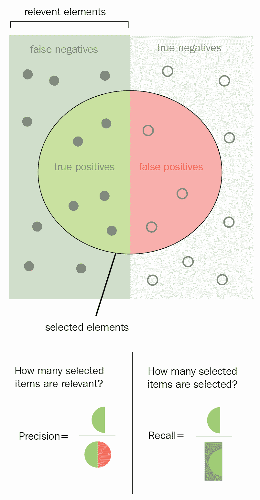<title>F-score</title>  

# f 分数

f 分数或 F1 分数是另一种衡量准确性的方法。从技术上讲，它是精确度和召回率的调和平均值:


<title>Receiver Operating Characteristic curve</title>  

# 接受者操作特征曲线

**接收器工作特性** ( **ROC** )曲线是一种图形视觉，说明了二元分类器系统的预测能力。ROC 曲线是通过在不同的阈值设置下绘制 TPR 相对于**假阳性率** ( **FPR** )的图表来创建的。这给了我们**灵敏度**对( **1 -特异性**)。ROC 曲线通常如下所示:


在获得必要的技能后，我们准备详细分析用于构建神经网络的算法。

<title>Learning in neural networks</title>  

# 神经网络中的学习

正如我们在[第 1 章](b283a577-2201-43eb-877c-f281677370bf.xhtml)、*神经网络和人工智能概念*中所看到的，神经网络是一种机器学习算法，能够从数据中学习，并使用建立的模型为我们提供预测。这是一个通用的函数近似，即任何输入、输出数据都可以近似为一个数学函数。

前向传播为我们提供了一个初始数学函数，通过选择随机权重，根据输入得到输出。实际值和预测值之间的差异称为误差项。前馈神经网络中的学习过程实际上发生在反向传播阶段。通过减少每次迭代中的误差项，用权重对模型进行微调。梯度下降用于反向传播过程。

让我们在本章中详细讨论反向传播，因为它是神经网络的一个重要的机器学习方面。

<title>Back to backpropagation</title>  

# 回到反向传播

我们已经在[第一章](b283a577-2201-43eb-877c-f281677370bf.xhtml)、*神经网络和人工智能概念*中详细介绍了前向传播，以及使用梯度下降的反向传播。反向传播是理解神经网络的重要概念之一，它依靠微积分来更新每一层中的权重和偏差。错误的反向传播类似于*从错误中学习*。我们在每次迭代中纠正自己的错误，直到我们到达一个叫做**收敛** *的点。*反向传播的目标是校正每一层的权重，并使输出层的整体误差最小。

神经网络学习严重依赖于前馈网络中的反向传播。正向传播和误差校正的通常步骤解释如下:

1.  通过向隐藏层中的每个神经元分配随机权重和偏差，开始神经网络的前向传播。
2.  得到每个神经元的 *sum(权重*输入)+ bias* 之和。
3.  在每个神经元上应用激活函数( *sigmoid* )。
4.  将这个输出传递给下一层神经元。
5.  如果该层是输出层，则应用权重，并在每个输出层神经元处获得 *sum(权重*输入)+ bias* 之和。
6.  再次，在输出层神经元应用激活函数。
7.  这在输出层形成了一次正向传递的神经网络的输出。
8.  现在，利用训练数据，我们可以通过减去实际输出和激活函数输出值来识别每个输出神经元的误差项。

9.  总误差通过以下公式得出:

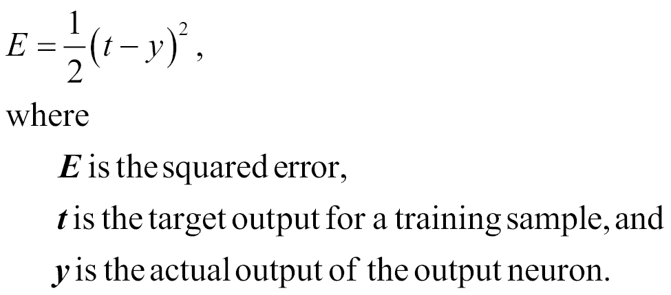

当误差函数 *E* 随后被微分时，因子 *1/2* 用于取消指数。

10.  梯度下降技术需要计算误差项( *E* )相对于网络权重的偏导数。使用微分的**链式法则** 计算完整误差相对于权重 *w [ij]* 的偏导数:


导数定义为一个值的变化率，梯度下降使用导数(或斜率)来最小化误差项并得到一组正确的权重。

11.  第一个因子是误差项相对于特定神经元输出的偏导数 *j* 和*o[j]等于 *y* :*


12.  链式法则中的第二个因素是神经元*o[j]的输出相对于其输入的偏导数，并且是激活函数 *sigmoid* 函数的偏导数:*


这里*net[j]是神经元的输入。*

13.  链式法则中的第三项简单来说就是*o[I]。*


14.  结合步骤 11、12 和 13，我们得到:


15.  每个神经元(任何层)处的权重*w[ij]用该偏导数结合学习率来更新。*

重复这些步骤，直到我们收敛到非常低的误差项或指定的次数。

所有步骤都在可用的 R 包内部处理。我们可以提供学习率以及各种其他参数。

反向传播如下所示:

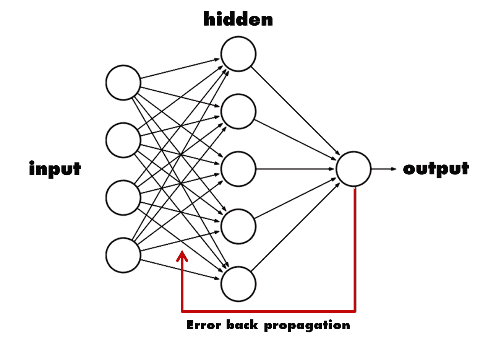

正如生活中的所有事情一样，即使是算法也有进一步改进的余地。在下一节中，我们将看到如何去做。

<title>Neural network learning algorithm optimization</title>  

# 神经网络学习算法优化

用于在神经网络中执行学习过程的程序称为训练算法。学习算法是机器学习算法选择的具有最佳优化的模型。目的是最小化损失函数并提供更高的精度。这里我们举例说明了一些优化技术，而不是梯度下降。

**粒子群优化** ( **PSO** )方法的灵感来自对鸟群在寻找食物或生存时的社会和集体行为的观察。这类似于鱼群试图一起移动。我们知道粒子的位置和速度，粒子群算法的目标是在一个由位置和速度的数学方程控制的大空间中搜索解集。它是从生物有机体行为中获得生物灵感，用于集体智慧。

**模拟退火**是一种基于概率方法来逼近成本函数的全局最优值的方法。该方法通过模拟在大空间中搜索解。

进化方法来源于生物学中的进化过程，进化可以是繁殖、突变、选择和重组。
适应度函数用于确定模型的性能，基于此
函数，我们选择最终模型。

**期望最大化** ( **EM** )方法是一种统计学习方法，利用迭代法寻找最大似然或最大后验估计，从而使误差最小化。

<title>Supervised learning in neural networks</title>  

# 神经网络中的监督学习

如前所述，监督学习是一种学习方法，其中有一部分训练数据充当算法的教师来确定模型。在下一节中，将提出一个回归预测建模问题的示例，以了解如何使用神经网络解决该问题。

<title>Boston dataset</title>  

# 波士顿数据集

该数据集描述了波士顿郊区房屋的 13 个数字属性，并涉及以千美元为单位对这些郊区的房屋价格进行建模。因此，这是一个回归预测建模问题。输入属性包括犯罪率、非零售商业面积比例、化学物质浓度等。下表列出了所有变量，并附有简要说明:

*   实例数量: *506*
*   属性个数: *13 个*连续属性(包括`class`
    属性`MEDV`)，一个二值属性

每个属性详述如下:

1.  `crim`各城镇人均犯罪率。
2.  `zn`超过 *25，000* 平方英尺的住宅用地比例。
3.  `indus`各镇非零售营业亩数比例。
4.  `chas`查理斯河哑变量( *= 1* 如果地域界河； *0* 否则)。

5.  `nox`氮氧化物浓度(份每 *10* 百万)。
6.  `rm`每个住宅的平均房间数。
7.  `age`1940 年*前建成的自住单元比例*。
8.  `dis`到五个波士顿就业中心的加权距离
9.  `rad`放射状公路可达性指数。
10.  `tax`每*万美元*的全价值财产税税率。
11.  `ptratio`城镇师生比。
12.  `black` *1000(Bk - 0.63)^2* 其中 *Bk* 是按城镇划分的黑人比例。
13.  `lstat`人口的地位降低的百分比。
14.  `medv`1000 美元的*自有住房的中值*。

其中，`medv`是响应变量，而其他十三个变量是可能的预测变量。此分析的目标是拟合一个回归模型，该模型最好地解释了`medv`中的变化。

前十三列和`medv`响应变量之间有关系。我们可以根据输入的十三列来预测`medv`的值。

这个数据集已经提供了 R 库(`MASS`)，我们将在后面看到，所以我们不必担心检索数据。

<title>Neural network regression with the Boston dataset</title>  

# 基于波士顿数据集的神经网络回归

在本节中，我们将为`Boston`数据集运行一个回归神经网络。`medv`值是针对测试数据预测的。试分裂的列车为 *70:30* 。`neuralnet` 函数用于用神经网络对数据建模:

```
#####################################################################
###Chapter 2 - Introduction to Neural Networks - using R ############
###Simple R program to build, train, test regression neural networks#
#########################flename: Boston.r###########################
#####################################################################

library("neuralnet")
library(MASS)

set.seed(1)

data = Boston

max_data <- apply(data, 2, max) 
min_data <- apply(data, 2, min)
data_scaled <- scale(data,center = min_data, scale = max_data - min_data) 

index = sample(1:nrow(data),round(0.70*nrow(data)))
train_data <- as.data.frame(data_scaled[index,])
test_data <- as.data.frame(data_scaled[-index,])

n = names(data)
f = as.formula(paste("medv ~", paste(n[!n %in% "medv"], collapse = " + ")))
net_data = neuralnet(f,data=train_data,hidden=10,linear.output=T)
plot(net_data)

predict_net_test <- compute(net_data,test_data[,1:13])

predict_net_test_start <- predict_net_test$net.result*(max(data$medv)-min(data$medv))+min(data$medv)
test_start <- as.data.frame((test_data$medv)*(max(data$medv)-min(data$medv))+min(data$medv))
MSE.net_data <- sum((test_start - predict_net_test_start)^2)/nrow(test_start)

Regression_Model <- lm(medv~., data=data)
summary(Regression_Model)
test <- data[-index,]
predict_lm <- predict(Regression_Model,test)
MSE.lm <- sum((predict_lm - test$medv)^2)/nrow(test)

MSE.net_data
MSE.lm
###########################################################################

```

不要担心，现在我们将逐行详细解释整个代码。

```
library("neuralnet")
library(MASS)
```

代码的前两行很简单，因为它们加载了我们将在后面的计算中使用的库。具体来说，`neuralnet`库将帮助我们构建和训练网络，而`MASS`库将帮助我们加载我们之前详细介绍过的`Boston`数据集。

记住，要安装 R 的初始发行版中没有的库，必须使用`install.package`函数。这是安装包的主要功能。它接受一个名称向量和一个目的库，从存储库中下载包并安装它们。

例如，在我们的例子中，要安装`neuralnet`包，我们应该写:

```
install.neuralnet
```

最后，需要强调的是，这个函数应该只使用一次，而不是每次运行代码时都使用。相反，通过以下命令加载库，并且每次运行代码时都必须重复该命令:

```
library (neuralnet)
```

函数`set.seed`设置 R 的随机数生成器的种子，这对于创建模拟或可复制的随机对象很有用:

```
set.seed(1)
```

每当你想得到一个可重复的随机结果时，你必须使用这个函数。在这种情况下，随机数是相同的，无论我们在序列中走多远，它们都将继续相同。

下面的命令加载了`Boston`数据集，正如我们所预料的，它包含在`MASS`库中，并保存在给定的帧中:

```
data = Boston
```

使用`str`功能查看一个紧凑显示的任意 R 对象的结构。在我们的例子中，使用`str(data)`，我们将获得以下结果:

```
> str(data)
'data.frame': 506 obs. of 14 variables:
 $ crim : num 0.00632 0.02731 0.02729 0.03237 0.06905 ...
 $ zn : num 18 0 0 0 0 0 12.5 12.5 12.5 12.5 ...
 $ indus : num 2.31 7.07 7.07 2.18 2.18 2.18 7.87 7.87 7.87 7.87 ...
 $ chas : int 0 0 0 0 0 0 0 0 0 0 ...
 $ nox : num 0.538 0.469 0.469 0.458 0.458 0.458 0.524 0.524 0.524 0.524 ...
 $ rm : num 6.58 6.42 7.18 7 7.15 ...
 $ age : num 65.2 78.9 61.1 45.8 54.2 58.7 66.6 96.1 100 85.9 ...
 $ dis : num 4.09 4.97 4.97 6.06 6.06 ...
 $ rad : int 1 2 2 3 3 3 5 5 5 5 ...
 $ tax : num 296 242 242 222 222 222 311 311 311 311 ...
 $ ptratio: num 15.3 17.8 17.8 18.7 18.7 18.7 15.2 15.2 15.2 15.2 ...
 $ black : num 397 397 393 395 397 ...
 $ lstat : num 4.98 9.14 4.03 2.94 5.33 ...
 $ medv : num 24 21.6 34.7 33.4 36.2 28.7 22.9 27.1 16.5 18.9 ...
```

下图显示了给定对象的结果:


让我们回过头来解析代码:

```
max_data <- apply(data, 2, max) 
min_data <- apply(data, 2, min)
data_scaled <- scale(data,center = min_data, scale = max_data - min_data) 
```

我们需要这段代码来规范化数据。

请记住，在训练神经网络之前对数据进行规范化是一种很好的做法。通过规范化，消除了数据单元，使您可以轻松地比较不同位置的数据。

这是建立神经网络的一个极其重要的过程，因为它避免了不必要的结果或导致算法收敛问题的非常困难的训练过程。您可以选择不同的方法来缩放数据( **z 归一化**、**最小-最大缩放**等)。对于本例，我们将使用最小-最大方法(通常称为特征缩放)来获取范围*【0，1】*内的所有缩放数据。实现这一点的公式如下:


在应用为规范化选择的方法之前，必须计算每个数据库列的最小值和最大值。为此，我们使用了`apply`函数。此函数返回一个向量、一个数组或一组通过对数组或矩阵的边距应用函数而获得的值。让我们理解一下所用论据的含义。

```
max_data <- apply(data, 2, max) 
```

`apply`函数的第一个参数指定了要应用该函数的数据集，在我们的例子中，数据集名为`data`。第二个参数必须包含一个向量，该向量给出函数将应用到的下标。在我们的例子中，1 表示行，`2`表示列。第三个参数必须包含要应用的函数；在我们的例子中，`max`函数。

为了规范化数据，我们使用了`scale`函数，这是一个通用函数，它的默认方法是居中和/或缩放数字矩阵的列。

```
index = sample(1:nrow(data),round(0.70*nrow(data)))
train_data <- as.data.frame(data_scaled[index,])
test_data <- as.data.frame(data_scaled[-index,])
```

在刚刚建议的第一行代码中，数据集被分成了 *70:30* ，目的是使用我们所掌握的 *70* 的数据来训练网络，剩余的 *30* 的数据来测试网络。在第二行和第三行，名为`data`的数据帧的数据被细分为两个新的数据帧，名为`train_data`和`test_data.`

```
n = names(data)
f = as.formula(paste("medv ~", paste(n[!n %in% "medv"], collapse = " + ")))
net_data = neuralnet(f,data=train_data,hidden=10,linear.output=T)
plot(net_data)
```

到目前为止，一切都只是用来准备数据。现在是建立网络的时候了。为此，我们首先使用`names`函数恢复所有变量名。这个函数将获取或设置一个对象的名称。

接下来，我们构建将用于构建网络的`formula`，因此我们使用`neuralnet`函数来构建和训练网络。在这种情况下，我们将创建一个只有一个隐藏层和`10`节点的网络。最后，我们绘制神经网络，如下图所示:

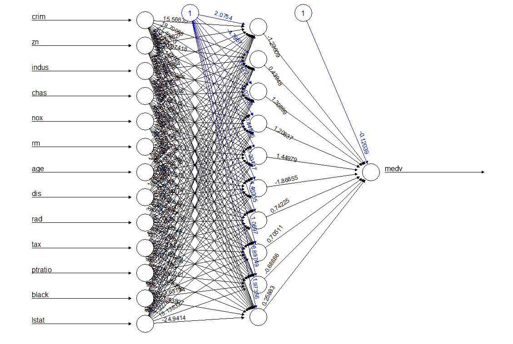

现在我们有了网络，我们该怎么办？当然，我们用它来做预测。为此，我们留出了 30%的可用数据:

```
predict_net_test <- compute(net_data,test_data[,1:13])
```

在我们的例子中，我们将函数应用于`test_data`数据集，仅使用代表网络输入变量的第一个`13`列:

```
predict_net_test_start <- predict_net_test$net.result*(max(data$medv)-       min(data$medv))+min(data$medv)
test_start <- as.data.frame((test_data$medv)*(max(data$medv)-min(data$medv))+min(data$medv))
MSE.net_data <- sum((predict_net_test_start - test_start)^2)/nrow(test_start)
```

但是我们如何判断网络能够进行的预测是否准确呢？我们可以使用**均方误差** ( **MSE** )来衡量我们的预测与真实数据的差距。

在这方面，值得记住的是，在我们建立网络之前，我们已经对数据进行了标准化。现在，为了能够进行比较，我们需要后退一步，回到开始的位置。一旦数据集的值被恢复，我们可以通过下面的等式计算 *MSE* :

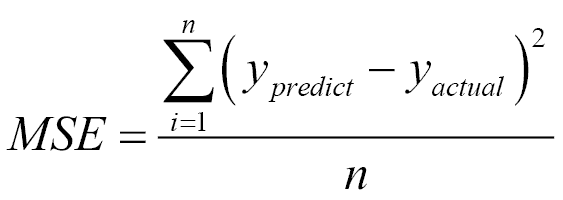

好了，我们已经计算了 MSE，现在我们把它和什么做比较？为了了解网络预测的准确性，我们可以建立一个线性回归模型:

```
Regression_Model <- lm(medv~., data=data)
summary(Regression_Model)
test <- data[-index,]
predict_lm <- predict(Regression_Model,test)
MSE.lm <- sum((predict_lm - test$medv)^2)/nrow(test)
```

我们使用`lm`函数建立一个线性回归模型。该函数用于拟合线性模型。它可用于执行回归、单层方差分析和协方差分析。为了生成获得的模型拟合结果的结果汇总，我们使用了`summary`函数，该函数返回以下结果:

```
> summary(Regression_Model)

Call:
lm(formula = medv ~ ., data = data)

Residuals:
 Min 1Q Median 3Q Max 
-15.5944739 -2.7297159 -0.5180489 1.7770506 26.1992710

Coefficients:
 Estimate Std. Error t value Pr(>|t|) 
(Intercept) 36.4594883851 5.1034588106 7.14407 0.00000000000328344 ***
crim -0.1080113578 0.0328649942 -3.28652 0.00108681 ** 
zn 0.0464204584 0.0137274615 3.38158 0.00077811 ***
indus 0.0205586264 0.0614956890 0.33431 0.73828807 
chas 2.6867338193 0.8615797562 3.11838 0.00192503 ** 
nox -17.7666112283 3.8197437074 -4.65126 0.00000424564380765 ***
rm 3.8098652068 0.4179252538 9.11614 < 0.000000000000000222 ***
age 0.0006922246 0.0132097820 0.05240 0.95822931 
dis -1.4755668456 0.1994547347 -7.39800 0.00000000000060135 ***
rad 0.3060494790 0.0663464403 4.61290 0.00000507052902269 ***
tax -0.0123345939 0.0037605364 -3.28001 0.00111164 ** 
ptratio -0.9527472317 0.1308267559 -7.28251 0.00000000000130884 ***
black 0.0093116833 0.0026859649 3.46679 0.00057286 ***
lstat -0.5247583779 0.0507152782 -10.34715 < 0.000000000000000222 ***
---
Signif. codes: 0 ‘***’ 0.001 ‘**’ 0.01 ‘*’ 0.05 ‘.’ 0.1 ‘ ’ 1

Residual standard error: 4.745298 on 492 degrees of freedom
Multiple R-squared: 0.7406427, Adjusted R-squared: 0.7337897 
F-statistic: 108.0767 on 13 and 492 DF, p-value: < 0.00000000000000022204
```

此外，对于回归模型，我们计算平均 MSE。最后，为了评估网络的性能，将其与使用相同数据库计算的多元线性回归模型进行比较，如下所示:

```
MSE.net_data
MSE.lm
```

结果是:

```
> MSE.net_data
[1] 12.0692812
> MSE.lm
[1] 26.99265692
```

从结果的分析中，可以注意到神经网络比线性回归模型具有更低的`MSE`。

<title>Unsupervised learning in neural networks </title>  

# 神经网络中的无监督学习

在本节中，我们将介绍神经网络中的无监督学习模型，命名为竞争学习和 Kohonen SOM。Kohonen SOM 是由一位名叫 Teuvo Kohonen 的教授发明的，是一种在低得多的维度上表示多维数据的方法: *1D* 或 *2D* 。它可以在没有监督的情况下对数据进行分类。无监督学习旨在发现数据集中的隐藏模式，并将它们聚类到不同的数据类中。

有许多无监督学习技术，即 K-means 聚类、降维、EM 等。共同的特征是没有输入-输出映射，我们只处理输入值来创建一组或一组输出。

对于神经网络的情况，它们可以用于无监督学习。他们可以将数据分组到不同的桶中(聚类)，或者将原始数据抽象到一组不同的输出数据点中(特征抽象或降维)。非监督技术比监督技术需要更少的处理能力和内存。

在无监督的神经网络中，没有目标变量，我们不能进行反向传播。相反，我们在没有误差测量的情况下不断调整权重，并尝试将相似的数据分组在一起。对于无监督神经网络，我们将看到两种方法:

*   竞争学习
*   科霍宁·索姆斯

<title>Competitive learning</title>  

# 竞争学习

这里，神经网络节点相互竞争响应输入数据子集的权利。隐藏层被称为**竞争层**。每个竞争神经元都有自己的权重，我们计算单个输入向量和神经元权重之间的相似性度量。对于每个输入向量，隐藏的神经元相互竞争，看哪一个与特定的输入向量最相似:

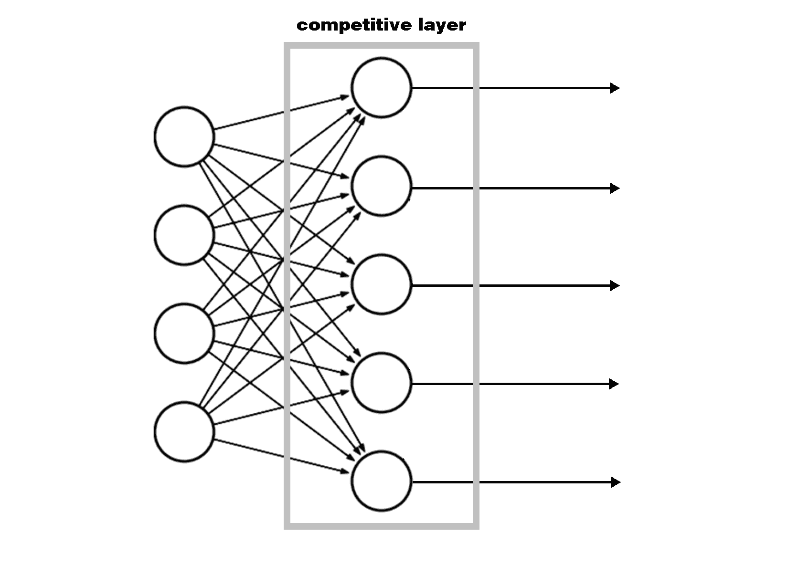

输出神经元被认为是在竞争输入模式。

*   在训练期间，对给定输入模式提供最高激活的输出神经元被声明为获胜者的权重，并被移动到更接近输入模式，而其余神经元保持不变
*   这种策略也被称为**赢家通吃**，因为只有获胜的神经元被更新:


让我们看一个简单的竞争学习算法示例，在给定的输入数据中找到三个神经元:

1.  在输入层我们将有三个输入神经元。神经元的每个输入都是一个连续变量，假设每个输入神经元的权重是一个介于 *0.0* 和 *1.0* 之间的随机数。每个节点的输出是三个权重与其输入的乘积。
2.  每个竞争层神经元接收权重和输入的乘积之和。
3.  具有最高输出的竞争层节点被视为获胜者。该输入然后被分类为在对应于该节点的群集中。
4.  获胜者更新它的每个权重，将权重从信号较弱的连接移动到信号较强的连接。

因此，当我们接收到更多的数据时，每个节点都集中在它所代表的集群的中心。它对属于该群集的输入激活得更强，而对属于其他群集的输入激活得更弱。

竞争学习基本上有两个停止条件:

*   **预定义的时期数**:仅运行 *N* 个时期，这可防止算法运行较长时间而不收敛
*   **权重更新的最小值**:算法一直运行，直到我们有了一个权重更新的最小值

<title>Kohonen SOM</title>  

# 科霍宁·索姆

竞争学习结合邻域神经元的概念给了我们 Kohonen SOMs。输出层中的每个神经元都有两个邻居。激发最大值的神经元在竞争学习中更新其权重，但在 SOM 中，相邻神经元也以相对较慢的速率更新其权重。网络更新权重的邻域神经元的数量基于问题的维度。

对于一个 *2D* 问题，SOM 表示如下:

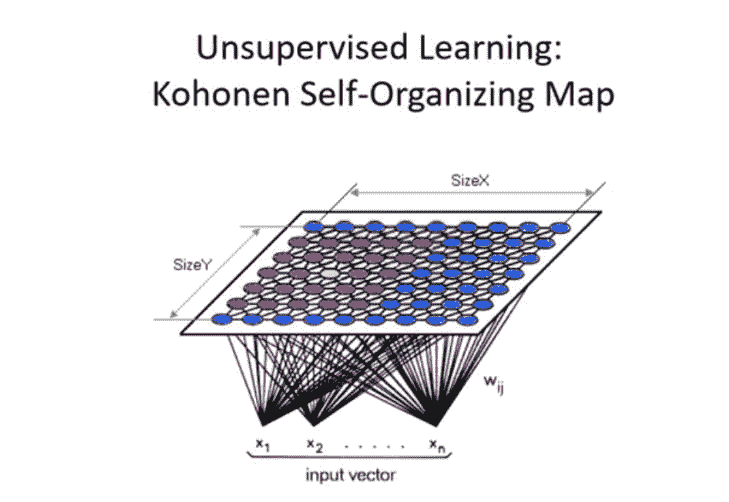

图解地，这是 SOM 如何将不同的颜色映射到不同的簇中:

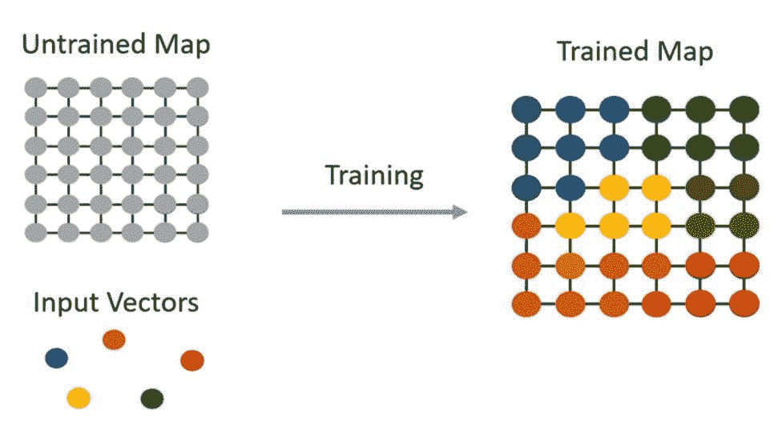

让我们一步步了解 Kohonen SOM 的工作原理:

1.  定义 SOM 结构的输入和聚类的数量以及每个节点的权重被初始化。
2.  从训练数据集中随机选择一个向量，并将其呈现给网络。
3.  检查网络中的每个节点，以计算哪个节点的权重与输入向量最相似。获胜节点俗称**最佳匹配单元** ( **BMU** )。
4.  计算 BMU 邻域的半径。该值开始时很大，通常设置为网络的半径，随着时间的推移逐渐减小。
5.  在步骤 4 中计算的 BMU 半径内发现的任何神经元都将被调整，以使它们更像输入向量。神经元离 BMU 越近，其权重变化越大。
6.  从步骤 2 开始重复第 *N* 次迭代。

对于一组 *N* 个时期重复这些步骤，或者直到获得最小权重更新。

som 用于聚类(将数据分组到不同的桶中)、数据抽象(从输入中导出输出数据)和降维(减少输入特征的数量)等领域。SOMs 以类似于**多维标度** ( **MDS** )的方式处理问题，但是它们不是最小化距离，而是尝试重组拓扑，或者换句话说，它们试图保持相同的邻居。

让我们看一个 SOM 在 R 中实现的例子。`kohonen`包是一个要安装的包，以使用 R 中为 SOM 提供的功能。

以下 R 程序解释了`kohonen`包中的一些功能:

```
######################################################################
###Chapter 2 - Introduction to Neural Networks - using R    ##########
###Usuervised ML technique using Kohonen package  ####################
######################filename: kohonen.r#############################
######################################################################
library("kohonen")

data("wines")
str(wines)
head(wines)
View (wines)

set.seed(1)
som.wines = som(scale(wines), grid = somgrid(5, 5, "hexagonal"))
som.wines
dim(getCodes(som.wines))

plot(som.wines, main = "Wine data Kohonen SOM")
par(mfrow = c(1, 1))
plot(som.wines, type = "changes", main = "Wine data: SOM")

training = sample(nrow(wines), 150)
Xtraining = scale(wines[training, ])
Xtest = scale(wines[-training, ],
 center = attr(Xtraining, "scaled:center"),
 scale = attr(Xtraining, "scaled:scale"))
trainingdata = list(measurements = Xtraining,
 vintages = vintages[training])
testdata = list(measurements = Xtest, vintages = vintages[-training])
mygrid = somgrid(5, 5, "hexagonal")
som.wines = supersom(trainingdata, grid = mygrid)

som.prediction = predict(som.wines, newdata = testdata)
table(vintages[-training], som.prediction$predictions[["vintages"]])
######################################################################
```

代码使用了一个 wine 数据集，它包含一个带有`177`行和`13`列的数据框；对象`vintages`包含了类标签。这些数据来自对意大利同一地区(皮埃蒙特)的葡萄酒进行的化学分析，这些葡萄酒来自三个不同的品种，即`Nebbiolo`、`Barberas`和`Grignolino`葡萄。来自`Nebbiolo`葡萄的酒被称为**巴罗洛**。这些数据包括在三种类型的葡萄酒中发现的几种成分的数量，以及一些光谱变量。

现在，让我们看看代码每一部分的输出。

```
library("kohonen")
```

代码的第一行很简单，因为它加载了我们将在后面的计算中使用的库。具体来说，`kohonen`库将帮助我们训练 som。此外，还支持对地图的询问和使用训练地图的预测。

记住，要安装 R 的初始发行版中没有的库，必须使用`install.package`函数。这是安装包的主要功能。它接受一个名称向量和一个目的库，从存储库中下载包并安装它们。

```
data("wines")
str(wines)
head(wines)
view (wines)
```

这几行加载了`wines`数据集，正如我们所预期的，它包含在 R 分布中，并将它保存在名为`data`的 dataframe 中。然后，我们使用`str`函数来查看一个紧凑显示的数据集的结构。函数`head`用于返回数据帧的第一部分或最后一部分。最后，使用`view`函数调用 dataframe 对象上的电子表格样式的数据查看器，如下图所示:

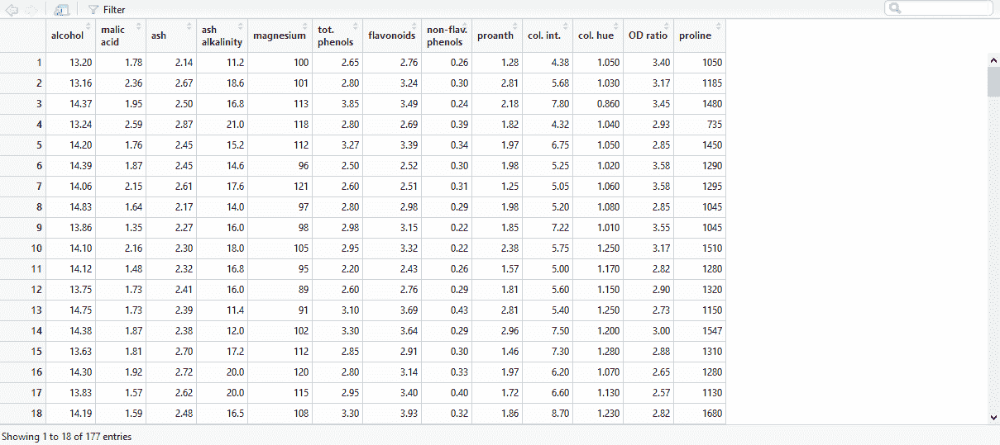

我们将继续分析代码:

```
set.seed(1)
som.wines = som(scale(wines), grid = somgrid(5, 5, "hexagonal"))
dim(getCodes(som.wines))
plot(som.wines, main = "Wine data Kohonen SOM")
```

在加载了葡萄酒数据并为再现性设置了`seed`之后，我们调用`som`来创建一个 *5x5* 矩阵，其中的特征必须被聚类。该函数在内部执行`kohonen`处理，其结果可以通过由特征形成的集群看到。创建了 *25 个*簇，每个簇都有一组具有共同模式的组合特征，如下图所示:


代码的下一部分绘制了到最近单元的平均距离与`som`完成的迭代次数的关系:

```
graphics.off()
par(mfrow = c(1, 1))
plot(som.wines, type = "changes", main = "Wine data: SOM")
```

下图显示了到最近单元的平均距离与迭代次数的关系:


接下来，我们创建一个带有`150`行的`training`数据集和带有`27`行的`test`数据集。我们运行 SOM 并用测试数据进行预测。这里使用的是`supersom` 功能。这里，模型是监督 SOM:

```
training = sample(nrow(wines), 150)
Xtraining = scale(wines[training, ])
Xtest = scale(wines[-training, ],
 center = attr(Xtraining, "scaled:center"),
 scale = attr(Xtraining, "scaled:scale"))
trainingdata = list(measurements = Xtraining,
 vintages = vintages[training])
testdata = list(measurements = Xtest, vintages = vintages[-training])
mygrid = somgrid(5, 5, "hexagonal")
som.wines = supersom(trainingdata, grid = mygrid)

som.prediction = predict(som.wines, newdata = testdata)
table(vintages[-training], som.prediction$predictions[["vintages"]])
```

最后，我们调用`table`函数，该函数使用交叉分类因子来构建每个因子级别组合的计数的列联表，如下所示:

```
> table(vintages[-training], som.prediction$predictions[["vintages"]])

 Barbera Barolo Grignolino
 Barbera            5      0          0
 Barolo             0     11          0
 Grignolino         0      0         11
```

这个`kohonen`包以标准 som 和两个扩展为特色:用于分类和回归目的，以及用于数据挖掘。此外，它还具有丰富的可视化图形功能。

下表列出了`kohonen`包中可用的功能:

| **功能名称** | **描述** |
| `som` | 标准 SOM |
| `xyf`，`bdk` | 监督 SOM 两张平行地图 |
| `supersom` | 具有多个平行映射的 SOM |
| `plot.kohonen` | 通用绘图功能 |
| `summary.kohonen` | 通用汇总功能 |
| `map.kohonen` | 将数据映射到最相似的神经元 |
| `predict.kohonen` | 预测属性的通用函数 |

<title>Summary</title>  

# 摘要

在这一章中，我们探索了机器学习领域，我们看到了神经网络中的学习过程。我们学会了区分监督学习、非监督学习和强化学习。为了详细了解必要的程序，我们还学习了如何训练和测试模型。

后来，我们发现了数据循环的意义，以及必须如何收集、清理、转换数据，然后将其提供给模型进行学习。因此，我们深入评估模型，看看在测试阶段期望值是否等于实际值。我们分析了可用于控制依赖于目标变量状态的模型的不同度量。

然后，我们发现了对理解神经网络很重要的概念之一，反向传播算法，它基于计算来更新每一层的权重和偏置离子。

最后，我们通过应用`neuralnet`和`kohonen`库，介绍了两个学习过程中的实用程序。我们可以系统地使用这些基础知识来进一步构建复杂的网络。

在下一章，我们将发现**深度神经网络** ( **DNN** )。我们将看到`H2O`包的一些基础知识。总的来说，`H2O`是一个非常用户友好的包，可以用来训练前馈网络或深度自动编码器。它支持分布式计算并提供一个 web 接口。通过包含`H2O`包，就像 R 中的其他包一样，我们可以对 DNN 进行各种建模和处理。