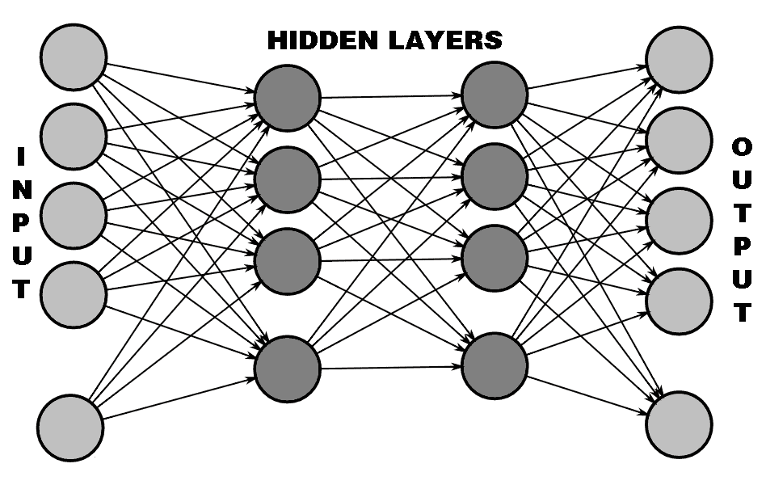
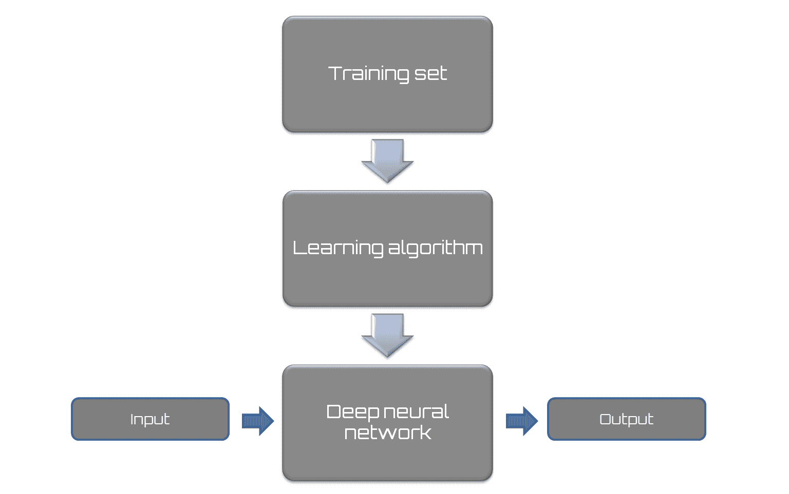
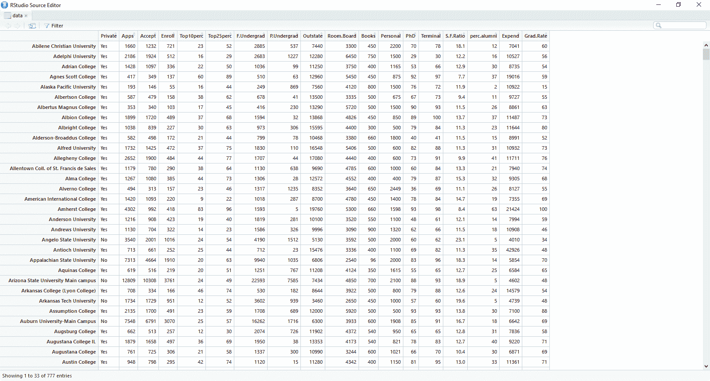
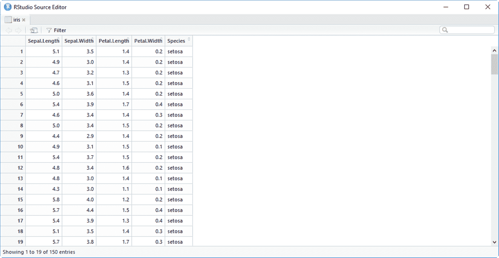
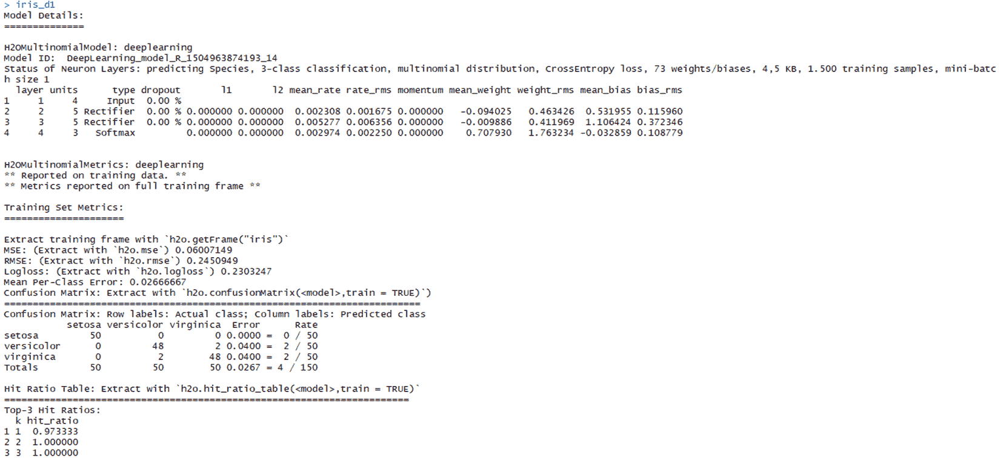
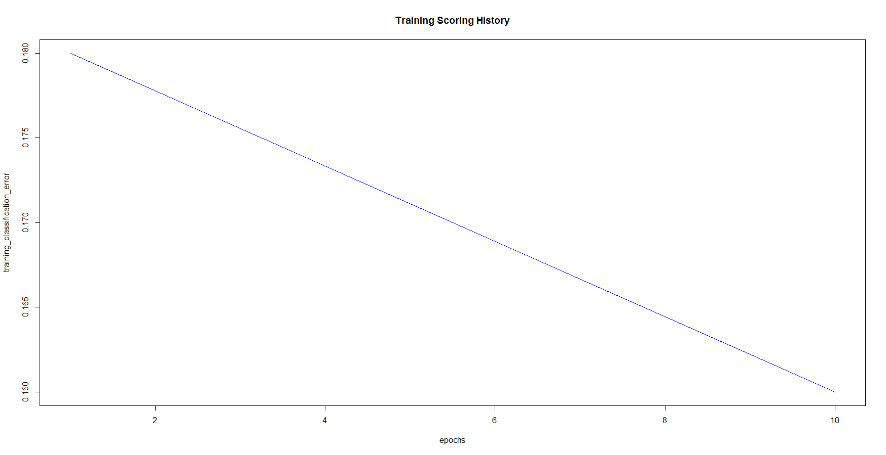
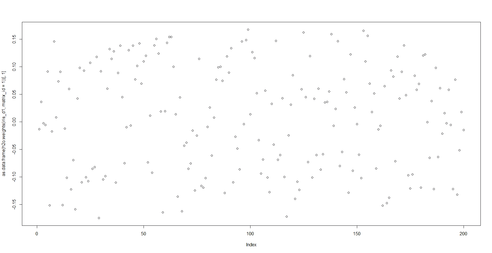
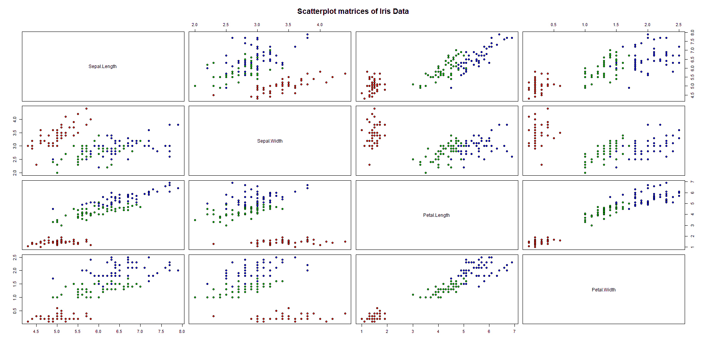

# 三、使用多层神经网络的深度学习

深度学习是最近机器学习/AI 的热门趋势。这一切都是为了建立先进的神经网络。通过使多个隐藏层在神经网络模型中工作，我们可以处理复杂的非线性数据表示。我们使用基础神经网络创建深度学习。深度学习在现实生活中有无数的用例，例如，无人驾驶汽车、医疗诊断、计算机视觉、语音识别、**自然语言处理** ( **NLP** )、手写识别、语言翻译等许多领域。

在这一章中，我们将处理深度学习过程:如何训练、测试和部署一个**深度神经网络** ( **DNN** )。我们将看看 R 中处理 DNNs 的不同包。我们将理解如何用`neuralnet`包建造和训练 DNN。最后，我们将分析一个使用 h2o(可扩展的开放内存学习平台)对 DNN 进行训练和建模的示例，以使用大型数据集创建模型，并使用高精度方法实现预测。

以下是本章涵盖的主题:

*   dnn 的类型
*   深度学习的 r 包
*   用`neuralnet`对 DNN 进行训练和建模
*   `h2o`图书馆

到本章结束时，我们将了解深度学习的基本概念，以及如何在 R 环境中实现它。我们将发现不同类型的 dnn。我们将学习如何训练、测试和部署模型。我们将知道如何使用`h2o`训练和模拟 DNN。


# DNNs 简介

随着大数据处理基础设施、GPU 和 GP-GPU 的出现，我们现在能够使用各种激活函数和 L1/L2 正则化技术来克服浅层神经网络的挑战，即过度拟合和消失梯度。深度学习可以轻松高效地处理大量已标记和未标记的数据。

如前所述，深度学习是一种机器学习，其中学习发生在多层神经元网络上。描述 DNN 的标准图表如下图所示:



从上图的分析中，我们可以注意到与我们迄今为止所研究的神经网络有一个显著的相似之处。我们可以安静下来，不像它看起来那样，深度学习只是神经网络的一种扩展。在这方面，我们在前几章看到的大部分都是正确的。简而言之，DNN 是包含两个或更多隐藏层的多层神经网络。这里没什么复杂的。通过增加更多的层和每层更多的神经元，我们增加了模型训练数据的专门化，但降低了测试数据的性能。

正如我们所料，DNN 是安的衍生物。通过使隐藏层的数量多于一个，我们构建了 DNNs。DNNs 有许多变体，如下图所示的不同术语所示:

*   **深度信念网络** ( **DBN** ):这是一个典型的前馈网络，数据从一层流向另一层，没有环回。至少有一个隐藏层，并且可以有多个隐藏层，增加了复杂性。
*   **受限玻尔兹曼机** ( **RBM** ):它只有一个隐藏层，一个组中的节点之间没有任何联系。这是一个简单的神经网络 MLP 模型。
*   **循环神经网络** ( **RNN** )和**长短期记忆** ( **LSTM** ):这些网络的数据在组内和组间任意方向流动。

与任何机器学习算法一样，即使是 dnn 也需要构建、训练和评估过程。下图显示了深度学习的基本工作流程:



我们在前面的图中看到的工作流非常接近典型的监督学习算法。但是它和其他机器学习算法有什么不同呢？

几乎所有的机器学习算法都证明了它们在识别原始输入数据的特征方面的局限性，特别是当它们复杂并且缺乏明显的顺序时，例如在图像中。通常，在人类的帮助下，这个极限被超越，人类关心的是识别机器不能做什么。深度学习去掉了这一步，依靠训练过程，通过输入的例子找到最有用的模型。在这种情况下，为了在开始训练之前做出选择，人工干预也是必要的，但是自动发现特征使生活变得容易得多。与机器学习提供的其他解决方案相比，使神经网络特别有优势的是该模型的强大泛化能力。

这些特性使得深度学习对于几乎所有需要自动学习的任务都非常有效；尽管它在复杂分层数据的情况下特别有效。其潜在的人工神经网络形成高度非线性的表示；这些通常由多层以及非线性转换和定制架构组成。

从本质上讲，深度学习在处理来自现实世界的杂乱数据时非常有效，使其成为未来几年几个技术领域的关键工具。直到最近，它还是一个黑暗和令人生畏的领域，但它的成功带来了许多伟大的资源和项目，使它比以往任何时候都更容易开始。

现在我们知道了 dnn 是什么，让我们看看 R 开发环境为我们提供了什么工具来处理这个特殊的主题。


# r 代表 DNNs

在上一节中，我们阐明了深度学习基础的一些关键概念。我们还了解了使深度学习的使用特别方便的功能。此外，它的快速传播也是由于各种编程语言的大量框架和库的可用性。

R 编程语言被科学家和程序员广泛使用，因为它非常容易使用。此外，还有大量的库，允许使用最流行的算法进行专业的数据可视化和分析。深度学习算法的快速传播导致了可用于深度学习的包的数量不断增加，甚至在 r。

下表显示了可用于使用 R 进行深度学习的各种包/接口:

| **起重机包** | **支持神经网络分类** | **底层语言/** **厂商** |
| `MXNet` | 前馈，CNN | C/C++/CUDA |
| `darch` | DBN RBM | C/C++ |
| `deepnet` | 前馈，RBM，DBN，自编码器 | 稀有 |
| `h2o` | 前馈网络、自编码器 | Java 语言(一种计算机语言，尤用于创建网站) |
| `nnet`和`neuralnet` | 前馈 | 稀有 |
| `Keras` | dnn 的种类 | Python/keras.io |
| `TensorFlow` | dnn 的种类 | C++，Python/Google |

`MXNet`是一个现代化的、可移植的、深度学习的库，可以支持多台机器。世界上最大的公司和大学都采用了`MXNet`作为机器学习框架。其中包括亚马逊、英特尔、Data、百度、微软、Wolfram Research、卡内基梅隆、麻省理工、华盛顿大学、香港科技大学等。
`MXNet`是一个允许快速建模的开源框架，支持多种编程语言(C ++、Python、Julia、MATLAB、JavaScript、Go、R、Scala、Perl、Wolfram 语言)的灵活编程模型。
`MXNet`框架支持 R 编程语言。`MXNet` R 包提供了灵活高效的 GPU 计算和最先进的 R 深化。它允许我们在 R 中使用多个 GPU 编写无缝的张量/矩阵计算。它还允许我们在 R 中构建和定制最先进的深度学习模型，并将其应用于图像分类和数据科学挑战等活动。

`darch`框架基于 G. E. Hinton 和 R. R. Salakhutdinov 编写的代码，可在 DBN 的 MATLAB 环境中获得。该软件包可以生成具有许多级别(深度架构)的神经网络，并使用作者开发的创新方法形成它们。该方法提供了 G. Hinton (2002)发表的对比发散方法的预成形，以及称为反向传播或共轭梯度的普通训练算法的微调。此外，微调监督可以通过 maxout 和 dropout 来改善，这是最近开发的两种改善深度学习微调的技术。

`deepnet`库是一个相对较小但非常强大的包，有多种架构可供选择。这个库实现了一些深度学习架构和神经网络算法，包括反向传播、RBM、DBN、深度自编码器等等。与我们分析的其他库不同，它是专门为 r 编写的。

`nn.train`:用于 BP 训练单个或多个隐层神经网络

*   `nn.predict`:通过训练好的神经网络预测新样本
*   `dbn.dnn.train`:用 DBN 初始化的权重训练 DNN
*   `rbm.train`:用于训练 RBM
*   `h2o` R 包具有用于构建一般线性回归、K 均值、朴素贝叶斯、**主成分分析** ( **PCA** )、森林和深度学习(多层`neuralnet`模型)的功能。`h2o`是 CRAN 的外部包，使用 Java 构建，可用于各种平台。它是一个用于大数据的开源数学引擎，计算并行分布式机器学习算法。

软件包`nnet`和`neuralnet`已经在前面的章节中广泛讨论过了。这是 r 中用于管理神经网络的两个包，它们也能够构建和训练多核神经网络，因此它们依赖于深度学习。

`Keras`是用 Python 写的开源神经网络库。它旨在支持 DNNs 的快速实验，侧重于最小化、模块化和可扩展。该库包含常用神经网络构建块的许多实现，如层、目标、激活函数、优化器和许多工具，以使处理图像和文本数据更容易。代码托管在 GitHub 上，社区支持论坛包括 GitHub 问题页面、Gitter 频道和 Slack 频道。

`TensorFlow`是一个机器学习的开源软件库。它包含一个用于建立和训练神经网络的系统，以检测和破译模式和相关性，其方法类似于人类学习所采用的方法。它既用于搜索，也用于谷歌产品。

具有神经网络的多层神经网络


# 了解了深度学习的基础知识之后，就该把学到的技能运用到实际案例中了。在上一节中我们已经看到，我们知道的两个库在 *R for DNNs* 一节中列出。我指的是我们在前面章节中通过实际例子学会使用的`nnet`和`neuralnet`包。既然我们已经对`neuralnet`库进行了一些实践，我认为我们应该从这里开始对深度学习的神奇世界进行实践探索。

首先，我们介绍将用于构建和训练网络的数据集。它被命名为`College`数据集，它包含了大量美国大学的统计数据，这些数据是从 1995 年的*美国新闻与世界报道*中收集的。这个数据集取自卡内基梅隆大学的图书馆，并被用于统计图形的 ASA 部分。

对我们来说，事情进一步简化了，因为我们不必检索数据，然后将其导入 R，因为这些数据包含在 R 包中。我指的是`ISLR`套餐。我们只需要安装软件包并加载相关的库。但我们会看到这一点，当我们详细解释抄本。现在我们只看数据集`College`的内容。这是一个对以下`18`变量进行`777`观察的数据框架:

`Private`:具有级别`No`和`Yes`的因子，表示私立或公立大学

*   `Apps`:收到的申请数量
*   `Accept`:受理的申请数量
*   `Enroll`:新生入学人数
*   `Top10perc`:高中班级前 10%新生的百分比
*   `Top25perc`:高中班级前 25%新生的百分比
*   `F.Undergrad`:全日制本科生人数
*   `P.Undergrad`:非全日制本科生人数
*   `Outstate`:州外学费
*   `Room.Board`:食宿费用
*   `Books`:预计账面成本
*   `Personal`:预计个人支出
*   拥有博士学位的教师比例
*   `Terminal`:拥有终端学位的教师比例
*   学生与教师的比例
*   `perc.alumni`:捐赠校友百分比
*   `Expend`:每个学生的教学支出
*   `Grad.Rate`:毕业率
*   我们的目标是建立一个多层神经网络，能够根据其他`17`变量的值预测学校是公立还是私立:

像往常一样，我们将逐行分析代码，详细解释用于捕获结果的所有特性。

```r
###########################################################################
#############Chapter 3 - Deep Learning with neuralnet###################### ###########################################################################
library("neuralnet")
library(ISLR)

data = College
View(data)

max_data <- apply(data[,2:18], 2, max) 
min_data <- apply(data[,2:18], 2, min)
data_scaled <- scale(data[,2:18],center = min_data, scale = max_data - min_data) 

Private = as.numeric(College$Private)-1
data_scaled = cbind(Private,data_scaled)

index = sample(1:nrow(data),round(0.70*nrow(data)))
train_data <- as.data.frame(data_scaled[index,])
test_data <- as.data.frame(data_scaled[-index,])

n = names(train_data)
f <- as.formula(paste("Private ~", paste(n[!n %in% "Private"], collapse = " + ")))
deep_net = neuralnet(f,data=train_data,hidden=c(5,3),linear.output=F)
plot(deep_net)

predicted_data <- compute(deep_net,test_data[,2:18])
print(head(predicted_data$net.result))
predicted_data$net.result <- sapply(predicted_data$net.result,round,digits=0)

table(test_data$Private,predicted_data$net.result)
```

通常，初始代码的前两行用于加载运行分析所需的库。

```r
library("neuralnet")
library(ISLR)
```

记住，要安装 R 的初始发行版中没有的库，必须使用`install.package`函数。这是安装包的主要功能。它接受一个名称向量和一个目的库，从存储库中下载包并安装它们。这个函数应该只使用一次，而不是每次运行代码时都使用。

该命令加载了`College`数据集，正如我们所预料的，它包含在`ISLR`库中，并将它保存在给定的数据帧中。使用`View`功能查看任意 R 对象结构的紧凑显示。下图显示了包含在`College`数据集中的一些数据:

```r
data = College
View(data)
```

怎么可能注意到为每个学院都列出了一系列的统计数字；行代表列上的观察结果，而不是呈现检测到的特征:



在这段代码中，我们需要规范化数据。

```r
max_data <- apply(data[,2:18], 2, max) 
min_data <- apply(data[,2:18], 2, min)
data_scaled <- scale(data[,2:18],center = min_data, scale = max_data - min_data) 
```

请记住，在训练神经网络之前对数据进行规范化是一种很好的做法。通过规范化，消除了数据单元，使您可以轻松地比较不同位置的数据。

对于本例，我们将使用**最小-最大方法**(通常称为特征**缩放**)来获取范围*【0，1】*内的所有缩放数据。在应用为规范化选择的方法之前，必须计算每个数据库列的最小值和最大值。这个过程已经在我们在第 2 章、*中分析的例子中被采用。*

最后一行通过采用预期的规范化规则来缩放数据。注意，我们只对最后的 *17* 行(从 *2* 到 *18* )执行了规范化，不包括第一列`Private`，它包含一个具有级别`No`和`Yes`的因子，表示私立或公立大学。这个变量将是我们即将构建的网络中的目标。为了证实我们所说的，检查数据集中包含的变量的类型。为此，我们将使用函数`str`来查看一个紧凑地显示任意 R 对象的结构:

正如预期的那样，第一个变量是`Factor`类型的，有两个`levels` : `No`和`Yes`。对于剩余的`17`变量，它们是数字类型的。如[第一章](b283a577-2201-43eb-877c-f281677370bf.xhtml)、*神经网络和人工智能概念*所预期的，模型中只能使用数值数据，因为神经网络是一个具有逼近功能的数学模型。所以我们对第一个变量`Private`有问题。不要担心，这个问题很容易解决；把它变成一个数字变量:

```r
> str(data)
'data.frame': 777 obs. of 18 variables:
 $ Private : Factor w/ 2 levels "No","Yes": 2 2 2 2 2 2 2 2 2 2 ...
 $ Apps : num 1660 2186 1428 417 193 ...
 $ Accept : num 1232 1924 1097 349 146 ...
 $ Enroll : num 721 512 336 137 55 158 103 489 227 172 ...
 $ Top10perc : num 23 16 22 60 16 38 17 37 30 21 ...
 $ Top25perc : num 52 29 50 89 44 62 45 68 63 44 ...
 $ F.Undergrad: num 2885 2683 1036 510 249 ...
 $ P.Undergrad: num 537 1227 99 63 869 ...
 $ Outstate : num 7440 12280 11250 12960 7560 ...
 $ Room.Board : num 3300 6450 3750 5450 4120 ...
 $ Books : num 450 750 400 450 800 500 500 450 300 660 ...
 $ Personal : num 2200 1500 1165 875 1500 ...
 $ PhD : num 70 29 53 92 76 67 90 89 79 40 ...
 $ Terminal : num 78 30 66 97 72 73 93 100 84 41 ...
 $ S.F.Ratio : num 18.1 12.2 12.9 7.7 11.9 9.4 11.5 13.7 11.3 11.5 ...
 $ perc.alumni: num 12 16 30 37 2 11 26 37 23 15 ...
 $ Expend : num 7041 10527 8735 19016 10922 ...
 $ Grad.Rate : num 60 56 54 59 15 55 63 73 80 52 ...
```

在这方面，第一行将`Private`变量转换成数字，而第二行代码用于使用该变量和剩余的 *17* 适当规范化的变量重建数据集。为此，我们使用`cbind`函数，它接受一系列向量、矩阵或数据帧参数，并分别按列或行进行组合:

```r
Private = as.numeric(College$Private)-1
data_scaled = cbind(Private,data_scaled)
```

现在是时候为网络的训练和测试拆分数据了。在刚刚建议的代码的第一行中，数据集被分成了 *70:30* ，目的是使用我们所掌握的 *70* 的数据来训练网络，剩余的 *30* 的数据来测试网络。在第三行中，名为 data 的数据帧的数据被细分成两个新的数据帧，称为`train_data`和`test_data`:

```r
index = sample(1:nrow(data),round(0.70*nrow(data)))
train_data <- as.data.frame(data_scaled[index,])
test_data <- as.data.frame(data_scaled[-index,])
```

在这段代码中，我们首先使用`names`函数恢复所有的变量名。这个函数获取或设置一个对象的名字。接下来，我们构建将用于构建网络的公式，因此我们使用`neuralnet`函数来构建和训练网络。到目前为止，一切都只是用来准备数据。现在是时候建立网络了:

```r
n = names(train_data)
f <- as.formula(paste("Private ~", paste(n[!n %in% "Private"], collapse = " + ")))
```

这是代码的关键一行。在这里，网络被建立和训练；下面具体分析一下。我们已经预料到我们会使用`neuralnet`图书馆来建造我们的 DNN。但是，相对于我们已经建立了单个隐藏层网络的情况，发生了什么变化呢？一切都在`hidden`参数设置中播放。

```r
deep_net = neuralnet(f,data=train_data,hidden=c(5,3),linear.output=F)
```

记住,`hidden`参数必须包含一个整数向量，指定每层中隐藏神经元(顶点)的数量。

在我们的例子中，我们将隐藏层设置为包含向量 *(5，3)* ，这对应于两个隐藏层，第一个隐藏层中分别有五个神经元，第二个隐藏层中有三个神经元。

上一行只是绘制了网络图，如下图所示:

```r
plot(deep_net)
```

如我们所见，网络已经建立并经过训练，我们只需验证它的预测能力:


为了预测为测试保留的数据，我们可以使用`compute`方法。这是一个用于类`nn`的对象的方法，通常由`neuralnet`函数产生。给定一个训练好的神经网络，针对特定的任意协变向量计算所有神经元的输出。确保新矩阵或数据框架中协变量的顺序与原始神经网络中的顺序相同至关重要。随后，为了形象化，预测结果的第一行使用了`print`函数，如下所示:

```r
predicted_data <- compute(deep_net,test_data[,2:18])
print(head(predicted_data$net.result))
```

可以看出，预测结果是以十进制数的形式提供的，它接近两个预期类(1 和 0)的值，但并不完全假定这些值。我们需要精确地假设这些值，这样我们就可以与当前值进行比较。为此，我们将使用`sapply()`函数将它们四舍五入为零或一个类，这样我们就可以根据测试标签对它们进行评估:

```r
> print(head(predicted_data$net.result))
 [,1]
Abilene Christian University 0.1917109322
Adelphi University           1.0000000000
Adrian College               1.0000000000
Agnes Scott College          1.0000000000
Albertus Magnus College      1.0000000000
Albion College               1.0000000000
```

正如预期的那样，`sapply()`函数对两个可用类的预测结果进行了舍入。现在我们有了进行比较以评估 DNN 作为预测工具所需的一切:

```r
predicted_data$net.result <- sapply(predicted_data$net.result,round,digits=0)
```

为了进行比较，我们依赖于混淆矩阵。要构建它，只需使用`table`功能。实际上，`table`函数使用交叉分类因子来构建每个因子级别组合的列联表。

```r
table(test_data$Private,predicted_data$net.result)
```

混淆矩阵是一种特定的表格布局，允许算法性能的可视化。每行代表实际类中的实例，而每列代表预测类中的实例。混淆矩阵这个术语来源于这样一个事实，即它可以很容易地看出系统是否混淆了两个类别。

让我们看看所得到的结果:

让我们了解结果。让我们首先记住，在混淆矩阵中，主对角线上的项代表正确预测的数量，即与实际类的实例相一致的预测类的实例的数量。似乎在我们的模拟中，事情进行得很顺利。事实上，我们得到了`0` ( `No`)类的`49`和`1` ( `Yes`)类的`167`。但是现在让我们分析另外两个术语，它们代表了模型所犯的错误。

```r
> table(test_data$Private,predicted_data$net.result)

 0   1
 0 49   8
 1  9 167
```

如[第二章](9318274a-72ac-4475-a140-7aaf92253400.xhtml)、*所定义，神经网络中的学习过程*、`8`为 FN、`9`为 FP。在这方面，我们记得 FN 表示在实际数据中为正的负预测的数量，而 FPs 是在实际数据中为负的正预测的数量。我们可以再次使用`table`功能对此进行检查:

这些代表实际结果，特别是属于类别`0`的`57`结果和属于类别`1`的`176`结果。通过对混淆矩阵的行中包含的数据求和，我们确切地得到事实结果中的那些值:

```r
> table(test_data$Private)
 0   1 
 57 176
```

现在我们再次使用`table`函数来获得预测数据中的出现次数:

```r
> 49 + 8
[1] 57
> 9 + 167
[1] 176
```

这些表示预测的结果，特别是属于类别`0`和类别`175`到类别`1`的`58`结果。通过对包含在混淆矩阵的列中的数据求和，我们确切地得到事实结果中的那些值:

```r
> table(predicted_data$net.result)
 0   1 
 58 175
```

此时，我们通过使用混淆矩阵中包含的数据来计算模拟的精度。请记住，精度由以下等式定义:

```r
> 49 + 9
[1] 58
> 8 + 167
[1] 175
```

At this point, we calculate the accuracy of the simulation by using the data contained in the confusion matrix. Let's remember that accuracy is defined by the following equation:


这里:

*TP =真阳性*

*TN =真阴性*

*FP =假阳性*

*FN =真负值*

让我们看看下面的代码示例:

我们获得了大约 93%的准确率，证实了我们的模型能够以良好的结果预测数据。

```r
> Acc = (49 + 167) / (49 + 167 + 9 + 8) 
> Acc
[1] 0.9270386266
```

使用 H2O 对 DNN 进行训练和建模


# 在这一节中，我们将介绍一个使用`h2o`训练和建模 DNN 的例子。`h2o`是一个开源、内存、可扩展的机器学习和人工智能平台，用于利用大型数据集建立模型，并利用高精度方法实现预测。`h2o`库在众多组织中被大规模采用，以实现数据科学并提供构建数据产品的平台。`h2o`可以运行在个人笔记本电脑或大型集群的高性能可扩展服务器上。它工作非常快，利用了机器架构的进步和 GPU 处理。它具有深度学习、神经网络和其他机器学习算法的高精度实现。

如前所述，`h2o` R 包具有构建一般线性回归、K 均值、朴素贝叶斯、PCA、森林和深度学习(多层`neuralnet`模型)的功能。`h2o`包是 CRAN 的外部包，使用 Java 构建。它适用于各种平台。

我们将使用以下代码在 R 中安装`h2o`:

我们得到了以下结果:

```r
install.packages("h2o")
```

为了测试这个包，让我们来看一下下面的例子，这个例子使用了名为`Irisdataset`的流行数据集。我指的是 Iris flower 数据集，这是一个多元数据集，由英国统计学家和生物学家罗纳德·费雪在他 1936 年的论文*分类问题中多重测量的使用*中介绍，作为线性判别分析的一个例子。

```r
> install.packages("h2o")
Installing package into ‘C:/Users/Giuseppe/Documents/R/win-library/3.4’
(as ‘lib’ is unspecified)
trying URL 'https://cran.rstudio.com/bin/windows/contrib/3.4/h2o_3.10.5.3.zip'
Content type 'application/zip' length 73400625 bytes (70.0 MB)
downloaded 70.0 MB
package ‘h2o’ successfully unpacked and MD5 sums checked
The downloaded binary packages are in
 C:\Users\Giuseppe\AppData\Local\Temp\RtmpGEc5iI\downloaded_packages
```

数据集包含来自三种鸢尾(鸢尾`setosa`、鸢尾`virginica`和鸢尾`versicolor`)的每一种的 *50 个*样本。测量每个样品的四个特征:萼片和花瓣的长度和宽度，以厘米为单位。

包含以下变量:

`Sepal.Length`以厘米计

*   `Sepal.Width`厘米为单位
*   `Petal.Length`厘米为单位
*   `Petal.Width`厘米为单位
*   类别:`setosa`、`versicolour`、`virginica`
*   下图简洁地显示了`iris`数据集的结构:

我们希望建立一个分类器，根据萼片和花瓣的大小，能够对花卉种类进行分类:



现在，让我们通过代码来理解如何应用`h2o`包来解决一个模式识别问题。

```r
##########################################################################
#################Chapter 3 - Deep Learning with H2O and R################# ##########################################################################

library(h2o)

c1=h2o.init(max_mem_size = "2G", 
 nthreads = 2, 
 ip = "localhost", 
 port = 54321)

data(iris)
summary(iris)

iris_d1 <- h2o.deeplearning(1:4,5,
 as.h2o(iris),hidden=c(5,5),
 export_weights_and_biases=T)
iris_d1
plot(iris_d1)

h2o.weights(iris_d1, matrix_id=1)
h2o.weights(iris_d1, matrix_id=2)
h2o.weights(iris_d1, matrix_id=3)
h2o.biases(iris_d1, vector_id=1)
h2o.biases(iris_d1, vector_id=2)
h2o.biases(iris_d1, vector_id=3)

#plot weights connecting `Sepal.Length` to first hidden neurons
plot(as.data.frame(h2o.weights(iris_d1, matrix_id=1))[,1])

##########################################################################
```

在继续之前，有必要指定在 R 上运行`h2o`需要 Java 8 运行时。事先验证你机器上安装的 Java 版本，最后从[https://www.java.com/en/download/win10.jsp](https://www.java.com/en/download/win10.jsp)下载 Java 版本 8。

下图显示了 Oracle 网站上的 Java 下载页面:

再者，`h2o`包是用一些需要的包构建的；所以为了正确安装`h2o`包，记得安装下面的依赖项，它们都可以在 CRAN 中找到:


`RCurl`

*   `bitops`
*   `rjson`
*   `jsonlite`
*   `statmod`
*   `tools`
*   在我们成功安装了`h2o`包之后，我们可以继续加载库了:

这个命令在 R 环境中加载库。将返回以下消息:

```r
library(h2o)
```

我们按照 R 提示符上的指示:

```r
Your next step is to start H2O:
 > h2o.init()
For H2O package documentation, ask for help:
 > ??h2o
After starting H2O, you can use the Web UI at http://localhost:54321
For more information visit http://docs.h2o.ai
c1=h2o.init(max_mem_size = "2G", 
 nthreads = 2, 
 ip = "localhost", 
 port = 54321)
```

`h20.init`函数启动`h2o`引擎，最大内存大小为 2 GB，有两个并行内核。`h2o`的控制台已初始化，一旦运行此脚本，我们会收到以下消息:

```r
c1=h2o.init(max_mem_size = "2G", 
 nthreads = 2, 
 ip = "localhost", 
 port = 54321)
```

一旦`h2o`启动，就可以通过指向`localhost:54321`从任何浏览器查看控制台。`h2o`库在 JVM 上运行，控制台允许:

```r
> c1=h2o.init(max_mem_size = "2G", nthreads = 2)
H2O is not running yet, starting it now...

Note: In case of errors look at the following log files:
 C:\Users\Giuseppe\AppData\Local\Temp\RtmpU3xPvT/h2o_Giuseppe_started_from_r.out
 C:\Users\Giuseppe\AppData\Local\Temp\RtmpU3xPvT/h2o_Giuseppe_started_from_r.err

java version "1.8.0_144"
Java(TM) SE Runtime Environment (build 1.8.0_144-b01)
Java HotSpot(TM) 64-Bit Server VM (build 25.144-b01, mixed mode)

Starting H2O JVM and connecting: . Connection successful!

R is connected to the H2O cluster: 
 H2O cluster uptime: 6 seconds 912 milliseconds 
 H2O cluster version: 3.10.5.3 
 H2O cluster version age: 2 months and 9 days 
 H2O cluster name: H2O_started_from_R_Giuseppe_woc815 
 H2O cluster total nodes: 1 
 H2O cluster total memory: 1.78 GB 
 H2O cluster total cores: 4 
 H2O cluster allowed cores: 2 
 H2O cluster healthy: TRUE 
 H2O Connection ip: localhost 
 H2O Connection port: 54321 
 H2O Connection proxy: NA 
 H2O Internal Security: FALSE 
 R Version: R version 3.4.1 (2017-06-30)
```

控制台很直观，并提供了与 h [2] o 发动机交互的界面。我们可以训练和测试模型，并在此基础上进行预测。标记为 CS 的第一个文本框允许我们输入要执行的例程。`assist`命令给出了可用程序的列表。让我们继续分析下面的示例代码。


第一个命令加载包含在数据集库中的`iris`数据集，并将其保存在给定的数据帧中。然后，我们使用`summary`函数来生成数据集结果的结果摘要。该函数调用依赖于第一个参数的类的特定方法。结果如下所示:

```r
data(iris)
summary(iris)
```

让我们分析下几行代码:

```r
> summary(iris)
 Sepal.Length    Sepal.Width     Petal.Length    Petal.Width 
 Min.   :4.300   Min.   :2.000   Min.   :1.000   Min.   :0.100 
 1st Qu.:5.100   1st Qu.:2.800   1st Qu.:1.600   1st Qu.:0.300
 Median :5.800   Median :3.000   Median :4.350   Median :1.300 
 Mean   :5.843   Mean   :3.057   Mean   :3.758   Mean   :1.199 
 3rd Qu.:6.400   3rd Qu.:3.300   3rd Qu.:5.100   3rd Qu.:1.800 
 Max.   :7.900   Max.   :4.400   Max.   :6.900   Max.   :2.500      Species
setosa    :50 
versicolor:50 
virginica :50 
```

`h2o.deeplearning`功能是`h2o`中的一个重要功能，可用于多种操作。该功能使用 CPU 建立一个 DNN 模型，在一个`H2OFrame`上建立一个前馈多层 ANN。`hidden`参数用于设置隐藏层数和每个隐藏层的神经元数量。在我们的例子中，我们建立了一个有两个隐藏层的 DNN 和每个隐藏层的`5`神经元。最后，参数`export_weights_and_biases`告诉我们，权重和偏差可以存储在`H2OFrame`中，并且可以像其他数据帧一样被访问，以便进一步处理。

```r
iris_d1 <- h2o.deeplearning(1:4,5,
 as.h2o(iris),hidden=c(5,5),
 export_weights_and_biases=T)
```

在进行代码分析之前，应该先澄清一下。细心的读者可以问，基于哪种评估，我们选择了隐藏层的数量和每个隐藏层的神经元的数量。不幸的是，没有精确的规则，甚至没有一个数学公式可以让我们确定哪些数字适合那个特定的问题。这是因为每个问题互不相同，每个网络对系统的近似程度也不同。那么是什么让一个模型和另一个模型有所不同呢？答案是显而易见的，也是非常清楚的:研究者的经验。

我能给出的建议，源于在数据分析方面的大量经验，是尝试，尝试，再尝试。实验活动的秘密就在于此。在神经网络的情况下，这导致尝试建立不同的网络，然后验证它们的性能。例如，在我们的例子中，我们可以从一个具有两个隐藏层和每个隐藏层有 *100* 个神经元的网络开始，然后逐步减少这些值，然后达到我在示例中提出的值。这个过程可以通过使用 R 拥有的迭代结构来自动化。

然而，有些事情可以说，例如，对于神经元数量的最优选择，我们需要知道:

少量的神经元会导致系统的高误差，因为对于少量的神经元来说，预测因素可能太复杂而难以捕捉

*   大量的神经元会过度适应你的训练数据，不能很好地概括
*   每个隐藏层中的神经元数量应该介于输入层和输出层的大小之间，可能是平均值
*   每个隐藏层中的神经元数量不应该超过输入神经元数量的两倍，因为在这一点上你可能会严重超载
*   也就是说，我们回到代码:

在 R 提示符下，该命令打印我们刚刚创建的模型的特征的简要描述，如下图所示:

```r
iris_d1
```

通过仔细分析前面的图，我们可以清楚地区分模型的细节以及混淆矩阵。现在让我们看看培训过程是如何进行的:

****

`plot`方法根据 h2o 模型的类型进行调度，以选择正确的评分历史。参数仅限于特定类型模型的评分历史记录中可用的内容，如下图所示:

```r
plot(iris_d1)
```

在该图中显示了训练分类误差与时期的关系，正如我们可以看到的，随着我们在时期中的进展，梯度下降并且误差减小。数据集应该迭代(流式传输)的次数可以是小数。默认为`10`:



代码的最后六行简单地打印了三种鸢尾花的权重和偏差的简短摘要，如下所示:

```r
h2o.weights(iris_d1, matrix_id=1)

h2o.weights(iris_d1, matrix_id=2)

h2o.weights(iris_d1, matrix_id=3)

h2o.biases(iris_d1, vector_id=1)

h2o.biases(iris_d1, vector_id=2)

h2o.biases(iris_d1, vector_id=3)
```

由于空间原因，我们只看到了`setosa`物种的重量和偏差。在下面的代码中，我们再次使用了 plot 函数:

```r
> h2o.weights(iris_d1, matrix_id=1) 
 Sepal.Length Sepal.Width Petal.Length  Petal.Width
1 -0.013207575 -0.06818321  -0.02756812  0.092810206
2  0.036195096  0.02568028   0.05634377  0.035429616
3 -0.002411760 -0.11541270   0.08219513  0.001957144
4  0.091338813 -0.03271343  -0.25603485 -0.205898494
6 -0.151234403  0.01785624  -0.11815275 -0.110585481 
[200 rows x 4 columns] 

> h2o.biases(iris_d1, vector_id=1) 
C11 0.48224932 0.47699773 0.48994124 0.49552965 0.48991496 0.4739439 
[200 rows x 1 column] 
```

该命令绘制第一个隐藏层神经元的权重与萼片长度的关系，如下图所示:

```r
plot(as.data.frame(h2o.weights(iris_d1, matrix_id=1))[,1])
```

现在，让我们花一些时间来分析结果；特别是，我们恢复了之前在模型摘要屏幕中看到的混淆矩阵。要调用混淆矩阵，我们可以使用下面的代码示例中所示的`h2o.confusionMatrix`函数，它从`h2o`对象中检索单个或多个混淆矩阵。



从混淆矩阵的分析中可以看出，该模型仅犯了四个错误就成功地将三个花卉物种正确分类。这些误差只在两个种类中公平分配:`versicolor`和`virginica`。然而，`setosa`物种在所有`50`事件中被正确分类。但是为什么会这样呢？为了理解，我们来看一下起始数据。对于多维数据，最好的方法是绘制数据集中选定变量的散点图矩阵:

```r
> h2o.confusionMatrix(iris_d1)
Confusion Matrix: Row labels: Actual class; Column labels: Predicted class 
 setosa versicolor virginica  Error      Rate
setosa         50          0         0 0.0000 =  0 / 50
versicolor      0         48         2 0.0400 =  2 / 50
virginica       0          2        48 0.0400 =  2 / 50
Totals         50         50        50 0.0267 = 4 / 150
```

结果如下图所示:

```r
> pairs(iris[1:4], main = "Scatterplot matrices of Iris Data", pch = 21, bg = c("red", "green3", "blue")[unclass(iris$Species)])
```

我们来详细分析一下刚刚提出的剧情。变量从左上到右下写在一条对角线上。然后将每个变量相对于彼此绘制。例如，第一列中的第二个框是`Sepal.Length`对`Sepal.Width`的单个散点图，其中`Sepal.Length`为 *X* 轴，`Sepal.Width`为 *Y* 轴。在第二列的第一个图中重复了相同的图。实质上，整个散点图右上角的框是左下角的图的镜像。



从刚才看到的图分析可以看出，`versicolor`和`virginica`物种呈现出重叠的界限。这让我们明白，当它落入那个区域时，模型试图对它进行分类会导致错误。我们可以看到`setosa`物种发生了什么，它与其他花卉物种的边界很远，没有任何分类错误。

也就是说，我们根据花瓣和萼片的大小来评估该模型对花卉物种进行分类的准确性:

结果显示，基于第一个假设的模拟，以百分之 *97* 的准确度对物种进行了排序。我要说这是一个好结果；模型与数据吻合得很好。但是我们如何衡量这个特征呢？找到更好拟合的一种方法是计算决定系数(R 平方)。为了计算`h2o`中的 R 平方，我们可以使用`h2o.r2`方法:

```r
> h2o.hit_ratio_table(iris_d1)
Top-3 Hit Ratios: 
 k hit_ratio
1 1 0.973333
2 2 1.000000
3 3 1.000000
```

现在让我们了解我们已经计算了什么，以及如何读取结果。r 平方衡量模型预测数据的能力，介于 0 和 1 之间。决定系数的值越高，模型对数据的预测越好。
我们得到了一个值 *0.96* ，所以按照我们所说的，这是一个很棒的结果。为了证实这一点，我们必须将其与另一个模拟模型的结果进行比较。因此，我们基于相同的数据，即`iris`数据集，建立一个线性回归模型。

```r
> h2o.r2(iris_d1)
[1] 0.9596034
```

要建立线性回归模型，我们可以使用`glm`函数。此函数用于拟合广义线性模型，通过给出线性预测值的符号描述和误差分布的描述来指定:

现在我们计算模型的决定系数:

```r
m=iris.lm <- h2o.glm(x=2:5,y=1,training_frame=as.h2o(iris))
```

现在我们可以对基于 DNNs 的模型和线性回归模型进行比较。DNN 提供的 R 平方值为 *0.96* ，而由此产生的回归模型提供的 R 平方值为 *0.87* 。很明显，DNN 提供了更好的性能。

```r
> h2o.r2(m)
[1] 0.8667852
```

最后，分析对神经网络专家很重要的参数可能会很有用，如下表所示:

**论证**

| **描述** | `x` |
| 包含用于构建模型的预测变量的名称或索引的向量。如果缺少`x`，则使用除`y`之外的所有列。 | `y` |
| 模型中响应变量的名称。如果数据不包含标题，这是第一个列索引，从左到右递增(响应必须是整数或分类变量)。 | `model_id` |
| 这是模型的目的地`id`;如果未指定，它会自动生成。 | `standardize` |
| 这是一个逻辑函数。如果启用，它会自动标准化数据。如果禁用，用户必须提供适当比例的输入数据。默认为`TRUE`。 | `activation` |
| 这是一个激活功能。必须是`Tanh`、`TanhWithDropout`、`Rectifier`、`RectifierWithDropout`、`Maxout`或`MaxoutWithDropout`中的一个。默认为`Rectifier`。 | `hidden` |
| 此参数指定隐藏层的大小(例如，`[100, 100]`)。默认为`[200, 200]`。 | `epochs` |
| 数据集应该迭代(流式传输)的次数可以是小数。默认为`10`。 | `adaptive_rate` |
| 这是指定自适应学习率的逻辑论证。默认为`TRUE`。 | `rho` |
| 这描述了自适应学习率时间衰减因子(类似于先前的更新)。默认为`0.99`。 | `rate_annealing` |
| 学习率退火由`rate/(1 + rate_annealing * samples`给出。默认为`1e- 06`。 | `rate_decay` |
| 这是层间的学习率衰减因子(*N^(th)层:`rate * rate_decay ^ (n - 1`)。默认为`1`。* | `input_dropout_ratio` |
| 输入层脱落率(可以提高泛化，试试`0.1`或者`0.2`)。默认为`0`。 | `hidden_dropout_ratios` |
| 隐藏层丢失率可以提高泛化能力。为每个隐藏层指定一个值。默认为`0.5`。 | `l1` |
| L1 正则化可以增加稳定性和提高泛化能力，它导致许多权重成为`0`。默认为`0`。 | `l2` |
| L2 正则化可以增加稳定性和提高泛化能力，并且它导致许多权重较小。默认为`0`。 | `initial_weights` |
| 这是用于初始化该模型权重矩阵的`H2OFrame`id 列表。 | `initial_biases` |
| 这是一个`H2OFrame`id 列表，用于初始化该模型的偏差向量。 | `loss` |
| 损失函数必须是`Automatic`、`CrossEntropy`、`Quadratic`、`Huber`、`Absolute`或`Quantile`中的一个。默认为`Automatic`。 | `distribution` |
| 分配函数必须是`AUTO`、`bernoulli`、`multinomial`、`gaussian`、`poisson`、`gamma`、`tweedie`、`laplace`、`quantile`或`huber`中的一个。默认为`AUTO`。 | `score_training_samples` |
| 它是用于评分的训练集样本的数量(全部为 0)。默认为`10000`。 | `score_validation_samples` |
| 它是用于评分的验证集样本的数量(全部为 0)。默认为`0`。 | `classification_stop` |
| 训练数据分类错误分数的停止标准(-1 表示禁用)。默认为`0`。 | `regression_stop` |
| 它是训练数据上回归误差(MSE)的停止标准(`-1`禁用)。默认为`1e-06`。 | `stopping_rounds` |
| 基于`stopping_metric`收敛的提前停止。如果`stopping_metric`的长度`k`的简单移动平均对于`k:=stopping_rounds`计分事件没有改善(0 表示禁用)，则默认为`5`。 | `max_runtime_secs` |
| 这是模型定型所允许的最大运行时间(秒)。使用`0`将其禁用。默认为`0`。 | `diagnostics` |
| 它可以对隐藏层进行诊断。默认为`TRUE`。 | `fast_mode` |
| 它启用快速模式(反向传播中的较小近似)。默认为`TRUE`。 | `replicate_training_data` |
| 它在每个节点上复制整个训练数据集，以便在小数据集上进行更快的训练。默认为`TRUE`。 | `single_node_mode` |
| 它在单个节点上运行，用于微调模型参数。默认为`FALSE`。 | `shuffle_training_data` |
| 它支持训练数据的混排(如果训练数据被复制并且`train_samples_per_iteration`接近`#nodes` `x` `#rows`，或者如果使用`balance_classes`，则推荐使用)。默认为`FALSE`。 | `missing_values_handling` |
| 缺失值的处理必须是`MeanImputation`或`Skip`之一。默认为`MeanImputation`。 | `quiet_mode` |
| 它启用安静模式，减少标准输出的输出。默认为`FALSE`。 | `verbose` |
| 它将得分历史打印到控制台(GBM、DRF 和 XGBoost 的每棵树指标；深度学习的每个时期的度量。默认为`False` | `autoencoder` |
| 逻辑自编码器默认为`FALSE` | `export_weights_and_biases` |
| 是否将神经网络权重和偏差输出到`H2OFrame`。默认为`FALSE`。 | `mini_batch_size` |
| 小批量(越小越合适，而越大可以加快速度和推广得更好)。默认为`1`。 | Mini-batch size (smaller leads to better fit, whereas larger can speed up and generalize better). It defaults to `1`. |

还有其他与 R 有关的函数有`h2o`用于深度学习。下面列出了一些有用的方法:

**功能**

| **描述** | `predict.H2Omodel` |
| 返回一个带有概率和默认预测的`H2OFrame`对象。 | `h2o.deepwater` |
| 使用多个原生 GPU 后端构建深度学习模型。在包含各种数据源的`H2OFrame`上构建 DNN。 | `as.data.frame.H2OFrame` |
| 将`H2OFrame`转换为数据帧。 | `h2o.confusionMatrix` |
| 显示分类模型的混淆矩阵。 | `print.H2OFrame` |
| 印刷品`H2OFrame`。 | `h2o.saveModel` |
| 将`h2o`模型对象保存到磁盘。 | `h2o.importFile` |
| 将文件导入到 h2o 中。 | 使用 H2O 的深度自编码器 |


# 自编码器是神经网络上的无监督学习方法。我们将在[第 7 章](e3bdb377-05bc-40d2-87ed-6085861eca56.xhtml)、*神经网络的用例-高级主题*中看到更多。`h2o`可用于通过深度自编码器检测异常。为了训练这样的模型，使用相同的函数`h2o.deeplearning()`，在参数上有一些变化:

`autoencoder=TRUE`设置`deeplearning`方法使用自编码器技术无监督学习方法。我们只使用训练数据，没有测试集和标签。我们需要深度`autoencoder`而不是前馈网络的事实由`autoencoder`参数指定。

```r
anomaly_model <- h2o.deeplearning(1:4,
 training_frame = as.h2o(iris),
 activation = "Tanh",
 autoencoder = TRUE,
 hidden = c(50,20,50),
 sparse = TRUE,
 l1 = 1e-4,
 epochs = 100)
```

我们可以选择不同层中隐藏单元的数量。如果我们选择一个整数值，我们得到的就叫做**朴素自编码器**。

摘要


# 深度学习是一个重要的课题，从图像检测到语音识别和人工智能相关的活动。市场上有许多用于深度学习的产品和软件包。其中一些是`Keras`、`TensorFlow`、`h2o`，还有很多其他的。

在这一章中，我们学习了深度学习的基础知识，DNNs 的许多变体，最重要的深度学习算法，以及深度学习的基本工作流程。我们研究了 R 中处理 dnn 的不同包。

为了理解如何构建和训练一个 DNN，我们分析了一个使用`neuralnet`包实现 DNN 的实例。我们学习了如何通过各种可用的技术来标准化数据，删除数据单元，从而使您能够轻松地比较来自不同位置的数据。我们看到了如何为网络的训练和测试拆分数据。我们学会了使用`neuralnet`函数来建立和训练一个多层神经网络。因此，我们了解了如何使用经过训练的网络进行预测，并学会了使用混淆矩阵来评估模型性能。

我们看到了 h2o 包的一些基础知识。总的来说，`h2o`包是一个非常用户友好的包，可以用来训练前馈网络或深度自编码器。它支持分布式计算并提供一个 web 接口。通过像 R 中的任何其他包一样包含`h2o`包，我们可以对 DNNs 进行各种建模和处理。封装中的各种功能可以利用 h2o 的能量。

在下一章，我们将了解什么是感知器，以及使用基本感知器可以构建哪些应用。我们将在 R 环境中学习一个简单的感知器实现函数。我们还将学习如何训练和模拟 MLP。我们将发现线性可分分类器。

In the next chapter, we will understand what a perceptron is and what are the applications that can be built using the basic perceptron. We will learn a simple perceptron implementation function in R environment. We will also learn how to train and model a MLP . We will discover the linear separable classifier.