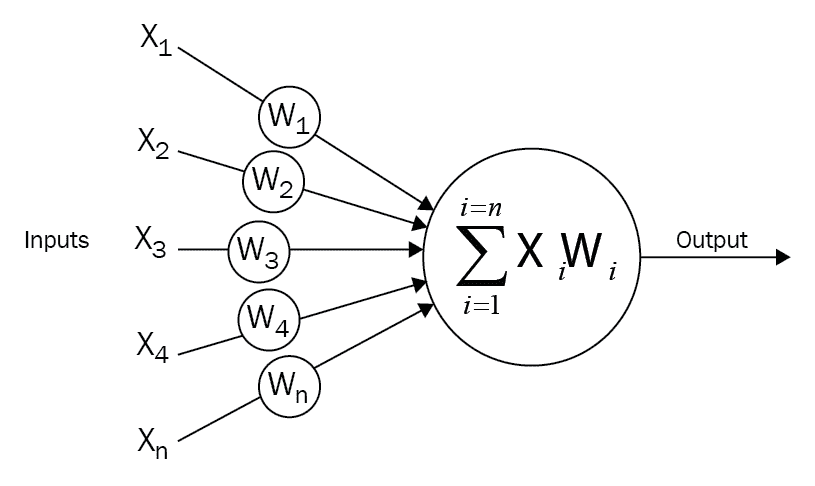
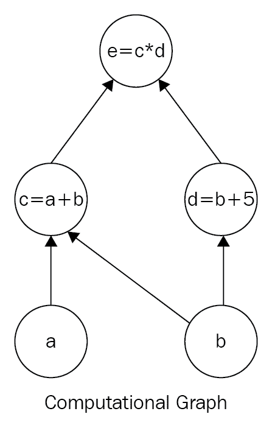
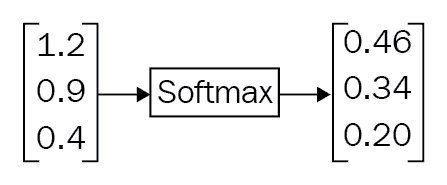
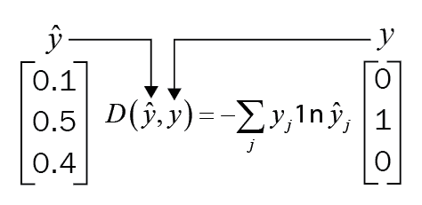
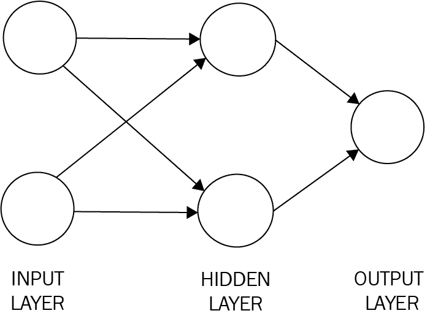
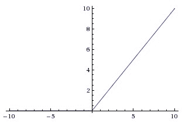
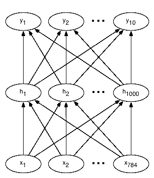
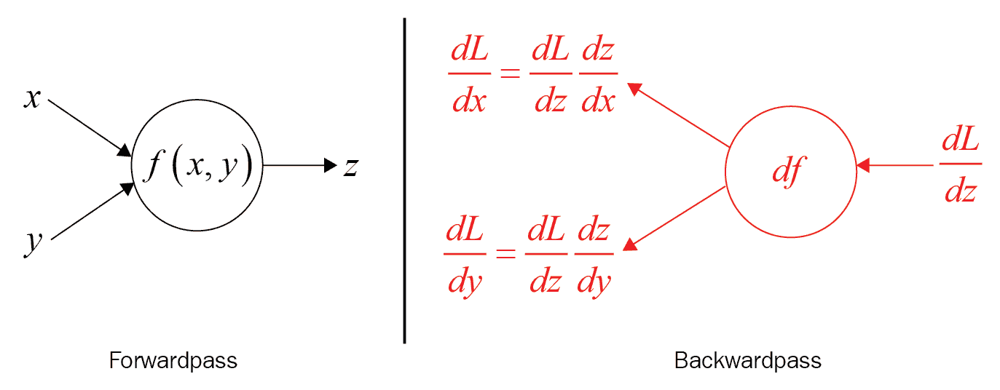

# 深度神经网络–概述

在过去的几年里，我们看到了 AI(深度学习)领域的显著进步。如今，深度学习是许多先进技术应用的基石，从无人驾驶汽车到生成艺术和音乐。科学家们旨在帮助计算机不仅理解语音，而且用自然语言说话。深度学习是一种机器学习方法，它基于学习数据表示，而不是特定于任务的算法。深度学习使计算机能够从更简单和更小的概念中构建复杂的概念。例如，深度学习系统通过组合较低的标签边缘和拐角来识别人的图像，并以分层的方式将它们组合成身体的各个部分。深度学习将扩展到使机器能够独立思考的应用程序的那一天并不遥远。

在本章中，我们将讨论以下主题:

*   神经网络的构建模块
*   张量流简介
*   Keras 简介
*   反向传播


# 神经网络的构建模块

神经网络是由许多人工神经元组成的。是大脑的表征还是某种知识的数学表征？这里，我们将简单地尝试理解神经网络在实践中是如何使用的。一个**卷积神经网络** ( **CNN** )是一种非常特殊的多层神经网络。CNN 旨在通过最少的处理直接从图像中识别视觉模式。下图是该网络的图形表示。神经网络领域最初是由模拟生物神经系统的目标所启发的，但从那时起，它已经分支到不同的方向，并且已经成为工程和在机器学习任务中获得良好结果的问题。

人工神经元是一种接受输入并产生输出的功能。所用神经元的数量取决于手头的任务。它可以低至两个或多达几千个。有许多方法可以将人工神经元连接在一起，从而创建一个 CNN。一种通常使用的拓扑被称为**前馈网络**:



每个神经元接收来自其他神经元的输入。每条输入线对神经元的影响由权重控制。权重可以是正数，也可以是负数。整个神经网络通过理解语言来学习执行识别物体的有用计算。现在，我们可以将这些神经元连接成一个网络，称为前馈网络。这意味着每一层中的神经元将它们的输出前馈到下一层，直到我们获得最终输出。这可以这样写:


前面的前向传播神经元可以如下实现:

```
import numpy as np
import math

class Neuron(object):
    def __init__(self):
        self.weights = np.array([1.0, 2.0])
        self.bias = 0.0
    def forward(self, inputs):
        """ Assuming that inputs and weights are 1-D numpy arrays and the bias is a number """
        a_cell_sum = np.sum(inputs * self.weights) + self.bias
        result = 1.0 / (1.0 + math.exp(-a_cell_sum)) # This is the sigmoid activation function
        return result
neuron = Neuron()
output = neuron.forward(np.array([1,1]))
print(output)
```


# 张量流简介

TensorFlow 基于基于图形的计算。例如，考虑下面的数学表达式:

*c=(a+b)* ， *d = b + 5* ，

*e = c * d*

在 TensorFlow 中，这被表示为计算图形，如下所示。这是非常强大的，因为计算是并行进行的:



# 安装 TensorFlow

安装 TensorFlow 有两种简单的方法:

*   使用虚拟环境(此处推荐和描述)
*   一个码头工人的形象


# 对于 macOS X/Linux 变体

以下代码片段创建了一个 Python 虚拟环境，并在该环境中安装 TensorFlow。在运行这段代码之前，您应该安装 Anaconda:

```
#Creates a virtual environment named "tensorflow_env" assuming that python 3.7 version is already installed.
conda create -n tensorflow_env python=3.7 
#Activate points to the environment named "tensorflow"  
source activate tensorflow_env
conda install pandas matplotlib jupyter notebook scipy scikit-learn
#installs latest tensorflow version into environment tensorflow_env
pip3 install tensorflow 
```

请在 TensorFlow 官方页面[https://www.tensorflow.org/install/](https://www.tensorflow.org/install/)查看最新更新。

尝试在 Python 控制台中运行以下代码来验证您的安装。如果 TensorFlow 已安装并运行，控制台应显示`Hello World!`:

```
import tensorflow as tf

#Creating TensorFlow object 
hello_constant = tf.constant('Hello World!', name = 'hello_constant')
#Creating a session object for execution of the computational graph
with tf.Session() as sess:
    #Implementing the tf.constant operation in the session
    output = sess.run(hello_constant)
    print(output)
```


# 张量流基础

在 TensorFlow 中，数据不是以整数、浮点数、字符串或其他原语的形式存储的。这些值被封装在一个叫做张量的对象中。它由一组原始值组成，形成任意维数的数组。一个张量的维数叫做它的**秩**。在上例中，`hello_constant`是秩为零的常量字符串张量。常数张量的几个例子如下:

```
# A is an int32 tensor with rank = 0
A = tf.constant(123) 
# B is an int32 tensor with dimension of 1 ( rank = 1 ) 
B = tf.constant([123,456,789]) 
# C is an int32 2- dimensional tensor 
C = tf.constant([ [123,456,789], [222,333,444] ])
```

TensorFlow 的核心程序是基于计算图的思想。计算图是由以下两部分组成的有向图:

*   构建计算图
*   运行计算图表

一个计算图在一个**会话**中执行。张量流会话是计算图形的运行时环境。它分配 CPU 或 GPU，并维护 TensorFlow 运行时的状态。下面的代码使用`tf.Session`创建一个名为`sess`的会话实例。然后`sess.run()`函数计算张量并返回存储在`output`变量中的结果。它最终打印为`Hello World!`:

```
with tf.Session() as sess:
    # Run the tf.constant operation in the session
    output = sess.run(hello_constant)
    print(output)
```

使用 TensorBoard，我们可以将图形可视化。要运行 TensorBoard，请使用以下命令:

```
tensorboard --logdir=path/to/log-directory
```

让我们如下创建一段简单的加法代码。创建一个值为`5`的常量整数`x`，给它加上`5`后，设置一个新变量`y`的值，并打印出来:

```
constant_x = tf.constant(5, name='constant_x')
variable_y = tf.Variable(x + 5, name='variable_y')
print (variable_y)
```

不同之处在于`variable_y`没有像在 Python 代码中那样被赋予`x + 5`的当前值。相反，它是一个等式；也就是说，在计算`variable_y`时，取该时间点的`x`值，并加上`5`。在前面的代码中，实际上从不计算`variable_y`的值。这段代码实际上属于典型 TensorFlow 程序的计算图形构建部分。运行后，您将得到类似于`<tensorflow.python.ops.variables.Variable object at 0x7f074bfd9ef0>`的结果，而不是作为`10`的`variable_y`的实际值。为了解决这个问题，我们必须执行计算图的代码部分，如下所示:

```
#initialize all variables
init = tf.global_variables_initializer()
# All variables are now initialized

with tf.Session() as sess:
    sess.run(init)
    print(sess.run(variable_y))
```

下面是一些基本数学函数的执行，比如加法、减法、乘法和张量除法。有关更多数学函数，请参考文档:

对于 TensorFlow 数学函数，请访问[https://www . tensor flow . org/versions/r 0.12/API _ docs/python/math _ ops/basic _ math _ functions](https://www.tensorflow.org/versions/r0.12/api_docs/python/math_ops/basic_math_functions)。


# 张量流基础数学

`tf.add()`函数接受两个数字、两个张量或两者各一个，并将它们的和作为一个张量返回:

```
Addition
x = tf.add(1, 2, name=None) # 3
```

这里有一个减法和乘法的例子:

```
x = tf.subtract(1, 2,name=None) # -1
y = tf.multiply(2, 5,name=None) # 10

```

如果我们想用一个非常数呢？如何向 TensorFlow 提供输入数据集？为此，TensorFlow 提供了一个 API，`tf.placeholder()`，并使用了`feed_dict`。

`placeholder`是一个变量，稍后在`tf.session.run()`函数中数据被分配给该变量。在这个的帮助下，我们的操作可以被创建，我们可以在不需要数据的情况下构建我们的计算图。然后，在`tf.session.run()`中的`feed_dict`参数的帮助下，这些数据通过这些占位符被输入到图表中，以设置`placeholder`张量。在下面的示例中，在会话运行之前，张量`x`被设置为字符串`Hello World`:

```
x = tf.placeholder(tf.string)

with tf.Session() as sess:
    output = sess.run(x, feed_dict={x: 'Hello World'})
```

也可以使用`feed_dict`设置多个张量，如下所示:

```
x = tf.placeholder(tf.string)
y = tf.placeholder(tf.int32, None)
z = tf.placeholder(tf.float32, None)

with tf.Session() as sess:
    output = sess.run(x, feed_dict={x: 'Welcome to CNN', y: 123, z: 123.45}) 
```

占位符还允许借助多维来存储数组。请看下面的例子:

```
import tensorflow as tf

x = tf.placeholder("float", [None, 3])
y = x * 2

with tf.Session() as session:
    input_data = [[1, 2, 3],
                 [4, 5, 6],]
    result = session.run(y, feed_dict={x: input_data})
    print(result)
```

如果传递给`feed_dict`参数的数据与张量类型不匹配，并且不能转换为张量类型，那么就会抛出一个错误`ValueError: invalid literal for...`。

`tf.truncated_normal()`函数从正态分布中返回带有随机值的张量。这主要用于网络中的权重初始化:

```
n_features = 5
n_labels = 2
weights = tf.truncated_normal((n_features, n_labels))
with tf.Session() as sess:
  print(sess.run(weights))
```


# 张量流中的 Softmax

softmax 函数将其输入(称为 **logit** 或 **logit scores** )转换为 0 到 1 之间的值，并对输出进行归一化处理，使其总和为 1。换句话说，softmax 函数将您的逻辑转换为概率。数学上，softmax 函数定义如下:


在 TensorFlow 中，实现了 softmax 函数。它采用逻辑并返回与输入逻辑具有相同类型和形状的 softmax 激活，如下图所示:



以下代码用于实现这一点:

```
logit_data = [2.0, 1.0, 0.1]
logits = tf.placeholder(tf.float32)
softmax = tf.nn.softmax(logits)

with tf.Session() as sess:
    output = sess.run(softmax, feed_dict={logits: logit_data})
    print( output )
```

我们用数学方法表示标签的方式通常被称为**一次性编码**。每个标签由一个向量表示，正确的标签为 1.0，其他标签为 0.0。这对大多数有问题的情况都很有效。然而，当问题有数百万个标签时，一键编码是无效的，因为大多数向量元素是零。我们测量两个概率向量之间的相似性距离，称为**交叉熵**，用 **D** 表示。

交叉熵是不对称的。意思是: *D(S，L)！= D(L，S)*

在机器学习中，我们通常通过数学函数来定义一个模型是坏的意味着什么。这个函数叫做**损失**、**成本**，或者**目标**函数。用于确定模型损失的一个非常常见的函数叫做**交叉熵损失**。这个概念来自信息论(关于这个的更多信息，请参考在[https://colah.github.io/posts/2015-09-Visual-Information/](https://colah.github.io/posts/2015-09-Visual-Information/)的视觉信息论)。直观地说，如果模型对训练数据的分类表现不佳，损失将会很高，否则损失将会很低，如下所示:



交叉熵损失函数

在 TensorFlow 中，我们可以用`tf.reduce_sum()`写一个交叉熵函数；它接受一个数字数组，并将其总和作为张量返回(参见下面的代码块):

```
x = tf.constant([[1,1,1], [1,1,1]])
with tf.Session() as sess:
    print(sess.run(tf.reduce_sum([1,2,3]))) #returns 6 
    print(sess.run(tf.reduce_sum(x,0))) #sum along x axis, prints [2,2,2]
```

但实际上，在计算 softmax 函数时，由于指数运算，中间项可能非常大。所以，除大数在数值上是不稳定的。我们应该使用 TensorFlow 提供的 softmax 和交叉熵损失 API。以下代码片段手动计算交叉熵损失，并使用 TensorFlow API 打印出来:

```
import tensorflow as tf

softmax_data = [0.1,0.5,0.4]
onehot_data = [0.0,1.0,0.0]

softmax = tf.placeholder(tf.float32)
onehot_encoding = tf.placeholder(tf.float32)

cross_entropy = - tf.reduce_sum(tf.multiply(onehot_encoding,tf.log(softmax)))

cross_entropy_loss = tf.nn.softmax_cross_entropy_with_logits(logits=tf.log(softmax), labels=onehot_encoding)

with tf.Session() as session:
    print(session.run(cross_entropy,feed_dict={softmax:softmax_data, onehot_encoding:onehot_data} ))
    print(session.run(cross_entropy_loss,feed_dict={softmax:softmax_data, onehot_encoding:onehot_data} ))

```


# MNIST 数据集简介

这里我们用的是 **MNIST** ( **修改后的国家标准技术研究院**)，由手写数字及其标签的图像组成。自 1999 年发布以来，这个经典数据集被用于分类算法的基准测试。

数据文件`train.csv`和`test.csv`由手绘数字组成，以灰度图像的形式从 0 到 9。数字图像是形式为 *f(x，y)=像素*值的数学函数。这些图像是二维的。

我们可以对图像执行任何数学功能。通过计算图像上的梯度，我们可以测量像素值变化的速度以及变化的方向。对于图像识别，为了简单起见，我们将图像转换为灰度，并有一个颜色通道。**图像的 RGB** 表示由三个颜色通道组成，**红色**、**蓝色**和**绿色**。在 RGB 颜色方案中，图像是三幅图像(红色、蓝色和绿色)的叠加。在灰度配色方案中，颜色并不重要。彩色图像在计算上更难分析，因为它们占用更多的内存空间。强度是图像亮度和暗度的度量，对于识别物体非常有用。在某些应用中，例如在自动驾驶汽车应用中检测车道线，颜色很重要，因为它必须区分黄色车道和白色车道。灰度图像不能提供足够的信息来区分白色和黄色车道线。

任何灰度图像都被计算机解释为一个矩阵，每个图像像素对应一个条目。每个图像的高度和宽度都是 28 x 28 像素，总计 784 像素。每个像素具有与其相关联的单个像素值。该值表示该特定像素的亮度或暗度。该像素值是范围从 0 到 255 的整数，其中零值表示最暗，255 表示最白，灰色像素介于 0 和 255 之间。


# 最简单的人工神经网络

下图显示了一个简单的双层神经网络:



简单双层神经网络

第一层是**输入层**，最后一层是**输出层**。中间层是**隐藏层**。如果有一个以上的隐层，那么这样的网络就是深度神经网络。

隐藏层中每个神经元的输入和输出连接到下一层中的每个神经元。根据问题的不同，每层中可以有任意数量的神经元。让我们考虑一个例子。你可能已经知道的一个简单的例子是流行的手写数字识别，它检测一个数字，比如说 5。该网络将接受 5 的图像，并将输出 1 或 0。1 表示图像实际上是 5，否则为 0。一旦网络被创建，它必须被训练。我们可以用随机权重初始化，然后输入被称为**训练数据集**的样本。对于每个输入样本，我们检查输出，计算错误率，然后调整权重，以便每当它看到 5 时，它输出 1，对于其他所有内容，它输出 0。这种训练称为**监督学习**，调整权重的方法称为**反向传播**。在构造人工神经网络模型时，首要考虑的问题之一是如何选择隐含层和输出层的激活函数。三个最常用的激活函数是 sigmoid 函数、双曲线正切函数和**整流线性单元** ( **ReLU** )。sigmoid 函数的美妙之处在于，它的导数在 *z* 处计算，简单地说就是 *z* 乘以 1-减 *z* 。这意味着:

*dy/dx =σ(x)(1σ(x))*

这有助于我们以方便的方式有效地计算神经网络中使用的梯度。如果给定层的逻辑函数的前馈激活被保存在存储器中，则可以借助于简单的乘法和减法来评估该特定层的梯度，而不是实现和重新评估 sigmoid 函数，因为它需要额外的幂运算。下图显示了 ReLU 激活函数，当 *x < 0* 时为零，当 *x > 0* 时与斜率 1 成线性关系:



ReLU 是计算函数 *f(x)=max(0，x)* 的非线性函数。这意味着负输入的 ReLU 函数为 0，所有输入的 ReLU 函数为*x*x>0。这意味着激活的阈值为零(见左图)。TensorFlow 实现了`tf.nn.relu()`中的 ReLU 函数:


反向传播是“误差反向传播”的缩写，是一种与优化方法(如梯度下降)结合使用的训练人工神经网络的常用方法。该方法计算损失函数相对于网络中所有权重的梯度。优化方法被馈入梯度，并使用它来更新权重以减少损失函数。


# 用 TensorFlow 构建单层神经网络

让我们一步步用 TensorFlow 搭建单层神经网络。在本例中，我们将使用 MNIST 数据集。该数据集是一组手写数字的 28 x 28 像素灰度图像。该数据集由 55，000 个训练数据、10，000 个测试数据和 5，000 个验证数据组成。每个 MNIST 数据点都有两个部分:一个手写数字的图像和一个相应的标签。下面的代码块加载数据。`one_hot=True`表示标签是独热编码向量，而不是标签的实际数字。比如标签是`2`，你会看到【0，0，1，0，0，0，0，0，0，0】。这允许我们在网络的输出层直接使用它:

```
from tensorflow.examples.tutorials.mnist import input_data
mnist = input_data.read_data_sets("MNIST_data/", one_hot=True)
```

占位符和变量的设置如下:

```
# All the pixels in the image (28 * 28 = 784)
features_count = 784
# there are 10 digits i.e labels
labels_count = 10
batch_size = 128
epochs = 10
learning_rate = 0.5

features = tf.placeholder(tf.float32, [None,features_count])
labels = tf.placeholder(tf.float32, [None, labels_count])

#Set the weights and biases tensors
weights = tf.Variable(tf.truncated_normal((features_count, labels_count)))
biases = tf.Variable(tf.zeros(labels_count),name='biases')
```

让我们在 TensorFlow 中设置优化器:

```
loss,
optimizer = tf.train.GradientDescentOptimizer(learning_rate).minimize(loss)    
```

在开始训练之前，让我们设置变量初始化操作和一个测量预测准确性的操作，如下所示:

```
# Linear Function WX + b
logits = tf.add(tf.matmul(features, weights),biases)

prediction = tf.nn.softmax(logits)

# Cross entropy
cross_entropy = -tf.reduce_sum(labels * tf.log(prediction), reduction_indices=1)

# Training loss
loss = tf.reduce_mean(cross_entropy)

# Initializing all variables
init = tf.global_variables_initializer()

# Determining if the predictions are accurate
is_correct_prediction = tf.equal(tf.argmax(prediction, 1), tf.argmax(labels, 1))
# Calculating prediction accuracy
accuracy = tf.reduce_mean(tf.cast(is_correct_prediction, tf.float32))
```

现在我们可以开始训练模型，如下面的代码片段所示:

```
#Beginning the session
with tf.Session() as sess:
   # initializing all the variables
   sess.run(init)
   total_batch = int(len(mnist.train.labels) / batch_size)
   for epoch in range(epochs):
        avg_cost = 0
        for i in range(total_batch):
            batch_x, batch_y = mnist.train.next_batch(batch_size=batch_size)
            _, c = sess.run([optimizer,loss], feed_dict={features: batch_x, labels: batch_y})
            avg_cost += c / total_batch
        print("Epoch:", (epoch + 1), "cost =", "{:.3f}".format(avg_cost))
   print(sess.run(accuracy, feed_dict={features: mnist.test.images, labels: mnist.test.labels}))
```


# Keras 深度学习库概述

Keras 是 Python 中的高级深度神经网络 API，运行在 TensorFlow、CNTK 或 Theano 之上。

以下是使用 Keras 时需要了解的一些核心概念。TensorFlow 是一个用于数值计算和机器智能的深度学习库。它是开源的，使用数据流图进行数值计算。数学运算用节点和多维数据数组表示；也就是说，张量由图的边来表示。这个框架技术性很强，因此对数据分析师来说可能很难。Keras 让深度神经网络编码变得简单。它还可以在 CPU 和 GPU 机器上无缝运行。

一个**模型**是 Keras 的核心数据结构。由线性层叠层组成的顺序模型是最简单的模型类型。提供常用功能，如`fit()`、`evaluate()`、`compile()`。

您可以在下面几行代码的帮助下创建一个序列模型:

```
from keras.models import Sequential

#Creating the Sequential model
model = Sequential()
```


# Keras 模型中的图层

Keras 层就像一个神经网络层。有完全连接的层、最大池层和激活层。可使用模型的`add()`功能将层添加到模型中。例如，一个简单的模型可以表示为:

```
from keras.models import Sequential
from keras.layers.core import Dense, Activation, Flatten

#Creating the Sequential model
model = Sequential()

#Layer 1 - Adding a flatten layer
model.add(Flatten(input_shape=(32, 32, 3)))

#Layer 2 - Adding a fully connected layer
model.add(Dense(100))

#Layer 3 - Adding a ReLU activation layer
model.add(Activation('relu'))

#Layer 4- Adding a fully connected layer
model.add(Dense(60))

#Layer 5 - Adding an ReLU activation layer
model.add(Activation('relu'))
```

Keras 会自动推断第一层之后所有层的形状。这意味着您只需设置第一层的输入尺寸。前面代码片段中的第一层`model.add(Flatten(input_shape=(32, 32, 3)))`将输入维度设置为(32，32，3)，将输出维度设置为(3072=32 x 32 x 3)。第二层接受第一层的输出，并将输出尺寸设置为(100)。这种将输出传递到下一层的链条一直持续到最后一层，也就是模型的输出。


# 基于 Keras 和 MNIST 的手写数字识别

数字识别器的典型神经网络可能有 784 个输入像素连接到隐藏层中的 1，000 个神经元，而隐藏层又连接到 10 个输出目标—每个数字一个。每一层都完全连接到上一层。该网络的图形表示如下，其中`x`是输入，`h`是隐藏神经元，`y`是输出类变量:



在这本笔记本中，我们将建立一个神经网络，它将识别从 0 到 9 的手写数字。

我们正在建立的这种神经网络被用于许多现实世界的应用中，例如识别电话号码和按地址分类邮件。为了构建这个网络，我们将使用 **MNIST** 数据集。

我们将如下面的代码所示，首先导入所有需要的模块，然后加载数据，最后构建网络:

```
# Import Numpy, keras and MNIST data
import numpy as np
import matplotlib.pyplot as plt

from keras.datasets import mnist
from keras.models import Sequential
from keras.layers.core import Dense, Dropout, Activation
from keras.utils import np_utils
```


# 检索培训和测试数据

MNIST 数据集已经包含了训练和测试数据。训练数据有 60000 个数据点，测试数据有 10000 个数据点。如果在本地的`'~/.keras/datasets/' +`路径没有数据文件，可以在这个位置下载。

每个 MNIST 数据点都有:

*   手写数字的图像
*   一个相应的标签，是一个从 0 到 9 的数字，用于帮助识别图像

这些图像将被调用，并将输入到我们的神经网络，**X**；它们对应的标签是 **y** 。

我们希望我们的标签是一个热点向量。独热向量是由许多 0 和 1 组成的向量。在一个例子中最容易看出这一点。数字 0 表示为[1，0，0，0，0，0，0，0，0，0]，4 表示为[0，0，0，0，0，1，0，0，0，0，0]作为一个热向量。


# 扁平化数据

在这个例子中，我们将使用扁平数据，或者也可以使用一维而不是二维的 MNIST 图像表示。因此，每个 28×28 像素数量的图像将被表示为 784 像素的一维阵列。

通过展平数据，关于图像的 2D 结构的信息被抛出；然而，我们的数据是简化的。借助于此，我们所有的训练数据可以包含在一个形状数组(60，000，784)中，其中第一维表示训练图像的数量，第二维表示每个图像中的像素数量。使用简单的神经网络很容易分析这种数据，如下所示:

```
# Retrieving the training and test data
(X_train, y_train), (X_test, y_test) = mnist.load_data()

print('X_train shape:', X_train.shape)
print('X_test shape: ', X_test.shape)
print('y_train shape:',y_train.shape)
print('y_test shape: ', y_test.shape)
```


# 可视化训练数据

以下函数将帮助您可视化 MNIST 数据。通过传入一个训练示例的索引，`show_digit`函数将在标题中显示该训练图像及其相应的标签:

```
# Visualize the data
import matplotlib.pyplot as plt
%matplotlib inline

#Displaying a training image by its index in the MNIST set
def display_digit(index):
    label = y_train[index].argmax(axis=0)
    image = X_train[index]
    plt.title('Training data, index: %d,  Label: %d' % (index, label))
    plt.imshow(image, cmap='gray_r')
    plt.show()

# Displaying the first (index 0) training image
display_digit(0)
X_train = X_train.reshape(60000, 784)
X_test = X_test.reshape(10000, 784)
X_train = X_train.astype('float32')
X_test = X_test.astype('float32')
X_train /= 255
X_test /= 255
print("Train the matrix shape", X_train.shape)
print("Test the matrix shape", X_test.shape)

#One Hot encoding of labels.
from keras.utils.np_utils import to_categorical
print(y_train.shape)
y_train = to_categorical(y_train, 10)
y_test = to_categorical(y_test, 10)
print(y_train.shape)
```


# 构建网络

对于本例，您将定义以下内容:

*   输入层，您应该对每条 MNIST 数据有所预期，因为它会告诉网络输入的数量
*   隐藏图层，因为它们识别数据中的模式，并将输入图层连接到输出图层
*   输出层，因为它定义了网络如何学习并给出一个标签作为给定图像的输出，如下所示:

```
# Defining the neural network
def build_model():
    model = Sequential()
    model.add(Dense(512, input_shape=(784,)))
    model.add(Activation('relu')) # An "activation" is just a non-linear function that is applied to the output
 # of the above layer. In this case, with a "rectified linear unit",
 # we perform clamping on all values below 0 to 0.

    model.add(Dropout(0.2))   #With the help of Dropout helps we can protect the model from memorizing or "overfitting" the training data
    model.add(Dense(512))
    model.add(Activation('relu'))
    model.add(Dropout(0.2))
    model.add(Dense(10))
    model.add(Activation('softmax')) # This special "softmax" activation,
    #It also ensures that the output is a valid probability distribution,
    #Meaning that values obtained are all non-negative and sum up to 1.
    return model

#Building the model
model = build_model()
model.compile(optimizer='rmsprop',
          loss='categorical_crossentropy',
          metrics=['accuracy'])
```


# 训练网络

现在我们已经构建了网络，我们向它输入数据并训练它，如下所示:

```
# Training
model.fit(X_train, y_train, batch_size=128, nb_epoch=4, verbose=1,validation_data=(X_test, y_test))
```


# 测试

在您对训练输出和准确性感到满意之后，您可以在**测试数据集**上运行网络来测量它的性能！

请记住，只有在您完成培训并对结果感到满意后，才能执行此操作。

好的结果将获得高于 95% 的准确度**。一些简单的模型甚至可以达到 99.7%的准确率！我们可以测试模型，如下所示:**

```
# Comparing the labels predicted by our model with the actual labels

score = model.evaluate(X_test, y_test, batch_size=32, verbose=1,sample_weight=None)
# Printing the result
print('Test score:', score[0])
print('Test accuracy:', score[1])
```


# 理解反向传播

在这一节中，我们将理解一种关于反向传播的直觉。这是一种使用链式法则计算梯度的方法。理解这一过程及其微妙之处对于您能够理解并有效地开发、设计和调试神经网络至关重要。

一般来说，给定一个函数 *f(x)* ，其中 *x* 是输入的向量，我们要计算 *f* 在 *x* 处的梯度，用 *∇(f(x 表示)*。这是因为在神经网络的情况下，函数 *f* 基本上是损失函数( *L* )并且输入 *x* 是权重和训练数据的组合。符号*∇* 读作**纳布拉**:

*(xi，易)i = 1......N*

为什么我们在权重参数上取梯度？

假设训练数据通常是固定的，参数是我们可以控制的变量。我们通常计算参数的梯度，以便我们可以使用它进行参数更新。梯度 *∇f* 是偏导数的向量，即:

*∇f = [ df/dx，df/dy] = [y，x]*

简而言之，反向传播包括:

*   进行前馈操作
*   将模型的输出与期望的输出进行比较
*   计算误差
*   向后运行前馈操作(反向传播)以将误差传播到每个权重
*   用这个来更新权重，得到一个更好的模型
*   继续下去，直到我们有一个好的模型

我们将建立一个神经网络来识别从 0 到 9 的数字。这种网络应用用于通过邮政编码对邮件进行分类、从图像中识别电话号码和门牌号、从包裹图像中提取包裹数量等等。

在大多数情况下，反向传播是在一个框架中实现的，比如 TensorFlow。然而，通过简单地添加任意数量的隐藏层，反向传播将神奇地在数据集上工作，这并不总是正确的。事实是，如果权重初始化草率，这些非线性函数会饱和并停止学习。这意味着培训损失将持平，并拒绝下降。这就是所谓的**消失梯度问题**。

如果你的权重矩阵 *W* 被初始化得太大，矩阵乘法的输出也可能有一个非常大的范围，这反过来会使向量 *z* 中的所有输出几乎都是二进制的:要么是 1，要么是 0。然而，如果是这种情况，那么在两种情况下，作为 sigmoid 非线性的局部梯度的 *z*(1-z)* 将变成*零*(消失)将使**x 和*W* 的梯度也为零。由于链式法则中的乘法，向后传递的其余部分也将从这一点开始全为零。**

 **另一个非线性激活函数是 ReLU，它将神经元阈值设为零，如下所示。使用 ReLU 的全连接层的前向和后向传递在核心处包括:

```
z = np.maximum(0, np.dot(W, x)) #Representing forward pass
dW = np.outer(z > 0, x) #Representing backward pass: local gradient for W
```

如果你观察一段时间，你会发现如果一个神经元在正向传递中被箝位到零(即 *z = 0* ，它不会触发)，那么它的权重将获得零梯度。这会导致所谓的 T21 问题。这意味着，如果一个 ReLU 神经元不幸地以一种永远不会触发的方式初始化，或者如果一个神经元的权重在训练到这种状态期间随着大的更新而被去除，在这种情况下，这个神经元将永远保持死亡。它类似于永久性的、不可恢复的脑损伤。有时，你甚至可以通过一个训练过的网络转发整个训练集，最终意识到你的神经元中有很大一部分(大约 40%)一直为零。

在微积分中，链式法则用于计算两个或多个函数的合成导数。也就是说，如果我们有两个函数，分别是 *f* 和 *g* ，那么链式法则表示它们的合成函数*f∘g*的导数，这个函数根据 *f* 和 *g* 的导数将 *x* 映射到 *f(g(x))* ，函数的乘积表示如下:


有一种更明确的方式用变量来表示。设 *F = f ∘ g* ，或者等价地， *F(x) = f(g(x))* 为所有 *x* 。那么也可以写:

*F'(x)=f'(g(x))g'(x)。*

链式法则可以借助于莱布尼茨的符号写成如下形式。如果一个变量 *z* 依赖于一个变量 *y* ，而后者又依赖于一个变量 *x* (这样 *y* 和 *z* 就是因变量)，那么 *z* 也通过中间变量 *y* 依赖于 *x* 。链式法则接着指出:


*z = 1/(1 + np.exp(-np.dot(W，x)))* #正向传递
*dx = np.dot(W.T，z*(1-z))* #反向传递:用于*x*
*dW = NP . outer(z *(1-z)，x)* #反向传递:用于 *W* 的局部梯度

下图中左侧的向前传递使用输入变量 *x* 和 *y* 将 *z* 计算为函数 *f(x，y)* 。图的右侧表示向后传球。接收 *dL/dz* ，应用链式法则可以计算出损失函数相对于 *z* 的梯度，以及 *x* 和 *y* 对损失函数的梯度，如下图所示:



# 摘要

在本章中，我们奠定了神经网络的基础，并介绍了最简单的人工神经网络。我们学习了如何使用 TensorFlow 构建单层神经网络。

我们研究了 Keras 模型中各层的差异，并用 Keras 和 MNIST 演示了著名的手写数字识别。

最后，我们理解了什么是反向传播，并使用 MNIST 数据集来建立我们的网络，训练和测试我们的数据。

在下一章，我们将向你介绍 CNN。**