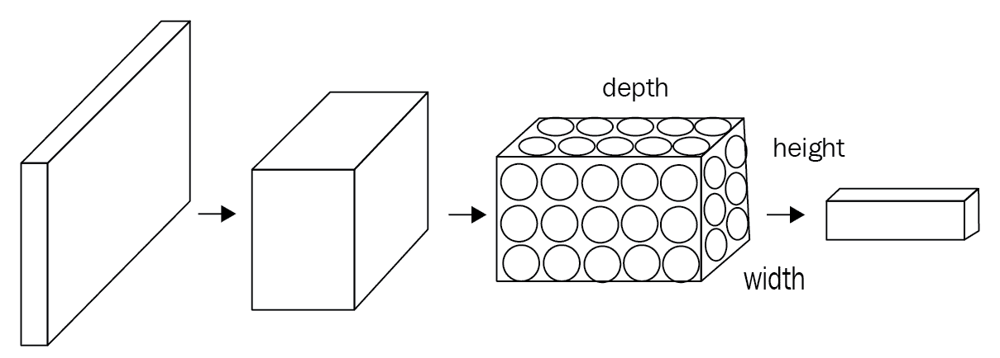
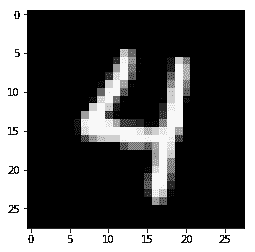

# 二、卷积神经网络简介

**卷积神经网络**(**CNN**)无处不在。在过去的五年中，由于引入了用于特征学习和分类的深度架构，我们已经看到视觉识别系统的性能显著提高。CNN 已经在多个领域取得了不错的表现，比如自动语音理解、计算机视觉、语言翻译、自动驾驶汽车，以及 Alpha Go 等游戏。因此，CNN 的应用几乎是无限的。DeepMind(来自谷歌)最近发布了 WaveNet，它使用 CNN 来生成模仿任何人类声音的语音([https://deep mind . com/blog/wave net-generative-model-raw-audio/](https://deepmind.com/blog/wavenet-generative-model-raw-audio/))。

在本章中，我们将讨论以下主题:

*   CNN 的历史
*   有线电视新闻网概述
*   图像增强


# CNN 的历史

几十年来，已经有过无数次用机器识别图片的尝试。在计算机中模仿人脑的视觉识别系统是一个挑战。人类的视觉是最难模仿的，也是大脑中最复杂的感觉认知系统。这里不讨论生物神经元，也就是初级视觉皮层，而是重点讨论人工神经元。物理世界中的物体是三维的，而这些物体的图片是二维的。在本书中，我们将介绍神经网络，而不诉诸大脑类比。1963 年，计算机科学家 Larry Roberts，也被称为**计算机视觉之父**，在他题为**积木世界**的研究论文中描述了从积木的 2D 透视图中提取三维几何信息的可能性。这是计算机视觉领域的第一个突破。世界范围内许多机器学习和人工智能的研究人员跟踪了这项工作，并在 BLOCK WORLD 的背景下研究了计算机视觉。不管方向或光线如何变化，人类都能识别积木。在这篇论文中，他说理解图像中简单的边缘形状很重要。他从积木中提取出这些类似边缘的形状，以便让计算机理解这两个积木无论朝向如何都是一样的:


愿景始于一个简单的结构。这是计算机视觉作为工程模型的开始。麻省理工学院计算机视觉科学家大卫·马克给了我们下一个重要的概念，视觉是分层次的。他写了一本非常有影响力的书，名为*愿景*。这是一本简单的书。他说一个图像由几层组成。这两个原则构成了深度学习架构的基础，尽管它们没有告诉我们使用哪种数学模型。

在 20 世纪 70 年代，第一个视觉识别算法，被称为**广义圆柱体模型**，来自斯坦福大学的人工智能实验室。这里的想法是，世界是由简单的形状组成的，任何现实世界的物体都是这些简单形状的组合。与此同时，SRI Inc .公布了另一款名为**的图示结构模型**，概念仍与广义圆柱体模型相同，但各部分由弹簧连接；因此，它引入了可变性的概念。2006 年，富士胶片在数码相机中首次使用了视觉识别算法。


# 卷积神经网络

CNN 或 ConvNets 与常规神经网络非常相似。它们仍然由神经元组成，神经元的权重可以从数据中学习。每个神经元接收一些输入并执行点积。它们在最后完全连接的层上仍然具有损失函数。他们仍然可以使用非线性函数。我们从上一章学到的所有技巧和技术对 CNN 仍然有效。正如我们在前一章中看到的，常规神经网络将输入数据作为单个向量接收，并通过一系列隐藏层。每个隐藏层由一组神经元组成，其中每个神经元都与前一层中的所有其他神经元完全连接。在单个层中，每个神经元都是完全独立的，它们不共享任何连接。最后一个完全连接的层，也称为**输出层**，包含图像分类问题情况下的类得分。一般来说，一个简单的 ConvNet 有三个主要层。它们是**卷积层**、**汇集层**和**全连接层**。我们可以在下图中看到一个简单的神经网络:


一个规则的三层神经网络

那么，有什么变化呢？由于 CNN 主要以图像作为输入，这允许我们将一些属性编码到网络中，从而减少了参数的数量。

在真实世界图像数据的情况下，CNN 比**多层感知器** ( **MLPs** )表现更好。这有两个原因:

*   在上一章中，我们看到，为了将图像输入到 MLP，我们将输入矩阵转换成一个简单的数字向量，没有空间结构。它不知道这些数字是空间排列的。所以，CNN 就是因为这个原因而建立的；即阐明多维数据中的模式。与 MLPs 不同，CNN 了解这样一个事实，即彼此距离较近的图像像素比距离较远的像素相关性更强:
    *CNN =输入层+隐藏层+全连接层*
*   CNN 与 MLP 的不同之处在于可以包含在模型中的隐藏层的类型。一个 ConvNet 以三维方式排列其神经元:**宽度**、**高度**和**深度**。每一层使用激活函数将其 3D 输入体积转换成神经元的 3D 输出体积。例如，在下图中，红色输入图层保存了图像。因此，它的宽度和高度是图像的维度，深度是三，因为有红色、绿色和蓝色通道:



ConvNets 是深度神经网络，在空间中共享它们的参数。


# 计算机是如何解读图像的？

本质上，每个图像都可以表示为像素值的矩阵。换句话说，图像可以被认为是从*R²映射到 *R* 的函数( *f* )。*

*f(x，y)* 给出位置 *(x，y)* 处的强度值。实际上，该函数值的范围仅为从 *0* 到 *255* 。类似地，彩色图像可以表示为三个函数的堆栈。我们可以把它写成一个向量:

*f( x，y) = [ r(x，y) g(x，y) b(x，y)]*

或者我们可以把它写成一个映射:

*f: R x R - > R3*

因此，彩色图像也是函数，但是在这种情况下，每个 *(x，y)* 位置处的值不是单个数字。相反，它是具有对应于三个颜色通道的三种不同光强度的向量。下面的代码用于查看输入到计算机的图像的细节。


# 用于可视化图像的代码

让我们看看如何用下面的代码可视化一幅图像:

```
#import all required lib
import matplotlib.pyplot as plt
%matplotlib inline
import numpy as np
from skimage.io import imread
from skimage.transform import resize
# Load a color image in grayscale
image = imread('sample_digit.png',as_grey=True)
image = resize(image,(28,28),mode='reflect')
print('This image is: ',type(image), 
         'with dimensions:', image.shape)

plt.imshow(image,cmap='gray')

```

结果我们获得了下面的图像:



```
def visualize_input(img, ax):

    ax.imshow(img, cmap='gray')
    width, height = img.shape
    thresh = img.max()/2.5
    for x in range(width):
        for y in range(height):
            ax.annotate(str(round(img[x][y],2)), xy=(y,x),
                        horizontalalignment='center',
                        verticalalignment='center',
                        color='white' if img[x][y]<thresh else 'black')

fig = plt.figure(figsize = (12,12)) 
ax = fig.add_subplot(111)
visualize_input(image, ax)
```

获得了以下结果:


在前一章中，我们使用了一种基于 MLP 的方法来识别图像。这种方法有两个问题:

*   它增加了参数的数量
*   它只接受向量作为输入，也就是将一个矩阵展平为一个向量

这意味着我们必须找到一种新的方法来处理图像，其中 2D 信息不会完全丢失。CNN 解决了这个问题。此外，CNN 接受矩阵作为输入。卷积层保留空间结构。首先，我们定义一个卷积窗，也称为**滤波器**，或**内核**；然后把这个滑到图像上。


# 拒绝传统社会的人

神经网络可以被认为是一个搜索问题。神经网络中的每个节点都在搜索输入数据和正确的输出数据之间的相关性。

向前传播时，丢弃会随机关闭节点，从而有助于防止权重收敛到相同的位置。完成后，它打开所有节点并反向传播。类似地，我们可以在正向传播期间将层的一些值随机设置为零，以便在层上执行丢弃。

仅在培训期间使用辍学。不要在运行时或测试数据集上使用它。


# 输入层

**输入层**保存图像数据。在下图中，输入层由三个输入组成。在**全连接层**中，两个相邻层之间的神经元成对全连接，但在一个层内不共享任何连接。换句话说，这一层中的神经元与前一层中的所有激活都有完全的联系。因此，它们的激活可以通过简单的矩阵乘法来计算，可选地添加偏置项。完全连接层和卷积层之间的区别在于，卷积层中的神经元连接到输入中的局部区域，并且它们还共享参数:


# 卷积层

与 ConvNet 相关的卷积的主要目的是从输入图像中提取特征。这一层完成了 ConvNet 中的大部分计算。我们不会在这里深入卷积的数学细节，但会了解它如何在图像上工作。

ReLU 激活功能在 CNN 中非常有用。


# Keras 中的卷积层

要在 Keras 中创建卷积层，必须首先导入所需的模块，如下所示:

```
from keras.layers import Conv2D
```

然后，您可以使用以下格式创建卷积层:

```
Conv2D(filters, kernel_size, strides, padding, activation='relu', input_shape)
```

您必须传递以下参数:

*   `filters`:滤镜数量。
*   `kernel_size`:指定(正方形)卷积窗口的高度和宽度的数字。还有一些额外的可选参数，您可能想要调整。
*   `strides`:卷积的步幅。如果你没有指定任何东西，它被设置为 1。
*   `padding`:这不是`valid`就是`same`。如果不指定任何内容，填充设置为`valid`。
*   `activation`:这是典型的`relu`。如果没有指定任何内容，则不会应用激活。强烈建议您为网络中的每个卷积层添加 ReLU 激活功能。

可以将`kernel_size`和`strides`都表示为一个数字或一个元组。

当使用您的卷积层作为模型中的第一层(出现在输入层之后)时，您必须提供一个附加的`input_shape`参数— `input_shape`。它是一个元组，指定输入的高度、宽度和深度(按此顺序)。

如果卷积层不是网络中的第一层，请确保不包括`input_shape`参数。

您可以设置许多其他可调参数来更改卷积图层的行为:

*   **例 1** :为了构建一个输入层接受 200 x 200 像素灰度图像的 CNN。在这种情况下，下一层将是 16 个滤波器的卷积层，宽度和高度为 2。当我们继续卷积时，我们可以设置滤波器一起跳跃 2 个像素。因此，我们可以使用以下代码构建一个卷积层，其中的过滤器不会用零填充图像:

```
Conv2D(filters=16, kernel_size=2, strides=2, activation='relu', input_shape=(200, 200, 1))
```

*   **例 2** :建立 CNN 模型后，我们可以将下一层设为卷积层。该层将有 32 个宽度和高度为 3 的过滤器，它将把上一个示例中构建的层作为其输入。这里，当我们进行卷积时，我们将设置过滤器一次跳跃一个像素，这样卷积层也将能够看到前一层的所有区域。这种卷积层可以借助于以下代码来构建:

```
Conv2D(filters=32, kernel_size=3, padding='same', activation='relu')
```

*   **例 3** :你也可以在大小为 2 x 2 的 Keras 中构造卷积层，有 64 个过滤器和一个 ReLU 激活函数。这里，卷积使用的步幅为 1，填充设置为`valid`，所有其他参数设置为默认值。这种卷积层可以使用以下代码来构建:

```
Conv2D(64, (2,2), activation='relu')
```


# 汇集层

正如我们所见，卷积层是一堆特征映射，每个滤波器一个特征映射。更多的过滤器增加了卷积的维数。维度越高，参数越多。因此，池层通过逐渐减小表示的空间大小来减少参数和计算的数量，从而控制过度拟合。池层通常将卷积层作为输入。最常用的汇集方法是**最大汇集**。除了最大汇集，汇集单元还可以执行其他功能，如**平均汇集**。在 CNN 中，我们可以通过指定每个滤波器的大小和滤波器的数量来控制卷积层的行为。为了增加卷积层中的节点数量，我们可以增加滤波器的数量，为了增加模式的大小，我们可以增加滤波器的大小。还有一些其他的超参数可以调整。其中之一是卷积的步幅。跨距是滤镜在图像上滑动的量。步长为 1 时，滤镜在水平和垂直方向上移动 1 个像素。这里，卷积变得与输入图像的宽度和深度相同。步长为 2 时，卷积层的宽度和高度为图像的一半。如果过滤器延伸到图像之外，那么我们可以忽略这些未知值，或者用零替换它们。这被称为**填充**。在 Keras 中，如果丢失几个值是可以接受的，我们可以设置`padding = 'valid'`。否则，设置`padding = 'same'`:


一个非常简单的 ConvNet 如下所示:


# 实际例子-图像分类

卷积层有助于检测图像中的区域模式。卷积层之后的最大池层有助于降低维数。这是一个图像分类的例子，使用了我们在前面章节中学习的所有原则。一个重要的概念是，在做任何其他事情之前，首先将所有的图像做成标准尺寸。第一个卷积层需要一个额外的`input.shape()`参数。在本节中，我们将训练 CNN 对来自 CIFAR-10 数据库的图像进行分类。CIFAR-10 是一个由 60，000 幅 32 x 32 大小的彩色图像组成的数据集。这些图像被分为 10 类，每类有 6000 张图像。这些类别是飞机、汽车、鸟、猫、狗、鹿、青蛙、马、船和卡车。让我们看看如何用下面的代码做到这一点:

```
import keras
import numpy as np
import matplotlib.pyplot as plt
%matplotlib inline

fig = plt.figure(figsize=(20,5))
for i in range(36):
    ax = fig.add_subplot(3, 12, i + 1, xticks=[], yticks=[])
    ax.imshow(np.squeeze(x_train[i]))from keras.datasets import cifar10
```

```
# rescale [0,255] --> [0,1]
x_train = x_train.astype('float32')/255
from keras.utils import np_utils

# one-hot encode the labels
num_classes = len(np.unique(y_train))
y_train = keras.utils.to_categorical(y_train, num_classes)
y_test = keras.utils.to_categorical(y_test, num_classes)

# break training set into training and validation sets
(x_train, x_valid) = x_train[5000:], x_train[:5000]
(y_train, y_valid) = y_train[5000:], y_train[:5000]

# print shape of training set
print('x_train shape:', x_train.shape)

# printing number of training, validation, and test images
print(x_train.shape[0], 'train samples')
print(x_test.shape[0], 'test samples')
print(x_valid.shape[0], 'validation samples')x_test = x_test.astype('float32')/255

from keras.models import Sequential
from keras.layers import Conv2D, MaxPooling2D, Flatten, Dense, Dropout

model = Sequential()
model.add(Conv2D(filters=16, kernel_size=2, padding='same', activation='relu', 
                        input_shape=(32, 32, 3)))
model.add(MaxPooling2D(pool_size=2))
model.add(Conv2D(filters=32, kernel_size=2, padding='same', activation='relu'))
model.add(MaxPooling2D(pool_size=2))
model.add(Conv2D(filters=64, kernel_size=2, padding='same', activation='relu'))
model.add(MaxPooling2D(pool_size=2))
model.add(Conv2D(filters=32, kernel_size=2, padding='same', activation='relu'))
model.add(MaxPooling2D(pool_size=2))
model.add(Dropout(0.3))
model.add(Flatten())
model.add(Dense(500, activation='relu'))
model.add(Dropout(0.4))
model.add(Dense(10, activation='softmax'))

model.summary()

# compile the model
model.compile(loss='categorical_crossentropy', optimizer='rmsprop', 
                  metrics=['accuracy'])
from keras.callbacks import ModelCheckpoint 

# train the model
checkpointer = ModelCheckpoint(filepath='model.weights.best.hdf5', verbose=1, 
                               save_best_only=True)
hist = model.fit(x_train, y_train, batch_size=32, epochs=100,
          validation_data=(x_valid, y_valid), callbacks=[checkpointer], 
          verbose=2, shuffle=True)
```


# 图像增强

在训练 CNN 模型时，我们不希望模型根据图像的大小、角度和位置来改变任何预测。图像表示为像素值的矩阵，因此大小、角度和位置对像素值有很大的影响。为了使模型更加大小不变，我们可以向训练集添加不同大小的图像。同样，为了使模型更具有旋转不变性，我们可以添加不同角度的图像。这个过程被称为**图像数据增强**。这也有助于避免过度拟合。当模型暴露于非常少的样本时，会发生过度拟合。图像数据增强是减少过度拟合的一种方法，但这可能还不够，因为增强的图像仍然是相关的。Keras 提供了一个名为`ImageDataGenerator`的图像扩充类，它定义了图像数据扩充的配置。这还提供了其他功能，例如:

*   基于样本和基于特征的标准化
*   图像的随机旋转、移动、剪切和缩放
*   水平和垂直翻转
*   ZCA 美白
*   维度重新排序
*   将更改保存到磁盘

可以按如下方式创建增强图像生成器对象:

```
imagedatagen = ImageDataGenerator()
```

该 API 在实时数据扩充中生成批量张量图像数据，而不是在内存中处理整个图像数据集。该 API 设计用于在模型拟合过程中创建增强图像数据。因此，它减少了内存开销，但增加了模型训练的时间成本。

在创建和配置之后，您必须适应您的数据。这将计算对图像数据执行转换所需的任何统计信息。这是通过调用数据生成器上的`fit()`函数并将其传递给训练数据集来实现的，如下所示:

```
imagedatagen.fit(train_data)
```

通过调用`flow()`函数，可以配置批量，准备数据发生器，接收批量图像:

```
imagedatagen.flow(x_train, y_train, batch_size=32)
```

最后，在模型上调用`fit_generator()`函数，而不是调用`fit()`函数:

```
fit_generator(imagedatagen, samples_per_epoch=len(X_train), epochs=200)
```

让我们看一些例子来理解 Keras 中的图像增强 API 是如何工作的。在这些示例中，我们将使用 MNIST 手写数字识别任务。

让我们先来看看训练数据集中的前九幅图像:

```
#Plot images 
from keras.datasets import mnist
from matplotlib import pyplot
#loading data
(X_train, y_train), (X_test, y_test) = mnist.load_data()
#creating a grid of 3x3 images
for i in range(0, 9):
  pyplot.subplot(330 + 1 + i)
  pyplot.imshow(X_train[i], cmap=pyplot.get_cmap('gray'))
#Displaying the plot
pyplot.show()
```

以下代码片段从 CIFAR-10 数据集创建增强图像。我们将把这些图像添加到上一个示例的训练集中，看看分类精度如何提高:

```
from keras.preprocessing.image import ImageDataGenerator
# creating and configuring augmented image generator
datagen_train = ImageDataGenerator(
 width_shift_range=0.1, # shifting randomly images horizontally (10% of total width)
 height_shift_range=0.1, # shifting randomly images vertically (10% of total height)
 horizontal_flip=True) # flipping randomly images horizontally
# creating and configuring augmented image generator
datagen_valid = ImageDataGenerator(
 width_shift_range=0.1, # shifting randomly images horizontally (10% of total width)
 height_shift_range=0.1, # shifting randomly images vertically (10% of total height)
 horizontal_flip=True) # flipping randomly images horizontally
# fitting augmented image generator on data
datagen_train.fit(x_train)
datagen_valid.fit(x_valid)

```


# 摘要

我们从简要回顾 CNN 的历史开始这一章。我们向您介绍了可视化图像的实现。

我们在一个实例的帮助下学习了图像分类，使用了我们在本章中学到的所有原理。最后，我们了解了图像增强如何帮助我们避免过度拟合，并研究了图像增强提供的各种其他功能。

在下一章，我们将学习如何从头开始构建一个简单的图像分类器 CNN 模型。