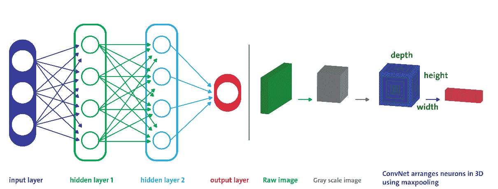
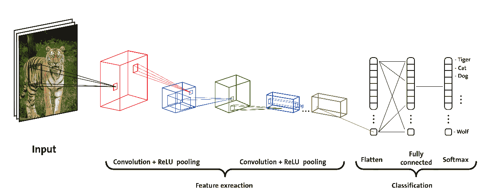
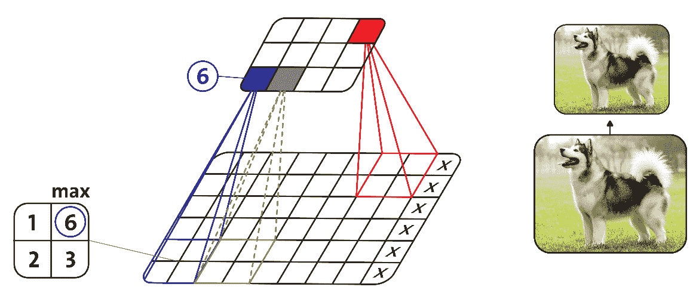
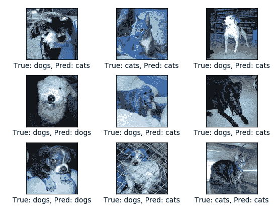
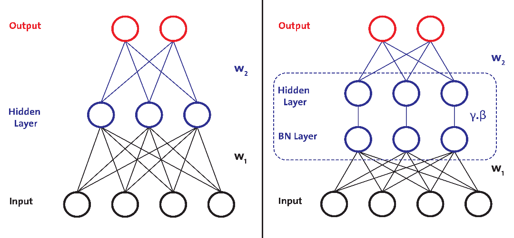
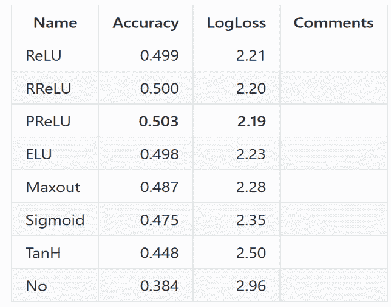
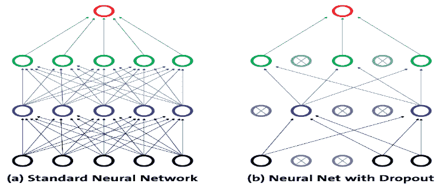
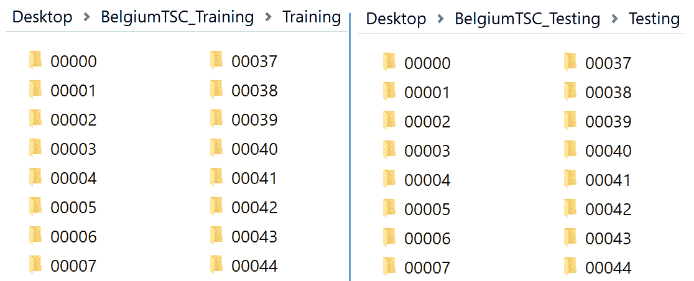
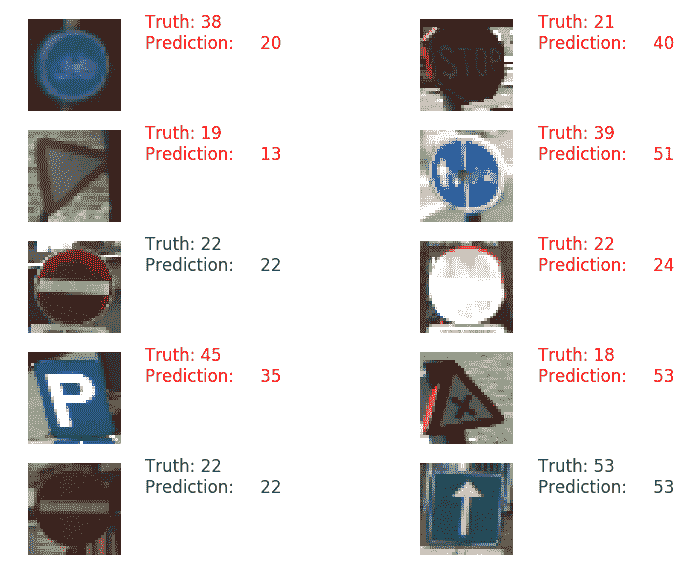

# 构建您的第一个 CNN 和性能优化

一个**卷积神经网络** ( **CNN** )是一种**前馈神经网络** ( **FNN** )，其中其神经元之间的连接模式受到动物视觉皮层的启发。在过去的几年里，CNN 在图像搜索服务、自动驾驶汽车、自动视频分类、语音识别和**自然语言处理** ( **NLP** )方面展示了超人的性能。

考虑到这些动机，在本章中，我们将从零开始构建一个简单的用于图像分类的 CNN 模型，随后是一些理论方面的内容，例如卷积和池操作。然后，我们将讨论如何调整超参数和优化神经网络的训练时间，以提高分类精度。最后，我们将通过考虑一些最佳实践来构建第二个 CNN 模型。简而言之，本章将涵盖以下主题:

*   CNN 架构和 DNNs 的缺点
*   卷积运算和池层
*   创建和训练用于图像分类的 CNN
*   模型性能优化
*   创建改进的 CNN 以优化性能


# CNN 架构和 DNNs 的缺点

在[第 2 章](00f0eb08-6d6c-48b7-8ffe-db69c7f90a73.xhtml)、*卷积神经网络介绍*中，我们讨论了常规多层感知器适用于小图像(例如，MNIST 或 CIFAR-10)。然而，由于它需要大量的参数，所以对于较大的图像它就失效了。例如，一个 100 × 100 的图像有 10000 个像素，如果第一层只有 1000 个神经元(这已经严重限制了传输到下一层的信息量)，这意味着 1000 万个连接；这只是第一层。

CNN 使用部分连接的层来解决这个问题。因为连续层仅部分连接，并且因为它大量重用其权重，所以 CNN 具有比完全连接的 DNN 少得多的参数，这使得训练更快，降低了过度拟合的风险，并且需要更少的训练数据。此外，当 CNN 已经学习了可以检测特定特征的核时，它可以在图像的任何地方检测该特征。相比之下，当 DNN 在一个位置学习一个特征时，它只能在那个特定的位置检测到它。

由于图像通常具有非常重复的特征，对于图像处理任务，例如分类，使用较少的训练样本，CNN 能够比 DNNs 更好地概括。重要的是，DNN 事先不知道像素是如何组织的；它不知道附近的像素是接近的。CNN 的架构嵌入了这种先验知识。较低层通常识别图像的小区域中的特征，而较高层将较低层的特征组合成较大的特征。这对于大多数自然图像都很有效，与 DNNs 相比，这给了 CNN 决定性的优势:



图 1:常规的 DNN 和 CNN，每一层都有三维排列的神经元

比如在*图 1* 中，左边可以看到一个规则的三层神经网络。在右边，一个 ConvNet 以三维(宽度、高度和深度)排列它的神经元，如在一个层中可视化的那样。ConvNet 的每一层都将 3D 输入体积转换为神经元激活的 3D 输出体积。红色输入层保存图像，因此它的宽度和高度是图像的尺寸，深度是三个(红色、绿色和蓝色通道)。因此，我们研究的所有多层神经网络都有由一长串神经元组成的层，我们必须在将输入图像或数据馈送到神经网络之前，将它们展平到 1D。

然而，一旦你试图直接向他们灌输 2D 形象，会发生什么呢？答案是，在 CNN 中，每一层都用 2D 来表示，这使得神经元与其相应的输入更容易匹配。我们将在接下来的章节中看到这样的例子。另一个重要的事实是，一个特征图中的所有神经元共享相同的参数，因此它极大地减少了模型中的参数数量；但更重要的是，这意味着一旦 CNN 学会了在一个位置识别一个模式，它就可以在任何其他位置识别它。

相比之下，一旦一只普通的 DNN 学会了在一个位置识别模式，它就只能在那个特定的位置识别它。在诸如 MLP 或 DBN 的多层网络中，输入层的所有神经元的输出连接到隐藏层中的每个神经元，然后该输出将再次充当完全连接层的输入。在 CNN 网络中，定义卷积层的连接方案明显不同。卷积层是 CNN 中的主要层，其中每个神经元都连接到输入区域的特定区域，称为**感受野**。

在典型的 CNN 架构中，几个卷积层以级联方式连接。每层之后是一个**整流线性单元** ( **ReLU** )层，然后是一个汇集层，然后是一个或多个卷积层(+ReLU)，然后是另一个汇集层，最后是一个或多个全连接层。很大程度上取决于问题的类型，尽管网络可能很深。每个卷积层的输出是一组称为**特征图**的对象，由单个内核过滤器生成。然后，可以使用特征映射来定义下一层的新输入。

CNN 网络中的每个神经元都产生一个输出，后跟一个与输入成比例且不受限制的激活阈值:


图 2:CNN 的概念性架构

正如您在*图 2* 中看到的，池层通常放置在卷积层之后(例如，在两个卷积层之间)。子区域的汇集层然后划分卷积区域。然后，使用最大池或平均池技术选择单个代表值，以减少后续层的计算时间。这样，CNN 可以被认为是一个特征提取器。要更清楚地理解这一点，请参考下图:



这样，特征相对于其空间位置的鲁棒性也增加了。更具体地说，当特征图被用作图像属性并穿过灰度图像时，它随着在网络中前进而变得越来越小；但随着更多功能地图的加入，它通常会变得越来越深。

我们已经讨论了这种 FFNN 的局限性——也就是说，由于与图像相关的输入量非常大，每个像素都是一个相关变量，因此即使在浅层架构中，也需要非常多的神经元。卷积运算解决了这个问题，因为它减少了自由参数的数量，允许网络用更少的参数变得更深。


# 卷积运算

卷积是一种数学运算，它将一个函数滑过另一个函数，并测量它们逐点相乘的积分。它与傅立叶变换和拉普拉斯变换有很深的联系，在信号处理中被大量使用。卷积层实际上使用互相关，这与卷积非常相似。

在数学中，卷积是对两个函数进行数学运算，产生第三个函数，即原始函数之一的修改(卷积)版本。所得到的函数给出了两个函数的逐点相乘的积分，作为原始函数之一被平移的量的函数。感兴趣的读者可以参考这个网址了解更多信息:[https://en.wikipedia.org/wiki/Convolution](https://en.wikipedia.org/wiki/Convolution)。

因此，CNN 最重要的组成部分是卷积层。第一个卷积层中的神经元并不连接到输入图像中的每个像素(也就是说，像 FNN 一样——例如，MLP 和 DBN)，而是只连接到其感受野中的像素。参见*图 3* 。反过来，第二卷积层中的每个神经元仅连接到位于第一层中的小矩形内的神经元:


图 3:每个卷积神经元只处理其感受野的数据

在[第二章](00f0eb08-6d6c-48b7-8ffe-db69c7f90a73.xhtml)、*卷积神经网络简介*中，我们已经看到，所有多层神经网络(比如 MLP)都有由这么多神经元组成的层，我们必须将输入 1D 的图像展平后再馈入神经网络。相反，在 CNN 中，每一层都用 2D 表示，这使得将神经元与其对应的输入进行匹配变得更加容易。

通过在相邻层的神经元之间实现局部连接模式，CNN 使用感受野概念来利用空间局部性。

这种架构允许网络集中于第一个隐藏层中的低级特征，然后将它们组装成下一个隐藏层中的更高级特征，以此类推。这种层次结构在现实世界的图像中很常见，这也是 CNN 在图像识别方面如此出色的原因之一。

最后，它不仅需要少量的神经元，而且大大减少了可训练参数的数量。例如，不考虑图像大小，构建大小为 5×5 的区域，每个区域具有相同的共享权重，只需要 25 个可学习的参数。这样，利用反向传播解决了传统多层神经网络训练中的梯度消失或爆炸问题。


# 汇集、跨步和填充操作

一旦你理解了卷积层的工作原理，池层就很容易理解了。池层通常独立作用于每个输入通道，因此输出深度与输入深度相同。您也可以选择在深度维度上进行合并，我们将在下面看到，在这种情况下，图像的空间维度(例如，高度和宽度)保持不变，但通道的数量减少了。让我们看看著名的 TensorFlow 网站对池化图层的正式定义:

“汇集运算在输入张量上扫描矩形窗口，计算每个窗口的归约运算(平均值、最大值或具有 argmax 的最大值)。每个池操作使用大小为 ksize 的矩形窗口，由偏移步幅分隔。例如，如果步幅都是 1，则使用每个窗口，如果步幅都是 2，则在每个维度中使用每隔一个窗口，以此类推。”

因此，总之，就像卷积层一样，汇集层中的每个神经元都连接到位于小矩形感受野内的前一层中有限数量的神经元的输出。但是，我们必须定义它的大小、步幅和填充类型。总之，输出可以计算如下:

```
output[i] = reduce(value[strides * i:strides * i + ksize]),
```

这里，索引也考虑填充值。

汇集神经元没有权重。因此，它所做的只是使用聚合函数(如 max 或 mean)来聚合输入。

换句话说，使用池的目的是对输入图像进行二次采样，以减少计算负载、内存使用和参数数量。这有助于避免在训练阶段过度适应。减小输入图像尺寸也使得神经网络能够容忍一点点图像偏移。卷积运算的空间语义取决于所选择的填充方案。

填充是一种增加输入数据大小的操作。在一维数据的情况下，您只需用一个常数追加/前置数组；在二维数据中，用这些常数包围矩阵。在 n 维中，你用常数包围你的 n 维超立方体。在大多数情况下，该常数为零，称为**零填充**:

*   **有效填充**:仅删除最右边的列(或最下面的行)
*   **SAME padding** :尝试左右均匀填充，但是如果要添加的列数是奇数，它会将额外的列添加到右边，如本例所示

让我们在下图中用图形解释一下前面的定义。如果我们希望一个层具有与前一个层相同的高度和宽度，通常在输入周围添加零，如图所示。这叫做**同**或**零**填充。

术语**相同**表示输出要素地图与输入要素地图具有相同的空间维度。

另一方面，引入了零填充以使形状根据需要匹配，在输入贴图的每一侧都相等。**有效**表示不填充，只删除最右边的列(或最下面的行):


图 4:使用 CNN 的相同和有效填充

在下面的例子中(*图 5* )，我们使用一个 2 × 2 的池内核和一个没有填充的步幅 2。每个内核中只有 **max** 输入值进入下一层，因为其他输入都被丢弃了(我们将在后面看到这一点):



图 5:使用最大池的例子，也就是子采样


# 全连接层

在栈顶添加一个规则的全连通层(也称为 **FNN** 或**密集层**);它的行为类似于 MLP，可能由几个完全连接的层组成(+ReLUs)。最后一层输出(例如，softmax)预测。例如，softmax 图层输出多类分类的估计类概率。

完全连接的层将一层中的每个神经元连接到另一层中的每个神经元。尽管完全连接的 FNN 可以用于学习特征以及分类数据，但是将这种架构应用于图像是不实际的。


# TensorFlow中的卷积和汇集运算

既然我们已经了解了卷积和池操作在理论上是如何执行的，那么让我们看看如何使用 TensorFlow 来实际执行这些操作。所以让我们开始吧。


# 在 TensorFlow 中应用池操作

使用 TensorFlow，通过保持层的初始参数，子采样层通常可以由一个`max_pool`操作来表示。对于`max_pool`，它在 TensorFlow 中有如下签名:

```
tf.nn.max_pool(value, ksize, strides, padding, data_format, name) 
```

现在让我们学习如何创建一个函数，它利用前面的签名并返回一个类型为`tf.float32`的张量，即最大汇集输出张量:

```
import tensorflow as tf

def maxpool2d(x, k=2): 
   return tf.nn.max_pool(x,  
               ksize=[1, k, k, 1],  
               strides=[1, k, k, 1],  
               padding='SAME') 
```

在前面的代码段中，参数可以描述如下:

*   `value`:这是`float32`元素和形状(批次长度、高度、宽度和通道)的 4D 张量
*   `ksize`:表示每个维度上窗口大小的整数列表
*   `strides`:每个维度上移动窗口的步数
*   `data_format`:支持`NHWC`、`NCHW`、`NCHW_VECT_C`
*   `ordering` : `NHWC`或`NCHW`
*   `padding` : `VALID`或`SAME`

但是，根据 CNN 中的分层结构，TensorFlow 还支持其他池操作，如下所示:

*   `tf.nn.avg_pool`:返回每个窗口平均值的简化张量
*   `tf.nn.max_pool_with_argmax`:返回`max_pool`张量和一个平坦索引为`max_value`的张量
*   `tf.nn.avg_pool3d`:执行一个类似立方体的`avg_pool`操作
*   窗户；输入具有增加的深度
*   `tf.nn.max_pool3d`:此功能与(...)而是应用最大值运算

现在让我们看一个填充在 TensorFlow 中如何工作的具体例子。假设我们有一个形状为`[2, 3]`的输入图像`x`和一个通道。现在我们想看看`VALID`和`SAME`填充的效果:

*   `valid_pad`:最大池，具有 2 个内核、步幅 2 和`VALID`填充
*   `same_pad`:最大池，具有 2 个内核、步幅 2 和`SAME`填充

让我们看看如何在 Python 和 TensorFlow 中实现这一点。假设我们有一个形状为`[2, 4]`的输入图像，它是一个通道:

```
import tensorflow as tf 
x = tf.constant([[2., 4., 6., 8.,], 
                 [10., 12., 14., 16.]]) 
```

现在让我们给它一个被`tf.nn.max_pool`接受的形状:

```
x = tf.reshape(x, [1, 2, 4, 1]) 
```

如果我们想用 2 x 2 内核的最大池应用`VALID`填充，步幅 2:

```
VALID = tf.nn.max_pool(x, [1, 2, 2, 1], [1, 2, 2, 1], padding='VALID') 
```

另一方面，使用具有 2 x 2 内核的最大池，步幅 2 和`SAME`填充:

```
SAME = tf.nn.max_pool(x, [1, 2, 2, 1], [1, 2, 2, 1], padding='SAME') 
```

对于`VALID`填充，由于没有填充，输出形状为`[1, 1]`。然而，对于`SAME`填充，由于我们将图像填充到形状`[2, 4]`(用- `inf`)然后应用最大池，所以输出形状是`[1, 2]`。让我们验证它们:

```
print(VALID.get_shape())  
print(SAME.get_shape())  
>>> 
(1, 1, 2, 1) 
(1, 1, 2, 1) 
```


# TensorFlow中的卷积运算

TensorFlow 提供了多种卷积方法。通过`conv2d`操作应用标准形式。让我们来看看这个操作的用法:

```
conv2d(
     input,
     filter,
     strides,
     padding,
     use_cudnn_on_gpu=True,
     data_format='NHWC',
     dilations=[1, 1, 1, 1],
     name=None
 )
```

我们使用的参数如下:

*   `input`:该操作将应用于该原始张量。它有一个明确的四维格式，默认的维度顺序如下所示。
*   `filter`:这是一个表示内核或过滤器的张量。它有一个非常通用的方法:(`filter_height`、`filter_width`、`in_channels`和`out_channels`)。
*   `strides`:这是四个`int`张量数据类型的列表，表示每个维度的滑动窗口。
*   `padding`:可以是`SAME`或`VALID`。`SAME`将试图保持初始张量维数，但是如果输出大小和填充被计算，那么`VALID`将允许它增长。我们将在后面看到如何与池层一起执行填充。
*   `use_cudnn_on_gpu`:表示是否使用`CUDA GPU CNN`库加速计算。
*   `data_format`:指定数据组织的顺序(`NHWC`或`NCWH`)。
*   `dilations`:表示`ints`的可选列表。它默认为(1，1，1，1)。长度为 4 的 1D 张量。输入的每个维度的膨胀因子。如果它被设置为 k > 1，则在该维度上的每个过滤器元素之间将有 k-1 个被跳过的单元。尺寸顺序由`data_format`的值决定；有关详细信息，请参见前面的代码示例。批次和深度维度中的膨胀必须为 1。
*   `name`:操作的名称(可选)。

下面是一个卷积层的例子。它连接一个卷积，添加一个偏差参数和，最后返回我们为整个层选择的激活函数(在本例中，是 ReLU 操作，这是一个常用的操作):

```
def conv_layer(data, weights, bias, strides=1): 
   x = tf.nn.conv2d(x,  
               weights,  
               strides=[1, strides, strides, 1],  
               padding='SAME') 
   x = tf.nn.bias_add(x, bias) 
   return tf.nn.relu(x) 
```

这里，x 是 4D 张量输入(批量大小、高度、宽度和通道)。TensorFlow 还提供了其他几种卷积层。例如:

*   `tf.layers.conv1d()`为 1D 输入创建卷积层。这是很有用的，例如，在 NLP 中，一个句子可以表示为一个 1D 单词阵列，感受域覆盖了几个相邻的单词。
*   `tf.layers.conv3d()`为 3D 输入创建卷积层。
*   `tf.nn.atrous_conv2d()`创建一个 a trous 卷积层( *a* tro *us* 是法语中有孔的意思)。这相当于使用一个常规的卷积层，通过插入零的行和列来扩展滤波器。例如，一个等于(1，2，3)的 1 × 3 滤波器可以以 4 的膨胀率进行膨胀，从而得到一个膨胀滤波器(1，0，0，0，2，0，0，0，3)。这允许卷积层具有更大的感受域，而没有计算成本，并且不使用额外的参数。
*   `tf.layers.conv2d_transpose ()`创建转置卷积层，有时称为**去卷积层，**对图像进行上采样。它通过在输入之间插入零来实现这一点，因此您可以将其视为使用分数步长的常规卷积层。
*   `tf.nn.depthwise_conv2d()`创建一个深度卷积层，将每个滤波器独立应用于每个单独的输入通道。这样，如果有*f[n]滤波器和*f[n]*[’]输入通道，那么这样就会输出*f[n]*×*f[n]*[’]特征图。*
*   `tf.layers.separable_conv2d()`创建一个可分离的卷积层，它首先像一个深度方向的卷积层，然后将一个 1 × 1 的卷积层应用于生成的特征地图。这使得将滤波器应用于任意组输入通道成为可能。


# 训练 CNN

在上一节中，我们已经看到了如何构建一个 CNN，并在其不同的层上应用不同的操作。现在，当谈到训练 CNN 时，它要复杂得多，因为它需要很多考虑来控制这些操作，例如应用适当的激活函数、权重和偏置初始化，当然，智能地使用优化器。

还有一些高级注意事项，如优化的超参数调整。然而，这将在下一节讨论。我们首先从权重和偏差初始化开始讨论。


# 权重和偏差初始化

训练 DNN 时最常见的初始化技术之一是随机初始化。使用随机初始化的想法是从输入数据集的正态分布中以较低的偏差对每个权重进行采样。低偏差允许你将网络偏向简单的 0 解。

但这意味着什么呢？事情是这样的，初始化可以被完成，而没有将权重实际初始化为 0 的负面影响。其次，Xavier 初始化常用于训练 CNN。它类似于随机初始化，但通常效果更好。现在让我解释一下原因:

*   想象一下，你随机初始化网络权重，但是它们开始时太小了。然后，信号在通过每一层时会缩小，直到太小而无法使用。
*   另一方面，如果网络中的权重开始过大，那么信号会随着它通过每一层而增长，直到它过大而无用。

好的方面是使用 Xavier 初始化可以确保权重恰到好处，通过许多层将信号保持在合理的值范围内。综上所述，它可以根据输入输出神经元的数量自动确定初始化的规模。

感兴趣的读者应该参考这份出版物了解详细信息:Xavier Glorot 和 Yoshua Bengio，*理解训练深度 FNN 的难度*，第 13 届**人工智能和统计学国际会议论文集** ( **AISTATS** ) 2010，意大利撒丁岛基亚拉古娜度假村。JMLR 第九卷:W & CP。

最后，你可能会问一个智能的问题，*我不能在训练一个常规的 DNN(比如 MLP 或者 DBN)的时候去掉随机初始化吗*？嗯，最近，一些研究人员一直在谈论随机正交矩阵初始化，它比任何用于训练 dnn 的随机初始化都表现得更好:

*   **当初始化偏置**时，将偏置初始化为零是可能且常见的，因为权重中的小随机数提供了不对称中断。对于所有的偏差，将偏差设置为小的恒定值，例如 0.01，确保所有的 ReLU 单元可以传播一些梯度。然而，它既没有很好的表现，也没有持续的改进。所以建议坚持用零。


# 正则化

有几种控制 CNN 训练的方法来防止训练阶段的过度拟合。例如，L2/L1 正则化、最大范数约束和退出:

*   **L2 正则化**:这可能是最常见的正则化形式。它可以通过直接在目标中惩罚所有参数的平方值来实现。例如，使用梯度下降参数更新，L2 正则化最终意味着每个权重线性衰减:*W+=-*λ**W*向零衰减。
*   **L1 正则化**:这是另一种相对常见的正则化形式，其中对于每个权重 *w* ，我们将术语 *λ∣w∣* 添加到目标中。然而，也有可能将 L1 正则化与 L2 正则化相结合: *λ1∣w∣+λ2w2* ，通常称为**弹性网正则化**。
*   **最大范数约束**:正则化的另一种形式是对每个神经元的权重向量的幅度施加绝对上限，并使用投影梯度下降来施加约束。

最后，dropout 是正则化的高级变体，这将在本章后面讨论。


# 激活功能

激活 ops 提供不同类型的非线性以用于神经网络。这些包括平滑的非线性，例如`sigmoid`、`tanh`、`elu`、`softplus`和`softsign`。另一方面，可以使用的一些连续但并非处处可微的函数有`relu`、`relu6`、`crelu`和`relu_x`。所有激活操作都按分量应用，并产生与输入张量形状相同的张量。现在让我们看看如何在 TensorFlow 语法中使用一些常用的激活函数。


# 使用乙状结肠

在 TensorFlow 中，签名`tf.sigmoid(x, name=None)`使用 *y = 1 / (1 + exp(-x))* 逐元素计算`x`的 sigmoid，并返回相同类型的张量`x`。以下是参数描述:

*   `x`:一个张量。这必须是以下类型之一:`float32`、`float64`、`int32`、`complex64`、`int64`或`qint32`。
*   `name`:操作的名称(可选)。


# 使用 tanh

在 TensorFlow 中，签名`tf.tanh(x, name=None)`按元素计算`x`的双曲正切，并返回相同类型的张量`x`。以下是参数描述:

*   `x`:张量或稀疏。这是一个类型为`float`、`double`、`int32`、`complex64`、`int64`或`qint32`的张量。
*   `name`:操作的名称(可选)。


# 使用 ReLU

在 TensorFlow 中，签名`tf.nn.relu(features, name=None)`使用`max(features, 0)`计算校正的线性，并返回与特征类型相同的张量。以下是参数描述:

*   `features`:张量。这必须是以下类型之一:`float32`、`float64`、`int32`、`int64`、`uint8`、`int16`、`int8`、`uint16`、`half`。
*   `name`:操作的名称(可选)。

有关如何使用其他激活功能的更多信息，请参考 TensorFlow 网站。到目前为止，我们只有最少的理论知识来建立我们的第一个 CNN 网络来进行预测。


# 建立、训练和评估我们的第一个 CNN

在下一节中，我们将看看如何根据狗和猫的原始图像对它们进行分类和区分。我们还将看看如何实现我们的第一个 CNN 模型来处理具有三个通道的原始和彩色图像。这种网络设计和实现并不简单；TensorFlow 低级 API 将用于此。但是，不要担心；在本章的后面，我们将看到另一个使用 TensorFlow 的高级 contrib API 实现 CNN 的例子。在我们正式开始之前，必须对数据集做一个简短的描述。


# 数据集描述

对于这个例子，我们将使用 Kaggle 中的狗与猫数据集，该数据集是为臭名昭著的狗与猫分类问题提供的，作为启用了内核的操场竞赛。数据集可以从[https://www . ka ggle . com/c/dogs-vs-cats-redux-kernels-edition/data](https://www.kaggle.com/c/dogs-vs-cats-redux-kernels-edition/data)下载。

火车文件夹包含 25，000 张狗和猫的图片。该文件夹中的每个图像都有标签作为文件名的一部分。测试文件夹包含 12，500 张图像，根据数字 ID 命名。对于测试集中的每一张图片，你都要预测一张图片是狗的概率(1 =狗，0 =猫)；也就是一个二元分类问题。对于这个例子，有三个 Python 脚本。


# 步骤 1–加载所需的包

在这里，我们导入所需的包和库。请注意，根据平台的不同，您的导入可能会有所不同:

```
import time 
import math 
import random 
import os 
import pandas as pd 
import numpy as np 
import matplotlib.pyplot as plt 
import tensorflow as tf 
import Preprocessor 
import cv2 
import LayersConstructor 
from sklearn.metrics import confusion_matrix 
from datetime import timedelta 
from sklearn.metrics.classification import accuracy_score 
from sklearn.metrics import precision_recall_fscore_support 
```


# 步骤 2–加载训练/测试图像以生成训练/测试集

我们将图像的颜色通道数量设置为 3。在上一节中，我们已经看到，对于灰度图像，它应该是 1:

```
num_channels = 3 
```

为了简单起见，我们假设图像尺寸应该仅仅是正方形。让我们将大小设置为`128`:

```
img_size = 128 
```

现在我们有了图像大小(即`128`)和通道数(即 3)，当展平为一维时，图像的大小将是图像维度和通道数的乘积，如下所示:

```
img_size_flat = img_size * img_size * num_channels 
```

请注意，在稍后阶段，我们可能需要为 max pooling 和卷积层重塑图像，因此我们需要重塑图像。在我们的例子中，它是具有图像的高度和宽度的元组，用于整形数组:

```
img_shape = (img_size, img_size)  
```

我们应该显式定义标签(即类)，因为我们只有原始彩色图像，因此图像不像其他数值机器学习数据集那样有标签。让我们按如下方式明确定义类信息:

```
classes = ['dogs', 'cats']  
num_classes = len(classes) 
```

我们需要定义稍后需要在 CNN 模型上训练的批量大小:

```
batch_size = 14  
```

请注意，我们还可以定义训练集的哪一部分将用作验证分割。为简单起见，我们假设将使用 16%:

```
validation_size = 0.16  
```

要设置的一个重要事项是，在确认损失停止改善后，在终止训练之前要等待多长时间。如果我们不想实现提前停止，应该使用 none:

```
early_stopping = None   
```

现在，下载数据集，你必须手动做一件事:将狗和猫的图像分开，放在两个独立的文件夹中。更具体地说，假设您将训练集放在路径`/home/DoG_CaT/data/train/`下。在 train 文件夹中，创建两个单独的文件夹`dogs`和`cats`，但只显示到`DoG_CaT/data/train/`的路径。我们还假设我们的测试集在`/home/DoG_CaT/data/test/`目录中。此外，您可以定义将日志和模型检查点文件写入的检查点目录:

```
train_path = '/home/DoG_CaT/data/train/' 
test_path = '/home/DoG_CaT/data/test/' 
checkpoint_dir = "models/" 
```

然后我们开始阅读训练集，为 CNN 模型做准备。为了处理测试和训练集，我们有另一个脚本`Preprocessor.py`。尽管如此，最好也准备好测试集 **:**

```
data = Preprocessor.read_train_sets(train_path, img_size, classes, validation_size=validation_size) 
```

前面的代码行读取猫和狗的原始图像，并创建训练集。`read_train_sets()`功能如下:

```
def read_train_sets(train_path, image_size, classes, validation_size=0): 
  class DataSets(object): 
      pass 
      data_sets = DataSets() 
      images, labels, ids, cls = load_train(train_path, image_size, classes) 
      images, labels, ids, cls = shuffle(images, labels, ids, cls) 

      if isinstance(validation_size, float): 
          validation_size = int(validation_size * images.shape[0]) 
          validation_images = images[:validation_size] 
          validation_labels = labels[:validation_size] 
          validation_ids = ids[:validation_size] 
          validation_cls = cls[:validation_size] 
          train_images = images[validation_size:] 
          train_labels = labels[validation_size:] 
          train_ids = ids[validation_size:] 
          train_cls = cls[validation_size:] 
          data_sets.train = DataSet(train_images, train_labels, train_ids, train_cls) 
          data_sets.valid = DataSet(validation_images, validation_labels, validation_ids, validation_cls) 
  return data_sets 
```

在前面的代码段中，我们使用了方法`load_train()`来加载图像，这是一个名为`DataSet`的类的实例:

```
def load_train(train_path, image_size, classes): 
    images = [] 
    labels = [] 
    ids = [] 
    cls = [] 

    print('Reading training images') 
    for fld in classes:    
        index = classes.index(fld) 
        print('Loading {} files (Index: {})'.format(fld, index)) 
        path = os.path.join(train_path, fld, '*g') 
        files = glob.glob(path) 
        for fl in files: 
            image = cv2.imread(fl) 
            image = cv2.resize(image, (image_size, image_size), cv2.INTER_LINEAR) 
            images.append(image) 
            label = np.zeros(len(classes)) 
            label[index] = 1.0 
            labels.append(label) 
            flbase = os.path.basename(fl) 
            ids.append(flbase) 
            cls.append(fld) 
    images = np.array(images) 
    labels = np.array(labels) 
    ids = np.array(ids) 
    cls = np.array(cls) 
    return images, labels, ids, cls 
```

用于生成训练集批次的`DataSet`类如下:

```
class DataSet(object): 

  def next_batch(self, batch_size): 
    """Return the next `batch_size` examples from this data set.""" 
    start = self._index_in_epoch 
    self._index_in_epoch += batch_size 
    if self._index_in_epoch > self._num_examples: 
      # Finished epoch 
      self._epochs_completed += 1 
      start = 0 
      self._index_in_epoch = batch_size 
      assert batch_size <= self._num_examples 
    end = self._index_in_epoch 
    return self._images[start:end], self._labels[start:end], self._ids[start:end], self._cls[start:end] 
```

然后，类似地，我们从混合(狗和猫)的测试图像准备测试集:

```
test_images, test_ids = Preprocessor.read_test_set(test_path, img_size) 
```

为了方便起见，我们使用了`read_test_set()`功能，如下所示:

```
def read_test_set(test_path, image_size): 
  images, ids  = load_test(test_path, image_size) 
  return images, ids 
```

现在，类似于训练集，我们有一个名为`load_test ()`的专用函数来加载测试集，如下所示:

```
def load_test(test_path, image_size): 
  path = os.path.join(test_path, '*g') 
  files = sorted(glob.glob(path)) 

  X_test = [] 
  X_test_id = [] 
  print("Reading test images") 
  for fl in files: 
      flbase = os.path.basename(fl) 
      img = cv2.imread(fl) 
      img = cv2.resize(img, (image_size, image_size), cv2.INTER_LINEAR) 
      X_test.append(img) 
      X_test_id.append(flbase) 
  X_test = np.array(X_test, dtype=np.uint8) 
  X_test = X_test.astype('float32') 
  X_test = X_test / 255 
  return X_test, X_test_id 
```

干得好！我们现在可以看到一些随机选择的图像。为此，我们有一个助手函数叫做`plot_images()`；它创建了一个具有 3 x 3 个子图的图形。因此，总共将绘制九幅图像，以及它们的真实标签。内容如下:

```
def plot_images(images, cls_true, cls_pred=None): 
    if len(images) == 0: 
        print("no images to show") 
        return  
    else: 
        random_indices = random.sample(range(len(images)), min(len(images), 9))         
        images, cls_true  = zip(*[(images[i], cls_true[i]) for i in random_indices])     
    fig, axes = plt.subplots(3, 3) 
    fig.subplots_adjust(hspace=0.3, wspace=0.3) 
    for i, ax in enumerate(axes.flat): 
        # Plot image. 
        ax.imshow(images[i].reshape(img_size, img_size, num_channels)) 
        if cls_pred is None: 
            xlabel = "True: {0}".format(cls_true[i]) 
        else: 
            xlabel = "True: {0}, Pred: {1}".format(cls_true[i], cls_pred[i]) 
        ax.set_xlabel(xlabel)         
        ax.set_xticks([]) 
        ax.set_yticks([])     
    plt.show() 
```

让我们从训练集中获取一些随机图像及其标签:

```
images, cls_true  = data.train.images, data.train.cls 
```

最后，我们使用前面代码中的 helper 函数绘制图像和标签:

```

plot_images(images=images, cls_true=cls_true) 
```

前面的代码行生成随机选择的图像的真实标签:


图 6:随机选择的图像的真实标签

最后，我们可以打印数据集统计数据:

```
print("Size of:") 
print("  - Training-set:tt{}".format(len(data.train.labels)))  
print("  - Test-set:tt{}".format(len(test_images))) 
print("  - Validation-set:t{}".format(len(data.valid.labels))) 
```

```
>>>
Reading training images
 Loading dogs files (Index: 0)
 Loading cats files (Index: 1)
 Reading test images
 Size of:
 - Training-set: 21000
 - Test-set: 12500
 - Validation-set: 4000
```


# 步骤 3-定义 CNN 超参数

现在我们已经有了训练和测试集，是时候在开始构建之前为 CNN 模型定义超参数了。在第一和第二卷积层中，我们定义每个滤波器的宽度和高度，即`3`，其中滤波器个数为`32`:

```
filter_size1 = 3  
num_filters1 = 32  
filter_size2 = 3  
num_filters2 = 32  
```

第三卷积层具有相等的维度，但是滤波器是两倍；即`64`滤镜:

```
filter_size3 = 3
num_filters3 = 64  
```

最后两层是完全连接的层，指定神经元的数量:

```
fc_size = 128     
```

现在，让我们通过设置一个较低的学习率值来降低训练速度，以便进行更高强度的训练，如下所示:

```
learning_rate=1e-4  
```


# 步骤 4–构建 CNN 层

一旦我们定义了 CNN 超参数，下一个任务就是实现 CNN 网络。你可以猜到，对于我们的任务，我们将构建一个 CNN 网络，它有三个卷积层，一个扁平化层和两个全连接层(参考`LayersConstructor.py`)。此外，我们还需要定义权重和偏差。此外，我们还将拥有隐式最大池层。首先，我们来定义一下权重。在下面的例子中，我们有一个`new_weights()`方法，它请求图像形状并返回截断的正常形状:

```
def new_weights(shape): 
    return tf.Variable(tf.truncated_normal(shape, stddev=0.05)) 
```

然后，我们使用`new_biases()`方法定义偏差:

```
def new_biases(length): 
    return tf.Variable(tf.constant(0.05, shape=[length])) 
```

现在，让我们定义一种方法`new_conv_layer()`，用于构建卷积层。该方法采用输入批次、输入通道数量、滤波器大小和滤波器数量，并且它还使用最大池(如果为真，我们使用 2×2 最大池)来构造新的卷积层。该方法的工作流程如下:

1.  为卷积定义过滤器权重的形状，这由 TensorFlow API 确定。
2.  使用给定的形状和新的偏移创建新的权重(即过滤器)，每个过滤器一个权重。
3.  为卷积创建 TensorFlow 操作，其中所有维度的跨度都设置为 1。第一步和最后一步必须始终为 1，因为第一步用于图像编号，最后一步用于输入通道。例如，跨距= (1，2，2，1)将意味着滤波器在图像的 *x* 轴和 *y* 轴上移动两个像素。
4.  将偏差添加到卷积的结果中。然后将偏置值添加到每个滤波器通道。
5.  然后，它使用池对图像分辨率进行下采样。这是 2 x 2 最大池，这意味着我们考虑 2 x 2 窗口，并在每个窗口中选择最大值。然后我们移动两个像素到下一个窗口。
6.  ReLU 然后用于计算每个输入像素 *x* 的 *max(x，0)* 。如前所述，relu 通常在池化之前执行，但是自从`relu(max_pool(x)) == max_pool(relu(x))`以来，我们可以通过最大池化先节省 75%的 ReLU 操作。
7.  最后，它返回结果层和过滤器权重，因为我们将在后面绘制权重。

现在我们定义一个函数来构造要使用的卷积层:

```
def new_conv_layer(input,  num_input_channels, filter_size, num_filters,                    use_pooling=True):   
    shape = [filter_size, filter_size, num_input_channels, num_filters] 
    weights = new_weights(shape=shape) 
    biases = new_biases(length=num_filters) 
    layer = tf.nn.conv2d(input=input, 
                         filter=weights, 
                         strides=[1, 1, 1, 1], 
                         padding='SAME') 
    layer += biases 
    if use_pooling: 
        layer = tf.nn.max_pool(value=layer, 
                               ksize=[1, 2, 2, 1], 
                               strides=[1, 2, 2, 1], 
                               padding='SAME') 
    layer = tf.nn.relu(layer) 
    return layer, weights 
```

下一个任务是定义展平层:

1.  获取输入图层的形状。
2.  特征数量为`img_height * img_width * num_channels`。`get_shape()`函数 TensorFlow 用于计算这一点。
3.  然后，它会将图层重新整形为(`num_images`和`num_features`)。我们只是将第二维度的大小设置为`num_features`并将第一维度的大小设置为-1，这意味着该维度中的大小被计算，因此张量的总大小在整形后保持不变。
4.  最后，它会返回展平的图层和要素的数量。

以下代码与之前描述的`defflatten_layer(layer)`完全相同:

```
    layer_shape = layer.get_shape() 
    num_features = layer_shape[1:4].num_elements() 
    layer_flat = tf.reshape(layer, [-1, num_features]) 
    return layer_flat, num_features 
```

最后，我们需要构建完全连接的层。下面的函数`new_fc_layer()`接受输入批次、批次数量和输出数量(即预测的类),并使用 ReLU。然后，它根据我们在本步骤前面定义的方法创建权重和偏差。最后，它将图层计算为输入和权重的矩阵乘积，然后添加偏差值:

```
def new_fc_layer(input, num_inputs, num_outputs, use_relu=True):  
    weights = new_weights(shape=[num_inputs, num_outputs]) 
    biases = new_biases(length=num_outputs) 
    layer = tf.matmul(input, weights) + biases 
    if use_relu: 
        layer = tf.nn.relu(layer) 
    return layer 
```


# 步骤 5–准备TensorFlow图

我们现在为TensorFlow图创建占位符:

```
x = tf.placeholder(tf.float32, shape=[None, img_size_flat], name='x') 
x_image = tf.reshape(x, [-1, img_size, img_size, num_channels]) 
y_true = tf.placeholder(tf.float32, shape=[None, num_classes], name='y_true') 
y_true_cls = tf.argmax(y_true, axis=1) 
```


# 步骤 6–创建 CNN 模型

现在我们有了输入；也就是说，`x_image`准备馈入卷积层。我们正式创建一个卷积层，然后是最大池:

```
layer_conv1, weights_conv1 =  
    LayersConstructor.new_conv_layer(input=x_image, 
                   num_input_channels=num_channels, 
                   filter_size=filter_size1, 
                   num_filters=num_filters1, 
                   use_pooling=True) 
```

我们必须有第二个卷积层，其中输入是第一个卷积层`layer_conv1`，后面是最大池:

```
layer_conv2, weights_conv2 =  
    LayersConstructor.new_conv_layer(input=layer_conv1, 
                   num_input_channels=num_filters1, 
                   filter_size=filter_size2, 
                   num_filters=num_filters2, 
                   use_pooling=True) 
```

我们现在有了第三个卷积层，其中输入是第二个卷积层的输出，即`layer_conv2`，后面是最大池:

```
layer_conv3, weights_conv3 =  
    LayersConstructor.new_conv_layer(input=layer_conv2, 
                   num_input_channels=num_filters2, 
                   filter_size=filter_size3, 
                   num_filters=num_filters3, 
                   use_pooling=True) 
```

一旦第三个卷积层被实例化，我们接着如下实例化展平的层:

```
layer_flat, num_features = LayersConstructor.flatten_layer(layer_conv3) 
```

一旦我们展平了图像，它们就可以被馈送到第一个完全连接的层。我们使用 ReLU:

```
layer_fc1 = LayersConstructor.new_fc_layer(input=layer_flat, 
                         num_inputs=num_features, 
                         num_outputs=fc_size, 
                         use_relu=True) 
```

最后，我们必须有第二个也是最后一个全连接层，其中输入是第一个全连接层的输出:

```
layer_fc2 = LayersConstructor.new_fc_layer(input=layer_fc1, 
                         num_inputs=fc_size, 
                         num_outputs=num_classes, 
                         use_relu=False) 
```


# 步骤 7–运行TensorFlow图来训练 CNN 模型

以下步骤用于执行培训。这些代码是不言自明的，就像我们在前面的例子中已经使用过的代码一样。我们使用 softmax 通过与真实类别进行比较来预测类别:

```
y_pred = tf.nn.softmax(layer_fc2) 
y_pred_cls = tf.argmax(y_pred, axis=1) 
cross_entropy = tf.nn.softmax_cross_entropy_with_logits_v2(logits=layer_fc2,                                               labels=y_true) 
```

我们定义了`cost`函数，然后是优化器(在本例中是 Adam 优化器)。然后我们计算精确度:

```
cost_op= tf.reduce_mean(cross_entropy) 
optimizer = tf.train.AdamOptimizer(learning_rate=learning_rate).minimize(cost_op) 
correct_prediction = tf.equal(y_pred_cls, y_true_cls) 
accuracy = tf.reduce_mean(tf.cast(correct_prediction, tf.float32)) 
```

然后，我们使用 TensorFlow 中的`global_variables_initializer()`函数初始化所有操作:

```
init_op = tf.global_variables_initializer() 
```

然后，我们创建并运行 TensorFlow 会话，以便在所有张量之间开展培训:

```
session = tf.Session() 
session.run(init_op) 
```

然后我们输出训练数据，使批量大小为 32(参见*步骤 2* ):

```
train_batch_size = batch_size 
```

我们维护两个列表来跟踪培训和验证的准确性:

```
acc_list = [] 
val_acc_list = [] 
```

然后，我们计算到目前为止执行的迭代总数，并创建一个空列表来跟踪所有的迭代:

```
total_iterations = 0 
iter_list = [] 
```

我们通过调用`optimize()`函数正式开始训练，这需要多次迭代。它需要两个:

*   保存一批图像和的训练示例的`x_batch`
*   `y_true_batch`，这些图像的真实标签

然后，它将每个图像的形状从(`num`示例，行，列，深度)转换为(`num`示例，展平的图像形状)。之后，我们将批处理放入 TensorFlow 图中占位符变量的`dict`中。稍后，我们对这批训练数据运行优化器。

然后，TensorFlow 将`feed_dict_train`中的变量赋给占位符变量。然后执行优化程序，在每个时期结束时打印状态。最后，它更新了我们执行的迭代总数:

```
def optimize(num_iterations): 
    global total_iterations 
    best_val_loss = float("inf") 
    patience = 0 
    for i in range(total_iterations, total_iterations + num_iterations): 
        x_batch, y_true_batch, _, cls_batch = data.train.next_batch(train_batch_size) 
        x_valid_batch, y_valid_batch, _, valid_cls_batch = data.valid.next_batch(train_batch_size) 
        x_batch = x_batch.reshape(train_batch_size, img_size_flat) 
        x_valid_batch = x_valid_batch.reshape(train_batch_size, img_size_flat) 
        feed_dict_train = {x: x_batch, y_true: y_true_batch}         
        feed_dict_validate = {x: x_valid_batch, y_true: y_valid_batch} 
        session.run(optimizer, feed_dict=feed_dict_train)         

        if i % int(data.train.num_examples/batch_size) == 0:  
            val_loss = session.run(cost, feed_dict=feed_dict_validate) 
            epoch = int(i / int(data.train.num_examples/batch_size)) 
            acc, val_acc = print_progress(epoch, feed_dict_train, feed_dict_validate, val_loss) 
            acc_list.append(acc) 
            val_acc_list.append(val_acc) 
            iter_list.append(epoch+1) 

            if early_stopping:     
                if val_loss < best_val_loss: 
                    best_val_loss = val_loss 
                    patience = 0 
                else: 
                    patience += 1 
                if patience == early_stopping: 
                    break 
    total_iterations += num_iterations 
```

我们将在下一部分展示我们的培训进展如何。


# 步骤 8–模型评估

我们设法完成了培训。是时候对模型进行评估了。在我们开始评估模型之前，让我们实现一些辅助功能，用于绘制示例错误和打印验证准确性。`plot_example_errors()`有两个参数。第一个是`cls_pred`，它是测试集中所有图像的预测类别号的数组。

第二个参数`correct`是一个`boolean`数组，用于预测测试集中每个图像的预测类是否等于`true`类。首先，它从测试集中获取被错误分类的图像。然后，它获取这些图像的预测类和真实类，最后绘制前九个图像及其类(即预测与真实标签):

```
def plot_example_errors(cls_pred, correct): 
    incorrect = (correct == False)     
    images = data.valid.images[incorrect]     
    cls_pred = cls_pred[incorrect] 
    cls_true = data.valid.cls[incorrect]     
    plot_images(images=images[0:9], cls_true=cls_true[0:9], cls_pred=cls_pred[0:9]) 
```

第二个辅助功能叫做`print_validation_accuracy()`；它打印验证的准确性。它为预测类分配一个数组，这些预测类将被批量计算并填充到这个数组中，然后它为这些批量计算预测类:

```
def print_validation_accuracy(show_example_errors=False, show_confusion_matrix=False): 
    num_test = len(data.valid.images) 
    cls_pred = np.zeros(shape=num_test, dtype=np.int) 
    i = 0 
    while i < num_test: 
        # The ending index for the next batch is denoted j. 
        j = min(i + batch_size, num_test) 
        images = data.valid.images[i:j, :].reshape(batch_size, img_size_flat)    
        labels = data.valid.labels[i:j, :] 
        feed_dict = {x: images, y_true: labels} 
        cls_pred[i:j] = session.run(y_pred_cls, feed_dict=feed_dict) 
        i = j 

    cls_true = np.array(data.valid.cls) 
    cls_pred = np.array([classes[x] for x in cls_pred])  
    correct = (cls_true == cls_pred) 
    correct_sum = correct.sum() 
    acc = float(correct_sum) / num_test 

    msg = "Accuracy on Test-Set: {0:.1%} ({1} / {2})" 
    print(msg.format(acc, correct_sum, num_test)) 

    if show_example_errors: 
        print("Example errors:") 
        plot_example_errors(cls_pred=cls_pred, correct=correct)     
```

现在我们有了辅助函数，我们可以开始优化了。首先，我们将微调迭代一万次，看看性能:

```
 optimize(num_iterations=1000) 
```

经过 10，000 次迭代后，我们观察到以下结果:

```
Accuracy on Test-Set: 78.8% (3150 / 4000) 
Precision: 0.793378626929 
Recall: 0.7875 
F1-score: 0.786639298213 
```

这意味着测试集上的准确率约为 79%。此外，让我们看看我们的分类器在样本图像上的表现如何:



图 7:测试集上的随机预测(10，000 次迭代之后)

之后，我们进一步迭代优化高达 100，000 次，并观察到更好的准确性:


图 8:测试集上的随机预测(在 100，000 次迭代之后)

```
>>> 
Accuracy on Test-Set: 81.1% (3244 / 4000) 
Precision: 0.811057239265 
Recall: 0.811 
F1-score: 0.81098298755 
```

因此，它并没有提高太多，但总体精度提高了 2%。现在是时候对我们的模型进行评估了。为简单起见，我们将随机拍摄一只狗和一只猫的两张图像，并查看我们的模型的预测能力:


图 9:要分类的猫和狗的示例图像

首先，我们加载这两个图像，并相应地准备测试集，正如我们在本例的前面步骤中所看到的:

```
test_cat = cv2.imread('Test_image/cat.jpg') 
test_cat = cv2.resize(test_cat, (img_size, img_size), cv2.INTER_LINEAR) / 255 
preview_cat = plt.imshow(test_cat.reshape(img_size, img_size, num_channels)) 

test_dog = cv2.imread('Test_image/dog.jpg') 
test_dog = cv2.resize(test_dog, (img_size, img_size), cv2.INTER_LINEAR) / 255 
preview_dog = plt.imshow(test_dog.reshape(img_size, img_size, num_channels)) 
```

那么我们有下面的函数来进行预测:

```
def sample_prediction(test_im):     
    feed_dict_test = { 
        x: test_im.reshape(1, img_size_flat), 
        y_true: np.array([[1, 0]]) 
    } 
    test_pred = session.run(y_pred_cls, feed_dict=feed_dict_test) 
    return classes[test_pred[0]] 
print("Predicted class for test_cat: {}".format(sample_prediction(test_cat))) 
print("Predicted class for test_dog: {}".format(sample_prediction(test_dog))) 

>>>  
Predicted class for test_cat: cats 
Predicted class for test_dog: dogs 
```

最后，当我们完成时，我们通过调用`close()`方法来关闭 TensorFlow 会话:

```
session.close() 
```


# 模型性能优化

由于从分层架构的角度来看，CNN 是不同的，因此它们有不同的需求和调谐标准。您如何知道什么样的超参数组合最适合您的任务？当然，您可以使用交叉验证的网格搜索来为线性机器学习模型找到正确的超参数。

然而，对于 CNN，有许多超参数要调整，并且由于在大型数据集上训练神经网络需要大量时间，因此在合理的时间内，您将只能探索超参数空间的一小部分。以下是一些可以遵循的见解。


# 隐藏层数

对于许多问题，你可以只从一个单一的隐藏层开始，你会得到合理的结果。事实证明，只要有足够多的神经元，只有一个隐藏层的 MLP 甚至可以模拟最复杂的功能。在很长一段时间里，这些事实使研究人员相信，没有必要调查任何更深层次的神经网络。然而，他们忽略了一个事实，即深层网络比浅层网络具有更高的参数效率；它们可以使用比浅网络少得多的神经元来模拟复杂的函数，这使得它们的训练速度更快。

要注意的是，情况可能并不总是如此。但是，总的来说，对于许多问题，您可以从一个或两个隐藏层开始。使用神经元总数相同的两个隐藏层，在大致相同的训练时间内，它会工作得很好。对于更复杂的问题，您可以逐渐增加隐藏层的数量，直到您开始过度适应训练集。非常复杂的任务，如大型图像分类或语音识别，通常需要几十层的网络和大量的训练数据。


# 每个隐藏层的神经元数量

显然，输入和输出层中神经元的数量是由任务所需的输入和输出类型决定的。例如，如果数据集的形状为 28 x 28，则它应该具有大小为 784 的输入神经元，输出神经元应该等于要预测的类的数量。至于隐藏层，一种常见的做法是确定它们的大小以形成一个漏斗，每层的神经元越来越少，理由是许多低级特征可以合并成更少的高级特征。然而，这种做法现在并不常见，您可以简单地对所有隐藏层使用相同的大小。

如果有四个具有 256 个神经元的卷积层，那么只需要调整一个超参数，而不是每层一个。就像层的数量一样，你可以尝试逐渐增加神经元的数量，直到网络开始过度拟合。另一个重要的问题是:什么时候你想添加一个最大池层，而不是一个具有相同步幅的卷积层？问题是最大池层根本没有参数，而卷积层有很多参数。

有时，添加一个局部响应标准化层，使激活最强烈的神经元抑制同一位置但在相邻特征图中的神经元，鼓励不同的特征图进行专业化，并将它们推开，迫使它们探索更大范围的特征。它通常用于较低的层，以获得较大的底层功能池，较高的层可以在此基础上进行构建。


# 批量标准化

**批量归一化** ( **BN** )是一种在训练有规律的 dnn 时减少内部协变量偏移的方法。这也适用于 CNN。由于标准化，BN 进一步防止了要放大的参数的较小变化，从而允许更高的学习速率，使得网络更快:



这个想法是在各层之间放置一个额外的步骤，在这个步骤中，前一层的输出被标准化。更具体地说，在非线性运算(例如 ReLU)的情况下，BN 变换必须应用于非线性运算。通常，整个流程有以下工作流程:

*   将网络转换为 BN 网络(见*图 1* )
*   然后训练新的网络
*   将批量统计转换为总体统计

这样，BN 可以完全参与反向传播过程。如图*图 1* 所示，BN 是在该层网络的其他进程应用之前执行的。然而，任何种类的梯度下降(例如，**随机梯度下降** ( **SGD** )及其变体)都可以用于训练 BN 网络。

感兴趣的读者可以参考原始论文以获得更多信息:Ioffe，Sergey 和 Christian Szegedy。*批量规范化:通过减少内部协变量转移加速深度网络训练*。arXiv 预印本 arXiv:1502.03167 (2015)。

现在一个有效的问题是:在哪里放置 BN 层？好吧，为了知道答案，在 ImageNet-2012([https://github . com/ducha-aiki/caffenet-benchmark/blob/master/BatchNorm . MD](https://github.com/ducha-aiki/caffenet-benchmark/blob/master/batchnorm.md))上对 batch norm 层性能的快速评估显示了以下基准:


从上表可以看出，将 BN 置于非线性之后是正确的方法。第二个问题是:在 BN 层中应该使用什么激活函数？从同一个基准测试中，我们可以看到以下结果:



从上表中，我们可以假设使用 ReLU 或它的变体是一个更好的主意。现在，另一个问题是如何使用深度学习库来使用这些。在TensorFlow中，它是:

```
training = tf.placeholder(tf.bool)
x = tf.layers.dense(input_x, units=100)
x = tf.layers.batch_normalization(x, training=training)
x = tf.nn.relu(x)
```

一般警告:将此设置为`True`用于训练，设置为`False`用于测试。但是，前面的添加引入了要在图表上执行的额外操作，它以这样一种方式更新其均值和方差变量，使它们不依赖于您的训练操作。为此，我们可以单独运行操作，如下所示:

```
extra_update_ops = tf.get_collection(tf.GraphKeys.UPDATE_OPS)
sess.run([train_op, extra_update_ops], ...)
```


# 高级正则化和避免过拟合

如前一章所述，在大型神经网络的训练过程中观察到的主要缺点之一是过度拟合，也就是说，为训练数据生成非常好的近似值，但为单点之间的区域发出噪声。有几种方法可以减少甚至防止这个问题，比如放弃、提前停止和限制参数的数量。

在过度拟合的情况下，模型会专门针对训练数据集进行调整，因此不会用于泛化。因此，尽管它在训练集上表现良好，但在测试数据集和后续测试上的性能很差，因为它缺乏泛化属性:



图 10:辍学与未辍学的对比

这种方法的主要优点是，它避免了将所有神经元保持在一个层中以同步优化它们的权重。在随机组中进行的这种适应防止所有的神经元收敛到相同的目标，从而使适应的权重去相关。在 dropout 应用中发现的第二个特性是隐藏单元的激活变得稀疏，这也是一个期望的特性。

在上图中，我们展示了一个原始的完全连接的多层神经网络，以及与漏接连接的关联网络。结果，大约一半的输入被置零(选择这个例子是为了说明概率并不总是给出预期的四个零)。有一个因素可能会让您感到惊讶，那就是应用于非拖放元素的比例因子。

该技术用于维护相同的网络，在训练时将其恢复到原来的架构，使用`dropout_keep_prob`为 1。使用 dropout 的一个主要缺点是，它对卷积层没有相同的好处，因为卷积层中的神经元没有完全连接。为了解决这个问题，可以应用一些技术，例如 DropConnect 和随机池:

*   DropConnect 类似于 dropout，因为它在模型中引入了动态稀疏性，但它的不同之处在于稀疏性是基于权重，而不是层的输出向量。事情是，具有 DropConnect 的全连接层变成了稀疏连接层，其中连接是在训练阶段随机选择的。
*   在随机汇集中，传统的确定性汇集操作被随机过程所取代，其中每个汇集区域内的激活是根据由汇集区域内的活动给出的多项式分布随机挑选的。该方法是无超参数的，并且可以与其他正则化方法相结合，例如丢弃和数据扩充。

**Stochastic pooling versus standard max pooling:** Stochastic pooling is equivalent to standard max pooling but with many copies of an input image, each having small local deformations.

其次，防止网络过度拟合的最简单方法之一是在过度拟合有机会发生之前简单地停止训练。这带来了学习过程停止的缺点。第三，限制参数的数量有时是有益的，有助于避免过度拟合。当涉及到 CNN 训练时，滤波器大小也会影响参数的数量。因此，限制这种类型的参数直接限制了网络的预测能力，降低了它可以对数据执行的功能的复杂性，并限制了过度拟合的数量。


# 使用 TensorFlow 应用下降运算

如果我们对样本向量应用丢失操作，它将把丢失传输到所有依赖于架构的单元。为了应用 dropout 操作，TensorFlow 实现了`tf.nn.dropout`方法，其工作方式如下:

```
tf.nn.dropout (x, keep_prob, noise_shape, seed, name)
```

其中`x`是原始张量。`keep_prob`表示保留一个神经元的概率和剩余节点所乘以的因子。`noise_shape`表示一个四元素列表，它决定一个维度是否独立应用归零。让我们来看看这段代码:

```
import tensorflow as tf X = [1.5, 0.5, 0.75, 1.0, 0.75, 0.6, 0.4, 0.9] 
drop_out = tf.nn.dropout(X, 0.5) 
sess = tf.Session() with sess.as_default(): 
    print(drop_out.eval()) 
sess.close() 
```

```
[ 3\. 0\. 1.5 0\. 0\. 1.20000005 0\. 1.79999995]
```

在前面的例子中，您可以看到对 *x* 变量应用 dropout 的结果，概率为 0.5；在没有发生的情况下，值会加倍(乘以 1/1.5，退出概率)。


# 使用哪个优化器？

当使用 CNN 时，由于目标函数之一是最小化评估成本，我们必须定义一个优化器。使用最常见的优化器，如 SGD，学习率必须与 *1/T* 成比例才能收敛，其中 *T* 是迭代次数。Adam 或 RMSProp 试图通过调整步长来自动克服这一限制，使步长与梯度的比例相同。此外，在前面的例子中，我们已经使用了 Adam optimizer，它在大多数情况下表现良好。

然而，如果你正在训练一个神经网络，但是计算梯度是强制性的，使用`RMSPropOptimizer`函数(它实现了`RMSProp`算法)是一个更好的主意，因为这将是在小批量设置中更快的学习方式。研究人员还建议使用动量优化器，同时训练深度 CNN 或 DNN。从技术上来说，`RMSPropOptimizer`是梯度下降的一种高级形式，它将学习率除以梯度平方的指数衰减平均值。衰减参数的建议设置值为 0.9，而学习率的较好默认值为 0.001。例如，在 TensorFlow 中，`tf.train.RMSPropOptimizer()`帮助我们轻松地使用它:

```
optimizer = tf.train.RMSPropOptimizer(0.001, 0.9).minimize(cost_op)
```


# 内存调整

在这一节中，我们试图提供一些见解。我们从一个问题及其解决方案开始；卷积层需要大量的 RAM，尤其是在训练期间，因为反向传播的反向传递需要在正向传递期间计算的所有中间值。在推断过程中(也就是对新实例进行预测时)，一个层占用的 RAM 可以在下一层计算完成后立即释放，因此您只需要两个连续层所需的 RAM。

然而，在训练期间，正向传递期间计算的所有内容都需要为反向传递保留，因此所需的 RAM 量(至少)是所有层所需的 RAM 总量。如果你的 GPU 在训练 CNN 时内存不足，你可以尝试以下五种方法来解决这个问题(除了购买内存更大的 GPU):

*   减少小批量
*   在一层或多层中使用更大的步幅来减少维度
*   移除一个或多个层
*   使用 16 位浮点而不是 32 位浮点
*   在多个设备上分发 CNN(详见[https://www.tensorflow.org/deploy/distributed](https://www.tensorflow.org/deploy/distributed)


# 适当的层放置

另一个重要的问题是:什么时候你想添加一个最大池层，而不是一个具有相同步幅的卷积层？问题是最大池层根本没有参数，而卷积层有很多参数。

即使增加一个局部响应归一化层，有时也会使激活最强烈的神经元抑制同一位置但在相邻特征图中的神经元，这鼓励不同的特征图进行专业化，并将它们推开，迫使它们探索更广泛的特征。它通常用于较低的层，以获得较大的底层功能池，较高的层可以在此基础上进行构建。


# 把所有东西放在一起，建立第二个 CNN

现在我们知道如何通过添加 dropout、BN 和 bias 初始化器(如 Xavier)来优化 CNN 的分层结构。让我们试着把这些应用到一个不太复杂的 CNN。通过这个例子，我们将看到如何解决现实生活中的分类问题。更具体地说，我们的 CNN 模型将能够从一堆图像中对交通标志进行分类。


# 数据集描述和预处理

为此，我们将使用比利时交通数据集(用于分类的 BelgiumTS(裁剪图像))。这个数据集可以从[http://btsd.ethz.ch/shareddata/](http://btsd.ethz.ch/shareddata/)下载。以下是比利时交通标志大会的简要介绍:

*   比利时的交通标志通常用荷兰语和法语。知道这一点很好，但是对于您将要使用的数据集来说，这并不太重要！
*   比利时有六种交通标志:警告标志、优先标志、禁止标志、强制标志、与停车和停在路上有关的标志，最后是指示标志。

下载上述数据集后，我们将看到以下目录结构(左侧为培训，右侧为测试):



图像为`.ppm`格式；否则，我们可以使用 TensorFlow 内置的图像加载器(例如，`tf.image.decode_png`)。然而，我们可以使用`skimage` Python 包。

在 Python 3 中，对`skimage`执行`$ sudo pip3 install scikit-image`来安装和使用这个包。让我们从显示目录路径开始，如下所示:

```
Train_IMAGE_DIR = "<path>/BelgiumTSC_Training/"
Test_IMAGE_DIR = ""<path>/BelgiumTSC_Testing/"
```

然后让我们编写一个函数，使用`skimage`库读取图像并返回两个列表:

*   `images`:Numpy 数组列表，每个数组代表一幅图像
*   `labels`:代表图像标签的数字列表

```
def load_data(data_dir):
    # All subdirectories, where each folder represents a unique label
    directories = [d for d in os.listdir(data_dir)if os.path.isdir(os.path.join(data_dir, d))]

    # Iterate label directories and collect data in two lists, labels and images.
    labels = []
    images = []
    for d in directories:label_dir = os.path.join(data_dir, d)
    file_names = [os.path.join(label_dir, f) 
                for f in os.listdir(label_dir) if f.endswith(".ppm")]

    # For each label, load it's images and add them to the images list.
    # And add the label number (i.e. directory name) to the labels list.
    for f in file_names:images.append(skimage.data.imread(f))
    labels.append(int(d))
    return images, labels
```

前面的代码块很简单，包含行内注释。如何显示关于图像的相关统计数据？但是，在此之前，让我们调用前面的函数:

```
# Load training and testing datasets.
train_data_dir = os.path.join(Train_IMAGE_DIR, "Training")
test_data_dir = os.path.join(Test_IMAGE_DIR, "Testing")

images, labels = load_data(train_data_dir)
```

那我们来看一些统计数据:

```
print("Unique classes: {0} \nTotal Images: {1}".format(len(set(labels)), len(images)))
```

```
>>>
Unique classes: 62
Total Images: 4575
```

因此，我们有 62 类要预测(即，多类图像分类问题)，我们也有许多图像，应该足以满足较小的 CNN。现在让我们直观地看看班级分布:

```
# Make a histogram with 62 bins of the `labels` data and show the plot: 
plt.hist(labels, 62)
plt.xlabel('Class')
plt.ylabel('Number of training examples')
plt.show()
```


因此，从上图中，我们可以看到班级非常不平衡。然而，为了使它更简单，我们不会考虑这一点，但接下来，这将是伟大的视觉检查一些文件，说显示每个标签的第一个图像:

```
def display_images_and_labels(images, labels):
    unique_labels = set(labels)
    plt.figure(figsize=(15, 15))
    i = 1
    for label in unique_labels:
        # Pick the first image for each label.
        image = images[labels.index(label)]
        plt.subplot(8, 8, i) # A grid of 8 rows x 8 column
        splt.axis('off')
        plt.title("Label {0} ({1})".format(label, labels.count(label)))
        i += 1        
        _= plt.imshow(image)
        plt.show()
display_images_and_labels(images, labels)
```


现在，您可以从上图中看到，这些图像有不同的大小和形状。此外，我们可以使用 Python 代码来查看它，如下所示:

```
for img in images[:5]:
    print("shape: {0}, min: {1}, max: {2}".format(img.shape, img.min(), img.max()))
```

```
>>>
shape: (87, 84, 3), min: 12, max: 255
shape: (289, 169, 3), min: 0, max: 255
shape: (205, 76, 3), min: 0, max: 255
shape: (72, 71, 3), min: 14, max: 185
shape: (231, 228, 3), min: 0, max: 255
```

因此，我们需要对每张图像进行一些预处理，如调整大小、整形等。假设每个图像的大小为 32 x 32:

```
images32 = [skimage.transform.resize(img, (32, 32), mode='constant') 

for img in images]for img in images32[:5]:
    print("shape: {0}, min: {1}, max: {2}".format(img.shape, img.min(), img.max()))
```

```
>>>
shape: (32, 32, 3), min: 0.06642539828431372, max: 0.9704350490196079
shape: (32, 32, 3), min: 0.0, max: 1.0
shape: (32, 32, 3), min: 0.03172870710784261, max: 1.0
shape: (32, 32, 3), min: 0.059474571078431314, max: 0.7036305147058846
shape: (32, 32, 3), min: 0.01506204044117481, max: 1.0
```

现在，我们所有的图像都有相同的尺寸。下一个任务是将标签和图像特征转换为一个`numpy`数组:

```
labels_array = np.array(labels)
images_array = np.array(images32)
print("labels: ", labels_array.shape, "nimages: ", images_array.shape)
```

```
>>>
labels: (4575,)
images: (4575, 32, 32, 3)
```

太棒了。下一个任务是创建我们的第二个 CNN，但这一次我们将使用 TensorFlow `contrib`包，这是一个支持分层操作的高级 API。


# 创建 CNN 模型

我们将构建一个复杂的网络。然而，它有一个简单的架构。一开始，我们使用 Xavier 作为网络初始化器。一旦我们用 Xavier 初始化器初始化了网络偏差。输入层之后是卷积层(卷积层 1)，卷积层之后又是 BN 层(即 BN 层 1)。然后是一个池层，跨度为 2，内核大小为 2。然后，第二卷积层之后是另一个 BN 层。接下来是第二个池层，跨度为 2，内核大小为 2。好吧，那么 max polling 层后面是扁平化层，把输入从(None，height，width，channels)扁平化到(None，height * width * channels) == (None，3072)。

一旦展平完成，输入被馈送到第一个完全连接的层 1 中。然后将第三个 BN 用作归一化函数。然后，在我们将较轻的网络馈入生成大小为(无，62)的逻辑的完全连接的第 2 层之前，我们将有一个丢弃层。太多了吗？不用担心；我们会一步一步来看。让我们从创建计算图、创建两个特征和标记占位符开始编码:

```
graph = tf.Graph()
with graph.as_default():
    # Placeholders for inputs and labels.
    images_X = tf.placeholder(tf.float32, [None, 32, 32, 3]) # each image's 32x32 size
    labels_X = tf.placeholder(tf.int32, [None])

    # Initializer: Xavier
     biasInit = tf.contrib.layers.xavier_initializer(uniform=True, seed=None, dtype=tf.float32)

    # Convolution layer 1: number of neurons 128 and kernel size is 6x6.
     conv1 = tf.contrib.layers.conv2d(images_X, num_outputs=128, kernel_size=[6, 6],     
            biases_initializer=biasInit)

    # Batch normalization layer 1: can be applied as a normalizer 
    # function for conv2d and fully_connected
    bn1 = tf.contrib.layers.batch_norm(conv1, center=True, scale=True, is_training=True)

    # Max Pooling (down sampling) with strides of 2 and kernel size of 2
    pool1 = tf.contrib.layers.max_pool2d(bn1, 2, 2)

    # Convolution layer 2: number of neurons 256 and kernel size is 6x6.
    conv2 = tf.contrib.layers.conv2d(pool1, num_outputs=256, kernel_size=[4, 4], stride=2,     
        biases_initializer=biasInit)

    # Batch normalization layer 2: 
    bn2 = tf.contrib.layers.batch_norm(conv2, center=True, scale=True, is_training=True)

    # Max Pooling (down-sampling) with strides of 2 and kernel size of 2
    pool2 = tf.contrib.layers.max_pool2d(bn2, 2, 2)

    # Flatten the input from [None, height, width, channels] to 
    # [None, height * width * channels] == [None, 3072]
    images_flat = tf.contrib.layers.flatten(pool2)

    # Fully connected layer 1
    fc1 = tf.contrib.layers.fully_connected(images_flat, 512, tf.nn.relu)

    # Batch normalization layer 3
    bn3 = tf.contrib.layers.batch_norm(fc1, center=True, scale=True, is_training=True)

    # apply dropout, if is_training is False, dropout is not applied
    fc1 = tf.layers.dropout(bn3, rate=0.25, training=True)

    # Fully connected layer 2 that generates logits of size [None, 62]. 
    # Here 62 means number of classes to be predicted.
    logits = tf.contrib.layers.fully_connected(fc1, 62, tf.nn.relu)
```

至此，我们已经设法生成了大小为(`None, 62`)的 logits。然后我们需要用形状(`None`)将逻辑转换成标签索引(`int`)，这是一个`length == batch_size:predicted_labels = tf.argmax(logits, axis=1)`的 1D 向量。然后我们定义交叉熵为`loss`函数，这是一个很好的分类选择:

```
loss_op = tf.reduce_mean(tf.nn.sparse_softmax_cross_entropy_with_logits(logits=logits, labels=labels_X))
```

现在，最重要的部分之一是更新 ops 并创建一个优化器(在我们的例子中是 Adam):

```
update_ops = tf.get_collection(tf.GraphKeys.UPDATE_OPS)
with tf.control_dependencies(update_ops):
    # Create an optimizer, which acts as the training op.train =             
    tf.train.AdamOptimizer(learning_rate=0.10).minimize(loss_op)
```

最后，我们初始化所有的操作:

```
init_op = tf.global_variables_initializer()
```


# 培训和评估网络

我们首先创建一个会话来运行我们创建的图表。注意，为了更快的训练，我们应该使用 GPU。但是，如果您没有 GPU，只需设置`log_device_placement=False`:

```
session = tf.Session(graph=graph, config=tf.ConfigProto(log_device_placement=True))
session.run(init_op)
for i in range(300):
    _, loss_value = session.run([train, loss_op], feed_dict={images_X: images_array, labels_X: 
    labels_array})
    if i % 10 == 0:
        print("Loss: ", loss_value)
```

```
>>>
Loss: 4.7910895
Loss: 4.3410876
Loss: 4.0275432
...
Loss: 0.523456
```

训练完成后，让我们随机挑选 10 张图片，看看我们模型的预测能力:

```
random_indexes = random.sample(range(len(images32)), 10)
random_images = [images32[i]
for i in random_indexes]
    random_labels = [labels[i]
for i in random_indexes]
```

然后让我们运行`predicted_labels op`:

```
predicted = session.run([predicted_labels], feed_dict={images_X: random_images})[0]
print(random_labels)
print(predicted)
```

```
>>>
[38, 21, 19, 39, 22, 22, 45, 18, 22, 53]
[20  21  19  51  22  22  45  53  22  53]
```

所以我们可以看到一些图像被正确分类，而一些被错误分类。然而，目视检查会更有帮助。所以让我们展示一下预测和事实:

```
fig = plt.figure(figsize=(5, 5))
for i in range(len(random_images)):
    truth = random_labels[i]
    prediction = predicted[i]
    plt.subplot(5, 2,1+i)
    plt.axis('off')color='green' 
    if truth == prediction 
    else
     'red'plt.text(40, 10, "Truth: {0}nPrediction: {1}".format(truth, prediction), fontsize=12,     
    color=color)
plt.imshow(random_images[i])
>>> 
```



最后，我们可以使用测试集来评估我们的模型。为了了解预测能力，我们计算准确度:

```
# Load the test dataset.
test_X, test_y = load_data(test_data_dir)

# Transform the images, just as we did with the training set.
test_images32 = [skimage.transform.resize(img, (32, 32), mode='constant') 
for img in test_X]
    display_images_and_labels(test_images32, test_y)

# Run predictions against the test 
setpredicted = session.run([predicted_labels], feed_dict={images_X: test_images32})[0]

# Calculate how many matches
match_count = sum([int(y == y_) for y, y_ in zip(test_y, predicted)])
accuracy = match_count / len(test_y)print("Accuracy: {:.3f}".format(accuracy))
```

```
>>
Accuracy: 87.583 
```

就准确性而言还不错。除此之外，我们还可以计算其他性能指标，如精度、召回率、f1 值，并在混淆矩阵中可视化结果，以显示预测的和实际的标签数。然而，我们仍然可以通过调整网络和超参数来提高精度。但是我把这些留给读者。

最后，我们完成了，让我们结束TensorFlow会话:

```
session.close()
```


# 摘要

在本章中，我们讨论了如何使用 CNN，这是一种前馈人工神经网络，其中神经元之间的连接模式受到动物视觉皮层组织的启发。我们看到了如何级联一组层来构建 CNN，并在每层中执行不同的操作。然后我们看到了如何训练一个 CNN。随后，我们讨论了如何优化 CNN 超参数和优化。

最后，我们建立了另一个 CNN，在那里我们利用了所有的优化技术。我们的 CNN 模型没有达到突出的准确性，因为我们迭代了几次 CNN，甚至没有应用任何网格搜索技术；这意味着我们没有寻找超参数的最佳组合。因此，收获将是在原始图像中应用更鲁棒的特征工程，使用最佳超参数迭代更多时期的训练，并观察性能。

在下一章，我们将看到如何使用一些更深入和流行的 CNN 架构，如 ImageNet、AlexNet、VGG、GoogLeNet 和 ResNet。我们将看到如何利用这些训练好的模型进行迁移学习。