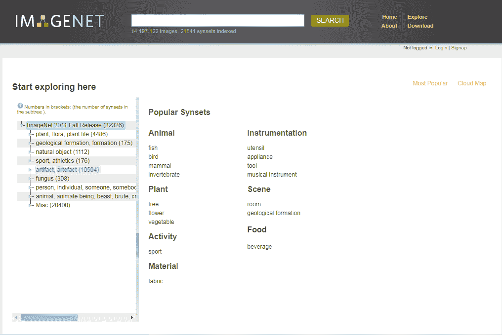
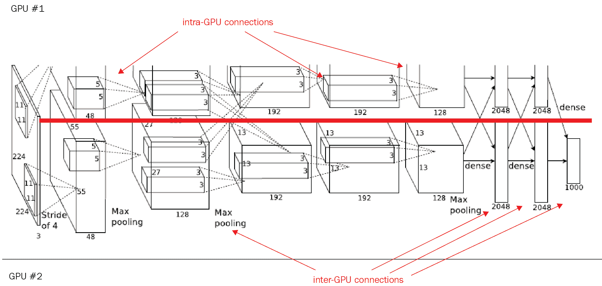
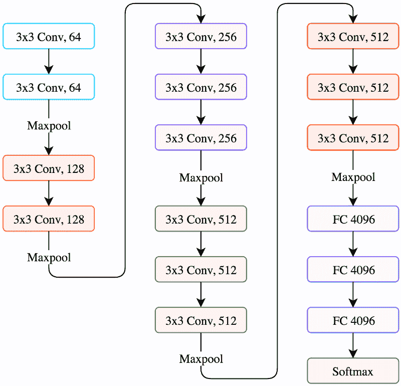
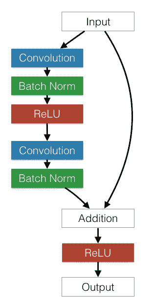

# 流行的 CNN 模型架构

在本章中，将介绍 ImageNet 图像数据库，还将介绍以下流行的 CNN 模型的架构:

*   LeNet
*   AlexNet
*   VGG
*   谷歌网
*   雷斯内特


# ImageNet 简介

ImageNet 是一个数据库，包含大约 22，000 个类别中超过 1，500 万张手工标记的高分辨率图像。这个数据库的组织就像 WordNet 的层次结构，其中每个概念也被称为一个**同义词集**(也就是说，**同义词集**)。每个 synset 都是 ImageNet 层次结构中的一个节点。每个节点有 500 多张图片。

**ImageNet 大规模视觉识别挑战赛** ( **ILSVRC** )成立于 2010 年，旨在改进大规模物体检测和图像分类的最新技术:



在对 ImageNet 进行概述之后，我们现在来看看各种 CNN 模型架构。


# LeNet

2010 年，来自 ImageNet(被称为 **ILSVRC 2010** )的挑战是由 Yann Lecun 构建的 CNN 架构 LeNet 5。该网络将 32×32 的图像作为输入，该图像进入卷积层( **C1** )，然后进入子采样层( **S2** )。如今，子采样层被池层所取代。然后，还有另一个卷积层的序列( **C3** )，接着是汇集(即子采样)层( **S4** )。最后，有三个完全连接的层，包括最后的**输出**层。这个网络用于邮局的邮政编码识别。从那以后，每年都有各种 CNN 架构在这个竞赛的帮助下推出:


LeNet 5–CNN 架构，摘自 Yann le Cun 1998 年的文章

因此，我们可以总结出以下几点:

*   该网络的输入是一幅灰度为 32 x 32 的图像
*   实施的体系结构是 CONV 层，然后是池和全连接层
*   CONV 滤波器为 5 x 5，以 1 的步长应用


# AlexNet 架构

CNN 架构的首次突破出现在 2012 年。这个获奖的 CNN 架构叫做 **AlexNet** 。它是由多伦多大学的 Alex Krizhevsky 和他的教授 Jeffry Hinton 开发的。

在第一次运行中，在该网络中使用了一个 ReLU 激活函数和一个 0.5 的压降来对抗过拟合。正如我们在下图中看到的，在架构中使用了一个标准化层，但在实践中不再使用，因为它使用了大量的数据扩充。AlexNet 由于其相对简单的结构和较小的深度，即使有更精确的网络可用，今天仍在使用。它广泛应用于计算机视觉:


AlexNet 在 ImageNet 数据库上使用两个独立的 GPU 进行训练，可能是由于当时 GPU 间连接的处理限制，如下图所示:



# 基于 AlexNet 的交通标志分类器

在这个例子中，我们将使用迁移学习进行特征提取，并使用德国交通标志数据集来开发分类器。这里使用的是由迈克尔·盖尔卓伊和达维·弗罗萨德实现的 AlexNet，AlexNet 权重来自伯克利视觉和学习中心。完整的代码和数据集可以从这里下载。

AlexNet 期望 227 x 227 x 3 像素的图像，而交通标志图像是 32 x 32 x 3 像素。为了将交通标志图像输入 AlexNet，我们需要将图像调整到 AlexNet 期望的尺寸，即 227 x 227 x 3:

```
original_image = tf.placeholder(tf.float32, (None, 32, 32, 3))
resized_image = tf.image.resize_images(original_imag, (227, 227))
```

我们可以借助 TensorFlow 的`tf.image.resize_images`方法来做到这一点。这里的另一个问题是 AlexNet 是在 ImageNet 数据集上训练的，该数据集有 1000 类图像。所以，我们将用一个 43 个神经元的分类层来代替这一层。为此，计算最后一个完全连接层的输出大小；由于这是一个完全连接的图层，也是一个 2D 形状，因此最后一个元素将是输出的大小。`fc7.get_shape().as_list()[-1]`确实管用；将此与交通标志数据集的类的数量结合起来，得到最终完全连接的图层的形状:`shape = (fc7.get_shape().as_list()[-1], 43)`。代码的其余部分只是在 TensorFlow 中定义全连接层的标准方式。最后，用`softmax`计算概率:

```
#Refer AlexNet implementation code, returns last fully connected layer
fc7 = AlexNet(resized, feature_extract=True)
shape = (fc7.get_shape().as_list()[-1], 43)
fc8_weight = tf.Variable(tf.truncated_normal(shape, stddev=1e-2))
fc8_b = tf.Variable(tf.zeros(43))
logits = tf.nn.xw_plus_b(fc7, fc8_weight, fc8_b)
probs = tf.nn.softmax(logits)
```


# VGGNet 架构

2014 年 ImageNet 挑战赛的亚军是来自牛津大学视觉几何组的 VGGNet。这个卷积神经网络是一个简单而优雅的架构，错误率为 7.3%。它有两个版本:VGG16 和 VGG19。

VGG16 是 16 层神经网络，不算 max pooling 层和 softmax 层。因此，它被称为 VGG16。VGG19 由 19 层组成。在 Keras 中有一个预先训练好的模型可用于 Theano 和 TensorFlow 后端。

这里关键的设计考虑是深度。网络深度的增加是通过增加更多的卷积层来实现的，这是由于所有层中的 3×3 卷积滤波器。此型号的默认图像输入尺寸为 224 x 224 x 3。图像通过卷积层的堆栈，步长为 1 个像素，填充为 1。它在整个网络中使用 3 x 3 卷积。最大池是在一个 2 x 2 像素窗口上完成的，步长为 2，然后是另一个卷积层堆栈，后面是三个完全连接的层。前两个全连接层各有 4096 个神经元，第三个全连接层用 1000 个神经元负责分类。最后一层是 softmax 层。与 AlexNet 大得多的 11 x 11 卷积窗口相比，VGG16 使用小得多的 3 x 3 卷积窗口。所有隐藏层都是用 ReLU 激活函数构建的。架构看起来是这样的:



VGG16 网络架构

由于小的 3×3 卷积滤波器，增加了 VGGNet 的深度。该网络中的参数数量约为 1.4 亿，大部分来自第一个全连接层。在现代架构中，VGGNet 的全连接层被替换为**全局平均池** ( **间隙**)层，以便最大限度地减少参数的数量。

另一个观察结果是过滤器的数量随着图像尺寸的减小而增加。


# VGG16 图像分类代码示例

Keras 应用模块具有预训练的神经网络模型，以及在 ImageNet 上训练的预训练权重。这些模型可直接用于预测、特征提取和微调:

```
#import VGG16 network model and other necessary libraries 

from keras.applications.vgg16 import VGG16
from keras.preprocessing import image
from keras.applications.vgg16 import preprocess_input
import numpy as np

#Instantiate VGG16 and returns a vgg16 model instance 
vgg16_model = VGG16(weights='imagenet', include_top=False) 
#include_top: whether to include the 3 fully-connected layers at the top of the network.
#This has to be True for classification and False for feature extraction. Returns a model instance
#weights:'imagenet' means model is pre-training on ImageNet data.
model = VGG16(weights='imagenet', include_top=True)
model.summary()

#image file name to classify
image_path = 'jumping_dolphin.jpg'
#load the input image with keras helper utilities and resize the image. 
#Default input size for this model is 224x224 pixels.
img = image.load_img(image_path, target_size=(224, 224))
#convert PIL (Python Image Library??) image to numpy array
x = image.img_to_array(img)
print (x.shape)

#image is now represented by a NumPy array of shape (224, 224, 3),
# but we need to expand the dimensions to be (1, 224, 224, 3) so we can
# pass it through the network -- we'll also preprocess the image by
# subtracting the mean RGB pixel intensity from the ImageNet dataset
#Finally, we can load our Keras network and classify the image:

x = np.expand_dims(x, axis=0)
print (x.shape)

preprocessed_image = preprocess_input(x)

preds = model.predict(preprocessed_image)
print('Prediction:', decode_predictions(preds, top=2)[0])
```

第一次执行前面的脚本时，Keras 会自动下载架构权重并缓存到磁盘的`~/.keras/models`目录中。后续运行会更快。


# 谷歌网络架构

2014 年，ILSVRC，谷歌发布了自己的网络，名为 **GoogLeNet** 。它的性能比 VGGNet 好一点；GoogLeNet 的表现是 6.7%，相比之下 VGGNet 的表现是 7.3%。GoogLeNet 主要吸引人的特点是，由于引入了一个叫做 **inception module** 的新概念，运行速度非常快，从而将参数数量减少到只有 500 万个；这比 AlexNet 少 12 倍。它具有更低的内存使用和更低的功耗。

它有 22 层，所以它是一个非常深的网络。添加更多的层会增加参数的数量，并且网络很可能会过拟合。将会有更多的计算，因为过滤器的线性增加导致计算的二次增加。因此，设计者使用先启模块和 GAP。网络末端的全连接层被替换为间隙层，因为全连接层通常容易过度拟合。GAP 没有要学习或优化的参数。


# 架构洞察

GoogLeNet 的设计者没有像以前的架构那样选择特定的过滤器大小，而是在同一个补丁上应用了大小为 1 x 1、3 x 3 和 5 x 5 的所有三个过滤器，最大值为 3 x 3，并连接成一个输出向量。

1×1 卷积的使用减少了因昂贵的 3×3 和 5×5 卷积而增加的计算量。在昂贵的 3×3 和 5×5 卷积之前，使用具有 ReLU 激活功能的 1×1 卷积。

在 GoogLeNet 中，初始模块是一个接一个堆叠在一起的。这种堆叠允许我们修改每个模块，而不影响后面的层。例如，您可以增加或减少任何层的宽度:


谷歌网络架构

深层网络还担心反向传播过程中的**消失梯度**问题。这可以通过向中间层添加辅助分类器来避免。此外，在培训期间，中间损失以 0.3 的贴现因子添加到总损失中。

因为完全连接的层容易过度拟合，所以用间隙层代替。平均池不排除使用 dropout，这是一种克服深度神经网络中过度拟合的正则化方法。GoogLeNet 在 60 之后添加了一个线性层，一个间隙层，以帮助其他人使用迁移学习技术刷出自己的分类器。


# 初始模块

下图是一个 inception 模块的示例:


# ResNet 架构

在一定深度之后，向前馈神经网络增加额外的层会导致更高的训练误差和更高的验证误差。添加层时，性能只会增加到一定深度，然后会迅速下降。在 **ResNet** ( **残差网络**)论文中，作者认为这种欠拟合不太可能是因为消失梯度问题，因为即使使用批量归一化技术也会发生这种情况。因此，他们增加了一个新的概念，叫做**剩余块**。ResNet 团队添加了可以跳过层的连接:

ResNet 使用标准的 convNet，并添加了一次跳过几个卷积层的连接。每个旁路给出一个剩余块。



残余块

2015 年 ImageNet ILSVRC 比赛，获胜者是来自微软的 ResNet，错误率为 3.57%。ResNet 是一种 VGG，在某种意义上，相同的结构不断重复，使网络更深。与 VGGNet 不同，它有不同的深度变化，如 34、50、101 和 152 层。与 AlexNet 8、VGGNet 的 19 层和 GoogLeNet 的 22 层相比，它有多达 152 层。ResNet 体系结构是剩余块的堆栈。主要思想是通过向神经网络添加连接来跳过层。每个残差块具有 3×3 个卷积层。在最后一个 conv 层之后，添加一个间隙层。只有一个全连通层来分类 1000 个类。它有不同的深度变化，例如 ImageNet 数据集的 34、50、101 或 152 层。对于更深的网络，比如说超过 50 层，它使用**瓶颈**特性概念来提高效率。在这个网络中不使用辍学。

需要了解的其他网络架构包括:

*   网络中的网络
*   超越 ResNet
*   无残差超深度神经网络 FractalNet


# 摘要

在这一章中，我们学习了不同的 CNN 架构。这些模型是预先训练的现有模型，并且在网络架构上有所不同。这些网络中的每一个都旨在解决特定于其架构的问题。所以，这里我们描述了他们的建筑差异。

我们也了解了我们自己的 CNN 架构，如前一章所定义的，与这些先进的架构有何不同。

在下一章，我们将学习如何将这些预先训练好的模型用于迁移学习。