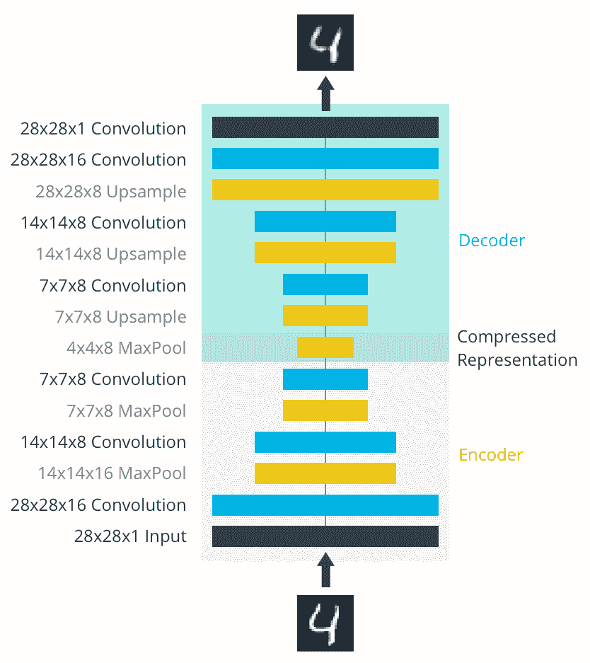

# CNN 的自编码器

在本章中，我们将讨论以下主题:

*   自编码器简介
*   卷积自编码器
*   自编码器的应用
*   压缩的一个例子

# 自编码器简介

自编码器是一种常规的神经网络，是一种无监督的学习模型，它接受输入并在输出层产生相同的输入。因此，在训练数据中没有关联的标签。通常，自编码器由两部分组成:

*   编码器网络
*   解码器网络

它从未标记的训练数据中学习所有需要的特征，这被称为低维特征表示。在下图中，输入数据( *x* )通过一个编码器，该编码器产生输入数据的压缩表示。数学上，方程中， *z = h(x)* ，*z* 是一个特征向量，通常是比 *x* 更小的维数。

然后，我们从输入数据中提取这些产生的特征，并通过解码器网络来重建原始数据。

编码器可以是全连接神经网络，也可以是**卷积神经网络** ( **CNN** )。解码器也使用与编码器相同的网络。这里，我们已经使用 ConvNet 解释并实现了编码器和解码器功能:

损失函数: *||x - x|| ²*

在这个网络中，输入层和输出层的大小是相同的。

# 卷积自编码器

卷积自编码器是一种神经网络(无监督学习模型的特殊情况),它被训练为在输出层中再现其输入图像。图像通过编码器，编码器是一个 ConvNet，它产生图像的低维表示。解码器是另一个示例 ConvNet，它接收压缩图像并重建原始图像。

编码器用于压缩数据，解码器用于再现原始图像。因此，自编码器可以用于数据压缩。压缩逻辑是特定于数据的，这意味着它是从数据中学习的，而不是从 JPEG、MP3 等预定义的压缩算法中学习的。自编码器的其他应用可以是图像去噪(从损坏的图像中产生更干净的图像)、维数减少和图像搜索:

在输入大小和目标大小必须相同的意义上，这不同于常规的神经网络或神经网络。

# 应用程序

自编码器用于降维、数据压缩和图像去噪。反过来，降维有助于提高运行时性能，并消耗更少的内存。图像搜索在低维空间中会变得非常高效。

# 压缩的一个例子

网络架构包括一个编码器网络，这是一个典型的卷积金字塔。每个卷积层之后是最大池层；这减少了层的尺寸。

解码器将输入从稀疏表示转换为宽重建图像。此处显示了网络示意图:

编码器层输出图像大小为 4 x 4 x 8 = 128。原始图像大小为 28 x 28 x 1 = 784，因此压缩后的图像向量大约是原始图像大小的 16%。

通常，您会看到转置卷积图层用于增加图层的宽度和高度。它们的工作原理与卷积层几乎完全相同，但工作原理相反。输入层中的步幅导致转置卷积层中的步幅更大。例如，如果您有一个 3 x 3 内核，输入层中的 3 x 3 补丁将减少到卷积层中的一个单元。相比之下，输入层中的一个单元将在转置卷积层中扩展为 3 x 3 路径。TensorFlow API 为我们提供了创建图层的简单方法:`tf.nn.conv2d_transpose`，点击此处，[https://www . tensor flow . org/API _ docs/python/TF/nn/conv2d _ transpose](https://www.tensorflow.org/api_docs/python/tf/nn/conv2d_transpose)。

# 摘要

本章开始时，我们简要介绍了自编码器，并在 ConvNets 的帮助下实现了编码器和解码器功能。

然后，我们转向卷积自编码器，了解它们与常规的卷积神经网络和神经网络有何不同。

我们通过一个例子介绍了自编码器的不同应用，并看到了自编码器如何提高低维空间中图像搜索的效率。

在下一章中，我们将学习用细胞神经网络进行物体检测，并了解物体检测和物体分类之间的区别。