# CNN 与视觉模型的注意力机制

从我们需要从中获得的洞察力的角度来看，并不是图像或文本中的所有东西——或者一般来说，任何数据——都同样相关。例如，考虑一个任务，我们试图预测一个冗长语句序列中的下一个单词，如*爱丽丝和艾莉亚是朋友。爱丽丝住在法国，在巴黎工作。阿利亚是英国人，在伦敦工作。爱丽丝喜欢买用法语写的书，而艾丽娅喜欢用 _____ 语写的书。*

当这个例子给人类看时，即使一个语言能力不错的孩子也能很好地预测下一个单词很可能是*英语*。在数学上，并且在深度学习的上下文中，这可以类似地通过创建这些单词的向量嵌入来确定，然后使用向量数学来计算结果，如下所示:


这里， *V(Word)* 为所需单词的向量嵌入；类似地， *V(法语)*、 *V(巴黎)*和 *V(伦敦)*分别是单词*法语*、*巴黎*和*伦敦*所需的向量嵌入。

嵌入(通常)是输入或输入索引(对于非数字数据)的较低维度和密集(数字)向量表示；在这种情况下，文本。

像`Word2Vec`和`glove`这样的算法可以用来获得词嵌入。在流行的基于 Python 的 NLP 库中，如 SpaCy、Gensim 和其他可以使用大多数深度学习库(如 Keras、TensorFlow 等)训练的通用文本模型的预训练变体。

嵌入的概念与视觉和图像的关系和与文本的关系一样密切。

可能不存在与我们刚刚以形式获得的向量完全匹配的现有向量；但如果我们试图找到最接近如此获得的存在的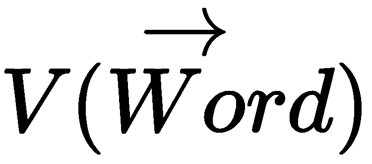的一个，并使用反向索引找到代表性的单词，该单词很可能与我们人类早先想到的相同，即*英语*。

诸如余弦相似性的算法可以用来获得最接近计算出的向量的向量。

为了实现，一种计算上更有效的寻找最近向量的方法是**近似最近邻居** ( **安**)，在 Python 的`annoy`库中可用。

尽管我们通过认知和深度学习的方法得到了相同的结果，但两种情况下的输入是不一样的。对于人类来说，我们已经给出了与计算机一样的准确句子，但对于深度学习应用来说，我们已经仔细挑选了正确的单词(*法语*、*巴黎*和*伦敦*)以及它们在等式中的正确位置，以获得结果。想象一下，为了理解正确的上下文，我们如何能够非常容易地意识到要注意正确的单词，因此我们有了结果；但在目前的形式下，我们的深度学习方法不可能做到这一点。

现在在语言建模中有相当复杂的算法，分别使用 RNN 的不同变体和架构，比如 LSTM 和 Seq2Seq。这些本来可以解决这个问题，得到正确的解决方案，但是在更短更直接的句子中最有效，比如*巴黎之于法语就像伦敦之于 _____* 。为了正确理解长句子并生成正确的结果，重要的是要有一种机制来教导体系结构，从而在长单词序列中需要更加注意特定的单词。这被称为深度学习中的**注意力机制**，它适用于许多类型的深度学习应用，但方式略有不同。

**RNN** stands for **recurrent neural networks** and is used to depict a temporal sequence of data in deep learning. Due to the vanishing gradient problem, RNN is seldom used directly; instead, its variants, such as **LSTM** (**Long-Short Term Memory**) and **GRU** (**Gated Recurrent Unit**) are more popular in actual implementations.**Seq2Seq** stands for **Sequence-to-Sequence** models and comprises two RNN (or variant) networks (hence it is called **Seq2Seq**, where each RNN network represents a sequence); one acts as an encoder and the other as a decoder. The two RNN networks can be multi-layer or stacked RNN networks, and they are connected via a thought or context vector. Additionally, Seq2Seq models may use the attention mechanism to improve performance, especially for longer sequences. 

事实上，更准确地说，甚至我们不得不层层处理前面的信息，首先理解最后一句话是关于 Alya 的。然后我们可以识别和提取 Alya 的城市，然后是 Alice 的城市，以此类推。这种人类思维的分层方式类似于深度学习中的堆叠，因此在类似的应用中，堆叠架构非常常见。

要了解更多关于堆叠在深度学习中如何工作的信息，特别是基于序列的架构，请探索堆叠 RNN 和堆叠注意力网络等主题。

在本章中，我们将讨论以下主题:

*   图像字幕的注意力机制
*   关注类型(硬性和软性关注)
*   利用注意力改善视觉模型
    *   视觉注意的循环模型


# 图像字幕的注意力机制

到目前为止，从介绍中，您必须清楚注意力机制对一系列对象起作用，为序列中的每个元素分配一个权重，用于所需输出的特定迭代。每下一步，不仅顺序会改变，注意力机制中的权重也会改变。因此，基于注意力的架构本质上是序列网络，最好在使用 rnn(或其变体)的深度学习中实现。

现在的问题是:我们如何在静态图像上实现基于序列的注意力，特别是在一个**卷积神经网络** ( **CNN** )中表示的图像？好吧，让我们举一个位于文本和图像之间的例子来理解这一点。假设我们需要根据图片的内容为图片添加标题。

我们有一些由人类提供的带有字幕的图像作为训练数据，使用这些数据，我们需要创建一个系统，可以为模型之前没有看到的任何新图像提供像样的字幕。如前所述，让我们举一个例子，看看我们作为人类将如何看待这项任务以及需要在深度学习和 CNN 中实现的类似过程。让我们考虑下面的图片，并为它构思一些合理的标题。我们还将使用人类判断对它们进行启发式排序:

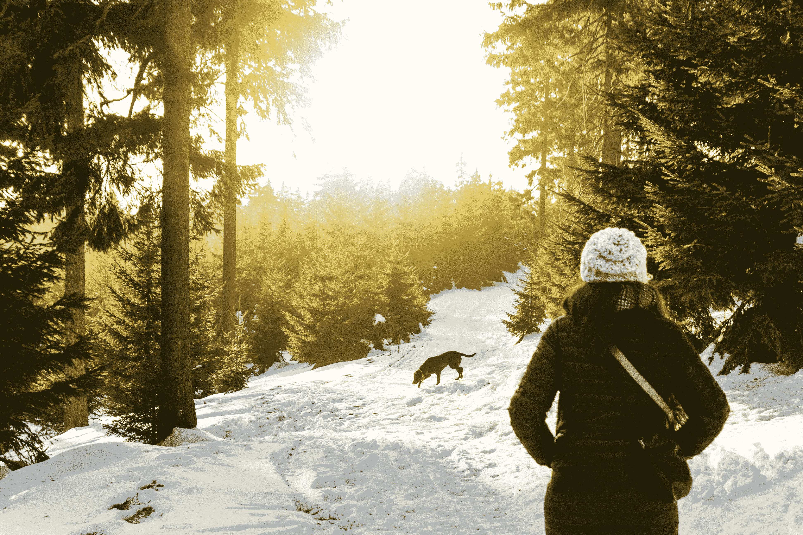

一些可能的标题(按可能性从大到小的顺序排列)是:

*   雪林中的女人看狗
*   雪地里的棕色狗
*   一个人戴着帽子在树林和白色的土地
*   狗、树、雪、人和阳光

这里要注意的一件重要事情是，尽管事实上女人是图像的中心，狗不是图像中最大的对象，我们寻找的标题可能集中在他们身上，然后是他们的周围环境。这是因为我们认为它们是这里的重要实体(没有给定以前的上下文)。因此，作为人类，我们是如何得出这一结论的:我们首先扫视了整个图像，然后以高分辨率聚焦于女子，同时将一切置于背景中(假设双摄像头手机中有**散景**效果)。我们确定了字幕部分，然后是高分辨率的狗，而其他部分都是低分辨率的；我们添加了标题部分。最后，我们对环境和标题部分做了同样的处理。

所以本质上，我们看到它在这个序列中到达第一个标题:

 

图 1:先浏览一下图片

 

图 2:关注女性


图 3:专注于狗

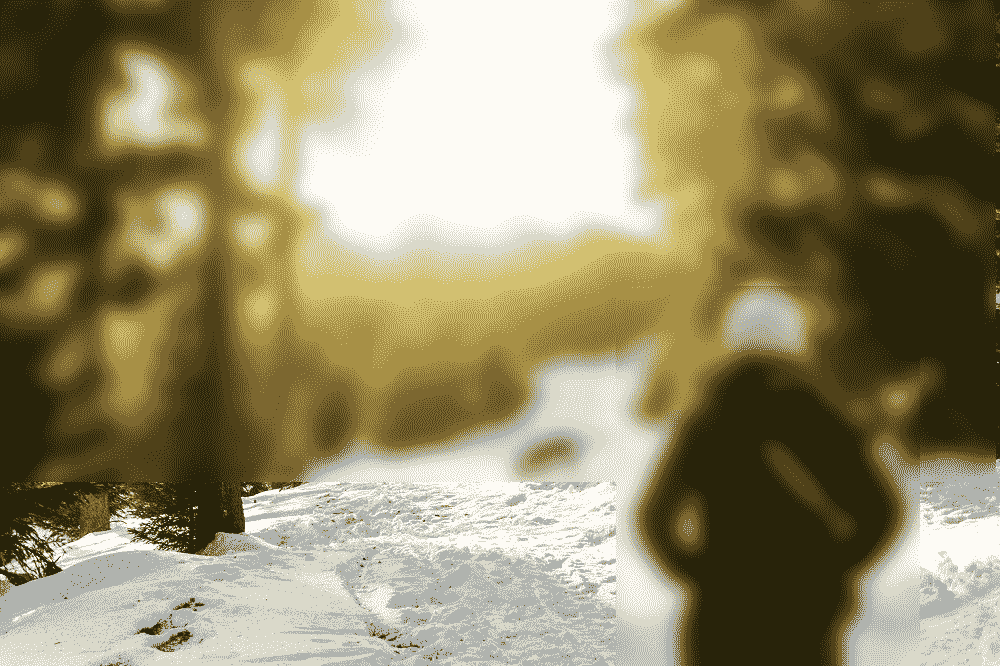

图 4:聚焦雪

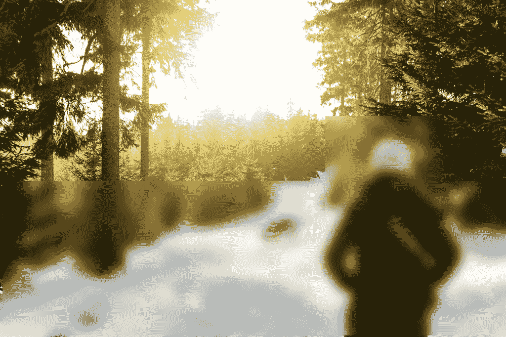

图 5:关注森林

就注意力或焦点的权重而言，在浏览图像后，我们聚焦于第一个最重要的对象:这里的女人。这类似于创建一个心理框架，在这个框架中，我们将图像中有女人的部分放在高分辨率中，而将图像的其余部分放在低分辨率中。

在深度学习参考中，对于序列的这一部分，注意力序列对于表示女性概念的向量(嵌入)将具有最高权重。在输出/序列的下一步中，权重将更多地向狗的向量表示移动，等等。

为了直观地理解这一点，我们将以 CNN 形式表示的图像转换成扁平向量或其他类似结构；然后，我们用不同分辨率的不同部分创建图像或序列的不同拼接。此外，正如我们现在从第七章、*的讨论中了解到的那样，我们必须有相关的部分，我们需要在不同的尺度上进行检测，以便进行有效的检测。同样的概念也适用于这里，除了分辨率，我们也改变规模；但是现在，为了直观的理解，我们将保持简单，忽略比例部分。*

这些图像的拼接或序列现在充当了一个单词序列，如在我们之前的例子中，因此，为了引起注意，它们可以在 RNN/LSTM 或类似的基于序列的架构中处理。这样做是为了在每次迭代中得到最合适的单词作为输出。因此，序列的第一次迭代导致女人(根据序列的权重，该序列表示在*图像 2* 中被表示为*女人*的物体)→然后下一次迭代为→ *看见*(根据序列识别*女人*的背部，如在*图像 2* 中)→ *狗*(序列如在*图像 3* 中) →中的*(从一切都模糊生成*填充符*文字从实体过渡到周围的序列)→ *雪*(序列如*图像 4* ) → *森林*(序列如*图像 5* )。*

当最佳图像拼接/序列映射到人工生成的字幕跨几幅图像完成时，还可以自动学习填充词，如中的*和动作词，如*看见*。但对于更简单的版本，诸如*女人*、*狗*、*雪*、*森林*等标题也可以很好地描绘图像中的实体和周围环境。*


# 注意力的类型

有两种类型注意力机制。它们如下:

*   强烈的关注
*   柔和的注意力

现在，让我们在接下来的几节中详细了解一下每一项。


# 强烈的关注

实际上，在我们最近的图像标题示例中，会选择更多的图片，但是由于我们的手写标题训练，这些图片的权重不会更高。然而，需要理解的重要一点是，系统如何理解所有像素(或者更准确地说，它们的 CNN 表示)的焦点，以绘制这些不同方面的高分辨率图像，然后如何选择下一个像素来重复该过程。

在前面的示例中，从分布中随机选择点，并重复该过程。此外，该点周围的哪些像素获得更高的分辨率是由注意力网络内部决定的。这种注意力被称为**硬注意力**。

硬注意有个东西叫做**可微性问题**。让我们花些时间来理解这一点。我们知道，在深度学习中，网络必须被训练，为了训练它们，我们在训练批次之间迭代，以最小化损失函数。我们可以通过在最小值的梯度方向上改变权重来最小化损失函数，这又是在对损失函数进行微分后得到的*。*

从最后一层到第一层，这种最小化深层网络各层损耗的过程被称为**反向传播**。

深度学习和机器学习中使用的一些可微分损失函数的示例是对数似然损失函数、平方误差损失函数、二项式和多项式交叉熵等。

然而，由于这些点是在硬注意的每次迭代中随机选择的——并且由于这种随机像素选择机制不是可微分的函数——我们本质上不能训练这种注意力机制，正如所解释的。这个问题可以通过使用**强化学习** ( **RL** )或者切换到软注意来解决。

RL 包括解决两个问题的机制，或者分开解决，或者结合解决。第一个被称为**控制问题**，它确定代理在给定其状态的每一步中应该采取的最佳行动，第二个是**预测问题**，它确定状态的最佳*值*。


# 柔和的注意力

正如前面关于硬注意的小节所介绍的，软注意使用 RL 来逐步训练和确定下一步去哪里寻找(控制问题)。

使用硬注意和 RL 的组合来实现所要求的目标存在两个主要问题:

*   涉及 RL 并分别训练 RL 代理和基于其的 RNN/深度网络变得稍微复杂。
*   策略函数的梯度中的方差不仅高(如在 **A3C** 模型中)，而且具有 *O(N)* 的计算复杂度，其中 *N* 是网络中单元的数量。这大大增加了这种方法的计算量。此外，考虑到注意力机制在过长的序列(单词或图像嵌入拼接)中增加了更多的价值，并且训练涉及较长序列的网络需要更大的内存，因此需要更深的网络，这种方法在计算上不是很有效。

RL 中的**策略函数**，确定为 *Q(a，s)* ，是用于确定在任意给定状态 *(s)* 下应采取的最优策略或行动 *(a)* 以使报酬最大化的函数。

那么还有什么选择呢？正如我们所讨论的，问题出现了，因为我们选择的注意力机制导致了一个不可微的函数，因此我们必须使用 RL。所以让我们在这里采取不同的方法。以我们之前的语言建模问题为例(如在*注意力机制-直觉*部分中),我们假设我们有注意网络中存在的对象/单词的标记向量。此外，在相同的向量空间中(比如在嵌入多维空间中)，我们在特定序列步骤的所需查询中引入对象/单词的标记。在采用这种方法时，相对于查询空间中的标记，为注意网络中的标记找到正确的注意权重就像计算它们之间的向量相似度一样容易；例如余弦距离。幸运的是，大多数向量距离和相似度函数都是可微的；因此，通过在这样的空间中使用这样的向量距离/相似性函数导出的损失函数也是可微的，并且我们的反向传播可以在这种情况下工作。

在多维(在这个例子中是三个)向量空间中，两个向量之间的余弦距离，比如说和，被给定为:

这种使用可微分损失函数来训练注意力网络的方法被称为**软注意力**。


# 利用注意力改善视觉模型

正如我们在前面关于注意力机制-直觉的章节中的 NLP 例子中所发现的，注意力确实在实现新的用例方面帮助了我们很多，这在传统的 NLP 中是不可行的，并且极大地提高了现有 NLP 机制的性能。CNN 和视觉模型对注意力的使用也是如此

在前面的章节[第 7 章](20952d99-3977-420f-a5c7-a3320b96bed6.xhtml)、*对象检测&实例-CNN*中，我们发现了注意力(like)机制如何被用作快速 R-CNN 和屏蔽 R-CNN 等网络的区域建议网络，以极大地增强和优化建议的区域，并能够生成分段屏蔽。这对应于讨论的第一部分。在本节中，我们将讨论讨论的第二部分，我们将使用“注意力”机制来改善我们的 CNN 的性能，即使是在极端条件下。


# 视觉 CNN 模型次优性能的原因

通过采用适当的调整和设置机制，CNN 网络的性能可以在一定程度上得到改善，例如:数据预处理、批量归一化、权重的最佳预初始化；选择正确的激活函数；使用诸如正则化之类的技术来避免过度拟合；使用最佳优化函数；以及用大量(优质)数据进行训练。

除了这些培训和与架构相关的决策之外，还有一些与图像相关的细微差别，因此视觉模型的性能可能会受到影响。即使在控制了上述训练和架构因素之后，传统的基于 CNN 的图像分类器在与底层图像相关的以下一些条件下也不能很好地工作:

*   非常大的图像
*   具有大量分类实体的高度混乱的图像
*   非常嘈杂的图像

让我们试着理解在这些条件下次优性能背后的原因，然后我们将从逻辑上理解什么可能修复这个问题。

在传统的基于 CNN 的模型中，即使在跨层缩减之后，计算复杂度也相当高。其实复杂度是的量级，其中 *L* 和 *W* 是图像的长宽，单位是英寸， *PPI* 是每英寸的像素(像素密度)。这转化为相对于图像中像素总数( *P* )或 *O(P)* 的线性复杂度。这直接回答了挑战的第一点；对于更高的 *L* 、 *W* 或 *PPI* ，我们需要高得多的计算能力和时间来训练网络。

相对于在实际图像上执行的跨所有层的所有计算，诸如最大池化、平均池化等操作有助于大幅降低计算负荷。

如果我们想象 CNN 每一层中形成的模式，我们就会理解 CNN 工作背后的直觉，以及为什么它需要深入。在每个后续层中，CNN 训练更高的概念特征，这可以逐步更好地帮助理解图像层中的对象。因此，在 MNIST 的情况下，第一层可能只识别边界，第二层是边界的对角线和基于直线的形状，等等:


MNIST CNN 不同(初始)层中形成的说明性概念特征


MNIST 是一个简单的数据集，而现实生活中的图像非常复杂；这需要更高的概念特征来区分它们，因此需要更复杂、更深入的网络。此外，在 MNIST，我们试图区分相似类型的对象(所有手写数字)。然而在现实生活中，对象可能有很大的不同，因此对所有这些对象建模可能需要的不同类型的特征将非常多:

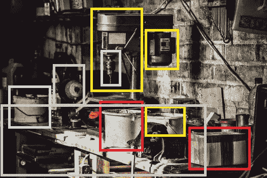

这给我们带来了第二个挑战。具有太多对象的杂乱图像需要非常复杂的网络来模拟所有这些对象。此外，由于有太多的对象需要识别，因此图像分辨率需要足够高，以便正确提取和映射每个对象的特征，这又意味着图像大小和像素数量需要足够高，以便进行有效的分类。这反过来又通过结合前两个挑战成倍地增加了复杂性。

这些年来，ImageNet 挑战赛中使用的层的数量以及常见 CNN 架构的复杂性一直在增加。例如，vgg 16–Oxford(2014)有 16 层，GoogLeNet (2014)有 19 层，ResNet (2015)有 152 层。

不是所有的图像都是完美的单反质量。通常，由于光线不足、图像处理、低分辨率、缺乏稳定性等原因，图像中可能会引入大量噪声。这只是噪音的一种形式，一种更容易理解的形式。从 CNN 的角度来看，另一种形式的噪声可以是图像过渡、旋转或变换:

 

无噪声图像

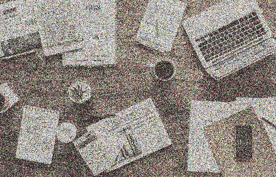 

添加了噪点的相同图像

在前面的图像中，尝试在无噪声和有噪声的情况下阅读图像中的报纸标题*业务*，或者在两幅图像中识别手机。在有噪声的图像中很难做到这一点，对吗？类似的是我们的 CNN 在有噪声图像的情况下的检测/分类挑战。

即使有详尽的训练、完美的超参数调整以及诸如退出等技术，这些现实生活中的挑战继续降低 CNN 网络的图像识别准确性。现在我们已经理解了 CNN 缺乏准确性和性能背后的原因和直觉，让我们探索一些使用视觉注意力来缓解这些挑战的方法和架构。


# 视觉注意的循环模型

*视觉注意力的循环模型*可以用来回答我们在前面章节中提到的一些挑战。这些模型使用硬注意力方法，如前面的(*注意力类型*)部分所述。这里我们使用视觉注意力循环模型的一个流行变体，**循环注意力模型** ( **RAM** )。

如前所述，硬注意问题是不可微的，必须使用 RL 来解决控制问题。因此，RAM 使用 RL 进行优化。

视觉注意力的循环模型不会一次处理整个图像，甚至不会处理基于滑动窗口的边界框。它模仿人眼，工作原理是在图像的不同位置*凝视*的*注视*概念；随着每一次*注视*，它递增地组合重要信息，以动态地建立图像中场景的内部表示。它使用 RNN 以连续的方式做到这一点。

该模型基于 RL 代理的控制策略选择下一个要注视的位置，以基于当前状态最大化回报。反过来，当前状态是所有过去信息和任务需求的函数。因此，它找到下一个坐标用于固定，使得它可以最大化奖励(任务的需求)，给定到目前为止在 RNN 的存储器快照中的先前凝视和先前访问的坐标之间收集的信息。

大多数 RL 机制使用**马尔可夫决策过程** ( **MDP** )，其中下一个动作仅由当前状态决定，而不考虑先前访问的状态。通过在这里使用 RNN，来自先前*注视*的重要信息可以在当前状态本身中组合。

前面的机制解决了 CNN 在前面部分强调的最后两个问题。此外，在 RAM 中，可以独立于输入图像的大小来控制参数的数量和它执行的计算量，从而也解决了第一个问题。


# 将 RAM 应用于有噪声的 MNIST 样本

为了更详细地理解 RAM 的工作原理，让我们试着创建一个 MNIST 样本，它包含了前面部分中强调的一些问题:


嘈杂和扭曲的 MNIST 的大图

前面的图像代表了一个更大的图像/拼贴，使用了一个 MNIST 图像(编号为 **2** )的实际和轻微噪声的样本，以及许多其他失真和其他部分样本的片段。此外，这里的实际数字 **2** 没有居中。这个例子代表了前面提到的所有问题，但是它很简单，足以理解 RAM 的工作原理。

RAM 使用了一个**的概念，一个传感器**。RL 代理将其凝视固定在特定坐标( *l* )和特定时间( *t-1* )。图像 *x [t] 这些在时间 *t-1* 提取的表象，统称为*p(x[t]， *l [t-1] )* :**

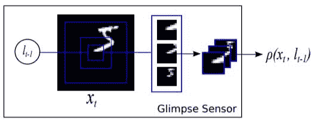

微光传感器的概念

  ;

这些图像显示了我们使用**扫视传感器**在两次注视下的图像表现。

从**扫视传感器**获得的图像通过扫视网络，该网络在两个阶段使图像变平。在第一阶段，分别展平来自**扫视传感器**和**扫视网络**的表示(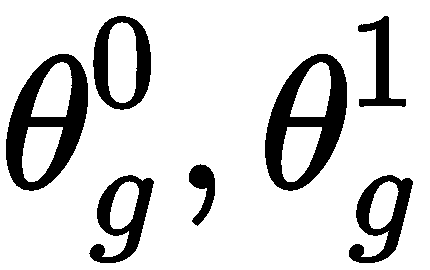，然后将它们组合成一个单一展平层(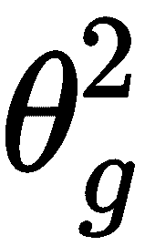)以生成时间 *t* 的输出表示*g[t]t*:

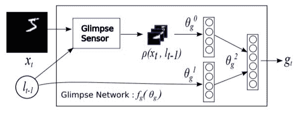

惊鸿一瞥网络的概念

这些输出表示然后通过 RNN 模型架构传递。迭代中的下一步的固定由 RL 代理确定，以最大化来自该架构的回报:

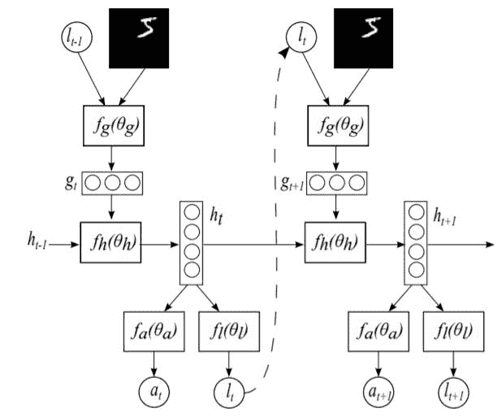

建筑模型(RNN)

可以直观地理解，Glimpse 传感器捕捉跨注视的重要信息，这可以帮助识别重要的概念。例如，由我们的第二个样本图像表示的注视点处的多分辨率(这里是 3 个)表示具有标记的三个分辨率(按照分辨率递减的顺序为红色、绿色和蓝色)。可以看出，即使直接使用这些，我们也有不同的能力来检测这个嘈杂的拼贴所代表的正确数字:


# 代码中的 Glimpse 传感器

如前所述，Glimpse 传感器是一个强大的概念。结合其他概念，如 RNN 和 RL，如前所述，它是提高可视化模型性能的核心。

让我们在这里更详细地看看这个。为便于理解，代码的每一行都有注释，并且一目了然:

```

import tensorflow as tf
# the code is in tensorflow
import numpy as np

def glimpseSensor(image, fixationLocation):
    '''
    Glimpse Sensor for Recurrent Attention Model (RAM)
    :param image: the image xt
    :type image: numpy vector
    :param fixationLocation: cordinates l for fixation center
    :type fixationLocation: tuple
    :return: Multi Resolution Representations from Glimpse Sensor
    :rtype:
    '''

    img_size=np.asarray(image).shape[:2]
    # this can be set as default from the size of images in our dataset, leaving the third 'channel' dimension if any

    channels=1
    # settings channels as 1 by default
    if (np.asarray(img_size).shape[0]==3):
        channels=np.asarray(image).shape[-1]
    # re-setting the channel size if channels are present

    batch_size=32
    # setting batch size

    loc = tf.round(((fixationLocation + 1) / 2.0) * img_size)
    # fixationLocation coordinates are normalized between -1 and 1 wrt image center as 0,0

    loc = tf.cast(loc, tf.int32)
    # converting number format compatible with tf

    image = tf.reshape(image, (batch_size, img_size[0], img_size[1], channels))
    # changing img vector shape to fit tf

    representaions = []
    # representations of image
    glimpse_images = []
    # to show in window

    minRadius=img_size[0]/10
    # setting the side size of the smallest resolution image
    max_radius=minRadius*2
    offset = 2 * max_radius
    # setting the max side and offset for drawing representations
    depth = 3
    # number of representations per fixation
    sensorBandwidth = 8
    # sensor bandwidth for glimpse sensor

    # process each image individually
    for k in range(batch_size):
        imageRepresentations = []
        one_img = image[k,:,:,:]
        # selecting the required images to form a batch

        one_img = tf.image.pad_to_bounding_box(one_img, offset, offset, max_radius * 4 + img_size, max_radius * 4 + img_size)
        # pad image with zeros for use in tf as we require consistent size

        for i in range(depth):
            r = int(minRadius * (2 ** (i)))
            # radius of draw
            d_raw = 2 * r
            # diameter

            d = tf.constant(d_raw, shape=[1])
            # tf constant for dia

            d = tf.tile(d, [2])
            loc_k = loc[k,:]
            adjusted_loc = offset + loc_k - r
            # location wrt image adjusted wrt image transformation and pad

            one_img2 = tf.reshape(one_img, (one_img.get_shape()[0].value, one_img.get_shape()[1].value))
            # reshaping image for tf

            representations = tf.slice(one_img2, adjusted_loc, d)
            # crop image to (d x d) for representation

            representations = tf.image.resize_bilinear(tf.reshape(representations, (1, d_raw, d_raw, 1)), (sensorBandwidth, sensorBandwidth))
            # resize cropped image to (sensorBandwidth x sensorBandwidth)

            representations = tf.reshape(representations, (sensorBandwidth, sensorBandwidth))
            # reshape for tf

            imageRepresentations.append(representations)
            # appending the current representation to the set of representations for image

        representaions.append(tf.stack(imageRepresentations))

    representations = tf.stack(representations)

    glimpse_images.append(representations)
    # return glimpse sensor output
    return representations
```


# 参考

1.  Kelvin Xu，Jimmy Ba，Ryan Kiros，Kyunghyun Cho，Aaron C .，Ruslan Salakhutdinov，Richard S. Zemel，Yoshua Bengio，Show，Attend and Tell: *带视觉注意的神经图像字幕生成*，CoRR，arXiv:1502.03044，2015。
2.  卡尔·莫里茨·赫尔曼，汤姆的科西斯克，爱德华·格雷芬斯特特，拉塞·埃斯佩霍尔特，威尔·凯，穆斯塔法·苏莱曼，菲尔·布伦松，*教机器阅读和理解*，CoRR，arXiv:1506.03340，2015。
3.  Volodymyr Mnih，Nicolas Heess，Alex Graves，Koray Kavukcuoglu，*视觉注意的循环模型*，CoRR，arXiv:1406.6247，2014。
4.  、张汉旺、、、聂、邵剑、蔡达生、SCA-CNN: *卷积网络中图像字幕的空间和信道注意*，CoRR，arXiv:1611.05594，2016。
5.  、王江、陈良杰、高浩源、、拉姆·内瓦蒂亚、美国广播公司-美国有线电视新闻网:*一种基于注意力的卷积神经网络用于视觉问题回答*，CoRR，arXiv:1511.05960，2015。
6.  尹，塞巴斯蒂安·埃伯特，辛里奇·舒茨，*用于机器理解的基于注意力的卷积神经网络*，CoRR，arXiv:1602.04341，2016。
7.  尹，辛里奇·舒茨，冰翔，周博文，ABCNN: *基于注意的卷积神经网络用于句子对建模*，CoRR，arXiv:1512.05193，2015 .
8.  杨子超，，高剑锋，，Alexander J. Smola，*用于图像问答的堆叠注意网络*，CoRR，arXiv:1511.02274，2015。

9.  Y.陈，d .赵，l .吕，c .李，*一种基于视觉注意的卷积神经网络用于图像分类*， *2016 第 12 届世界智能控制与自动化大会(WCICA)* ，桂林，2016，第 764-769 页。
10.  H.郑，j .傅，t .梅，j .罗，【学习多注意卷积神经网络用于细粒度图像识别】， *2017 年 IEEE 计算机视觉国际会议(ICCV)* ，威尼斯，2017，第 5219-5227 页。
11.  肖天军，徐一冲，，杨，，彭宇新，*两级注意模型在深度卷积神经网络中的应用*，CoRR，arXiv:1411.6447，2014。
12.  Jlindsey15，*递归注意模型*的 TensorFlow 实现，GitHub，[https://github.com/jlindsey15/RAM](https://github.com/jlindsey15/RAM)，2018 年 2 月。
13.  QihongL，*递归注意模型的 TensorFlow 实现*，GitHub，[https://github.com/QihongL/RAM](https://github.com/QihongL/RAM)，2018 年 2 月。
14.  阿马斯基，*重复注意模型*，GitHub，[https://github.com/amasky/ram](https://github.com/amasky/ram)，2018 年 2 月。


# 摘要

注意力机制是当今深度学习中最热门的话题，被认为是当前研究中大多数前沿算法的核心，也是未来可能的应用。通过使用这种方法，诸如图像字幕、视觉问答等许多问题都得到了很好的解决。事实上，注意力并不局限于视觉任务，而是更早地被设想用于诸如神经机器翻译和其他复杂的 NLP 问题。因此，理解注意力机制对于掌握许多高级深度学习技术至关重要。

CNN 不仅用于视觉，还用于许多关注解决复杂 NLP 问题的良好应用，如**建模句子对和机器翻译**。本章介绍了注意力机制及其在一些 NLP 问题中的应用，以及图像字幕和循环视觉模型。在 RAMs 中，我们没有使用 CNN 相反，我们将 RNN 和注意力应用于来自 Glimpse 传感器的图像的缩小尺寸表示。但是最近也有一些工作关注基于 CNN 的视觉模型。

强烈鼓励读者浏览参考文献中的原始论文，并探索使用注意力的高级概念，如多层次注意力、堆叠注意力模型和 RL 模型的使用(如针对硬注意力控制问题的**异步优势演员评论家** ( **A3C** )模型)。