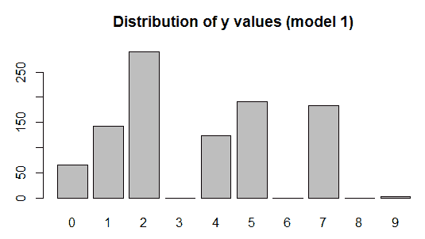
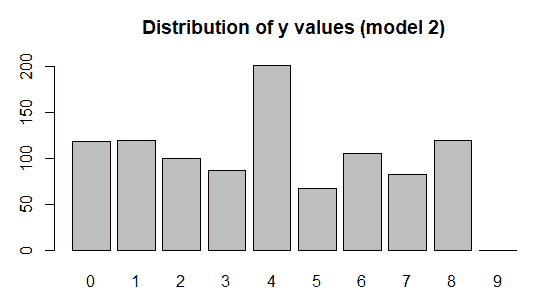
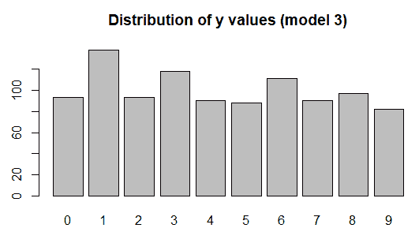
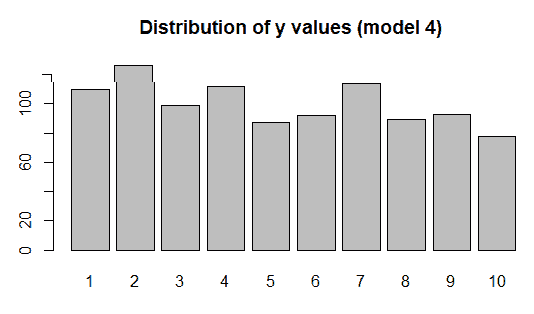
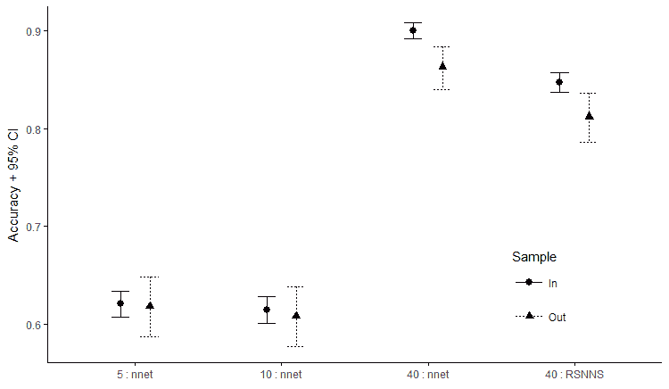
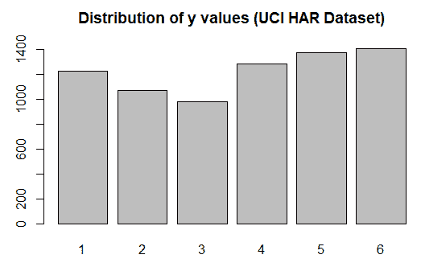

# 二、训练预测模型

本章通过实际操作的例子向您展示了如何在 R 中构建和训练基本的神经网络，并展示了如何为模型评估不同的超参数以找到最佳集合。深度学习中的另一个重要问题是处理过度拟合，即模型在它被训练的数据上表现良好，但在看不见的数据上表现不佳。我们将在本章中简要介绍这个主题，并在[第 3 章](6e6dd858-9f00-454a-8434-a95c59e85b25.xhtml)、*深度学习基础*中更深入地讨论它。本章以一个用例结束，该用例将智能手机的活动数据分类为行走、上下楼梯、坐着、站着或躺着。

本章涵盖以下主题:

*   R 中的神经网络
*   二元分类
*   可视化神经网络
*   使用 nnet 和 RSNNS 包的多分类
*   过度拟合数据的问题——解释的结果
*   用例—构建和应用神经网络


# R 中的神经网络

我们将在这一部分建立几个神经网络。首先，我们将使用 neuralnet 包来创建一个我们可以可视化的神经网络模型。我们还将使用`nnet`和`RSNNS` (Bergmeir，c .和 Benitez，J. M. (2012))包。这些是标准的 R 包，可以通过`install.packages`命令或者从 RStudio 的 packages 面板安装。虽然可以直接使用`nnet`包，但是我们打算通过`caret`包来使用，它是**分类和回归训练**的简称。`caret`包提供了一个标准化的接口来与 R 中的许多**机器学习** ( **ML** )模型一起工作，并且还具有一些用于验证和性能评估的有用特性，我们将在本章和下一章中使用这些特性。

对于我们构建神经网络的第一个例子，我们将使用`MNIST`数据集，这是一个经典的分类问题:基于图片识别手写数字。数据可以从 Apache MXNet 网站下载([https://Apache-MXNet . S3-accelerate . dual stack . Amazon AWS . com/R/data/mnist _ CSV . zip](https://apache-mxnet.s3-accelerate.dualstack.amazonaws.com/R/data/mnist_csv.zip))。它采用 CSV 格式，其中数据集或要素的每一列都代表图像中的一个像素。每幅图像有 784 个像素(28 x 28)，像素为灰度，范围从 0 到 255。第一列包含数字标签，其余是像素值，用于分类。


# 构建神经网络模型

代码在本书代码的`Chapter2`文件夹中。如果你还没有下载并解压代码，回到[第 1 章](00c01383-1886-46d0-9435-29dfb3e08055.xhtml)、*深度学习入门*，获取下载代码的链接。将代码解压到你机器的一个文件夹中，你会看到不同章节的文件夹。我们将遵循的代码是`Chapter2\chapter2.R`。

我们将使用`MNIST`数据集来构建一些神经网络模型。脚本的前几行检查数据文件(`train.csv`)是否在数据目录中。如果文件已经存在于数据目录中，则继续；如果不是，它从[https://Apache-mxnet . S3-accelerate . dual stack . Amazon AWS . com/R/data/mnist _ CSV . ZIP](https://apache-mxnet.s3-accelerate.dualstack.amazonaws.com/R/data/mnist_csv.zip)下载一个 ZIP 文件，并解压到 data 文件夹中。这个检查意味着你不必手动下载数据，程序只下载文件一次。下面是下载数据的代码:

```r
dataDirectory <- "../data"
if (!file.exists(paste(dataDirectory,'/train.csv',sep="")))
{
  link <- 'https://apache-mxnet.s3-accelerate.dualstack.amazonaws.com/R/data/mnist_csv.zip'
  if (!file.exists(paste(dataDirectory,'/mnist_csv.zip',sep="")))
    download.file(link, destfile = paste(dataDirectory,'/mnist_csv.zip',sep=""))
  unzip(paste(dataDirectory,'/mnist_csv.zip',sep=""), exdir = dataDirectory)
  if (file.exists(paste(dataDirectory,'/test.csv',sep="")))
    file.remove(paste(dataDirectory,'/test.csv',sep=""))
}
```

另外，Keras 中也提供了`MNIST`数据，因此我们可以从该库中下载并将其保存为 CSV 文件:

```r
if (!file.exists(paste(dataDirectory,'/train.csv',sep="")))
{
 library(keras)
 mnist <- dataset_mnist()
 c(c(x_train,y_train),c(x_test,y_test)) %<-% dataset_mnist()
 x_train <- array_reshape(x_train,c(dim(x_train)[1],dim(x_train)[2]*dim(x_train)[3]))
 y_train <- array_reshape(y_train,c(length(y_train),1))
 data_mnist <- as.data.frame(cbind(y_train,x_train))
 colnames(data_mnist)[1] <- "label"
 colnames(data_mnist)[2:ncol(data_mnist)] <- paste("pixel",seq(1,784),sep="")
 write.csv(data_mnist,paste(dataDirectory,'/train.csv',sep=""),row.names = FALSE)
}
```

当您第一次加载任何新数据集时，您应该做的第一件事是快速检查数据，以确保行数和列数符合预期，如以下代码所示:

```r
digits <- read.csv("../data/train.csv")
dim(digits)
[1] 42000 785

head(colnames(digits), 4)
[1] "label" "pixel0" "pixel1" "pixel2"

tail(colnames(digits), 4)
[1] "pixel780" "pixel781" "pixel782" "pixel783"

head(digits[, 1:4])
  label pixel0 pixel1 pixel2
1     1      0      0      0
2     0      0      0      0
3     1      0      0      0
4     4      0      0      0
5     0      0      0      0
6     0      0      0      0
```

数据看起来不错，我们有`42000`行和`785`列。标题已正确导入，并且值是数字。现在我们已经加载了数据并对其执行了一些验证检查，我们可以继续建模了。我们的第一个模型将使用`neuralnet`库，因为这允许我们可视化神经网络。我们将只选择标签为 5 或 6 的行，并创建一个二元分类任务来区分它们。当然，您可以选择任何您选择的数字，但是使用 5 和 6 是一个很好的选择，因为它们在图形上是相似的，因此我们的模型将不得不比我们选择两个不那么相似的数字(例如 1 和 8)更努力地工作。为了建模，我们将标签重命名为 0 和 1，然后将数据分成训练和测试部分。

然后，我们使用**主成分分析** ( **PCA** )对训练数据进行降维——我们使用 PCA 是因为我们希望将数据中预测变量的数量减少到一个合理的数量以便绘图。PCA 要求我们删除方差为零的列；这些列对于每个实例都具有相同的值。在我们的图像数据中，所有图像周围都有一个边界，即值都是零。请注意我们如何仅使用用于定型模型的数据来查找方差为零的列；首先应用此检查，然后拆分数据进行建模是不正确的。

**Dimensionality-reduction**: Our image data is grayscale data with values from 0 (black) to 255 (white). These values are highly correlated, that is, if a pixel is black (that is, 0), it is likely that the pixels around it are either black or dark gray. Similarly if a pixel is white (255), it is likely that the pixels around it are either white or light gray. Dimensionality-reduction is an unsupervised machine learning technique that takes an input dataset and produces an output dataset with the same
number of rows but fewer columns. Crucially though, these fewer columns can explain most of the signal in the input dataset. PCA is one dimensionality-reduction algorithm. We use it here because we want to create a dataset with a small number of columns to plot the network, but we still want our algorithm to produce good results.

下面的代码选择标签为 5 或 6 的行，并创建训练/测试拆分。它还删除方差为零的列；这些是每行都有相同值的列:

```r
digits_nn <- digits[(digits$label==5) | (digits$label==6),]
digits_nn$y <- digits_nn$label
digits_nn$label <- NULL
table(digits_nn$y)
   5    6 
3795 4137 

digits_nn$y <- ifelse(digits_nn$y==5, 0, 1)
table(digits_nn$y)
   0    1 
3795 4137 

set.seed(42)
sample <- sample(nrow(digits_nn), nrow(digits_nn)*0.8)
test <- setdiff(seq_len(nrow(digits_nn)), sample)

digits.X2 <- digits_nn[,apply(digits_nn[sample,1:(ncol(digits_nn)-1)], 2, var, na.rm=TRUE) != 0]
length(digits.X2)
[1] 624
```

我们已经将列数据的数量从`784`减少到了`624`，也就是说，`160`列对于所有行都具有相同的值。现在，我们对数据执行 PCA，并绘制方差的累积和:

```r
df.pca <- prcomp(digits.X2[sample,],center = TRUE,scale. = TRUE) 
s<-summary(df.pca)
cumprop<-s$importance[3, ]
plot(cumprop, type = "l",main="Cumulative sum",xlab="PCA component")
```

PCA 解释方差的累积和显示了需要多少主成分来解释输入数据中方差的比例。通俗地说，该图表明我们可以使用前 100 个变量(*主成分*),这将解释原始数据中超过 80%的方差:


图 2.1:主成分解释方差的累积和。

下一个代码块选择出占我们方差 50%的主要成分，并使用这些变量创建一个神经网络:

```r
num_cols <- min(which(cumprop>0.5))
cumprop[num_cols]
 PC23 
0.50275 

newdat<-data.frame(df.pca$x[,1:num_cols])
newdat$y<-digits_nn[sample,"y"]
col_names <- names(newdat)
f <- as.formula(paste("y ~", paste(col_names[!col_names %in% "y"],collapse="+")))
nn <- neuralnet(f,data=newdat,hidden=c(4,2),linear.output = FALSE)
```

我们可以看到，原始数据中 50%的方差只能用 23 个主成分来解释。接下来，我们通过调用`plot`函数来绘制神经网络:

```r
plot(nn)
```

这产生了一个类似于下面截图的情节。我们可以看到输入变量( **PC1** 到 **PC23** )、隐藏层和偏差，甚至网络权重:


图 2.2:带有权重和偏差的神经网络示例

我们选择了 23 个主成分作为神经网络库的预测因子。我们选择使用两个隐藏层，第一个有四个节点，第二个有两个节点。该图输出系数，这些系数并不能从图中全部解读出来，但如果需要，可以使用一些函数来访问它们。

接下来，我们将在未用于构建降维或神经网络模型的维持或测试数据集上创建预测。我们必须首先将测试数据传递给`predict`函数，传递之前创建的`df.pca`对象，以获取测试数据的主要成分。然后，我们可以将该数据传递到神经网络预测中(过滤前 23 个主成分的列),然后显示混淆矩阵和总体准确度:

```r
test.data <- predict(df.pca, newdata=digits_nn[test,colnames(digits.X2)])
test.data <- as.data.frame(test.data)
preds <- compute(nn,test.data[,1:num_cols])
preds <- ifelse(preds$net.result > 0.5, "1", "0")
t<-table(digits_nn[test,"y"], preds,dnn=c("Actual", "Predicted"))
acc<-round(100.0*sum(diag(t))/sum(t),2)
print(t)
 Predicted
Actual 0   1
 0   740  17
 1    17 813
print(sprintf(" accuracy = %1.2f%%",acc))
[1] " accuracy = 97.86%"
```

我们达到了`97.86%`的准确度，考虑到我们在神经网络中只使用了 23 个主成分，这已经不错了。需要注意的是，这 23 个变量不能直接与输入数据集中的任何列进行比较，也不能相互比较。事实上，主成分分析或任何降维算法的全部目的是产生彼此不相关的列。

接下来，我们将继续创建执行多分类的模型，即它们可以对数字 0-9 进行分类。我们将把标签(数字 0 到 9)转换成一个因子，这样 R 就知道这是一个分类问题，而不是回归问题。对于现实世界的问题，您应该使用所有可用的数据，但是如果我们使用所有 42，000 行，那么使用 r 中的神经网络包进行训练将需要很长时间。我们将选择 5，000 行进行训练，1，000 行进行测试。我们应该随机选择行，并确保我们的训练和测试数据集中的行之间没有重叠。我们还将数据分为特征或预测值(`digits.x`)和结果(`digits.Y`)。我们使用除标签之外的所有列作为预测值:

```r
sample <- sample(nrow(digits), 6000)
train <- sample[1:5000]
test <- sample[5001:6000]

digits.X <- digits[train, -1]
digits.y_n <- digits[train, 1]
digits$label <- factor(digits$label, levels = 0:9)
digits.y <- digits[train, 1]

digits.test.X <- digits[test, -1]
digits.test.y <- digits[test, 1]
rm(sample,train,test)
```

最后，在我们开始构建神经网络之前，让我们快速检查一下数字的分布。这可能很重要，例如，如果一个数字很少出现，我们可能需要调整我们的建模方法，以确保在性能评估中给予它足够的权重，如果我们关心准确预测该特定数字的话。以下代码片段创建了一个条形图，显示每个数字标签的频率:

```r
barplot(table(digits.y),main="Distribution of y values (train)")
```

从图中我们可以看到，类别分布相当均匀，因此没有必要增加任何特定类别的权重或重要性:


图 2.3:训练数据集的 *y* 值的分布

现在让我们通过`caret`包包装器使用`nnet`包来构建和训练我们的第一个神经网络。首先，我们使用`set.seed()`函数并指定一个特定的种子，以便结果是可重复的。确切的种子并不重要，重要的是每次运行脚本时使用相同的种子。`train()`函数首先接受特征或预测数据(`x`)，然后接受结果变量(`y`)作为参数。`train()`函数可以处理各种模型，这由方法参数决定。虽然机器学习模型的许多方面都是自动学习的，但有些参数是必须设置的。这些因使用的方法而异；例如，在神经网络中，一个参数是隐藏单元的数量。`train()`函数提供了一种简单的方法来尝试各种调优参数，作为`tuneGrid`参数的命名数据帧。它返回每组调整参数的性能度量，并返回最佳训练模型。我们将从模型中的五个隐藏神经元和适度的衰减率开始。学习率控制每个迭代或步骤对当前权重的影响程度。衰减率是正则化超参数，用于防止模型过拟合。另一个参数`trcontrol`控制`train()`的其他方面，在评估各种调优参数时使用，告诉插入符号包如何验证和选择最佳调优参数。

对于这个例子，我们将把训练控制的方法设置为 *none* ，因为我们这里只使用了一组调整参数。最后，在最后，我们可以指定附加的命名参数，传递给实际的`nnet()`函数(或者指定的任何算法)。由于预测器的数量(`784`)，我们将权重的最大数量增加到 10，000，并指定最多 100 次迭代。由于数据量相对较小，隐藏神经元也很少，因此第一个模型运行时间不会太长:

```r
set.seed(42) 
tic <- proc.time()
digits.m1 <- caret::train(digits.X, digits.y,
           method = "nnet",
           tuneGrid = expand.grid(
             .size = c(5),
             .decay = 0.1),
           trControl = trainControl(method = "none"),
           MaxNWts = 10000,
           maxit = 100)
print(proc.time() - tic)
   user system elapsed 
  54.47 0.06 54.85
```

`predict()`函数为数据生成一组预测。我们将使用测试数据集来评估模型；这包含未用于训练模型的记录。我们在下图中检查预测数字的分布。

```r
digits.yhat1 <- predict(digits.m1,newdata=digits.test.X)
accuracy <- 100.0*sum(digits.yhat1==digits.test.y)/length(digits.test.y)
print(sprintf(" accuracy = %1.2f%%",accuracy))
[1] " accuracy = 54.80%"
barplot(table(digits.yhat1),main="Distribution of y values (model 1)")
```

很明显，这不是一个好的模型，因为预测值的分布与实际值的分布非常不同:



图 2.4:预测模型中 *y* 值的分布

`barplot`是对预测的简单检查，向我们表明我们的模型不是很准确。我们还可以通过找出预测中与实际值匹配的行的百分比来计算准确性。这个模型的精度是`54.8%`，这并不好。使用`caret`包中的`confusionMatrix()`函数可以对模型的性能进行更正式的评估。因为在`RSNNS`包中有一个同名的函数，它们被屏蔽了，所以我们使用`caret::confusionMatrix`调用这个函数，以确保来自`caret`包的函数被使用。以下代码显示了测试集上的混淆矩阵和性能指标:

```r
caret::confusionMatrix(xtabs(~digits.yhat1 + digits.test.y))
Confusion Matrix and Statistics

            digits.test.y
digits.yhat1    0   1   2   3   4   5   6   7   8   9
           0   61   1   0   1   0   2   0   0   0   1
           1    1 104   0   2   0   4   3   9  12   8
           2    6   2  91  56   4  20  68   1  41   1
           3    0   0   0   0   0   0   0   0   0   0
           4    2   0   4   1  67   1  22   4   2  21
           5   39   0   6  45   4  46   0   5  30  16
           6    0   0   0   0   0   0   0   0   0   0
           7    0   0   0   6   9   0   0  91   2  75
           8    0   0   0   0   0   0   0   0   0   0
           9    0   0   0   0   0   0   0   3   0   0

Overall Statistics

               Accuracy : 0.46 
                 95% CI : (0.4288, 0.4915)
    No Information Rate : 0.122 
    P-Value [Acc > NIR] : < 2.2e-16 

                  Kappa : 0.4019 
 Mcnemar's Test P-Value : NA 

Statistics by Class:

                     Class: 0 Class: 1 Class: 2 Class: 3 Class: 4 Class: 5 Class: 6
Sensitivity            0.5596   0.9720   0.9010    0.000   0.7976   0.6301    0.000
Specificity            0.9944   0.9563   0.7786    1.000   0.9378   0.8436    1.000
Pos Pred Value         0.9242   0.7273   0.3138      NaN   0.5403   0.2408      NaN
Neg Pred Value         0.9486   0.9965   0.9859    0.889   0.9806   0.9666    0.907
Prevalence             0.1090   0.1070   0.1010    0.111   0.0840   0.0730    0.093
Detection Rate         0.0610   0.1040   0.0910    0.000   0.0670   0.0460    0.000
Detection Prevalence   0.0660   0.1430   0.2900    0.000   0.1240   0.1910    0.000
Balanced Accuracy      0.7770   0.9641   0.8398    0.500   0.8677   0.7369    0.500
                     Class: 7 Class: 8 Class: 9
Sensitivity            0.8053    0.000   0.0000
Specificity            0.8963    1.000   0.9966
Pos Pred Value         0.4973      NaN   0.0000
Neg Pred Value         0.9731    0.913   0.8776
Prevalence             0.1130    0.087   0.1220
Detection Rate         0.0910    0.000   0.0000
Detection Prevalence   0.1830    0.000   0.0030
Balanced Accuracy      0.8508    0.500   0.4983
```

因为我们有多个数字，所以性能输出有三个主要部分。首先，显示实际的频率交叉选项卡。正确的预测在对角线上，在非对角线上有各种错误分类的频率。接下来是总体统计数据，指的是模型在所有类中的性能。准确性就是正确分类的案例的比例，以及 95%的置信区间，这可能是有用的，尤其是对于估计中可能存在相当大的不确定性的较小数据集。

`No Information Rate`是指在没有任何信息的情况下，仅通过猜测最频繁的类别(在本例中为 1，出现的时间为 11.16%)可以预期的准确度。p 值检验观察精度(44.3%)与`No Information Rate` (11.2%)是否有显著差异。尽管在统计上有意义，但这对于数字分类来说并没有太大的意义，在数字分类中，我们期望比简单地猜测最频繁出现的数字要好得多！最后，显示了每位数字的个人绩效指标。这些都是基于计算该数字与其他数字的比较，因此每个数字都是二进制比较。

现在，我们对如何设置、训练和评估模型性能有了一些基本的了解，我们将尝试增加隐藏神经元的数量，这是提高模型性能的一个关键方法，但代价是大大增加了模型的复杂性。回想一下[第一章](00c01383-1886-46d0-9435-29dfb3e08055.xhtml)、*深度学习入门*，每个预测器或特征都连接到每个隐藏神经元，每个隐藏神经元都连接到每个结果或输出。有了`784`功能，每个额外的隐藏神经元都会增加大量的参数，这也导致了更长的运行时间。根据您的计算机，请准备好等待几分钟，以完成下一个模型:

```r
set.seed(42) 
tic <- proc.time()
digits.m2 <- caret::train(digits.X, digits.y,
           method = "nnet",
           tuneGrid = expand.grid(
             .size = c(10),
             .decay = 0.1),
           trControl = trainControl(method = "none"),
            MaxNWts = 50000,
            maxit = 100)
print(proc.time() - tic)
   user system elapsed 
 154.49 0.09 155.33 

digits.yhat2 <- predict(digits.m2,newdata=digits.test.X)
accuracy <- 100.0*sum(digits.yhat2==digits.test.y)/length(digits.test.y)
print(sprintf(" accuracy = %1.2f%%",accuracy))
[1] " accuracy = 66.30%"
barplot(table(digits.yhat2),main="Distribution of y values (model 2)")
```

该模型优于之前的模型，但预测值的分布仍然不均匀:



图 2.5:预测模型中 *y* 值的分布

将隐藏神经元的数量从 5 个增加到 10 个提高了我们的样本内性能，从`54.8%`到`66.3%`，但这离理想状态还有一段距离(想象一下字符识别软件混淆了超过 30%的字符！).我们再次增加，这次增加到 40 个隐藏神经元，并等待模型完成训练更长时间:

```r
set.seed(42) 
tic <- proc.time()
digits.m3 <- caret::train(digits.X, digits.y,
           method = "nnet",
           tuneGrid = expand.grid(
             .size = c(40),
             .decay = 0.1),
           trControl = trainControl(method = "none"),
           MaxNWts = 50000,
           maxit = 100)
print(proc.time() - tic)
   user system elapsed 
2450.16 0.96 2457.55

digits.yhat3 <- predict(digits.m3,newdata=digits.test.X)
accuracy <- 100.0*sum(digits.yhat3==digits.test.y)/length(digits.test.y)
print(sprintf(" accuracy = %1.2f%%",accuracy))
[1] " accuracy = 82.20%"
barplot(table(digits.yhat3),main="Distribution of y values (model 3)")
```

在这个模型中，预测值的分布是均匀的，这正是我们所寻求的。然而，准确率仍然只有 82.2%，相当低:



图 2.6:预测模型中 *y* 值的分布

使用 40 个隐藏神经元总体上提高了对`82.2%`的准确性，在 i5 计算机上运行需要 40 多分钟。某些数字的模型性能仍然不是很好。如果这是一个真正的研究或商业问题，我们可能会继续尝试额外的神经元，调整衰减率，或修改功能，以试图进一步提高模型性能，但现在我们将继续前进。

接下来，我们将看看如何使用 RSNNS 包来训练神经网络。该软件包使用 **Stuttgart 神经网络模拟器** ( **SNNS** )代码提供了各种可能模型的接口；然而，对于一个基本的单隐层前馈神经网络，我们可以使用`mlp()`便利包装函数，它代表多层感知器。RSNNS 包使用起来比通过`caret`包的 nnet 更方便，但一个好处是它可以更加灵活，允许训练许多其他类型的神经网络架构，包括循环神经网络，并且也有更多种类的训练策略。

nnet 和 RSNNS 包之间的一个区别是，对于多类结果(如数字)，RSNNS 需要一个虚拟编码(即一位热编码)，其中每个可能的类都表示为一个编码为 0/1 的列。这可以通过使用`decodeClassLabels()`函数来实现，如下面的代码片段所示:

```r
head(decodeClassLabels(digits.y))
     0 1 2 3 4 5 6 7 8 9
[1,] 0 0 0 0 0 0 0 0 0 1
[2,] 0 0 0 0 1 0 0 0 0 0
[3,] 1 0 0 0 0 0 0 0 0 0
[4,] 0 0 0 0 0 1 0 0 0 0
[5,] 0 0 0 0 1 0 0 0 0 0
[6,] 0 0 0 1 0 0 0 0 0 0
```

由于我们在 40 个隐藏神经元上取得了相当好的成功，我们将在这里使用相同的大小。基于 Riedmiller，m .和 Braun，H. (1993)的工作，我们将使用弹性传播，而不是标准传播作为学习函数。弹性反向传播是对标准反向传播的一种**优化**，它应用了更快的权重更新机制。随着神经网络复杂性的增加，出现的一个问题是它们需要很长时间来训练。我们将在随后的章节中深入讨论这一点，但现在，你只需要知道这个神经网络更快，因为它跟踪过去的导数，如果它们在反向传播期间处于相同的方向，则采取更大的步骤。还要注意，因为传递了结果矩阵，所以尽管任何单个数字的预测概率都不会超过 1，但所有数字的预测概率之和可能超过 1，也可能小于 1(也就是说，在某些情况下，模型可能不会预测它们很可能代表任何数字)。`predict`函数返回一个矩阵，其中每一列代表一个数字，因此我们使用`encodeClassLabels()`函数将其转换回数字标签的单个向量，以绘制和评估模型的性能:

```r
set.seed(42) 
tic <- proc.time()
digits.m4 <- mlp(as.matrix(digits.X),
             decodeClassLabels(digits.y),
             size = 40,
             learnFunc = "Rprop",
             shufflePatterns = FALSE,
             maxit = 80)
print(proc.time() - tic)
   user system elapsed 
 179.71 0.08 180.99 

digits.yhat4 <- predict(digits.m4,newdata=digits.test.X)
digits.yhat4 <- encodeClassLabels(digits.yhat4)
accuracy <- 100.0*sum(I(digits.yhat4 - 1)==digits.test.y)/length(digits.test.y)
print(sprintf(" accuracy = %1.2f%%",accuracy))
[1] " accuracy = 81.70%"
barplot(table(digits.yhat4),main="Distribution of y values (model 4)")
```

下面的条形图显示预测值相对均匀地分布在各个类别中。这与实际类别值的分布相匹配:



图 2.7:预测模型的 *y* 值分布

准确率为 81.70%，在我的电脑上运行了 3 分钟。这仅比我们使用带 40 个隐藏节点的 nnet 时略低，在同一台机器上用了 40 分钟！这证明了使用优化器的重要性，我们将在后面的章节中看到。


# 从神经网络生成预测

对于任何给定的观察值，都可能属于多个类别中的任何一个(例如，一个观察值可能有 40%的机会成为 *5* ，20%的机会成为 *6* ，等等)。为了评估模型的性能，必须对如何从类成员的概率到离散分类做出一些选择。在本节中，我们将更详细地探讨其中的一些选项。

只要没有完美的联系，最简单的方法就是根据最高的预测概率对观察值进行分类。另一种方法，RSNNS 包称之为**赢家采用所有** ( **WTA** )方法，选择概率最高的类别，前提是满足以下条件:

*   最高概率没有联系
*   最高概率高于用户定义的阈值(阈值可以是零)
*   其余类别的预测概率都低于最大值减去另一个用户定义的阈值

否则，观察值被分类为未知。如果两个阈值都为零(默认值)，这就相当于说必须有一个唯一的最大值。这种方法的优点是它提供了一些质量控制。在我们一直在探索的数字分类示例中，有 10 个可能的类别。

假设其中 9 个数字的预测概率为 0.099，其余类别的预测概率为 0.109。虽然从技术上来说，一个类别比其他类别更有可能，但这种差异是相当微不足道的，我们可以得出结论，该模型无法以任何确定性对该观察结果进行分类。最后一种方法称为 402040，如果只有一个值高于用户定义的阈值，而所有其他值都低于另一个用户定义的阈值，则进行分类；如果多个值高于第一个阈值，或者任何值不低于第二个阈值，它会将观察结果视为未知。同样，这里的目标是提供一些质量控制。

这似乎是不必要的，因为预测中的不确定性应该出现在模型性能中。但是，知道您的模型的预测是高度确定的、正确的还是错误的，或者是不确定的、正确的还是错误的，会很有帮助。

最后，在某些情况下，并不是所有的课程都同样重要。例如，在医疗环境中，收集患者的各种生物标记和基因，并用于分类他们是否有患癌症的风险或患心脏病的风险，即使他们有 60%的健康机会，40%的癌症机会也足以保证进一步的研究。这与我们之前看到的性能测量有关，除了整体准确性，我们还可以评估灵敏度、特异性以及阳性和阴性预测值等方面。在有些情况下，总体准确性不如确保没有遗漏任何人重要。

以下代码显示了样本内数据的原始概率，以及这些不同选择对预测值的影响:

```r
digits.yhat4_b <- predict(digits.m4,newdata=digits.test.X)
head(round(digits.yhat4_b, 2))
      [,1] [,2] [,3] [,4] [,5] [,6] [,7] [,8] [,9] [,10]
18986 0.00 0.00 0.00 0.98 0.00 0.02 0.00 0.00 0.00 0.00
41494 0.00 0.00 0.03 0.00 0.13 0.01 0.95 0.00 0.00 0.00
21738 0.00 0.00 0.02 0.03 0.00 0.46 0.01 0.00 0.74 0.00
37086 0.00 0.01 0.00 0.63 0.02 0.01 0.00 0.00 0.03 0.00
35532 0.00 0.00 0.00 0.00 0.01 0.00 0.00 0.99 0.00 0.00
17889 0.03 0.00 0.00 0.00 0.00 0.34 0.01 0.00 0.00 0.00

table(encodeClassLabels(digits.yhat4_b,method = "WTA", l = 0, h = 0))
1 2 3 4 5 6 7 8 9 10
102 116 104 117 93 66 93 127 89 93

table(encodeClassLabels(digits.yhat4_b,method = "WTA", l = 0, h = .5))
0 1 2 3 4 5 6 7 8 9 10
141 95 113 86 93 67 53 89 116 73 74

table(encodeClassLabels(digits.yhat4_b,method = "WTA", l = .2, h = .5))
0 1 2 3 4 5 6 7 8 9 10
177 91 113 77 91 59 50 88 116 70 68

table(encodeClassLabels(digits.yhat4_b,method = "402040", l = .4, h = .6))
  0 1 2 3 4 5 6 7 8 9 10 
254 89 110 71 82 46 41 79 109 65 54 
```

我们现在继续检查与数据过度拟合相关的问题以及对模型性能评估的影响。


# 过度拟合数据的问题——解释其后果

机器学习中的一个常见问题是过度拟合数据。通常，过度拟合是指模型在用于定型模型的数据上的表现优于在未用于定型模型的数据(维持数据、未来实际使用等)上的表现。当模型记忆了部分训练数据并符合训练数据中本质上的噪声时，就会发生过度拟合。训练数据中的精确度很高，但是因为噪声从一个数据集到下一个数据集是变化的，所以这种精确度不适用于看不见的数据，也就是说，我们可以说模型不能很好地概括。

过拟合可以在任何时候发生，但是随着参数与信息的比率增加，过拟合往往会变得更加严重。通常，这可以被认为是参数与观测值的比率，但并不总是如此。例如，假设我们有一个非常不平衡的数据集，我们想要预测的结果是一个发生率为 1/500 万的罕见事件。在这种情况下，1500 万的样本量可能只有 3 个阳性病例。即使样本量很大，信息量也很少。考虑一个简单但极端的情况，想象用一条直线拟合两个数据点。拟合将是完美的，在这两个训练数据中，您的线性回归模型似乎已经完全考虑了数据中的所有变化。然而，如果我们将这条线应用到另外 1000 个案例中，它可能完全不适合。

在前面的部分中，我们为我们的模型生成了样本外预测，也就是说，我们评估了测试(或维持)数据的准确性。但是我们从来没有检查我们的模型是否过度拟合，也就是说，测试数据的准确性水平。我们可以通过检查样本内预测的准确性来检验模型的泛化能力。我们可以看到，采样数据的精度为 84.7%，而维持数据的精度为 81.7%。有 3.0%的亏损；或者，换句话说，使用训练数据来评估模型性能会导致对准确性的估计过于乐观，高估率为 3.0%:

```r
digits.yhat4.train <- predict(digits.m4)
digits.yhat4.train <- encodeClassLabels(digits.yhat4.train)
accuracy <- 100.0*sum(I(digits.yhat4.train - 1)==digits.y)/length(digits.y)
print(sprintf(" accuracy = %1.2f%%",accuracy))
[1] " accuracy = 84.70%"
```

由于我们之前拟合了几个不同复杂程度的模型，我们可以通过样本内与样本外的性能测量来检查过度拟合的程度或过于乐观的准确性。这里的代码应该很容易理解。我们为我们的模型调用预测函数，并且不传递任何新数据；这将返回模型定型所用数据的预测。其余的代码是样板代码，用于创建图形情节。

```r
digits.yhat1.train <- predict(digits.m1)
digits.yhat2.train <- predict(digits.m2)
digits.yhat3.train <- predict(digits.m3)
digits.yhat4.train <- predict(digits.m4)
digits.yhat4.train <- encodeClassLabels(digits.yhat4.train)

measures <- c("AccuracyNull", "Accuracy", "AccuracyLower", "AccuracyUpper")
n5.insample <- caret::confusionMatrix(xtabs(~digits.y + digits.yhat1.train))
n5.outsample <- caret::confusionMatrix(xtabs(~digits.test.y + digits.yhat1))
n10.insample <- caret::confusionMatrix(xtabs(~digits.y + digits.yhat2.train))
n10.outsample <- caret::confusionMatrix(xtabs(~digits.test.y + digits.yhat2))
n40.insample <- caret::confusionMatrix(xtabs(~digits.y + digits.yhat3.train))
n40.outsample <- caret::confusionMatrix(xtabs(~digits.test.y + digits.yhat3))
n40b.insample <- caret::confusionMatrix(xtabs(~digits.y + I(digits.yhat4.train - 1)))
n40b.outsample <- caret::confusionMatrix(xtabs(~ digits.test.y + I(digits.yhat4 - 1)))

shrinkage <- rbind(
  cbind(Size = 5, Sample = "In", as.data.frame(t(n5.insample$overall[measures]))),
  cbind(Size = 5, Sample = "Out", as.data.frame(t(n5.outsample$overall[measures]))),
  cbind(Size = 10, Sample = "In", as.data.frame(t(n10.insample$overall[measures]))),
  cbind(Size = 10, Sample = "Out", as.data.frame(t(n10.outsample$overall[measures]))),
  cbind(Size = 40, Sample = "In", as.data.frame(t(n40.insample$overall[measures]))),
  cbind(Size = 40, Sample = "Out", as.data.frame(t(n40.outsample$overall[measures]))),
  cbind(Size = 40, Sample = "In", as.data.frame(t(n40b.insample$overall[measures]))),
  cbind(Size = 40, Sample = "Out", as.data.frame(t(n40b.outsample$overall[measures])))
  )
shrinkage$Pkg <- rep(c("nnet", "RSNNS"), c(6, 2))
dodge <- position_dodge(width=0.4)

ggplot(shrinkage, aes(interaction(Size, Pkg, sep = " : "), Accuracy,
                      ymin = AccuracyLower, ymax = AccuracyUpper,
                      shape = Sample, linetype = Sample)) +
  geom_point(size = 2.5, position = dodge) +
  geom_errorbar(width = .25, position = dodge) +
  xlab("") + ylab("Accuracy + 95% CI") +
  theme_classic() +
  theme(legend.key.size = unit(1, "cm"), legend.position = c(.8, .2))
```

代码生成了下面的图，显示了准确性指标和这些指标的置信区间。我们从该图中注意到的一点是，随着模型变得越来越复杂，样本内性能指标和样本外性能指标之间的差距也在增大。这突出表明，更复杂的模型往往会过度拟合，也就是说，它们在样本内数据上的表现优于看不见的样本外数据:



图 2.8:神经网络模型的样本内和样本外性能测量


# 用例——构建和应用神经网络

为了结束这一章，我们将讨论神经网络的一个更现实的用例。我们将使用 Anguita，d .，Ghio，a .，Oneto，l .，Parra，x .，和 Reyes-Ortiz，J. L. (2013)的公共数据集，该数据集使用智能手机来跟踪身体活动。数据可以在[https://archive . ics . UCI . edu/ml/datasets/human+activity+recognition+using+smart phones](https://archive.ics.uci.edu/ml/datasets/human+activity+recognition+using+smartphones)下载。智能手机有一个加速度计和陀螺仪，其中使用了 561 个时间和频率特征。

智能手机在行走、上楼、下楼、站立、坐着和躺下时佩戴。虽然这些数据来自手机，但类似的测量也可以来自其他旨在跟踪活动的设备，如各种健身跟踪手表或手环。因此，如果我们想出售设备，并让它们自动跟踪佩戴者参与了多少不同的活动，这些数据可能是有用的。

该数据已经被规范化为从-1 到+ 1 的范围；如果它还没有被应用，通常我们可能想要执行一些标准化。从链接中下载数据，并将其解压缩到与章节文件夹处于同一级别的数据文件夹中；我们也会在后面的章节中用到它。我们可以导入训练和测试数据，以及标签。然后，我们将在下面的代码中快速查看结果变量的分布:

```r
use.train.x <- read.table("../data/UCI HAR Dataset/train/X_train.txt")
use.train.y <- read.table("../data/UCI HAR Dataset/train/y_train.txt")[[1]]

use.test.x <- read.table("../data/UCI HAR Dataset/test/X_test.txt")
use.test.y <- read.table("../data/UCI HAR Dataset/test/y_test.txt")[[1]]

use.labels <- read.table("../data/UCI HAR Dataset/activity_labels.txt")

barplot(table(use.train.y),main="Distribution of y values (UCI HAR Dataset)")
```

这将生成以下条形图，显示类别相对均衡:



图 2.9:UCI HAR 数据集的 *y* 值的分布

我们将评估各种调整参数，以展示我们如何尝试不同的方法来获得最佳模型。我们将使用不同的超参数，并评估哪个模型表现最好。

因为模型可能需要一些时间来训练，而 R 通常只使用一个内核，所以我们将使用一些特殊的包来使我们能够并行运行多个模型。这些包是`parallel`、`foreach`和`doSNOW`，如果您从第一行开始运行脚本，它们应该已经被加载了。

现在我们可以选择我们的调优参数，并设置一个本地集群作为并行 for 循环的`foreach` R 包的后端。请注意，如果您在少于五个内核的机器上执行此操作，您应该将`makeCluster(5)`更改为一个较小的数字:

```r
## choose tuning parameters
tuning <- list(
  size = c(40, 20, 20, 50, 50),
  maxit = c(60, 100, 100, 100, 100),
  shuffle = c(FALSE, FALSE, TRUE, FALSE, FALSE),
  params = list(FALSE, FALSE, FALSE, FALSE, c(0.1, 20, 3)))

## setup cluster using 5 cores
## load packages, export required data and variables
## and register as a backend for use with the foreach package
cl <- makeCluster(5)
clusterEvalQ(cl, {source("cluster_inc.R")})
clusterExport(cl,
  c("tuning", "use.train.x", "use.train.y",
    "use.test.x", "use.test.y")
  )
registerDoSNOW(cl)
```

现在我们准备训练所有的模型。以下代码显示了一个并行 for 循环，使用的代码类似于我们已经看到的代码，但是这次根据我们之前存储在列表中的调整参数设置一些参数:

```r
## train models in parallel
use.models <- foreach(i = 1:5, .combine = 'c') %dopar% {
  if (tuning$params[[i]][1]) {
    set.seed(42) 
    list(Model = mlp(
      as.matrix(use.train.x),
      decodeClassLabels(use.train.y),
      size = tuning$size[[i]],
      learnFunc = "Rprop",
      shufflePatterns = tuning$shuffle[[i]],
      learnFuncParams = tuning$params[[i]],
      maxit = tuning$maxit[[i]]
      ))
  } else {
    set.seed(42) 
    list(Model = mlp(
      as.matrix(use.train.x),
      decodeClassLabels(use.train.y),
      size = tuning$size[[i]],
      learnFunc = "Rprop",
      shufflePatterns = tuning$shuffle[[i]],
      maxit = tuning$maxit[[i]]
    ))
  }
}
```

因为生成样本外预测也需要一些时间，所以我们也将并行执行。但是，首先我们需要将模型结果导出到我们集群中的每个工人，然后我们可以计算预测值:

```r
## export models and calculate both in sample,
## 'fitted' and out of sample 'predicted' values
clusterExport(cl, "use.models")
use.yhat <- foreach(i = 1:5, .combine = 'c') %dopar% {
  list(list(
    Insample = encodeClassLabels(fitted.values(use.models[[i]])),
    Outsample = encodeClassLabels(predict(use.models[[i]],
                                          newdata = as.matrix(use.test.x)))
    ))
}
```

最后，我们可以将实际值和拟合值或预测值合并成一个数据集，计算每个数据集的性能指标，并将总体结果存储在一起，以供检查和比较。我们可以使用几乎相同的代码来生成样本外的性能度量。该代码没有在书中显示，但是可以在随书提供的代码包中找到。这里需要一些额外的数据管理，因为有时模型可能无法预测每个可能的响应水平，但这可能导致非对称的频率交叉表，除非我们将变量转换为因子并指定水平。我们还丢弃了`o`值，这表明模型不确定如何对观察结果进行分类:

```r
use.insample <- cbind(Y = use.train.y,
  do.call(cbind.data.frame, lapply(use.yhat, `[[`, "Insample")))
colnames(use.insample) <- c("Y", paste0("Yhat", 1:5))

performance.insample <- do.call(rbind, lapply(1:5, function(i) {
  f <- substitute(~ Y + x, list(x = as.name(paste0("Yhat", i))))
  use.dat <- use.insample[use.insample[,paste0("Yhat", i)] != 0, ]
  use.dat$Y <- factor(use.dat$Y, levels = 1:6)
  use.dat[, paste0("Yhat", i)] <- factor(use.dat[, paste0("Yhat", i)], levels = 1:6)
  res <- caret::confusionMatrix(xtabs(f, data = use.dat))

  cbind(Size = tuning$size[[i]],
        Maxit = tuning$maxit[[i]],
        Shuffle = tuning$shuffle[[i]],
        as.data.frame(t(res$overall[c("AccuracyNull", "Accuracy", "AccuracyLower", "AccuracyUpper")])))
}))

use.outsample <- cbind(Y = use.test.y,
  do.call(cbind.data.frame, lapply(use.yhat, `[[`, "Outsample")))
colnames(use.outsample) <- c("Y", paste0("Yhat", 1:5))
performance.outsample <- do.call(rbind, lapply(1:5, function(i) {
  f <- substitute(~ Y + x, list(x = as.name(paste0("Yhat", i))))
  use.dat <- use.outsample[use.outsample[,paste0("Yhat", i)] != 0, ]
  use.dat$Y <- factor(use.dat$Y, levels = 1:6)
  use.dat[, paste0("Yhat", i)] <- factor(use.dat[, paste0("Yhat", i)], levels = 1:6)
  res <- caret::confusionMatrix(xtabs(f, data = use.dat))

  cbind(Size = tuning$size[[i]],
        Maxit = tuning$maxit[[i]],
        Shuffle = tuning$shuffle[[i]],
        as.data.frame(t(res$overall[c("AccuracyNull", "Accuracy", "AccuracyLower", "AccuracyUpper")])))
}))
```

如果我们打印样本内和样本外的性能，我们可以看到每个模型的表现以及改变一些调整参数的效果。输出如下面的代码所示。第四列(零精度)被删除，因为它对该比较不太重要:

```r
options(width = 80, digits = 3)
performance.insample[,-4]
  Size Maxit Shuffle Accuracy AccuracyLower AccuracyUpper
1   40    60   FALSE    0.984         0.981         0.987
2   20   100   FALSE    0.982         0.978         0.985
3   20   100    TRUE    0.982         0.978         0.985
4   50   100   FALSE    0.981         0.978         0.984
5   50   100   FALSE    1.000         0.999         1.000

performance.outsample[,-4]
  Size Maxit Shuffle Accuracy AccuracyLower AccuracyUpper
1   40    60   FALSE    0.916         0.906         0.926
2   20   100   FALSE    0.913         0.902         0.923
3   20   100   TRUE     0.913         0.902         0.923
4   50   100   FALSE    0.910         0.900         0.920
5   50   100   FALSE    0.938         0.928         0.946
```

提醒一下，样本内结果评估定型数据的预测，样本外结果评估维持(或测试)数据的预测。最好的一组超参数是最后一组，其中我们在看不见的数据上获得了 93.8%的准确性。这表明，我们能够根据智能手机的数据，相当准确地对人们从事的活动类型进行分类。我们还可以看到，越复杂的模型在样本内数据上表现得越好，而样本外的性能指标并不总是如此。

对于每个模型，我们在样本内数据和样本外数据的准确性之间有很大的差异；这些模型显然过度拟合了。我们将在[第 3 章](6e6dd858-9f00-454a-8434-a95c59e85b25.xhtml)、*深度学习基础*中探讨如何应对这种过度拟合，因为我们训练了具有多个隐藏层的深度神经网络。

尽管样本外性能稍差，但模型仍然表现良好——远远好于单独的机会——并且，对于我们的示例用例，我们可以选择最佳模型，并且非常有信心使用它将提供用户活动的良好分类。


# 摘要

本章展示了如何开始构建和训练神经网络来对数据进行分类，包括图像识别和身体活动数据。我们研究了可以可视化神经网络的软件包，并创建了许多模型来对 10 个不同类别的数据进行分类。虽然我们只使用了一些神经网络包而不是深度学习包，但我们的模型需要很长时间来训练，并且我们存在过度拟合的问题。

本章中的一些基本神经网络模型需要很长时间来训练，即使我们没有使用所有可用的数据。对于 MNIST 的数据，我们使用了大约。8000 行用于我们的二元分类任务，而只有 6000 行用于我们的多分类任务。即便如此，一个模特花了将近一个小时来训练。我们的深度学习模型将更加复杂，应该能够处理数百万条记录。你现在可以看到为什么训练深度学习模型需要专业硬件了。

其次，我们看到机器学习中的一个潜在陷阱是，更复杂的模型更有可能过度拟合训练数据，因此在用于训练模型的相同数据中评估性能会导致对模型性能的有偏见的、过于乐观的估计。事实上，这甚至会影响到哪种模式被选为最佳模式。过度拟合也是深度神经网络的一个问题。在下一章中，我们将讨论用于防止过度拟合和获得模型性能的更精确估计的各种技术。

在下一章中，我们将从头开始构建一个神经网络，并了解它如何应用于深度学习。我们还将讨论一些处理过拟合的方法。