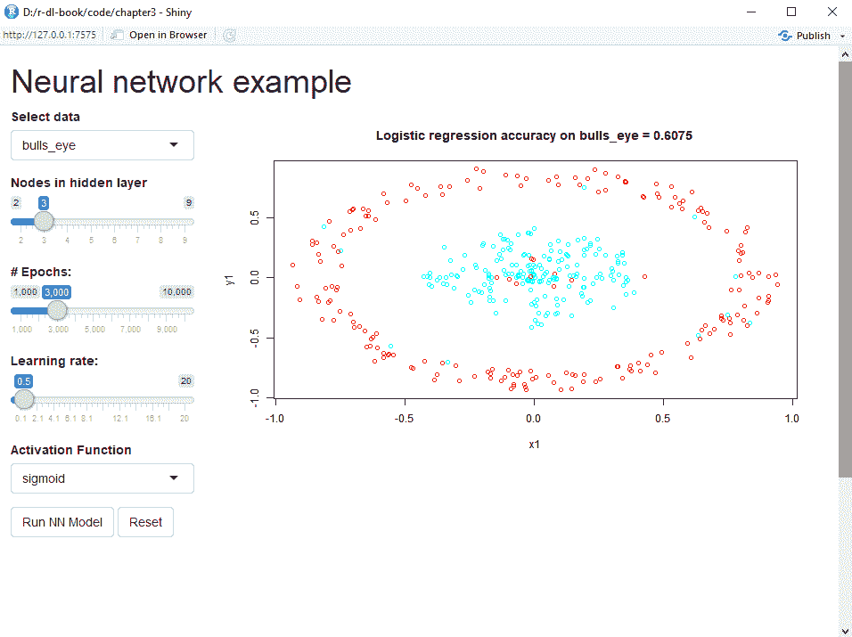
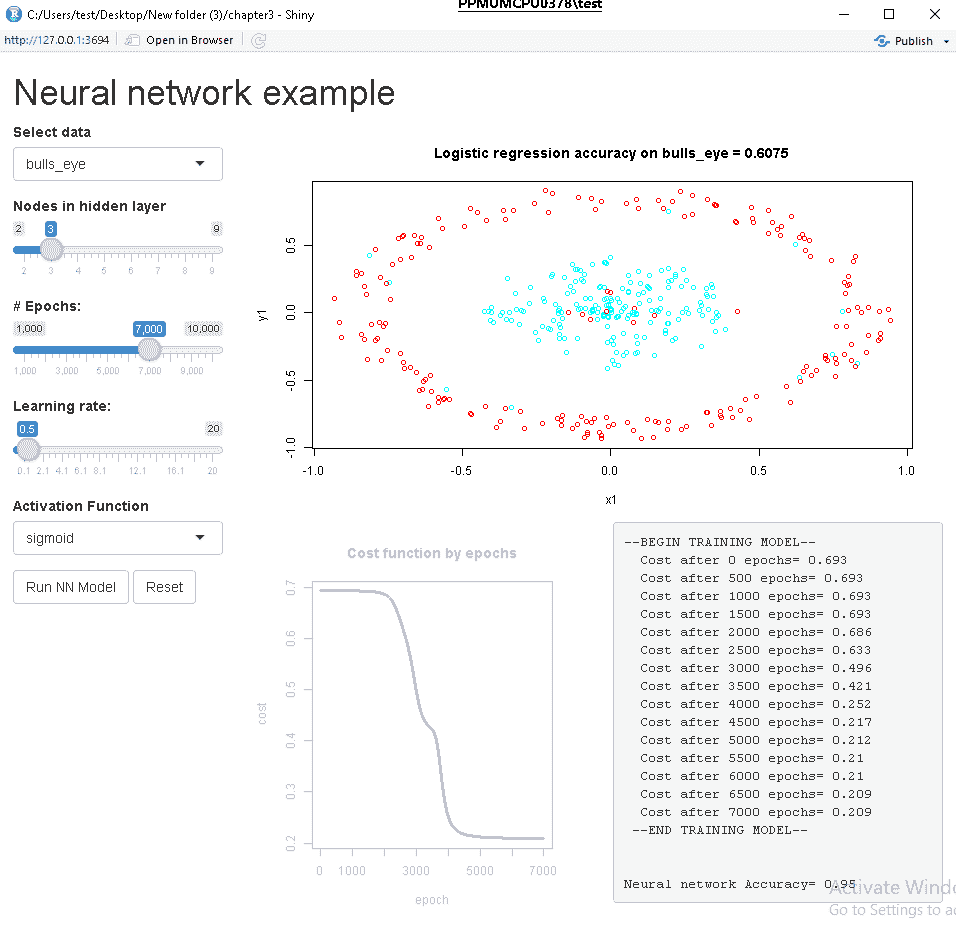
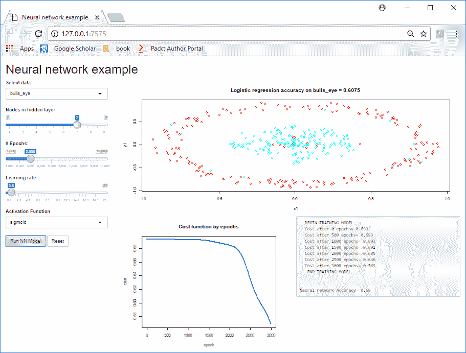
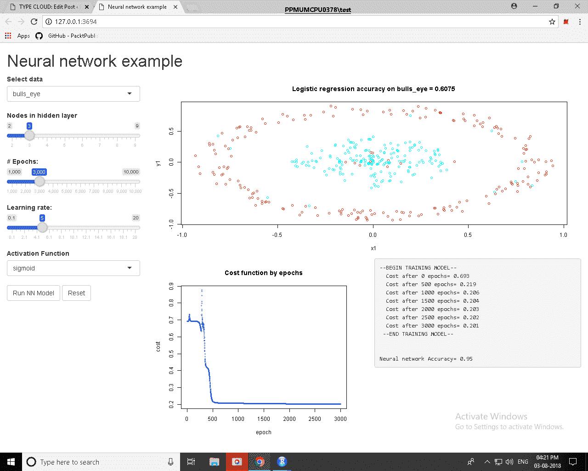
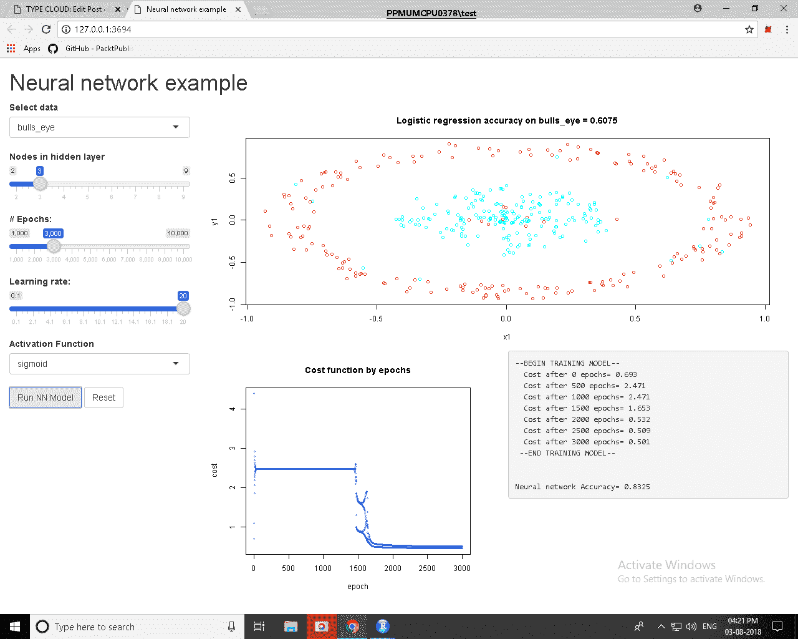
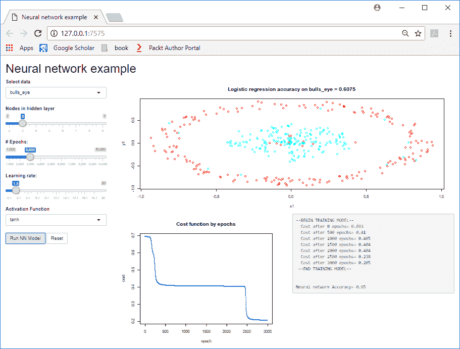
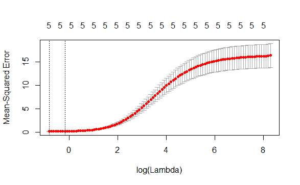
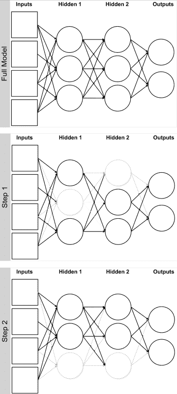

# 三、深度学习基础

在前一章中，我们使用 r 中的神经网络包创建了一些机器学习模型。本章将通过使用基本的数学和矩阵运算创建一个神经网络来了解神经网络和深度学习的一些基础知识。这个应用程序示例将有助于解释深度学习算法中的一些关键参数以及一些允许它们在大型数据集上训练的优化。我们还将演示如何评估模型的不同超参数，以找到最佳设置。在前一章中，我们简要地看了过拟合的问题；本章将更深入地探讨这个话题，并着眼于如何克服这个问题。它包括一个使用 dropout 的示例用例，dropout 是深度学习中最常见的正则化技术。

本章涵盖以下主题:

*   在 R 中从头开始构建神经网络
*   深度学习中的常用参数
*   深度学习算法中的一些关键组件
*   使用正则化克服过拟合
*   用例—使用 dropout 改进样本外模型性能


# 在 R 中从头开始构建神经网络

虽然我们已经使用了一些神经网络算法，但现在是时候更深入地了解它们是如何工作的了。本节演示如何从头开始编写神经网络代码。看到神经网络的核心代码只用不到 80 行就能写出来，你可能会感到惊讶！本章的代码正是使用用 r 编写的交互式 web 应用程序来完成的。它应该会让您对神经网络有更直观的理解。首先，我们将查看 web 应用程序，然后我们将更深入地研究神经网络的代码。


# 神经网络 web 应用

首先，我们将看一个 R Shiny web 应用程序。我鼓励您运行该应用程序并遵循示例，因为它将真正帮助您更好地理解神经网络是如何工作的。为了运行它，您必须在 RStudio 中打开`Chapter3`项目。

**What is R Shiny**?
R Shiny is an R package from the RStudio company that allows you to create interactive web apps using only R code. You can build dashboards and visualizations, and use the full functionality of R. You can extend R Shiny apps with CSS, widgets, and JavaScript. It is also possible to host your applications online. It is a great tool with which to showcase data science applications and I encourage you to look into it if you are not already familiar with it. For more information, see [https://shiny.rstudio.com/](https://shiny.rstudio.com/), and, for examples of what is possible with R Shiny, see [https://shiny.rstudio.com/gallery/](https://shiny.rstudio.com/gallery/).

1.  在 RStudio 中打开`server.R`文件，点击运行应用按钮:


图 3.1:如何运行一个 R Shiny 应用程序

2.  当您单击 Run App 按钮时，您应该会看到一个 web 应用程序的弹出屏幕。以下是 web 应用程序启动后的屏幕截图:



图 3.2:启动时闪亮的应用程序

这个 web 应用程序可以在弹出窗口中使用，也可以在浏览器中打开。在左边，有一组输入选项；这些是神经网络的参数。这些被称为超参数，以区分模型试图优化的*参数*。从上到下，这些超参数是:

*   **选择数据**:有四种不同的数据集可以用作训练数据。
*   **隐藏层节点数**:隐藏层节点数。神经网络只有一个隐藏层。
*   **# Epochs** :建模过程中算法迭代数据的次数。
*   **学习率**:反向传播时应用的学习率。学习速率影响算法在每个时期改变权重的程度。
*   **激活函数**:应用于各节点输出的激活函数。
*   “运行神经网络模型”按钮通过选择输入来训练模型。重置按钮将输入选项恢复为默认值。

有四个不同的数据集可供选择，每个数据集都有不同的数据分布；您可以从下拉框中选择它们。它们有描述性的名字；例如，图 3.2 中绘制的数据称为`bulls_eye`。这些数据集来自另一个用于测试聚类算法的 R 包。数据有两个大小相等的类，由不同的几何形状组成。您可以使用 web 应用程序浏览这些数据集。我们对数据所做的唯一更改是随机切换 5%数据的标签。当您运行应用程序时，您会注意到内圈有一些红点，外圈有一些蓝点。这样做是为了使我们的模型应该只达到 0.95 (95%)的最大精度。这给了我们信心，模型工作正常。如果精度高于此，模型可能会过拟合，因为它学习的函数太复杂。我们将在下一节再次讨论过度拟合。

机器学习的第一步应该是建立一个基准分数，这对衡量你的进步很有用。基准分数可以是经验法则，或者简单的机器学习算法；这不应该是你花很多时间去做的事情。在这个应用中，我们使用一个基本的逻辑回归模型作为基准。我们可以看到，在前面的屏幕截图中，逻辑回归模型的精确度仅为 0.6075，即 60.75%的精确度。这比 50%高不了多少，但是回想一下，逻辑回归只能拟合一条直线，而这个数据不能用一条直线分开。神经网络应该在逻辑回归基准上有所改进，所以如果我们在这个数据集上获得的精度低于 0.6075，那么我们的模型就有问题，我们应该对其进行审查。

所以让我们开始吧！单击 Run NN Model 按钮，使用输入选项对数据运行神经网络模型。几秒钟后，应用程序应该会变成类似下面的屏幕截图:


图 3.3:使用默认设置的神经网络模型执行

应用程序需要几秒钟的时间，然后创建一个在 **#个时期**内的成本函数图，并在算法迭代数据时输出成本函数值。文本输出还包括屏幕右下角文本中模型的最终精度。在右下角的诊断消息中，我们可以看到在训练过程中成本降低了，并且我们实现了 0.825 的最终准确率。成本是模型试图最小化的东西——成本越低意味着精度越高。由于该模型最初难以获得正确的权重，因此花费了一些时间才开始降低成本。

在深度学习模型中，权重和偏差不应该用随机值初始化。如果使用随机值，这可能会导致训练出现问题，如渐变消失或爆炸。这是权重变得太小或太大并且模型不能成功训练的地方。此外，如果权重没有正确初始化，模型将需要更长的时间来训练，正如我们前面看到的。初始化权重以避免这些问题的两种最流行的技术是 Xavier 初始化和 he 初始化(以它们的发明者命名)。

我们可以在*图 3.3* 中看到，成本并没有稳定下来，最后几个值显示成本仍在下降。这表明，如果我们训练它更长的时间，模型可以得到改进。将 **#周期**改为 **7000** ，再次点击**运行 NN 模型**按钮；屏幕将改变为类似于下面的图:



图 3.4:具有更多时期的神经网络模型执行

现在我们得到了 0.95 的精度，这是可能的最大精度。我们注意到成本值已经稳定下来(也就是说，不再下降)到 0.21 左右。这表明，无论当前的精度数字是多少，训练模型的时间越长(即更多的时期)可能不会改善结果。如果模型正在训练中，并且成本值已经稳定下来，我们将需要考虑改变模型的架构或获取更多数据来提高我们的准确性。让我们看看如何改变模型中的节点数量。点击重置按钮将输入值更改为默认值，然后将节点数更改为 7，并点击**运行 NN 模型**按钮。现在，屏幕将变为以下内容:



图 3.5:具有更多节点的神经网络模型执行

这里我们的精度为 0.68，但与之前的例子相比，我们使用相同的输入，只有三个节点。实际上，节点越多，性能越差！这是因为我们的数据具有相对简单的模式，而具有七个节点的模型可能太复杂，需要更长的时间来训练。向层中添加更多节点会增加训练时间，但并不总是能提高性能。

再来看**学习率**。点击**重置**按钮，将输入值更改为默认值，然后将**学习速率**更改为大约 **5** ，再次点击**运行 NN 模型**按钮，复制如下画面:



图 3.6:具有较大学习速率的神经网络模型执行

我们再次得到 0.95 的精度，这是可能的最佳精度。如果我们将其与之前的示例进行比较，我们可以看到，在仅仅 **500** 个时期之后，模型*收敛*(即成本函数达到稳定状态所需的时间长度)要快得多。我们需要更少的时期，所以我们可以看到学习率和训练时期之间的反比关系。更高的学习率可能意味着你需要更少的纪元。但是更大的学习率总是更好吗？嗯，没有。

点击**重置**按钮，将输入值更改为默认值，然后将**学习率**更改为最大值( **20** )，再次点击**运行 NN 模型**按钮。当您这样做时，您将得到与下面类似的输出:



图 3.7:学习率过高的神经网络模型执行

我们得到 0.83 的准确率。刚刚发生了什么？通过选择一个巨大的学习率，我们的模型根本无法收敛。我们可以看到，在训练开始时，成本函数实际上是增加的，这表明学习率过高。我们的成本函数图似乎有重复的值，这表明梯度下降算法有时会超过最小值。

最后，我们可以看看激活函数的选择如何影响模型训练。通过改变激活功能，您可能还需要改变**学习速率**。点击**重置**按钮，将输入值更改为默认值，并选择`tanh`激活功能。当我们选择`tanh`作为激活函数，选择 1.5 作为**学习率**时，成本从 500-3500 个时期得到 0.4 的`stuck`，然后突然下降到 0.2。当神经网络陷入局部最优时，就会发生这种情况。这种现象可以从下面的情节中看出:



图 3.8:用 tanh 激活函数执行神经网络模型

相反，使用 relu 激活会导致模型训练更快。在下面的示例中，我们仅使用 relu 激活运行 1，500 个时期，以获得 0.95 的最大可能精度:


图 3.9:使用 relu 激活函数的神经网络模型执行

我鼓励你尝试其他数据集。作为参考，这里是我对每个数据集的最大精确度。一个有趣的实验是观察不同的激活函数和学习率如何处理这些数据集:

*   **蠕虫(精度=0.95)** : 3 个节点，3000 个历元，学习率= 0.5，激活= tanh
*   **月(精度=0.95)** : 5 个节点，5000 个历元，学习率= 5，激活=乙状结肠
*   **块(精度=0.9025)** : 5 个节点，5000 个时期，学习率= 10，激活= sigmoid

通常，您会看到以下内容:

*   使用更多的历元意味着更长的训练时间，这可能并不总是需要的。
*   如果模型没有达到最佳精度，并且成本函数在训练结束时趋于平稳(也就是说，它没有下降太多)，那么运行它更长的时间(也就是说，更多的时期)或增加学习率不太可能提高性能。相反，要考虑改变模型的架构，比如通过改变#层(在这个演示中不是一个选项)，添加更多的节点，或者改变激活函数。
*   学习速度必须仔细选择。如果选择的值太低，模型需要很长时间来训练。如果选择的值太高，模型将无法训练。


# 神经网络代码

虽然 web 应用程序对于查看神经网络的输出很有用，但是我们也可以运行神经网络的代码来真正了解它是如何工作的。`Chapter3/nnet.R`中的代码允许我们这样做。此代码具有与 web 应用程序中相同的超参数；该文件允许您从 RStudio IDE 中运行神经网络。以下是加载数据并为神经网络设置初始超参数的代码:

```r
source("nnet_functions.R")
data_sel <- "bulls_eye"

........

####################### neural network ######################
hidden <- 3
epochs <- 3000
lr <- 0.5
activation_ftn <- "sigmoid"

df <- getData(data_sel) # from nnet_functions
X <- as.matrix(df[,1:2])
Y <- as.matrix(df$Y)
n_x=ncol(X)
n_h=hidden
n_y=1
m <- nrow(X)
```

这段代码应该不会太难理解，它加载一个数据集并设置一些变量。数据是从`Chapter3/nnet_functions.R`文件的`getData`函数中创建的。数据是从`clustersim`包中的函数创建的。`Chapter3/nnet_functions.R`文件包含了我们将在这里看到的神经网络的核心功能。一旦我们加载了数据，下一步就是初始化我们的权重和偏差。`hidden`变量控制隐藏层的节点数；我们把它设置为 3。我们需要两组权重和偏差，一组用于隐藏层，一组用于输出层:

```r
# initialise weights
set.seed(42)
weights1 <- matrix(0.01*runif(n_h*n_x)-0.005, ncol=n_x, nrow=n_h)
weights2 <- matrix(0.01*runif(n_y*n_h)-0.005, ncol=n_h, nrow=n_y)
bias1 <- matrix(rep(0,n_h),nrow=n_h,ncol=1)
bias2 <- matrix(rep(0,n_y),nrow=n_y,ncol=1)
```

这为`(weights1, bias1)`隐藏层和`(weights2, bias2)`输出层创建了矩阵。我们需要确保我们的矩阵有正确的维度。例如，`weights1`矩阵应该具有与输入层相同的列数和与隐藏层相同的行数。现在我们转到神经网络的实际处理循环:

```r
for (i in 0:epochs)
{
  activation2 <- forward_prop(t(X),activation_ftn,weights1,bias1, weights2,bias2)
  cost <- cost_f(activation2,t(Y))
  backward_prop(t(X),t(Y),activation_ftn,weights1,weights2, activation1,activation2)
  weights1 <- weights1 - (lr * dweights1)
  bias1 <- bias1 - (lr * dbias1)
  weights2 <- weights2 - (lr * dweights2)
  bias2 <- bias2 - (lr * dbias2)

  if ((i %% 500) == 0)
    print (paste(" Cost after",i,"epochs =",cost))
}
[1] " Cost after 0 epochs = 0.693147158995952"
[1] " Cost after 500 epochs = 0.69314587328381"
[1] " Cost after 1000 epochs = 0.693116915341439"
[1] " Cost after 1500 epochs = 0.692486724429629"
[1] " Cost after 2000 epochs = 0.687107068792801"
[1] " Cost after 2500 epochs = 0.660418522655335"
[1] " Cost after 3000 epochs = 0.579832913091798"
```

我们首先运行正向传播函数，然后计算成本。然后我们调用反向传播步骤来计算我们的导数，`(dweights1, dbias1, dweights2, dbias2)`。然后，我们使用我们的学习率`(lr)`更新权重和偏差`(weights1, bias1, weights2, bias2)`。我们针对`epochs (3000)`的数量运行该循环，并每 500 `epochs`打印出一条诊断信息。这描述了每个神经网络和深度学习模型的工作方式:首先调用前向传播，然后计算成本和导数值，使用这些通过反向传播和重复来更新权重。

现在让我们看看`nnet_functions.R`文件中的一些函数。下面是`forward`传播函数:

```r
forward_prop <- function(X,activation_ftn,weights1,bias1,weights2,bias2)
{
  # broadcast hack
  bias1a<-bias1
  for (i in 2:ncol(X))
    bias1a<-cbind(bias1a,bias1)
  bias2a<-bias2
  for (i in 2:ncol(activation1))
    bias2a<-cbind(bias2a,bias2)

  Z1 <<- weights1 %*% X + bias1a
  activation1 <<- activation_function(activation_ftn,Z1)
  bias2a<-bias2
  for (i in 2:ncol(activation1))
    bias2a<-cbind(bias2a,bias2)
  Z2 <<- weights2 %*% activation1 + bias2a
  activation2 <<- sigmoid(Z2)
  return (activation2)
}
```

如果你仔细查看代码，你可能会注意到对`activation1`、`activation2`、`Z1`和`Z2`变量的赋值使用了`<<-`而不是`<-`。这使得这些变量在范围上是全局的；我们还想在反向传播过程中使用这些值。使用全局变量通常是不受欢迎的，我本可以返回一个列表，但是在这里使用它们是可以接受的，因为这个应用程序是为了学习的目的。

两个 for 循环将偏置向量扩展成矩阵，然后重复向量 n 次。有趣的代码从`Z1`赋值开始。`Z1`是矩阵乘法，后面是加法。我们对该值调用`activation_function`函数。然后，我们使用该输出值并对`Z2`执行类似的操作。最后，我们将 sigmoid 激活应用到输出层，因为我们的问题是二进制分类。

下面是激活函数的代码；第一个参数决定使用哪个功能(`sigmoid`、`tanh`或`relu`)。第二个参数是用作输入的值:

```r
activation_function <- function(activation_ftn,v)
{
  if (activation_ftn == "sigmoid")
    res <- sigmoid(v)
  else if (activation_ftn == "tanh")
    res <- tanh(v)
  else if (activation_ftn == "relu")
  {
    v[v<0] <- 0
    res <- v
  }
  else
    res <- sigmoid(v)
  return (res)
}
```

以下是`cost`功能:

```r
cost_f <- function(activation2,Y)
{
  cost = -mean((log(activation2) * Y)+ (log(1-activation2) * (1-Y)))
  return(cost)
}
```

提醒一下，`cost`函数的输出是我们试图最小化的。`cost`函数有很多种类型；在这个应用中，我们使用二进制交叉熵。二元交叉熵的公式是*-1/m∑log(ȳ[I])* y[I]+(log(1-ȳ[I])*(1-y[I])*。我们的目标值( *y [i]* )总是 *1* 或 *0* ，所以比如说 *y [i] = 1* ，这就简化为*∑**log(ȳ[I]**)*。如果我们有两行，其中 *y [i] = 1* ，并且假设我们的模型预测第一行为 *1.0* ，第二行为 *0.0001* ，那么这两行的成本分别为 *log(1)=0* 和 *log(0.0001)=-9.1* 。我们可以看到，对这些行的预测越接近 *1* ，则`cost`值越低。类似地，对于 y [i] = 0 的行，这减少到 log(1-ȳ [i] )，因此这些行的预测越接近 0，则`cost`值越低。

如果我们试图最大化准确性，为什么我们不在模型训练中使用 what？二进制交叉熵是一个更好的`cost`函数，因为我们的模型不只是输出 0 或 1，而是输出从 0.0 到 1.0 的连续值。例如，如果两个输入行的目标值=1(即 y=1)，我们的模型给出的概率为 0.51 和 0.99，那么二进制交叉熵将分别给出 0.67 和 0.01 的成本。它将较高的成本分配给第一行，因为模型对此不确定(概率接近 0.5)。相反，如果我们只看准确性，我们可能会决定两行具有相同的成本值，因为它们被正确分类(假设我们指定 class=0，其中预测值<为 0.5，class=1，其中预测值> = 0.5)。

以下是反向传播函数的代码:

```r
backward_prop <- function(X,Y,activation_ftn,weights1,weights2,activation1,activation2)
{
  m <- ncol(Y)
  derivative2 <- activation2-Y
  dweights2 <<- (derivative2 %*% t(activation1)) / m
  dbias2 <<- rowSums(derivative2) / m
  upd <- derivative_function(activation_ftn,activation1)
  derivative1 <- t(weights2) %*% derivative2 * upd
  dweights1 <<- (derivative1 %*% t(X)) / m
  dbias1 <<- rowSums(derivative1) / m
}
```

反向传播反向处理网络，从最后一个隐藏层开始，到第一个隐藏层结束，即从输出层到输入层的方向。在我们的例子中，我们只有一个隐藏层，所以它首先从输出层计算损耗，并计算`dweight2`和`dbias2`。然后，它计算`activation1`值的`derivative`，该值是在前向传播步骤中计算的。`derivative`函数类似于激活函数，但是它不是调用激活函数，而是计算该函数的`derivative`。比如`sigmoid(x)`的`derivative`就是*sigmoid(x)*(1-sigmoid(x))*。简单函数的`derivative`值可以在任何微积分参考资料或网上找到:

```r
derivative_function <- function(activation_ftn,v)
{
  if (activation_ftn == "sigmoid")
   upd <- (v * (1 - v))
  else if (activation_ftn == "tanh")
   upd <- (1 - (v^2))
  else if (activation_ftn == "relu")
   upd <- ifelse(v > 0.0,1,0)
  else
   upd <- (v * (1 - v))
  return (upd)
}
```

就是这样！使用基本 R 代码的工作神经网络。它可以拟合复杂的函数，性能优于逻辑回归。你可能不会一下子得到所有的部分，没关系。以下是这些步骤的简要回顾:

1.  运行前向传播步骤，包括将权重乘以每一层的输入，并将输出传递给下一层。
2.  使用`cost`功能评估最终层的输出。
3.  基于错误率，使用反向传播对每层中节点的权重进行小的调整。学习速度决定了我们每次调整的幅度。
4.  重复步骤 1-3，可能数千次，直到`cost`函数开始稳定，这表明我们的模型已经训练好了。


# 回到深度学习

上一节中的许多概念适用于深度学习，因为深度学习只是具有两个或更多隐藏层的神经网络。为了演示这一点，让我们看看下面的 R 代码，它加载了`mxnet`深度学习库，并对该库中训练深度学习模型的函数调用 help 命令。尽管我们还没有使用这个库训练任何模型，但是我们已经看到了这个函数中的许多参数:

```r
library(mxnet)
?mx.model.FeedForward.create
```

如果您收到错误消息，称`mxnet`包不可用，请参见 [第 1 章](00c01383-1886-46d0-9435-29dfb3e08055.xhtml)、*深度学习入门*，了解安装说明。然而，我们在本章中没有运行任何`mxnet`代码，我们只想显示一个函数的帮助页面。所以请继续阅读，你可以在下一章使用它的时候安装这个包。

这将打开`mxnet`库中`FeedForward`函数的帮助页面，它是正向传播/模型训练函数。`mxnet`并且大多数深度学习库没有特定的*向后-* 传播功能，它们隐式地处理这一点:

```r
mx.model.FeedForward.create(symbol, X, y = NULL, ctx = NULL,
 begin.round = 1, num.round = 10, optimizer = "sgd",
 initializer = mx.init.uniform(0.01), eval.data = NULL,
 eval.metric = NULL, epoch.end.callback = NULL,
 batch.end.callback = NULL, array.batch.size = 128
 ...)
```

我们将在随后的章节中看到这个函数的更多内容；现在我们只看参数。


# 符号、X、y 和 ctx 参数

符号参数定义深度学习架构；x 和 y 是输入和输出数据结构。ctx 参数控制在哪个设备(例如，CPU/GPU)上训练模型。


# num.round 和 begin.round 参数

`num.round`相当于我们代码中的纪元；也就是说，无论我们对数据迭代多少次。`begin.round`如果我们之前暂停了训练，我们将在此处继续训练模型。如果我们暂停训练，我们可以保存部分训练的模型，稍后重新加载它，并继续训练。


# 优化器参数

我们的神经网络实现使用梯度下降。当研究人员开始创建更复杂的多层神经网络模型时，他们发现训练时间非常长。这是因为没有优化的基本梯度下降算法不是非常有效；它在每个时代都朝着自己的目标前进一小步，不管之前的时代发生了什么。我们可以把它比作一个猜谜游戏:一个人必须在一个范围内猜一个数字，每猜一次，他们被告知要更高或更低(假设他们没有猜中正确的数字！).高/低指令类似于导数值，它指示我们必须行进的方向。现在假设可能的数字范围是 1 到 1，000，000，第一次猜测是 1，000。这个人被告知要去更高的地方，他们应该这样做:

*   试试 1001。
*   取猜测值和最大值之差，除以 2。将此值添加到之前的猜测中。

第二个选项要好得多，应该意味着这个人可以在 20 次或更少的时间内猜出正确答案。如果你有计算机科学的背景，你可能认识到这是二进制搜索算法。第一个选项，猜 1001，1002，....，1，000，000，是一个很糟糕的选择，很可能会因为一方的放弃而失败！但这类似于梯度下降的工作原理。它逐渐向目标移动。如果你试图提高学习率来克服这个问题，你可能会超过目标，模型无法收敛。

研究人员想出了一些聪明的优化方法来加快训练速度。第一批优化器之一叫做 momentum，它确实如其名所言。它查看导数的范围，并且如果前面的步骤都在相同的方向上，则对每个时期采取更大的*步骤*。这应该意味着模型训练快得多。还有其他算法是这些算法的增强，如 RMS-Prop 和 Adam。您通常不需要知道它们是如何工作的，只是当您更改优化器时，您可能还需要调整其他超参数，例如学习率。一般来说，寻找其他人以前做过的例子，并复制那些超参数。

我们实际上在前一章的例子中使用了其中一个优化器。在那一章中，我们有两个具有相似架构的模型(40 个隐藏节点)。第一个模型(`digits.m3`)用的是`nnet`库，训练 40 分钟。第二个模型(`digits.m3`)使用弹性反向传播，训练时间为 3 分钟。这表明了在神经网络和深度学习中使用优化器的好处。


# 初始化参数

当我们为权重和偏差(即模型参数)创建初始值时，我们使用了随机数，但将它们限制在-0.005 到+0.005 之间。如果你回顾一下`cost`函数的一些图表，你会发现在`cost`函数开始下降之前花了 2000 个时期。这是因为初始值不在正确的范围内，需要 2000 个历元才能达到正确的星等。幸运的是，我们不必担心如何在`mxnet`库中设置这些参数，因为这个参数控制着如何在训练前初始化权重和偏差。


# eval.metric 和 eval.data 参数

这两个参数控制使用什么数据和哪个指标来评估模型。`eval.metric`相当于我们在代码中使用的`cost`函数。如果您想要在培训中未使用的维持数据集上评估模型，请使用`eval.data`。


# epoch.end.callback 参数

这是一个`callback`函数，允许您注册在 *n* 个时期后调用的另一个函数。深度学习模型需要很长时间来训练，所以你需要一些反馈来知道它们是否正确工作！你可以写一个定制的`callback`函数来做你需要的任何事情，但是通常它会在 *n* 个时期之后输出到屏幕或者日志中。这相当于我们的神经网络中的代码，每 *500* 个时期打印一条诊断信息。`callback`功能也可用于将模型保存到磁盘，例如，如果您想在模型开始溢出之前保存模型。


# array.batch.size 参数

我们的数据中只有 400 个实例(行),这很容易放入内存。但是，如果您的输入数据有数百万个实例，则需要在训练期间将数据拆分成批，以便适合 CPU/GPU 的内存。一次训练的实例数就是批量大小。请注意，您仍然迭代所有数据的历元数，您只是在每次迭代期间将数据分成批次，并对每个历元的每个批次运行正向传播、反向传播步骤。例如，如果您有 100 个实例，并且选择了具有 6 个时期的 *32 个*的批处理大小，则每个时期需要 *4 个*批处理( *100/32 = 3.125* ，因此我们需要 *4 个*批处理来处理所有数据，总共需要 *24 个*循环。

选择批量大小需要权衡。如果选择太低的值，模型将需要更长的时间来定型，因为它运行更多的操作，并且由于较小的大小，批处理将有更多的可变性。你也不能选择一个巨大的批处理大小，这可能会导致你的模型崩溃，因为它将太多的数据加载到 CPU 或 GPU 中。在大多数情况下，你要么采用另一个深度学习模型的合理默认值，要么将其设置为某个值(例如，1，024)，如果你的模型崩溃，则使用先前值的一半的值重试(512)。

用于训练的**批量**、**学习率**和 **#时期**之间存在关系。但是在选择价值观方面没有硬性规定。但是，一般来说，请考虑一起更改这些值，并且不要对这些超参数之一使用极值。例如，选择一个大的学习率意味着更少的历元，但是如果你的批量太小，模型可能无法训练。最好的建议是查看相似的架构，并选择相似的值集和范围。

现在我们可以看到深度学习仍然使用了许多来自神经网络的概念，我们将继续讨论一个重要的问题，你可能会在每个深度学习模型中遇到这个问题:过度拟合。


# 使用正则化克服过拟合

在前一章中，我们看到了神经网络在维持数据或测试数据(即不用于训练模型的数据)的预测能力方面的进一步训练迭代的收益递减。这是因为复杂的模型可能会记住数据中的一些噪音，而不是学习一般的模式。这些模型在预测新数据时表现更差。我们可以应用一些方法来使我们的模型一般化，也就是说，符合整体模式。这些被称为**正则化**，目的是减少测试误差，使模型在新数据上表现良好。

深度学习中最常用的正则化技术是 dropout。然而，我们也将讨论在回归和深度学习中有基础的另外两种正则化技术。这两种正则化技术分别是 **L1 罚**，又名**套索**，以及 **L2 罚**，又名**脊**。


# L1 点球

**L1 罚函数**，也被称为**最小绝对收缩和选择算子** ( **拉索**–Hastie，t .、Tibshirani，r .和 Friedman，J. (2009))的基本概念是，罚函数用于将权重收缩到零。惩罚项使用绝对权重的总和，因此一些权重可能会缩小到零。这意味着套索也可以用作一种可变选择。惩罚的强度由超参数α(λ)控制，它乘以绝对权重之和，它可以是固定值，或者与其他超参数一样，使用交叉验证或某种类似方法进行优化。

如果我们使用一个**普通最小二乘** ( **OLS** )回归模型，那么描述 Lasso 就更容易了。在回归中，使用最小平方误差准则来估计一组系数或模型权重，其中权重/系数向量*θ*被估计为使得其最小化*∑(y[I]-ȳ[I])*其中*ȳ[I]= b+θx，y [i]* 是我们想要预测的目标值， *ȳ拉索回归增加了一个额外的惩罚项，现在试图最小化∑(y[I]-ȳ[I])+λ⌊θ⌋，其中⌊θ⌋是*θ*的绝对值。通常，截距或偏移项不包括在此约束中。*

套索回归有许多实际意义。第一，惩罚的效果取决于权重的大小，权重的大小取决于数据的规模。因此，数据通常被标准化为首先具有单位方差(或者至少使每个变量的方差相等)。L1 惩罚倾向于将小重量缩小到零(关于为什么会发生这种情况的解释，见 Hastie，t .，Tibshirani，r .，和 Friedman，J. (2009))。如果你只考虑 L1 罚函数留下非零权重的变量，它本质上可以起到特征选择的作用。L1 罚函数将小系数收缩为零的趋势也有利于简化模型结果的解释。

对神经网络应用 L1 罚函数对神经网络的作用与对回归的作用完全相同。如果 *X* 代表输入， *Y* 是结果或因变量， *B* 是参数， *F* 是将被优化以获得 *B* 的目标函数，也就是我们要最小化*F(B；x，Y)* 。L1 罚函数将目标函数修改为 F(B；x，y)+λ⌊θ⌋，其中*θ*表示权重(通常忽略偏移)。L1 罚值往往会导致稀疏解(即更多的零权重)，因为较小和较大的权重会导致相等的罚值，因此在梯度的每次更新中，权重会移向零。

我们只考虑了这样的情况，其中 *λ* 是一个常数，控制惩罚或正则化的程度。然而，可以使用深度神经网络设置不同的值，其中不同程度的正则化可以应用于不同的层。考虑这种差分正则化的一个原因是，有时希望允许更大数量的参数(比如通过在特定层中包括更多的神经元)，但是然后通过更强的正则化来抵消这一点。然而，如果我们允许 L1 罚函数对于深度神经网络的每一层都不同，并且使用交叉验证来优化 L1 罚函数的所有可能组合，则这种方法可能在计算上要求很高。因此，通常在整个模型中使用单个值。


# L1 点球在行动

为了了解 L1 罚函数是如何工作的，我们可以使用一个模拟的线性回归问题。本章其余部分的代码在`Chapter3/overfitting.R`中。我们使用一组相关的预测值来模拟数据:

```r
set.seed(1234)
X <- mvrnorm(n = 200, mu = c(0, 0, 0, 0, 0),
  Sigma = matrix(c(
    1, .9999, .99, .99, .10,
    .9999, 1, .99, .99, .10,
    .99, .99, 1, .99, .10,
    .99, .99, .99, 1, .10,
    .10, .10, .10, .10, 1
  ), ncol = 5))
y <- rnorm(200, 3 + X %*% matrix(c(1, 1, 1, 1, 0)), .5)
```

接下来，我们可以用 OLS 回归模型拟合前 100 个案例，然后使用`lasso`。为了使用`lasso`，我们使用`glmnet`包中的`glmnet()`函数。这个函数实际上符合 L1 或 L2(在下一节讨论)惩罚，哪一个发生是由参数α决定的。当`alpha = 1`时，是 L1 罚(即`lasso`)，当`alpha = 0`时，是 L2 罚(即岭回归)。此外，因为我们不知道应该选择`lambda`的哪个值，所以我们可以评估一系列选项，并使用交叉验证自动调整这个超参数，这就是`cv.glmnet()`函数。然后，我们可以绘制`lasso`对象，以查看各种`lambda`值的均方误差，从而允许我们选择正确的正则化级别:

```r
m.ols <- lm(y[1:100] ~ X[1:100, ])
m.lasso.cv <- cv.glmnet(X[1:100, ], y[1:100], alpha = 1)
plot(m.lasso.cv)
```


图 3.10:套索调整

从图表中我们可以看到，当惩罚过高时，交叉验证模型增加。事实上，`lasso`似乎在很低的 lambda 值下做得很好，这可能表明`lasso`对提高该数据集的样本外性能/概化能力没有太大帮助。为了这个例子，我们将继续，但在实际使用中，这可能会让我们暂停考虑`lasso`是否真的有帮助。最后，我们可以将这些系数与`lasso`中的系数进行比较:

```r
cbind(OLS = coef(m.ols),Lasso = coef(m.lasso.cv)[,1])
               OLS Lasso
(Intercept)  2.958  2.99
X[1:100, ]1 -0.082  1.41
X[1:100, ]2  2.239  0.71
X[1:100, ]3  0.602  0.51
X[1:100, ]4  1.235  1.17
X[1:100, ]5 -0.041  0.00
```

注意，OLS 系数噪声更大，并且在`lasso`中，预测器 5 被罚为 0。回想一下模拟数据，真实系数是 3、1、1、1、1 和 0。OLS 估计值对于第一个预测值太低，对于第二个预测值太高，而`lasso`对于每一个都有更精确的值。这表明`lasso`回归比 OLS 回归更适合这个数据集。


# L2 点球

**L2 惩罚**，也被称为**岭回归**，在许多方面与 L1 惩罚相似，但不是增加基于绝对权重之和的惩罚，而是基于平方权重的惩罚。这意味着更大的绝对重量会受到更多的惩罚。在神经网络的上下文中，这有时被称为权重衰减。如果您检查正则化目标函数的梯度，则有一个罚值，使得在每次更新时，权重都有一个乘法罚值。至于 L1 惩罚，虽然它们可以被包括在内，但偏差或抵消通常被排除在外。

从一个线性回归问题来看，L2 罚函数是对最小化的目标函数的修正，从*∑(y[I]-ȳ[I])*到*∑(y[I]-ȳ[I])+λθ²*。


# L2 点球在行动

为了了解 L2 罚函数是如何工作的，我们可以使用与 L1 罚函数相同的模拟线性回归问题。为了拟合岭回归模型，我们使用了`glmnet`包中的`glmnet()`函数。如前所述，这个函数实际上符合 L1 或 L2 罚函数，哪一个发生由自变量α决定。当`alpha = 1`时，它符合`lasso`，当`alpha = 0`时，它符合岭回归。这次，我们选择`alpha = 0`。同样，我们评估一系列 lambda 选项，并使用交叉验证自动调整这个超参数。这是通过使用`cv.glmnet()`功能完成的。我们绘制岭回归对象以查看各种λ值的误差:

```r
m.ridge.cv <- cv.glmnet(X[1:100, ], y[1:100], alpha = 0)
plot(m.ridge.cv)
```



图 3.11:山脊规则化

尽管形状与`lasso`的不同之处在于，对于较高的λ值，误差似乎是渐近线，但仍然清楚的是，当惩罚变得过高时，交叉验证的模型误差会增加。与`lasso`一样，岭回归模型似乎在很低的 lambda 值下表现良好，这可能表明 L2 惩罚并没有显著提高样本外性能/概化能力。

最后，我们可以将 OLS 系数与来自`lasso`和岭回归模型的系数进行比较:

```r
> cbind(OLS = coef(m.ols),Lasso = coef(m.lasso.cv)[,1],Ridge = coef(m.ridge.cv)[,1])
               OLS Lasso   Ridge
(Intercept)  2.958  2.99  2.9919
X[1:100, ]1 -0.082  1.41  0.9488
X[1:100, ]2  2.239  0.71  0.9524
X[1:100, ]3  0.602  0.51  0.9323
X[1:100, ]4  1.235  1.17  0.9548
X[1:100, ]5 -0.041  0.00 -0.0023
```

虽然岭回归不会将第五个预测值的系数缩小到恰好为 0，但它比 OLS 中的系数小，并且其余参数都略有缩小，但非常接近它们的真实值 3、1、1、1、1 和 0。


# 权重衰减(神经网络中的 L2 惩罚)

在前一章中，我们已经不知不觉地使用了正则化。我们使用`caret`和`nnet`包训练的神经网络使用了`0.10`的权重衰减。我们可以通过改变权重衰减来研究它的使用，并使用交叉验证来调整它:

1.  像以前一样加载数据。然后，我们创建一个本地集群来并行运行交叉验证:

```r
set.seed(1234)
## same data as from previous chapter
if (!file.exists('../data/train.csv'))
{
  link <- 'https://apache-mxnet.s3-accelerate.dualstack.amazonaws.com/R/data/mnist_csv.zip'
  if (!file.exists(paste(dataDirectory,'/mnist_csv.zip',sep="")))
    download.file(link, destfile = paste(dataDirectory,'/mnist_csv.zip',sep=""))
  unzip(paste(dataDirectory,'/mnist_csv.zip',sep=""), exdir = dataDirectory)
  if (file.exists(paste(dataDirectory,'/test.csv',sep="")))
    file.remove(paste(dataDirectory,'/test.csv',sep=""))
}

digits.train <- read.csv("../data/train.csv")

## convert to factor
digits.train$label <- factor(digits.train$label, levels = 0:9)

sample <- sample(nrow(digits.train), 6000)
train <- sample[1:5000]
test <- sample[5001:6000]

digits.X <- digits.train[train, -1]
digits.y <- digits.train[train, 1]
test.X <- digits.train[test, -1]
test.y <- digits.train[test, 1]

## try various weight decays and number of iterations
## register backend so that different decays can be
## estimated in parallel
cl <- makeCluster(5)
clusterEvalQ(cl, {source("cluster_inc.R")})
registerDoSNOW(cl)
```

2.  在数字分类上训练一个神经网络，并在`0`(无惩罚)和`0.10`改变重量衰减惩罚。我们还通过两组允许的迭代次数进行循环:`100`或`150`。请注意，这段代码计算量很大，需要一些时间来运行:

```r
set.seed(1234)
digits.decay.m1 <- lapply(c(100, 150), function(its) {
  caret::train(digits.X, digits.y,
           method = "nnet",
           tuneGrid = expand.grid(
             .size = c(10),
             .decay = c(0, .1)),
           trControl = caret::trainControl(method="cv", number=5, repeats=1),
           MaxNWts = 10000,
           maxit = its)
})
```

3.  检查结果，我们看到，当我们仅限制`100`次迭代时，基于交叉验证的结果，非正则化模型和正则化模型在`0.56`处具有相同的精度，这在该数据上不是很好:

```r
digits.decay.m1[[1]]
Neural Network 

5000 samples
 784 predictor
  10 classes: '0', '1', '2', '3', '4', '5', '6', '7', '8', '9' 

No pre-processing
Resampling: Cross-Validated (5 fold) 
Summary of sample sizes: 4000, 4001, 4000, 3998, 4001 
Resampling results across tuning parameters:

  decay  Accuracy   Kappa
    0.0     0.56    0.51 
    0.1     0.56    0.51 

Tuning parameter 'size' was held constant at a value of 10
Accuracy was used to select the optimal model using the
 largest value.
The final values used for the model were size = 10 and decay = 0.1.
```

4.  使用`150`迭代检查模型，查看正则化或非正则化模型的性能是否更好:

```r
digits.decay.m1[[2]]
Neural Network 

5000 samples
 784 predictor
  10 classes: '0', '1', '2', '3', '4', '5', '6', '7', '8', '9' 

No pre-processing
Resampling: Cross-Validated (5 fold) 
Summary of sample sizes: 4000, 4002, 3998, 4000, 4000 
Resampling results across tuning parameters:

  decay  Accuracy   Kappa
    0.0      0.64    0.60 
    0.1      0.63    0.59 

Tuning parameter 'size' was held constant at a value of 10
Accuracy was used to select the optimal model using the
 largest value.
The final values used for the model were size = 10 and decay = 0.
```

总体而言，无论正则化程度如何，迭代次数多的模型都优于迭代次数少的模型。然而，用 150 次迭代来比较两个模型，正则化模型优于非正则化模型，尽管这里差别相对较小。

这些结果强调了正则化通常对更复杂的模型最有用，这些模型具有更大的灵活性来拟合(和过拟合)数据。在对数据来说合适或过于简单的模型中，正则化可能会降低性能。在开发新的模型体系结构时，您应该避免添加正则化，直到模型在定型数据上表现良好。如果您事先添加了正则化，而模型在定型数据上表现不佳，您将无法知道问题是出在模型的架构上还是正则化上。在下一节中，我们将讨论集合和模型平均技术，这是本书中强调的正则化的最后一种形式。


# 系综和模型平均

另一种正则化方法涉及创建多个模型(集合)并组合它们，例如通过模型平均或用于组合各个模型结果的一些其他算法。在机器学习中使用集成技术有着丰富的历史，例如使用这种技术的 bagging、boosting 和 random forest。一般的想法是，如果使用训练数据建立不同的模型，每个模型的预测值都有不同的误差。当一个模型预测的值太高时，另一个模型可能预测的值太低，当取平均值时，一些误差会抵消，从而得到比其他方式更精确的预测。

集合方法的关键是不同的模型在它们的预测中必须有一些可变性。如果来自不同模型的预测是高度相关的，那么使用集成技术将是无益的。如果来自不同模型的预测具有非常低的相关性，那么平均值将更加准确，因为它获得了每个模型的优势。以下代码给出了一个使用模拟数据的示例。这个小例子用三个模型说明了这一点:

```r
## simulated data
set.seed(1234)
d <- data.frame(
 x = rnorm(400))
d$y <- with(d, rnorm(400, 2 + ifelse(x < 0, x + x^2, x + x^2.5), 1))
d.train <- d[1:200, ]
d.test <- d[201:400, ]

## three different models
m1 <- lm(y ~ x, data = d.train)
m2 <- lm(y ~ I(x^2), data = d.train)
m3 <- lm(y ~ pmax(x, 0) + pmin(x, 0), data = d.train)

## In sample R2
cbind(M1=summary(m1)$r.squared,
 M2=summary(m2)$r.squared,M3=summary(m3)$r.squared)
       M1  M2   M3
[1,] 0.33 0.6 0.76
```

我们可以看到，每个模型的预测值，至少在训练数据中，变化相当大。评估训练数据中拟合值之间的相关性也有助于指示模型预测之间有多少重叠:

```r
cor(cbind(M1=fitted(m1),
 M2=fitted(m2),M3=fitted(m3)))
     M1   M2   M3
M1 1.00 0.11 0.65
M2 0.11 1.00 0.78
M3 0.65 0.78 1.00
```

接下来，我们为测试数据生成预测值，即预测值的平均值，并再次将预测值与测试数据中的实际值关联起来:

```r
## generate predictions and the average prediction
d.test$yhat1 <- predict(m1, newdata = d.test)
d.test$yhat2 <- predict(m2, newdata = d.test)
d.test$yhat3 <- predict(m3, newdata = d.test)
d.test$yhatavg <- rowMeans(d.test[, paste0("yhat", 1:3)])

## correlation in the testing data
cor(d.test)
             x     y  yhat1  yhat2 yhat3 yhatavg
x        1.000  0.44  1.000 -0.098  0.60    0.55
y        0.442  1.00  0.442  0.753  0.87    0.91
yhat1    1.000  0.44  1.000 -0.098  0.60    0.55
yhat2   -0.098  0.75 -0.098  1.000  0.69    0.76
yhat3    0.596  0.87  0.596  0.687  1.00    0.98
yhatavg  0.552  0.91  0.552  0.765  0.98    1.00
```

从结果中，我们可以看到三个模型的预测平均值比任何一个单独的模型都要好。然而，情况并非总是如此；一个好的模型可能有比平均预测更好的预测。一般来说，检查被平均的模型的性能是否相似是有好处的，至少在训练数据中是如此。第二个教训是，给定具有相似性能的模型，模型预测之间的相关性较低是可取的，因为这将产生最佳性能平均值。

还有其他形式的集成方法包含在其他机器学习算法中，例如 bagging 和 boosting。Bagging 用于随机森林，其中生成许多模型，每个模型都有不同的数据样本。这些模型被故意设计成小的、不完整的模型。通过对大量只使用部分数据的未训练模型的预测进行平均，我们应该会得到一个更强大的模型。增强的一个例子包括梯度增强模型(GBM ),它也使用多个模型，但这次每个模型都专注于在以前的模型中被错误预测的实例。随机森林和 GBM 都被证明对结构化数据非常成功，因为它们减少了方差，也就是说，避免了数据的过度拟合。

在深度神经网络中不经常使用装袋和模型平均，因为训练每个模型的计算成本可能相当高，因此多次重复该过程在时间和计算资源方面变得极其昂贵。然而，仍然可以在深度神经网络的环境中使用模型平均，即使它可能只在少数模型上而不是数百个模型上，这在随机森林和其他一些方法中是常见的。


# 用例——使用 dropout 改进样本外模型性能

Dropout 是一种新颖的正则化方法，对于大型复杂的深度神经网络尤其有价值。有关深度神经网络中辍学的更详细探索，请参见 Srivastava，n .，Hinton，g .，Krizhevsky，a .，Sutskever，I .，和 Salakhutdinav，R. (2014)。辍学背后的概念其实很简单。在模型的训练过程中，单元(例如，输入和隐藏神经元)可能会连同所有与它们之间的连接一起被删除。

例如，下图是在模型的每个训练步骤中可能发生的情况的示例，其中隐藏神经元及其连接在每个时期以 1/3 的概率被丢弃。一旦节点被丢弃，它与下一层的连接也会被丢弃。在下图中，灰显的节点和虚线连接是被删除的节点。重要的是要注意，被丢弃的节点的选择对于每个时期都是变化的:



图 3.12:不同时期应用于层的下降

考虑辍学的一种方式是，它迫使模型对扰动更加稳健。虽然完整模型中包含许多神经元，但在训练过程中，它们并不是同时出现，因此神经元必须比其他情况下更加独立地运行。观察丢失的另一种方式是，如果你有一个大模型，在隐藏神经元之间有 N 个权重，但是在训练期间丢失了 50%,尽管在训练的某些阶段将使用所有 N 个权重，但是你已经有效地将总模型复杂度减半，因为权重的平均数将减半。这降低了模型的复杂性，因此有助于防止数据的过度拟合。由于这一特征，如果辍学的比例为 p，Srivastava，n .，Hinton，g .，Krizhevsky，a .，Sutskever，I .，和 Salakhutdinov，R. (2014)建议将目标模型的复杂度按比例增加 1/p，以便最终得到大致相同复杂度的模型。

在模型测试/评分期间，神经元通常不会被丢弃，因为这在计算上不方便。相反，我们可以使用基于每个权重被包括的概率(即，1/p)对来自单个神经网络的权重进行缩放的近似平均值。这通常由深度学习库负责。

除了工作良好之外，这种近似的重量重定是一种相当简单的计算。因此，丢弃的主要计算成本来自于必须使用具有更多神经元和权重的模型的事实，因为在每次训练更新期间丢弃了如此多的神经元(对于隐藏神经元，通常推荐的值是大约 50%)。

虽然压差很容易实现，但可能需要更大的模型来补偿。为了加速训练，可以使用更高的学习速率，从而需要更少的时期。结合这些方法的一个潜在缺点是，随着神经元的减少和学习速度的加快，一些权重可能会变得相当大。幸运的是，可以将退学和其他形式的正则化一起使用，如 L1 或 L2 惩罚。综合起来，结果是一个更大的模型，它可以快速(更快的学习速率)探索更宽的参数空间，但通过放弃和惩罚来控制权重，从而进行正则化。

为了展示在神经网络中使用 dropout，我们将返回到我们之前工作过的**改进的国家标准与技术研究所** ( **MNIST** )数据集(我们在[第 2 章](cb00118a-2bba-4e43-ba55-c4552c508b7e.xhtml)、*训练预测模型*中下载了该数据集)。我们将使用`deepnet`包中的`nn.train()`函数，因为它允许丢弃。和上一章一样，我们将并行运行这四个模型，以减少运行时间。具体来说，我们比较了四个模型，其中两个有丢失正则化，两个没有丢失正则化，两个有 40 或 80 个隐藏神经元。对于丢失，我们分别为隐藏和可见单元指定丢失的比例。基于大约 50%的隐藏单元(和 80%的观察单元)应该被保留的经验法则，我们分别在`0.5`和`0.2`指定退出比例:

```r
## Fit Models
nn.models <- foreach(i = 1:4, .combine = 'c') %dopar% {
set.seed(1234)
 list(nn.train(
    x = as.matrix(digits.X),
    y = model.matrix(~ 0 + digits.y),
    hidden = c(40, 80, 40, 80)[i],
    activationfun = "tanh",
    learningrate = 0.8,
    momentum = 0.5,
    numepochs = 150,
    output = "softmax",
    hidden_dropout = c(0, 0, .5, .5)[i],
    visible_dropout = c(0, 0, .2, .2)[i]))
}
```

接下来，我们可以遍历模型以获得预测值并获得整体模型性能:

```r
nn.yhat <- lapply(nn.models, function(obj) {
 encodeClassLabels(nn.predict(obj, as.matrix(digits.X)))
 })
perf.train <- do.call(cbind, lapply(nn.yhat, function(yhat) {
 caret::confusionMatrix(xtabs(~ I(yhat - 1) + digits.y))$overall
 }))
colnames(perf.train) <- c("N40", "N80", "N40_Reg", "N80_Reg")
options(digits = 4)
perf.train
                   N40     N80 N40_Reg N80_Reg
Accuracy        0.9478  0.9622  0.9278  0.9400
Kappa           0.9420  0.9580  0.9197  0.9333
AccuracyLower   0.9413  0.9565  0.9203  0.9331
AccuracyUpper   0.9538  0.9673  0.9348  0.9464
AccuracyNull    0.1126  0.1126  0.1126  0.1126
AccuracyPValue  0.0000  0.0000  0.0000  0.0000
McnemarPValue      NaN     NaN     NaN     NaN
```

当评估样本内训练数据中的模型时，似乎没有正则化的模型比正则化的模型表现得更好。当然，真正的测试来自测试或维持数据:

```r
nn.yhat.test <- lapply(nn.models, function(obj) {
 encodeClassLabels(nn.predict(obj, as.matrix(test.X)))
 })

perf.test <- do.call(cbind, lapply(nn.yhat.test, function(yhat) {
 caret::confusionMatrix(xtabs(~ I(yhat - 1) + test.y))$overall
 }))
colnames(perf.test) <- c("N40", "N80", "N40_Reg", "N80_Reg")

perf.test
                   N40     N80 N40_Reg N80_Reg
Accuracy        0.8890  0.8520  0.8980  0.9030
Kappa           0.8765  0.8352  0.8864  0.8920
AccuracyLower   0.8679  0.8285  0.8776  0.8830
AccuracyUpper   0.9078  0.8734  0.9161  0.9206
AccuracyNull    0.1180  0.1180  0.1180  0.1180
AccuracyPValue  0.0000  0.0000  0.0000  0.0000
McnemarPValue      NaN     NaN     NaN     NaN
```

测试数据强调样本内性能过于乐观(在训练和测试数据中，80 个神经元的非正则化模型的准确度分别为 0.9622 和 0.8520)。我们可以看到正则化模型对于 40-和 80-神经元模型的优势。尽管两者在测试数据中的表现仍然比它们在训练数据中的表现差，但是它们在测试数据中的表现与等效的非正则化模型相当或者更好。这种差异对于 80 个神经元的模型尤其重要，因为对测试数据表现最好的模型是正则化模型。

虽然这些数字绝不是创纪录的，但它们确实显示了使用 dropout 或更一般的正则化的价值，以及如何尝试调整模型和 dropout 参数以提高最终测试性能。


# 摘要

本章首先向您展示如何从头开始编写神经网络。我们在一个仅使用 R 代码创建的 web 应用程序中演示了神经网络。我们深入研究了神经网络实际上是如何工作的，展示了如何编写正向传播、`cost`函数和反向传播的代码。然后，我们通过查看来自`mxnet`深度学习库的`mx.model.FeedForward.create`函数，来查看我们的神经网络的参数如何应用于现代深度学习库。

然后，我们讨论了过度拟合，演示了几种防止过度拟合的方法，包括普通惩罚、Ll 惩罚和 L2 惩罚、简单模型的集合以及丢弃，即丢弃变量和/或案例以使模型有噪声。我们研究了惩罚在回归问题和神经网络中的作用。在下一章中，我们将进入深度学习和深度神经网络，并了解如何进一步提高我们预测模型的准确性和性能。