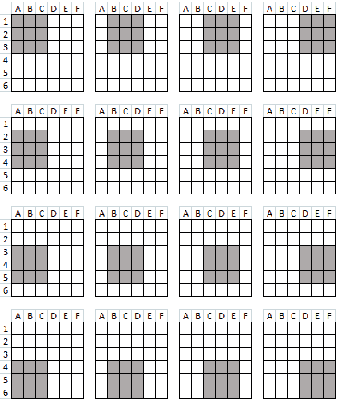
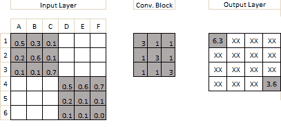
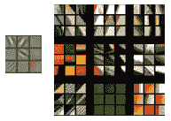
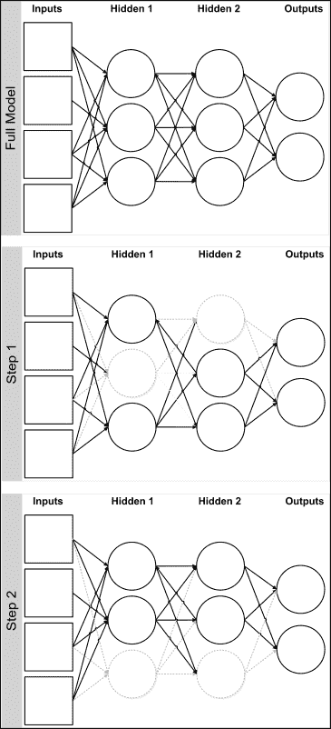
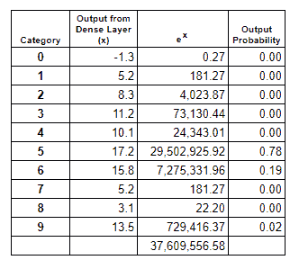
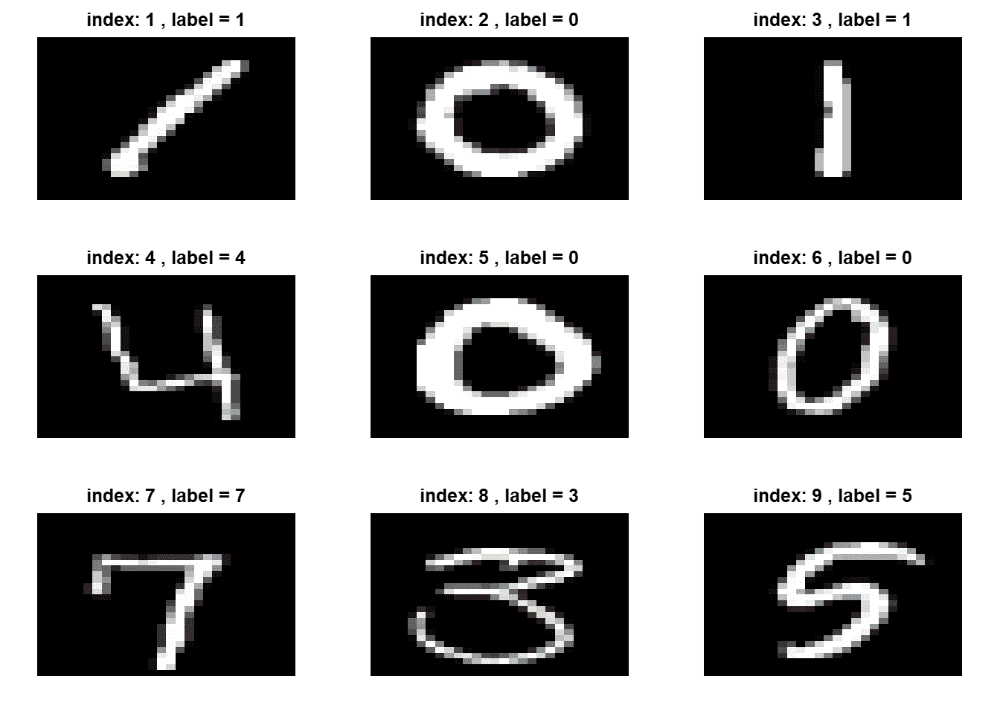
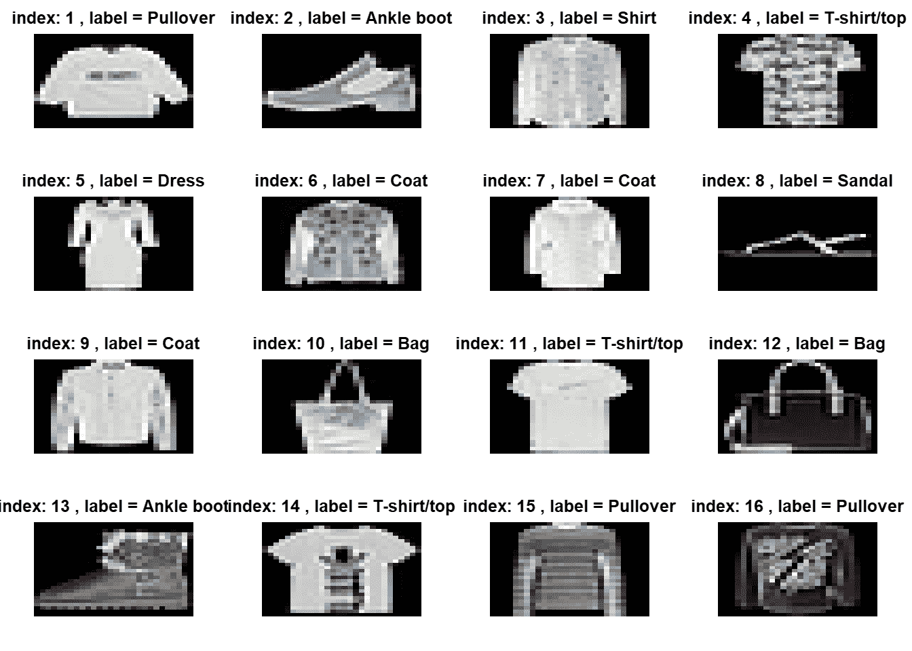
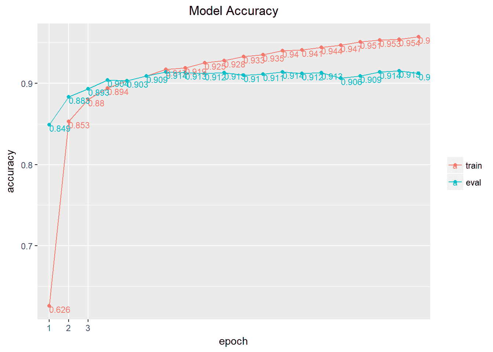

<title>Image Classification Using Convolutional Neural Networks</title>  

# 基于卷积神经网络的图像分类

毫不夸张地说，对深度学习兴趣的巨大增长可以大部分归功于卷积神经网络。**卷积神经网络**(**CNN**)是深度学习中图像分类模型的主要构建模块，已经取代了该领域专家以前使用的大多数技术。深度学习模型现在是执行所有大规模图像任务的事实上的方法，包括图像分类、对象检测、检测人工生成的图像，甚至将文本描述归因于图像。在这一章中，我们将研究其中的一些技术。

为什么 CNN 如此重要？要解释为什么，我们可以看看 ImageNet 竞赛的历史。ImageNet 竞赛是一项开放的大规模图像分类挑战，有一千个类别。可以认为是图像分类的非官方世界锦标赛。主要由学者和研究人员组成的团队来自世界各地。2011 年，25%左右的错误率是基准。2012 年，由 Alex Krizhevsky 领导并由 Geoffrey Hinton 担任顾问的团队以 16%的错误率赢得了比赛，实现了巨大的飞跃。他们的解决方案包括 6000 万个参数和 650，000 个神经元，五个卷积层，其中一些后面是 max-pooling 层，以及三个全连接层，最后一个 1000 路 softmax 层进行最终分类。

其他研究人员在随后的几年中建立了他们的技术，结果是最初的 ImageNet 竞争基本上被认为*已经解决。*2017 年，几乎所有团队都实现了 5%以内的错误率。大多数人认为 2012 年 ImageNet 的胜利预示着新的深度学习革命的到来。

在这一章中，我们将看看使用 CNN 的图像分类。我们将从`MNIST`数据集开始，它被认为是深度学习任务的 *Hello World* 。`MNIST`数据集由 10 类大小为 28 x 28 的灰度图像组成，数字为 0-9。这比 ImageNet 竞赛容易得多；有 10 个类别而不是 1000 个，图像是灰度而不是彩色的，最重要的是，MNIST 图像中没有可能混淆模型的背景。然而，MNIST 任务本身就是一项重要的任务；例如，大多数国家使用包含数字的邮政编码。每个国家都使用自动地址路由解决方案，这是这项任务的更复杂的变体。

我们将使用 Amazon 的 MXNet 库来完成这个任务。MXNet 库是对深度学习的一个很好的库介绍，因为它允许我们在比其他库(如 TensorFlow，我们将在本书的后面介绍)更高的级别上编码。

本章将涵盖以下主题:

*   CNN 是什么？
*   卷积层
*   池层
*   Softmax
*   深度学习架构
*   使用 MXNet 进行图像分类

<title>CNNs</title>  

# CNN

CNN 是深度学习中图像分类的基石。本节将对它们进行介绍，解释 CNN 的历史，并解释它们为什么如此强大。

在我们开始之前，我们将看一个简单的深度学习架构。深度学习模型很难训练，所以使用现有的架构通常是最好的起点。架构是一种现有的深度学习模型，在最初发布时是最先进的。一些例子是 AlexNet、VGGNet、GoogleNet 等等。我们将看到的架构是 Yann LeCun 和其他人在 20 世纪 90 年代中期提出的用于数字分类的 LeNet 架构。该架构用于`MNIST`数据集。该数据集由 28 x 28 大小的灰度图像组成，包含数字 0 到 9。下图显示了 LeNet 架构:


图 5.1:LeNet 架构

原始图像的大小为 28 x 28。我们有一系列隐藏层，它们是卷积层和混合层(在这里，它们被标记为*子采样*)。每个卷积层改变结构；例如，当我们在第一个隐藏层中应用卷积时，我们的输出大小是三维的。我们最后一层的大小是 10 x 1，与类别的数量相同。我们可以在这里应用一个`softmax`函数，将这一层中的值转换成每个类别的概率。具有最高概率的类别将是每个图像的类别预测。

<title>Convolutional layers</title>  

# 卷积层

本节深入介绍卷积层的工作原理。基本上，卷积层只不过是一组滤波器。当你戴着红色眼镜看图像时，所有东西看起来都是红色的。现在，想象一下，如果这些眼镜由嵌入其中的不同色彩组成，可能是一种红色色彩和一种或多种横向绿色色彩。如果你有这样一副眼镜，效果将是突出你面前场景的某些方面。场景中有绿色水平线的任何部分都会变得更加集中。

卷积层在前一层的输出上应用补丁(或卷积)的选择。例如，对于人脸识别任务，第一层的面片识别图像中的基本特征，例如，边缘或对角线。补丁在图像上移动，以匹配图像的不同部分。下面是一个应用于 6 x 6 图像的 3 x 3 卷积块的示例:



图 5.2:应用于图像的单一卷积示例

卷积块中的值被逐元素相乘(即，不是矩阵乘法)，并且这些值被相加以给出单个值。这里有一个例子:



图 5.3:应用于输入层两个部分的卷积块示例

在这个例子中，我们的卷积块是一个对角线模式。图像中的第一块( *A1:C3* )也是对角线图案，所以当我们将元素相乘并求和时，得到了一个相对较大的值 **6.3** 。相比之下，图像中的第二个块( *D4:F6* )是一个水平线模式，所以我们得到一个小得多的值。

很难想象卷积层如何在整个图像中工作，因此下面的 R Shiny 应用程序将更清楚地展示这一点。该应用程序包含在本书的代码中的`Chapter5/server.R`文件中。在 **RStudio** 中打开该文件，选择**运行 app** 。应用程序加载后，从左侧菜单栏选择**卷积层**。该应用程序从`MNIST`数据集中加载前 100 张图像，稍后我们将使用这些图像执行我们的第一个深度学习图像分类任务。这些图像是手写数字 0 到 9 的大小为 28×28 的灰度图像。下面是选择了第四个图像的应用程序的屏幕截图，这是一个 4:


图 5.4:展示水平卷积过滤器的闪亮应用程序

加载后，您可以使用滑块浏览图像。在右上角，有四个卷积层选择应用于图像。在前面的截图中，选择了一个水平线卷积层，我们可以在右上角的文本框中看到它的样子。当我们对左边的输入图像应用卷积滤波器时，我们可以看到右边的结果图像几乎完全是灰色的，除了原始图像中水平线所在的位置。我们的卷积滤波器匹配了图像中有水平线的部分。如果我们将卷积滤波器改为垂直线，我们会得到以下结果:


图 5.5:展示垂直卷积过滤器的闪亮应用程序

现在，我们可以看到，在应用卷积后，原始图像中的垂直线在右侧的结果图像中突出显示。实际上，应用这些过滤器是一种特征提取。我鼓励您使用该应用程序并浏览图像，看看不同的卷积如何应用于不同类别的图像。

这是卷积滤波器的基础，虽然这是一个简单的概念，但当您开始做两件事时，它会变得非常强大:

*   组合许多卷积滤波器以创建卷积层
*   将另一组卷积滤波器(即卷积层)应用于前一卷积层的输出

这可能需要一段时间才能让你明白。如果我对图像应用滤镜，然后对输出应用滤镜，会得到什么结果？如果我第三次应用，即对图像应用滤镜，然后对输出应用滤镜，然后对输出应用滤镜，我会得到什么？答案是，每一个后续图层都会结合先前图层中已识别的特征，以找到更复杂的图案，例如角、弧等。后来的图层发现了更丰富的特征，比如上面有一个圆弧的圆，表示一个人的眼睛。

有两个参数用于控制卷积的移动:填充和步幅。在下图中，我们可以看到原始图像的大小为 6 x 6，而有 4 x 4 个子图。因此，我们将数据表示从 6×6 矩阵简化为 4×4 矩阵。当我们将大小为 *c1* 、 *c2* 的卷积应用于大小为 n，m 的数据时，输出将是 *n-c1+1* 、 *m-c2+1* 。如果我们希望我们的输出和我们的输入一样大，我们可以通过在图像的边界添加零来填充输入。对于前面的例子，我们在整个图像周围添加了一个 1 像素的边框。下图显示了如何将第一个 3 x 3 卷积应用于带有填充的图像:


图 5.6 卷积前应用的填充

我们可以应用于卷积的第二个参数是步幅，它控制卷积的移动。默认值为 1，这意味着卷积每次移动 1，首先向右，然后向下。在实践中，这个值很少改变，所以我们不会进一步考虑它。

我们现在知道卷积的作用就像小的特征生成器，它们被应用于输入层(第一层的图像数据)，并且随后的卷积层发现甚至更复杂的特征。但是它们是如何计算的呢？我们需要手工精心制作一组卷积来应用到我们的模型中吗？答案是否定的；这些卷积是通过梯度下降算法的魔力为我们自动计算出来的。最佳模式是在通过训练数据集的多次迭代之后找到的。

那么，一旦我们超越了 2-3 层，卷积是如何工作的呢？答案是，任何人都很难理解卷积层如何工作的精确数学原理。即使是这些建筑师的最初设计者也不一定能完全理解一系列 CNN 中的隐藏层正在发生什么。如果这让你担心，那么回想一下，在 2012 年赢得 ImageNet 竞赛的解决方案有 6000 万个参数。随着计算能力的进步，深度学习架构可能会有数亿个参数。任何人都不可能完全理解在如此复杂的模型中发生了什么。这就是为什么它们经常被称为**黑盒**模型。

一开始可能会让你大吃一惊。深度学习如何在图像分类中达到人类水平的性能，如果我们不完全了解它们如何工作，我们如何建立深度学习模型？这个问题在很大程度上沿着行业和学术界的分界线划分了深度学习社区。许多(但不是所有)研究人员认为，我们应该对深度学习模型如何工作有一个更基本的理解。一些研究人员还认为，我们只能通过更好地了解当前架构的工作方式来开发下一代人工智能应用。在最近的 NIPS 会议(深度学习最古老、最著名的会议之一)上，深度学习被不利地比作炼金术。与此同时，该行业的从业者并不关心深度学习是如何工作的。他们更专注于构建越来越复杂的深度学习架构，以最大限度地提高准确性或性能。

当然，这只是对行业现状的粗略描述；不是所有的学者都向内看，也不是所有的实践者都只是调整模型来获得小的改进。深度学习仍然相对较新(尽管神经网络的基础模块已经为人所知几十年了)。但这种紧张确实存在，并且已经存在了一段时间——例如，一个流行的深度学习架构引入了 *Inception* 模块，这些模块以 *Inception* 电影命名。在这部电影中，莱昂纳多·迪卡普里奥领导着一个团队，通过将自己嵌入人们的梦境来改变人们的想法和观点。最初，它们深入一层，但随后会更深，实际上是进入梦中的梦。随着他们越走越深，世界变得越来越复杂，结果也越来越不确定。我们不会在这里详细讨论什么是*初始模块*，但是它们并行地结合了卷积层和最大池层。论文的作者承认论文中模型的内存和计算成本，但通过将关键组件命名为 *Inception module，*他们巧妙地暗示了他们站在争论的哪一边。

在 2012 年 ImageNet 竞赛获胜者的突破性表现之后，两名研究人员不满意的是，没有对该模型如何工作的洞察力。他们决定对算法进行逆向工程，试图在特征图中显示导致给定激活的输入模式。这是一项重要的任务，因为原始模型中使用的一些层(例如，池层)丢弃了信息。他们的论文显示了每一层的前 9 个激活。以下是第一层的要素可视化:



图 5.7:CNN 来源:https://cs.nyu.edu/~fergus/papers/zeilerECCV2014.pdf 第一层的特征可视化

图像分为两部分；在左边我们可以看到卷积(本文只强调了每层的 9 个卷积)。在右边，我们可以看到图像中匹配卷积的模式示例。例如，左上角的卷积是对角线边缘检测器。以下是第二层的要素可视化:


图 5.8:CNN 来源:https://cs.nyu.edu/~fergus/papers/zeilerECCV2014.pdf 第二层的特征可视化

同样，左边的图像是卷积的解释，而右边的图像显示了为卷积激活的图像补片的示例。在这里，我们开始看到一些组合模式。例如，在左上角，我们可以看到带条纹的图案。更有趣的是第二行第二列的例子。在这里，我们看到圆形，这可以表明一个人或动物的眼球。现在，让我们转到第三层的特征可视化:


图 5.9:CNN 来源:https://cs.nyu.edu/~fergus/papers/zeilerECCV2014.pdf 第三层的特征可视化

在第三层，我们看到一些非常有趣的模式。在第二行第二列，我们已经确定了汽车的零件(车轮)。在第三行和第三列，我们已经开始识别人的脸。在第二行第四列，我们正在识别图像中的文本。

在本文中，作者展示了更多层的示例。我鼓励您阅读本文，进一步了解卷积层的工作原理。

值得注意的是，尽管深度学习模型可以在图像分类上达到人类水平的性能，但它们不能像人类一样解释图像。他们对猫和狗没有概念。它们只能匹配给定的模式。在论文中，作者强调了一个匹配模式几乎没有共同点的例子；该模型正在匹配背景(草地)中的特征，而不是前景对象。

在另一个图像分类任务中，该模型在实践中失败了。任务是区分狼和狗。该模型在实践中失败了，因为该模型是用狼在其自然栖息地即雪中的数据训练的。因此，模型假设其任务是区分*雪*和*狗*。任何在另一个环境中的狼的图像都被错误地分类了。

由此得到的教训是，您的训练数据应该是多种多样的，并且与模型预计要预测的数据密切相关。这在理论上听起来似乎是显而易见的，但在实践中并不总是容易做到。我们将在下一章进一步讨论这个问题。

<title>Pooling layers</title>  

# 池层

在 CNN 中使用池层来减少模型中的参数数量，因此它们减少了过度拟合。它们可以被认为是一种降维。与卷积层类似，池层移动到上一层，但操作和返回值不同。它返回单个值，并且操作通常是该补丁中单元的最大值，因此命名为 max-pooling。您还可以执行其他操作，例如，平均池，但这不太常见。下面是一个使用 2 x 2 块的最大池的示例。第一个块的值为 7、0、6、6，其中最大值为 7，因此输出为 7。请注意，填充通常不与 max-pooling 一起使用，它通常应用一个 stride 参数来移动块。这里，步幅是 2，所以一旦我们得到第一个块的最大值，我们就向右移动 2 个单元:


图 5.10:应用于矩阵的最大池

我们可以看到 max-pooling 将输出减少了 4 倍；输入是 6×6，输出是 3×3。如果你以前没有见过这个，你的第一反应可能是不相信。为什么我们要丢弃数据？我们为什么要使用最大池？这个答案有三个部分:

*   池化(Pooling):它通常在卷积层之后应用，所以我们不是在像素上执行，而是在匹配的模式上执行。卷积层之后的缩小不会丢弃 75%的输入数据；如果这个模式存在的话，仍然有足够的信号来找到它。
*   **正则化**:如果你学过机器学习，你会知道很多模型都有关联特征的问题，一般建议你去掉关联特征。在图像数据中，特征与其周围的空间模式高度相关。应用最大池减少了数据，同时保持了特性。
*   **执行速度**:当我们考虑前面的两个原因时，我们可以看到 max-pooling 在没有去除太多信号的情况下极大地减小了网络的规模。这使得训练模型更快。

重要的是要注意卷积层与池层所用参数的差异。一般来说，卷积块(3 x 3)比池块(2 x 2)大，它们不应该重叠。例如，不要使用 4 x 4 卷积块和 2 x 2 池块。如果它们重叠，池块将只在相同的卷积块上操作，并且模型将不会正确训练。

<title>Dropout</title>  

# 拒绝传统社会的人

**退出**是一种正规化的形式，旨在防止模特过度适应。过度拟合是指模型正在记忆部分训练数据集，但在看不见的测试数据上不够准确。当您建立模型时，可以通过查看训练集的准确性与测试集的准确性之间的差距来检查过度拟合是否是一个问题。如果在训练数据集上性能好得多，则模型过度拟合。丢弃指的是在训练期间从网络中临时随机移除节点。它通常只应用于隐藏层，而不是输入层。下面是一个应用于神经网络的辍学示例:



图 5.11:深度学习模型中的辍学示例

对于每一次向前传递，不同的节点集被移除，因此网络每次都是不同的。在最初的论文中，辍学被比作合奏技术，在某种程度上确实如此。这与 dropout 的工作方式以及 random forest 为每棵树随机选择要素的方式有一些相似之处。

看待 dropout 的另一种方式是，层中的每个节点必须学会与该层中的所有节点以及它从上一层获得的输入一起工作。它防止一层中的一个或少量节点获得大的权重并控制该层的输出。这意味着层中的每个节点将作为一个组工作，并防止一些节点太懒而另一些节点太占优势。

<title>Flatten layers, dense layers, and softmax</title>  

# 展平图层、密集图层和 softmax

应用多个卷积层后，得到的数据结构是一个多维矩阵(或张量)。我们必须将其转换成所需输出形状的矩阵。例如，如果我们的分类任务有 10 个类(例如，`MNIST`示例有 10 个)，我们需要模型的输出是一个 1 x 10 的矩阵。为此，我们采用卷积层和最大池层的结果，并使用扁平化层来重塑数据。最后一层应该具有与我们希望预测的类别数量相同的节点数量。如果我们的任务是二元分类，我们最后一层的`activation`函数将是 sigmoid。如果我们的任务是二进制分类，我们最后一层的`activation`函数将是 softmax。

在应用 softmax/sigmoid 激活之前，我们可以选择应用一些密集层。密集层只是一个普通的隐藏层，就像我们在[第一章](00c01383-1886-46d0-9435-29dfb3e08055.xhtml)、*深度学习入门*中看到的。

我们需要一个 softmax 图层，因为最后一个图层中的值是数字，但范围从-无穷大到+无穷大。我们必须将这些系列的输入值转换成一系列的概率，这些概率表示该实例对于每个类别的可能性。将这些数值转换为一系列概率的函数必须具有以下特征:

*   每个输出值必须在 0.0 到 1.0 之间
*   输出值的总和应该正好是 1.0

一种方法是通过将每个输入值除以绝对输入值的总和来重新调整值。这种方法有两个问题:

*   它不能正确处理负值
*   重新调整输入值可能会给我们彼此过于接近的概率

这两个问题可以通过首先对每个输入值应用**e^x(其中 e 是 2.71828)然后重新调整这些值来解决。这将把任何负数转换成一个小的正数，并且还会导致概率更加两极分化。这可以用一个例子来说明；在这里，我们可以看到我们的致密层的结果。类别 5 和类别 6 的数值分别为 17.2 和 15.8，非常接近。然而，当我们应用`softmax`函数时，类别 5 的概率值是类别 6 的概率值的 4 倍。`softmax`函数倾向于产生强调一个类别高于所有其他类别的概率，这正是我们想要的:**



图 5.12 soft max 函数示例

<title>Image classification using the MXNet library</title>  

# 使用 MXNet 库进行图像分类

MXNet 包是在[第 1 章](00c01383-1886-46d0-9435-29dfb3e08055.xhtml)、*深度学习入门*中介绍的，因此如果您还没有安装该包，请返回该章以获取安装该包的说明。我们将演示如何在图像数据的分类任务中获得几乎 100%的准确率。我们将使用我们在第 2 章、*中介绍的`MNIST`数据集，使用卷积神经网络进行图像分类*。这个数据集包含手写数字(0-9)的图像，所有图像的大小都是 28 x 28。这是*你好世界！*深度学习同等学力。Kaggle 上有一个使用这个数据集的长期竞争。脚本`Chapter5/explore.Rmd`是一个研究这个数据集的 R markdown 文件。

1.  首先，我们将检查数据是否已经下载，如果没有，我们将下载它。如果数据在该链接处不可用，请参见`Chapter2/chapter2.R`中的代码，了解获取数据的替代方法:

```
dataDirectory <- "../data"
if (!file.exists(paste(dataDirectory,'/train.csv',sep="")))
{
  link <- 'https://apache-mxnet.s3-accelerate.dualstack.amazonaws.com/R/data/mnist_csv.zip'
  if (!file.exists(paste(dataDirectory,'/mnist_csv.zip',sep="")))
    download.file(link, destfile = paste(dataDirectory,'/mnist_csv.zip',sep=""))
  unzip(paste(dataDirectory,'/mnist_csv.zip',sep=""), exdir = dataDirectory)
  if (file.exists(paste(dataDirectory,'/test.csv',sep="")))
    file.remove(paste(dataDirectory,'/test.csv',sep=""))
}
```

2.  接下来，我们将数据读入 R 并检查它:

```
train <- read.csv(paste(dataDirectory,'/train.csv',sep=""), header=TRUE, nrows=20)
```

我们有`20`行和`785`列。这里，我们将查看数据集尾部的行，并查看前 6 列和后 6 列:

```
tail(train[,1:6])
   label pixel0 pixel1 pixel2 pixel3 pixel4
15     3      0      0      0      0      0
16     1      0      0      0      0      0
17     2      0      0      0      0      0
18     0      0      0      0      0      0
19     7      0      0      0      0      0
20     5      0      0      0      0      0

tail(train[,(ncol(train)-5):ncol(train)])
   pixel778 pixel779 pixel780 pixel781 pixel782 pixel783
15        0        0        0        0        0        0
16        0        0        0        0        0        0
17        0        0        0        0        0        0
18        0        0        0        0        0        0
19        0        0        0        0        0        0
20        0        0        0        0        0        0
```

我们有`785`栏目。第一列是数据标签，然后我们有 784 列，分别命名为`pixel0`、…、`pixel783`和像素值。我们的图像是 *28 x 28 = 784* ，所以看起来一切正常。

在开始构建模型之前，最好确保数据格式正确，并且要素和标注正确对齐。让我们绘制前 9 个实例及其数据标签。

3.  为此，我们将创建一个名为`plotInstance`的`helper`函数，它接收像素值并输出带有可选标题的图像:

```
plotInstance <-function (row,title="")
 {
  mat <- matrix(row,nrow=28,byrow=TRUE)
  mat <- t(apply(mat, 2, rev))
  image(mat, main = title,axes = FALSE, col = grey(seq(0, 1, length = 256)))
 }
 par(mfrow = c(3, 3))
 par(mar=c(2,2,2,2))
 for (i in 1:9)
 {
  row <- as.numeric(train[i,2:ncol(train)])
  plotInstance(row, paste("index:",i,", label =",train[i,1]))
 }
```

此代码的输出显示了前 9 幅图像及其分类:



图 5.13:MNIST 数据集中的前 9 幅图像

这就完成了我们的数据探索。现在，我们可以继续使用 MXNet 库创建一些深度学习模型。我们将创建两个模型——第一个是我们将用作基线的标准神经网络。第二个深度学习模型基于一个叫做 **LeNet** 的架构。这是一个旧的架构，但在这种情况下是合适的，因为我们的图像分辨率低，不包含背景。LeNet 的另一个优点是可以快速训练，甚至在 CPU 上训练，因为它没有很多层。

该部分的代码在`Chapter5/mnist.Rmd`中。我们必须将数据读入 R，并将其转换成矩阵。我们将把训练数据分成训练集和测试集，以获得准确的无偏估计。因为我们有大量的行，所以我们可以使用 90/10 的拆分比率:

```
require(mxnet)
options(scipen=999)

dfMnist <- read.csv("../data/train.csv", header=TRUE)
yvars <- dfMnist$label
dfMnist$label <- NULL

set.seed(42)
train <- sample(nrow(dfMnist),0.9*nrow(dfMnist))
test <- setdiff(seq_len(nrow(dfMnist)),train)
train.y <- yvars[train]
test.y <- yvars[test]
train <- data.matrix(dfMnist[train,])
test <- data.matrix(dfMnist[test,])

rm(dfMnist,yvars)
```

每个图像表示为 784 (28 x 28)个像素值的行。每个像素的值在 0-255 的范围内，我们通过除以 255 将其线性转换为 0-1。我们还将输入矩阵转置为因为列主格式，以便在`mxnet`中使用。

```
train <- t(train / 255.0)
test <- t(test / 255.0)
```

在创建模型之前，我们应该检查我们的数据集是否平衡，即每个数字的实例数量是否合理地相等:

```
table(train.y)
## train.y
##    0    1    2    3    4    5    6    7    8    9
## 3716 4229 3736 3914 3672 3413 3700 3998 3640 3782
```

这看起来不错，我们现在可以继续创建一些深度学习模型。

<title>Base model (no convolutional layers)</title>  

# 基本模型(无卷积层)

现在我们已经探索了数据，我们对它看起来没问题感到满意，下一步是创建我们的第一个深度学习模型。这类似于我们在前一章看到的例子。其代码在`Chapter5/mnist.Rmd`中:

```
data <- mx.symbol.Variable("data")
fullconnect1 <- mx.symbol.FullyConnected(data, name="fullconnect1", num_hidden=256)
activation1 <- mx.symbol.Activation(fullconnect1, name="activation1", act_type="relu")
fullconnect2 <- mx.symbol.FullyConnected(activation1, name="fullconnect2", num_hidden=128)
activation2 <- mx.symbol.Activation(fullconnect2, name="activation2", act_type="relu")
fullconnect3 <- mx.symbol.FullyConnected(activation2, name="fullconnect3", num_hidden=10)
softmax <- mx.symbol.SoftmaxOutput(fullconnect3, name="softmax")
```

让我们详细看看这段代码:

1.  在`mxnet`中，我们使用自己的数据类型符号来配置网络。
2.  我们创建第一个隐藏层(`fullconnect1 <- ....`)。这些参数是作为输入的数据、层的名称和层中神经元的数量。
3.  我们应用一个激活函数到`fullconnect`层(`activation1 <- ....`)。`mx.symbol.Activation`函数从第一个隐藏层`fullconnect1`获取输出。
4.  第二个隐藏层(`fullconnect1 <- ....`)以`activation1`为输入。
5.  第二次激活类似于`activation1`。
6.  `fullconnect3`是输出层。这一层有 10 个神经元，因为这是一个多分类问题，有 10 个类。
7.  最后，我们使用 softmax 激活来获得每个类的概率预测。

现在，让我们训练基本模型。我安装了一个 GPU，所以我可以使用它。您可能需要将该行改为`devices <- mx.cpu()`:

```
devices <- mx.gpu()
mx.set.seed(0)
model <- mx.model.FeedForward.create(softmax, X=train, y=train.y,
                                     ctx=devices,array.batch.size=128,
                                     num.round=10,
                                     learning.rate=0.05, momentum=0.9,
                                     eval.metric=mx.metric.accuracy,
                                     epoch.end.callback=mx.callback.log.train.metric(1))
```

为了进行预测，我们将调用`predict`函数。然后，我们可以创建一个混淆矩阵，并计算测试数据的准确度:

```
preds1 <- predict(model, test)
pred.label1 <- max.col(t(preds1)) - 1
res1 <- data.frame(cbind(test.y,pred.label1))
table(res1)
##      pred.label1
## test.y   0   1   2   3   4   5   6   7   8   9
##      0 405   0   0   1   1   2   1   1   0   5
##      1   0 449   1   0   0   0   0   4   0   1
##      2   0   0 436   0   0   0   0   3   1   1
##      3   0   0   6 420   0   1   0   2   8   0
##      4   0   1   1   0 388   0   2   0   1   7
##      5   2   0   0   6   1 363   3   0   2   5
##      6   3   1   3   0   2   1 427   0   0   0
##      7   0   2   3   0   1   0   0 394   0   3
##      8   0   4   2   4   0   2   1   1 403   6
##      9   1   0   1   2   7   0   1   1   0 393

accuracy1 <- sum(res1$test.y == res1$pred.label1) / nrow(res1)
accuracy1
## 0.971
```

我们基本模型的精度是`0.971`。还不错，但是让我们看看我们是否能改进它。

<title>LeNet</title>  

# LeNet

现在，我们可以基于 LeNet 架构创建一个模型。这是一个非常简单的模型；我们有两组卷积层和池层，然后是一个扁平化层，最后是两个密集层。其代码在`Chapter5/mnist.Rmd`中。首先让我们定义模型:

```
data <- mx.symbol.Variable('data')
# first convolution layer
convolution1 <- mx.symbol.Convolution(data=data, kernel=c(5,5), num_filter=64)
activation1 <- mx.symbol.Activation(data=convolution1, act_type="tanh")
pool1 <- mx.symbol.Pooling(data=activation1, pool_type="max",
                           kernel=c(2,2), stride=c(2,2))

# second convolution layer
convolution2 <- mx.symbol.Convolution(data=pool1, kernel=c(5,5), num_filter=32)
activation2 <- mx.symbol.Activation(data=convolution2, act_type="relu")
pool2 <- mx.symbol.Pooling(data=activation2, pool_type="max",
                           kernel=c(2,2), stride=c(2,2))

# flatten layer and then fully connected layers
flatten <- mx.symbol.Flatten(data=pool2)
fullconnect1 <- mx.symbol.FullyConnected(data=flatten, num_hidden=512)
activation3 <- mx.symbol.Activation(data=fullconnect1, act_type="relu")
fullconnect2 <- mx.symbol.FullyConnected(data=activation3, num_hidden=10)
# final softmax layer
softmax <- mx.symbol.SoftmaxOutput(data=fullconnect2)

```

现在，让我们重塑数据，以便它可以在 MXNet 中使用:

```
train.array <- train
dim(train.array) <- c(28,28,1,ncol(train))
test.array <- test
dim(test.array) <- c(28,28,1,ncol(test))
```

最后，我们可以建立模型:

```
devices <- mx.gpu()
mx.set.seed(0)
model2 <- mx.model.FeedForward.create(softmax, X=train.array, y=train.y,
                                     ctx=devices,array.batch.size=128,
                                     num.round=10,
                                     learning.rate=0.05, momentum=0.9, wd=0.00001,
                                     eval.metric=mx.metric.accuracy,
                                     epoch.end.callback=mx.callback.log.train.metric(1))
```

最后，让我们来评估模型:

```
preds2 <- predict(model2, test.array)
pred.label2 <- max.col(t(preds2)) - 1
res2 <- data.frame(cbind(test.y,pred.label2))
table(res2)
## pred.label2
## test.y   0   1   2   3   4   5   6   7   8   9
##      0 412   0   0   0   0   1   1   1   0   1
##      1   0 447   1   1   1   0   0   4   1   0
##      2   0   0 438   0   0   0   0   3   0   0
##      3   0   0   6 427   0   1   0   1   2   0
##      4   0   0   0   0 395   0   0   1   0   4
##      5   1   0   0   5   0 369   2   0   1   4
##      6   2   0   0   0   1   1 432   0   1   0
##      7   0   0   2   0   0   0   0 399   0   2
##      8   1   0   1   0   1   1   1   1 414   3
##      9   2   0   0   0   4   0   0   1   1 398

accuracy2
## 0.9835714
```

我们的 CNN 模型的精确度是`0.9835714`，这比我们的基础模型的精确度`0.971`有了很大的提高。

最后，我们可以在 R 中可视化我们的模型:

```
graph.viz(model2$symbol)
```

这产生了下面的图，该图显示了深度学习模型的架构:


图 5.14:卷积深度学习模型(LeNet)

恭喜你！你已经建立了一个准确率超过 98%的深度学习模型！

我们在*图 5.1* 中看到了 LeNet 的架构，我们已经使用 MXNet 库对其进行了编程。让我们更详细地分析 LeNet 架构。本质上，我们有两个卷积组和两个全连接层。我们的卷积组有一个卷积层，接着是一个`activation`函数，然后是一个池层。这种层的组合在许多深度学习图像分类任务中非常常见。第一卷积层具有 64 个 5×5 大小的块，没有填充。这可能会遗漏图像边缘的一些特征，但是如果我们回头看看图 5.15 中的样本图像，我们可以看到大多数图像在边界周围没有任何数据。我们使用带有`pool_type=max`的池层。其他类型也是可能的；平均池是常用的，但最近已经失宠。这是另一个值得尝试的超参数。我们以 2 x 2 计算我们的池，然后将`(“jump”)`向前移动 2。因此，每个输入值在最大池层中仅使用一次。

我们使用`tanh`作为第一个卷积块的`activation`函数，然后对后续层使用`relu`。如果你愿意，你可以试着改变这些，看看它们有什么效果。一旦我们执行了卷积层，我们就可以使用 Flatten 将数据重组为一种完全连接的层可以使用的格式。完全连接的层只是层中节点的集合，也就是说，类似于前面代码中基本模型中的层。我们有两层，一层有 512 个节点，另一层有 10 个节点。我们在最后一层选择 10 个节点，因为这是我们问题中的类别数。最后，我们使用 softmax 将这一层中的数字量转换为每个类别的一组概率。我们已经实现了 98.35%的准确率，这是对一个*正常*深度学习模型的相当大的改进，但仍有改进的空间。有些模型在这个数据集上可以得到 99.5%的准确率，也就是 1000 条中有 5 条错误分类的记录。接下来，我们将看一个不同的数据集，它与 MNIST 相似，但比 MNIST 更难。这是时尚`MNIST`数据集，有和 MNIST 一样大小的灰度图像，也有 10 个类别。

<title>Classification using the fashion MNIST dataset</title>  

# 使用时尚 MNIST 数据集进行分类

这个数据集和`MNIST`的结构是一样的，所以我们可以改变我们的数据集，使用现有的样板代码来加载数据。脚本`Chapter5/explore_Fashion.Rmd`是一个研究这个数据集的 R markdown 文件；它与我们用于`MNIST`数据集的`explore.Rmd`几乎相同，所以我们不再重复。`explore.Rmd`的唯一变化是输出标签。我们将看 16 个例子，因为这是一个新的数据集。以下是来自该数据集的一些示例图像，它们是使用我们用于创建`MNIST`数据集示例的相同样板代码创建的:



图 5.15:来自时尚 MNIST 数据集的一些图片

关于这个数据集的一个有趣的事实是，发布它的公司也创建了一个 GitHub 知识库，他们在这里根据这个数据集测试机器学习库。基准可在[http://fashion-mnist.s3-website.eu-central-1.amazonaws.com/](http://fashion-mnist.s3-website.eu-central-1.amazonaws.com/)获得。如果我们浏览这些结果，他们尝试的机器库没有一个达到 90%以上的准确率(他们没有尝试深度学习)。这是我们想要用深度学习分类器击败的目标。深度学习模型代码在`Chapter5/fmnist.R`中，在这个数据集上达到了 91%以上的准确率。与上面的模型体系结构有一些微小但重要的区别。试着在不偷看解释的情况下发现它们。

首先，让我们定义模型架构。

```
data <- mx.symbol.Variable('data')
# first convolution layer
convolution1 <- mx.symbol.Convolution(data=data, kernel=c(5,5),
                                      stride=c(1,1), pad=c(2,2), num_filter=64)
activation1 <- mx.symbol.Activation(data=convolution1, act_type=act_type1)
pool1 <- mx.symbol.Pooling(data=activation1, pool_type="max",
                           kernel=c(2,2), stride=c(2,2))

# second convolution layer
convolution2 <- mx.symbol.Convolution(data=pool1, kernel=c(5,5),
                                      stride=c(1,1), pad=c(2,2), num_filter=32)
activation2 <- mx.symbol.Activation(data=convolution2, act_type=act_type1)
pool2 <- mx.symbol.Pooling(data=activation2, pool_type="max",
                           kernel=c(2,2), stride=c(2,2))

# flatten layer and then fully connected layers with activation and dropout
flatten <- mx.symbol.Flatten(data=pool2)
fullconnect1 <- mx.symbol.FullyConnected(data=flatten, num_hidden=512)
activation3 <- mx.symbol.Activation(data=fullconnect1, act_type=act_type1)
drop1 <- mx.symbol.Dropout(data=activation3,p=0.4)
fullconnect2 <- mx.symbol.FullyConnected(data=drop1, num_hidden=10)
# final softmax layer
softmax <- mx.symbol.SoftmaxOutput(data=fullconnect2)
```

现在让我们训练模型:

```
logger <- mx.metric.logger$new()
model2 <- mx.model.FeedForward.create(softmax, X=train.array, y=train.y,
                                     ctx=devices, num.round=20,
                                     array.batch.size=64,
                                     learning.rate=0.05, momentum=0.9,
                                     wd=0.00001,
                                     eval.metric=mx.metric.accuracy,
                                     eval.data=list(data=test.array,labels=test.y),
                                     epoch.end.callback=mx.callback.log.train.metric(100,logger))
```

第一个变化是我们切换使用`relu`作为所有层的`Activation`函数。另一个变化是，我们对卷积层使用填充，这样做是为了捕捉图像边界的特征。我们增加了每层中的节点数量，以增加模型的深度。我们还添加了一个 dropout 层，以防止模型过度拟合。我们还在模型中添加了日志记录，它输出每个时期的训练和验证指标。我们用这些来检查我们的模型表现如何，并决定它是否过度拟合。

以下是该模型的精度结果和诊断图:

```
preds2 <- predict(model2, test.array)
pred.label2 <- max.col(t(preds2)) - 1
res2 <- data.frame(cbind(test.y,pred.label2))
table(res2)
      pred.label2
test.y   0   1   2   3   4   5   6   7   8   9
     0 489   0  12  10   0   0  53   0   3   0
     1   0 586   1   6   1   0   1   0   0   0
     2   8   1 513   7  56   0  31   0   0   0
     3  13   0   3 502  16   0  26   1   1   0
     4   1   1  27  13 517   0  32   0   2   0
     5   1   0   0   0   0 604   0   9   0   3
     6  63   0  47   9  28   0 454   0   3   0
     7   0   0   0   1   0  10   0 575   1  11
     8   0   0   1   0   1   2   1   0 618   0
     9   0   0   0   0   0   1   0  17   1 606
accuracy2 <- sum(res2$test.y == res2$pred.label2) / nrow(res2)
accuracy2
# 0.9106667
```

需要注意的一点是，我们在培训期间使用相同的验证/测试集来显示指标，并评估最终的模型。这不是一个好的实践，但是在这里是可以接受的，因为我们没有使用验证度量来调整模型的超参数。我们 CNN 模型的精度是`0.9106667`。

让我们绘制模型训练时训练集和验证集的准确性。深度学习模型代码有一个`callback`功能，在模型被训练时保存指标。我们可以用它来绘制每个时期的训练和验证指标:

```
# use the log data collected during model training
dfLogger<-as.data.frame(round(logger$train,3))
dfLogger2<-as.data.frame(round(logger$eval,3))
dfLogger$eval<-dfLogger2[,1]
colnames(dfLogger)<-c("train","eval")
dfLogger$epoch<-as.numeric(row.names(dfLogger))

data_long <- melt(dfLogger, id="epoch")

ggplot(data=data_long,
       aes(x=epoch, y=value, colour=variable,label=value)) +
  ggtitle("Model Accuracy") +
  ylab("accuracy") +
  geom_line()+geom_point() +
  geom_text(aes(label=value),size=3,hjust=0, vjust=1) +
  theme(legend.title=element_blank()) +
  theme(plot.title = element_text(hjust = 0.5)) +
  scale_x_discrete(limits= 1:nrow(dfLogger))
```

这向我们展示了我们的模型在每个时期(或训练运行)后的表现。这将生成以下屏幕截图:



图 5.16:按历元的训练和验证准确性

该图中的两个要点是:

*   模型过拟合。我们可以看到在 **0.95xxx** 的训练集和 **0.91xxx** 的验证集上的性能有明显的差距。
*   我们可能在 8 个时期后停止模型训练，因为在这一点后性能没有改善。

正如我们在前面章节中讨论的那样，深度学习模型在默认情况下几乎总是会过拟合，但有方法可以否定这一点。第二个问题与*提前停止*有关，重要的是你知道如何做到这一点，这样你就不会浪费时间继续训练一款不再改进的车型。如果您正在使用云资源构建模型，这一点尤其重要。我们将在下一章中研究这些以及更多与构建深度学习模型相关的问题。

<title>References/further reading</title>  

# 参考资料/进一步阅读

这些论文是该领域经典的深度学习论文。其中一些记录了 ImageNet 竞赛的获胜方法。我鼓励你下载并阅读它们。一开始你可能不理解它们，但随着你继续深入学习的旅程，它们的重要性会变得更加明显。

*   克里日夫斯基、亚历克斯、伊利亚·苏茨基弗和杰弗里·e·辛顿。*深度卷积神经网络的 ImageNet 分类*。神经信息处理系统进展。2012.
*   Szegedy，Christian 等人*用卷积加深*。Cvpr，2015。
*   分类的学习算法:手写数字识别的比较。神经网络:统计力学观点 261 (1995): 276。
*   泽勒，马修 d 和罗布弗格斯。*可视化和理解卷积网络*。欧洲计算机视觉会议。施普林格，查姆，2014 年。
*   Srivastava，Nitish 等人*辍学:防止神经网络过度拟合的简单方法*。《机器学习研究杂志》15.1 (2014): 1929-1958。

<title>Summary</title>  

# 摘要

在这一章中，我们使用深度学习进行图像分类。我们讨论了影像分类中使用的不同图层类型:卷积图层、池化图层、下降图层、密集图层和 softmax 激活函数。我们看到了一个 R-Shiny 应用程序，它展示了卷积层如何对图像数据执行特征工程。

我们使用 R 中的 MXNet 深度学习库创建了一个基本的深度学习模型，获得了 97.1%的准确率。然后我们开发了一个基于 LeNet 架构的 CNN 深度学习模型，在测试数据上达到了 98.3%以上的准确率。我们还使用了一个稍微难一点的数据集(`Fashion MNIST`)，并创建了一个新的模型，达到了 91%以上的准确率。这个准确度分数优于所有其他使用非深度学习算法的分数。在下一章中，我们将建立在我们已经覆盖的基础上，并向您展示我们如何利用预训练模型进行分类，以及作为新的深度学习模型的构建模块。

在下一章，我们将讨论深度学习中关于调整和优化模型的重要主题。这包括如何使用您可能拥有的有限数据、数据预处理、数据扩充和超参数选择。