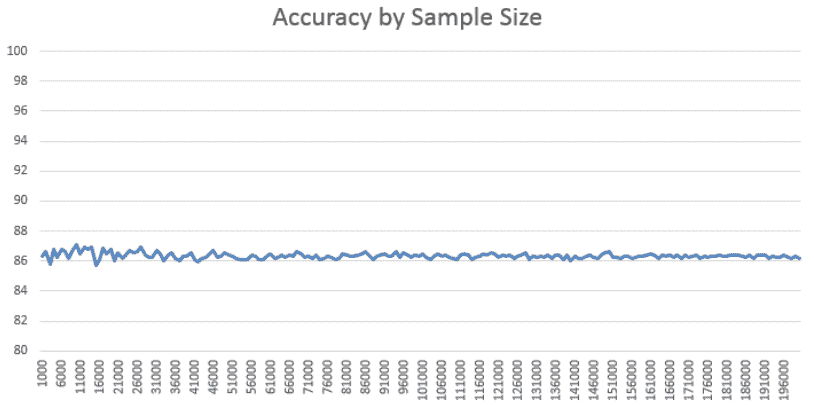
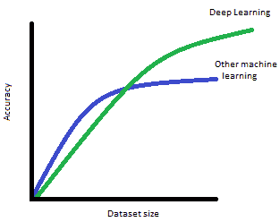
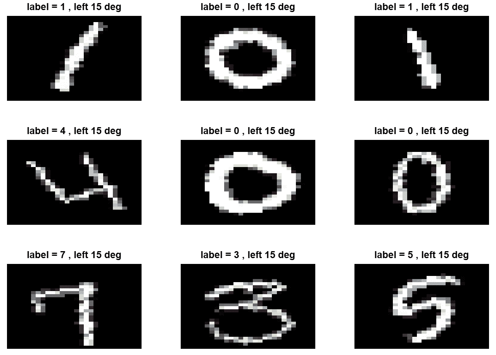
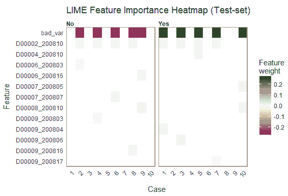
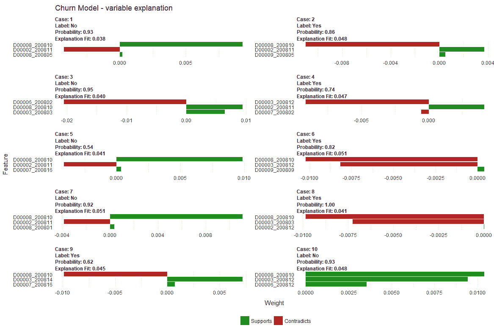
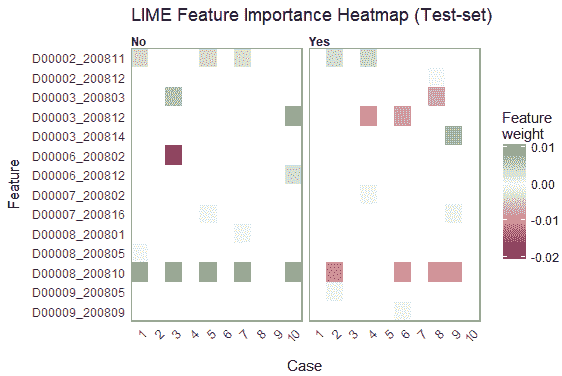

# 调整和优化模型

在前两章中，我们为分类、回归和图像识别任务训练了深度学习模型。在这一章中，我们将讨论一些关于管理深度学习项目的重要问题。虽然这一章可能看起来有点理论化，但如果讨论的任何问题没有得到正确的管理，它可能会破坏你的深度学习项目。我们将了解如何选择评估指标，以及如何在开始建模之前对深度学习模型的表现进行评估。接下来，我们将讨论数据分布以及在将数据划分到正确的分区进行训练时经常出现的错误。许多机器学习项目在生产使用中失败，因为数据分布与模型训练的数据分布不同。我们将研究数据扩充，这是一种提高模型准确性的有价值的方法。最后，我们将讨论超参数，并学习如何调整它们。

在本章中，我们将探讨以下主题:

*   评估指标和评估绩效
*   数据准备
*   数据预处理
*   数据扩充
*   调谐超参数
*   用例—可解释性


# 评估指标和评估绩效

本节将讨论如何建立深度学习项目以及选择什么评估指标。我们将看看如何选择评估标准，以及如何决定模型何时接近最佳性能。我们还将讨论所有深度学习模型如何倾向于过度拟合，以及如何管理偏差/方差权衡。这将为模型精度低时的处理提供指导。


# 评估指标的类型

不同的评估标准用于分类和回归任务。对于分类，准确性是最常用的评估标准。然而，只有当所有类别的错误成本相同时，准确性才有效，但情况并非总是如此。例如，在医学诊断中，假阴性的成本将比假阳性的成本高得多。在这种情况下，假阴性表示该人没有生病，而诊断的延误可能会产生严重甚至致命的后果。另一方面，假阳性是说这个人生病了，而他们并没有生病，这让那个人感到不安，但没有生命危险。

当您拥有不平衡的数据集时，也就是说，当一个类比另一个类更常见时，这个问题会变得更加复杂。回到我们的医疗诊断例子，如果只有 1%接受测试的人实际上患有该疾病，那么机器学习算法可以通过宣布没有人患有该疾病来获得 99%的准确率。在这种情况下，您可以查看其他指标，而不是准确性。对不平衡数据集有用的一个这样的度量是 F1 评估度量，它是精度和召回的加权平均值。F1 分数的计算公式如下:

*F1 = 2 *(精度*召回)/(精度+召回)*

精确度和召回率的公式如下:

*精度=真 _ 正/(真 _ 正+假 _ 正)*
*召回=真 _ 正/(真 _ 正+假 _ 负)*

对于回归，您可以选择评估指标:MAE、MSE 和 RMSE。 **MAE** ，或**平均绝对误差**，是最简单的；它只是实际值和预测值的绝对差值的平均值。MAE 的优点是容易理解；如果 MAE 为 3.5，那么预测值与实际值之差平均为 3.5。 **MSE** ，或**均方误差**，是均方误差的平均值，即取实际值与预测值之差，求平方，然后取那些值的平均值。与 MAE 相比，使用 MSE 的优势在于它根据错误的严重程度来惩罚错误。如果两行的实际值和预测值之间的差是 2 和 5，那么 MSE 会将更多的权重放在第二个示例上，因为误差更大。 **RMSE** 或**均方根误差**，是 MSE 的平方根。使用 MSE 的优点是，它将误差项转换成与实际值相当的单位。对于回归任务，RMSE 通常是首选指标。

关于 MXNet 中度量的更多信息，请参见[https://MXNet . incubator . Apache . org/API/python/metric/metric . html](https://mxnet.incubator.apache.org/api/python/metric/metric.html)。

有关 Keras 指标的更多信息，请参见 https://keras.io/metrics/。


# 评估绩效

我们已经在前面的章节中探索了一些深度学习模型。在第五章、*使用卷积神经网络进行图像分类的[数据集上，我们的图像分类任务获得了 98.36%的准确率。](1c0b9897-b0cc-4a8f-9ce8-e6409c347f4f.xhtml)*对于[第四章](28315a07-2bf0-45c8-8e6f-0e4f01616ca3.xhtml)、*训练深度预测模型*中的二元分类任务(预测未来 14 天哪些客户会回访)，我们得到了 77.88%的准确率。但这实际上意味着什么，我们如何评估深度学习模型的性能？

评估您的深度学习模型是否具有良好的预测能力的明显起点是通过将其与其他模型进行比较。`MNIST`数据集在深度学习研究的很多基准测试中使用，所以我们知道有达到 99.5%准确率的模型。所以，我们的模式还可以，但不算伟大。在本章的*D*D*数据扩充*一节中，我们将通过对现有图像数据进行更改而创建的新图像来扩充我们的数据，从而显著改进我们的模型，从 98.36%的准确度提高到 98.95%的准确度。一般来说，对于图像分类任务，任何低于 95%的准确率都可能表明你的深度学习模型有问题。要么是模型设计不正确，要么是您没有足够的数据来完成任务。

我们的二元分类模型只有 77.54%的准确率，远低于图像分类任务。那么，它是一个可怕的模型吗？不尽然；它仍然是一个有用的模型。我们也有一些来自其他机器学习模型的基准，如随机森林和 xgboost，我们对一小部分数据进行了测试。我们还看到，当我们从一个有 3，900 行的模型转移到一个有 390，000 行的更深层次的模型时，准确性有所提高。这凸显了深度学习模型随着更多的数据而改进。

评估模型性能的一个步骤是查看更多数据是否会显著提高准确性。数据可以从更多的训练数据中获得，或者从数据扩充中获得，我们将在后面看到。您可以使用学习曲线来评估这是否有助于提高性能。要创建学习曲线，您需要训练一系列大小递增的机器学习模型，例如，以 1，000 行为步长，从 10，000 行到 200，000 行。对于每一步，运行`5`不同的机器学习模型来平滑结果，并根据样本大小绘制平均准确度。以下是执行此任务的伪代码:

```
For k=10000 to 200000 step 1000
   For n=1 to 5
       [sample] = Take k rows from dataset
       Split [sample] into train (80%) / test (20%)
       Run ML (DT) algorithm
       Calculate Accuracy on test
       Save accuracy value
Plot k, avg(Accuracy)
```

这是一个学习曲线图的例子，针对与流失问题类似的任务:



图 6.1:一个学习曲线的例子，它根据数据大小来绘制精确度

在这种情况下，准确性在一个非常窄的范围内，并且随着实例数量的增加而稳定。因此，对于这种算法和超参数选择，增加更多的数据不会显著增加精度。

如果我们得到的学习曲线是平的，就像这个例子一样，那么向现有模型中添加更多的数据不会提高准确性。我们可以通过改变模型架构或者添加更多的特性来提高我们的性能。我们在[第 5 章](1c0b9897-b0cc-4a8f-9ce8-e6409c347f4f.xhtml)、*使用卷积神经网络进行图像分类*中讨论了一些选项。

回到我们的二元分类模型，让我们考虑如何在生产中使用它。回想一下，这个模型试图预测客户是否会在接下来的 *x* 天内返回。这又是那个模型的混淆矩阵:

```
      Predicted
Actual     0     1
 0     10714  4756
 1      3870 19649
```

如果我们观察每个类别的模型表现，我们会得到不同的准确率:

*   对于`Actual=0`，我们得到 *10714 / (10714 + 4756) = 69.3%* 值正确。这被称为特异性或真阴性率。
*   对于`Actual=1`，我们得到*19649/(3466**+19649)= 85.0%*值正确。这被称为敏感度或真实阳性率。

对于这个用例，敏感性可能比特异性更重要。如果我是一名高级经理，我会更有兴趣知道哪些客户预计会再次光顾，但没有。可以向这个群体发送报价来吸引他们回来。下面是一位高级经理可能如何使用该模型，假设该模型用于预测一个人是否在 9 月 1 日至 9 月 14 日期间上班。9 月 15 日，我们得到了前面的混淆矩阵。经理应该如何分配他/她有限的营销预算？

*   我看到有 4756 名顾客被预测不会再来，但实际上却回来了。这很好，但我真的不能这样做。我可以尝试向没有返回的 10，135 人发送报价，但由于我的模型已经预测他们不会返回，我预计回复率会很低。
*   3870 名预计会再次光顾但没有回来的顾客更有意思。在这些人的行为改变成为永久性的之前，应该向他们发送要约，以吸引他们回来。这只代表了我的客户群的 9.9%，所以通过只向这些客户发送报价，我不会因为向我的大量客户发送报价而稀释我的预算。

预测模型不应孤立使用；其他指标应该与它结合起来制定营销策略。例如，**客户终身价值** ( **CLV** )可以与预测模型相结合，它衡量客户的预期未来收入减去重新获得该客户的成本。通过结合使用预测模型和 CLV，我们可以根据客户的预测未来价值对可能会再次光顾的客户进行优先排序。

总结一下这一部分，人们很容易沉迷于优化评估指标，尤其是如果您是这个领域的新手。作为一名数据科学家，你应该永远记住，优化机器学习任务的评估指标不是最终目标——它只是改善业务某些部分的代理。你必须能够将你的机器学习模型的结果链接回一个业务用例。在某些情况下，例如，`MNIST`数据集中的数字识别，在您的评估指标和您的业务案例之间有直接的联系。但有时它并不那么明显，你需要帮助与企业合作，找出如何使用你的分析结果来最大化公司的利益。


# 数据准备

机器学习是指训练一个模型，对它看到的情况进行归纳，以便它可以对看不见的数据进行预测。因此，用于训练深度学习模型的数据应该与模型在生产中看到的数据相似。然而，在早期产品阶段，您可能只有很少或没有数据来训练模型，那么您能做什么呢？例如，移动应用程序可以包括预测移动相机拍摄的图像主题的机器学习模型。在编写应用程序时，可能没有足够的数据来使用深度学习网络训练模型。一种方法是用来自其他来源的图像来增强数据集，以训练深度学习网络。但是，您需要知道如何管理这一点，以及如何处理它所带来的不确定性。另一种方法是迁移学习，我们将在第 11 章、*深度学习的下一个层次*中讨论。

深度学习和传统机器学习的另一个区别是数据集的大小。这可能会影响用于在训练/测试之间分割数据的比率-为机器学习将数据分割为 70/30 或 80/20 分割的建议准则需要针对训练深度学习模型进行修订。


# 不同的数据分布

在前面的章节中，我们使用 MNIST 数据集进行分类。虽然该数据集包含手写数字，但这些数据并不代表现实生活中的数据。在[第 5 章](1c0b9897-b0cc-4a8f-9ce8-e6409c347f4f.xhtml)、*使用卷积神经网络的图像分类中，*我们可视化了一些数字，如果你回头看看这些图像，很明显这些图像是标准格式的:

*   这里全是灰度
*   这些图像都是 28 x 28 的
*   这些图像看起来都有至少 1 个像素的边界
*   这些图像都具有相同的比例，也就是说，每个图像占据了图像的大部分
*   失真非常小，因为边框是黑色的，前景是白色的
*   图像是*的右上方*，也就是说，我们没有任何主要的旋转

MNIST 数据集的原始用例是识别字母上的 5 位数邮政编码。让我们假设我们在 MNIST 数据集中的 60，000 张图像上训练一个模型，并希望在生产环境中使用它来从信件和包裹中识别邮政编码。以下是生产系统在应用深度学习之前必须经历的步骤:

*   扫描信件
*   查找邮政编码部分
*   将邮政编码分成 5 个不同的区域(每个区域一个数字)

在这些数据转换步骤的任何一个中，都可能发生额外的数据偏差。如果我们使用*干净的* MNIST 数据来训练模型，然后试图预测*有偏差的*转换数据，那么我们的模型可能不会工作得那么好。偏差如何影响生产数据的例子包括:

*   正确定位邮政编码本身就是一个难题
*   信件将具有不同颜色和对比度的背景和前景，因此根据信件/包裹上使用的信件和笔的类型，将它们转换为灰度可能不一致
*   由于使用了不同的硬件和软件，扫描过程的结果可能会有所不同——这是在将深度学习应用于医学图像数据时一直存在的问题
*   最后，将邮政编码分成 5 个不同区域的难度取决于所用的字母和笔，以及前面步骤的质量

在此示例中，用于定型和评估模型性能的数据分布不同于生产数据。如果数据科学家承诺在部署模型之前提供 99%的准确性，那么当应用程序在生产中运行时，高级管理人员很可能会失望！创建新模型时，我们将数据拆分为训练和测试拆分，因此测试数据集的主要目的是评估模型的准确性。但是，如果测试数据集中的数据与模型在生产中看到的不同，那么测试数据集中的评估指标就不能很好地指导模型在生产中的表现。

如果问题在于很少或根本没有实际的标注数据集，那么在进行任何模型训练之前，首先要考虑的一个步骤就是调查是否可以获取更多的数据。获取数据可能需要建立一个小型生产环境，与客户合作，或者结合使用半监督和人工标签。在我们刚刚看到的用例中，我认为在查看任何机器学习之前，设置提取数字化图像的流程更重要。一旦设置好了，我就会建立一些训练数据——这可能还不足以建立一个模型，但它可以作为一个适当的测试集来创建反映实际表现的评估指标。这可能看起来很明显，因为基于有缺陷的评估指标的过于乐观的期望可能是数据科学项目中的三大问题之一。

一个非常大规模的项目很好地解决了这个问题的一个例子是 Airbnb 中的这个用例:[https://medium . com/Airbnb-engineering/categoring-listing-photos-at-Airbnb-f 9483 F3 ab 7 e 3](https://medium.com/airbnb-engineering/categorizing-listing-photos-at-airbnb-f9483f3ab7e3)。他们有大量的房屋内部照片，但这些照片没有标明房间类型。他们利用现有的标签数据，并进行质量保证，以检查标签的准确性。数据科学中经常说，创建机器学习模型可能只占实际工作的 20%——获取一个准确的大型标记数据集，以代表模型在生产中会看到的东西，通常是深度学习项目中最困难的任务。

一旦有了数据集，就需要在建模之前将数据拆分为训练和测试拆分。如果你有传统机器学习的经验，你可以从 70/30 分割开始，即 70%用于训练模型，30%用于评估模型。然而，这个规则在大型数据集和训练深度学习模型的世界中不太有效。同样，将数据划分为定型集和测试集的唯一原因是有一个维持集来估计模型的性能。因此，您只需要在这个数据集中有足够的记录，这样您得到的精度估计值是可靠的，并且具有您需要的精度。如果您有一个大的数据集，那么对于测试数据集来说，较小的百分比可能就足够了。让我用一个例子来解释这一点，你想在现有的机器学习模型上进行改进:

*   先前的机器学习模型具有 99.0%的准确度
*   有一个包含 1，000，000 条记录的标记数据集

如果要训练一个新的机器学习模型，那么它应该至少有 99.1%的准确率，你才能确信它是对现有模型的改进。评估现有模型时需要多少条记录？您只需要足够的记录，这样您就可以相当确定新模型上的精度精确到 0.1%。因此，测试集中的 50，000 条记录(占数据集的 5%)足以评估您的模型。如果这 50，000 条记录的准确率为 99.1%，则有 49，550 条记录。这表示比基准模型多 50 个正确分类的记录，这将强烈表明第二个模型是更好的模型-这种差异不太可能只是由于偶然。

你可能会反对只使用 5%的数据进行模型评估的建议。然而，将数据分成 70/30 份的想法可以追溯到小数据集的时代，例如具有 150 条记录的 iris 数据集。我们之前在[第 4 章](28315a07-2bf0-45c8-8e6f-0e4f01616ca3.xhtml)、*中看到了下图，训练深度预测模型*，它显示了机器学习算法的准确性如何随着数据量的增加而趋于停滞。因此，最大化可用于训练的数据量的动机减少了。深度学习模型可以利用更多的数据，所以如果我们可以为测试集使用更少的数据，我们应该会得到一个更好的整体模型:



图 6.2:与其他机器学习模型相比，深度学习模型的模型准确性如何随着数据集大小的增加而增加


# 训练集、测试集和验证集之间的数据分区

上一节强调了在项目早期获取一些数据的重要性。但是，如果你没有足够的数据来训练深度学习模型，那么就有可能在其他数据上进行训练，并将其应用到你的数据中。例如，您可以使用基于 ImageNet 数据训练的模型来执行图像分类任务。在这种情况下，您需要使用明智收集的真实数据。本节讨论了这方面的一些良好实践。

如果你曾经想知道为什么谷歌、苹果、脸书、亚马逊等大公司在人工智能方面领先，这就是原因。虽然他们有一些世界上最好的人工智能人员为他们工作，但他们的主要优势是他们可以访问大量标有*标签的*数据，他们可以用这些数据来建立他们的机器学习模型。

在上一节中，我们说过测试集的唯一目的是评估模型。但是，如果该数据与模型在预测任务中看到的数据不是来自同一个分布，那么评估将会产生误导。最重要的项目优先级之一应该是尽可能快地获取与真实数据相似的标记数据。一旦你有了这些数据，你需要聪明地使用这些宝贵的资产。按优先顺序排列，这些数据的最佳用途如下:

*   我可以使用这些数据来创建更多的训练数据吗？这可以通过增强，或者实现用户可以与之交互的早期原型来实现。
*   如果您正在构建几个模型(这是您应该做的)，请使用验证集中的一些数据来优化模型。
*   使用测试集中的数据来评估模型。
*   使用训练集中的数据。

其中一些建议可能会引起争议——特别是当建议您应该在测试集之前使用验证集的数据时。请记住，测试集的唯一目的是只使用一次来评估模型，因此您只有一次机会使用这些数据。如果我只有少量的真实数据，那么我更喜欢用它来调整模型，并使用一个不太精确的评估指标，而不是使用一个具有非常精确的评估指标的表现不佳的模型。

这种方法是有风险的，理想情况下，您希望您的验证数据集和测试数据集来自同一个分布，并且代表模型将在生产中看到的数据。不幸的是，当你处于机器学习项目的早期阶段，现实生活中的数据有限，那么你就必须决定如何最好地使用这些数据，在这种情况下，最好使用验证数据集中的有限数据，而不是测试数据集中的有限数据。


# 标准化

数据准备的另一个重要步骤是标准化数据。在前一章中，对于 MNIST 数据，所有像素值都除以 255，因此输入数据在 0.0 和 1.0 之间。在我们的示例中，我们应用了最小-最大归一化，它使用以下函数对数据进行线性变换:

*xnew =(x-min(x))/(max(x)-min(x))*

因为我们已经知道 *min(x) = 0* 和 *max(x)=255* ，这就简化为:

*xnew = x / 255.0*

另一种最常见的标准化形式是对要素进行缩放，使平均值为 0，与平均值的标准差为 1。这也被称为 **z 分数**，其公式如下:

*xnew = (x -均值(x)) /标准差(x)*

我们需要执行标准化有三个原因:

*   如果要素处于不同的比例，对输入要素进行归一化尤为重要。机器学习中经常引用的一个常见例子是根据卧室的数量和平方英尺来预测房价。卧室的数量从 1 到 10 不等，而平方英尺的范围从 500 平方英尺到 20，000 平方英尺。深度学习模型期望特征在相同的范围内。
*   即使我们所有的特征已经在相同的范围内，仍然建议对输入特征进行归一化。回想一下[第 3 章](6e6dd858-9f00-454a-8434-a95c59e85b25.xhtml)、*深度学习基础*，我们在模型训练之前查看了初始化权重。如果我们的特征没有被标准化，初始化权重的任何好处都将被取消。我们还谈到了爆炸和消失梯度的问题。当要素处于不同的比例时，这种情况更有可能发生。
*   即使我们避免了前面的两个问题，如果我们不应用规范化，模型将需要更长的时间来训练。

对于第四章、*中的[流失模型，训练深度预测模型](28315a07-2bf0-45c8-8e6f-0e4f01616ca3.xhtml)*，所有的列都是货币支出，因此已经在相同的规模上。当我们将日志应用到这些变量中的每一个时，它会将它们缩小到-4.6 到 11 之间的值，所以没有必要将它们缩放到 0 到 1 之间的值。正确应用时，标准化没有负面影响，因此应该是应用于数据准备的第一步。


# 数据泄露

**数据泄漏**是指用于训练模型的特征具有的值，如果该模型用于生产中，这些值是不存在的。它最常出现在时间序列数据中。例如，在我们在[第 4 章](28315a07-2bf0-45c8-8e6f-0e4f01616ca3.xhtml)、*训练深度预测模型*中的流失用例中，数据中有许多分类变量表示客户细分。数据建模者可能假设这些是好的预测变量，但是不知道这些变量是如何以及何时设置的。它们可以基于客户的支出，这意味着如果在预测算法中使用它们，就会有一个循环引用—一个外部流程根据支出计算细分，然后使用该变量来预测支出！

在提取数据以构建模型时，您应该对分类属性保持警惕，并询问这些变量是何时创建和修改的。不幸的是，大多数数据库系统都不善于跟踪数据血统，所以如果有疑问，您可以考虑在模型中省略这个变量。

影像分类任务中数据泄漏的另一个例子是在模型中使用影像中的属性信息。例如，如果我们构建一个模型，其中文件名作为属性包含在内，这些名称可能暗示类名。当模型用于生产时，这些提示将不存在，因此这也被视为数据泄漏。

我们将在本章后面的*用例——可解释性*部分看到一个数据泄漏的例子。


# 数据扩充

不管您有多少数据，提高模型准确性的一种方法是基于现有数据创建人工示例。这被称为**数据扩充**。数据扩充也可以在测试时使用，以提高预测精度。


# 使用数据扩充来增加训练数据

我们将对我们在前几章中使用的`MNIST`数据集应用数据扩充。如果您想继续学习，这一部分的代码在`Chapter6/explore.Rmd`中。在[第 5 章](1c0b9897-b0cc-4a8f-9ce8-e6409c347f4f.xhtml)、*使用卷积神经网络进行图像分类、*中，我们从 MNIST 的数据中绘制了一些例子，所以我们不再重复代码。它包含在代码文件中，你也可以回头参考[第 5 章](1c0b9897-b0cc-4a8f-9ce8-e6409c347f4f.xhtml)、*使用卷积神经网络的图像分类*中的图像:


图 6.3:MNIST 数据集中的前 9 幅图像

我们将数据扩充描述为从现有数据集创建新数据。这意味着创建一个新实例，该实例与原始实例有足够的不同，但不会大到不再代表数据标签。对于图像数据，这可能意味着对图像执行以下功能:

*   **缩放**:通过放大图像的中心，您的模型可以更好地处理不同比例的图像。
*   **移动**:向上、向下、向左或向右移动图像可以使深度学习模型更加意识到偏离中心拍摄的图像的例子。
*   **旋转**:通过旋转图像，模型将能够识别偏离中心的数据。
*   **翻转**:对于许多对象，将图像翻转 90 度是有效的。例如，可以翻转汽车左侧的图片，从右侧显示汽车的类似图像。深度模型可以利用这个新的视角。
*   **添加噪声**:有时候，故意给图像添加噪声可以迫使深度学习模型找到更深层次的意义。
*   **修改颜色**:通过给图像添加滤镜，你可以模拟不同的光照条件。例如，您可以更改在明亮光线下拍摄的图像，使其看起来像是在光线不足的情况下拍摄的。

此任务的目标是提高测试数据集的准确性。但是，数据扩充的重要规则是，新数据应该尝试模拟您的模型将在生产中使用的数据，而不是尝试增加现有数据的模型准确性。我怎么强调都不为过。如果模型无法在生产环境中工作，那么在拒绝集合上获得 99%的准确性就没有任何意义，因为用于训练和评估模型的数据并不代表现实生活中的数据。在我们的例子中，我们可以看到 MNIST 图像是灰度的，并且整齐地居中，等等。在生产用例中，图像偏离中心，具有不同的背景和前景(例如，棕色背景和蓝色文字)，因此不会被正确分类。您可以尝试对图像进行预处理，以便以类似的方式对其进行格式化(28 x 28 灰度图像，黑色背景，数据居中，2 x 2 边距)，但更好的解决方案是根据生产中会遇到的典型数据来训练模型。

如果我们看前面的图像，我们可以看到这些数据扩充任务的大部分不适用于 MNIST 数据。所有的图像看起来已经处于相同的缩放水平，所以在增加的缩放下创建人工的例子没有帮助。同样，移动也不太可能奏效，因为图像已经居中。翻转图像肯定是无效的，因为大多数数字在翻转时是无效的，例如 *7* 。在我们的数据中没有证据表明存在随机噪声，所以这也行不通。

我们可以尝试的一种技术是旋转图像。我们将为每个现有图像创建两个新的人工图像，第一个人工图像将向左旋转 15 度，第二个人工图像将向右旋转 15 度。以下是我们将原始图像向左旋转 15 度后的一些人造图像:



图 6.4:向左旋转 15 度的 MNIST 数据

如果我们看前面的截图，有一个奇怪的异常存在。我们有 10 个类，使用这种方法可能会增加整体的准确性，但是一个类不会得到同样多的提升。零位数是一个奇怪的数字，因为旋转零仍然看起来像零——我们仍然可以提高这个类的精度，但可能没有其他类高。旋转图像数据的功能在`Chapter6/img_ftns.R`中。它使用`OpenImageR`包中的`rotateImage`函数:

```
rotateInstance <-function (df,degrees)
{
  mat <- as.matrix(df)
  mat2 <- rotateImage(mat, degrees, threads = 1)
  df <- data.frame(mat2)
  return (df)
}
```

实际上，我们可以对数据集应用两种类型的数据扩充。第一种类型从现有的示例中创建新的训练数据。但是我们也可以使用一种叫做**测试时间增加** ( **TTA** )的技术，它可以在模型评估期间使用。它为每个测试行制作副本，然后使用这些副本和原件为类别投票。稍后我们将看到一个这样的例子。

为数据扩充创建数据集的代码在`Chapter6/augment.R`中。请注意，这需要很长时间来运行，可能需要 6-10 个小时，具体取决于您的机器。它还需要大约。驱动器上 300 MB 的可用空间来创建新数据集。代码不难；它加载数据，并将其分成训练集和测试集。对于训练数据，它创建两个新实例:一个向左旋转 15 度，一个向右旋转 15 度。重要的是，用于评估模型性能的数据不包括在数据扩充过程中，即，首先将数据分割成训练数据集，并且仅将数据扩充应用于训练分割。

当数据扩充完成时，数据文件夹中会有一个名为`train_augment.csv`的新文件。这个文件应该有 113，400 行。我们的`MNIST`的原始数据集有 42，000 行；我们取其中的 10%用于测试目的(即验证我们的模型)，剩下 37，800 行。然后，我们制作了这些行的两个副本，这意味着对于前面的每一行，我们现在都有 3 行。这意味着我们的训练数据文件中有 *37，800 x 3 =* *113，400* 行。`augment.R`还将测试数据(4200 行)输出为`test0.csv`和一个扩充的测试集(`test_augment.csv`)，我们将在后面介绍。

运行神经网络的代码在`Chapter6/mnist.Rmd`里。使用扩充数据进行训练的第一部分几乎与第 5 章、*使用卷积神经网络进行图像分类*中的代码相同。唯一的变化是它加载了在`augment.R` ( `train_augment.csv`和`test0.csv`)中创建的数据文件，所以我们这里不再重复模型的所有代码。这是测试数据集上的混淆矩阵和最终准确度:

```
## pred.label
## test.y   0   1   2   3   4   5   6   7   8   9
##      0 412   0   0   1   0   0   3   0   0   0
##      1   0 447   1   2   0   0   0   5   0   0
##      2   0   0 437   1   2   0   0   1   0   0
##      3   0   0   3 432   0   0   0   1   1   0
##      4   0   0   0   0 396   1   0   0   0   3
##      5   1   0   0   1   0 378   1   0   0   1
##      6   1   1   0   0   0   0 434   0   1   0
##      7   0   1   2   0   1   0   0 398   0   1
##      8   0   0   2   1   0   0   0   1 419   0
##      9   0   0   0   0   5   0   0   1   1 399
accuracy2 <- sum(res$test.y == res$pred.label) / nrow(res)
The accuracy of our model with augmented train data is 0.9885714.
```

这与第 5 章、*使用卷积神经网络*进行图像分类的[模型中的`0.9821429`的准确度相比，是一个显著的改进。我们将错误率降低了 30%以上*(0.9885714-0.9835714**)/(1.0-0.9835714)*。](1c0b9897-b0cc-4a8f-9ce8-e6409c347f4f.xhtml)


# 测试时间增加

我们也可以在测试期间使用数据扩充。在`augment.R`文件中，它创建了一个包含 4200 行的原始测试集的文件(`data/test0.csv`，用于评估模型。`augment.R`文件还创建了一个名为`test_augment.csv`的文件，它有 4200 行原始数据和每幅图像的 2 个副本。这些副本类似于我们为扩充定型数据所做的工作，也就是说，一行数据向左旋转 15 度，一行数据向右旋转 15 度。这三行按顺序输出，我们将使用这三行来*投票*选出获胜者。我们需要从`test_augment.csv`中一次取 3 条记录，计算预测值作为这三个值的平均值。下面是执行测试时间增加的代码:

```
test_data <- read.csv("../data/test_augment.csv", header=TRUE)
test.y <- test_data[,1]
test <- data.matrix(test_data)
test <- test[,-1]
test <- t(test/255)
test.array <- test
dim(test.array) <- c(28, 28, 1, ncol(test))

preds3 <- predict(model2, test.array)
dfPreds3 <- as.data.frame(t(preds3))
# res is a data frame with our predictions after train data augmentation,
# i.e. 4200 rows
res$pred.label2 <- 0
for (i in 1:nrow(res))
{
   sum_r <- dfPreds3[((i-1)*3)+1,] +
            dfPreds3[((i-1)*3)+2,] + dfPreds3[(i*3),] 
   res[i,"pred.label2"] <- max.col(sum_r)-1
}
accuracy3 <- sum(res$test.y == res$pred.label2) / nrow(res)
The accuracy of our CNN model with augmented train data and Test Time Augmentation (TTA) is 0.9895238.
```

这样，我们得到了 12，600 行的预测( *4，200 x 3* )。for 循环运行 4200 次，每次取 3 条记录，计算平均精度。从`0.9885714`到`0.9895238`，相对于使用增强训练数据的准确度，准确度的增加很小，大约为。0.1% (4 行)。我们可以在下面的代码中看看 TTA 的效果:

```
tta_incorrect <- nrow(res[res$test.y != res$pred.label2 & res$test.y == res$pred.label,])
tta <- res[res$test.y == res$pred.label2 & res$test.y != res$pred.label,c("pred.label","pred.label2")]

Number of rows where Test Time Augmentation (TTA) changed the prediction to the correct value 9 (nrow(tta)).
Number of rows where Test Time Augmentation (TTA) changed the prediction to the incorrect value 5 (tta_incorrect).

tta
##     pred.label pred.label2
## 39           9           4
## 268          9           4
## 409          9           4
## 506          8           6
## 1079         2           3
## 1146         7           2
## 3163         4           9
## 3526         4           2
## 3965         2           8
```

该表显示了 9 行，其中测试时间增加是正确的，而先前的模型是错误的。我们可以看到之前的模型(`pred.model`)预测了`9`，测试时间增强模型正确预测了`4`的三种情况。虽然在这种情况下，测试时间增加并没有显著增加我们的准确性，但它可以在其他计算机视觉任务中产生影响。


# 在深度学习库中使用数据增强

我们使用 R 包实现了数据扩充，并且花了很长时间来生成我们的扩充数据。这对于演示是有用的，但是 MXNet 和 Keras 支持数据扩充功能。在 MXNet 中，`mx.image.*`中有一系列函数可以做到这一点([https://MXNet . incubator . Apache . org/tutorials/python/data _ augmentation . html](https://mxnet.incubator.apache.org/tutorials/python/data_augmentation.html))。在 Keras 中，这是在`keras.preprocessing.*`([https://keras.io/preprocessing/image/](https://keras.io/preprocessing/image/))中，它会自动将这些应用到你的模型中。在[第 11 章](94299ae0-c3fc-4f1d-97a8-5e8b85b260e9.xhtml)、*深度学习的下一个层次*中，我们展示了如何使用 Keras 应用数据增强。


# 调谐超参数

所有机器学习算法都有超参数或设置，可以改变它们的操作方式。这些超参数可以提高模型的精度或减少训练时间。我们在前面的章节中已经看到了一些超参数，特别是[第 3 章](6e6dd858-9f00-454a-8434-a95c59e85b25.xhtml)、*深度学习基础、*，我们在这里看到了可以在`mx.model.FeedForward.create`函数中设置的超参数。本节中的技术可以帮助我们找到超参数的更好的值。

选择超参数不是灵丹妙药；如果原始数据质量很差，或者没有足够的数据来支持训练，那么调整超参数也只能做到这一步。在这些情况下，可能需要获取可用作预测因子的额外变量/特征和/或额外病例。


# 网格搜索

有关调整超参数的更多信息，请参见 Bengio，Y. (2012)，特别是第 3 节，*超参数*，其中讨论了各种超参数的选择和特性。除了手动试错法之外，改进超参数的另外两种方法是网格搜索和随机搜索。在网格搜索中，指定了几个超参数值，并尝试了所有可能的组合。这也许是最容易看到的。在 R 中，我们可以使用`expand.grid()`函数来创建所有可能的变量组合:

```
expand.grid(
 layers=c(1,4),
 lr=c(0.01,0.1,0.5,1.0),
 l1=c(0.1,0.5))
   layers    lr   l1
1       1  0.01  0.1
2       4  0.01  0.1
3       1  0.10  0.1
4       4  0.10  0.1
5       1  0.50  0.1
6       4  0.50  0.1
7       1  1.00  0.1
8       4  1.00  0.1
9       1  0.01  0.5
10      4  0.01  0.5
11      1  0.10  0.5
12      4  0.10  0.5
13      1  0.50  0.5
14      4  0.50  0.5
15      1  1.00  0.5
16      4  1.00  0.5
```

当几个超参数只有几个值时，网格搜索是有效的。然而，当一些或许多超参数有许多值时，它很快变得不可行。例如，即使八个超参数中的每一个只有两个值，也有 *2 ⁸ = 256* 个组合，这在计算上很快变得不切实际。此外，如果超参数和模型性能之间的相互作用很小，那么使用网格搜索是一种低效的方法。


# 随机搜索

超参数选择的另一种方法是通过随机采样进行搜索。不是预先指定所有的值来尝试和创建所有可能的组合，而是可以随机采样参数值、拟合模型、存储结果并重复。为了得到一个非常大的样本量，这也需要很高的计算量，但是你可以指定你想要运行多少个不同的模型。因此，这种方法为您提供了一个超参数组合的范围。

对于随机抽样，需要指定的只是随机抽样的值或随机抽取的分布。通常，还会设置一些限制。例如，虽然一个模型理论上可以有任意整数个层，但是使用某个合理的数目(例如 1 到 10)而不是从 1 到 10 亿的整数进行采样。

为了执行随机采样，我们将编写一个函数，该函数获取一个种子，然后对多个超参数进行随机采样，存储采样的参数，运行模型，并返回结果。尽管我们正在进行随机搜索，试图找到更好的值，但我们并没有从每个可能的超参数中取样。许多保持固定在我们指定的值或它们的默认值。

对于一些超参数，指定如何随机采样值可能需要一些工作。例如，在正则化中使用丢失时，通常早期隐藏层的丢失量相对较小(0%-20%)，而后期隐藏层的丢失量较大(50%-80%)。选择正确的分布允许我们将这些先验信息编码到我们的随机搜索中。以下代码绘制了两个 beta 分布的密度，结果如图 6.5 所示:

```
par(mfrow = c(2, 1))
plot(
  seq(0, .5, by = .001),
  dbeta(seq(0, .5, by = .001), 1, 12),
  type = "l", xlab = "x", ylab = "Density",
  main = "Density of a beta(1, 12)")

plot(
  seq(0, 1, by = .001)/2,
  dbeta(seq(0, 1, by = .001), 1.5, 1),
  type = "l", xlab = "x", ylab = "Density",
  main = "Density of a beta(1.5, 1) / 2")
```

通过从这些分布中采样，我们可以确保我们的搜索集中于早期隐藏层的小部分丢失，并且在 **0** 到 **0.50** 的范围内，对于隐藏神经元，倾向于从更接近 **0.50** 的值进行过采样:


图 6.5:使用贝塔分布选择超参数


# 用例——使用石灰提高可解释性

众所周知，深度学习模型很难解释。一些模型可解释性的方法，包括 LIME，允许我们获得一些关于模型如何得出结论的见解。在我们演示 LIME 之前，我将展示不同的数据分布和/或数据泄漏如何在构建深度学习模型时造成问题。我们将重用来自第四章、*的深度学习流失模型，训练深度预测模型*，但我们将对数据进行一处更改。我们将引入一个与 *y* 值高度相关的坏变量。我们将只在用于训练和评估模型的数据中包含此变量。来自原始数据的独立测试集将被保留，以表示模型将在生产中看到的数据，这将不会包含坏变量。这个坏变量的创建可以模拟我们前面提到的两种可能的情况:

*   **不同的数据分布**:模型在生产中看到的数据中确实存在不良变量，但它具有不同的分布，这意味着模型没有按预期执行。
*   **数据泄露**:我们的坏变量是用来训练和评估模型的，但是当模型用于生产时，这个变量是不可用的，所以我们给它赋了一个零值，这也意味着模型的表现不如预期。

这个例子的代码在`Chapter6/binary_predict_lime.R`中。我们不会再深入讨论深度学习模型，所以如果你需要复习它是如何工作的，请回到第四章、*训练深度预测模型*。我们将对模型代码进行两处修改:

*   我们将把数据分成三部分:训练集、验证集和测试集。训练分割用于训练模型，验证集用于在训练模型时评估模型，测试集表示模型在生产中看到的数据。
*   我们将创建`bad_var`变量，并将其包含在训练和验证集中，但不包含在测试集中。

下面是分割数据并创建`bad_var`变量的代码:

```
# add feature (bad_var) that is highly correlated to the variable to be predicted
dfData$bad_var <- 0
dfData[dfData$Y_categ==1,]$bad_var <- 1
dfData[sample(nrow(dfData), 0.02*nrow(dfData)),]$bad_var <- 0
dfData[sample(nrow(dfData), 0.02*nrow(dfData)),]$bad_var <- 1
table(dfData$Y_categ,dfData$bad_var)
       0    1
  0 1529   33
  1   46 2325
cor(dfData$Y_categ,dfData$bad_var)
[1] 0.9581345

nobs <- nrow(dfData)
train <- sample(nobs, 0.8*nobs)
validate <- sample(setdiff(seq_len(nobs), train), 0.1*nobs)
test <- setdiff(setdiff(seq_len(nobs), train),validate)
predictorCols <- colnames(dfData)[!(colnames(dfData) %in% c("CUST_CODE","Y_numeric","Y_categ"))]

# remove columns with zero variance in train-set
predictorCols <- predictorCols[apply(dfData[train, predictorCols], 2, var, na.rm=TRUE) != 0]

# for our test data, set the bad_var to zero
# our test dataset is not from the same distribution
# as the data used to train and evaluate the model
dfData[test,]$bad_var <- 0

# look at all our predictor variables and 
# see how they correlate with the y variable
corr <- as.data.frame(cor(dfData[,c(predictorCols,"Y_categ")]))
corr <- corr[order(-corr$Y_categ),]
old.par <- par(mar=c(7,4,3,1))

barplot(corr[2:11,]$Y_categ,names.arg=row.names(corr)[2:11],
        main="Feature Correlation to target variable",cex.names=0.8,las=2)
par(old.par)
```

我们的新变量与我们在`0.958`的`y`变量高度相关。我们还创建了一个与`y`变量相关性最高的特征的条形图，我们可以看到这个新变量与`y`变量之间的相关性远远高于其他变量与`y`变量之间的相关性。如果某个特征与`y`变量高度相关，那么这通常是数据准备中出现问题的迹象。这也表明不需要机器学习解决方案，因为简单的数学公式就能够预测结果变量。对于一个真实的项目，这个变量不应该包含在模型中。下图显示了与`y`变量相关性最高的特征，与`bad_var`变量的相关性超过了`0.9`:


图 6.6:从特征到目标变量的前 10 个相关性

在我们继续构建模型之前，请注意我们是如何为测试集将这个新特性设置为零的。本例中的测试集实际上代表了模型在生产时将看到的数据，因此我们将其设置为零，以代表不同的数据分布或数据泄漏问题。以下代码显示了模型在验证集和测试集上的表现:

```
#### Verifying the model using LIME

# compare performance on validation and test set 
print(sprintf(" Deep Learning Model accuracy on validate (expected in production) = %1.2f%%",acc_v))
[1] " Deep Learning Model accuracy on validate (expected in production) = 90.08%"
print(sprintf(" Deep Learning Model accuracy in (actual in production) = %1.2f%%",acc_t))
[1] " Deep Learning Model accuracy in (actual in production) = 66.50%"
```

这里的验证集表示在构建模型时用于评估模型的数据，而测试集表示未来的生产数据。验证集上的准确率超过 90%，但测试集上的准确率低于 70%。这显示了不同的数据分布和/或数据泄漏问题如何会导致模型精度的高估。


# 石灰的模型可解释性

**LIME** 代表**本地可解释的模型不可知解释**。LIME 可以解释任何机器学习分类器的预测，而不仅仅是深度学习模型。它的工作方式是对每个实例的输入进行小的更改，并尝试映射该实例的本地决策边界。通过这样做，它可以看到哪个变量对该实例的影响最大。这在下面的文章中有解释:里贝罗，马尔科·图利奥，萨米尔·辛格和卡洛斯·盖斯特林*。我为什么要相信你？:解释任何分类器的预测。第 22 届 ACM SIGKDD 知识发现和数据挖掘国际会议论文集。ACM，2016* 。

让我们看看使用 LIME 来分析上一节中的模型。我们必须设置一些样板代码来连接 MXNet 和 LIME 结构，然后我们可以基于我们的训练数据创建 LIME 对象:

```
# apply LIME to MXNet deep learning model
model_type.MXFeedForwardModel <- function(x, ...) {return("classification")}
predict_model.MXFeedForwardModel <- function(m, newdata, ...)
{
  pred <- predict(m, as.matrix(newdata),array.layout="rowmajor")
  pred <- as.data.frame(t(pred))
  colnames(pred) <- c("No","Yes")
  return(pred)
}
explain <- lime(dfData[train, predictorCols], model, bin_continuous = FALSE)
```

然后，我们可以传入测试集中的前 10 条记录，并创建一个图来显示特性的重要性:

```
val_first_10 <- validate[1:10]

explaination <- lime::explain(dfData[val_first_10, predictorCols],explainer=explain,
                              n_labels=1,n_features=3)
plot_features(explaination) + labs(title="Churn Model - variable explanation")
```

这将生成以下图，该图显示了对模型预测影响最大的特征:


图 6.7:使用石灰的特征重要性

请注意，在每种情况下，`bad_var`变量是最重要的变量，它的规模比其他特征大得多。这与我们在*图 6.6* 中看到的一致。下图显示了 10 个测试案例的功能组合的热图可视化:



图 6.8:使用石灰的特征热图

该示例显示了如何将 LIME 应用于使用 MXNet 训练的现有深度学习模型，以可视化哪些特征对于使用该模型的一些预测来说是最重要的。我们可以在图 6.7 和 6.8 中看到，单个特征几乎完全负责预测`y`变量，这表明存在不同数据分布的问题和/或数据泄漏问题。实际上，这种变量应该从模型中排除。

作为比较，如果我们训练一个没有该字段的模型，并再次绘制特征重要性，我们看到一个特征不占优势:



图 6.9:使用 LIME 的特征重要性(没有`bad_var`特征)

没有一个特征是排名第一的特征，解释拟合度为 0.05，而*图 6.7、*中的解释拟合度为 0.18，三个变量的显著性条处于相似的等级。下图显示了使用石灰的功能热图:



图 6.10:使用石灰的特征热图(没有`bad_var`特征)

同样，该图向我们展示了正在使用的不止一个特性。我们可以看到，上图中特征权重的图例比例为 0.01 - 0.02。在*图 6.8* 中，特征权重的图例比例为-0.2 - 0.2，表明一些特征(实际上只有一个)正在主导模型。


# 摘要

本章涵盖了对深度学习项目的成功至关重要的主题。其中包括可用于评估模型的不同类型的评估指标。我们研究了在数据准备中可能出现的一些问题，包括如果您只有少量的数据进行训练，以及如何在数据中创建不同的分割，即如何创建适当的训练、测试和验证数据集。我们研究了可能导致模型在生产中表现不佳的两个重要问题，不同的数据分布和数据泄漏。我们看到了如何通过创建人工数据来使用数据增强来改善现有模型，并查看了如何调整超参数以改善深度学习模型的性能。我们通过检查一个用例来结束这一章，在这个用例中，我们模拟了一个具有不同数据分布/数据泄漏的问题，并使用 LIME 来解释一个现有的深度学习模型。

本章中的一些概念可能看起来有些理论化；然而，它们对机器学习项目的成功绝对至关重要！许多书在最后都谈到了这方面的内容，但它在相对较早的阶段就被包含在本书中，以表明它的重要性。

在下一章中，我们将研究如何使用深度学习进行自然语言处理，即文本数据。对文本数据使用深度学习更有效、更简单，并且通常优于传统的 NLP 方法。