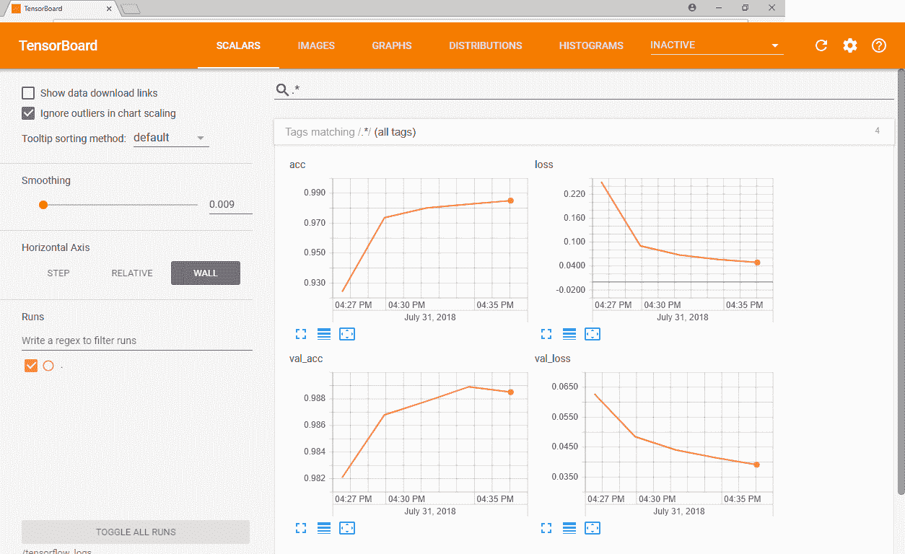
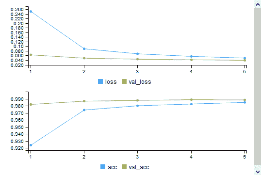
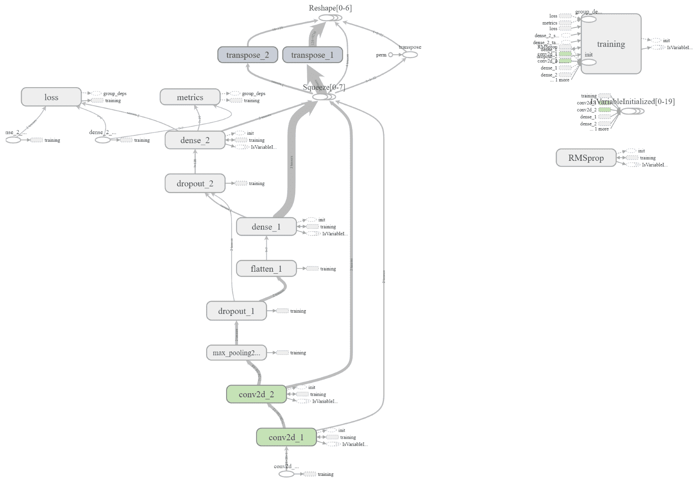
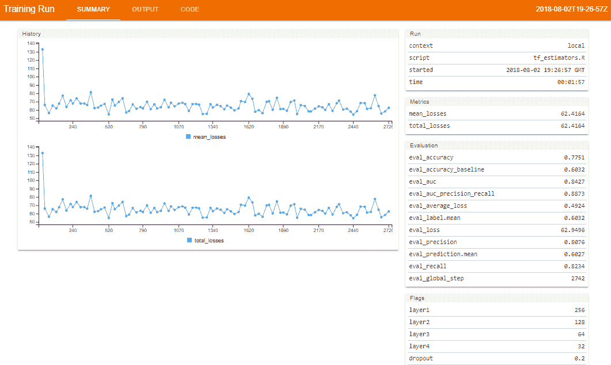
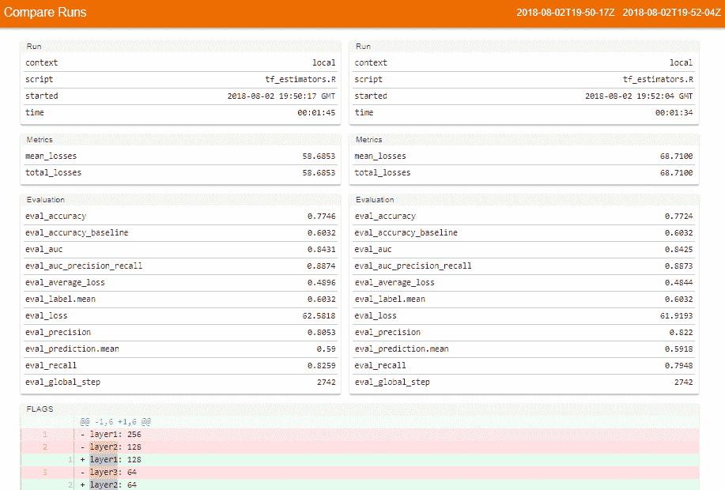

# 八、R 中使用 TensorFlow 的深度学习模型

这一章是关于在 r 中使用 TensorFlow 的。我们已经使用了 TensorFlow 相当多，因为 Keras 是一个高级神经网络 API，它使用 TensorFlow、CNTK 或 Theano。在 R 中，Keras 在后台使用 TensorFlow。TensorFlow 在开发深度学习模型方面难度更大。然而，TensorFlow 中有两个有趣的包可能会被忽略:TensorFlow 估计器和 TensorFlow 运行。我们将在本章中讨论这两个包。

在本章中，我们将讨论以下主题:

*   TensorFlow 简介
*   使用 TensorFlow 构建模型
*   TensorFlow 估计量
*   TensorFlow 运行包


# TensorFlow 库简介

**TensorFlow** 不仅仅是一个深度学习库，而是一种富有表现力的编程语言，可以对数据实现各种优化和数学变换。虽然它主要用于实现深度学习算法，但它可以执行更多。在 TensorFlow 中，程序表现为计算图，TensorFlow 中的数据存储在`tensors`中。一个**张量**是具有相同数据类型的数据数组，一个张量的秩是维数。因为张量中的所有数据必须具有相同的类型，所以它们更类似于 R 矩阵，而不是数据帧。

这里有一个各种等级张量的例子:

```r
library(tensorflow)

> # tensor of rank-0
> var1 <- tf$constant(0.1)
> print(var1)
Tensor("Const:0", shape=(), dtype=float32)

> sess <- tf$InteractiveSession()
T:\src\github\tensorflow\tensorflow\core\common_runtime\gpu\gpu_device.cc:1084] Created TensorFlow device (/job:localhost/replica:0/task:0/device:GPU:0 with 3019 MB memory) -> physical GPU (device: 0, name: GeForce GTX 1050 Ti, pci bus id: 0000:01:00.0, compute capability: 6.1)

> sess$run(tf$global_variables_initializer())
> var2 <- tf$constant(2.3)
> var3 = var1 + var2
> print(var1)
Tensor("Const:0", shape=(), dtype=float32)
 num 0.1

> print(var2)
Tensor("Const_1:0", shape=(), dtype=float32)
 num 2.3

> print(var3)
Tensor("Add:0", shape=(), dtype=float32)
 num 2.4

> # tensor of rank-1
> var4 <- tf$constant(4.5,shape=shape(5L))
> print(var4)
Tensor("Const_2:0", shape=(5,), dtype=float32)
 num [1:5(1d)] 4.5 4.5 4.5 4.5 4.5

> # tensor of rank-2
> var5 <- tf$constant(6.7,shape=shape(3L,3L))
> print(var5)
Tensor("Const_3:0", shape=(3, 3), dtype=float32)
 num [1:3, 1:3] 6.7 6.7 6.7 6.7 6.7 ...
```

TensorFlow 程序有两个部分。首先，你必须建立计算图，它包含张量和对这些张量的运算。当他们定义了图形后，第二部分是创建一个 TensorFlow 会话来运行图形。在前面的例子中，我们第一次打印出张量`a`的值，我们只得到张量定义而没有得到值。我们所做的就是定义计算图的一部分。只有当我们调用`tf$InteractiveSession`时，我们才告诉 TensorFlow 在张量上运行操作。一个会话负责运行计算图。

TensorFlow 程序之所以被称为图形，是因为代码可以被构造为图形。这对我们来说可能并不明显，因为我们在本书中构建的大多数深度学习模型都是由层上的顺序操作组成的。在 TensorFlow(以及 Keras 和 MXNet)中，可以多次使用一个操作的输出，并在一个操作中组合输入。

随着深度学习模型变得越来越大，可视化和调试它们变得越来越困难。在一些代码块中，我们打印了显示各层的模型摘要，或者绘制了网络。然而，这两个工具对于调试一个有超过 1000 万个参数的模型中的问题都没有帮助！幸运的是，TensorFlow 附带了一个可视化工具，可以帮助总结、调试和修复 TensorFlow 程序。这被称为 TensorBoard，我们将在接下来讨论它。


# 使用 TensorBoard 可视化深度学习网络

TensorFlow 中的计算图可能非常复杂，因此有一个名为 **TensorBoard** 的可视化工具来可视化这些图形并协助调试。TensorBoard 可以绘制计算图，显示来自训练的指标，等等。由于 Keras 在后端使用 TensorFlow，它也可以使用 TensorBoard。这是来自 Keras 的启用了 TensorBoard 日志记录的 MNIST 示例。这个代码可以在`Chapter8/mnist_keras.R`文件夹中找到。代码的第一部分加载数据，预处理数据，并定义模型架构。希望您在这个阶段对此应该很熟悉:

```r
library(keras)

mnist_data <- dataset_mnist()
xtrain <- array_reshape(mnist_data$train$x,c(nrow(mnist_data$train$x),28,28,1))
ytrain <- to_categorical(mnist_data$train$y,10)
xtrain <- xtrain / 255.0

model <- keras_model_sequential()
model %>%
  layer_conv_2d(filters=32,kernel_size=c(5,5),activation='relu',
                input_shape=c(28,28,1)) %>% 
  layer_max_pooling_2d(pool_size=c(2,2)) %>% 
  layer_dropout(rate=0.25) %>% 
  layer_conv_2d(filters=32,kernel_size=c(5,5),activation='relu') %>% 
  layer_max_pooling_2d(pool_size=c(2,2)) %>% 
  layer_dropout(rate=0.25) %>% 
  layer_flatten() %>% 
  layer_dense(units=256,activation='relu') %>% 
  layer_dropout(rate=0.4) %>% 
  layer_dense(units=10,activation='softmax')

model %>% compile(
  loss=loss_categorical_crossentropy,
  optimizer="rmsprop",metrics="accuracy"
)
```

要启用日志记录，请在`model.fit`函数中添加一个`callbacks`参数，告诉 Keras/TensorFlow 将事件记录到一个目录中。以下代码将日志数据输出到`/tensorflow_logs`目录:

```r
model %>% fit(
  xtrain,ytrain,
  batch_size=128,epochs=10,
 callbacks=callback_tensorboard("/tensorflow_logs",
 histogram_freq=1,write_images=0),
  validation_split=0.2
)
# from cmd line,run 'tensorboard --logdir /tensorflow_logs'
```

**Warning**: The event logs can take up a lot of space. For 5 epochs on the `MNIST` dataset, 1.75 GB of information was created. Most of this was because of the image data that was included, so you may consider setting `write_images=0` to reduce the size of the logs.

TensorBoard 是一个 web 应用程序，您必须启动 TensorBoard 程序才能运行。当模型完成训练后，按照以下步骤启动 TensorBoard web 应用程序:

1.  打开命令提示符并输入以下内容:

```r
$ tensorboard --logdir /tensorflow_logs
```

2.  如果 TensorBoard 成功启动，您应该会在命令提示符下看到类似以下内容的消息:

```r
TensorBoard 0.4.0rc2 at http://xxxxxx:6006 (Press CTRL+C to quit)
```

3.  打开 web 浏览器，找到提供的链接。该网页应类似于以下内容:



图 8.1:tensor board–模型指标

4.  前面的屏幕截图向我们展示了培训和验证测试集上的模型指标，这些指标类似于 RStudio 中在培训期间显示的指标:



图 8.2:r studio–模型指标

5.  如果您点击**图像**选项，您将能够可视化模型中的层，并查看它们如何随时代变化:


图 8.3:张量板——可视化模型层

6.  如果点击**图形**选项，将显示模型的计算图。您也可以将其作为图像文件下载。这是该模型的计算图:



图 8.4:张量板-计算图

其中一些似乎很熟悉。我们可以看到卷积层、最大池层、展平层、密集层和下降层。其余的就不那么明显了。作为一个更高层次的抽象，Keras 在创建计算图的过程中处理了大量的复杂性。

7.  通过点击**直方图**选项，您可以看到张量的分布是如何随时间变化的:


图 8.5:张量板——直方图

可以使用 TensorBoard 来调试模型。例如，可以研究消失梯度或爆炸梯度问题，以查看模型的权重是消失为零还是爆炸至无穷大。TensorBoard 还有更多的内容，所以如果你有兴趣的话，可以参考它的在线文档。

在下一节中，我们将使用 TensorFlow 建立一个回归模型和一个卷积神经网络。


# TensorFlow 模型

在本节中，我们将使用 TensorFlow 来构建一些机器学习模型。首先，我们将建立一个简单的线性回归模型，然后是一个卷积神经网络模型，类似于我们在[第五章](1c0b9897-b0cc-4a8f-9ce8-e6409c347f4f.xhtml)、*使用卷积神经网络进行图像分类*中看到的。

以下代码加载 TensorFlow 库。我们可以通过设置和访问一个常量字符串值来确认它加载成功:

```r
> library(tensorflow)

# confirm that TensorFlow library has loaded
> sess=tf$Session()
> hello_world <- tf$constant('Hello world from TensorFlow')
> sess$run(hello_world)
b'Hello world from TensorFlow'
```


# 使用 TensorFlow 的线性回归

在第一个 TensorFlow 示例中，我们将研究回归。该部分的代码在`Chapter8/regression_tf.R`文件夹中:

1.  首先，我们为一个输入值 *x* 和一个输出值 *y* 创建一些假数据。我们设定 *y* 大约等于`0.8 + x * 1.3`。我们希望应用程序发现`beta0`和`beta1`值，它们分别是`0.8`和`1.3`:

```r
library(tensorflow)

set.seed(42)
# create 50000 x variable between 0 and 100
x_var <- runif(50000,min=0,max=1)
#y = approx(1.3x + 0.8)
y_var <- rnorm(50000,0.8,0.04) + x_var * rnorm(50000,1.3,0.05)

# y_pred = beta0 + beta1 * x
beta0 <- tf$Variable(tf$zeros(shape(1L)))
beta1 <- tf$Variable(tf$random_uniform(shape(1L), -1.0, 1.0))
y_pred <- beta0 + beta1*x_var
```

2.  现在，我们设置我们的`loss`函数，以便梯度下降算法可以工作:

```r
# create our loss value which we want to minimize
loss <- tf$reduce_mean((y_pred-y_var)^2)
# create optimizer
optimizer <- tf$train$GradientDescentOptimizer(0.6)
train <- optimizer$minimize(loss)
```

3.  然后，我们设置一个 TensorFlow 会话并初始化变量。最后，我们可以运行图表:

```r
# create TensorFlow session and initialize variables
sess = tf$Session()
sess$run(tf$global_variables_initializer())

# solve the regression
for (step in 0:80) {
  if (step %% 10 == 0)
    print(sprintf("Step %1.0f:beta0=%1.4f, beta1=%1.4f",step,sess$run(beta0), sess$run(beta1)))
  sess$run(train)
}
[1] "Step 0:beta0=0.0000, beta1=-0.3244"
[1] "Step 10:beta0=1.0146, beta1=0.8944"
[1] "Step 20:beta0=0.8942, beta1=1.1236"
[1] "Step 30:beta0=0.8410, beta1=1.2229"
[1] "Step 40:beta0=0.8178, beta1=1.2662"
[1] "Step 50:beta0=0.8077, beta1=1.2850"
[1] "Step 60:beta0=0.8033, beta1=1.2932"
[1] "Step 70:beta0=0.8014, beta1=1.2967"
[1] "Step 80:beta0=0.8006, beta1=1.2983"
```

我们可以看到，模型设法找到了求解函数`y=beta0 + beta1*x`的`beta0`和`beta1`的值。下一节是一个更复杂的例子，我们将为图像分类建立一个 TensorFlow 模型。


# 使用 TensorFlow 的卷积神经网络

在本节中，我们将在 MNIST 数据集上构建一个 TensorFlow 模型。该代码与我们在第 5 章、*中看到的 Lenet 模型具有相似的层和参数，使用卷积神经网络进行图像分类*。然而，在 TensorFlow 中构建模型的代码比在 Keras 或 MXNet 中构建模型的代码更复杂。其中一个原因是程序员的工作是确保层的大小正确对齐。在 Keras/MXNet 模型中，我们可以在一条语句中改变一个层中的节点数。在 TensorFlow 中，如果我们改变一层中的节点数量，我们必须确保我们也改变下一层中的输入。

在某些方面，TensorFlow 中的编程更接近于我们在[第三章](6e6dd858-9f00-454a-8434-a95c59e85b25.xhtml)、*深度学习基础*中写的手写神经网络代码。在训练循环中与 Keras/MXNet 的另一个不同之处是，我们需要管理批处理而不仅仅是调用，要求迭代所有数据 *x* 次(其中 *x* 是一个 epoch)。这个例子的代码在`Chapter8/mnist_tf.R`文件夹中。首先，我们加载 Keras 包来获取 MNIST 数据，但是我们使用 TensorFlow 来训练模型。下面是代码的第一部分:

```r
library(RSNNS) # for decodeClassLabels
library(tensorflow)
library(keras)

mnist <- dataset_mnist()
set.seed(42)

xtrain <- array_reshape(mnist$train$x,c(nrow(mnist$train$x),28*28))
ytrain <- decodeClassLabels(mnist$train$y)
xtest <- array_reshape(mnist$test$x,c(nrow(mnist$test$x),28*28))
ytest <- decodeClassLabels(mnist$test$y)
xtrain <- xtrain / 255.0
xtest <- xtest / 255.0
head(ytrain)
     0 1 2 3 4 5 6 7 8 9
[1,] 0 0 0 0 0 1 0 0 0 0
[2,] 1 0 0 0 0 0 0 0 0 0
[3,] 0 0 0 0 1 0 0 0 0 0
[4,] 0 1 0 0 0 0 0 0 0 0
[5,] 0 0 0 0 0 0 0 0 0 1
[6,] 0 0 1 0 0 0 0 0 0 0
```

我们使用 RSNNS 库中的`decodeClassLabels`函数，因为 TensorFlow 需要一个虚拟编码矩阵，所以每个可能的类都表示为一个编码为 0/1 的列，如前面的代码输出所示。

在下一个代码块中，我们为模型中的输入和输出值创建一些占位符。我们还将输入数据整形为秩为 4 的张量，即 4 维数据结构。第一个维度(-1L)用于将被批量处理的记录。接下来的两个维度是图像文件的维度，最后一个维度是通道，这是颜色的数量。因为我们的图像是灰度的，所以只有一个通道。如果图像是彩色图像，将有 3 个通道。以下代码块创建占位符并重塑数据:

```r
# placeholders
x <- tf$placeholder(tf$float32, shape(NULL,28L*28L))
y <- tf$placeholder(tf$float32, shape(NULL,10L))
x_image <- tf$reshape(x, shape(-1L,28L,28L,1L))
```

接下来，我们将定义模型架构。我们将创建卷积模块，就像我们之前所做的那样。然而，还有很多值需要设置。例如，在第一个卷积层中，我们必须定义形状，初始化权重，并考虑偏差变量。下面是 TensorFlow 模型的代码:

```r
# first convolution layer
conv_weights1 <- tf$Variable(tf$random_uniform(shape(5L,5L,1L,16L), -0.4, 0.4))
conv_bias1 <- tf$constant(0.0, shape=shape(16L))
conv_activ1 <- tf$nn$tanh(tf$nn$conv2d(x_image, conv_weights1, strides=c(1L,1L,1L,1L), padding='SAME') + conv_bias1)
pool1 <- tf$nn$max_pool(conv_activ1, ksize=c(1L,2L,2L,1L),strides=c(1L,2L,2L,1L), padding='SAME')

# second convolution layer
conv_weights2 <- tf$Variable(tf$random_uniform(shape(5L,5L,16L,32L), -0.4, 0.4))
conv_bias2 <- tf$constant(0.0, shape=shape(32L))
conv_activ2 <- tf$nn$relu(tf$nn$conv2d(pool1, conv_weights2, strides=c(1L,1L,1L,1L), padding='SAME') + conv_bias2)
pool2 <- tf$nn$max_pool(conv_activ2, ksize=c(1L,2L,2L,1L),strides=c(1L,2L,2L,1L), padding='SAME')

# densely connected layer
dense_weights1 <- tf$Variable(tf$truncated_normal(shape(7L*7L*32L,512L), stddev=0.1))
dense_bias1 <- tf$constant(0.0, shape=shape(512L))
pool2_flat <- tf$reshape(pool2, shape(-1L,7L*7L*32L))
dense1 <- tf$nn$relu(tf$matmul(pool2_flat, dense_weights1) + dense_bias1)

# dropout
keep_prob <- tf$placeholder(tf$float32)
dense1_drop <- tf$nn$dropout(dense1, keep_prob)

# softmax layer
dense_weights2 <- tf$Variable(tf$truncated_normal(shape(512L,10L), stddev=0.1))
dense_bias2 <- tf$constant(0.0, shape=shape(10L))

yconv <- tf$nn$softmax(tf$matmul(dense1_drop, dense_weights2) + dense_bias2)
```

现在，我们必须定义损失方程，定义要使用的优化器(Adam)，并定义准确性指标:

```r
cross_entropy <- tf$reduce_mean(-tf$reduce_sum(y * tf$log(yconv), reduction_indices=1L))
train_step <- tf$train$AdamOptimizer(0.0001)$minimize(cross_entropy)
correct_prediction <- tf$equal(tf$argmax(yconv, 1L), tf$argmax(y, 1L))
accuracy <- tf$reduce_mean(tf$cast(correct_prediction, tf$float32))
```

最后，我们可以在 10 个时期内训练模型。然而，一个复杂的问题仍然存在，因此我们必须手动管理批次。我们得到要训练的批次数量，并依次加载它们。如果我们的训练数据集中有 60，000 个图像，则每个时期有 469 个批次(60，000/128 = 468.75，向上取整为 469)。我们输入每一批，每 100 批输出一次指标:

```r
sess <- tf$InteractiveSession()
sess$run(tf$global_variables_initializer())

# if you get out of memory errors when running on gpu
# then lower the batch_size
batch_size <- 128
batches_per_epoch <- 1+nrow(xtrain) %/% batch_size
for (epoch in 1:10)
{
  for (batch_no in 0:(-1+batches_per_epoch))
  {
    nStartIndex <- 1 + batch_no*batch_size
    nEndIndex <- nStartIndex + batch_size-1
    if (nEndIndex > nrow(xtrain))
      nEndIndex <- nrow(xtrain)
    xvalues <- xtrain[nStartIndex:nEndIndex,]
    yvalues <- ytrain[nStartIndex:nEndIndex,]
    if (batch_no %% 100 == 0) {
      batch_acc <- accuracy$eval(feed_dict=dict(x=xvalues,y=yvalues,keep_prob=1.0))
      print(sprintf("Epoch %1.0f, step %1.0f: training accuracy=%1.4f",epoch, batch_no, batch_acc))
    }
    sess$run(train_step,feed_dict=dict(x=xvalues,y=yvalues,keep_prob=0.5))
  }
  cat("\n")
}
```

以下是第一个时期的输出:

```r
[1] "Epoch 1, step 0: training accuracy=0.0625"
[1] "Epoch 1, step 100: training accuracy=0.8438"
[1] "Epoch 1, step 200: training accuracy=0.8984"
[1] "Epoch 1, step 300: training accuracy=0.9531"
[1] "Epoch 1, step 400: training accuracy=0.8750"
```

训练完成后，我们可以通过计算测试集上的准确度来评估模型。同样，我们必须分批执行此操作，以防止出现内存不足的错误:

```r
# calculate test accuracy
# have to run in batches to prevent out of memory errors
batches_per_epoch <- 1+nrow(xtest) %/% batch_size
test_acc <- vector(mode="numeric", length=batches_per_epoch)
for (batch_no in 0:(-1+batches_per_epoch))
{
  nStartIndex <- 1 + batch_no*batch_size
  nEndIndex <- nStartIndex + batch_size-1
  if (nEndIndex > nrow(xtest))
    nEndIndex <- nrow(xtest)
  xvalues <- xtest[nStartIndex:nEndIndex,]
  yvalues <- ytest[nStartIndex:nEndIndex,]
  batch_acc <- accuracy$eval(feed_dict=dict(x=xvalues,y=yvalues,keep_prob=1.0))
  test_acc[batch_no+1] <- batch_acc
}
# using the mean is not totally accurate as last batch is not a complete batch
print(sprintf("Test accuracy=%1.4f",mean(test_acc)))
[1] "Test accuracy=0.9802"
```

我们得到最终精度`0.9802`。如果我们将此代码与第五章、中的[、*使用卷积神经网络的图像分类中的 MNIST 示例进行比较，TensorFlow 代码更冗长，也更容易出错。我们确实可以看到使用更高级别的抽象的好处，比如 MXNet 或 Keras(可以使用 TensorFlow 作为后端)。对于大多数深度学习用例，尤其是使用现有层作为构建块来构建深度学习模型，在 TensorFlow 中开发代码几乎没有什么收获。对于这些用例，使用 Keras 或 MXNet 更简单、更高效。*](1c0b9897-b0cc-4a8f-9ce8-e6409c347f4f.xhtml)

看到这段代码后，您可能想回到 Keras 和 MXNet 中更熟悉的内容。然而，下一节将着眼于 TensorFlow 估计器和 TensorFlow 运行，这是您应该知道的两个有用的包。


# TensorFlow 估计器和 TensorFlow 运行包

TensorFlow 估计器和 TensorFlow runs 包是用于深度学习的很好的包。在本节中，我们将使用这两个工具，根据第四章[、*训练深度预测模型*中的流失预测数据来训练模型。](28315a07-2bf0-45c8-8e6f-0e4f01616ca3.xhtml)


# TensorFlow 估计量

**TensorFlow 估算器**允许您使用更简单的 API 接口构建 TensorFlow 模型。在 R 中，`tfestimators`包允许你调用这个 API。有不同的模型类型，包括线性模型和神经网络。以下是可用的估计值:

*   `linear_regressor()`用于线性回归
*   `linear_classifier()`进行线性分类
*   `dnn_regressor()`用于深度神经网络回归
*   `dnn_classifier()`用于深度神经网络分类
*   `dnn_linear_combined_regressor()`用于深度神经网络的线性组合回归
*   `dnn_linear_combined_classifier()`用于深度神经网络的线性组合分类

估计器在创建深度学习模型时隐藏了很多细节，包括构建图表、初始化变量和层，它们也可以与 TensorBoard 集成。更多细节可在[https://tensorflow.rstudio.com/tfestimators/](https://tensorflow.rstudio.com/tfestimators/)获得。我们将使用`dnn_classifier`和来自[第四章](28315a07-2bf0-45c8-8e6f-0e4f01616ca3.xhtml)、*的二元分类任务的数据训练深度预测模型*。`Chapter8/tf_estimators.R`文件夹中的以下代码演示了 TensorFlow 估计器。

1.  我们仅包含特定于 TensorFlow 估算器的代码，并省略加载数据并将其分为训练和测试数据的文件开头的代码:

```r
response <- function() "Y_categ"
features <- function() predictorCols

FLAGS <- flags(
  flag_numeric("layer1", 256),
  flag_numeric("layer2", 128),
  flag_numeric("layer3", 64),
  flag_numeric("layer4", 32),
  flag_numeric("dropout", 0.2)
)
num_hidden <- c(FLAGS$layer1,FLAGS$layer2,FLAGS$layer3,FLAGS$layer4)

classifier <- dnn_classifier(
  feature_columns = feature_columns(column_numeric(predictorCols)),
  hidden_units = num_hidden,
  activation_fn = "relu",
  dropout = FLAGS$dropout,
  n_classes = 2
)

bin_input_fn <- function(data)
{
 input_fn(data, features = features(), response = response())
}
tr <- train(classifier, input_fn = bin_input_fn(trainData))
[\] Training -- loss: 22.96, step: 2742 

tr
Trained for 2,740 steps. 
Final step (plot to see history):
 mean_losses: 61.91
total_losses: 61.91
```

2.  模型定型后，以下代码将绘制定型和验证指标:

```r
plot(tr)
```

3.  这会产生以下情节:


图 8.6:为 TensorFlow 估算模型训练损失图

4.  代码的下一部分调用`evaluate`函数来为模型产生度量:

```r
# predictions <- predict(classifier, input_fn = bin_input_fn(testData))
evaluation <- evaluate(classifier, input_fn = bin_input_fn(testData))
[-] Evaluating -- loss: 37.77, step: 305

for (c in 1:ncol(evaluation))
 print(paste(colnames(evaluation)[c]," = ",evaluation[c],sep=""))
[1] "accuracy = 0.77573162317276"
[1] "accuracy_baseline = 0.603221416473389"
[1] "auc = 0.842994153499603"
[1] "auc_precision_recall = 0.887594640254974"
[1] "average_loss = 0.501933991909027"
[1] "label/mean = 0.603221416473389"
[1] "loss = 64.1636199951172"
[1] "precision = 0.803375601768494"
[1] "prediction/mean = 0.562777876853943"
[1] "recall = 0.831795573234558"
[1] "global_step = 2742"
```

我们可以看到，我们获得了`77.57%`的精度，这实际上与我们在第 4 章、*训练深度预测模型*的[MXNet 模型上获得的精度几乎相同，这两个模型具有相似的架构。`dnn_classifier()`函数隐藏了很多细节，因此 TensorFlow 估计器是使用 TensorFlow 处理结构化数据任务的好方法。](28315a07-2bf0-45c8-8e6f-0e4f01616ca3.xhtml)

使用 TensorFlow 估算器创建的模型可以保存到磁盘上，以后再加载。`model_dir()`函数显示了模型工件保存的位置(通常在`temp`目录中，但是也可以复制到其他地方):

```r
model_dir(classifier)
"C:\\Users\\xxxxxx\\AppData\\Local\\Temp\\tmpv1e_ri23"
# dnn_classifier has a model_dir parameter to load an existing model
?dnn_classifier
```

模型工件中包括 TensorBoard 可以使用的事件日志。例如，当我加载 TensorBoard 并将其指向`temp`目录中的 logs 目录时，我可以看到创建的 TensorFlow 图:


图 8.7:TensorFlow 估算模型使用张量板的图形


# TensorFlow 跑步包

`tfruns`包是一组用于管理深度学习模型的不同训练运行的实用程序。它可以用作使用不同超参数建立多个深度学习模型的框架。它可以跟踪每次训练运行的超参数、指标、输出和源代码，并允许您比较最佳模型，以便您可以看到训练运行之间的差异。这使得超参数调整更加容易，并且可以用于任何`tfestimator`型号或`Keras`型号。欲了解更多详情，请访问[https://tensor flow . r studio . com/tools/TF runs/articles/overview . html](https://tensorflow.rstudio.com/tools/tfruns/articles/overview.html)。

以下代码在`Chapter8/hyperparams.R`文件夹中，也使用了我们在*TensorFlow 估算器*部分(`Chapter8/tf_estimators.R`)中使用的脚本:

```r
library(tfruns)
# FLAGS <- flags(
# flag_numeric("layer1", 256),
# flag_numeric("layer2", 128),
# flag_numeric("layer3", 64),
# flag_numeric("layer4", 32),
# flag_numeric("dropout", 0.2),
# flag_string("activ","relu")
# )

training_run('tf_estimators.R')
training_run('tf_estimators.R', flags = list(layer1=128,layer2=64,layer3=32,layer4=16))
training_run('tf_estimators.R', flags = list(dropout=0.1,activ="tanh"))
```

这将使用不同的超级参数运行`Chapter8/tf_estimators.R`脚本。第一次，我们不改变任何超参数，所以它使用包含在`Chapter8/tf_estimators.R`中的默认值。每次使用分类脚本训练一个新模型时，它被称为一个**训练 r**un，训练运行的细节被存储在当前工作目录的`runs`文件夹中。

对于每次跑步训练，都会弹出一个新网站，提供跑步的详细信息，如下图所示:



图 8.8: TensorFlow 训练跑步–总结屏幕

我们可以在图中看到训练的进度，以及训练运行发生的时间和评估指标的细节。我们还可以在右下角看到，在训练运行中使用的**标志**(即超参数)也被显示出来。R 代码输出有另一个选项卡，它包括内部文件(`Chapter8/tf_estimators.R`)中 R 代码的所有输出，包括绘图。

所有训练运行完成后，以下代码显示了所有训练运行的摘要:

```r
ls_runs(order=eval_accuracy)
ls_runs(order=eval_accuracy)[,1:5]
Data frame: 3 x 5 
                    run_dir eval_accuracy eval_accuracy_baseline eval_auc eval_auc_precision_recall
3 runs/2018-08-02T19-50-17Z        0.7746                 0.6032   0.8431                    0.8874
2 runs/2018-08-02T19-52-04Z        0.7724                 0.6032   0.8425                    0.8873
1 runs/2018-08-02T19-53-39Z        0.7711                 0.6032   0.8360                    0.8878
```

在这里，我们按`eval_accuracy`列对结果进行了排序。如果您关闭显示训练运行摘要的窗口，您可以通过调用`view_run`函数并传入文件夹名称来再次显示它。例如，要显示最佳训练运行的摘要，请使用以下代码:

```r
dir1 <- ls_runs(order=eval_accuracy)[1,1]
view_run(dir1)
```

最后，还可以对比两次跑步。这里，我们比较两个最佳模型:

```r
dir1 <- ls_runs(order=eval_accuracy)[1,1]
dir2 <- ls_runs(order=eval_accuracy)[2,1]
compare_runs(runs=c(dir1,dir2))
```

这将打开一个类似如下的页面:



图 8.9:比较两次 TensorFlow 运行

该页面显示了两次训练运行的评估指标，还显示了所使用的超参数。正如我们所见，这使得管理调整深度学习模型的过程变得更加容易。这种超参数调整方法具有自动记录、可追溯性，并且很容易比较不同组的超参数。您可以看到用于训练跑步的指标和不同的超参数。没有更多的比较配置文件来尝试和匹配超参数设置输出日志！相比之下，我为第七章、*中的 NLP 示例的超参数选择编写的代码，使用深度学习的自然语言处理*，相比之下显得粗糙


# 摘要

在本章中，我们开发了一些 TensorFlow 模型。我们看了 TensorBoard，这是一个可视化和调试深度学习模型的伟大工具。我们使用 TensorFlow 建立了几个模型，包括一个基本的回归模型和一个用于计算机视觉模型的 Lenet 模型。从这些例子中，我们看到 TensorFlow 中的编程比我们在本书其他地方使用的高级 API(MXNet 和 Keras)更复杂，也更容易出错。

然后我们开始使用 TensorFlow 估算器，这是一个比使用 TensorFlow 更容易的接口。然后我们在另一个名为 **tfruns** 的包中使用了这个脚本，它代表 TensorFlow runs。这个包允许我们每次用不同的标志调用 TensorFlow 估计器或 Keras 脚本。我们将此用于超参数选择、运行和评估多个模型。TensorFlow 运行与 RStudio 完美集成，我们能够查看每次运行的摘要，并比较运行，以了解所用指标和超参数的差异。

在下一章，我们将看看嵌入和自编码器。我们已经在[第 7 章](03f666ab-60ce-485a-8090-c158b29ef306.xhtml)、*使用深度学习的自然语言处理*中看到了嵌入，因此在下一章我们将看到嵌入如何创建数据的低级编码。我们还将使用训练自编码器，它创建这些嵌入。我们将使用自编码器进行异常检测和协同过滤(推荐系统)。